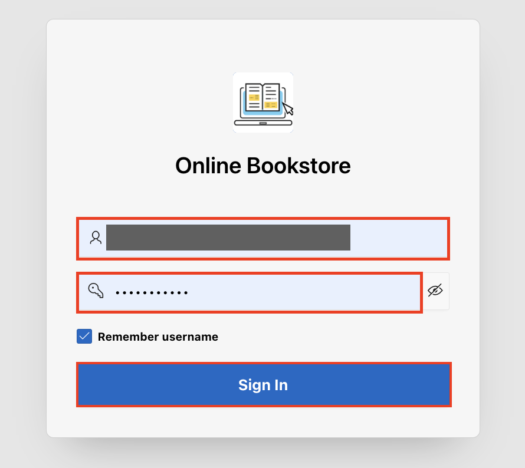

# Create the application

## Introduction

In this lab, you create a new application named **Online Bookstore**. Next, you rapidly design and prototype data models using a markdown-like shorthand syntax that expands to standards-based Oracle SQL known as Quick SQL in Oracle APEX.

**Quick SQL** is designed to reduce the time and effort required to create SQL tables, triggers, and index structures. This tool is not designed to be a replacement for data modeling. Instead, Quick SQL is simply a quick way to develop a script for simple tables and views.

Estimated Time: 5 minutes

### Objectives

In this lab, you will:

- Create an APEX Application

- Load Quick SQL

## Task 1: Create an Application

In this lab, you create a simple application with one click called **Online Bookstore**. This option creates an application which contains only a Global Page, Home page, and Login page.

1. On the Workspace home page, click the App Builder.

   

2. Click **Create** or **Create a New App**.

    

3. For Name, Enter **Online Bookstore** and click **Create application**.

    

4. To edit application icon, click **Shared Components**.

    

5. Under **User Interface**, select **User Interface Attributes**.

    

6. Click **Change Icon**.

    

7. In the Edit Application Icon dialog you can either:
    - **Upload an icon**: Click the plus (+) sign and navigate to the icon, or drag and drop the icon to the Upload your own icon region.

    If you upload a custom icon, it is resized to a number of sizes and will be propagated to the appropriate places at runtime.

    - **Select an icon from the library**: Select the icon color and then the icon.

    In this lab, I uploaded an icon from my device. After uploading, it can be adjusted or cropped.

    After making all changes, click **Save Icon**.

    
    

8. To view the application, click **Run** and enter your workspace credentials to log in.

     
     

## Task 2: Load Quick SQL

1. Select **SQL Workshop > Utilities > Quick SQL**.

    

2. Copy and paste the given code in the Quick SQL column and click **Review and Run**.

    ```
    <copy>
    OBS_Users
      user_id num /pk
      username  /nn /unique
      email  /nn /unique
      password
      full_name
      address
      profile_pic blob
      mime_type
      is_admin
      picture_url

    OBS_Books
      book_id num /pk
      price num /nn
      title  /nn
      author /nn
      category
      discount num /nn
      buy_links
      publisher
      book_image
      contributor
      description
      book_quantity num /nn
      object_det
      available_yn  /nn /default Y
      text_det

    OBS_Orders
      order_id num /pk
      user_id num /fk OBS_Users /cascade
      order_no
      order_datetime timestamp
      payment_id vc
      razorpay_id vc

    OBS_Order_Items
      Order_item_id num /pk
      order_id num /fk OBS_Orders /cascade
      book_id num /fk OBS_Books /cascade
      added_time  timestamp
      added_date date
      price num
      seq_no num
      quantity num
      discount num

    OBS_Unverified_Users
      user_id num /pk
      email

    OBS_Wishlist
      wishlist_id num /pk
      user_id num /fk OBS_Users /cascade
      book_id num /fk OBS_Books /cascade
    </copy>
    ```

    

3. Enter Script Name - **OBS Tables** and click **Run**.

    

4. Review the summary and click **Run Now**.

   

5. We can see that 11 statements were run successfully.

   

## Summary

You now know how to create an application along with editing an icon of the application. Also, you now know how to load a Quick SQL using shorthand syntax. You may now **proceed to the next lab**.

## Acknowledgements

- **Author**: Pankaj Goyal, Member Technical Staff
- **Last Updated By/Date**: Pankaj Goyal, Member Technical Staff, Aug 2024
