# Create and Manage User Profile Pages

## Introduction

This lab focuses on guiding you through creating and managing user profile pages. The tasks will cover various aspects of page creation, customization, and linking, as well as using SQL queries, RESTful services, and form handling. By the end of this lab, you will have developed a fully functional user profile page that includes personal details, book lists, and functionalities for updating profiles and resetting passwords.

Estimated Time: 20 minutes

### Objectives

- Create a User Profile Page
- Add Navigation bar Entries to include links to the user profile and other pages.
- Create and manage forms to update user details and reset passwords.
- Implement RESTful Services to handle user profile pictures and integrate these services into the application.

## Task 1: Creating a Profile Page with a Book List

This task provides step-by-step instructions for creating a profile page displaying a book list. The profile page will be built from scratch, starting with a blank page and adding a series of regions and sub-regions to effectively organize and display the data. By following these steps, you will learn how to configure page properties, create regions for content display, and integrate an SQL query to populate the book list dynamically. This process will culminate in a user-friendly interface where users can view their book details and purchase links directly from their profile page.

1. Navigate to the application homepage by clicking the **Application ID**.

    

2. Click **Create Page**. 

    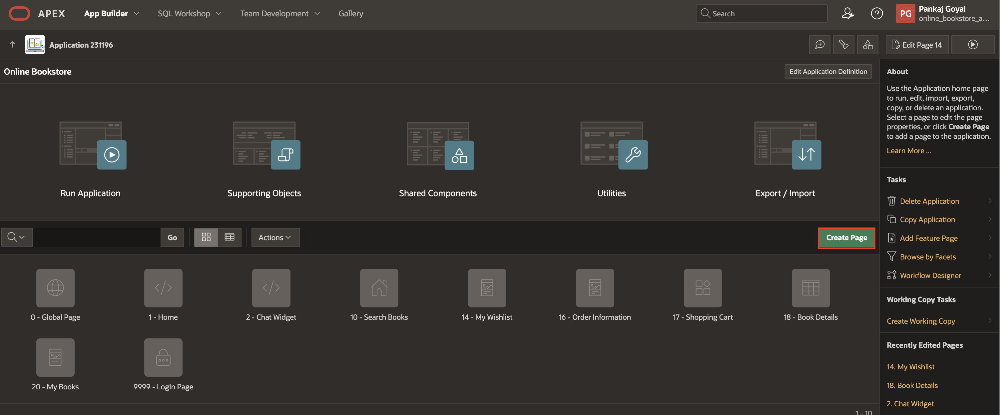

3. Select **Blank Page**.

    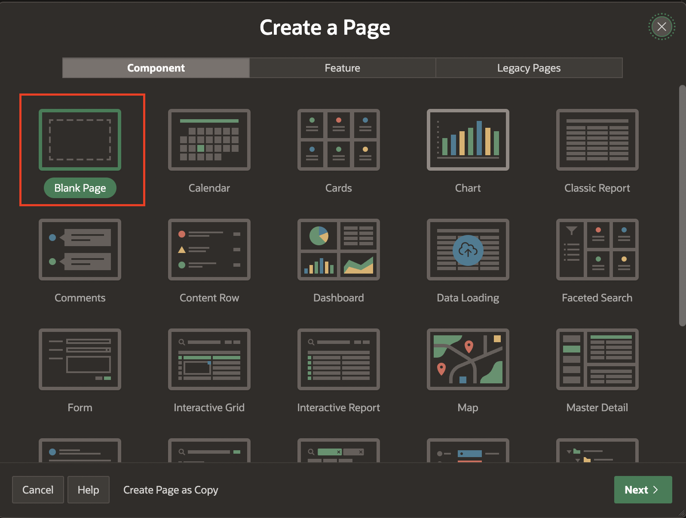

4. Enter/select the following:

    - Under Identification:

        - Page Number: **15010**

        - Name: **Profile**

    - Under Navigation:

        - Use Breadcrumb: **Toggle Off**

        - Use Navigation: **Toggle Off**

    Click **Create Page**.

    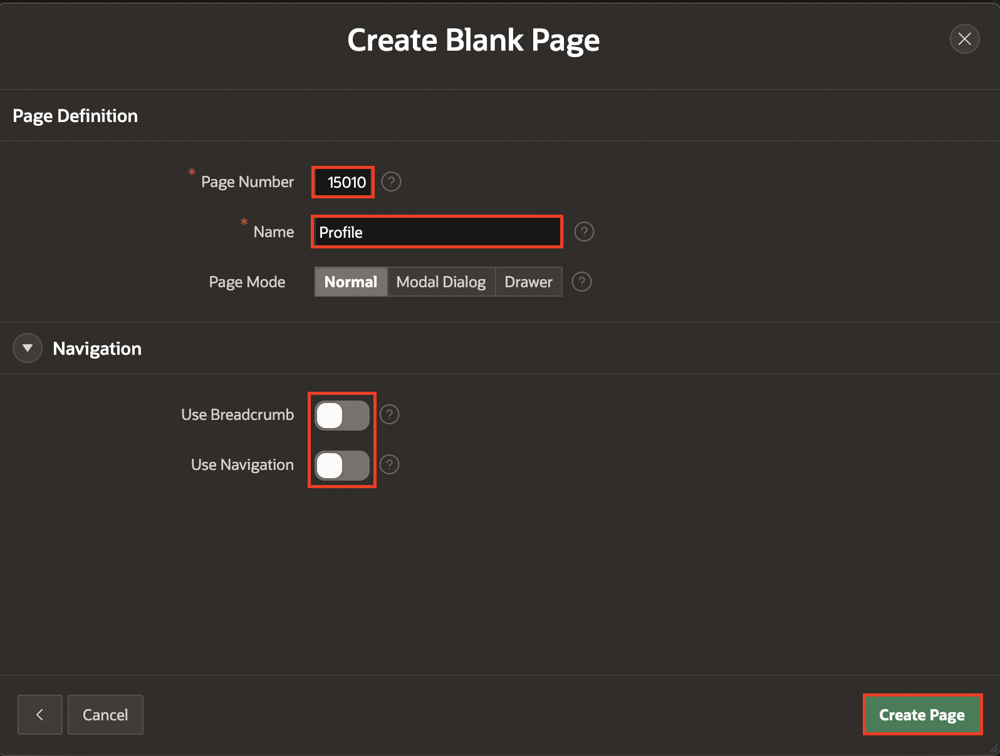

5. Select **Page 15010: Profile** and in the Property Editor update Cursor Focus: **First item on page** under **Navigation**.

    

6. Right-click **Body** and select **Create Region**.

    

7. In the Property Editor, enter/select the following:

    - Under Identification > Name: **My Details**

    - Under Appearance:

        - Template: **Content Block**

        - Template Options: Click **Use Template Defaults, Large**

            - Add Body Padding: **Check**

            - Body Style: **Light Background**

            Click **OK**.

    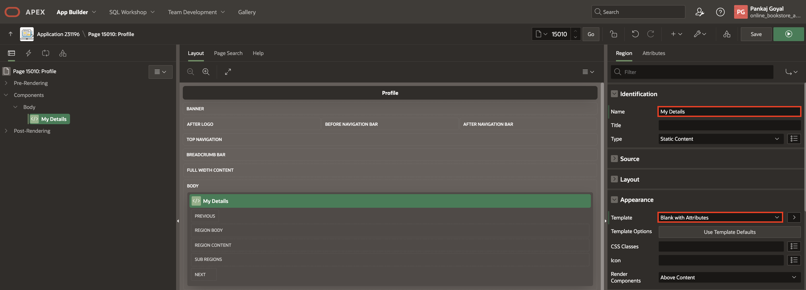

8. Right-click **My Details** and select **Create Sub Region**.

    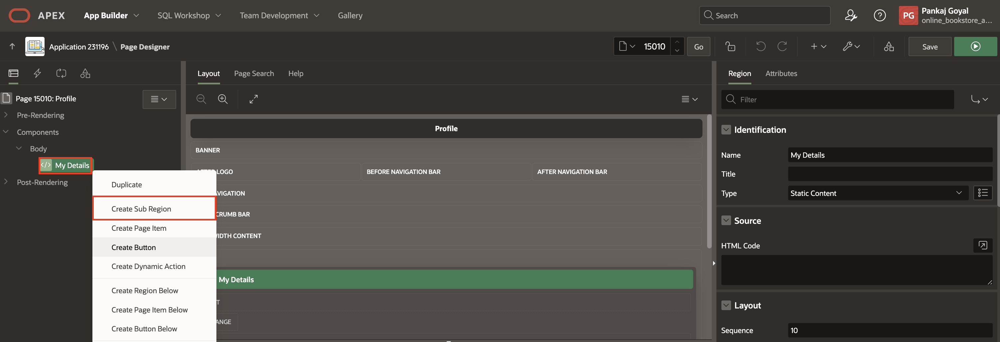

9. In the property editor, enter/select the following:

    - Under Identification:

        - Name: **My Books**

        - Type: **Media List**

    - Under Source:

        - Type: **SQL Query**

        - SQL Query: Copy and paste the below code:

        ```
        <copy>
        select  distinct
            oi.book_id as book_id,
            bi.book_image as book_image,
            bi.buy_links as buy_links,
            bi.title as title,
            oi.price as price,
            bi.description as description,
            COUNT(*) OVER (PARTITION BY oi.book_id) AS quantity
        from obs_order_items oi, obs_books bi, obs_orders o
        where o.order_id = oi.order_id and o.user_id = :USER_ID
            and oi.book_id(+) = bi.book_id;
        </copy>
        ```

    - Under Layout > Start New Row: **Toggle Off**

    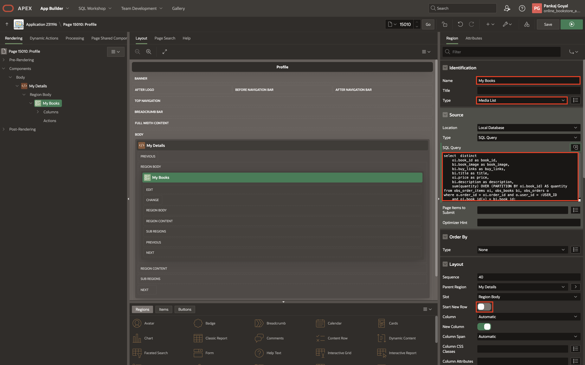

    - Under Appearance:

        - Template: **Content Block**  

        - Template Options: Click **Use Template Defaults**

            - Heading font: **Alternative**

            Click **OK**.

    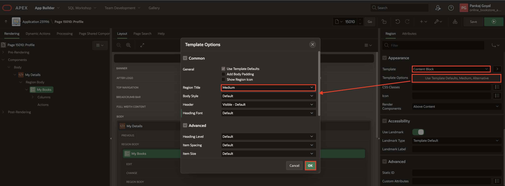

10. Navigate to **Attributes**, enter/select the following:

    - Under Settings:

        - Title: **TITLE**

        - Display Avatar: **Toggle On**

        - Display Badge: **Toggle On**

        - Layout: **2 Column grid**

        - Size: **Large**

    - Under Avatar:

        - Type: **Image**

        - Image:

            - Source: **URL**

            - URL: **&BOOK_IMAGE.**

          Click **OK**

        - Shape: **Square**

    - Under Badge:

        - Label: **&QUANTITY.**

        - Value: **QUANTITY**

    

11. Click **Save**.

<!-- 11. Under **My Books** region, right-click **Actions** and select **Create Action**.

    

12. In the Property Editor, enter/select the following:

    - Under Identification > Position: **Link**

    - Under Link:

        - Type: **Redirect to URL**

        - Target > URL: **&BUY_LINKS.**

          Click **OK**.

        - Link Attributes: **target="_blank"**

    

13. Click **Save**. -->

## Task 2: Configure Navigation Bar Entries for User Profiles

In this task, you set up entries for authenticated and public users, create a login entry, and link to a profile page.

1. Navigate to **Shared Components**.

    

2. Under Navigation and Search, click **Navigation Bar List**.

     

3. Click **Navigation Bar**.

    

4. Edit **&APP_USER.** and update the following:

    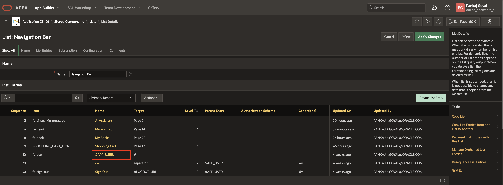

    - Under Entry:

        - Sequence: **20**

        - Image/Class: Remove **fa-user**

        - List Entry Label: **&USERNAME.**

    - Conditions > Condition Type: **User is Authenticated(not public)**

    Click **Apply Changes**.

    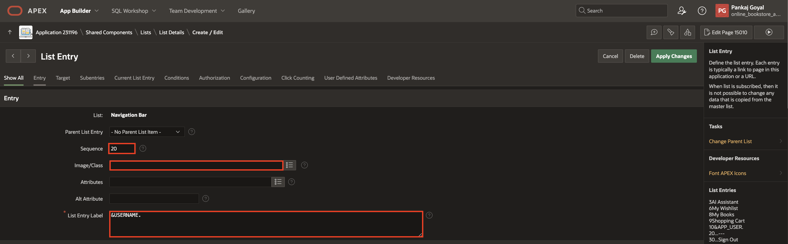

    

5. Click **Create Entry**.

    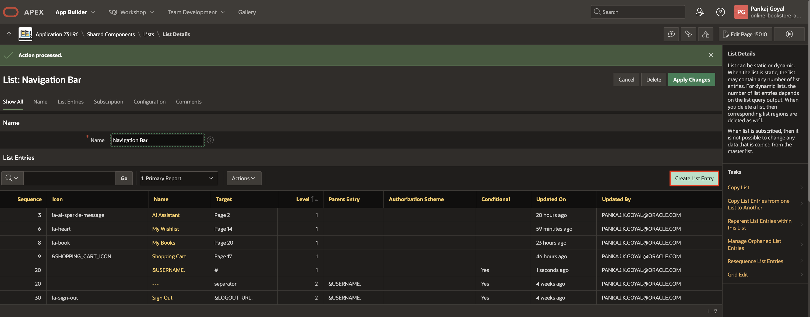

6. Enter/select the following:

    - Under Entry:

        - Sequence: **12**

        - Image/Class: **fa-user**

        - List Entry Label: **Login**

    - Target > Page: **9999**

    - Conditions > Condition Type: **User is the Public user (user has not authenticated)**

    Click **Create and Create Another**.

    

    

7. Enter/select the following:

    - Under Entry:

        - Parent List Entry: **&USERNAME.**

        - Sequence: **12**

        - Image/Class: **fa-user**

        - List Entry Label: **My Profile**

    - Under Target:

        - Page: **15010**

        - Clear Cache: **15010**

    - Authorization > Authorization Scheme: **Must Not be Public User**

    - User Defined Attributes > List Item CSS Classes: **icon-only**

    Click **Create List Entry**.

    

    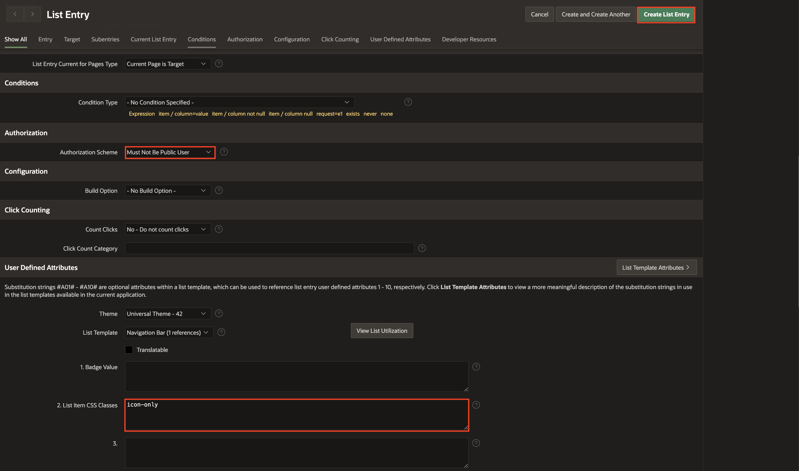

8. Navigate to the application homepage by clicking **Application ID**.

    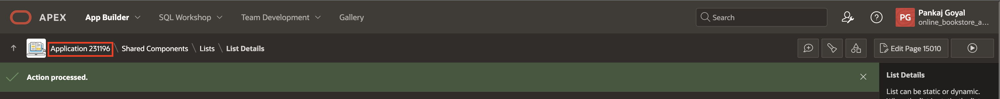

9. Select **10 - Search Books**

    

10. Under Security > Authentication: **Page is Public**

    

11. Click **Save**.

## Task 3: Create and Configure the Update Current User Page

In this task, you will learn how to create and configure a page to update the current user's profile within an application. You will have a functional "Update Current User" page that allows users to update their profile details, including username, email, and profile picture.

1. On page designer toolbar, navigate to **(+ v)** and click **Page**.

    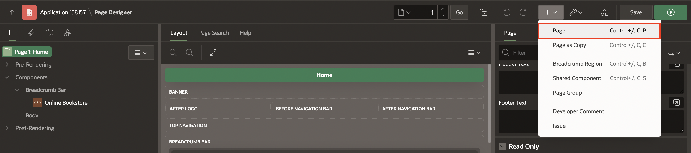

2. Click **Blank Page**.

    

3. Under Page Definition, enter/select the following:

    - Page Number: **26**

    - Name: **Update Current User**

    - Page Mode: **Modal Dialog**

     Click **Create Page**.

    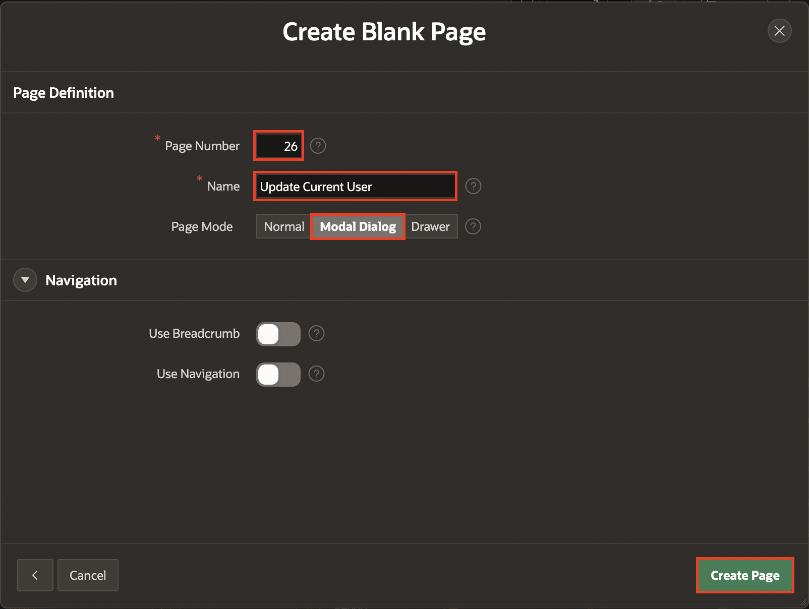

4. In the property editor, under **Navigation** > Warn on Unsaved Changes: **Toggle Off**

    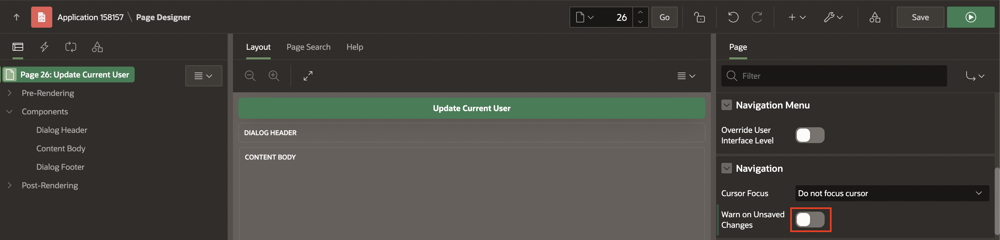

5. Right-click **Content Body** and select **Create Region**.

    

6. In the property editor, enter/select the following:

    - Under Identification:

        - Name: **Update Current User**

        - Type: **Form**

    - Under Source > Table name: **OBS\_USERS**

    - Under Appearance > Template: **Blank with Attributes**

   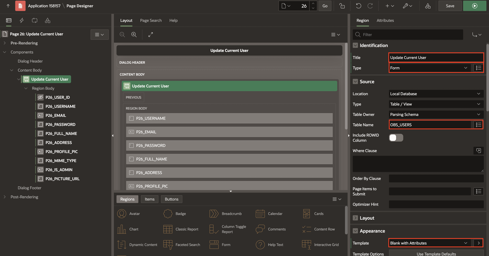

7. Under **Update Current User**, expand **Columns**. Right-click **P26\_MIME\_TYPE** and **P26\_PICTURE\_URL** and select **Delete**.

    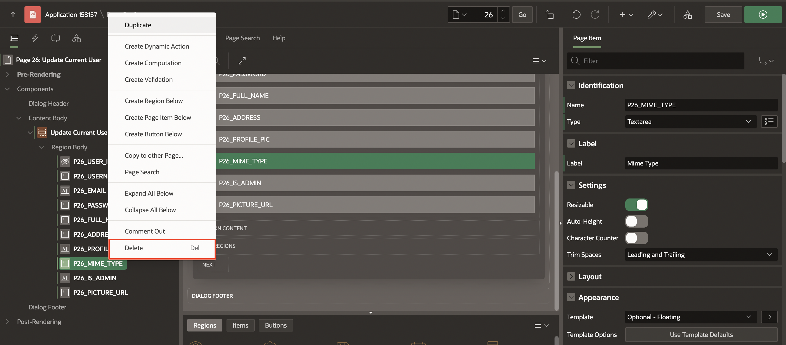

8. Select **P26\_USER\_ID**, Under Source > Query Only: **Toggle Off**.

    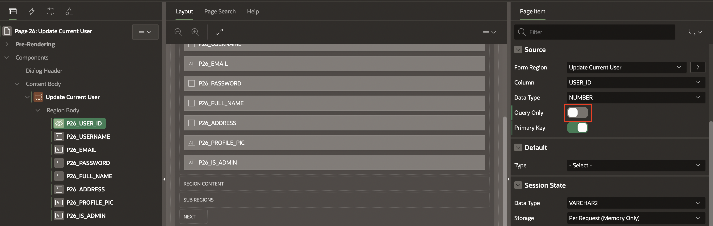

9. Select **P26\_EMAIL**, under Identification > Type: **Display Only** 

10. Select **P26\_USERNAME** and **P26\_FULL\_NAME**, under Identification > Type: **Text Field**.

    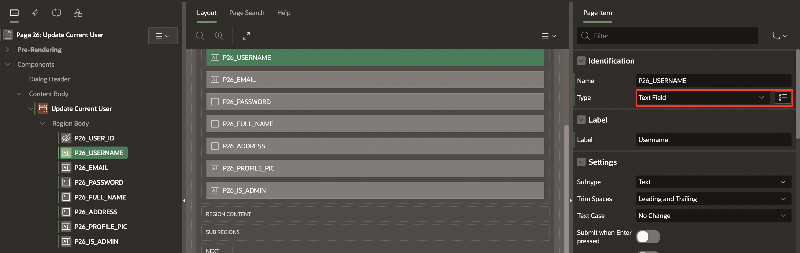

11. Select **P26\_PASSWORD** and **P26\_IS\_ADMIN**, under Identification > Type: **Hidden**.

12. Select **P26\_PROFILE\_PIC** and enter/select the following:

    - Under Identification > Type: **Image Upload**

    - Under Storage > Mime Type Column: **MIME_TYPE**

    - Under Cropping:

        - Allow Cropping: **Toggle On**

        - Aspect Ratio: **1:1**

    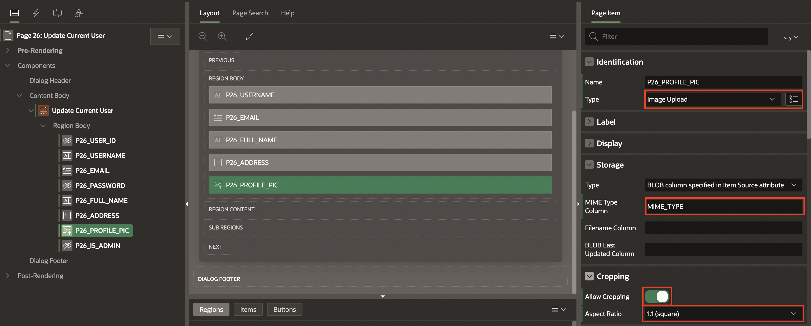

13. Right-click **Content Body** and select **Create Region**.

    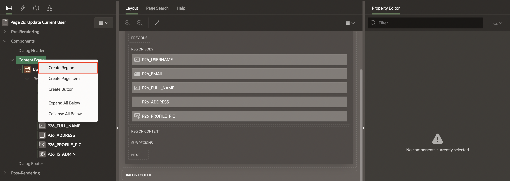

14. In the property editor, enter/select the following:

    - Under Identification > Name: **Buttons**

    - Under Appearance > Template: **Buttons Container**

    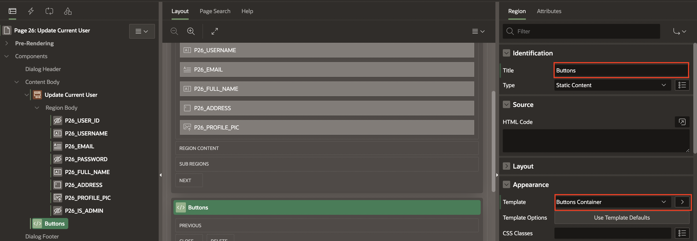

15. Right-click **Buttons** and select **Create Button**.

    

16. In the property editor, enter/select the following:

    - Under Identification > Button Name: **CANCEL**

    - Under Layout > Slot: **Close**

    - Under Behavior > Action: **Defined by Dynamic Action**

    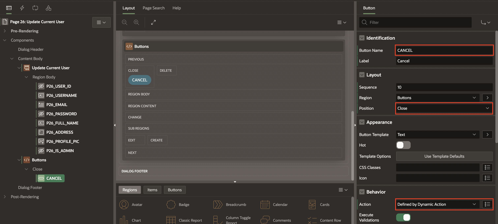

17. Right-click **CANCEL** and select **Create Dynamic Action**.

    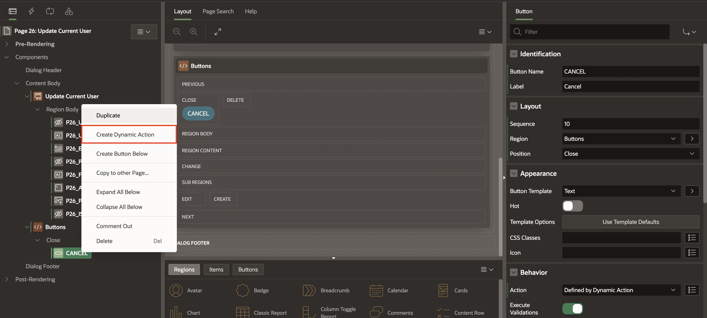

18. In the property editor, enter/select the following:

    - Under Identification > Name: **Cancel Dialog**

    

19. Select **TRUE** Action, enter/select the following:

    - Under Identification > Action: **Cancel Dialog**

    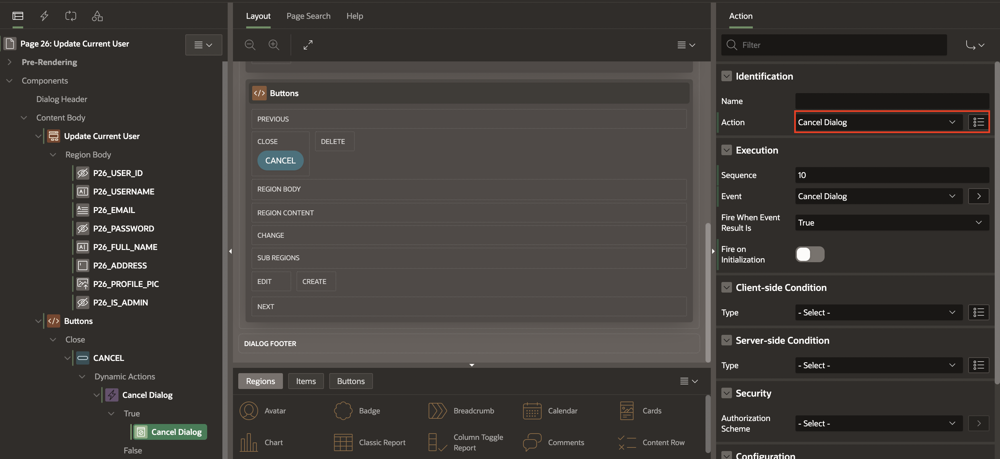

20. Right-click **Buttons** and select **Create Button**.

    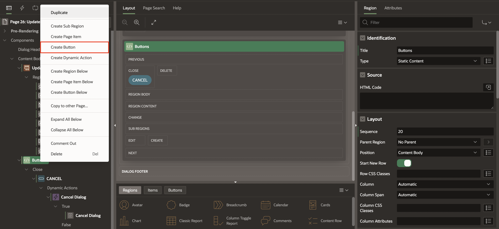

21. In the property editor, enter/select the following:

    - Under Identification:

        - Button Name: **SAVE**

        - Label: **Apply Changes**

    - Under Layout > Position: **Next**

    - Under Appearance > Hot: **Toggle On**

    - Under Behavior > Database Action: **SQL UPDATE action**

    - Under Server-side Conditions:

        - Type: **ITEM IS NOT NULL**

        - Item: **P26\_USER\_ID**

    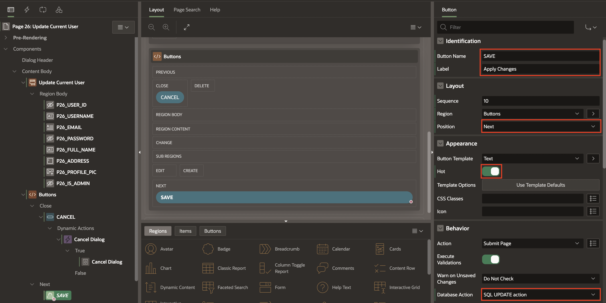

    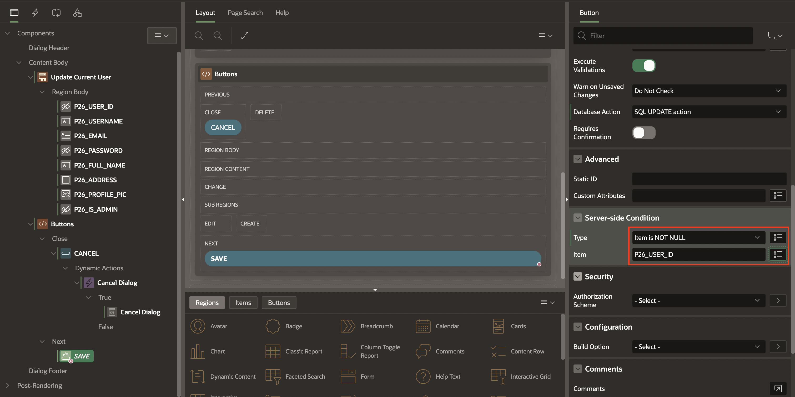

22. Right-click **SAVE** and select **Create Duplicate**

    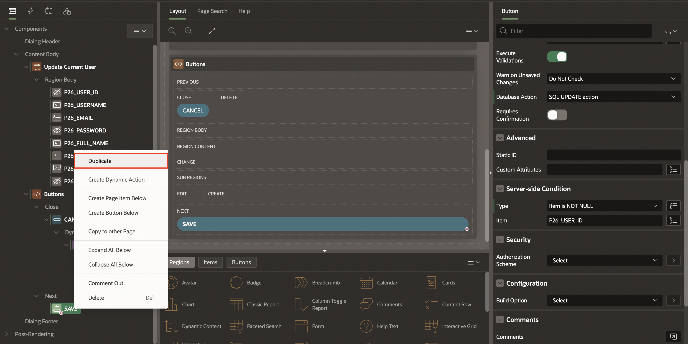

23. In the property editor, enter/select the following:

    - Under Identification:

        - Button Name: **CREATE**

        - Label: **Create**

    - Under Behavior > Database Action: **SQL INSERT action**

    - Under Server-side Condition > Type: **ITEM IS NULL**

24. Navigate to **Processing** tab and right-click **Processing** and select **Create Process**.

    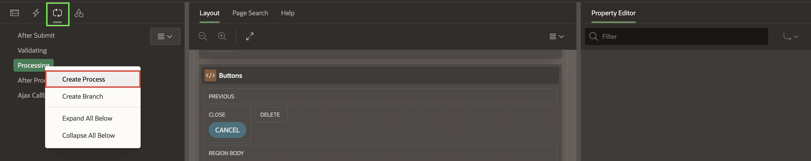

25. In the property editor, enter/select the following:

    - Under Identification:

        - Name: **Update Current User**

        - Type: **Form - Automatic Row Processing(DML)**

        - Form Region: **Update Current User**

    - Under Success Message > Success Message: **Profile Details Updated Successfully!**

    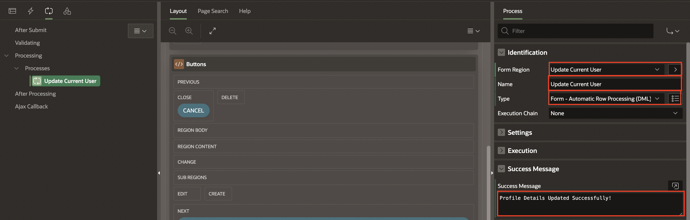

26. Right-click **Processing** and select **Create Process**.

27. In the property editor, enter/select the following:

    - Under Identification > Name: **Change Username** 

    - Under Source > PL/SQL Code: **:USERNAME := :P26_USERNAME;**

    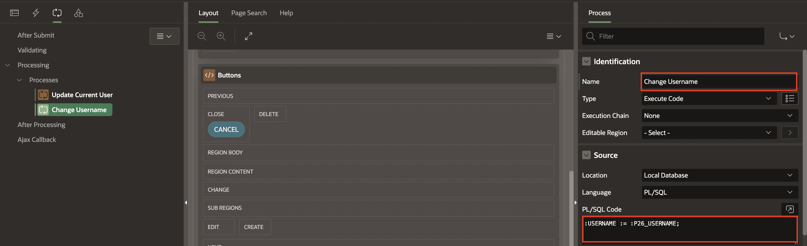

28. Right-click **After Processing** and select **Create Branch**

    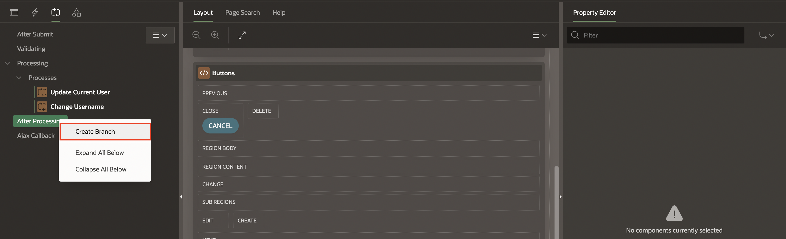

29. In the property editor, enter/select the following:

    - Under Identification > Name: **Go To My Profile**

    - Under Behavior > Target: Click **No Link Defined**

        - Page: **15010**

        - Clear Cache: **10**

        Click **OK**.

    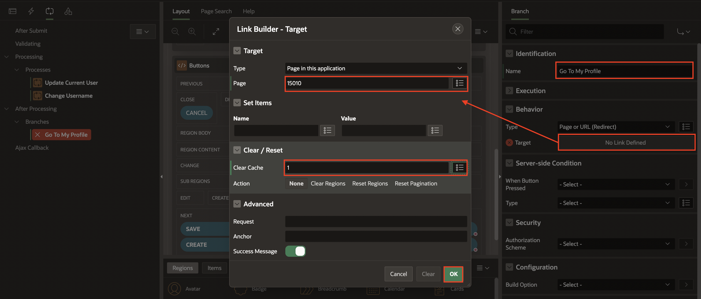

30. Click **Save**.

31. Navigate to page **15010**.

    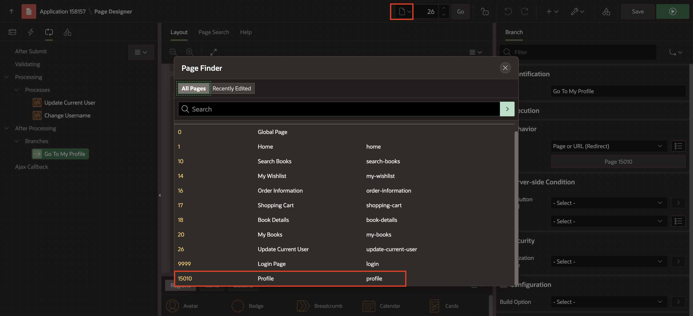

32. Right-click **My details** and select **Create Button**.

    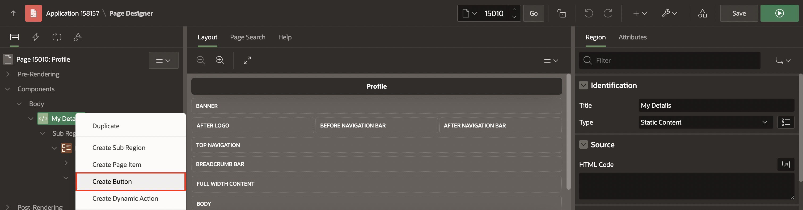

33. In the property editor, enter/select the following:

    - Under Identification > Button Name: **EDIT_PROFILE**

    - Under Layout:

        - Start New Row: **Toggle off**

        - New Column: **Toggle off**

    - Under Appearance:

        - Button template: **Text with Icon**

        - Template Options: Click **Use Template Options**

            - Size: **large**

            - Type: **Warning**

            - Style: **Remove UI Decoration**

            Click **OK**.

        - Icon: **fa-pencil-square-o**

    - Under Behavior:

        - Action: **Redirect to a page in this Application**

        - Target: **No Link Defined**

            - Under Target > Page: **26**

            - Under Set Items:

                - Name:  **P26\_USER\_ID**

                - Value: **&USER_ID.**

            - Under Clear / Reset > Clear Cache: **26**

            Click **OK**.

    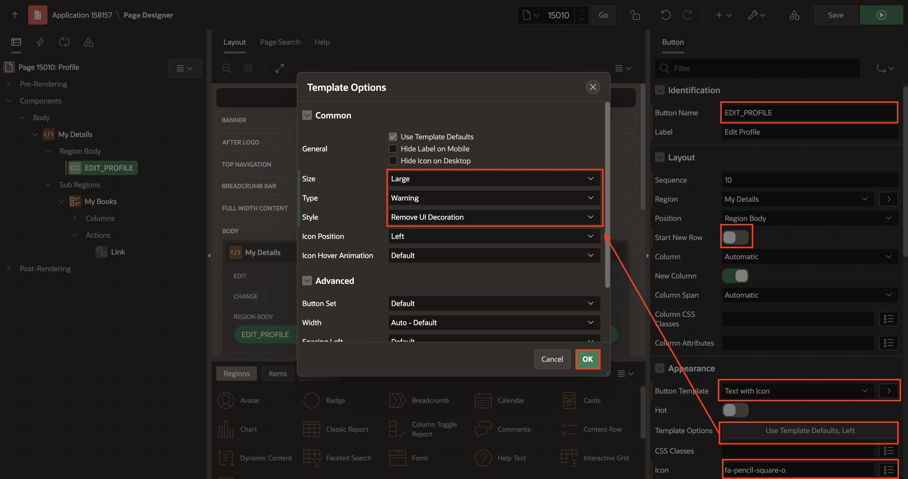

    

34. Click **Save**.

## Task 4: Create and Configure the Reset Password Page

This task provides a comprehensive step-by-step process for creating and configuring an application's "Reset Password" page. The page will be designed as a modal dialog featuring a form allowing users to reset their passwords securely.

1. On page designer toolbar, Navigate to **(+ v)** and select **Page**.

    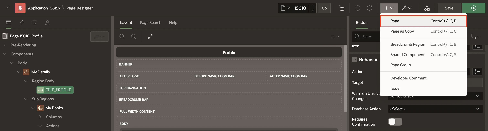

2. Click **Blank Page**.

    

3. Under **Page Definition**, enter/select the following:

    - Page Number: **27**

    - Name: **Reset Password**

    - Page Mode: **Modal Dialog**

     Click **Create Page**.

    

4. Right-click **Content Body** and select **Create Region**.

    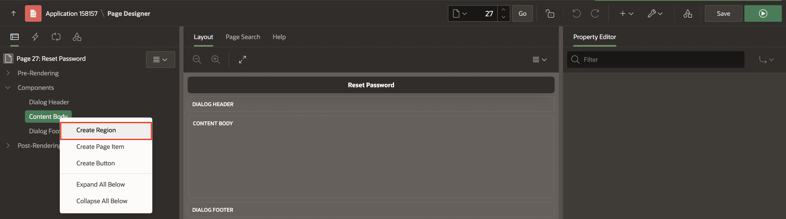

5. In the property editor, enter/select the following:

     - Under Identification:

          - Name: **Reset Password**

          - Type: **Form**

     - Under Source > Table name: **OBS\_USERS**

     - Under Appearance > Template: **Blank with Attributes**

    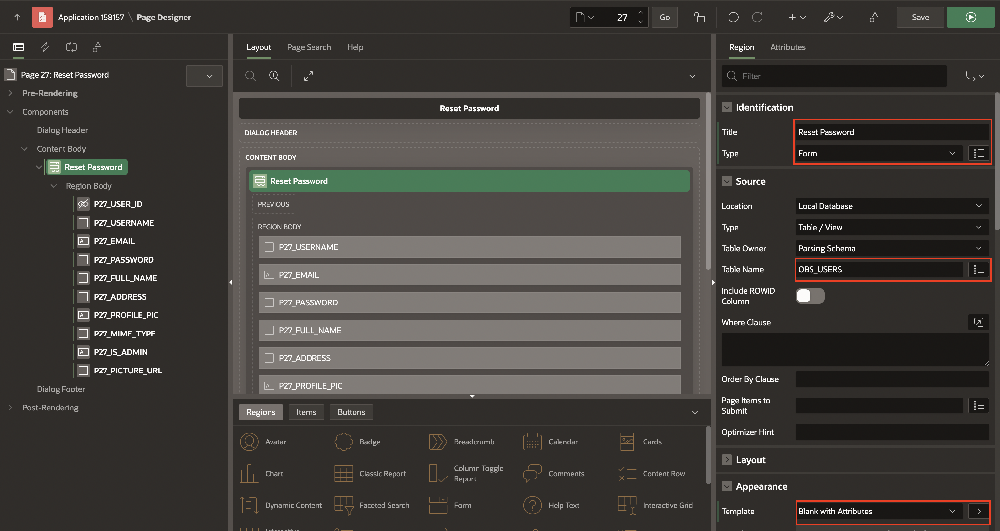

6. Under **Reset Password** region, expand columns and
delete all items except **P27\_USER\_ID** and **P27\_EMAIL**

    

7. Select **P27_EMAIL** and under Identification > Type: **Display Only**.

    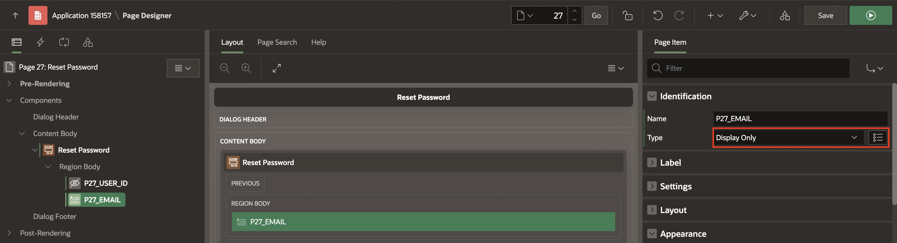

8. Select **P27\_USER\_ID** and under Source > Query Only: **Toggle Off**.

    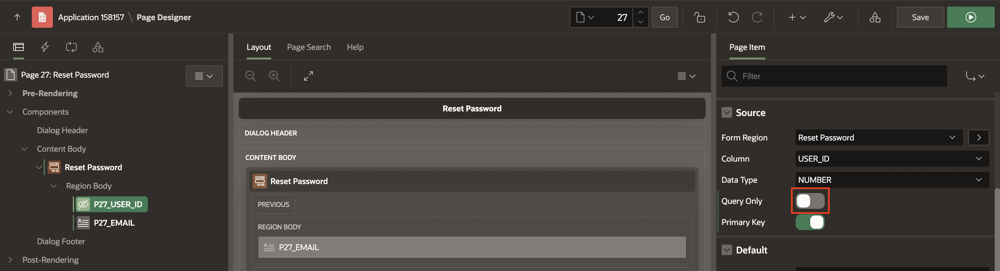

9. Right-click **Reset Password** and select **Create Page Item**.

    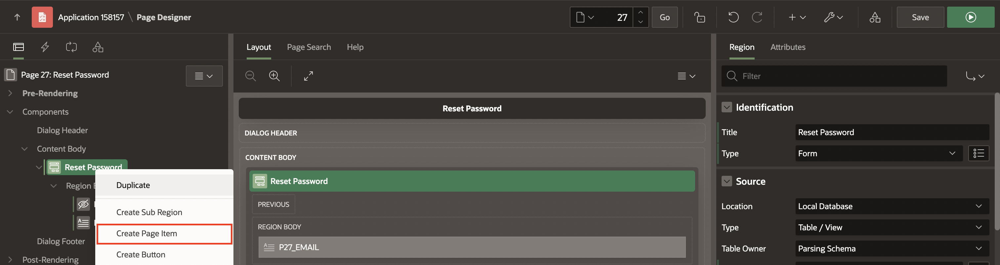

10. In the property editor, enter/select the following:

    - Under Identification:

        - Name: **P27\_NEW\_PASSWORD**

        - Type: **Password**

    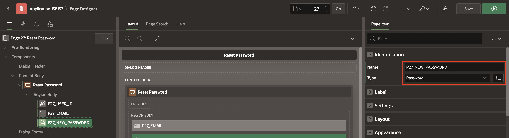

11. Right-click **P27\_NEW\_PASSWORD** and select **Create  Validation**.

    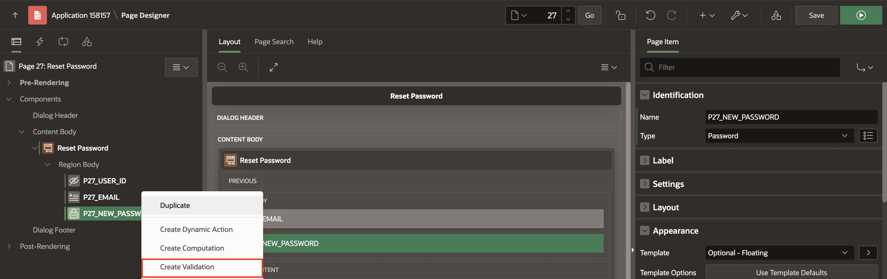

12. In the property editor, enter/select the following:

    - Under Identification > Name: **Password Not Null**

    - Under Validation:

        - Type: **Function Body (returning Boolean)**

        - PL/SQL Function Body: Copy and paste the below code:

        ```
        <copy>
        if :P27_NEW_PASSWORD is not NULL then
            return true;
        else
            return false;
        end if;
        </copy>
        ```

     - Under Error > Error Message: **Password must have some value**.

    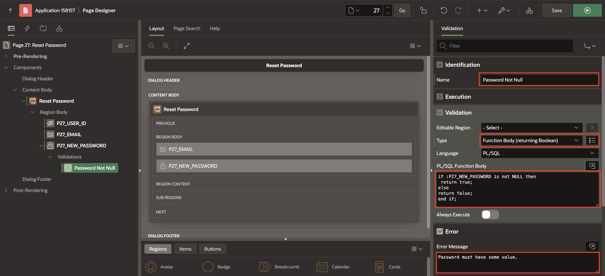

13. Right-click **Reset Password** and select **Create Page Item**.

14. In the property editor, enter/select the following:

    - Under Identification:

        - Name: **P27\_CONFIRM\_NEW\_PASSWORD**

        - Type: **Password**

    - Under Source

        - Form Region: **Reset Password**

        - Column: **PASSWORD**

    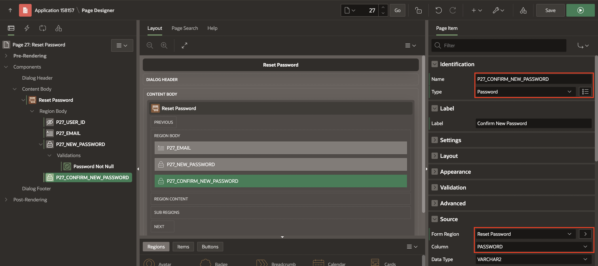

15. Right-click **P27\_CONFIRM\_NEW\_PASSWORD** and select **Create Validation**.

16. In the property editor, enter/select the following:

    - Identification > Name: **Compare Passwords**

    - Under Validation:

        - Type: **Function Body (returning Boolean)**

        - PL/SQL Function Body: Copy and paste the below code:
        ```
        <copy>
        begin
            if :P27_NEW_PASSWORD = :P27_CONFIRM_NEW_PASSWORD then
                return true;
            else
                return false;
            end if;
        end;
        </copy>
        ```

    - Under Error > Error Message: **Confirm Password and Password must be same.**

    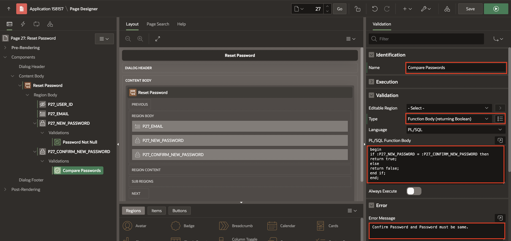

17. Right-click **Region Body** and select **Create Region**.

    

18. In the property editor, enter/select the following:

    - Under Identification > Name: **Buttons**

    - Under Appearance > Template: **Buttons Container**

    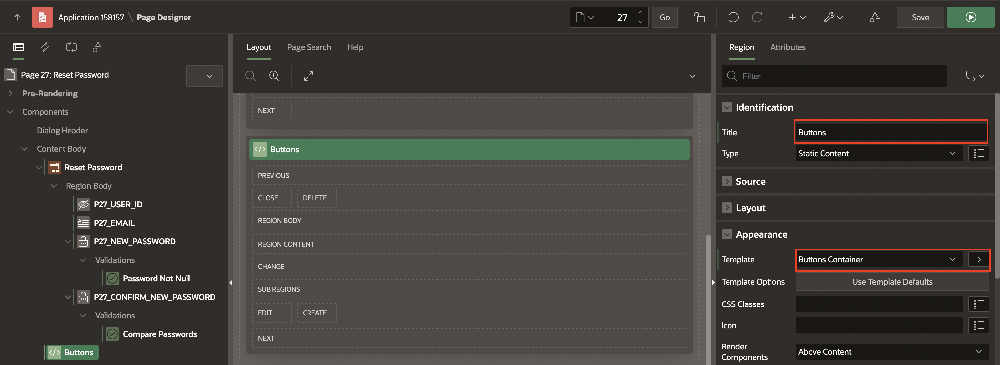

19. Right-click **Buttons** and select **Create Button**.

    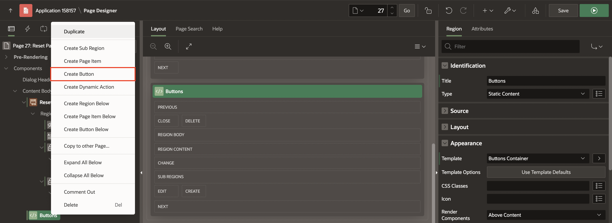

20. In the property editor, enter/select the following:

    - Under Identification > Button Name: **CANCEL**

    - Under Layout > Slot: **Close**

    - Under Behavior:

        - Action: **Redirect to Page in this Application**

        - Target: click **No Link Defined**

            - Under Target > Page: **15010**

            - Under Clear / Reset > Clear Cache: **27**

            Click **OK**.

    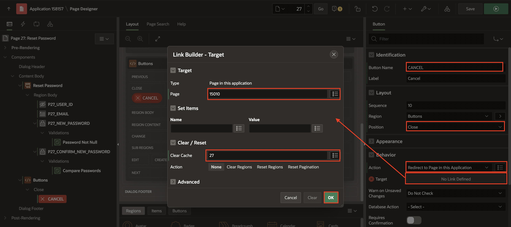

21. Right-click **CANCEL** and select **Create Dynamic Action**.

    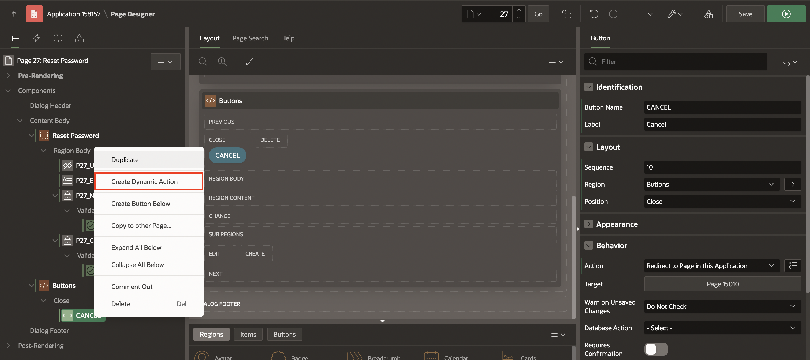

22. In the property editor, enter/select the following:

    - Under Identification > Name: **Cancel Dialog**

    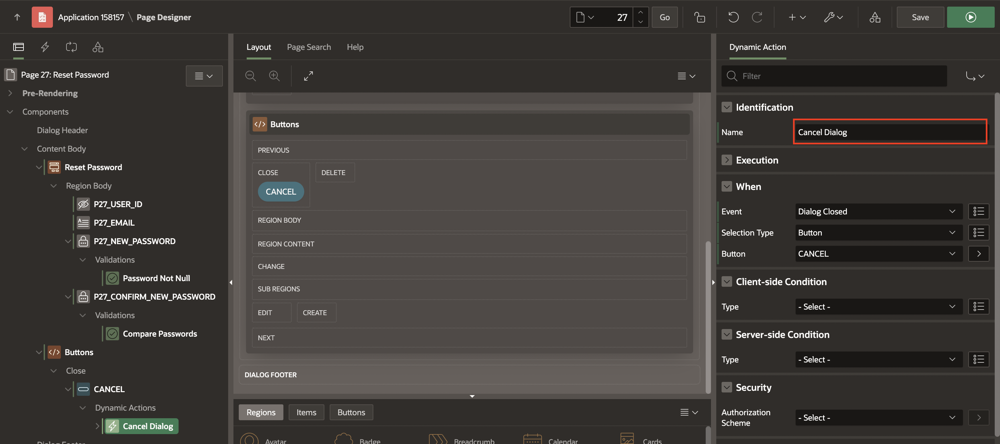

23. Select **TRUE** Action, enter/select the following:

    - Under Identification > Action: **Cancel Dialog**

    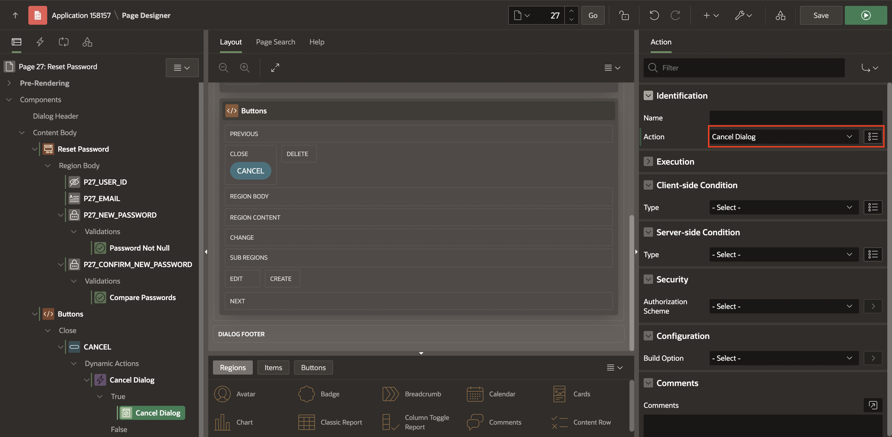

24. Right-click **Buttons** and select **Create Button**.

25. In the property editor, enter/select the following:

    - Under Identification:

        - Button Name: **SAVE**

        - Label: **Apply Changes**

    - Under Layout > Slot: **Next**

    - Under Appearance > Hot: **Toggle On**

    - Under Behavior > Database Action: **SQL UPDATE Action**

    - Under Server-side Condition:

        - Type: **ITEM IS NOT NULL**

        - Item: **P27\_EMAIL**

    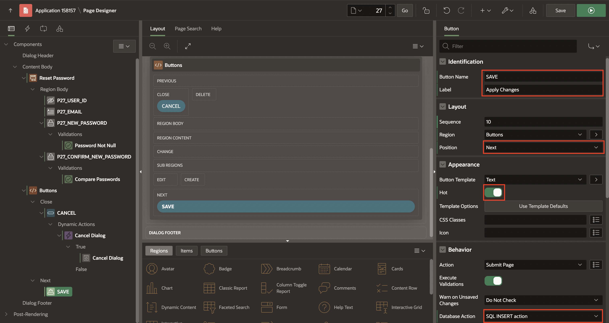

    

26. Navigate to **Processing** tab, right-click **Processing** and select **Create Process**.

    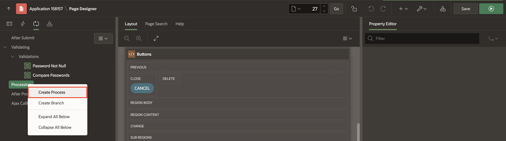

27. In the property editor, enter/select the following:

    - Under Identification:

        - Name: **Reset Password**

        - Type: **Form - Automatic Row Processing (DML)**

        - Form Region: **Reset Password**

    - Under Settings > Prevent Lost Updates: **Toggle Off**

    - Under Success Message > Success Message: **Reset Password Successfully!**

    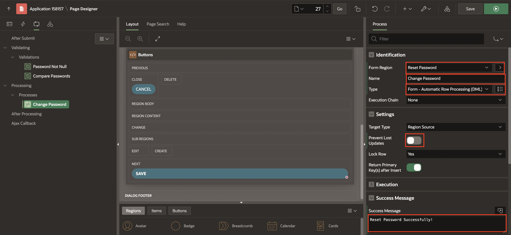

28. Right-click **After Processing** and select **Create Branch**.

    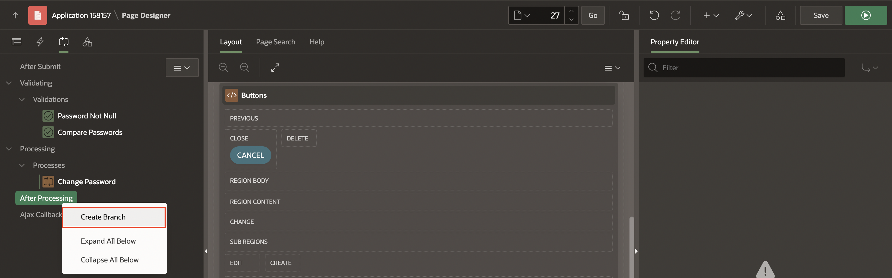

29. In the property editor, enter/select the following:

    - Under Identification > Name: **Go To My Profile**

    - Under Behavior > Target: Click **No Link Defined**

         - Under Target > Page: **15010**

         - Under Clear / Reset > Clear Cache: **10**

         Click **OK**

    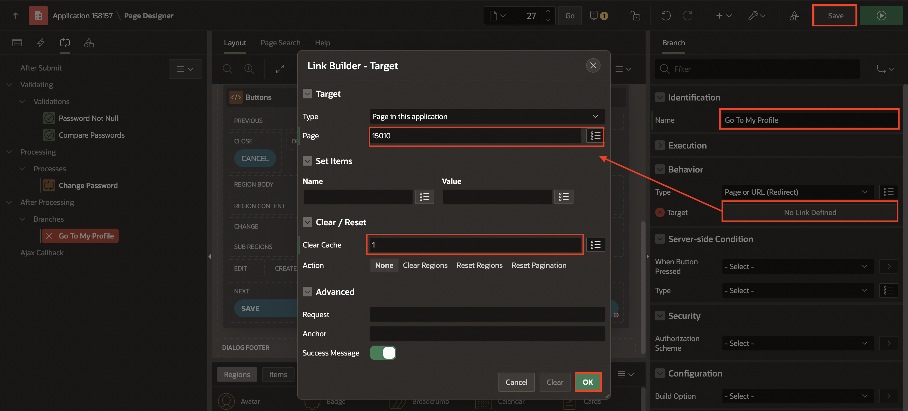

30. Click **Save**.

31. Navigate to page **15010**.

    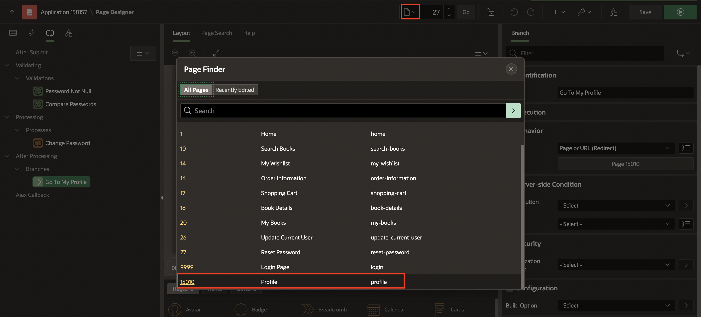

32. Right-click **My details** and select **Create Button**.

    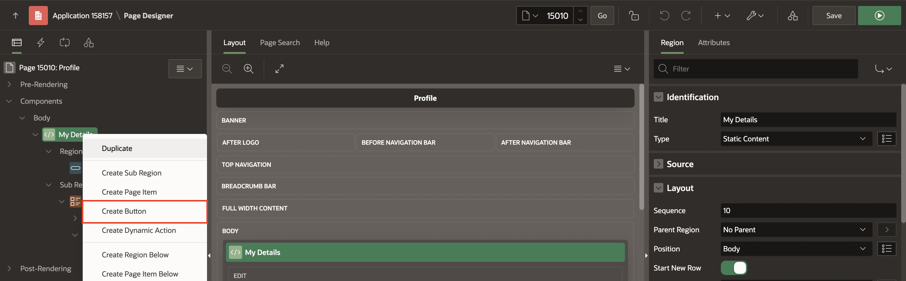

33. In the property editor, enter/select the following:

    - Under Identification > Name: **CHANGE\_PASSWORD**

    - Under Layout > Sequence: **2**

    - Under Appearance:

        - Button template: **Text with Icon**

        - Template Options: Click **Use Template Defaults**

            - Size: **large**

            - Type: **Warning**

            - Style: **Remove UI Decoration**

            Click **OK**.

        - Icon: **fa-pencil-square-o**

    - Under Behavior:

        - Action: **Redirect to Page in this Application**

        - Target: **No Link Defined**

            - Under Target > Page: **27**

            - Under Set Items:

                - Name: **P27\_USER\_ID**

                - Value: **&USER\_ID.**

            - Under Clear / Reset > Clear Cache: **27**

            Click **OK**.

    

    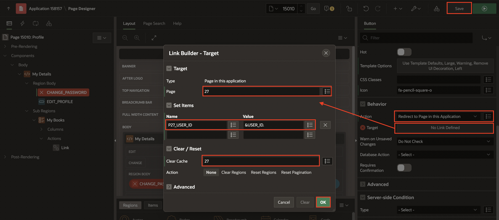

34. Click **Save**.

    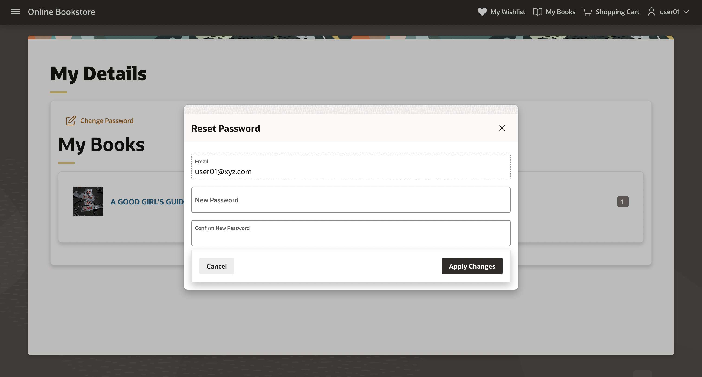

## Task 5: Show Profile Pic using RESTful Services

In this task, you will learn how to configure RESTful services to handle user profile images and integrate them into your application. You will start by registering the schema with Oracle REST Data Services (ORDS) and creating the necessary modules, templates, and handlers. Next, you'll create an application item and Computation to manage the profile image URLs. Finally, you will update the navigation bar and profile page to display the user's profile picture.

1. Navigate to **SQL Workshop** and select **RESTful Services**.

    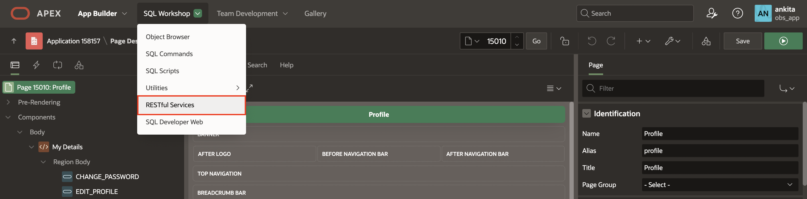

2. Click Register Schema with ORDS.

    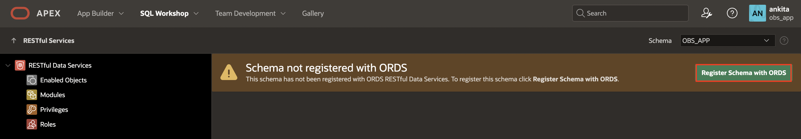

3. Click **Save Schema Attributes**.

    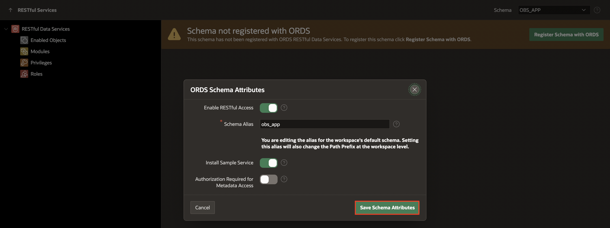

4. From the left pane, select **Modules** and select **Create Module**.

    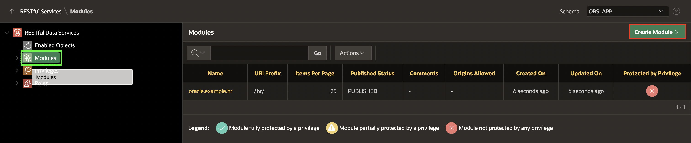

5. Under **Module Definition**, enter/select the following:

    Module Name: **User Images**

    Base Path: **images**

    Click **Create Module**.

    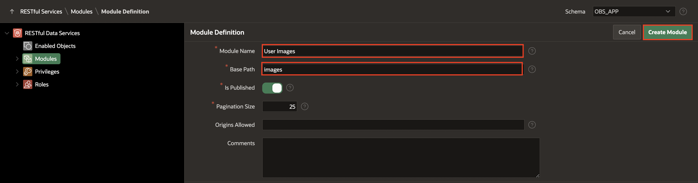

6. Under **Resource Templates**, select **Create Template**.

    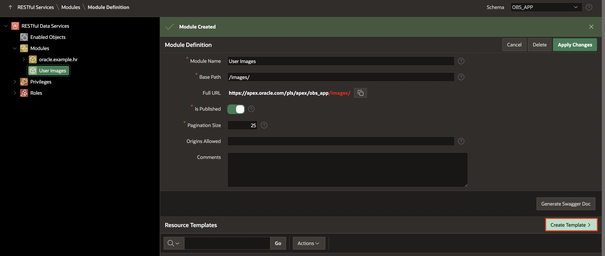

7. For **Uri template**, enter **profile_pic/:id** and select **Create Template**.

    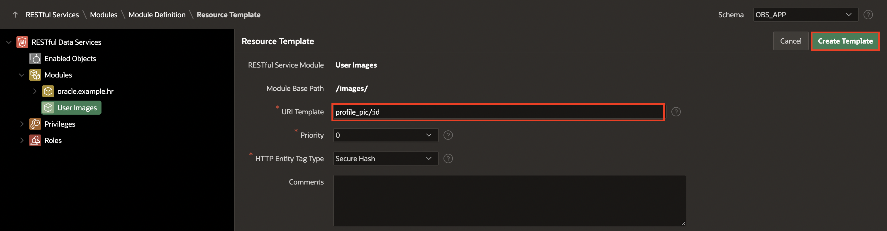

8. Under **Resource Handlers**, click **Create Handler** and enter/select the following:

    - Under Resource Handler > Source type: **media resource**

    - Under Source > Code: Copy and paste the following code:

    ```
    <copy>
    select mime_type, profile_pic from obs_users where user_id = :id
    </copy>
    ```
   Click **Create Handler**.

   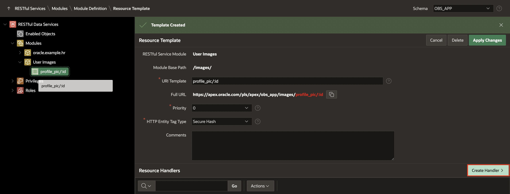

   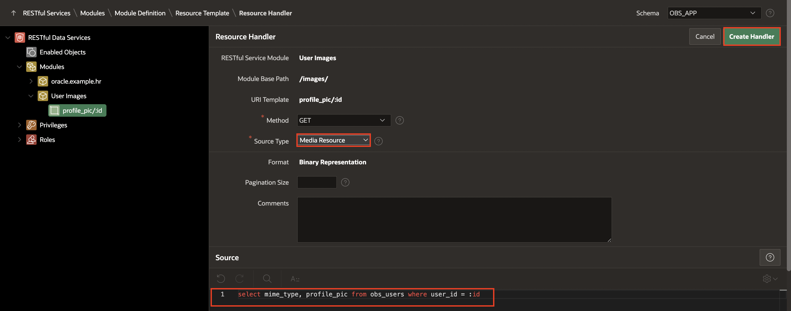

9. Copy the **Full URL** and replace the id with user\_id to use in the next lab.

10. As of now, you have created RESful services. Now, you will create an Application Item. To do so, navigate to shared Components. Click **App Builder > Online Bookstore > Shared Components**.

    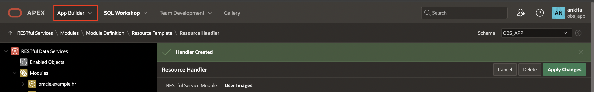

    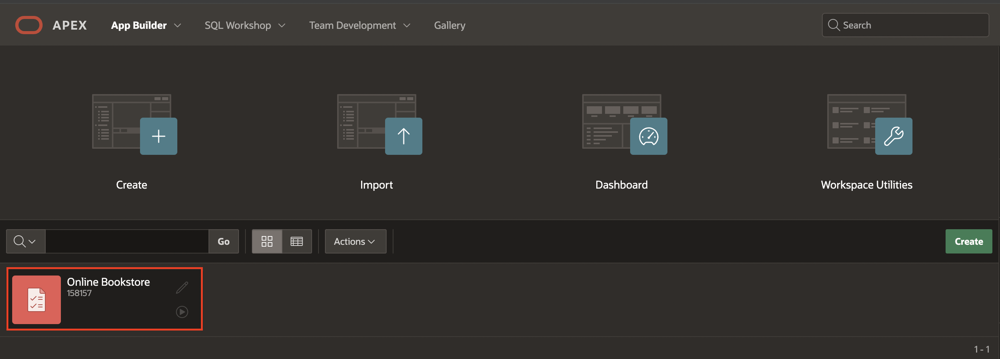

    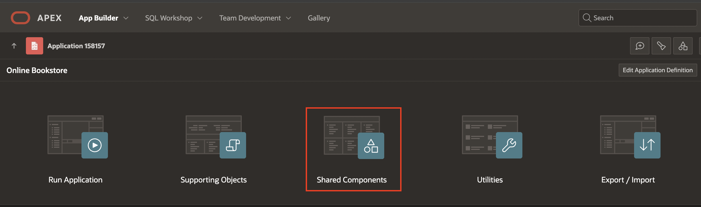

11. Under Application Logic, select **Application Items** and click **Create**.

     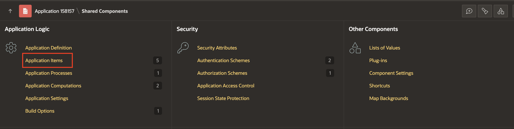

     

12. For Name: enter **PICTURE\_URL** and click **Create Application Item**.

    

13. Now, you will create an Application Computation. To create an
Application Computation, navigate back to the shared component and Under **Application Logic**, click **Application Computations**.

    

    

14. Click **Create** and enter/select the following:

    - Under Item > Computation Item: **PICTURE\_URL**

    - Under Frequency > Computation Point: **Before Header**

    - Under Computation:

        - Computation Type: **SQL Query (return single value):**

        - Code: Copy and paste the below code:

        ```
        <copy>
        select case when picture_url is not null and profile_pic is null then picture_url
             else 'https://apex.oracle.com/pls/apex/<workspace name>/images/profile_pic/' || user_id
              end case
            from obs_users where user_id = :user_id;
        </copy>
        ```

    *Note: For the else statement in the above code, paste the URL you copied in the above task*

    Click **Create Computation**.

    

    

15. Now, you will update the navigation bar list to add badge value. Navigate to shared components and select **Navigation Bar List**.

    

    

16. Click **Navigation Bar** and click edit icon of **&USERNAME.** and update the following:

    - Under User Defined Attributes > Badge value:

    ```
    <copy>
    
    </copy>
    ```

    Click **Apply Changes**.

    

    

17. Next, you will update my profile page to display my profile picture on the page. Navigate to page **15010**.

    

18. Select **My Details** region, right-click **Region Body** and select **Create Region**.

    

19. Enter/select the following:

    - Under Identification > Title: **Profile Photo**

    - Under Appearance > Template: **Blank with Attributes**

    

20. Right-click **Profile Photo** region and select **Create Page Item**.

    

21. In the property editor, enter/select the following:

    - Under Identification > Type: **Display Image**

    - Under Label > Label: Keep it empty

    - Under Settings > Based on: **Image URL stored in Page Item Value**

    - Under Appearance > Template: **Optional-Above**

    - Under Advanced > Custom Attributes : **style="width: 40vh; height: 50vh; display: block; margin: 0 auto;"**

    - Under Source:

        - Type: **Item**

        - Item: **PICTURE\_URL** (under Application).

    

    

22. Select **My Books** region in the property editor, and enter/select the following:

    - Under Layout:

        - Sequence: **21**

        - Slot: **Region Body**

    

23. Click **Save**.

## Summary

In this lab, you have learned to create a robust user profile page in Oracle APEX. You navigated through various tasks, including page creation, SQL query integration, form handling, and RESTful services setup. You also customized the application's Navigation and enhanced the user experience by adding interactive elements. Following these steps, you have developed a comprehensive understanding of managing user profiles in Oracle APEX, a crucial aspect of building modern web applications.

You are now ready to move on to the next lab!

## Acknowledgements

- **Author**: Pankaj Goyal, Member Technical Staff; Ankita Beri, Product Manager
- **Last Updated By/Date**: Pankaj Goyal, Member Technical Staff, Aug 2024
