# Create Additional Pages

## Introduction
In this lab, you will create a package with procedures and functions that collectively manage the process of adding, removing, and processing orders and wishlist items within the database application. Additionally, you will learn to create application items, processes, and computations. Moreover, you will create processes to invoke these procedures and functions.

Estimated Time: 5 minutes

### Objectives
In this lab, you will:

- Create My Books Page.
- Develop My Wishlist Page.


## Task 3: Create My Wishlist page

1. On Page Designer toolbar, Navigate to (+ v) and Select **Page**.

    

2. Select **Blank Page**.

    

3. In Create Blank Page dialog, enter/select the following:

    - Under Identification:

        - Page Number: **14**

        - Name: **My Wishlist**

    - Under Navigation:

        - Use Breadcrumb: **Toggle Off**

        - Use Navigation: **Toggle Off**

    Click **Create Page**.

   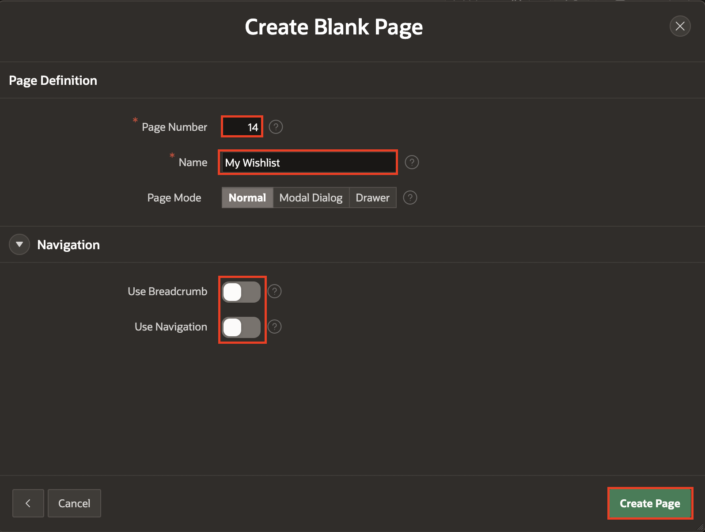

4. In the left pane, Right-click **Body** and Select **Create Region**.

    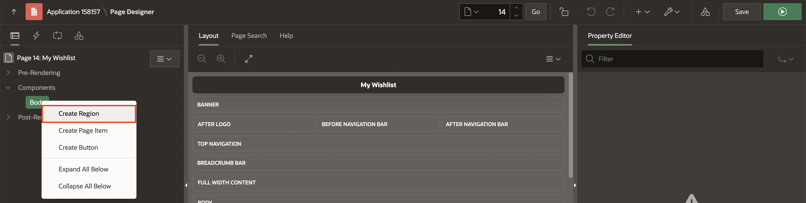

5. In the Property Editor, enter/select the following:

    - Under Identification:

        - Title: **My books**

        - Type: **Cards**

    - Under Source:

        - Type: **QL Query**

        - SQL Query: Copy and Paste the below code into the code editor:

        ```
        <copy>
        SELECT
          oi.book_id,
          bi.author,
          bi.book_image,
          bi.title,
          bi.description,
          bi.discount,
          Round(bi.price,2) as price,
          ROUND(bi.price * ((100 - bi.discount) / 100), 2) as new_price
       FROM obs_wishlist oi, obs_books bi
       WHERE oi.user_id = :USER_ID AND oi.book_id(+) = bi.book_id;
       </copy>
       ```

    

       - **Order By Item**: Enter/select the following:

       | Clause     |  Key   | Display |
       | ---------- |  ------ | ------ |
       | "TITLE"asc | TITLE |  Title |
       | "PRICE"asc | RICE | Price |

       Click **OK**.

    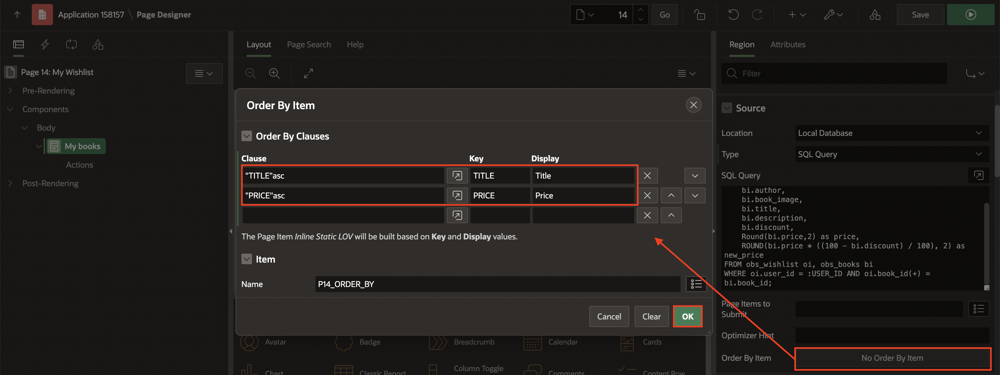  

6. In the Property Editor, navigate to **Attributes** and enter/ select the following:

    - Appearance > Grid Columns: **5 Columns**

    - Card > Primary Key Column 1: **BOOK_ID**

    - Title > Column: **TITLE**

    - Under Body:

        - Advanced Formatting: **Toggle On**

        - HTML Expression: Copy and Paste the below HTML code:
        ```
       <copy>
       <div>
       <b>Author:</b> &AUTHOR.
       </div>

       <div>
       <b>Price:</b> <strike>₹&PRICE.</strike> ₹&NEW_PRICE.
       </div>

       <div >
       <b>Discount:</b> <span style="color: green;">&DISCOUNT.% Off</span>
       </div>
       </copy>
       ```
    - Under Media:

        - Source: **Image URL**

        - URL: **&BOOK_IMAGE.**

        - Image Description: **&DESCRIPTION.**

    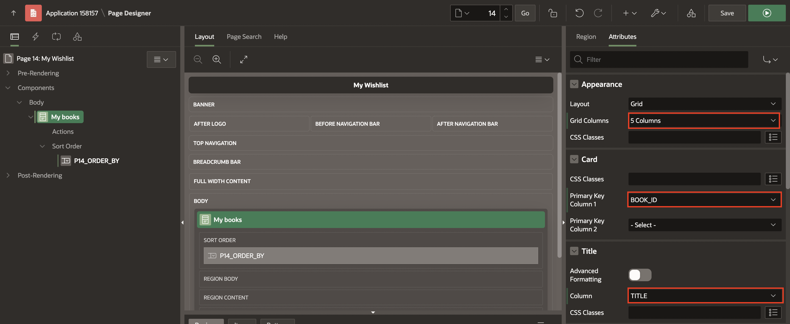  

    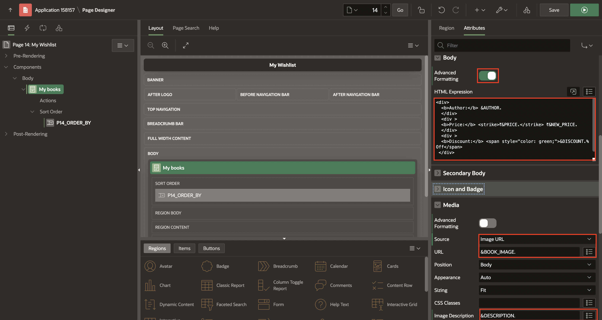     

7. Under **My Books** region, Right-click **Actions** and click **Create Action**.

    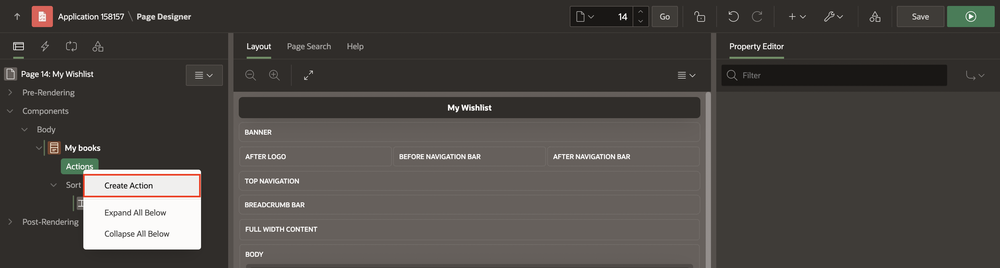

8. In the Property Editor, enter/select the following:

    - Identification > Type: **Full Card**

    - Link > Target: Click **No Link Defined**

        - Target > Page: **18**

        - Set Items > Name: **P18\_BOOK\_ID** and Value: **&BOOK\_ID.**

        -  Clear/Reset > Clear Cache: **18**

        Click **OK**.

    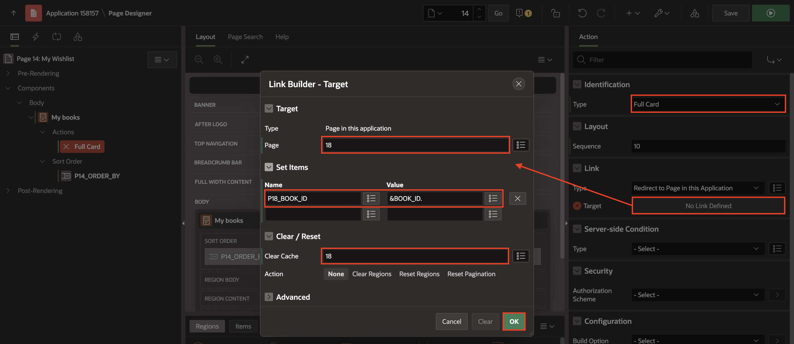

9. Right-click **My Books** region and click **Create Page Item**.

    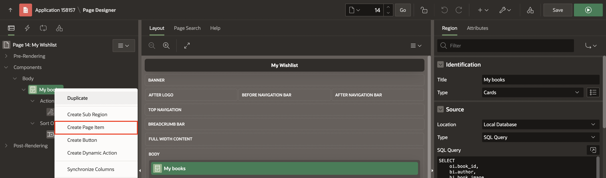

10. In the Property editor, enter/select the following:

    - Under Identification
     
        - Name: **P14\_BOOK\_ID**

        - Type: **Hidden**

    - Settings > Value protected: **Toggle Off**

    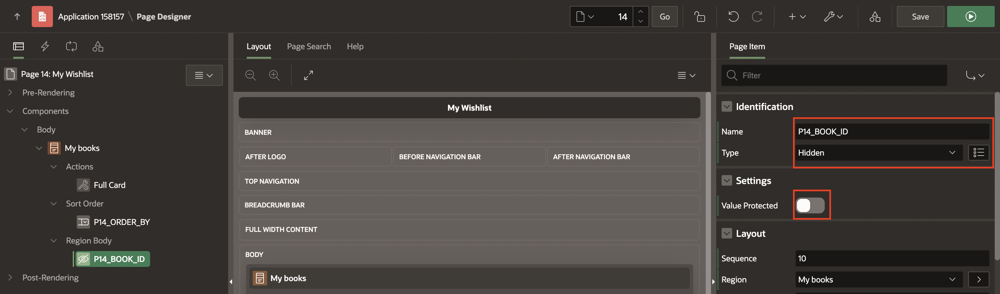

10. Right-click **My Books** region and click **Create Dynamic Action**.

    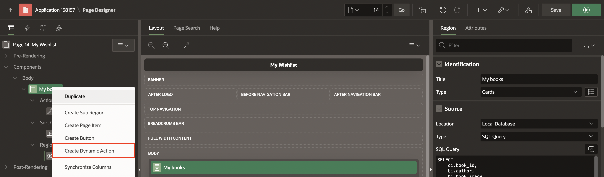

11. In the Property editor, enter/select the following:

    - Identification > Name: **Refresh**

    - When > Event: **Dialog Closed**

    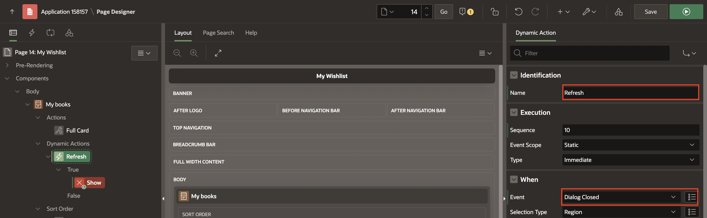

12. Select **TRUE** action and enter/select the following:

    - Identification > Name: **Refresh**

    - Under Affected Elements:

        - Selection Type: **Region**

        - Region: **My Books**

    

13. Navigate to **Processing** tab, Right-click **Processing** and click **Create Process**.

    

14. In the Property editor, enter/select the following:

     - Under Identification:

        - Name: **Remove from Wishlist**

        - Type: **Invoke API**
          
     - Under Settings : 

        - Package Name: **OBS\_MANAGE\_ORDERS**

        - Procedure/Function Name: **REMOVE\_FROM\_WISHLIST**

     - Under Server-side condition:

        - Type: **Request=Value**

        - Value: **REMOVE\_FROM\_WISHLIST**

      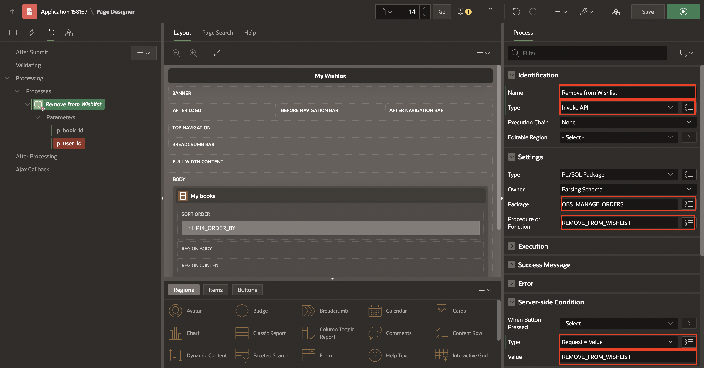

15. Under **Remove from Wishlist** process, expand parameters and enter/select the following:

     | Parameter     |  Type   | Item |
     | ---------- |  ------ | ------ |
     | p\_book\_id | Item |  P14\_BOOK\_ID |
     | p\_user\_id| Item | USER\_ID |

    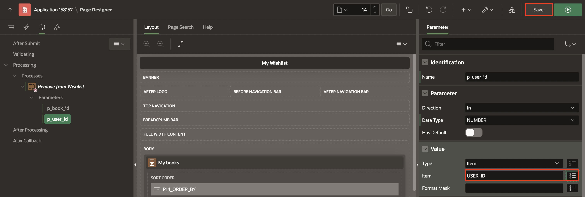

16. Click **Save**.
