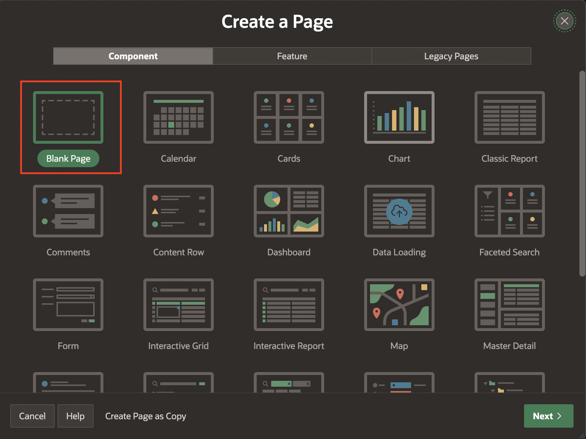
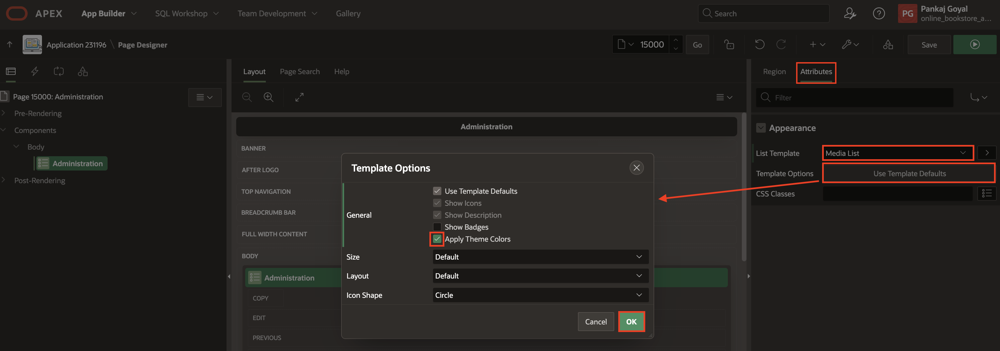
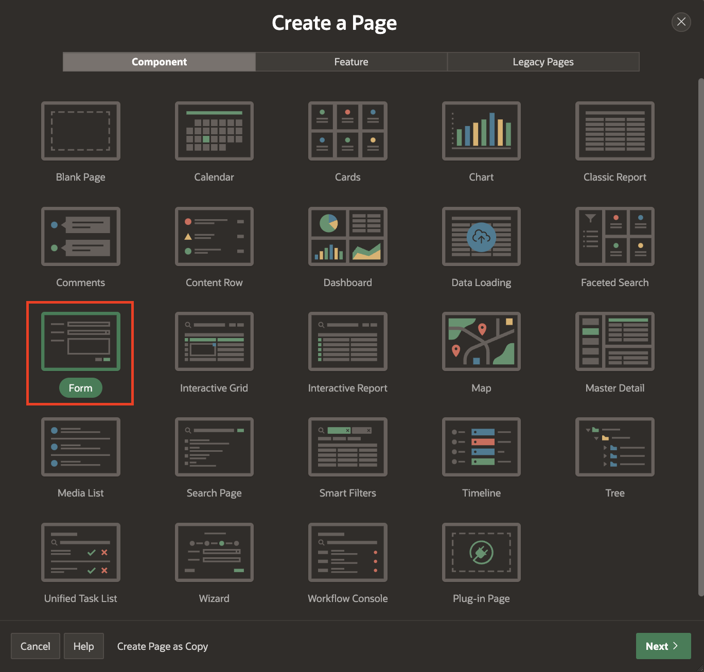

# Create and Manage Administration

## Introduction

In this lab, you will create an administration page with specific settings, including a list to manage books and user roles. Next, you will add an entry to the navigation bar, linking to the administration page for quick access. Following this, you will modify authorization schemes to ensure that only authorized users can access the administration page. You will then set up a page for managing book information, including search functionality and detailed views. Additionally, you will create a form for editing book details, allowing for comprehensive updates. The lab also involves developing an interactive report for user roles and a form for updating user information. Lastly, you will enhance the user role update form to hide unnecessary fields and streamline the update process. These tasks collectively enable efficient application data administration and management, improving functionality and security.

Estimated Time: 20 minutes

### Objectives

- Create an Administration Page to manage various administrative tasks.
- Add Navigation Entries to integrate the administration page into the application's navigation bar for easy access.
- Configure Authorization Schemes to implement and apply security measures to control access to the administration page.
- Manage book information for searching, viewing, and updating.
- Develop a form for detailed editing of book records.
- Manage user roles by viewing and updating them using interactive reports and forms.

## Task 1: Create an Administration Page

This task guides you through creating an administration page for managing books and user roles. You will start by navigating to the Application Home Page to create a blank page named "Administration." Next, you will set up a new list in Shared Components, adding entries for managing books and user roles and customizing their icons. Finally, using the Media List template, you'll configure the Administration page to display this list.

1. On page designer toolbar, navigate to **(+ v)** and click **Page**.
    

2. Click **Blank Page**.

    

3. Enter/select the following:

    - Under Identification:

        - Page Number: **15000**

        - Name: **Administration**

    - Under Navigation:

        - Use Breadcrumb: **Toggle Off**

        - Use Navigation: **Toggle Off**

    Click **Create Page**.

   

4. Navigate to **Shared Components**.

   

5. Under **Navigation and Search**, click **Lists** and click **Create**.

    

    

6. For Name: enter **Administration** and click **Next**.

    

7. For Query or Static Values, enter/select the following:

    | List Entry Label | Target Page ID or custom URL |
    | ---------- |  ------ |
    | Manage Books Information | 40 |
    | User Role| 30 |

    Click **Next**.

    

8. Click **Create List**.

    

9. Click **Administration**.

    

10. Click **Edit** Icon for **Manage Books Information** and
update Image/Class: **fa-database-file**. Click **Apply Changes**.

    

    

11. Click **Edit** Icon for **Users Role** and
update Image/Class: **fa-table**. Click **Apply Changes**.

    

    

12. Navigate to **Page Number: 15000** by clicking **Edit Page 15000**.

    

13. Right-click **Body** and select **Create Region**.

    

14. In the Property editor, enter/select the following:

    - Under Identification:

        - Name: **Administration**

        - Type: **List**

    - Source > List: **Administration**

    

15. Navigate to **Attributes** and enter/select the following:

    - Under Appearance:

        - List Template: **Media List**

        - Template Options > Click **Use Template Defaults** > Check **Apply Theme Colors**

        Click **OK**.

    

16. Click **Save**.

## Task 2: Add Navigation Entries

In this task, you will add a navigation bar entry for the administration page. Additionally, apply an authorization scheme to restrict access to users with administration rights.

1. Navigate to Shared Components.

    

2. Under **Navigation and Search**, click **Navigation Bar List**

    

    

3. Click **Navigation Bar** and Click **Create Entry**.

    

4. Enter/select the following:

    - Under Entry:

        - Sequence: **2**

        - Image/Class: **fa-user-wrench**

        - List Entry Label: **Administration**

    - Under Target:

        - Page: **15000**

        - Clear Cache: **15000**.

    - Under Authorization > Authorization Scheme: **Administration Rights**

    Click **Create List Entry**.

  

  

## Task 3: Configure Authorization Scheme

In this task, you will update the authorization scheme to ensure that only users with administration rights can access the administration page.

1. Navigate to **Shared Components**.

    

2. Under **Security**, Click **Authorization Schemes**.

    

3. Click **Administration Rights**.

    

4. Under the Authorization Scheme, update the following:

    - Schema Type: **Exists SQL Query**

    - SQL Query: Copy and Paste the below code:

    ```
    <copy>
    select 1 from obs_users
    where user_id = :user_id and is_admin = 'Y'
    </copy>
     ```

    Click **Apply Changes**.

    

5. Navigate to **Page 15000: Administration** by clicking **Edit Page 15000**..

6. In the Property editor, enter/select the following:

    - Under Security:

        - Authorization scheme: **Administration Rights**

        - Deep Linking: **Disabled**

    

7. Click **Save**.

## Task 4: Manage Books Information

In this task, you'll create a page to manage book information. Start by navigating to the Application Home Page and creating a new blank page with the identification details set. Then, customize the page layout and Appearance. Next, create regions for updating book information and searching for books. Configure dynamic actions to handle search functionality and refresh actions. Set up buttons for editing, resetting, and creating book entries.

1. On Page Designer toolbar, Navigate to (+ v) and Select Page.

2. Click **Blank Page**.

    

3. In Create Blank Page dialog, enter/select the following:

    - Under Page Definition:

        - Page Number: **40**

        - Name: **Manage Books Information**

    - Under Navigation:

        - Use Breadcrumb: **Toggle Off**

        - Use Navigation: **Toggle Off**

    Click **Create Page**.

    

4. Select **Page 40: Books Information**, in the property editor and enter/select the following:

    - Under Appearance > Page Template: **Left Side Column**

    - Under Navigation > Warn on Unsaved Changes: **Toggle Off**

    

5. Right-click **Body** and click **Create Region**.

    

6. In the Property editor, enter/select the following:

    - Under Identification:

        - Name: **Update Book Information**

    - Under Layout > Slot: **Breadcrumb Bar**

    - Under Appearance:

        - Template: **Hero**

        - Template Options > Click **Use Template Defaults**:

            - **Display Icon**: Select **No**

    Click **OK**.

    

7. Right-click **Body** and click **Create Region**.

    

8. In the property editor, enter/select the following:

    - Under Identification > Name: **Search**

    - Under Layout > Sequence: **5**

    - Under Appearance:

        - Template: **Blank with Attributes**

        - Template Options: Click **Use Template Defaults**

            - Item Width: **Stretch Form Fields**

            Click **OK**.

        - CSS Classes: **search-region padding-md**

    

9. Right-click **Search** and click **Create Page Item**.

    

10. In the property editor, enter/select the following:

    - Under Identification > Name: **P40\_SEARCH**

    - Under Appearance:

        - Template: **Hidden**

        - Template Options: Click **Use Template Defaults**

            - Size: **Large**

            - Item Post Text: **Display as Block**

            Click **OK**.

        - Value Placeholder: **Search here**

    - Under Layout > Position: **Left Column**

    

11. Right-click **Body** and click **Create Region**.

12. In the property editor, enter/select the following:

    - Under Identification:

        - Name: **Master Records**

        - Type: **Classic Report**

    - Under Source:

        - Type: **SQL Query**

        - SQL Query: Copy and Paste the below code:

        ```
        <copy>
        select "BOOK_ID",
            null LINK_CLASS,
            apex_page.get_url(p_items => 'P40_ID', p_values => "BOOK_ID") LINK,
            null ICON_CLASS,
            null LINK_ATTR,
            null ICON_COLOR_CLASS,
            case when coalesce(:P40_ID,'0') = "BOOK_ID"
            then 'is-active'
            else ' '
            end LIST_CLASS,
            (substr("TITLE", 1, 50)||( case when length("TITLE") > 50 then '...' else '' end )) LIST_TITLE,
            (substr("DESCRIPTION", 1, 50)||( case when length("DESCRIPTION") > 50 then '...' else '' end )) LIST_TEXT,
            (substr("AUTHOR", 1, 50)||( case when length("AUTHOR") > 50 then '...' else '' end )) LIST_AUTHOR,
            (substr("CATEGORY", 1, 50)||( case when length("CATEGORY") > 50 then '...' else '' end )) LIST_CATEGORY,
            null LIST_BADGE
            from "OBS_BOOKS" x
            where (:P40_SEARCH is null
                or upper(x."TITLE") like '%'||upper(:P40_SEARCH)||'%'
                or upper(x."DESCRIPTION") like '%'||upper(:P40_SEARCH)||'%'
                or upper(x."AUTHOR") like '%'||upper(:P40_SEARCH)||'%'
                or upper(x."CATEGORY") like '%'||upper(:P40_SEARCH)||'%'
            )
            order by "TITLE"
        </copy>
         ```

        - Page items to submit: **P40\_SEARCH**

    - Under Layout > Position: **Left Column**

    - Under Appearance > Template: **Blank with Attributes (No Grid)**

    

13. Navigate to **Attributes** and enter/select the following:

    - Under Appearance:

        - Template: **Media List**

        - Template Options > Click Use Template Defaults:

            - Check **Show Description Only**

        Click **OK**.

    - Under Messages > When No Data Found: **No Books Found.**

    

14. Right-click **P40_SEARCH** and click **Create Dynamic Action**.

    

15. In the property editor, enter/select the following:

    - Under Identification > Name: **Perform Search**

    - Under When > Event: **Key Press**

    - Under Client-side Condition:

        - Type: **JavaScript Expression**

        - JavaScript expression: Copy and Paste the following code:

        ```
        <copy>
        this.browserEvent.which === apex.jQuery.ui.keyCode.ENTER
        </copy>
         ```

    

16. Select **TRUE** Action, enter/select the following:

    - Under Identification > Action: **Refresh**

    - Under Affected Elements:

        - Selection Type: **Region**

        - Region: **Master Records**

    

17. Right-click **TRUE** and click **Create TRUE Action**.

    

18. Enter/select the following:

    - Under Identification > Action: **Cancel Event**

    

19. Right-click **Body** and Click **Create Region**.

    

20. In the property editor, enter/select the following:

    - Under Identification:

        - Name: **Book Details**

        - Type: **Classic Report**

    - Under Source:

        - Table Name: **OBS\_BOOKS**

        - Where Clause: **"BOOK\_ID" = :P40\_ID**

    - Under Appearance:

        - Template Options > Click **Use Template Defaults**:

            - Check **Remove Body Padding**

              Click **OK**

        - CSS Classes: **js-master-region**

    - Under Server-side Condition:

        - Type: **ITEM IS NOT NULL**

        - Item: **P40\_ID**

    

    

21. Navigate to **Attributes**, enter/select the following:

    - Under Appearance > Template: **Value Attribute Pairs - Column**

    - Under Pagination > Type: **No Pagination(Show All Rows)**

    

22. Under Book Details, expand columns and select **BOOK\_ID**,  update type to **Hidden**.

    

23. Select **PRICE**, **TITLE** **AUTHOR**, **CATEGORY**, **DISCOUNT**, **BUY\_LINKS**, **PUBLISHER**, **BOOK\_IMAGE**, **CONTRIBUTOR**, **DESCRIPTION**, **BOOK\_QUANTITY** and in the property editor, enter/select the following:

    - Under Server-side Condition:

        - Type: **Rows returned**

        - SQL Query: Copy and paste the below code:

        ```
        <copy>
        select 1 from "OBS_BOOKS"
        where "BOOK_ID" = :P40_ID
        </copy>
         ```

    

24. Right-click **object\_det** and **text\_det** and click **Delete**.

    

25. Select **AVAILABLE\_YN** and update the following:

    - Under Identification:

        - Type: **Plain Text (based on List of Values)**

    - Under List of Values:

        - Type: Static Values

        - Static Values:

            | Display Value | Return ValueL |
            | ---------- |  ------ |
            | Yes | Y |
            | No | N |

            Click **OK**.

    

26. Right-click **Body** and click **Create Page Item**.

    

27. In the property editor, enter/select the following:

    - Under Identification:

        - Name: **P40\_ID**

        - Type: **Hidden**

    - Under Layout > Region: **Book Details**

    

28. Right-click **Book Details** and click **Create Dynamic Action**.

    

29. In the property editor, enter/select the following:

    - Under Identification > Name: **Dialog Closed**

    - Under When > Event: **Dialog Closed**

    

30. Select **TRUE Action** and enter/select the following:

    - Under Identification:

        - Name: **Refresh Book Details**

        - Type: **Refresh**

    - Under Affected Elements:

        - Selection Type: **Region**

        - Region: **Book Details**

    

31. Right-click **Book Details** and Click **Create Button**.

    

32. In the property editor, enter/select the following:

    - Under Identification > Button Name: **EDIT**

    - Under Layout > Slot: **Edit**

    - Under Appearance:

        - Button Template: **Text with Icon**

        - Template options: Click **Use Template Defaults**

            - Style: **Remove UI Decoration**

            Click **OK**.

        - Icon: **fa-pencil-square-o**

    - Under Behavior:

        - Action: **Redirect to Page in this Application**

        - Target: Click **No Link Defined**

            - Under Target > Page: 50

            - Under Set items:

                - Name: **P50\_BOOK\_ID**

                - Value: **&P40\_ID.**

            - Under Clear / Reset > Clear Cache: **50**

           Click **OK**.

    

    

33. Right-click **Update Book Information** region and click **Create Button**.

    

34. In the property editor, enter/select the following:

    - Under Identification > Button Name: **RESET**

    - Under Layout > Slot: **Next**

    - Under Appearance:

        - Button Template: **Text with Icon**

        - Template options: Click **Use Template Defaults**

            - Style: **Remove UI Decoration**

            - Spacing Right: **Large**

            Click **OK**.

        - Icon: **fa-undo-alt**

    - Under Behavior:

        - Action: **Redirect to Page in this Application**

        - Target: Click **No Link Defined**

            - Under Target > Page: **40**

            - Under Clear / Reset > Clear Cache: **40**

            - Under Advanced > Request: **RESET**

            Click **OK**.

    

    

35. Right-click **Reset** button and click **Duplicate**.

    

36. In the property editor, enter/select the following:

    - Under Identification:

        - Button Name: **CREATE**

        - Label: **Create**

    - Under Appearance:

        - Hot: **Toggle On**

        - Template options: Click **Use Template Defaults**

            - Style: **Default**

            - Spacing Right: **Default**

            Click **OK**.

    - Under Behavior:

         - Target: Click **Page 40**

             - Page: **50**

             - Clear Cache: **50**

             - Advanced > Request: Remove **RESET**

             Click **OK**.

    

37. Click **Save**.

## Task 5: Edit Book Details

In this task, you will develop a form for detailed editing of book records.

1. On the Page Designer toolbar, Navigate to (+ v) and select **Page**.

    

2. Click **Form**.

    

3. In Create Form Page dialog, enter/select the following:

    - Under Page Definition:

        - Page Number: **50**

        - Name: **Edit Book Details**

        - Page Mode: **Drawer**

    - Under Data Source:

        - Table name: **OBS\_BOOKS**

    Click **Next**.

    

4. Click **Create Page**.

    

5. Select **Page 50: Book Details** and update the following:

    - Under Dialog > Chained: **Toggle Off**

    - Under Navigation > Warn on Unsaved Changes: **Toggle Off**

    

6. In the left pane, under **Edit Book Details** region, right-click **P50\_OBJECT\_DET** and  **P50\_TEXT\_DET** and click **Delete**.

    

7. Select **P50\_AUTHOR**, **P50\_DISCOUNT**, **P50\_PUBLISHER**, **P50\_CONTRIBUTOR**, **P50\_BOOK\_QUANTITY**. In the property editor, Under Layout > Start New Row off: **Toggle Off**.

    

8. Select **P50\_AVAILABILE\_YN** and enter/select the following:

    - Under Identification:

        - Name: **P50\_AVAILABILITY**

        - Type: **SWITCH**

    

9. Right-click **Book Details** and click **Create Page Item**.

    

10. In the property editor, enter/select the following:

    - Under Identification:

        - Name: **P50\_RESPONSE**

        - Type: **Hidden**

    - Under Session State > Data Type: **CLOB**

    

11. Rearrange the Page Items in the following order: 
    | Page Items   |
    | ----------   |
    | P50\_BOOK_ID  |
    | P50\_TITLE    |
    | P50\_AUTHOR   |
    | P50\_PRICE    |
    | P50\_DISCOUNT |
    | P50\_BOOK\_QUANTITY |
    | P50\_CATEGORY |
    | P50\_PUBLISHER |
    | P50\_CONTRIBUTOR |
    | P50\_BUY\_LINKS |
    | P50\_BOOK\_IMAGE |
    | P50\_DESCRIPTION |
    | P50\_AVAILABILITY\_YN |
    | P50\_RESPONSE |

    

12. Click **Save**.

13. Run the application and select **Adminstration** from the navigation bar.

    

14. You can view the list which you have created.

    

15. Click **Manage Books Information**. On this page, you can search for any book.

    

16. Click **Edit** to update the book details.

    

## Task 6: Manage User Roles

In this task, you will create pages for viewing and updating user roles using interactive reports and forms.

1. On the Page Designer toolbar, Navigate to (+ v) and click **Page**.

    

2. Select **Interactive Report**.

    

3. Enter/select the following:

    - Under Page Definition:

        - Page Number: **30**

        - Name: **Users Role**

        - Include Form Page: **Toggle On**

        - Form Page Number: **29**

        - Form Page Name: **Update Users Role**

    - Under Data Source > Table/View Name: **OBS\_USERS**

    Click **Next**

   

4. Click **Create Page**.

    

5. Click **Save and Run**.

    

6. Click **Actions** and select **Columns**.

    

7. Select **Choose Password, Profile Pic, Mime Type and Picture URL** and move them to the **Do Not Display** section. Click **Apply**.

    

8. Click **Actions** > **Report** > **Save Report**: Under Save, select **As Default Report Settings**. Click **Apply**.

    

    

9. Under **Save Default Report**, select **Primary** and click **Apply**.

    

## Task 7: Customize User Role Update Form

In this task, you modify the user role update form for enhanced usability and functionality.

1. Navigate to Page **29**.

    

2. Select **Page 29: Update Users Role**, In the property editor, Under Navigation > Warn on Unsaved Changes: **Toggle Off**.

    

3. In the left pane, Select **P29\_USER\_ID, P29\_PASSWORD, P29\_PROFILE\_PIC, P29\_MIME\_TYPE, P29\_PICTURE\_URL** and
under Identification update Type: **Hidden**.

    

4. Select **P29\_USERNAME, P29\_FULL\_NAME, P29\_IS\_ADMIN** and under Identification update Type: **Text Field**.

    

5. Under **Buttons** Region, Select **Delete** and enter/select the following:

    - Under Appearance:

        - Template Options: Click **Use Template Defaults**

            - Type: **Danger**

            - Style: **Simple**

            Click **OK**.

  

6. Click **Save**.

## Summary
This lab provided comprehensive instructions for setting up and managing an application's administration interface. It included tasks for creating an administration page, adding necessary navigation entries, configuring authorization schemes, and managing book information and user roles. The lab ensured that users could effectively navigate and perform administrative tasks within the application.

You are now ready to move on to the next lab!

## Acknowledgements

- **Author**: Pankaj Goyal, Member Technical Staff; Ankita Beri, Product Manager
- **Last Updated By/Date**: Pankaj Goyal, Member Technical Staff, Aug 2024
