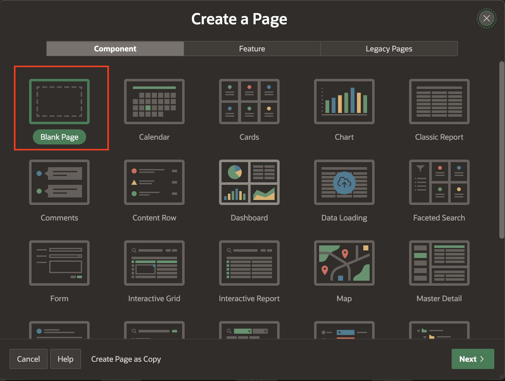
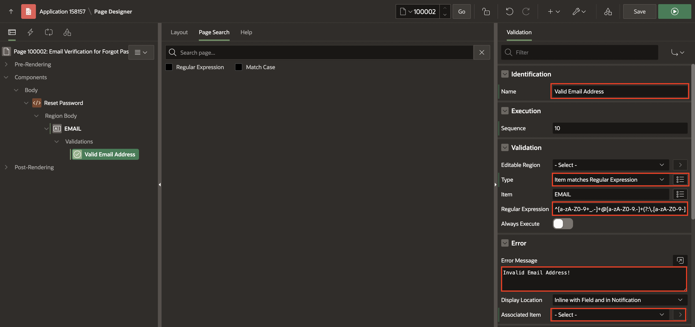
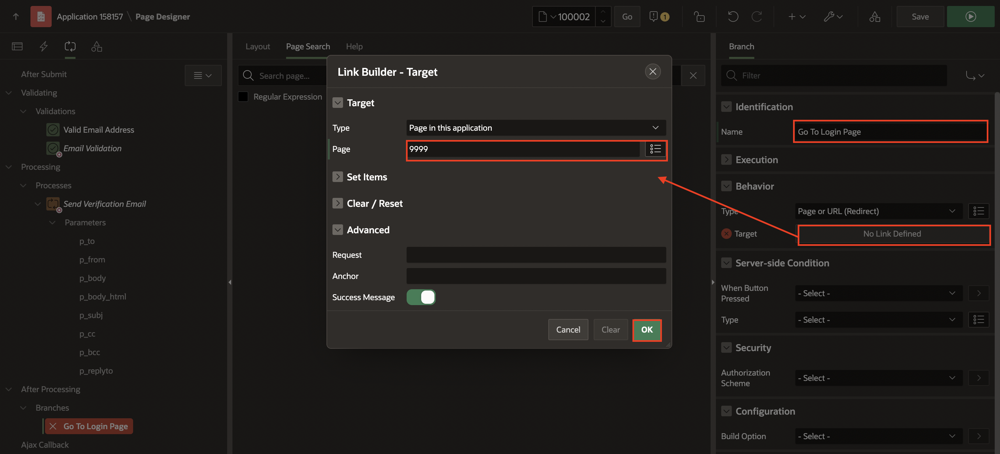
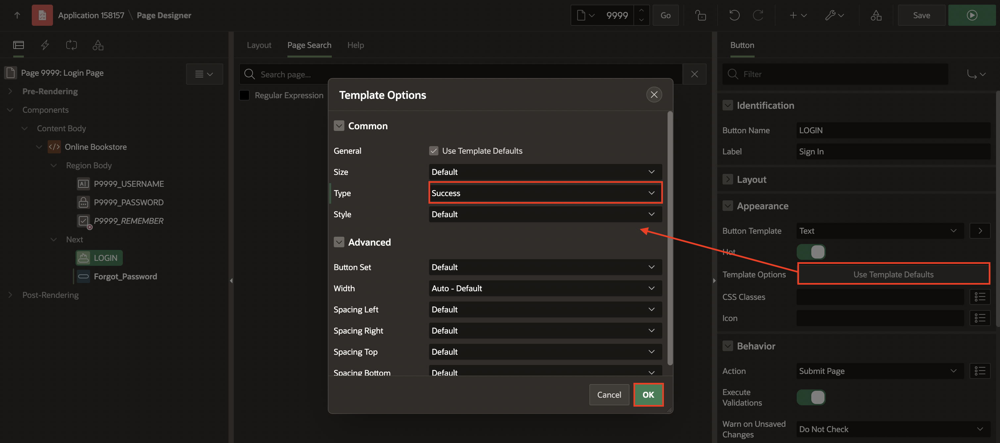
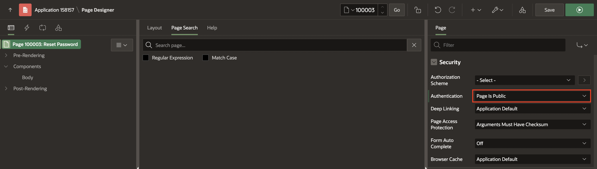
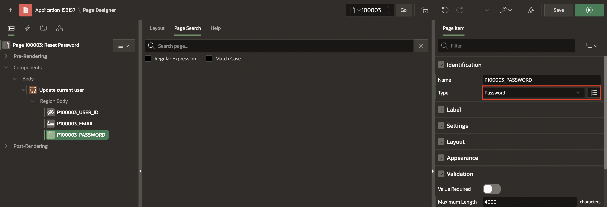
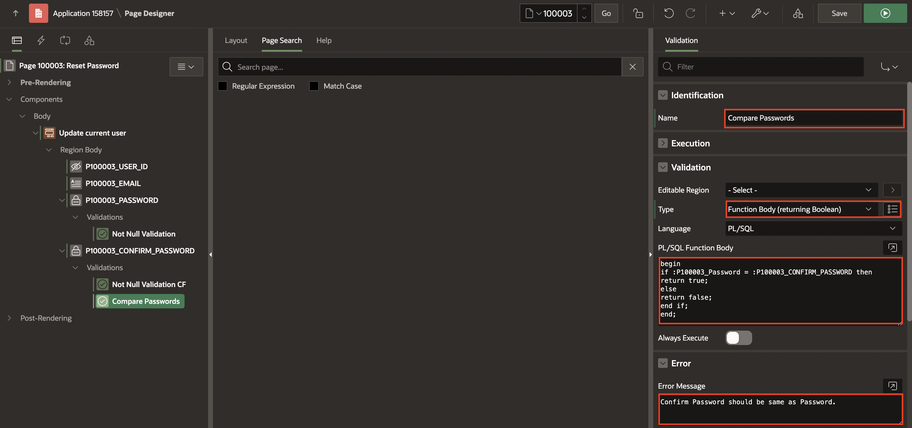
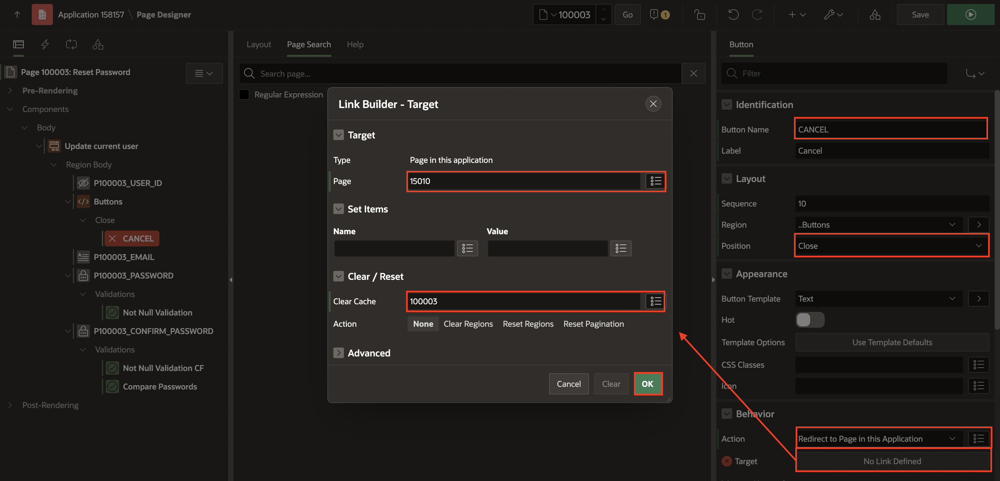

# Improve User Onboarding

## Introduction

## Task 1: Creating Email Verification for Forgot Password - Page 100002


Create the forgot password Page

1. Navigate to Application Home Page.

2. Click **Create Page**.

   

3. Click **Blank Page**.

    

4. Enter/select the following:

    - Page Number: **100002**

    - Name: **Email Verification for Forgot Password**

    - Use Breadcrumb: **Toggle Off**

    - Use Navigation: **Toggle Off**

    Click **Create Page**.

  

5. In the property editor, update the following:

     - Security > Authentication: **Page is Public**

  

6. Right-click **Body** and select **Create Region**.

    

7. In the property editor, enter/select the following:

    - Identification > Title: **Reset Password**

  

8. Right-click **Reset Password** region and select **Create Page Item**.

    

9. In the property editor, enter/select the following:

    - Identification > Name: **EMAIL**

10. Right-click **EMAIL** and select **Create Validation**.

   

11. In the property editor, enter/select the following:

    - Identification > Name: ** Valid Email Address**

    - Under Validation:

        - Type: **Item matches Regular Expression**

        - Item: **EMAIL**

        - Regular Expression : **^[a-zA-Z0-9+_.-]+@[a-zA-Z0-9.-]+(?:\.[a-zA-Z0-9-]+)*$**

    - Under Error:

        - Error Message: **Invalid Email Address!**

        - Associated Item: **-Select-**

    

12. Right-click **Validations** and select **Create Validation**. In the property editor, enter/select the following:

     - Identification > Name: **Email Validation**

     - Under Validation:

        - Type: **Rows returned**

        - SQL Query: Copy and Paste the below query: 

        ```
        <copy>
        select u.email from obs_users u  where u.email = lower(:EMAIL)
        </copy>
         ```

     - Error > Error Message: **No Account Found!**

     - Server-side Condition > Type: **Inline Validation Errors NOT displayed**

    

13. Right-click **EMAIL** and select **Create Button Below**.

    

14. In the property editor, enter/select the following:

    - Under Identification:

        - Button Name: **Send**

        - Label: **Send Reset Password Link**

    - Appearance > Template Options: Click **Use Template Defaults** and update Type: **Primary**

    Click **OK**

    

15. Navigate the **Processing** tab ,Right-click **Processing** and select **Create Process**.

    

16. In the property editor, enter/select the following:

    - Under Identification:

        - Name: **Send Verification Email**

        - Type: **Invoke API**

    - Under Settings:

        - Package: **APEX_MAIL**

        - Procedure or Function: **SEND**

    - Server-side Condition > When Button Pressed: **Send**

    - Success Message > Success Message: **Reset Password Link sent to your email address**.

    

17. Under **Send Verification Email** process, expand **Parameters** and update the following:

    - **p\_to**:

        - Under Value:

             - Type: **Item**

             - Item: **EMAIL**

    

    - **p\_from**:

        - Under Value:

            - Type: **Static Value**

            - Static Value: **noreply.obs@oracle.com**

    

    - **p\_body**:

        - Under Value:

            - Type: **Static Value**

            - Static Value: **To view the content of this message, please use an HTML-enabled mail client.**

    

    - **p\_body\_html**:

        - Under Value:

            - Type: **Function Body**

            - PL/SQL Function Body: Copy and Paste the below code:

            ```
            <copy>
            declare
               v_url  varchar2(1000);
            begin
               v_url := apex_util.host_url || APEX_PAGE.GET_URL (
               p_page   => 100003,
               p_items  => 'P100003_EMAIL',
               p_values =>  :EMAIL);
            return '<html><body>' || utl_tcp.crlf ||'<p>Please open the link to Reset Password for your account' || utl_tcp.crlf ||'<p><a href="'|| v_url ||'">
              <b> Reset Password </b></a></p>'|| utl_tcp.crlf ||
                   '<p>Sincerely,<br />' || utl_tcp.crlf ||
                   'The Online book store Team<br />' || utl_tcp.crlf || '</body></html>';
             end;
            </copy>
            ```

    

    - **p\_subj**:

        - Value > Type: **API Default**

        - Comments > Comments: **Reset Password**

    

18. Right-click **After Processing** and select **Create Branch**.

    

19. In the property editor, enter/select the following:

    - Identification > Name: **Go To Login Page**

    - Behavior > Target > Page: **9999**

      Click **OK**.

    

20. Click **Save**.


## Task 2: Update the Login Page

1. Navigate to Page - 9999.

    

2. Under **Online Bookstore** region, right-click **Next** and select **Create Button**.

    

3. In the Property editor, enter/select the following:

    - Under Identification:

        - Button Name: **Forgot_Password**

        - Label: **Forgot Password**

    - Under Appearance > Template options: Click **Use Template Defaults**
        - Size: Small

        - Type: Danger

        - Width: Stretch

        - Spacing Top: Small

          Click **OK**.

    - Under Behaviour:

        - Action: **Redirect to page in this application**

        - Target: Click **No Link Defined**

            - Page: **100002**

            - Clear Cache: **100002**

            Click **OK**.

  

  

4. Click **LOGIN** and update the following:

    - Under Appearance > Template options: Click **Use Template Defaults**

        - Type: **Success**

          Click **OK**.

  

5. Click **Save**. 


## Task 3: Creating  Reset Password - Page 100003

1. Navigate to the Application Home Page.

2. Click **Create Page**.

    

3. Select **Blank Page**.

    

4. Enter/select the following:

    - Under Page Definition:

        - Page Number: **100003**

        - Name: **Reset Password**

    - Under Navigation:

       - Use Breadcrumb: **Toggle off**

       - Use Navigation: **Toggle Off**

       Click **Create Page**.

  

5. In the Property editor, update the following:

    - Under Security > Authentication: **Page is Public**

  

6. In the left pane, Right-click **Body** and select **Create Region**.

   

7. In the Property editor, enter/select the following:

    - Under Identification:

        - Title: **Update current user**

        - Type: **Form**

    - Source > Table Name: **OBS_USERS**

  

8. Under **Update current user** region, Delete all page items except **P100003\_EMAIL** and **P100003\_PASSWORD**.

   

   

9. Select **P100003\_EMAIL** and update the following:

    - Identification > Type: **Display Only**

    - Source > Primary Key: **Toggle On**

    - Security > Session State Protection: **Unrestricted**

  

  

10. Select **P100003\_Password** and update the following:

    - Identification > Type: **Password**

    

11. Right-click **P100003\_Password** and select **Create Validation**.

    

12. In the Property editor, enter/select the following:

    - Identification > Name: **Not Null Validation**

    - Under Validation:

        - Type: **Function Body (Returning Boolean)**

        - PL/SQL Function Body: Copy and Paste the below code:

        ```
        <copy>
        if :P100003_Password is not NULL then
          return true;
        else
          return false;
        end if;
       </copy>
      ```

    - Error > Error Message: **Password field should have some value**

    

13. Right-click **Update current user** and select **Create Page Item**.

    

14. In the Property editor, enter/select the following:

    - Under Identification:

        - Name: **P100003\_CONFIRM\_PASSWORD**

        - Type: **Password**

    

15. Right-click **P100003_CONFIRM_PASSWORD** and select **Create Validation**.

    

16. In the Property editor, enter/select the following:

    - Identification > Name: Not Null Validation CF

    - Under Validation:

        - Type: **Function Body (Returning Boolean)**

        - PL/SQL Function Body: Copy and Paste the below code:

        ```
        <copy>
        if :P100003_CONFIRM_PASSWORD is not NULL then
          return true;
        else
          return false;
        end if;
        </copy>
       ```

    - Error > Error Message: **Password field should have some value**

    

17. Again, Right-click **P100003_CONFIRM_PASSWORD** and select **Create Validation**.

18. In the Property editor, enter/select the following:

    - Identification > Name: **Compare Passwords**

    - Under Validation:

        - Type: **Function Body (Returning Boolean)**

        - PL/SQL Function Body: Copy and Paste the below code:

            ```
            <copy>
            if :P100003_Password = :P100003_CONFIRM_PASSWORD then
               return true;
             else
               return false;
             end if;
           end;
            </copy>
           ```

    - Error > Error Message: **Confirm Password is not same as Password entered above**

    

19. Right-click **Update current user** region and select **Create Sub-Region**.

    

20. In the Property editor, enter/select the following:

    - Identification > Title: **Buttons**

    - Under Layout:

        - Position: **Region Body**

        - Template: **Buttons Container**

        - Template option: **Use Template Options**

            - Style: **Remove UI Decoration**

            Click **OK**.

    

21. Right-click **Buttons** and select **Create Button**.

    

22. In the Property editor, enter/select the following:

    - Identification > Button Name: **CANCEL**

    - Layout > Position: **Close**

    - Under Behavior:

        - Action: **Redirect to page in this Application**

        - Target: **No Link Defined**

            - Page: **15010**

            - Clear Cache: **100003**

            Click **OK**.

    

23. Right-click **CANCEL** and select **Create Dynamic Action**.

    

24. In the Property editor, enter/select the following:

    - Identification > Name: **Cancel Dialog**

    - When > Event: **Click**

    

25. Right-click **Buttons** and select **Create Button**.

26. In the Property editor, enter/select the following:

    - Under Identification:

        - Button Name: **SAVE**

        - Label: **Apply Changes**

    - Layout > Position: **Next**

    - Appearance > Hot: **Toggle On**

    - Behaviour > Database Action: **SQL UPDATE action**

    

27. Navigate to the **Processing** tab, Right-click **Processing** and Select **Create Process**.

        

28. In the Property editor, enter/select the following:

    - Under Identification:

        - Name: **Process from Update current user**

        - Type: **Form - Automatic Row Processing (DML)**

        - Form Region: **Update current user**

    - Success Message > Success Message: **Updated Profile details successfully!**

    

27. Right-click **After Processing** and select create a branch
Under Identification
Name: Go to My Profile
Under Behavior
Target
Page: 12
Clear Cache: 1
Click OK.
Click Save.
create a new blank page 
Page Number: 12
Name: LOGIN_HOME
Deselect Use Breadcrumb and Use Navigation
  Click on Create Page
Right Click on Before Header under Pre-rendering and create a branch
Under Behavior
Target
Page:1
Click OK.
Click Save.
Task 3: Creating  Email Verification for user signup - Page 100001


Create a New Signup Page

Go to the Application Home Page
Click Create Page to open Create Page Wizard.
Choose Form Page.
Name: Email Verification for user signup
Page Number: 100001
Table/ View Name: OBS_UNVERIFIED_USERS
Deselect Use Breadcrumb and Use Navigation
click on Next
Branch Here on Submit: 9999
Cancel and Go To Page: 9999
click on Create Page
Under Security
Authentication: Page is Public.
Delete two buttons named DELETE and SAVE
Right-click on P100001_EMAIL and create a validation
Under Identification
Name: If EMAIL already present
Under Validation
Type: No Rows returned. 
SQL Query:

select email from obs_users where email = lower(:P100001_EMAIL)

Under Error
Error Message: Account already existed for this email ID.
Under Server-side Condition
Type: Inline Validation Errors not displayed
change the label of the CREATE Button to "Send Signup Email"
Go to the Processing tab and select Process form Email Verification for user signup
Under Success Message
Success Message: Email Sent
Create another process
Under Identification
Name: Send Verification Email
Type: Invoke API
Under Settings
Package: APEX_MAIL
Procedure or Function: SEND
Under Server-side Condition
When Button Pressed: CREATE
Open the parameters below Send Verification Email
p_to
Under Value
Type: Item
Item: P100001_EMAIL
p_from
Under Value
Type: Static Value
Static Value: noreply.obs@oracle.com
p_body

Under Value
Type: Static Value
Static Value: To view the content of this message, please use an HTML-enabled mail client.
p_body_html

Under Value
Type: Function Body 
PL/SQL Function Body:

declare
l_url varchar2(1000);
begin
l_url := apex_util.host_url || APEX_PAGE.GET_URL (
p_page  => 10000,
p_items => 'P10000_EMAIL',
p_values => :P100001_EMAIL);

return '<html><body>' || utl_tcp.crlf ||
'<p>Please open the link to create your account' || utl_tcp.crlf ||
'<p><a href="'|| l_url ||'">
<b> Setup your account </b></a></p>'|| utl_tcp.crlf ||
'<p>Sincerely,<br />' || utl_tcp.crlf ||
'The Online book store Team<br />' || utl_tcp.crlf ||
'</body></html>';

end;
p_subj

Under Value
Type: API Default
Under Comments 
Comments: Set up your online bookstore account.
Click Save.


Create the New Here signup button in the login Page

Go to Page - 9999
Right-click next under Online Bookstore and create a button in the section below the forgot_password button.
Under Identification
Button Name: Signup
Label: New here? Signup
Under Appearance
Template options
Size: Small
Style: Display as Link
Click OK.
Under Behavior
Action: Redirect to page in this application
Target
Page: 100001
Click OK.
Click Save.
Task 4: Creating SignUp - Page 10000
Go to the Application Home Page
Click Create Page to open Create Page Wizard.
Choose Form Page.
Name: SignUp
Page Number: 10000
Table/ View Name: OBS_USERS
Deselect Use Breadcrumb and Use Navigation
click on Next
click on Create Page
Under Security
Authentication: Page is Public
Open Page Items of SignUp
Delete P10000_MIME_TYPE and P10000_PICTURE_URL
Select P10000_USERNAME, P10000_FULL_NAME and  P10000_PASSWORD
Under Identification
 Type: Text Field
Select P10000_EMAIL
Under Identification
 Type: Display Only 
Select P10000_FULL_NAME
Under Validation
On the Value Required
Select P10000_PROFILE_PIC
Under Identification
 Type: Image Upload
Under Storage
MIME TYPE COLUMN: MIME_TYPE
Select P10000_IS_ADMIN
Under Identification
 Type: Hidden
Click on Create
Under Identification
Label: SignUp
Go to the processing tab and select Process form Signup
Under Settings
Disable Prevent Lost Updates
Lock Row: No
Create another process
Under Identification
Name: Remove from unverified user table
Under Source
PL/SQL Code:

delete from obs_unverified_users where email= lower(:P10000_EMAIL);
Create another process
Under Identification
Name: Set Username Cookie
Type: Invoke API
Under Settings
Package: APEX_AUTHENTICATION
Procedure or Function: SEND_LOGIN_USERNAME_COOKIE
Under Server-side Condition
When button pressed: CREATE
Delete p_cookie_name under Parameters
Select p_username under Parameters
Under Value
Type: Expression
PL/SQL Expression:

lower( :P10000_EMAIL )
Select p_consent under Parameters
Under Value
Type: API Default
Create another process
Under Identification
Name: Login
Type: Invoke API
Under Settings
Package: APEX_AUTHENTICATION
Procedure or Function: LOGIN
Select p_username under Parameters
Under Value
Type: Item
Item: P10000_EMAIL
Create another process
Under Identification
Name : Clear Page(s) Cache
Type: Clear Session State
Under Server-side Condition
When Button pressed: Create
Click Save.
