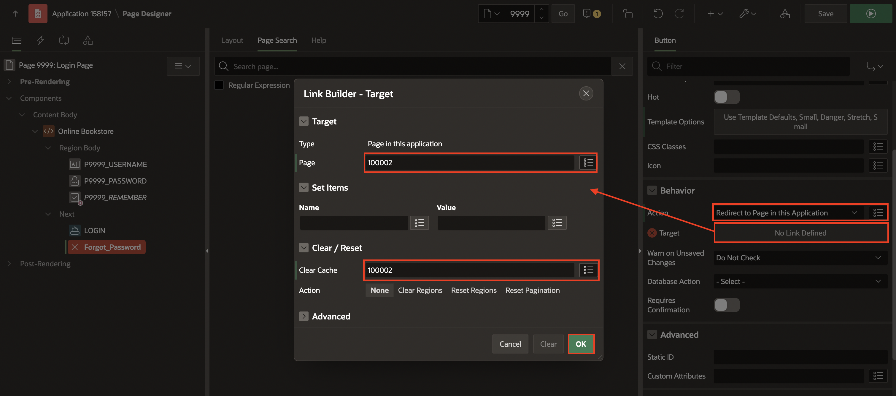
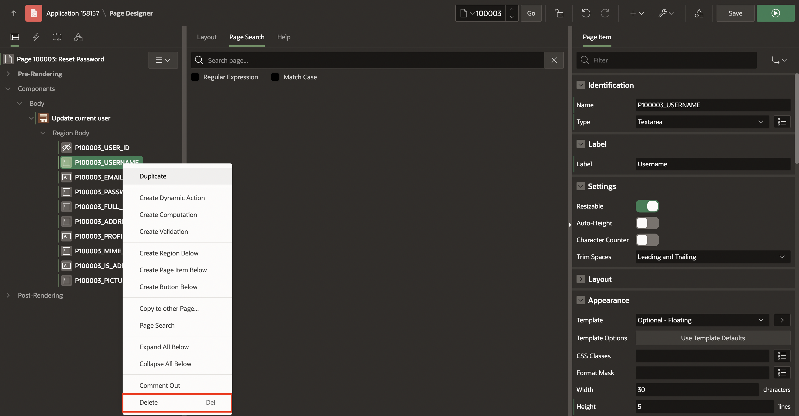
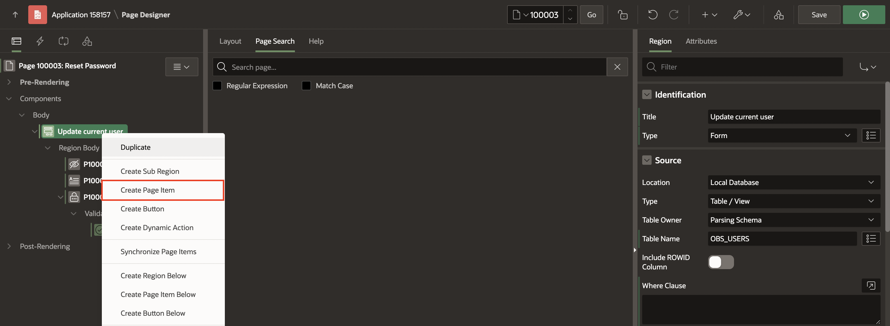

# Improve User Onboarding

## Introduction

## Task 1: Creating Email Verification for Forgot Password - Page 100002

Create the forgot password Page

1. Navigate to Application Home Page.

2. Click **Create Page**.

   

3. Click **Blank Page**.

    

4. Enter/select the following:

    - Under Page Definition:

        - Page Number: **100002**

        - Name: **Email Verification for Forgot Password**

    - Under Navigation:

        - Use Breadcrumb: **Toggle Off**

        - Use Navigation: **Toggle Off**

       Click **Create Page**.

    

5. In the property editor, update the following:

     - Under Security > Authentication: **Page is Public**

    

6. Right-click **Body** and click **Create Region**.

    

7. In the property editor, enter/select the following:

    - Under Identification > Name: **Reset Password**

    

8. Right-click **Reset Password** region and click **Create Page Item**.

    

9. In the property editor, enter/select the following:

    - Under Identification > Name: **EMAIL**

10. Right-click **EMAIL** and click **Create Validation**.

    

11. In the property editor, enter/select the following:

    - Under Identification > Name: **Valid Email Address**

    - Under Validation:

        - Type: **Item matches Regular Expression**

        - Item: **EMAIL**

        - Regular Expression : **^[a-zA-Z0-9+_.-]+@[a-zA-Z0-9.-]+(?:\.[a-zA-Z0-9-]+)*$**

    - Under Error:

        - Error Message: **Invalid Email Address!**

        - Associated Item: **-Select-**

    

12. Right-click **Validations** and select **Create Validation**. In the property editor, enter/select the following:

     - Under Identification > Name: **Email Validation**

     - Under Validation:

        - Type: **Rows returned**

        - SQL Query: Copy and Paste the below query:

        ```
        <copy>
        select u.email from obs_users u  where u.email = lower(:EMAIL);
        </copy>
         ```

     - Under Error > Error Message: **No Account Found!**

     - Under Server-side Condition > Type: **Inline Validation Errors NOT displayed**

    

13. Right-click **EMAIL** and click **Create Button Below**.

    

14. In the property editor, enter/select the following:

    - Under Identification:

        - Button Name: **Send**

        - Label: **Send Reset Password Link**

    - Under Appearance > Template Options: Click **Use Template Defaults**

        - Type: **Primary**

        Click **OK**

    

15. Navigate the **Processing** tab, right-click **Processing** and click **Create Process**.

    

16. In the property editor, enter/select the following:

    - Under Identification:

        - Name: **Send Verification Email**

        - Type: **Invoke API**

    - Under Settings:

        - Package: **APEX_MAIL**

        - Procedure or Function: **SEND**

    - Under Success Message > Success Message: **Reset Password Link sent to your email address**.

    - Under Server-side Condition > When Button Pressed: **Send**

    

17. Under **Send Verification Email** process, expand **Parameters** and update the following:

    - **p\_to**:

        - Under Value:

             - Type: **Item**

             - Item: **EMAIL**

    

    - **p\_from**:

        - Under Value:

            - Type: **Static Value**

            - Static Value: **noreply.obs@oracle.com**

    

    - **p\_body**:

        - Under Value:

            - Type: **Static Value**

            - Static Value: **To view the content of this message, please use an HTML-enabled mail client.**

    

    - **p\_body\_html**:

        - Under Value:

            - Type: **Function Body**

            - PL/SQL Function Body: Copy and Paste the below code:

            ```
            <copy>
            declare
                v_url  varchar2(1000);
            begin
                v_url := apex_util.host_url || APEX_PAGE.GET_URL (
                        p_page   => 100003,
                        p_items  => 'P100003_EMAIL',
                        p_values =>  :EMAIL);

                return '<html><body>' || utl_tcp.crlf ||

                            '<p>Please open the link to Reset Password for your account' || utl_tcp.crlf ||
                            '<p><a href="'|| v_url ||'">
                                <b> Reset Password </b></a></p>'|| utl_tcp.crlf ||
                            '<p>Sincerely,<br />' || utl_tcp.crlf ||
                            'The Online book store Team<br />' || utl_tcp.crlf ||

                            '</body></html>';

            end;
            </copy>
            ```

    

    - **p\_subj**:

        - Under Value > Type: **API Default**

        - Under Comments > Comments: **Reset Password**

    

18. Right-click **After Processing** and select **Create Branch**.

    

19. In the property editor, enter/select the following:

    - Under Identification > Name: **Go To Login Page**

    - Under Behavior:
        - Target: Click **No Link Defined**

            - Page: **9999**

            Click **OK**.

    

20. Click **Save**.

    Update the Login Page

21. Navigate to Page - 9999.

    

22. Under **Online Bookstore** region, right-click **Next** and select **Create Button**.

    

23. In the Property editor, enter/select the following:

    - Under Identification:

        - Button Name: **Forgot_Password**

        - Label: **Forgot Password**

    - Under Appearance > Template options: Click **Use Template Defaults**
        - Size: Small

        - Type: Danger

        - Width: Stretch

        - Spacing Top: Small

          Click **OK**.

    - Under Behavior:

        - Action: **Redirect to page in this application**

        - Target: Click **No Link Defined**

            - Page: **100002**

            - Clear Cache: **100002**

            Click **OK**.

    

    

24. Click **LOGIN** button and update the following:

    - Under Appearance > Template options: Click **Use Template Defaults**

        - Type: **Success**

          Click **OK**.

    

25. Click **Save**. 

## Task 2: Creating  Reset Password - Page 100003

1. On page designer toolbar, Navigate to **(+ v)** and click **Page**.

2. Click **Blank Page**.

    

3. Enter/select the following:

    - Under Page Definition:

        - Page Number: **100003**

        - Name: **Reset Password**

    - Under Navigation:

        - Use Breadcrumb: **Toggle Off**

        - Use Navigation: **Toggle Off**

       Click **Create Page**.

    

4. In the Property editor, update the following:

    - Under Security > Authentication: **Page is Public**

    

5. In the left pane, right-click **Body** and click **Create Region**.

   

6. In the Property editor, enter/select the following:

    - Under Identification:

        - Name: **Update Current User**

        - Type: **Form**

    - Under Source > Table Name: **OBS_USERS**

    

7. Under **Update Current User** region, Delete all page items except **P100003\_USER\_ID**, **P100003\_EMAIL** and **P100003\_PASSWORD**.

   

   

8. Select **P100003\_EMAIL** and update the following:

    - Under Identification > Type: **Display Only**

    - Under Source > Primary Key: **Toggle On**

    - Under Security > Session State Protection: **Unrestricted**

    

    

9. Select **P100003\_PASSWORD** and update the following:

    - Under Identification > Type: **Password**

    

10. Right-click **P100003\_PASSWORD** and click **Create Validation**.

    

11. In the Property editor, enter/select the following:

    - Under Identification > Name: **Not Null Validation**

    - Under Validation:

        - Type: **Function Body (Returning Boolean)**

        - PL/SQL Function Body: Copy and Paste the below code:

         ```
        <copy>
        if :P100003_Password is not NULL then
            return true;
        else
            return false;
        end if;
       </copy>
        ```

        - Under Error > Error Message: **Password field should have some value.**

    

12. Right-click **Update Current User** and click **Create Page Item**.

    

13. In the Property editor, enter/select the following:

    - Under Identification:

        - Name: **P100003\_CONFIRM\_PASSWORD**

        - Type: **Password**

    

14. Right-click **P100003\_CONFIRM\_PASSWORD** and click **Create Validation**.

    

15. In the Property editor, enter/select the following:

    - Under Identification > Name: **Not Null Validation1**

    - Under Validation:

        - Type: **Function Body (Returning Boolean)**

        - PL/SQL Function Body: Copy and Paste the below code:

        ```
        <copy>
        if :P100003_CONFIRM_PASSWORD is not NULL then
            return true;
        else
            return false;
        end if;
        </copy>
       ```

    - Under Error > Error Message: **Password field should have some value.**

    

16. Again, right-click **P100003\_CONFIRM\_PASSWORD** and click **Create Validation**.

17. In the Property editor, enter/select the following:

    - Under Identification > Name: **Compare Passwords**

    - Under Validation:

        - Type: **Function Body (Returning Boolean)**

        - PL/SQL Function Body: Copy and Paste the below code:

            ```
            <copy>
            begin
             if :P100003_Password = :P100003_CONFIRM_PASSWORD then
                return true;
             else
                return false;
             end if;
            end;
            </copy>
           ```

    - Under Error > Error Message: **Confirm Password is not same as Password entered above.**

    

18. Right-click **Update Current User** region and click **Create Sub-Region**.

    

19. In the Property editor, enter/select the following:

    - Under Identification > Name: **Buttons**

    - Under Layout:

        - Position: **Region Body**

    - Under Appearance:

        - Template: **Buttons Container**

        - Template option: **Use Template Options**

            - Style: **Remove UI Decoration**

            Click **OK**.

    

20. Right-click **Buttons** and click **Create Button**.

    

21. In the Property editor, enter/select the following:

    - Under Identification > Button Name: **CANCEL**

    - Under Layout > Slot: **Close**

    - Under Behavior:

        - Action: **Redirect to page in this Application**

        - Target: Click **No Link Defined**

            - Page: **15010**

            - Clear Cache: **100003**

            Click **OK**.

    

22. Right-click **CANCEL** and click **Create Dynamic Action**.

    

23. In the Property editor, enter/select the following:

    - Under Identification > Name: **Cancel Dialog**

    - Under When > Event: **Click**

    

24. Right-click **Buttons** and click **Create Button**.

25. In the Property editor, enter/select the following:

    - Under Identification:

        - Button Name: **SAVE**

        - Label: **Apply Changes**

    - Under Layout > Slot: **Next**

    - Under Appearance > Hot: **Toggle On**

    - Under Behavior > Database Action: **SQL UPDATE action**

    

26. Navigate to **Processing** tab, right-click **Processing** and click **Create Process**.

    

27. In the Property editor, enter/select the following:

    - Under Identification:

        - Name: **Process from Update current user**

        - Type: **Form - Automatic Row Processing (DML)**

        - Form Region: **Update current user**

    - Success Message > Success Message: **Updated Profile details successfully!**

    

28. Right-click **After Processing** and click **Create Branch**.

    

29. In the property editor, enter/select the following:

    - Under Identification > Name: **Go to My Profile**

    - Under Behavior > Target: Click **No Link Defined**

         - Page: **12**

         - Clear Cache: **1**

         Click **OK**

    

30. Click **Save**.

31. On page designer toolbar, Navigate to **(+ v)** and click **Page**.

    

32. Click **Blank Page**.

    

33. Enter/select the following:

    - Under Page Definition:

        - Page Number: **12**

        - Name: **LOGIN_HOME**

    - Under Navigation:

        - Use Breadcrumb: **Toggle Off**

        - Use Navigation: **Toggle Off**

       Click **Create Page**.

    

34. Right-click **Before Header** under **Pre-rendering** and click **Create Branch**
    - Under Behavior > Target: Click **No Link Defined**

         - Page: **10**

         Click **OK**

    

35. Click **Save**.

## Task 3: Creating Email Verification for User SignUp - Page 100001

Create the user signUp Page

1. On page designer toolbar, Navigate to **(+ v)** and click **Page**.

2. Choose **Form Page**.

    

3. Enter/select the following:

    - Under Page Definition:

        - Page Number: **100001**

        - Name: **Email Verification for User SignUp**

    - Under Data Source:

        - Table/View Name: **OBS\_UNVERIFIED\_USERS**

    - Under Navigation::

        - Use Breadcrumb: **Toggle Off**

        - Use Navigation: **Toggle Off**

    Click **Next**.

    - Under Branch Pages:

        - Branch Here on Submit: **9999**

        - Cancel and Go To Page: **9999**

    Click **Create Page**.

    

4. In the property editor, update the following:

     - Under Security > Authentication: **Page is Public**

    

5. Delete two buttons named **DELETE** and **SAVE** under **Email Verification for User SignUp** region.

    

6. Right-click **P100001\_EMAIL** and click **Create Validation**.

    

7. In the property editor, enter/select the following:

    - Under Identification > Name: **If Email Already Present**

    - Under Validation:

        - Type: **No Rows returned**

        - SQL Query: Copy and Paste the below query:

        ```
        <copy>
        select email from obs_users where email = lower(:P100001_EMAIL);
        </copy>
         ```

    - Under Error:

        - Error Message: **Account already existed for this email ID.**

    - Under Server-side Condition:

        - Type: **Inline Validation Errors NOT displayed**

    

8. Select **CREATE** Button under **Email Verification for User SignUp** region and update the following:

    - Under Identification > Label: **Send SignUp Email**

9. Navigate to **Processing** tab, Select **Process form Email Verification for User SignUp** under **processes** under **Processing** and update the following:

    - Under Success Message > Success Message: **Email Sent**

    

10. Right-click **Processing** and click **Create Process**.

    

11. In the property editor, enter/select the following:

    - Under Identification:

        - Name: **Send Verification Email**

        - Type: **Invoke API**

    - Under Settings:

        - Package: **APEX_MAIL**

        - Procedure or Function: **SEND**

    - Server-side Condition > When Button Pressed: **CREATE**

    

12. Under **Send Verification Email** process, expand **Parameters** and update the following:

    - **p\_to**:

        - Under Value:

             - Type: **Item**

             - Item: **P100001\_EMAIL**

    

    - **p\_from**:

        - Under Value:

            - Type: **Static Value**

            - Static Value: **noreply.obs@oracle.com**

    

    - **p\_body**:

        - Under Value:

            - Type: **Static Value**

            - Static Value: **To view the content of this message, please use an HTML-enabled mail client.**

    

    - **p\_body\_html**:

        - Under Value:

            - Type: **Function Body**

            - PL/SQL Function Body: Copy and Paste the below code:

            ```
            <copy>
            declare
            l_url varchar2(1000);
            begin
            l_url := apex_util.host_url || APEX_PAGE.GET_URL (
            p_page  => 10000,
            p_items => 'P10000_EMAIL',
            p_values => :P100001_EMAIL);

            return '<html><body>' || utl_tcp.crlf ||
            '<p>Please open the link to create your account' || utl_tcp.crlf ||
            '<p><a href="'|| l_url ||'">
            <b> Setup your account </b></a></p>'|| utl_tcp.crlf ||
            '<p>Sincerely,<br />' || utl_tcp.crlf ||
            'The Online book store Team<br />' || utl_tcp.crlf ||
            '</body></html>';

            end;
            </copy>
            ```

    

    - **p\_subj**:

        - Under Value > Type: **API Default**

        - Under Comments > Comments: **Set up your online bookstore account**.

    

13. Click **Save**.

    Update the Login Page

14. Navigate to Page - 9999.

    

15. Under **Online Bookstore** region, right-click **Next** and select **Create Button**.

    

16. In the Property editor, enter/select the following:

    - Under Identification:

        - Button Name: **SignUp**

        - Label: **New here? SignUp**

    - Under Appearance > Template options: Click **Use Template Defaults**

        - Size: **Small**

        - Style: **Display as Link**

          Click **OK**.

    - Under Behavior:

        - Action: **Redirect to page in this application**

        - Target: Click **No Link Defined**

            - Page: **100001**

            Click **OK**.

    

17. Click **Save**.

## Task 4: Creating  SignUp - Page 100000

1. Navigate to the Application Home Page.

2. Click **Create Page**.

    

3. Choose **Form Page**.

    

4. Enter/select the following:

    - Under Page Definition:

        - Page Number: **10000**

        - Name: **SignUp**

    - Under Data Source:

        - Table/View Name: **OBS\_USERS**

    - Under Navigation::

        - Use Breadcrumb: **Toggle Off**

        - Use Navigation: **Toggle Off**

    Click **Next**.

    - Under Branch Pages:

        - Branch Here on Submit: **10**

        - Cancel and Go To Page: **10**

    Click **Create Page**.

    

5. In the Property editor, update the following:

    - Under Security > Authentication: **Page is Public**

    

6. Under Update SignUp region, Delete page items **P10000\_MIME\_TYPE** and **P10000\_PICTURE\_URL**.

7. Select P10000\_USERNAME, P10000\_FULL\_NAME and P10000\_PASSWORD and in the Property editor, enter/select the following:

    - Under Identification > Type: **Text Field**

8. Select P10000\_EMAIL and in the Property editor, enter/select the following:

    - Under Identification > Type: **Display Only**

9. Select P10000\_FULL\_NAME and in the Property editor, enter/select the following:

    - Under Validation > Value Required: **Toggle On**

10. Select P10000\_PROFILE\_PIC and in the Property editor, enter/select the following:

    - Under Identification > Type: **Image Upload**

    - Under Storage > MIME Type Column
: **MIME_TYPE**

11. Select P10000\_IS\_ADMIN and in the Property editor, enter/select the following:

    - Under Identification > Type: **Hidden**

12. Right-click **SignUp** and select **Create Button**

13. In the Property editor, enter/select the following:

    - Under Identification:

        - Button Name: **Cancel**

    - Under Layout

        - Slot: **Close**

    - Under Behavior

        - Action: **Submit Page**

14. Select **Create** button and update the label.

    - Under Identification:

        - Label: SignUp

15. Navigate the **Processing** tab, Select **Process form SignUp** under **processes** under **Processing**.

16. In the property editor, enter/select the following:

    - Under Settings:

        - Prevent Lost Updates: **Toggle Off**

        - Lock Row: **No**

17. Right-click **Processing** and select **Create Process**.

18. In the property editor, enter/select the following:

    - Under Identification:

        - Name: **Remove from unverified user table**

    - Under Sources

        - PL/SQL Code: Copy and Paste the below code:

        ```
        <copy>
        delete from obs_unverified_users where email= lower(:P10000_EMAIL);
        </copy>
         ```

19. Right-click **Processing** and select **Create Process**.

20. In the property editor, enter/select the following:

    - Under Identification:

        - Name: **Set Username Cookie**

        - Type: **Invoke API**

    - Under Settings:

        - Package: **APEX_AUTHENTICATION**

        - Procedure or Function: **SEND_LOGIN_USERNAME_COOKIE**

    - Server-side Condition > When Button Pressed: **CREATE**

21. Under **Set Username Cookie** process, expand **Parameters** and update the following:

    - Delete **p\_cookie\_name**

    - Select **p\_username**:

        - Under Value:

            - Type: **Expression**

            - PL/SQL Expression: **lower(:P10000_EMAIL)**

    - Select **p\_consent**:

        - Under Value:

            - Type: **API Default**

22. Right-click **Processing** and select **Create Process**.

23. In the property editor, enter/select the following:

    - Under Identification:

        - Name: **Login**

        - Type: **Invoke API**

    - Under Settings:

        - Package: **APEX_AUTHENTICATION**

        - Procedure or Function: **LOGIN**

24. Under **Set Username Cookie** process, expand **Parameters** and update the following:

    - Select **p\_username**:

        - Under Value:

            - Type: **Item**

            - Item: **P10000_EMAIL**

25. Right-click **Processing** and select **Create Process**.

26. In the property editor, enter/select the following:

    - Under Identification:

        - Name: **Clear Page(s) Cache**

        - Type: **Clear Session State**

    - Under Server-side Condition:

        - When Button pressed: **Create**

27. Click **Save**.

## Task 5: Login with Google

 You create a Social Sign-in authentication scheme in this task to enable Google Authentication.

1. Log in to Google's developer [console](https://console.developers.google.com).

     *Note: If you are logging in to the Google developer console for the first time, you must check and click on AGREE AND CONTINUE*

2. Click Create Project.

    

3. In the New Project Screen, For Project Name: Enter **OBS Application** and Click **Create**.

    

4. Click the OAuth consent screen (from the left side menu), Select **External**, and Click **Create**

    

5. In the OAuth consent screen, Enter the following:

   Under **App Information** Section:

      - For Application name: Enter your **Application Name**

      - For User support email: Enter your **Email Address**

   Under **App Domain** Section:

      - For Application Homepage link: Enter your **Application Homepage link**

   Under **Authorized domains** Section:

      - Click **+ADD DOMAIN** and add your Authorized domain. For example, I added oracle.com

   Under **Developer contact information** Section:

     - For Email addresses: Enter your **Email Address**

    

    

   Click **Save and Continue**.

6. In Scopes, leave everything as default and Click **Save and Continue**.

    

7. In Test users, leave everything as default and Click **Save and Continue**.

    

8. Click **Credentials** (from left side menu). Now Click **+Create Credentials** and select **OAuth client ID**.

    

9. Enter the following:

     - For Application type: Select **Web Application**

     - For Name: Enter **Online Bookstore Authentication**

   Under Authorized redirect URLs, Click **+Add URl**

     - For URls 1: Enter https://apex.oracle.com/pls/apex/apex_authentication.callback

     Click **Create**.

    

10. You will get the Client ID and Client secret. Save these IDs. We will use them later.

    

11. Login into your Oracle APEX workspace.

12. On the Workspace home page, click **App Builder**.

13. Click **Workspace Utilities**.

14. Select **Web Credentials**.

15. Click **Create**.

16. In the **Web Credentials** enter the following and click **Create**.

    - Under **Attributes**:

        - Name: Enter **Google Authentication**
        - Static Id: **Google_Authentication**
        - Authentication Type: Select **OAuth2 Client Credentials Flow**.
        - Client ID or Username: Enter the **Client ID** you copied in **Step 10**.
        - Client Secret or Password and Verify Client Secret or Password: Enter the **App Secret** you copied in **Step 10**.

    Click Create

    

17. Navigate to **App Builder** and select **Online Bookstore Application**.

    

18. Click **Shared Components**.

    

19. Under **Security**, Select **Authentication Schemes**.

    

20. In the **Authentication Schemes** page, click **Create**.

    

21. Under **Create Authentication Scheme** Page, leave the settings to default and click **Next**.

    

22. In the **Authentication Scheme**, Enter the following:
    Under **Name**:
    - Name: **Google**.
    - Scheme Type: **Social Sign-In**.

    Under **Settings**:
    - Credential Store: **Google Authentication**
    - Authentication Provider: Select **Google**
    - Scope: **profile,email**
    - Username: **email**
    - Additional User Attributes: **profile,picture,email,username**

    Click **Create Authentication Scheme**

    

23. Notice that a new **Authentication Scheme** you created is displayed. Click **Google**.

    

24. In the Property editor, enter/select the following:

    - Under Login Processing:

        - Post-Authentication Procedure Name: **OBS\_AUTH.google\_post\_authenticate**

        - Switch in Session: **Enabled**

    Click on Apply Changes

25. Navigate to the **SQL Workshop** > **Object Browser** > **Package** > **OBS\_AUTH** 

26. Add the following code to the spec and body of the package above the **'end "OBS_AUTH";'** and Click Save and Continue.

    - Specification: **procedure google\_post\_authenticate;**

    - Body: paste the below code.

        ```
        <copy>
        procedure  google_post_authenticate is
        l_email varchar2(1000);
        L_VAR VARCHAR2(100);
        l_user_id number;
        l_username varchar2(1000);
        Begin
            l_email:= apex_json.get_varchar2('email');

            begin
            select user_id, username into l_user_id,l_username from obs_users where email=l_email;

            update obs_users set full_name =  apex_json.get_varchar2('name'), picture_url = apex_json.get_varchar2('picture') where user_id = l_user_id;
            apex_custom_auth.set_user (
            p_user => l_username
        );
            exception when no_data_found then

            insert into obs_users(email,username,full_name,picture_url) values (
                        apex_json.get_varchar2('email'),
                        apex_json.get_varchar2('email'),
                        apex_json.get_varchar2('name'),
                        apex_json.get_varchar2('picture')
                    );
        end;
        end google_post_authenticate;
        </copy>
        ```

27. Navigate to Page - 9999.

28. In the rendering tab,Select Page Item **P9999_USERNAME**

    - Under Appearance > Value Placeholder: **Email Address or Username**

29. Under **Online Bookstore** region, right-click **Next** and select **Create Button**.

30. In the Property editor, enter/select the following:

    - Under Identification:

        - Button Name: **Google**

        - Label: **Login with Google Account**

    - Under Appearance:

        - Button Template: Text with Icon

        - Template options: Click **Use Template Defaults**

            - Size: Large

          Click **OK**.

    - Under Behavior:

        - Action: **Redirect to page in this application**

        - Target: Click **No Link Defined**

            - Under Target:

                - Page: **12**

            - Under Advanced:

                - Request: **APEX_AUTHENTICATION=GOOGLE**

            Click **OK**.

31. Navigate the **Processing** tab,
Right-click **Processing** and select **Create Process**.

32. In the property editor, enter/select the following:

    - Under Identification:

        - Name: **Login with Google**

        - Type: **Invoke API**

    - Under Settings:

        - Package: **APEX\_AUTHENTICATION**

        - Procedure or Function: **SEND\_LOGIN\_USERNAME\_COOKIE**

    - Under Server-side Condition > When Button Pressed: **Google**

33. Select Login Process

34. In the property editor, enter/select the following:

    - Under Server-side Condition > When Button Pressed: **LOGIN**

35. Click **Save**.

## Summary

In this lab....

You are now ready to move on to the next lab!

## Acknowledgements

- **Author**: Pankaj Goyal, Member Technical Staff
- **Last Updated By/Date**: Pankaj Goyal, Member Technical Staff, Aug 2024