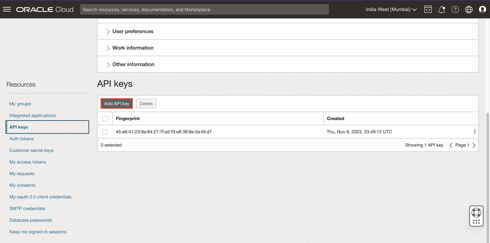
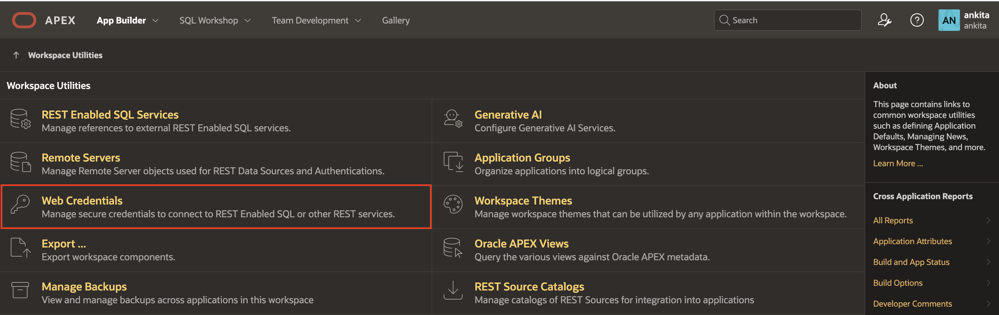

# AI Vision

## Introduction

### Objectives

In this lab, you:

- Generate API Keys using OCI Console
- Create Web Credentials in Oracle APEX

## Task 1: Generate API Keys using OCI Console

To Generate the API Keys using OCI Console:

1. Login into your OCI Account.

   

2. Click **My Profile** at the top-right corner.

    

3. Under Resources at the bottom-left, select **API Keys** and  click **Add API Key**.

    

4. The Add API Key dialog is displayed. Select **Generate API Key Pair** to create a new key pair.

5. Click **Download Private Key**. A *.pem* file is saved to your local device. You do not need to download the public key.

   *Note: You will use this private key while configuring the web credentials in Oracle APEX in the upcoming lab.*

6. Click **Add**.

    

7. The key is added, and the Configuration File Preview is displayed. Copy and save the configuration file snippet from the text box into a notepad. You will use this information for creating Oracle APEX Web Credentials.

    

## Task 2: Create Web Credentials - OCI VISION

Web credentials are used to authenticate connection to external REST services, or REST Enabled SQL services from APEX.

Creating Web Credentials securely stores and encrypts authentication credentials for use by Oracle APEX components and APIs. Credentials cannot be retrieved back in clear text. Credentials are stored at the workspace level and therefore are visible to all applications.

To create a Web Credential in Oracle APEX:

1. Login into your Oracle APEX workspace.

   

2. On the Workspace home page, click **App Builder**.

   

3. Click **Workspace Utilities**.

   

4. Select **Web Credentials**.

   

5. Click **Create**.

   

6. Enter the following details using the configuration file you copied in the previous task.

    - **Name**: apex\_ai\_cred

    - **Authentication Type**: OCI Native Authentication

    - **OCI User ID**: Enter the OCID of the Oracle Cloud user Account. You can find the OCID in the Configuration File Preview generated during the API Key creation.
    Your OCI User ID looks similar to **ocid1.user.oc1..aaaaaaaa\*\*\*\*\*\*wj3v23yla**

    - **OCI Private Key**: Open the private key (.pem file) downloaded in the previous task. Copy and paste the API Key.

      

    - **OCI Tenancy ID**: Enter the OCID for Tenancy. Your Tenancy ID looks similar to **ocid1.tenancy.oc1..aaaaaaaaf7ush\*\*\*\*cxx3qka**

    - **OCI Public Key Fingerprint**: Enter the Fingerprint ID. Your Fingerprint ID looks similar to **a8:8e:c2:8b:fe:\*\*\*\*:ff:4d:40**

   

7. Click **Create**.

## Task 3: Integrating with Object Detection and Text Detection

Configure OCI Vision REST API as REST Data Source

In this task, you create a REST Data Source with OCI vision REST API as the endpoint.

1. Navigate to the application home page and click **Shared Components**.

   

2. Under Data Sources, click **REST Data Sources**.

   

3. Click **Create**.

   

4. Select **From scratch** and click **Next**.

   

5. Under Create REST Data Source, enter the following attributes and click **Next**.
    - **Rest Data Source Type**: Oracle Cloud Infrastructure (OCI)

    - **Name**: OCI Vision

    - **URL Endpoint**: https://vision.aiservice.us-ashburn-1.oci.oraclecloud.com/20220125/actions/analyzeImage

    **Note**: URL Endpoint may differ based on your OCI tenancy. Refer to the following link for more details- https://docs.oracle.com/en-us/iaas/api/#/en/vision/20220125

   

6. Under Create REST Data Source - Remote Server, click **Next**.

   

7. Under Authentication,

    - **Authentication Required**: Toggle the button to **ON**

    - **Credentials**: apex\_ai\_cred


8. Click **Create REST Source Manually**.
   The REST data source is created successfully. The next step is to configure the POST operation parameters for this REST Data Source.

   

9. On the REST Data Sources page, click **OCI Vision**.

   

10. Select the Operations tab, click **Edit icon** for the POST operation and enter the following:
    - **Database Operation**: -Not Mapped-

    - **Request Body Template**: Copy and paste the JSON given below.

     ```
    <copy>
    {
        "compartmentId": "#COMPARTMENT_ID#",
        "image": {
        "source": "INLINE",
        "data": "#FILE_DATA#"
    },
    "features": [
    {
            "featureType": "#FEATURE_TYPE#",
            "maxResults": 5
        }
        ]
    }
    </copy>
    ```

    

    

11. Under Operation Parameters, click **Synchronize with body** and click **OK**.

    

    

12. Under Operation Parameters, Click **Add Parameter**.

    

13. In the **Edit REST Data Source Parameter** dialog, add the following two parameters one after the other:

   |   | Type | Name | Direction | Default Value | Static |
   |---|-------|------|----------| --------------| ------ |
   | 1 | Request or Response Body| RESPONSE | Out |
   | 2 | HTTP Header| Content-Type | In | application/json | ON
   {: title="POST Operation Parameters"}

    

    

14. Click **Apply Changes**.

    

15. Navigate to the application homepage by clicking the **Application ID**.

16. Click Page **10 - Search Books**

17. Select **P10\_SEARCH** under **Facets**

18. Enter/Select the following:

    - Under Sources > **Database Column(s)**: Add two more columns **object\_det,text\_det**

19. Click **Save**

## Task 4: Create Automation

1. Navigate to Shared Components and under **Workflows and Automations**, click **Automations**.

2. Click **Create**.

3. In the Create Automation wizard, enter/select the following and click **Next**:

    - Name: **Index Book Cover With OCI Vision**

    - Type: **On demand**

4. In the **Create Automation Page**, Select **OBS\_BOOKS(table)** in the **Table/View Name** and click **Create**

5. Enter/Select the following:

    - Under **Source**:

        - Where Clause: **object\_det IS NULL and BOOK\_IMAGE is NOT NULL**

    - Under Action Execution:

        - Commit: **Each Row**

        - Action Error Handling: **Terminate Automation**

    - Under Action:

        - Click **edit icon**

        - Name: **Invoke REST Data Source**

        - Code: Copy and paste the JSON given below.

            ```
            <copy>
            DECLARE
                l_params apex_exec.t_parameters;
                l_file_data clob;
                l_response clob;
                l_response_text clob;
            BEGIN
                    l_file_data:=   replace(replace(apex_web_service.blob2clobbase64(apex_web_service.make_rest_request_b(
                            p_url => :book_image,
                            p_http_method => 'GET')), chr(10),''),chr(13),'');

                apex_exec.add_parameter( l_params, 'COMPARTMENT_ID', 'ocid1.compartment.oc1..aaaaaaaal6p4vtvg6ykzv426wxb4cwvgfrw6ztfpti2elpkali6wj3v23yla');
                apex_exec.add_parameter( l_params, 'FEATURE_TYPE', 'IMAGE_CLASSIFICATION' );
                apex_exec.add_parameter( l_params, 'FILE_DATA',l_file_data  );

                apex_exec.execute_rest_source(
                    p_static_id        => 'oci_vision',
                    p_operation        => 'POST',
                    p_parameters       => l_params );

                l_response := apex_exec.get_parameter_clob(l_params,'RESPONSE');

                    apex_exec.add_parameter( l_params, 'COMPARTMENT_ID', 'ocid1.compartment.oc1..aaaaaaaal6p4vtvg6ykzv426wxb4cwvgfrw6ztfpti2elpkali6wj3v23yla');
                    apex_exec.add_parameter( l_params, 'FEATURE_TYPE', 'TEXT_DETECTION' );
                    apex_exec.add_parameter( l_params, 'FILE_DATA',l_file_data  );

                apex_exec.execute_rest_source(
                    p_static_id        => 'oci_vision',
                    p_operation        => 'POST',
                    p_parameters       => l_params );

                l_response_text := apex_exec.get_parameter_clob(l_params,'RESPONSE');

                apex_automation.log_warn( 'length of response: '||dbms_lob.getlength (l_response_text) );

                UPDATE OBS_BOOKS
                SET
                object_det = (
                    SELECT
                        LISTAGG(obj_name, ',') WITHIN GROUP(
                        ORDER BY
                            obj_name
                        )
                    FROM
                        JSON_TABLE ( l_response, '$.labels[*]'
                            COLUMNS
                                obj_name VARCHAR2 ( 100 ) PATH '$.name[*]'
                        )
                )
                ,
                text_det = (
                    SELECT
                        LISTAGG(obj_name, ',') WITHIN GROUP(
                        ORDER BY
                            obj_name
                        )
                    FROM
                        JSON_TABLE ( l_response_text, '$.imageText.words[*]'
                            COLUMNS
                                obj_name VARCHAR2 ( 100 ) PATH '$.text[*]'
                        )
                )
                WHERE
                BOOK_ID = :BOOK_ID;

            END;
        </copy>
        ```

6. Click **Apply Changes**

7. Click **Save Changes**

8. Navigate to the application home page and click Page **50 - Edit Book Details**

9. Navigate to the **Processing** tab, Right-Click **Processing** and Select **Create Process**.

10. In the Property editor, enter/select the following:

    - Under Identification:

        - Name: **Call OCI Vision Automation**

    - Under Source:

        - PL/SQL Code: Copy and Paste the below code:

        ```
        <copy>
        apex_automation.execute(
            p_static_id       => 'index-book-cover-with-oci-vision' );
        </copy>
         ```

11. Drag and Drop **Call OCI Vision Automation** process before **Close Dialog** process.

12. Select **Close Dialog** process

13. Enter/Select the following:

    - Name: **Close Dialog**
    - Type: **Close Dialog**
    - Server-side condition > Type: **Request is contained in Value**
    - Value: **CREATE,SAVE,DELETE**

14. Click Save.

## Task 5: Create a trigger

1. Click **SQL Workshop** and navigate to **Object Browser**.

2. In the object tree, right-click **Triggers** and select **Create Trigger**

3. Enter/Select the following:

    - Table: **OBS\_BOOKS**

    - Firing Point: **Before**

4. Click **Create Trigger**

5. Copy and Paste the below code:

    ```
    <copy>
    create or replace trigger "OBS_BOOKS_T"
    before
    update  on "OBS_BOOKS"
    for each row
    begin
    -- Hash the password so we are not saving clear text
    if  :new.book_image !=  :old.book_image then
    :new.object_det := null;
    :new.text_det := null;
    end if;
    end;
    /
    </copy>
        ```

6. Click **Save and Compile**

## Summary

In this lab....

You are now ready to move on to the next lab!

## Acknowledgements

- **Author**: Pankaj Goyal, Member Technical Staff
- **Last Updated By/Date**: Pankaj Goyal, Member Technical Staff, Aug 2024