# AI Vision

## Introduction

In this lab, you will learn to create REST Data Sources, automations, and triggers in Oracle APEX. These components enable seamless API integration, automate tasks, and trigger actions based on events, enhancing application efficiency and responsiveness.

Estimated Time: 10 minutes

### Objectives

In this lab, you:

- Create Rest Data Source
- Create Automation
- Create Trigger

## Task 1: Integrating with Object Detection and Text Detection

Configure OCI Vision REST API as REST Data Source

In this task, you create a REST Data Source with OCI vision REST API as the endpoint.

1. Navigate to the application home page and click **Shared Components**.

   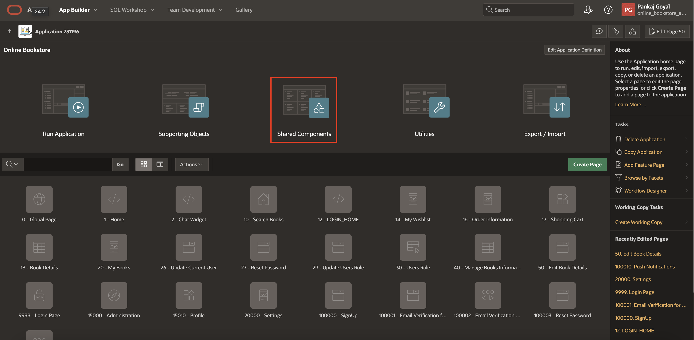

2. Under Data Sources, click **REST Data Sources**.

   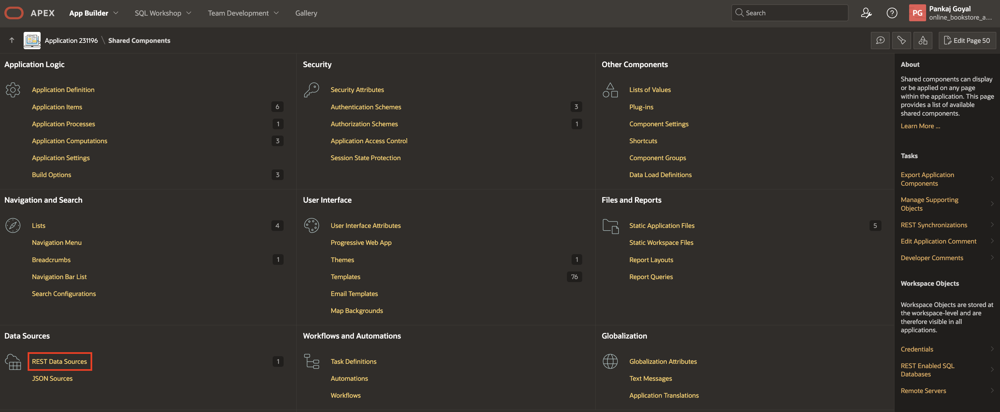

3. Click **Create**.

   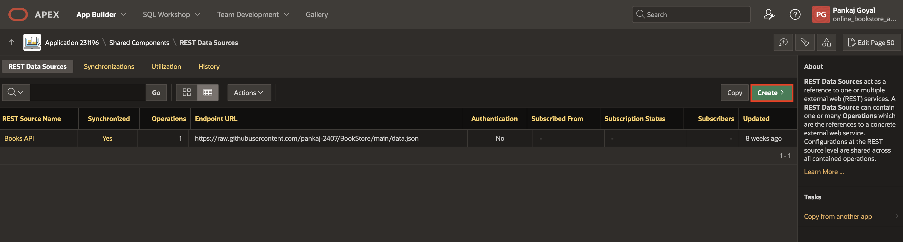

4. Select **From scratch** and click **Next**.

   

5. Under Create REST Data Source, enter the following attributes and click **Next**.

    - **REST Data Source Type**: Oracle Cloud Infrastructure (OCI)

    - **Name**: OCI Vision

    - **URL Endpoint**: https://vision.aiservice.us-ashburn-1.oci.oraclecloud.com/20220125/actions/analyzeImage

    **Note**: URL Endpoint may differ based on your OCI tenancy. Refer to the following link for more details- https://docs.oracle.com/en-us/iaas/api/#/en/vision/20220125

   

6. Under Create REST Data Source - Remote Server, click **Next**.

   

7. Under Authentication,

    - **Authentication Required**: Toggle the button to **ON**

    - **Credentials**: apex\_ai\_cred

8. Click **Create REST Source Manually**.

   The REST data source is created successfully. The next step is to configure the POST operation parameters for this REST Data Source.

   

9. On the REST Data Sources page, click **OCI Vision**.

   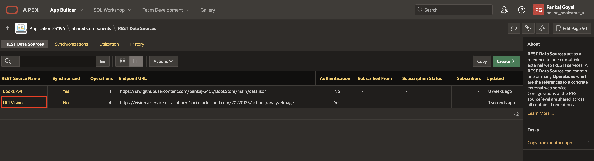

10. Select the Operations tab, click **Edit icon** for the POST operation and enter the following:
    - **Database Operation**: **-Not Mapped-**

    - **Request Body Template**: Copy and paste the JSON given below.

     ```
    <copy>
    {
        "compartmentId": "#COMPARTMENT_ID#",
        "image": {
        "source": "INLINE",
        "data": "#FILE_DATA#"
    },
    "features": [
    {
            "featureType": "#FEATURE_TYPE#",
            "maxResults": 5
        }
        ]
    }
    </copy>
    ```

    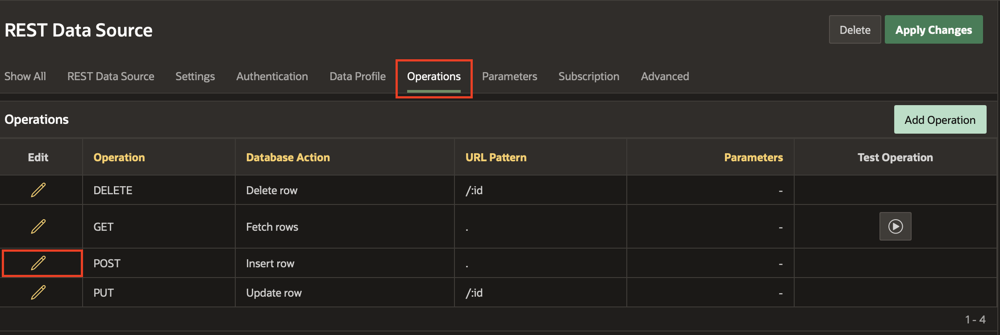

    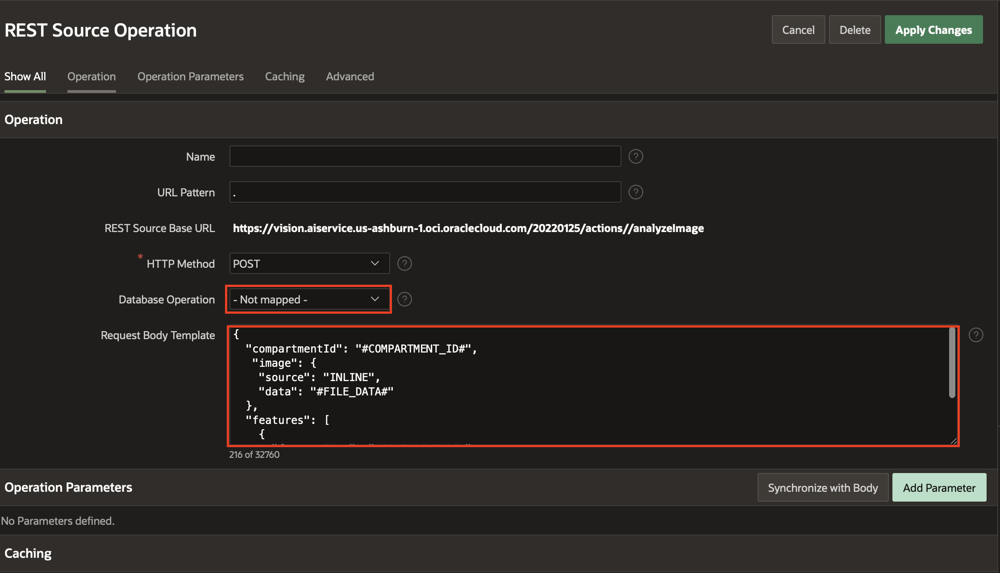

11. Under Operation Parameters, click **Synchronize with Body** and click **OK**.

    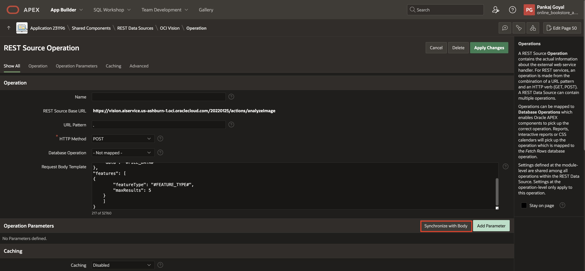

    

12. Under Operation Parameters, click **Add Parameter**.

    

13. In the **Edit REST Data Source Parameter** dialog, add the following two parameters one after the other:

    |   | Type | Name | Direction | Default Value | Static |
    |---|-------|------|----------| --------------| ------ |
    | 1 | Request or Response Body| RESPONSE | Out |
    | 2 | HTTP Header| Content-Type | In | application/json | ON
    {: title="POST Operation Parameters"}

    

    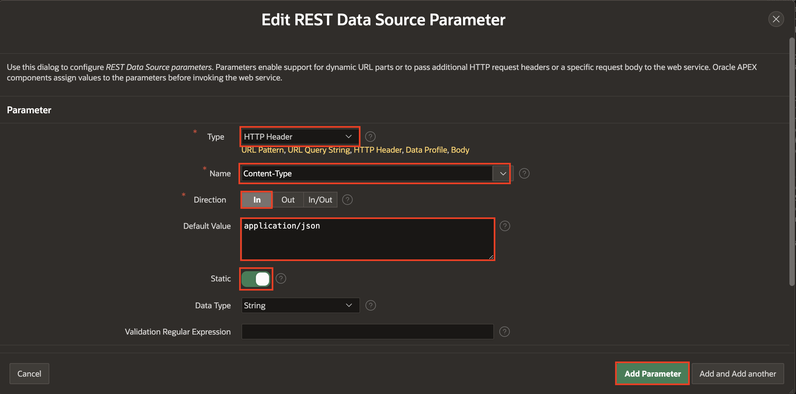

14. Click **Apply Changes**.

    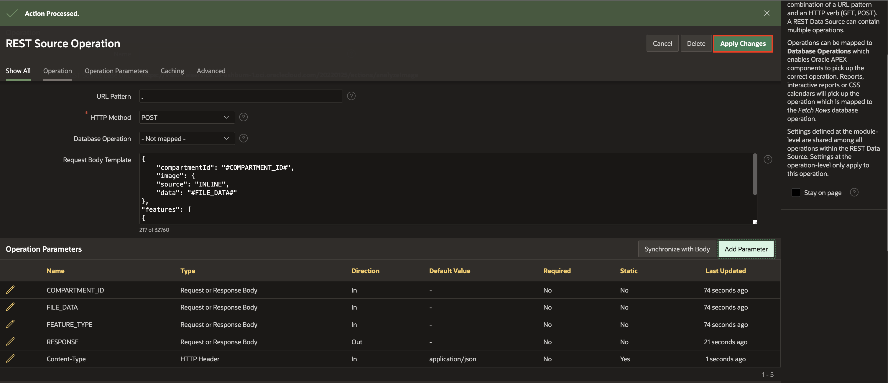

15. Navigate to the application homepage by clicking the **Application ID**.

    

16. Select Page **10 - Search Books**

    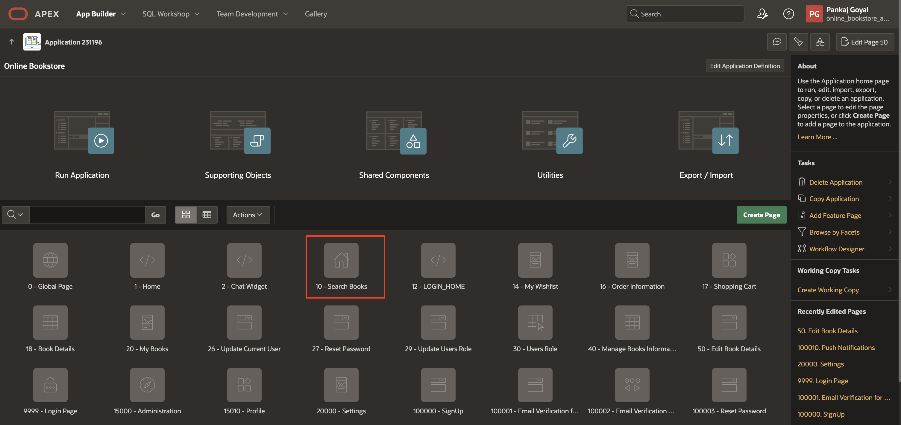

17. In the rendering tab, select **P10\_SEARCH** under **Facets** and under Source update Database Column(s): **TITLE,AUTHOR,PUBLISHER,CONTRIBUTOR,OBJECT\_DET,TEXT\_DET**.

18. Click **Save**

    

## Task 2: Create Automation

1. Navigate to **Shared Components** and under **Workflows and Automations**, select **Automations**.

    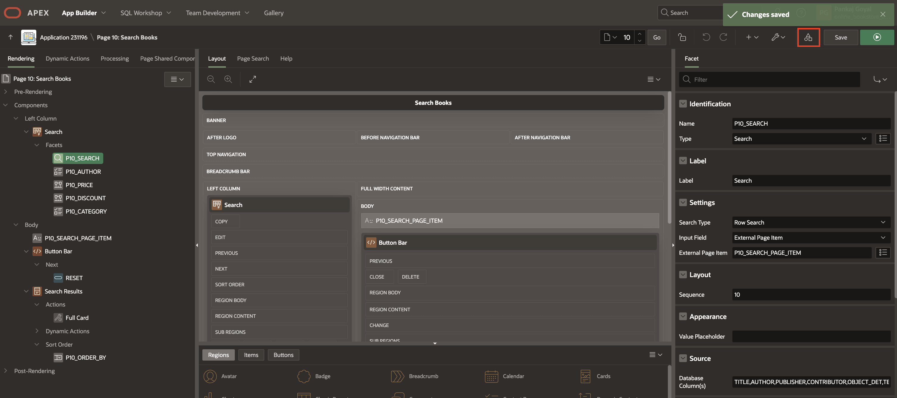
    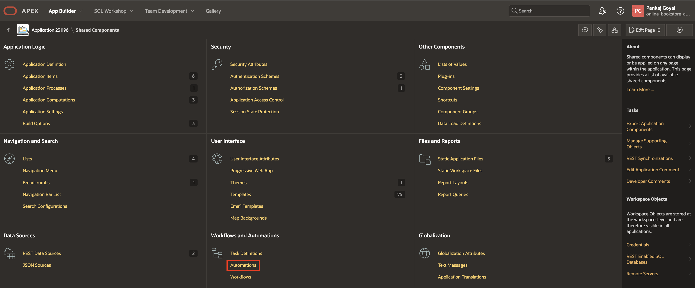

2. Click **Create**.

    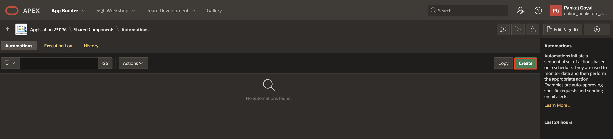

3. In the Create Automation wizard, enter/select the following and click **Next**:

    - Name: **Index Book Cover With OCI Vision**

    - Type: **On demand**

    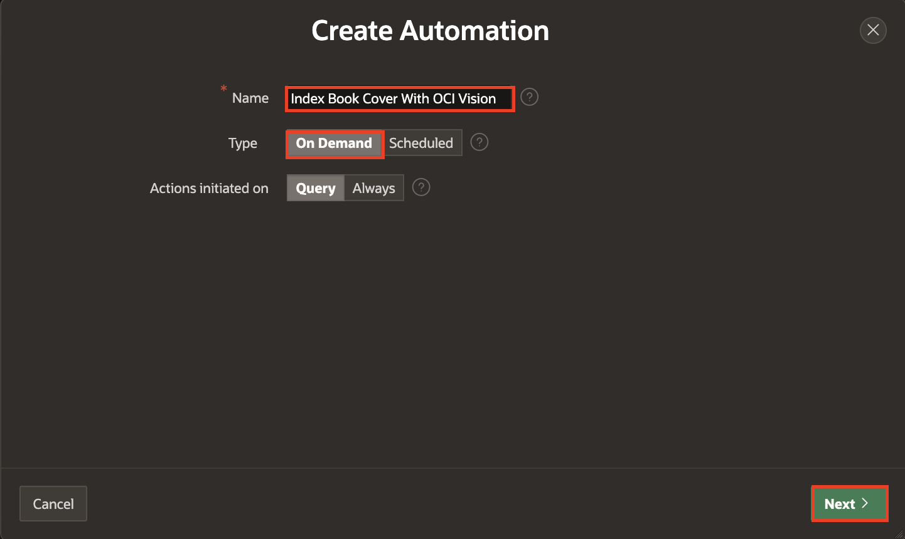

4. In the **Create Automation Page**, select **OBS\_BOOKS(table)** in the **Table/View Name** and click **Create**

    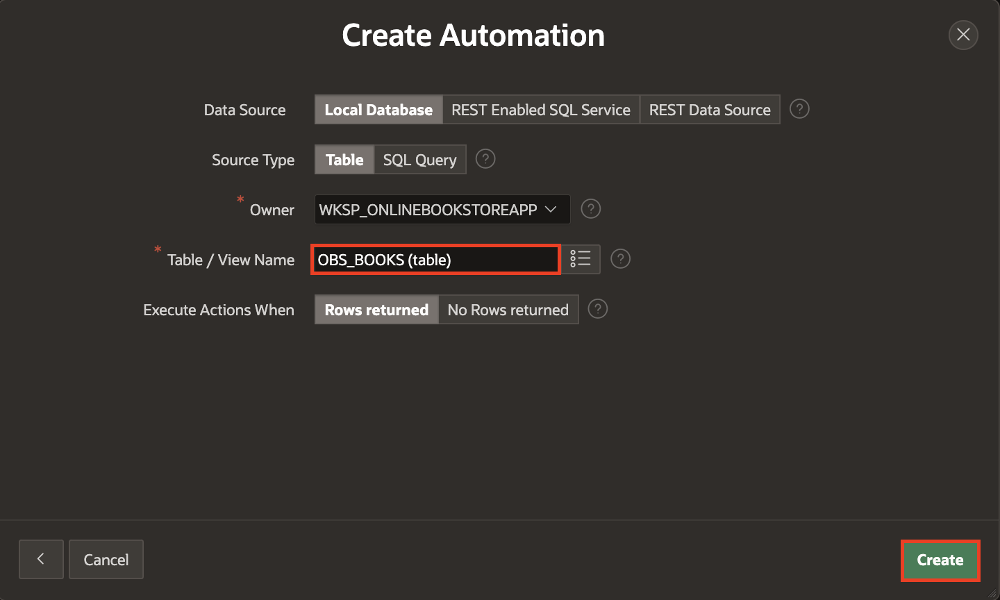

5. Enter/Select the following:

    - Source > Where Clause: **OBJECT\_DET IS NULL and BOOK\_IMAGE is NOT NULL**

    - Under Action Execution:

        - Commit: **Each Row**

        - Action Error Handling: **Terminate Automation**

    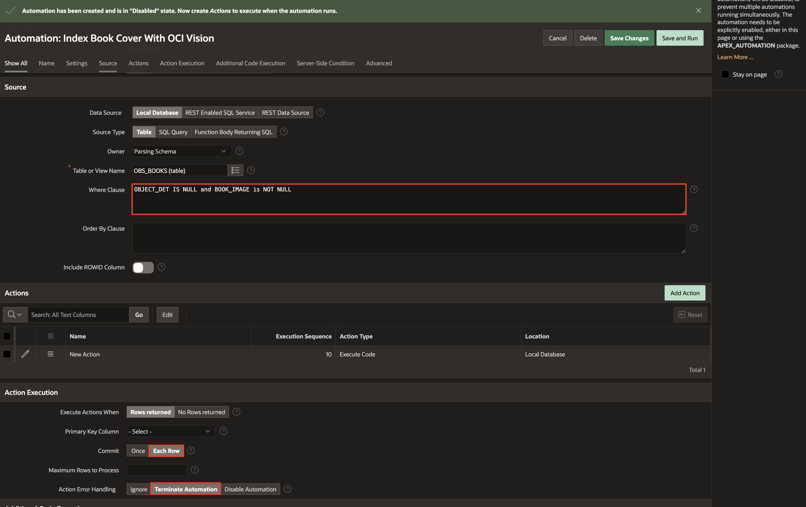

    - Under Action > Click **edit icon** and update the following

        - Name: **Invoke REST Data Source**

        - Code: Copy and Paste the JSON given below and replace **#COMPARTMENT\_ID#** with your **COMPARTMENT\_ID** at two places in the below query

            ```
            <copy>
            DECLARE
                l_params apex_exec.t_parameters;
                l_file_data clob;
                l_response clob;
                l_response_text clob;
            BEGIN
                    l_file_data:=   replace(replace(apex_web_service.blob2clobbase64(apex_web_service.make_rest_request_b(
                            p_url => :book_image,
                            p_http_method => 'GET')), chr(10),''),chr(13),'');

                apex_exec.add_parameter( l_params, 'COMPARTMENT_ID', '#COMPARTMENT_ID#');
                apex_exec.add_parameter( l_params, 'FEATURE_TYPE', 'IMAGE_CLASSIFICATION' );
                apex_exec.add_parameter( l_params, 'FILE_DATA',l_file_data  );

                apex_exec.execute_rest_source(
                    p_static_id        => 'oci_vision',
                    p_operation        => 'POST',
                    p_parameters       => l_params );

                l_response := apex_exec.get_parameter_clob(l_params,'RESPONSE');

                    apex_exec.add_parameter( l_params, 'COMPARTMENT_ID', '#COMPARTMENT_ID#');
                    apex_exec.add_parameter( l_params, 'FEATURE_TYPE', 'TEXT_DETECTION' );
                    apex_exec.add_parameter( l_params, 'FILE_DATA',l_file_data  );

                apex_exec.execute_rest_source(
                    p_static_id        => 'oci_vision',
                    p_operation        => 'POST',
                    p_parameters       => l_params );

                l_response_text := apex_exec.get_parameter_clob(l_params,'RESPONSE');

                apex_automation.log_warn( 'length of response: '||dbms_lob.getlength (l_response_text) );

                UPDATE OBS_BOOKS
                SET
                object_det = (
                    SELECT
                        LISTAGG(obj_name, ',') WITHIN GROUP(
                        ORDER BY
                            obj_name
                        )
                    FROM
                        JSON_TABLE ( l_response, '$.labels[*]'
                            COLUMNS
                                obj_name VARCHAR2 ( 100 ) PATH '$.name[*]'
                        )
                )
                ,
                text_det = (
                    SELECT
                        LISTAGG(obj_name, ',') WITHIN GROUP(
                        ORDER BY
                            obj_name
                        )
                    FROM
                        JSON_TABLE ( l_response_text, '$.imageText.words[*]'
                            COLUMNS
                                obj_name VARCHAR2 ( 100 ) PATH '$.text[*]'
                        )
                )
                WHERE
                BOOK_ID = :BOOK_ID;

            END;
        </copy>
        ```
    Click **Apply Changes**

    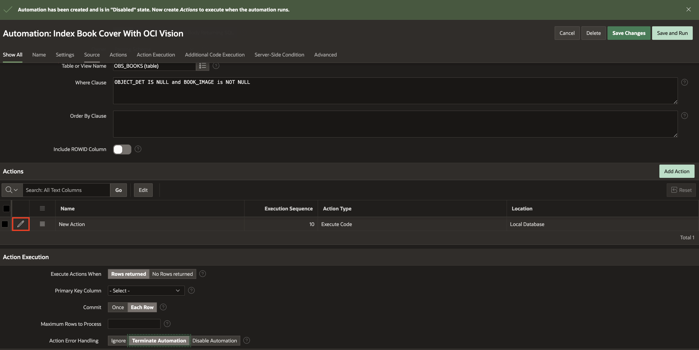
    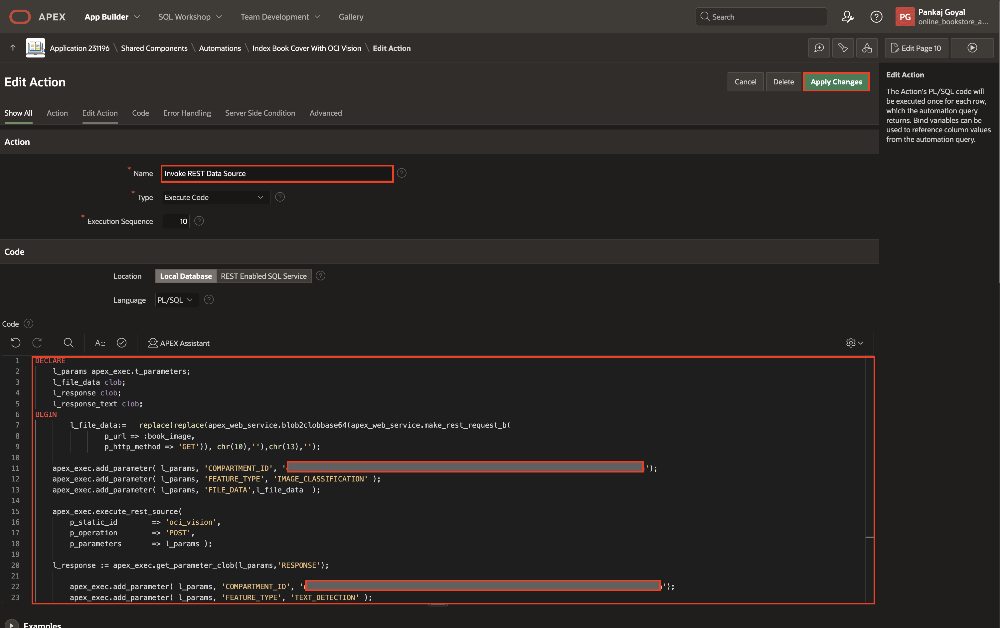

6. Click **Save and Run**

    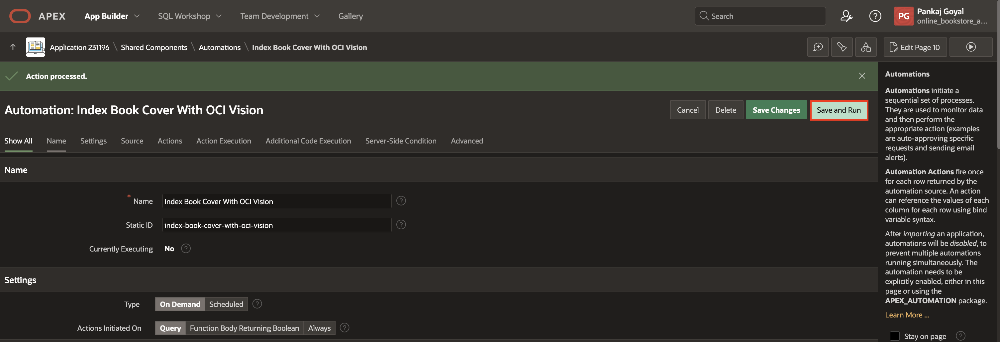

7. Navigate to the application home page and click on page **50 - Edit Book Details**

    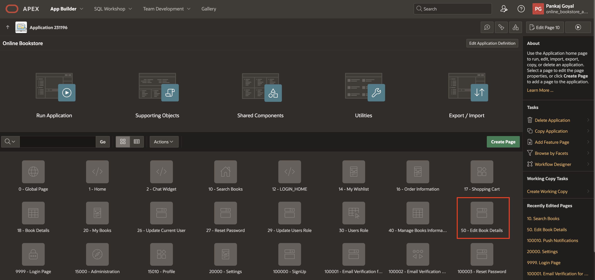

8. Navigate to **Processing** tab, right-click **Processing** and click **Create Process**.

    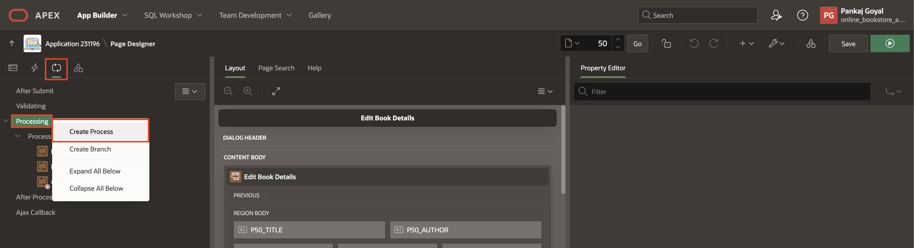

9. In the Property editor, enter/select the following:

    - Identification > Name: **Call OCI Vision Automation**

    - Source > PL/SQL Code: Copy and Paste the below code:

        ```
        <copy>
        apex_automation.execute(
            p_static_id       => 'index-book-cover-with-oci-vision' );
        </copy>
         ```
    - Execution > Sequence: **30**

    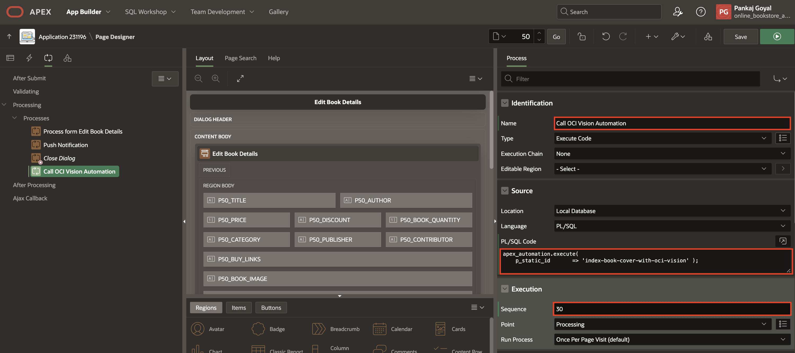

10. Click Save.

## Task 3: Create a trigger

1. Navigate to **Object Browser** via **SQL Workshop**

    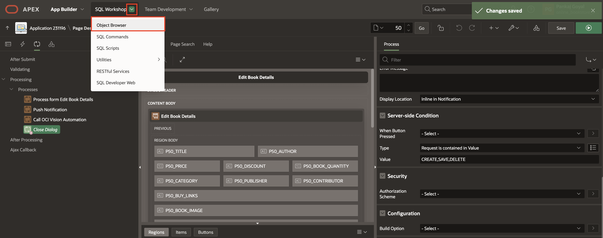

2. In the object tree, right-click **Triggers** and select **Create Trigger**

    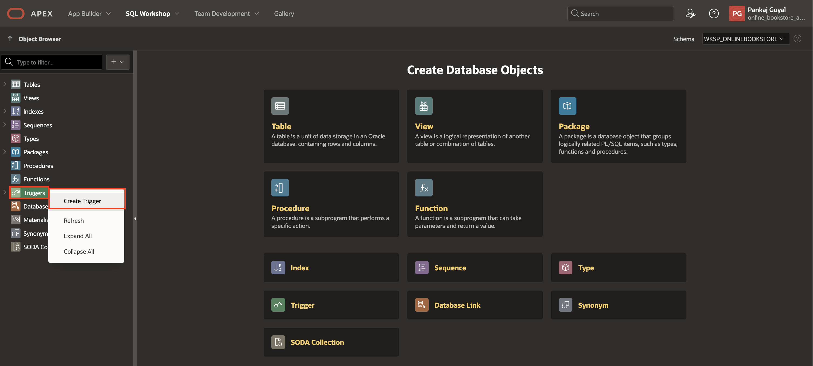

3. Enter/Select the following and click **Create Trigger**

    - Table: **OBS\_BOOKS**

    - Firing Point: **Before**

     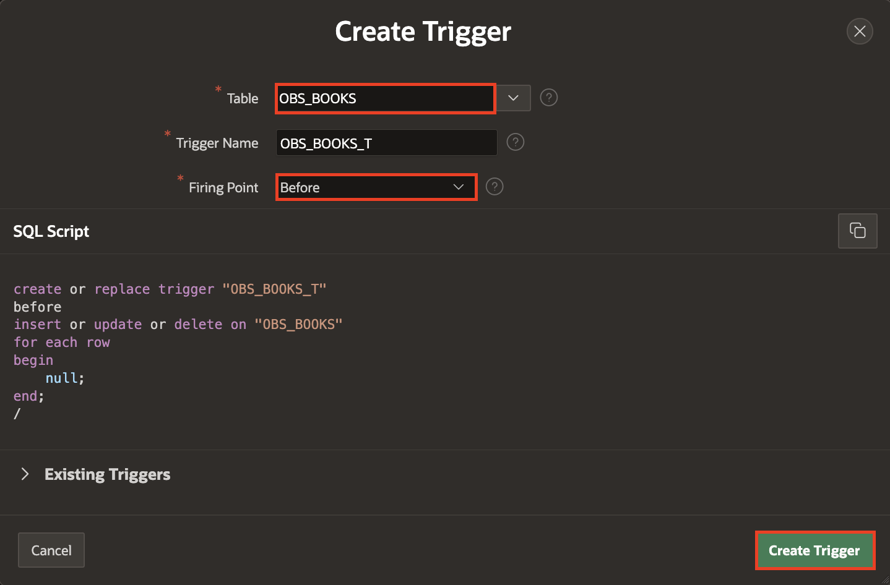

4. Replace the existing code with the below code:

    ```
    <copy>
    CREATE OR REPLACE TRIGGER OBS_BOOKS_T
    BEFORE UPDATE ON OBS_BOOKS
    FOR EACH ROW
    BEGIN
    -- Reset object_det and text_det if book_image changes
    IF :NEW.book_image != :OLD.book_image THEN
        :NEW.object_det := NULL;
        :NEW.text_det := NULL;
    END IF;
    END;
    /
    </copy>
        ```

5. Click **Save and Compile**

     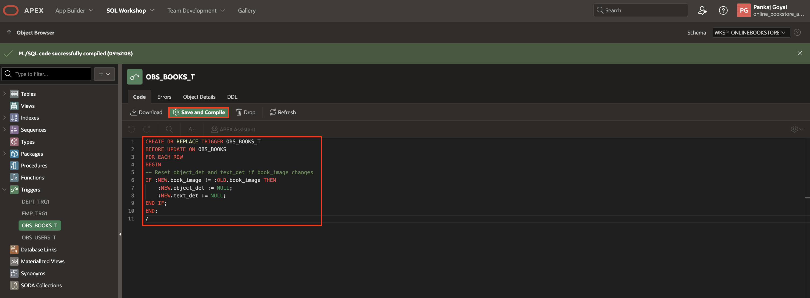

## Summary

You now know how to configure REST Data Sources, set up automations, and define triggers in Oracle APEX. These skills enable you to integrate external data, automate tasks, and respond to events efficiently.

You are now ready to move on to the next lab!

## Acknowledgements

- **Author**: Pankaj Goyal, Member Technical Staff
- **Last Updated By/Date**: Pankaj Goyal, Member Technical Staff, Feb 2025