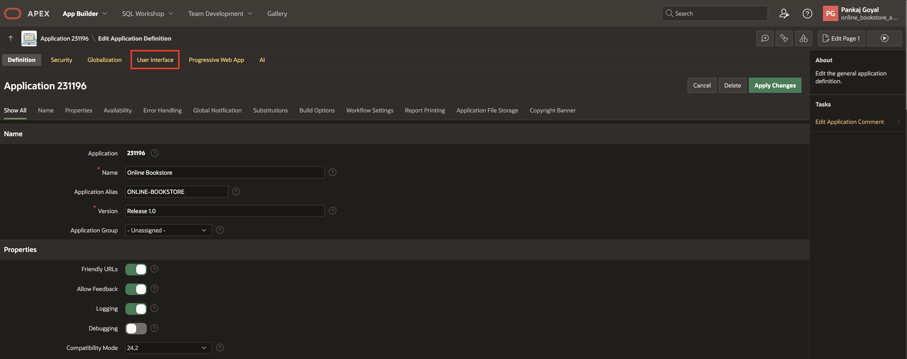
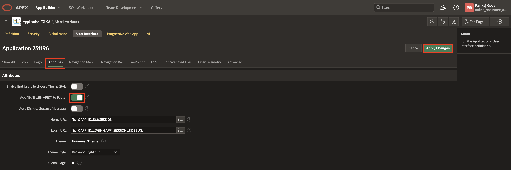
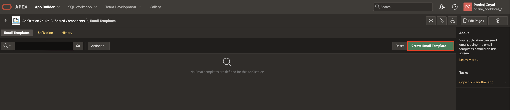
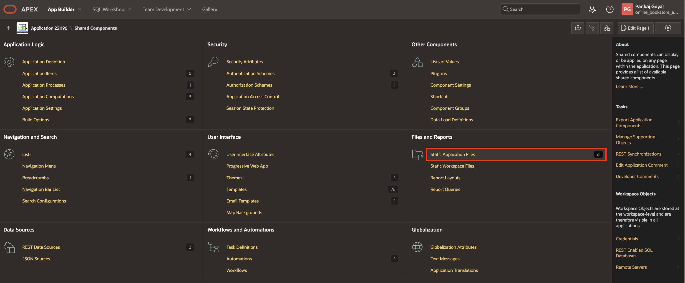
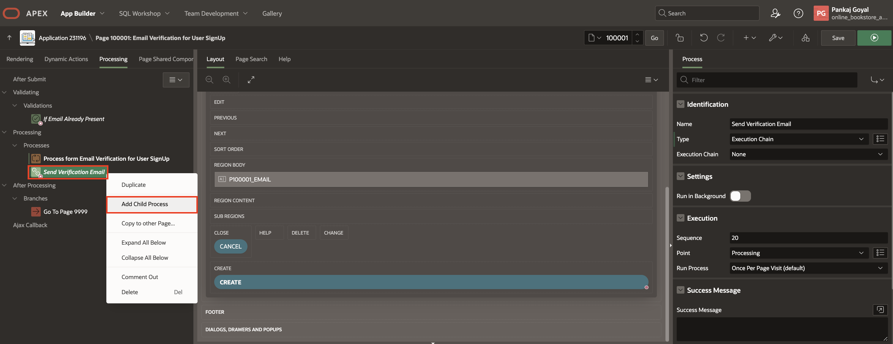
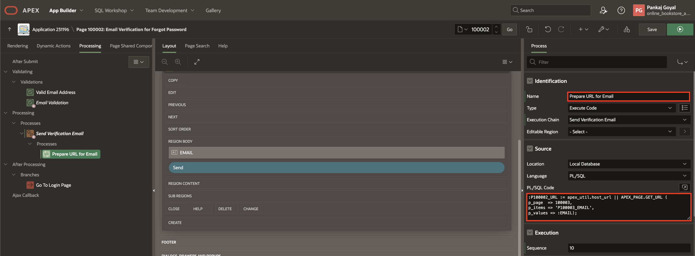

# UI Enhancements

## Introduction

In this lab, you will learn to customize and enhance your Oracle APEX application. You will add a footer to improve branding, manage the navigation menu for a better user experience, and utilize email templates to send emails. These steps will help you create a more user-friendly and efficient application.

Estimated Time: 10 minutes

### Objectives

In this lab, you will:

- Add Footer Text to the App.

- Manage Navigation Menu.

- Use Email Templates to send Emails.

## Task 1 Add Built with APEX To Footer

1. Navigate to the application homepage and click **Edit Application Definition**.

    

2. Click **User Interface**.

    

3. Click **Attributes** and update Add "Built with APEX" to Footer to **Toggle On** and click **Apply Changes**.

    

4. Run the app.

    

## Task 2: Remove Hamburger Icon (Navigation Menu)

1. Navigate to the application homepage and click **Edit Application Definition**.

    

2. Click **User Interface**.

    

3. Click **Navigation Menu** and update Display Navigation to **Toggle On** and click **Apply Changes**.

    

4. Run the app.

    

## Task 3: Use Email Templates For Sending Emails

1. Navigate to the application homepage and click **Shared Component**.

    

2. Click **Email Templates** under **User Interface**.

    

3. Click **Create Email Template**.

    

4. Enter/select the following below

    - Under Identification

        - Template Name: **EmailTemplate**

        - Static Identifier: **EMAILTEMPLATE**

        - Email Subject: **#SUBJECT#**

    - Under HTML Format

        - Header: Copy and paste the below code

            ```
            <copy>
            <table align="center"> <tr> <td>  </td>
            <td align="center"><h1> #TITLE#</h1> </td> </tr></table>
            </copy>
            ```

         - Body: Copy and paste the below code

            ```
            <copy>
            <p>#TARGET_HEADING#</p>
            <a class="footer-button" href="#APP_LINK#">#TARGET#</a>
            <p  style="margin: 0; margin-top: 10px;">Sincerely,</p>
            <p  style="margin: 0;">The Online Bookstore Team</p>
            </copy>
            ```

     - Under Advanced

        - HTML Format: Copy and paste the below code

            ```
            <copy>
            <!DOCTYPE HTML>
            <html>
            <head>
            <meta http-equiv="Content-Type" content="text/html; charset=utf-8">
            <meta name="viewport" content="width=device-width">
            <style>
                body { background-color: #fdfdfd; color: #3e3e3e; margin: 0; padding: 0; min-width: 100%; -webkit-text-size-adjust: none; -ms-text-size-adjust: none; text-size-adjust: none; font-family: -apple-system, BlinkMacSystemFont, "Segoe UI", "Helvetica Neue", Roboto, Helvetica, Arial, sans-serif; line-height: 1.5; -webkit-font-smoothing: antialiased; -moz-osx-font-smoothing: grayscale; }
                table { border: 0; border-spacing: 0; border-collapse: collapse; mso-table-lspace: 0pt; mso-table-rspace: 0pt; }
                table td { padding: 0; vertical-align: top; border-collapse: collapse; }
                table, th, td { line-height: inherit; }
                img { vertical-align: middle; text-decoration: none; outline: none; border: 0; -ms-interpolation-mode: bicubic; }
                table.container { margin-right: auto; margin-left: auto; width: 600px; }
                p { margin: 0 0 20px 0; }
                a, .main a { color: #056abf; }
                @media only screen and (max-width: 612px) {
                .mobile-hide { display: none !important; }
                .stack { display: block !important; width: auto !important; }
                table.container { width: 100% !important; }
                table td { text-align: left !important; }
                }
                .footer-button {
                    display: block;
                    padding: 10px 0;
                    background-color: #000; /* Updated button background color to black */
                    color: #fff !important; /* Updated text color to white */
                    text-decoration: none;
                    border-radius: 4px;
                    text-align: center;
                    width: 100%;
                }
                .footer-button:hover {
                    background-color: #333; /* Darker background color on hover */
                }

            </style>
            </head>
            <body yahoo="fix" style="background-color: #efefef; line-height: 1.5;">
            <table class="body" border="0" width="100%">
            <tr>
                <td align="center" valign="top" style="background-color: #efefef;">
                <center>
                    <table class="container" width="600">
                    <tr>
                        <td style="padding: 12px 6px;">

                        <!-- Header -->
                        <table width="100%" style="background-color: #f8f8f8; border-radius: 4px 4px 0 0">
                            <tr>
                            <td style="text-align: left; padding: 20px 12px; border-bottom: 1px solid #eaeaea;">
                                #HEADER#
                            </td>
                            </tr>
                        </table>
                        <!-- // Header -->

                        <!-- Main Body -->
                        <table width="100%" style="background-color: #ffffff; border-radius: 0 0 4px 4px;">
                            <tr>
                            <td class="main" style="text-align: left; padding: 12px; font-size: 14px;">
                            #BODY#
                            </td>
                            </tr>
                        </table>
                        <!-- // Main Body -->

                        <!-- Footer -->
                        <table width="100%">
                            <tr>
                            <td>
                                #FOOTER#
                            </td>
                            </tr>
                        </table>
                        <!-- // Footer -->

                        </td>
                    </tr>
                    </table>
                </center>
                </td>
            </tr>
            </table>
            </body>
            </html>
            </copy>
            ```

    Click **Create Email template**.

    

5. Click **Shared Components**

    

6. Click **Static Application Files** under **Files and Reports**.

    

7. Click **Create File**.

    

8. Upload the Application Icon with name **Online\_Bookstore\_Icon.png** and click **Create**

    

9. Navigate to application home page by clicking **application id**.

    

10. Select Page **100001 - Email Verification for user signup**.

    

11. Right-click **body** and select **Create Page Item**.

    

12. Enter/select the following below

    - Under Identification:

        - Name: **P100001_URL**

        - Type: **Hidden**

    

13. Navigate to the processing tab and select **Process form Email Verification for User SignUp** process and under **Success Message** replace **Success Message** with a blank space.

    

14. Select **Send Verification Email** process and under Identification update Type to **Execution Chain**.

    

15. Right-click **Send Verification Email** and select **Add Child Process**.

    

16. Enter/select the following below

    - Identification > Name: **Prepare URL for Email**

    - Source > PL/SQL Code: Copy and paste the below code:

        ```
        <copy>
        :P100001_URL := apex_util.host_url || APEX_PAGE.GET_URL (
        p_page  => 100000,
        p_items => 'P100000_EMAIL',
        p_values => :P100001_EMAIL);
        </copy>
        ```

    

17. Right-click **Send Verification Email** and select **Add Child Process**.

    

18. Enter/select the following below

    - Identification > Name: **Send Email Process**

    - Source > PL/SQL Code: Copy and paste the below code:

        ```
        <copy>
        BEGIN
        APEX_MAIL.SEND(
            p_template_static_id => 'EMAILTEMPLATE',
            p_placeholders => '{"SUBJECT":"Welcome to Online Bookstore!",
                                "ICON_URL":"https://apex.oracle.com/pls/apex/r/online_bookstore_app/online-bookstore/files/static/v7/Online_Bookstore_Icon.png",
                                "APP_LINK":"' || :P100001_URL || '",
                                "TARGET_HEADING":"Please click the link below to create your account:",
                                "TARGET":"Setup your account",
                                "TITLE":"Online Bookstore"}',
            p_to => :P100001_EMAIL,
            p_from => 'noreply.obs@oracle.com'
        );
        END;
        </copy>
        ```

        NOTE: In **ICON_URL**, replace **online\_bookstore\_app** with your **workspace\_name**, and replace online-bookstore with your **app\_name**

     - Success Message > Success Message: **SignUp Link sent to your email address.**

    

19. Right-click **Send Verification Email** and select **Add Child Process**.

    

20. Enter/select the following below and click **Save**.

    - Identification > Name: **Push email queue**

    - Source > PL/SQL Code: Copy and paste the below code:

        ```
        <copy>
        apex_pwa.push_queue;
        </copy>
        ```

    

21. Navigate to Page **100002 - Email Verification for Forgot Password**

    

22. Right-click on body and select **Create Page Item**.

    

23. Enter/select the following below

    - Under Identification:

        - Name: **P100002_URL**

        - Type: **Hidden**

    

24. Navigate to the processing tab and select **Send Verification Email** process and update the type to **Execution Chain** and remove **Success Message** under Success Message.

    

25. Right-click **Send Verification Email** and select **Add Child Process**.

    

26. Enter/select the following below

    - Identification > Name: **Prepare URL for Email**

    - Source > PL/SQL Code: Copy and Paste the below code:
        ```
        <copy>
        :P100002_URL := apex_util.host_url || APEX_PAGE.GET_URL (
        p_page  => 100003,
        p_items => 'P100003_EMAIL',
        p_values => :EMAIL);
        </copy>
        ```

    

27. Right-click **Send Verification Email** and select **Add Child Process**.

    

28. Enter/select the following below

    - Identification > Name: **Send Email Process**

    - Source > PL/SQL Code: Copy and Paste the below code:

        ```
        <copy>
        BEGIN
        APEX_MAIL.SEND(
            p_template_static_id => 'EMAILTEMPLATE',
            p_placeholders => '{"SUBJECT":"Online Bookstore - Reset Password!",
                                "ICON_URL":"https://apex.oracle.com/pls/apex/r/online_bookstore_app/online-bookstore/files/static/v7/Online_Bookstore_Icon.png",
                                "APP_LINK":"' || :P100002_URL || '",
                                "TARGET_HEADING":"Please open the link to Reset Password for your account:",
                                "TARGET":"Reset Password",
                                "TITLE":"Online Bookstore"}',
            p_to => :EMAIL,
            p_from => 'noreply.obs@oracle.com'
        );
        END;
        </copy>
        ```

        NOTE: In **ICON_URL**, replace **online\_bookstore\_app** with your **workspace\_name**, and replace online-bookstore with your **app\_name**

    - Success Message > Success Message: **Reset Password Link sent to your email address.**

    

29. Right-click **Send Verification Email** and select **Add Child Process**.

    

30. Enter/select the following below and click **Save**.

    - Identification > Name: **Push email queue**

    - Source > PL/SQL Code: Copy and Paste the below code:

        ```
        <copy>
        apex_pwa.push_queue;
        </copy>
        ```

    

## Summary

You now know how to add a footer to your app, manage the navigation menu, and use email templates to send emails in Oracle APEX. These skills help improve user experience, branding, and communication within your application.

You are now ready to move on to the next lab!

## Acknowledgements

- **Author**: Pankaj Goyal, Member Technical Staff
- **Last Updated By/Date**: Pankaj Goyal, Member Technical Staff, Feb 2025