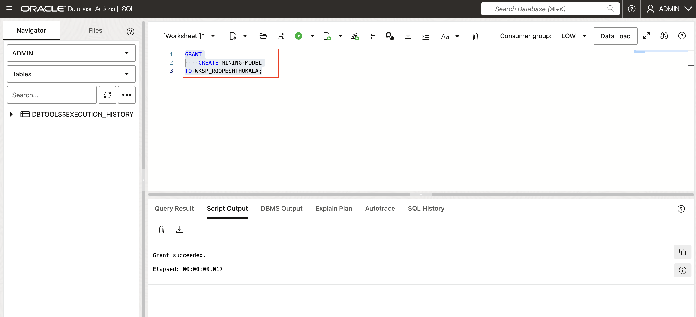
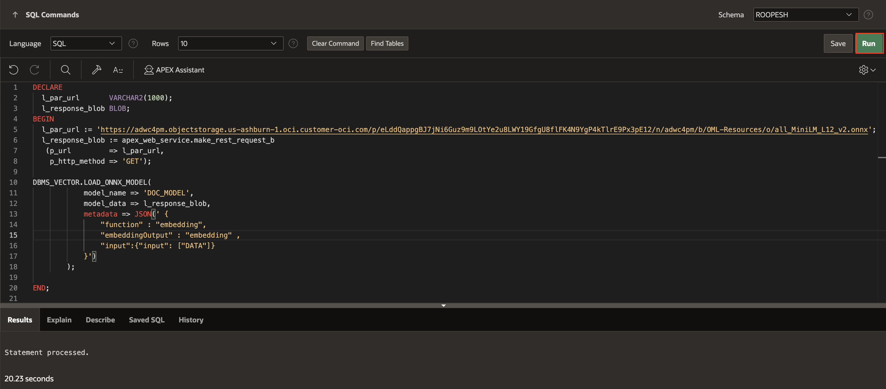
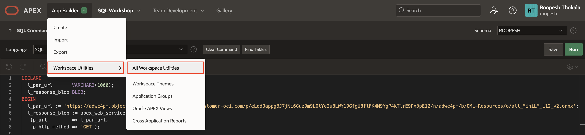
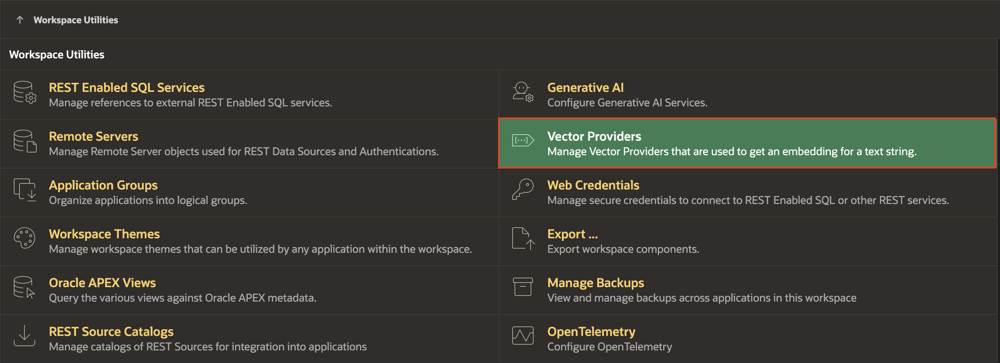
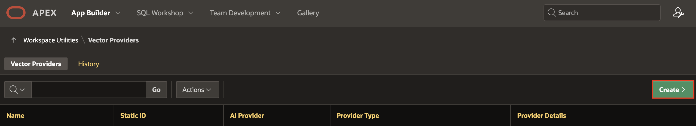
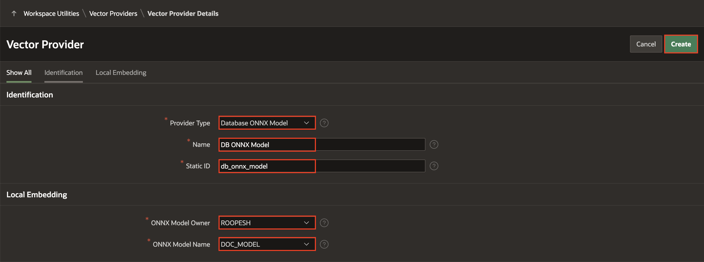
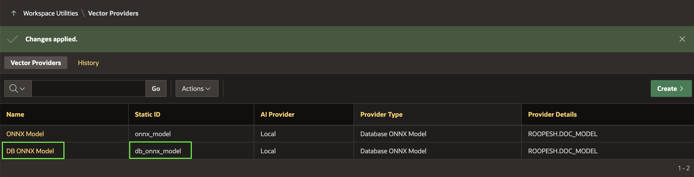

# Create Search Configurations with Oracle Vector Search

## Introduction

In this lab, you will learn how to load ONNX models into Oracle Database and create a Vector Provider to generate vector embeddings. You will then create a Search Configuration based on Oracle Vector Search to build an efficient search system. Finally, you will link a search bar to these responses, enabling powerful and accurate search functionality.

>**Note**: This lab assumes you are using Oracle Database 23ai.

Estimated Time: 15 minutes

### Objectives

- Load ONNX Models
- Create a Vector Provider
- Generate Vector Embeddings
- Create Search Configuration based on Oracle Vector Search
- Link Search Bar

## Task 1: Load ONNX Model to Oracle Database

Before uploading the ONNX model to your database schema, you must grant the schema the privilege to create mining models while logged in as SYS/ADMIN.

Login as SYS/Admin User and execute the below command.

>**Command**: GRANT create mining model TO **YourSchemaName**;



1. From your APEX workspace homepage, click the Down Arrow next to **SQL Workshop** and select **SQL Commands**.

    

2. In the SQL Commands Page, copy and paste the below code and click **Run**.

    ```
    <copy>
        DECLARE
        L_PAR_URL       VARCHAR2(1000);
        L_RESPONSE_BLOB BLOB;
        BEGIN
            L_PAR_URL := 'https://adwc4pm.objectstorage.us-ashburn-1.oci.customer-oci.com/p/eLddQappgBJ7jNi6Guz9m9LOtYe2u8LWY19GfgU8flFK4N9YgP4kTlrE9Px3pE12/n/adwc4pm/b/OML-Resources/o/all_MiniLM_L12_v2.onnx'
            ;
            L_RESPONSE_BLOB := APEX_WEB_SERVICE.MAKE_REST_REQUEST_B(
                P_URL         => L_PAR_URL,
                P_HTTP_METHOD => 'GET'
            );
            DBMS_VECTOR.LOAD_ONNX_MODEL(
                MODEL_NAME => 'DOC_MODEL',
                MODEL_DATA => L_RESPONSE_BLOB,
                METADATA   =>
                        JSON(
                            ' {
                        "function" : "embedding",
                        "embeddingOutput" : "embedding" ,
                        "input":{"input": ["DATA"]}
                    }'
                        )
            );

        END;
    </copy>
    ```
    

## Task 2: Create Vector Provider from Workspace Utilities

In this task, you will create a Vector Provider that will be used later to set up a Search Configuration.

1. From your SQL Commands page, click the Down Arrow next to **App Builder** and select **Workspace Utilities**. Then click **All Workspace Utilities**.

    

2. In the Workspace Utilities page, select **Vector Providers**.

    

3. In the Vector Providers page, click **Create**.

    

4. In the Vector Provider Configuration page, enter the following:

    - Under Identification,
        - Provider Type : **Database ONNX Model**
        - Name: **DB ONNX Model**
        - Static ID: **db\_onnx\_model**
    - Under Local Embedding
        - For ONNX Model Owner: **Select your Parsing Schema**
        - ONNX Model Name: **DOC_MODEL**
    - Click **Create**.

    

5. Your Vector Provider is now created.

    

## Summary

In this lab, you loaded ONNX models into Oracle Database, created a Vector Provider, and generated vector embeddings. You then configured Oracle Vector Search for enhanced search capabilities and link the search to leverage these embeddings for efficient and accurate search results.

## Acknowledgements

- **Author**: Pankaj Goyal, Member Technical Staff
- **Last Updated By/Date**: Pankaj Goyal, Member Technical Staff, Feb 2025
