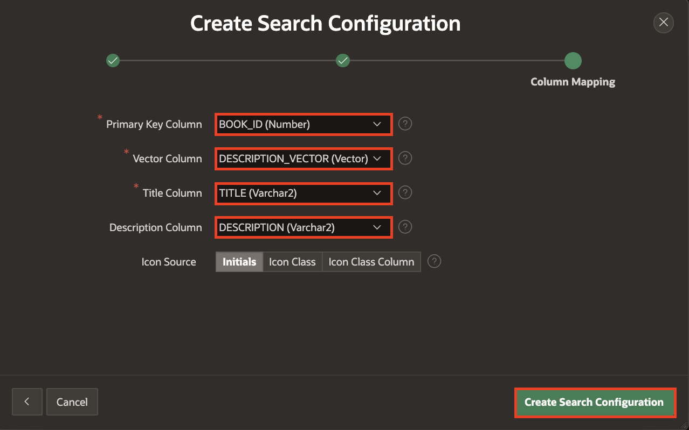

# Create Search Configurations with Oracle Vector Search

## Introduction

In this lab, you will learn how to load ONNX models into Oracle Database and create a Vector Provider to generate vector embeddings. You will then create a Search Configuration based on Oracle Vector Search to build an efficient search system. Finally, you will link a search bar to these responses, enabling powerful and accurate search functionality.

>*Note: This lab assumes you are using Oracle Database 23ai.*

Estimated Time: 10 minutes

### Objectives

- Load ONNX Models
- Create a Vector Provider
- Generate Vector Embeddings
- Create Search Configuration based on Oracle Vector Search
- Link Vector Search to the Home Page Search.

## Task 1: Load ONNX Model to Oracle Database

Before uploading the ONNX model to your database schema, you must grant the schema the privilege to create mining models while logged in as SYS/ADMIN.

Login as SYS/Admin User and execute the below command.

>**Command**: GRANT create mining model TO **YourSchemaName**;


1. From your APEX workspace homepage, click the Down Arrow next to **SQL Workshop** and select **SQL Commands**.

    

2. In the SQL Commands Page, copy and paste the below code and click **Run**.

    ```
    <copy>
        DECLARE
        L_PAR_URL       VARCHAR2(1000);
        L_RESPONSE_BLOB BLOB;
        BEGIN
            L_PAR_URL := 'https://adwc4pm.objectstorage.us-ashburn-1.oci.customer-oci.com/p/eLddQappgBJ7jNi6Guz9m9LOtYe2u8LWY19GfgU8flFK4N9YgP4kTlrE9Px3pE12/n/adwc4pm/b/OML-Resources/o/all_MiniLM_L12_v2.onnx'
            ;
            L_RESPONSE_BLOB := APEX_WEB_SERVICE.MAKE_REST_REQUEST_B(
                P_URL         => L_PAR_URL,
                P_HTTP_METHOD => 'GET'
            );
            DBMS_VECTOR.LOAD_ONNX_MODEL(
                MODEL_NAME => 'DOC_MODEL',
                MODEL_DATA => L_RESPONSE_BLOB,
                METADATA   =>
                        JSON(
                            ' {
                        "function" : "embedding",
                        "embeddingOutput" : "embedding" ,
                        "input":{"input": ["DATA"]}
                    }'
                        )
            );

        END;
    </copy>
    ```

    

## Task 2: Create Vector Provider from Workspace Utilities

In this task, you will create a Vector Provider that will be used later to set up a Search Configuration.

1. From your SQL Commands page, click the Down Arrow next to **App Builder** and select **Workspace Utilities**. Then click **All Workspace Utilities**.

    

2. In the Workspace Utilities page, select **Vector Providers**.

    

3. In the Vector Providers page, click **Create**.

    

4. In the Vector Provider Configuration page, enter the following:

    - Under Identification:

        - Provider Type : **Database ONNX Model**

        - Name: **DB ONNX Model**

        - Static ID: **db\_onnx\_model**

    - Under Local Embedding:

        - For ONNX Model Owner: **Select your Parsing Schema**

        - ONNX Model Name: **DOC_MODEL**

    Click **Create**.

    

5. Your Vector Provider is now created.

    

## Task 3: Create Column and Update Table for Vector Embeddings

In this task, you will enhance the **OBS\_BOOKS** table by adding a new column, **DESCRIPTION\_VECTOR**, to store description vector embeddings. Starting with APEX 24.2, the new PL/SQL API **APEX\_AI.GET\_VECTOR\_EMBEDDINGS** streamlines this process. You will utilize the **APEX\_AI.GET\_VECTOR\_EMBEDDINGS** API to insert a Vector Embeddings.

1. From your Vector Provider page, click the Down Arrow next to **SQL Workshop** and select **SQL Commands**.

    

2. Create a new column in the **OBS\_BOOKS** table to store description vector embeddings. Copy and paste the SQL code below, then click **Run**.

     ```
    <copy>
    ALTER TABLE OBS_BOOKS ADD DESCRIPTION_VECTOR VECTOR;
    </copy>
     ```

    

3. Copy and paste the SQL code below, then click **Run**

    ```
    <copy>
    UPDATE OBS_BOOKS
    SET DESCRIPTION_VECTOR = APEX_AI.GET_VECTOR_EMBEDDINGS(
        P_VALUE             => DESCRIPTION,
        P_SERVICE_STATIC_ID => 'db_onnx_model'
    );
    </copy>
     ```

    

## Task 4: Create a Search Configuration

In this task, you will set up a Search Configuration based on Oracle Vector Search.

1. From the Navigation bar in your workspace, click **App Builder**.

    

2. In the **App Builder** page, select your Application and then click **Shared Components**.

    

    

3. From Shared Components, under **Navigation and Search**, click **Search Configurations**.

    

4. In the Search Configurations page, click **Create**.

    

5. In the Create Search Configuration Detail Wizard, enter the following and click **Next**.

    - Name : **Online Bookstore Search - Vector**

    - Search Type: **Oracle Vector Search**

    

6. In the Create Search Configuration **Source** Wizard, enter the following and click **Next**.

    - Vector Provider : **DB ONNX Model**

    - Source Type: **Table**

    - Table/View Owner: **Select your Parsing Schema**

    - Table/View Name: **OBS\_BOOKS**

    

7. In the Create Search Configuration **Column Mapping** Wizard, enter the following and click **Create Search Configuration**.

    - Primary Key Column Column 2 : **BOOK_ID(Number)**

    - Vector Column: **DESCRIPTION_VECTOR(Vector)**

    - Title Column: **TITLE(Varchar2)**

    - Description Column: **DESCRIPTION(Varchar2)**

    

## Task 5: Link Oracle Vector Search to the Home Page Search.

## Summary

In this lab, you loaded ONNX models into Oracle Database, created a Vector Provider, and generated vector embeddings. You then configured Oracle Vector Search for enhanced search capabilities and link the search to leverage these embeddings for efficient and accurate search results.

## Acknowledgements

- **Author**: Pankaj Goyal, Member Technical Staff
- **Last Updated By/Date**: Pankaj Goyal, Member Technical Staff, Feb 2025
