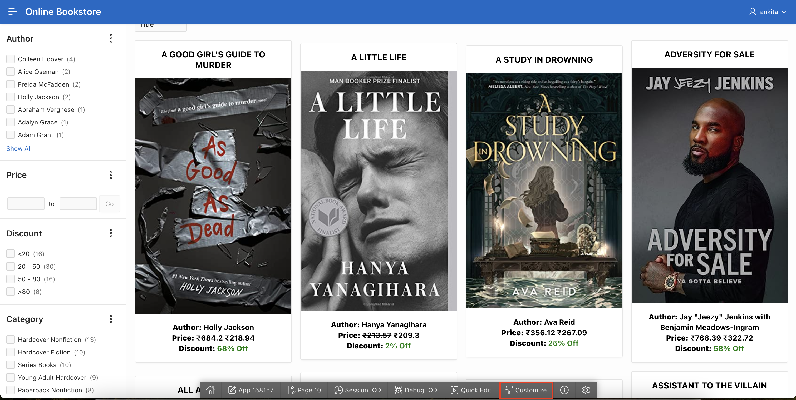
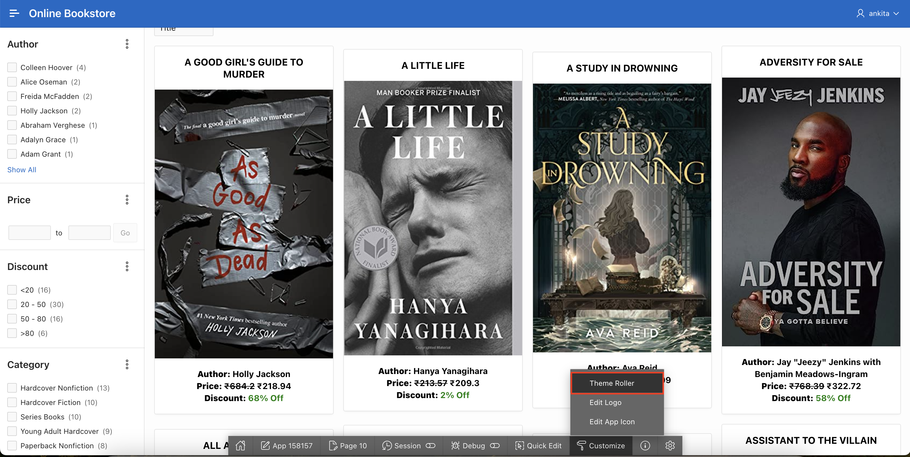
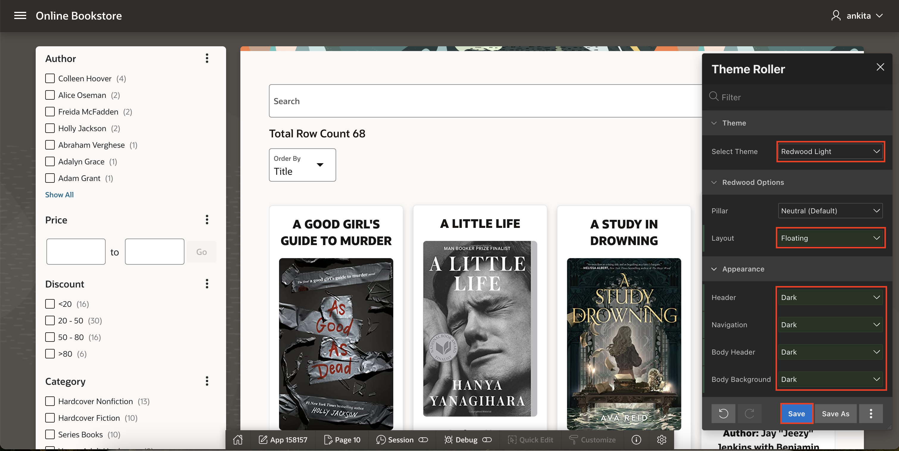
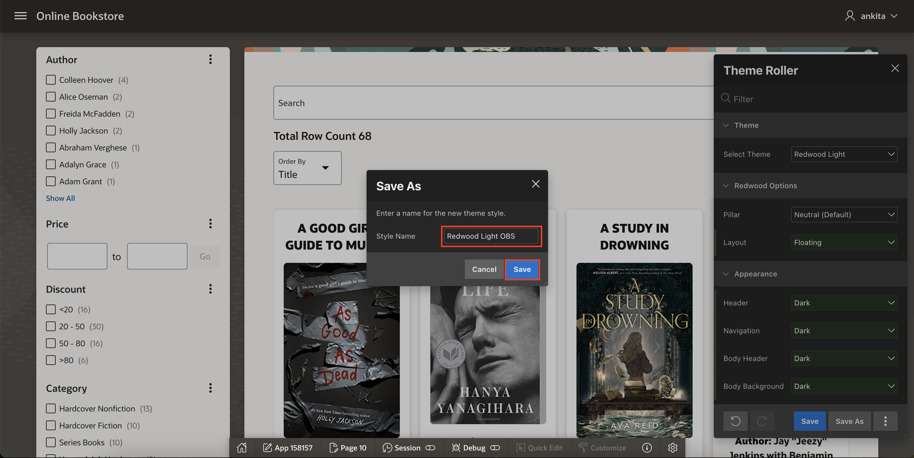
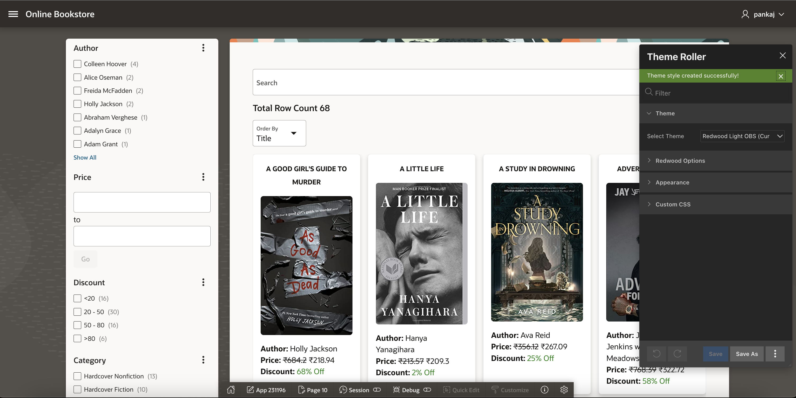

# Customize Application Theme

## Introduction
During this lab, you learn how to customize theme of Online Book Store Application using theme roller. Theme Roller is a live CSS editor that enables you to quickly change the theme style, colors, rounded corners and other application attributes.

Estimated Time: 2 minutes

### Objectives
In this lab, you will:

- Update Theme of the Application using Theme Roller

## Task 1: Update Theme of the Application

1. In the runtime view, Select **Customize** from the developer toolbar.

   

2. Select **Theme Roller**.

   

3. Update the following:

    - Theme > Select Theme: **Redwood Light**

    - Redwood Options > Layout: **Floating**

    - Appearance: Update all the options to **Dark**.

    Click **Save**

   

4. Style Name: **Redwood Light OBS** and Click **Save**.

   

   

## Summary

You've learned how to update the theme of the application using theme roller. Ready to move on to the next lab!

## Acknowledgements

- **Author**: Ankita Beri, Product Manager
- **Last Updated By/Date**: Ankita Beri, Product Manager, May 2024
