# Add to Cart

## Introduction
In this lab, you will create a package with procedures and functions that collectively manage the process of adding, removing, and processing orders and wishlist items within the database application. Additionally, you will learn to create application items, processes, and computations. Moreover, you will create processes to invoke these procedures and functions.

Estimated Time: 15 minutes

### Objectives
In this lab, you will:

- Create a Package to manage process of adding, removing, and processing orders and wishlist items.
- Create Application Items
- Create Application processes
- Create Application Computations

## Task 1: Create a Package to manage orders
In this task, you create a package named **OBS\_MANAGE\_ORDERS**, contains procedures and functions to manage orders and wishlist items within a database application. Let's break down its components:

**Procedure add\_book**: Adds a book to a collection named "BOOKS" along with its quantity.

**Procedure remove\_book**: Removes a book from the "BOOKS" collection based on its ID.

**Procedure add\_to\_wishlist**: Inserts a book into the wishlist table for a specified user.

**Procedure remove\_from\_wishlist**: Removes a book from the wishlist of a specified user.

**Function get\_quantity**: Retrieves the total number of items in the "BOOKS" collection.

**Function book\_exists**: Checks if a book exists in the "BOOKS" collection and returns its quantity.

**Procedure clear\_cart**: Clears all items from the "BOOKS" collection.

**Procedure create\_order**: Creates a new order by inserting data into the orders table and order items table based on the items in the "BOOKS" collection. It also deletes the "BOOKS" collection after order creation.


1. Under SQL Developer, Click **Object Browser**.

   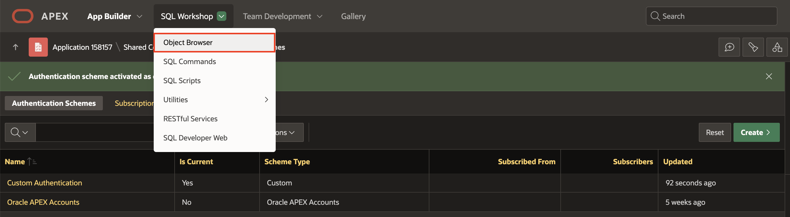

2. Right-Click Packages and Select **Package**.

   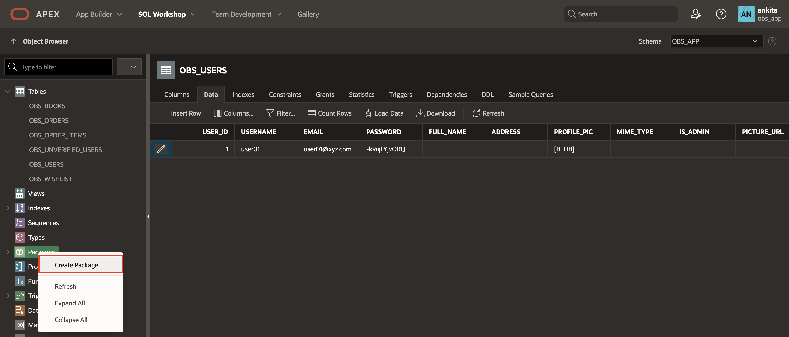

3. In Create Package dialog, For Name: Enter **OBS\_MANAGE\_ORDERS** and Click **Create Package**.

   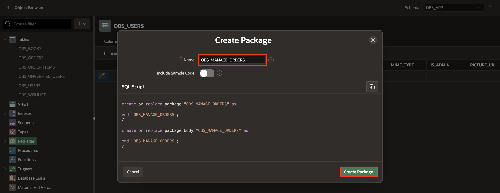

4. Under Specification, Copy and paste below code:

     ```
     <copy>
   create or replace PACKAGE OBS_MANAGE_ORDERS
   AS
  --------------------------------------------------------------
  create procedure for add a book temporarily
  PROCEDURE add_book (
    p_book  IN NUMBER,
    p_quantity IN NUMBER);
  --------------------------------------------------------------
  create procedure for remove a book temporarily
  PROCEDURE remove_book (
    p_book IN NUMBER);
  --------------------------------------------------------------
  create procedure for add a book in wishlist
    PROCEDURE add_to_wishlist (
    p_book_id IN NUMBER,
    p_user_id IN NUMBER);
  -------------------------------------------------------------create procedure for remove a book from wishlist
    PROCEDURE remove_from_wishlist (
    p_book_id IN NUMBER,
    p_user_id IN NUMBER);
  --------------------------------------------------------------
  create function to get the number of items in the shopping cart
  FUNCTION Get_quantity
  RETURN NUMBER;
  --------------------------------------------------------------
 create procedure for validate if a book exists in the shopping cart
  FUNCTION book_exists(
    p_book IN NUMBER)
  RETURN NUMBER;
  ------------------------------------------------------------
  create procedure for clear the cart
  PROCEDURE clear_cart;
  --------------------------------------------------------------
  create procedure to insert orders
  PROCEDURE create_order (
    p_user_id    IN VARCHAR2,
    p_order_id   OUT obs_orders.order_id%TYPE);
 END OBS_MANAGE_ORDERS;
  /
    </copy>
     ```

   Click **Save and Compile**.

   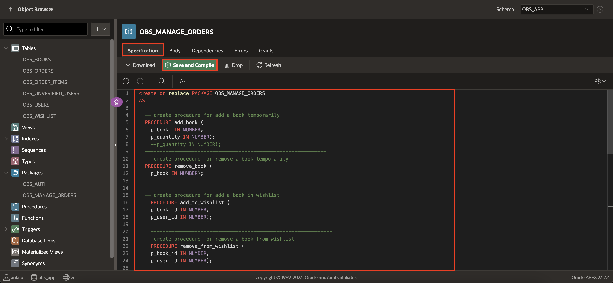

5. Under Body, Copy and paste below code:

   ```
   <copy>
   create or replace PACKAGE BODY OBS_MANAGE_ORDERS
   AS
   PROCEDURE add_book (p_book IN NUMBER,p_quantity in number)
   IS
   BEGIN
   IF NOT apex_collection.collection_exists (p_collection_name => 'BOOKS') and  book_exists(p_book) = 0
   THEN
    apex_collection.create_collection(p_collection_name => 'BOOKS');
   END IF;
   apex_collection.add_member(p_collection_name => 'BOOKS',
   p_n001 => p_book,
   p_n002 => p_quantity);
   END add_book;

   PROCEDURE remove_book (p_book IN NUMBER)
   IS
   l_id NUMBER;
   BEGIN
   IF apex_collection.Collection_exists (p_collection_name => 'BOOKS') and book_exists(p_book) > 0
   THEN
    SELECT seq_id
    INTO  l_id
    FROM  apex_collections a
    WHERE collection_name = 'BOOKS'
       AND a.n001 = p_book;
    apex_collection.delete_member(p_collection_name => 'BOOKS', p_seq => l_id );
   END IF;
  END remove_book;

  PROCEDURE add_to_wishlist (p_book_id IN NUMBER, p_user_id  IN NUMBER)
  is
  BEGIN
  INSERT INTO obs_wishlist (book_id, user_id) VALUES (p_book_id, p_user_id);
  END add_to_wishlist;

  PROCEDURE remove_from_wishlist (p_book_id IN NUMBER, p_user_id  IN NUMBER)
  is
  BEGIN
   delete from obs_wishlist where user_id = p_user_id and book_id = p_book_id;
  END remove_from_wishlist;

  FUNCTION get_quantity
  RETURN NUMBER
  IS
  l_items NUMBER := 0;
  BEGIN
   IF apex_collection.collection_exists (p_collection_name => 'BOOKS')
   THEN
    SELECT count(n001)
    INTO  l_items
    FROM  apex_collections a
    WHERE collection_name = 'BOOKS';
   END IF;
   RETURN l_items;
  END get_quantity;

  FUNCTION book_exists(p_book IN NUMBER)
  RETURN NUMBER
  IS
  l_quantity NUMBER;
  BEGIN
   IF apex_collection.collection_exists (p_collection_name => 'BOOKS')
   THEN
    SELECT a.n002
    INTO  l_quantity
    FROM  apex_collections a
    WHERE collection_name = 'BOOKS'
       AND a.n001 = p_book;
    RETURN l_quantity;
   ELSE
    RETURN 0;
   END IF;
 EXCEPTION
  WHEN OTHERS THEN
       RETURN 0;
 END book_exists;

 PROCEDURE clear_cart
 IS
 BEGIN
   IF apex_collection.collection_exists (p_collection_name => 'BOOKS')
   THEN
    apex_collection.truncate_collection(p_collection_name => 'BOOKS');
   END IF;
 END clear_cart;

PROCEDURE create_order (p_user_id  IN VARCHAR2,
                        p_order_id  OUT obs_orders.order_id%TYPE)
 IS
 BEGIN
     INSERT INTO obs_orders
         (order_datetime,
         user_id)
   VALUES   (SYSDATE,
         p_user_id)
   returning order_id INTO p_order_id;
   IF apex_collection.collection_exists (p_collection_name => 'BOOKS')
   THEN
    INSERT INTO obs_order_items
          (order_id,
          seq_no,
          book_id,
          price,
          quantity,
          discount,
          added_date,
          added_time)
    SELECT p_order_id,
       seq_id,
       b.book_id,
       b.price,
       n002,
       b.discount,
       Sysdate,
       SYSTIMESTAMP AT TIME ZONE 'Asia/Kolkata' AS added_time
    FROM  apex_collections a,
       obs_books b
    WHERE collection_name = 'BOOKS'
       AND b.book_id = a.n001;
   END IF;
   apex_collection.delete_collection(p_collection_name => 'BOOKS');
 END create_order;  
END OBS_MANAGE_ORDERS;
/
   </copy>
   ```

   Click **Save and Compile**.

   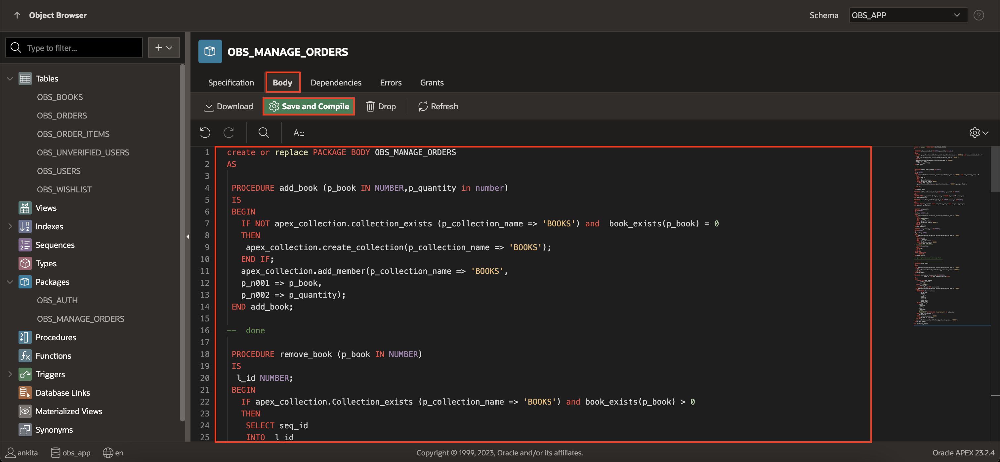

## Task 2: Create Application items
In this task, you create application items which will be used while creating add to cart page. Application items do not display, but are used to maintain session state.

Application items can be set using computations, processes, or by passing values on a URL.

1. On the Workspace home page, click **App Builder**.

   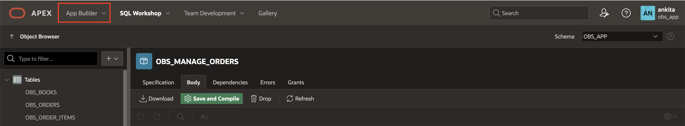

2. Select **Online BookStore** application.

   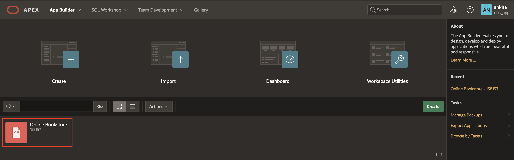

3. On the Application home page, click **Shared Components**.

    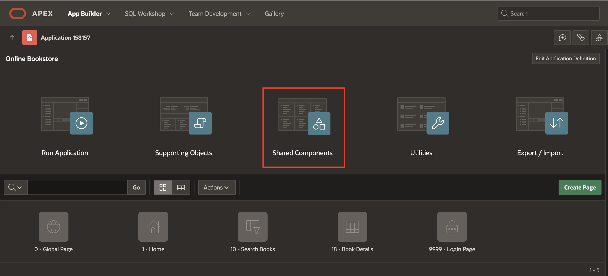

4. Under Application Logic, select **Application Items**.

    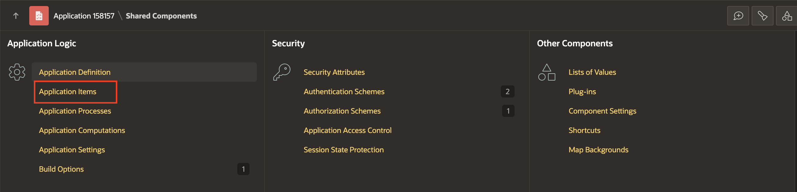

5. To create an application item, click **Create**.

    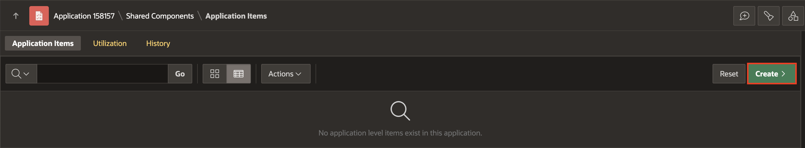

6. Add the following five application items one after the other:

   | Name |  
   | --- |
   | CART\_TOTAL |
   | SHOPPING\_CART\_ITEMS |
   | SHOPPING\_CART\_ICON |
   | USER\_ID |
   | USERNAME |

   Click **Create Application item**.

   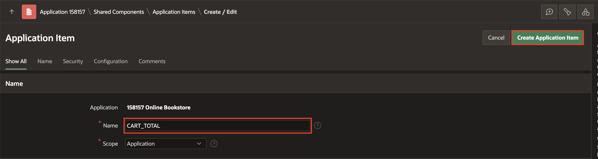

## Task 3: Create Application processes
In this task, you create application process to run a block of PL/SQL logic at a specific point from multiple pages of an application.

This application process is used to dynamically update the shopping cart icon and item count displayed in a user interface based on the number of items in the shopping cart retrieved.

1. Click **Shared Components**.

   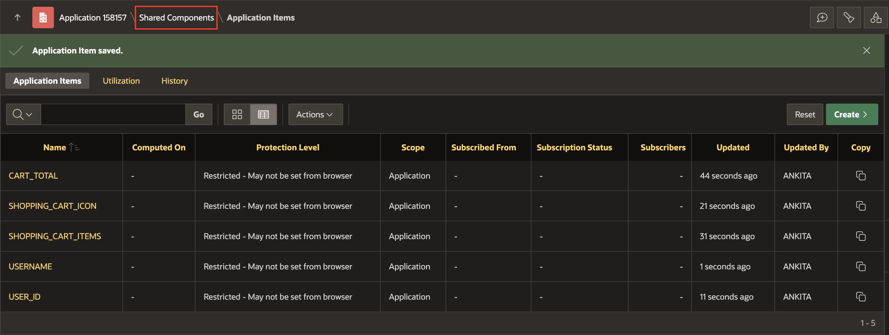

2. Under Application Logic, select Application Processes.

   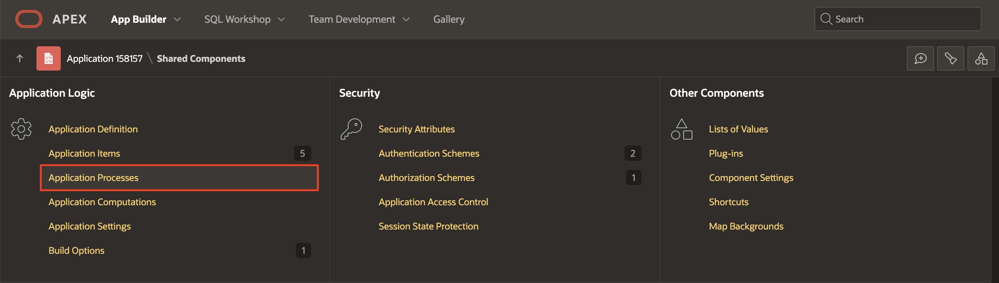

3. Click **Create**.

   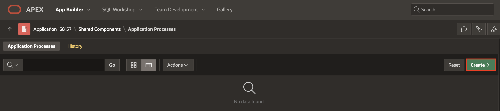

4. Enter the following:

   - Under Identification:

       - Name: **Initialize Shopping Cart Info**

       - Point: **On Load: Before Header (page template header)**

       Click **Next**.

       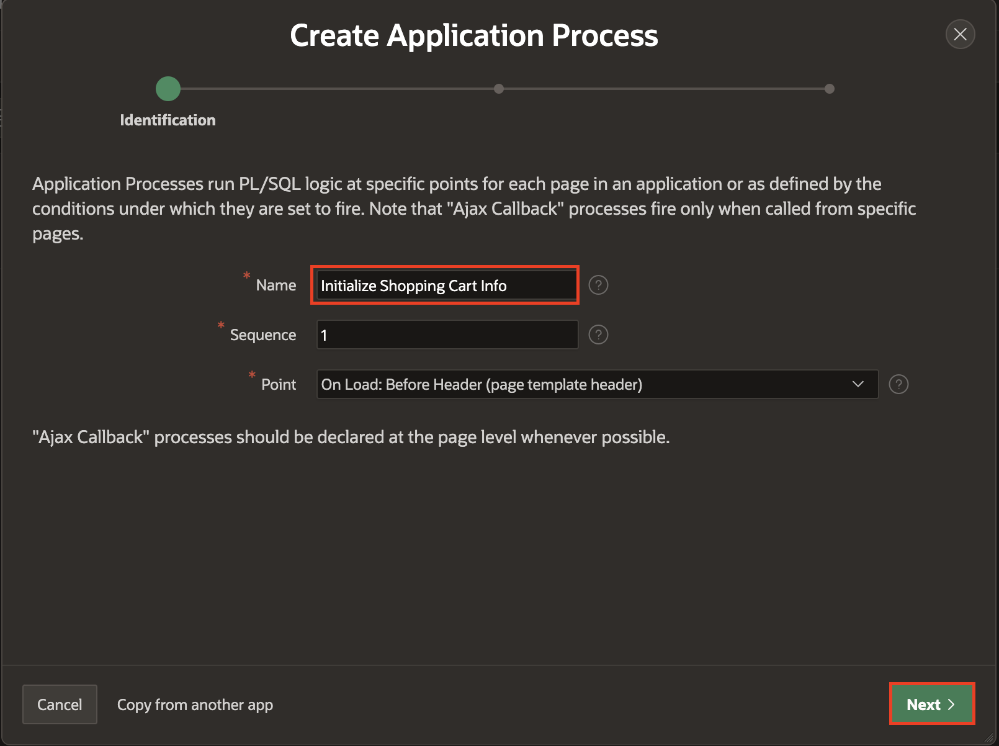

5. Enter the following:

   - Source > Code: Copy and paste the below code.

   ```
   <copy>
   -- Initialize shopping cart navigation bar to show appropriate icon and count
   DECLARE
    l_cnt NUMBER := obs_manage_orders.get_quantity;
   BEGIN
    IF l_cnt > 0 THEN
        :SHOPPING_CART_ITEMS := l_cnt;
        :SHOPPING_CART_ICON := 'fa-cart-full';
    ELSE
        :SHOPPING_CART_ITEMS := '';
        :SHOPPING_CART_ICON := 'fa-cart-empty';
    END IF;
   END;
   </copy>
   ```

   Click **Next**.

    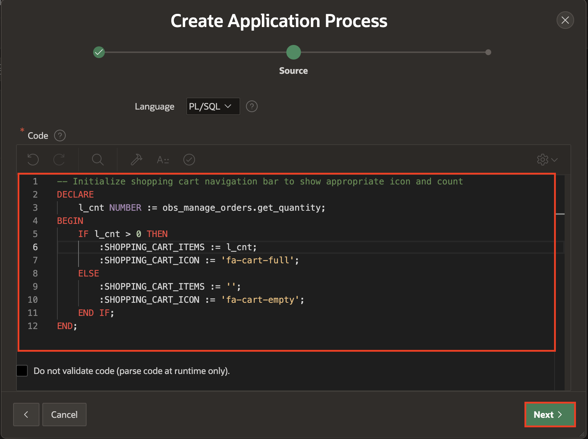

6. Click **Create Process**.

    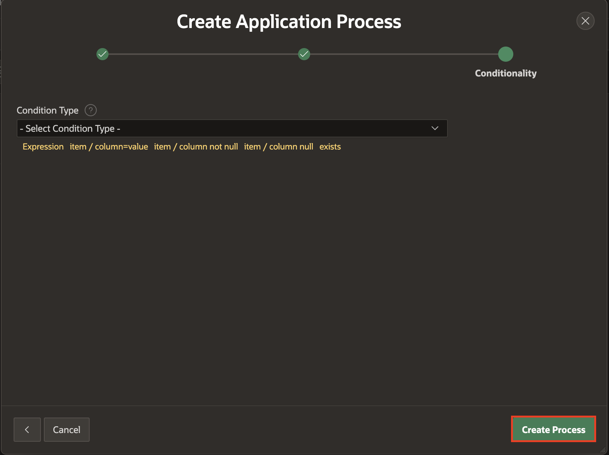

## Task 4: Create Application computations
Application computations are used to set the value of a single page or application-level item. Application computations run at the same point across multiple pages in an application.

1. Click **Shared Components**.

2. Under Application Logic, select **Application Computations**.

   

3. Click **Create**.

   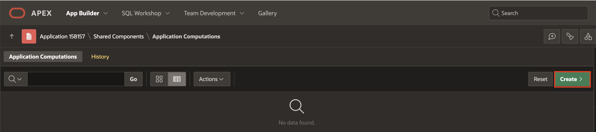

4. Enter the following:

   - Item > Computation Item: **USER_ID**

   - Frequency > Computation Point: **After Authentication**

  Under Computation:

  - Computation Type: SQL Query (return single value)

  - Computation: Copy and paste below code
     ```
     <copy>
     SELECT U.USER_ID FROM obs_USERS U
     WHERE (U.USERNAME) = lower(:APP_USER) or (U.EMAIL) = lower(:APP_USER);
    </copy>
     ```
  Click **Create Computation**.

  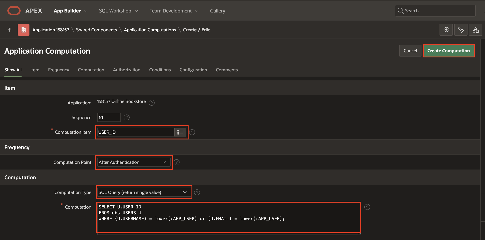

5. Click **Create**.

   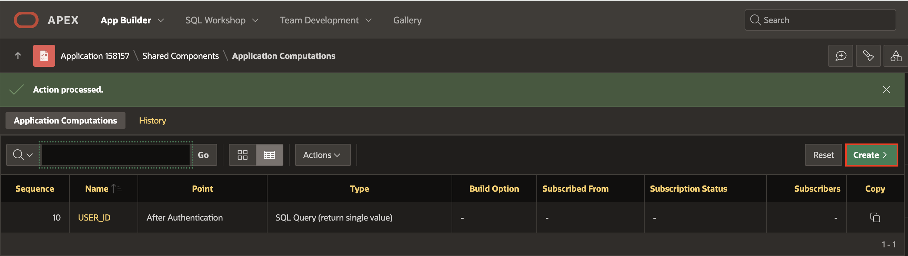

6. Enter the following:
   - Under Item:

     - Sequence: **20**

     - Computation Item: **USERNAME**

   - Frequency > Computation Point: **After Authentication**

   - Under Computation:

      - Computation Type: SQL Query (return single value)

      - Computation: Copy and paste below code
       ```
       <copy>
       SELECT U.USERNAME FROM OBS_USERS U
       WHERE U.USER_ID=:USER_ID
       </copy>
        ```
  Click **Create Computation**.

  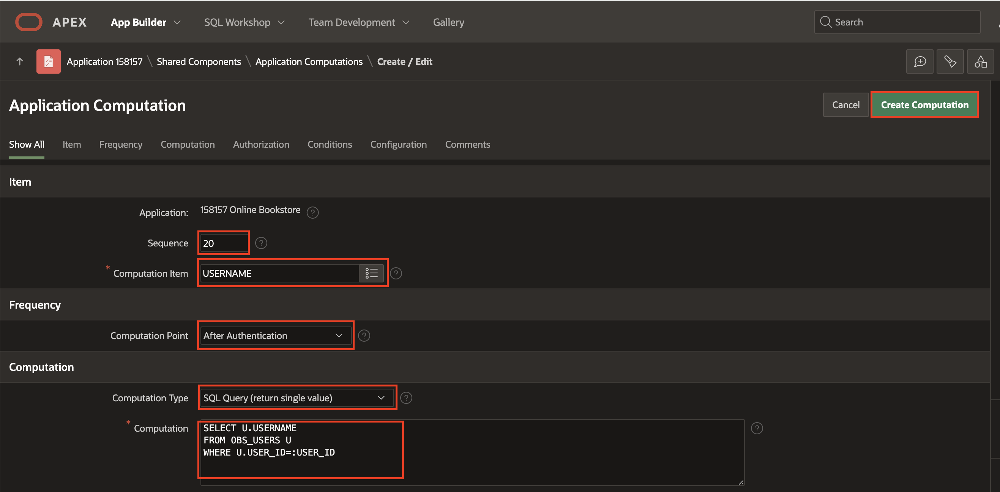

## Summary

You've learned how to create package, application items, application process and application computations. Ready to move on to the next lab!

## Acknowledgements

- **Author**: Ankita Beri, Product Manager
- **Last Updated By/Date**: Ankita Beri, Product Manager, May 2024
