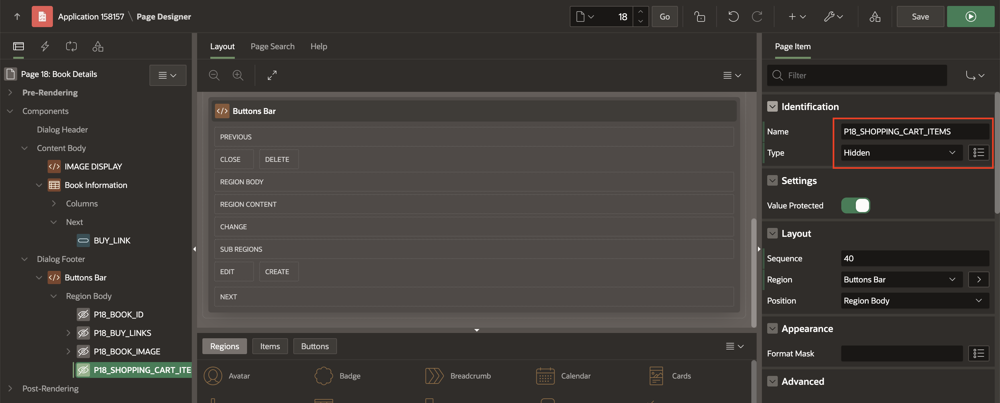
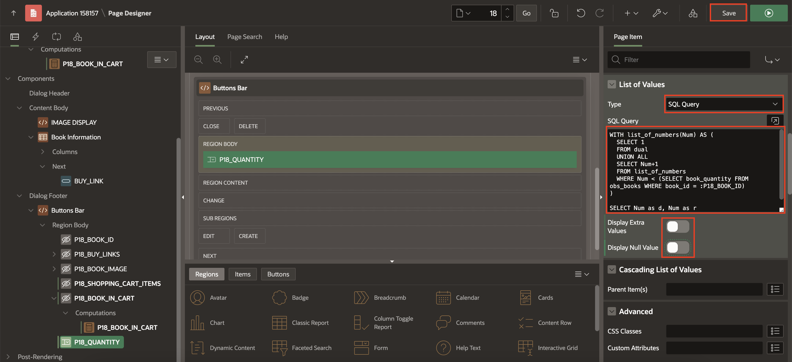

# Set Up Add to Cart Functionality

## Introduction
This lab provides detailed instructions on enhancing the Book Details page in a application to manage shopping cart functionalities. It involves creating a package to handle orders, setting up application items and processes, and configuring page elements to allow users to add and remove books from their cart, update cart quantities, and dynamically reflect these changes on the user interface. The steps include creating necessary backend procedures and functions, setting up computations and processes, and updating the user interface components accordingly.

Estimated Time: 25 minutes

### Objectives
In this lab, you will:

- Create a Package to manage process of adding, removing, and processing orders and wishlist items.
- Create Application Items
- Create Application processes
- Create Application Computations
- Set Up Book Details Page

## Task 1: Create a Package to manage orders
In this task, you create a package named **OBS\_MANAGE\_ORDERS**, contains procedures and functions to manage orders and wishlist items within a database application. Let's break down its components:

**Procedure add\_book**: Adds a book to a collection named "BOOKS" along with its quantity.

**Procedure remove\_book**: Removes a book from the "BOOKS" collection based on its ID.

**Procedure add\_to\_wishlist**: Inserts a book into the wishlist table for a specified user.

**Procedure remove\_from\_wishlist**: Removes a book from the wishlist of a specified user.

**Function get\_quantity**: Retrieves the total number of items in the "BOOKS" collection.

**Function book\_exists**: Checks if a book exists in the "BOOKS" collection and returns its quantity.

**Procedure clear\_cart**: Clears all items from the "BOOKS" collection.

**Procedure create\_order**: Creates a new order by inserting data into the orders table and order items table based on the items in the "BOOKS" collection. It also deletes the "BOOKS" collection after order creation.

To Create a Package:

1. Under SQL Developer, Click **Object Browser**.

   

2. Right-Click Packages and Select **Package**.

   

3. In Create Package dialog, For Name: Enter **OBS\_MANAGE\_ORDERS** and Click **Create Package**.

   

4. Under **Specification**, Copy and paste below code:

     ```
     <copy>
   create or replace PACKAGE OBS_MANAGE_ORDERS
   AS
  --------------------------------------------------------------
  create procedure for add a book temporarily
  PROCEDURE add_book (
    p_book  IN NUMBER,
    p_quantity IN NUMBER);
  --------------------------------------------------------------
  create procedure for remove a book temporarily
  PROCEDURE remove_book (
    p_book IN NUMBER);
  --------------------------------------------------------------
  create procedure for add a book in wishlist
    PROCEDURE add_to_wishlist (
    p_book_id IN NUMBER,
    p_user_id IN NUMBER);
  -------------------------------------------------------------create procedure for remove a book from wishlist
    PROCEDURE remove_from_wishlist (
    p_book_id IN NUMBER,
    p_user_id IN NUMBER);
  --------------------------------------------------------------
  create function to get the number of items in the shopping cart
  FUNCTION Get_quantity
  RETURN NUMBER;
  --------------------------------------------------------------
 create procedure for validate if a book exists in the shopping cart
  FUNCTION book_exists(
    p_book IN NUMBER)
  RETURN NUMBER;
  ------------------------------------------------------------
  create procedure for clear the cart
  PROCEDURE clear_cart;
  --------------------------------------------------------------
  create procedure to insert orders
  PROCEDURE create_order (
    p_user_id    IN VARCHAR2,
    p_order_id   OUT obs_orders.order_id%TYPE);
 END OBS_MANAGE_ORDERS;
  /
     </copy>
      ```

   Click **Save and Compile**.

   

5. Under **Body**, Copy and paste below code:

    ```
    <copy>
   create or replace PACKAGE BODY OBS_MANAGE_ORDERS
   AS
   PROCEDURE add_book (p_book IN NUMBER,p_quantity in number)
   IS
   BEGIN
   IF NOT apex_collection.collection_exists (p_collection_name => 'BOOKS') and  book_exists(p_book) = 0
   THEN
    apex_collection.create_collection(p_collection_name => 'BOOKS');
   END IF;
   apex_collection.add_member(p_collection_name => 'BOOKS',
   p_n001 => p_book,
   p_n002 => p_quantity);
   END add_book;

   PROCEDURE remove_book (p_book IN NUMBER)
   IS
   l_id NUMBER;
   BEGIN
   IF apex_collection.Collection_exists (p_collection_name => 'BOOKS') and book_exists(p_book) > 0
   THEN
    SELECT seq_id
    INTO  l_id
    FROM  apex_collections a
    WHERE collection_name = 'BOOKS'
       AND a.n001 = p_book;
    apex_collection.delete_member(p_collection_name => 'BOOKS', p_seq => l_id );
   END IF;
  END remove_book;

  PROCEDURE add_to_wishlist (p_book_id IN NUMBER, p_user_id  IN NUMBER)
  is
  BEGIN
  INSERT INTO obs_wishlist (book_id, user_id) VALUES (p_book_id, p_user_id);
  END add_to_wishlist;

  PROCEDURE remove_from_wishlist (p_book_id IN NUMBER, p_user_id  IN NUMBER)
  is
  BEGIN
   delete from obs_wishlist where user_id = p_user_id and book_id = p_book_id;
  END remove_from_wishlist;

  FUNCTION get_quantity
  RETURN NUMBER
  IS
  l_items NUMBER := 0;
  BEGIN
   IF apex_collection.collection_exists (p_collection_name => 'BOOKS')
   THEN
    SELECT count(n001)
    INTO  l_items
    FROM  apex_collections a
    WHERE collection_name = 'BOOKS';
   END IF;
   RETURN l_items;
  END get_quantity;

  FUNCTION book_exists(p_book IN NUMBER)
  RETURN NUMBER
  IS
  l_quantity NUMBER;
  BEGIN
   IF apex_collection.collection_exists (p_collection_name => 'BOOKS')
   THEN
    SELECT a.n002
    INTO  l_quantity
    FROM  apex_collections a
    WHERE collection_name = 'BOOKS'
       AND a.n001 = p_book;
    RETURN l_quantity;
   ELSE
    RETURN 0;
   END IF;
 EXCEPTION
  WHEN OTHERS THEN
       RETURN 0;
 END book_exists;

 PROCEDURE clear_cart
 IS
 BEGIN
   IF apex_collection.collection_exists (p_collection_name => 'BOOKS')
   THEN
    apex_collection.truncate_collection(p_collection_name => 'BOOKS');
   END IF;
 END clear_cart;
 PROCEDURE create_order (p_user_id  IN VARCHAR2,
                        p_order_id  OUT obs_orders.order_id%TYPE)
 IS
 BEGIN
     INSERT INTO obs_orders
         (order_datetime,
         user_id)
   VALUES   (SYSDATE,
         p_user_id)
   returning order_id INTO p_order_id;
   IF apex_collection.collection_exists (p_collection_name => 'BOOKS')
   THEN
    INSERT INTO obs_order_items
          (order_id,
          seq_no,
          book_id,
          price,
          quantity,
          discount,
          added_date,
          added_time)
    SELECT p_order_id,
       seq_id,
       b.book_id,
       b.price,
       n002,
       b.discount,
       Sysdate,
       SYSTIMESTAMP AT TIME ZONE 'Asia/Kolkata' AS added_time
    FROM  apex_collections a,
       obs_books b
    WHERE collection_name = 'BOOKS'
       AND b.book_id = a.n001;
   END IF;
   apex_collection.delete_collection(p_collection_name => 'BOOKS');
 END create_order;  
END OBS_MANAGE_ORDERS;
/
    </copy>
    ```

   Click **Save and Compile**.

   

## Task 2: Create Application items
In this task, you define application items to store session state information such as cart total, shopping cart items, and user details.

To create Application items:

1. On the Workspace home page, click **App Builder**.

   

2. Select **Online BookStore** application.

   

3. On the Application home page, click **Shared Components**.

    

4. Under Application Logic, select **Application Items**.

    

5. To create an application item, click **Create**.

    

6. Add the following five application items one after the other:

   | Name |  
   | --- |
   | CART\_TOTAL |
   | SHOPPING\_CART\_ITEMS |
   | SHOPPING\_CART\_ICON |
   | USER\_ID |
   | USERNAME |

   Click **Create Application item**.

   

## Task 3: Create Application processes
In this task, you implement application processes to run PL/SQL code at specific points to update the shopping cart item count dynamically.

To create Application Processes:

1. Click **Shared Components**.

   

2. Under **Application Logic**, select **Application Processes**.

   

3. Click **Create**.

   

4. Enter/select the following:

   - Under Identification:

       - Name: **Initialize Shopping Cart Info**

       - Point: **On Load: Before Header (page template header)**

       Click **Next**.

    

5. Enter the following:

    - Source > Code: Copy and paste the below code.

    ```
    <copy>
     -- Initialize shopping cart navigation bar to show  appropriate icon and count
     DECLARE
     l_cnt NUMBER := obs_manage_orders.get_quantity;
     BEGIN
     IF l_cnt > 0 THEN
        :SHOPPING_CART_ITEMS := l_cnt;
        :SHOPPING_CART_ICON := 'fa-cart-full';
     ELSE
        :SHOPPING_CART_ITEMS := '';
        :SHOPPING_CART_ICON := 'fa-cart-empty';
     END IF;
     END;
    </copy>
    ```

    Click **Next**.

    

6. Click **Create Process**.

    

## Task 4: Create Application computations
In this task, you set up computations to determine user-related information upon authentication.

To create Application computations:

1. Click **Shared Components**.

2. Under Application Logic, select **Application Computations**.

   

3. Click **Create**.

   

4. Enter/select the following:

   - Item > Computation Item: **USER_ID**

   - Frequency > Computation Point: **After Authentication**

   - Under Computation:

       - Computation Type: **SQL Query (return single value)**

       - Computation: Copy and paste below code:

       ```
       <copy>
       SELECT U.USER_ID FROM obs_USERS U
       WHERE (U.USERNAME) = lower(:APP_USER) or (U.EMAIL) = lower(:APP_USER);
       </copy>
       ```

    Click **Create Computation**.

    

5. Click **Create**.

    

6. Enter/select the following:

    - Under Item:

        - Sequence: **20**

        - Computation Item: **USERNAME**

    - Frequency > Computation Point: **After Authentication**

    - Under Computation:

        - Computation Type: **SQL Query (return single value)**

        - Computation: Copy and paste below code:

        ```
        <copy>
        SELECT U.USERNAME FROM OBS_USERS U
        WHERE U.USER_ID=:USER_ID
        </copy>
        ```

    Click **Create Computation**.

    

## Task 5: Set Up Book Details Page
In this task, you enhance the Book Details page by enabling the addition and removal of books to/from a shopping cart, updating the cart's item count, and ensuring the interface reflects the current state (whether a book is in the cart or not). This involves creating hidden page items, setting up computations and SQL queries, configuring buttons with server-side conditions, and defining processes to interact with the backend API for managing cart operations.

1. Click **Application ID**.

    

2. On the Workspace home page, Select **18: Book Details** page.

    

3. In the left pane, Right-click **Buttons Bar** and click **Create Page Item**.

    

4. Create the following three page items, one after the other:

      | Name            |  Type   |
      | --------------- |  ------ |
      | P18\_SHOPPING\_CART_ITEMS | Hidden |
      | P18\_BOOK\_IN\_CART | Hidden |
      | P18\_QUANTITY | Select List  |

    

5. In the Property Editor, enter/select the following:

    - Appearance > Template: **Required - Floating**

    - Under List of Values:

        - Type: **SQL Query**

        - SQL Query: Copy and Paste the below code:

        ```
        <copy>
            WITH list_of_numbers(Num) AS (
              SELECT 1
              FROM dual
              UNION ALL
              SELECT Num+1
              FROM list_of_numbers
              WHERE Num < (SELECT book_quantity FROM obs_books WHERE book_id = :P18_BOOK_ID)
            )

            SELECT Num as d, Num as r
            FROM list_of_numbers;
        </copy>
        ```
         - Display Extra Values: **Toggle Off**

         - Display Null Value: **Toggle Off**

    


6. Right-click **P18\_BOOK\_IN\_CART** and Click **Create Computation**.

    

7. In the Property editor, enter/select the following:

    - Under Computation:

        - Type: **Function Body**

        - PL/SQL Function Body: Copy and paste the below code:

        ```
        <copy>
               RETURN obs_manage_orders.book_exists(p_book => :P18_BOOK_ID);
               </copy>
               ```

    

    


8.  In the left pane, Right-click **Buttons Bar** and Click **Create Button**.

    

9. In the Property Editor, enter/select the following:

    - Under Identification:

        - Name: **Add\_to\_Cart**

        - Label: **Add To Cart**

    - Layout > Position: **Next**

    - Appearance > Hot: **Toggle Off**

    - Under Server-Side Condition:

        - Type: **Item is zero**

        - Item: **P18\_BOOK\_IN\_CART**

    

10. Right-click **Buttons Bar** and Click **Create Button**.

11. In the Property Editor, enter/select the following:

    - Under Identification:

        - Name: **Remove\_from\_Cart**

        - Label: **Remove From Cart**

    - Layout > Position: **Edit**

        - Appearance > Click **Template Options**

            - Type: **Danger**

            - Spacing Right: **Large**

            Click **OK**.

    - Under Server-Side Condition:

        - Type: **Item is NOT zero**

        - Item: **P18\_BOOK\_IN\_CART**

    

12.  Navigate to the **Processing** tab. Right-click **Processing** and Click **Create Process**.

    

13. In the Property Editor, update the following:

    - Under Identification:

        - Name: **Add product**

        - Type: **Invoke API**

    - Under Settings:

        - Package: **OBS\_MANAGE\_ORDERS**

        - Procedure or Function: **ADD\_BOOK**

    - Server-side Condition > When button pressed: **Add_to_cart**

    

14. Expand the Parameters of **Add Product** and enter the following:

      | Parameter |  Type   | Item |
      | --------- |  ------ | ---- |
      | p\_book | Item | P18\_BOOK\_ID |
      | p\_quantity | Item | P18\_QUANTITY |

    

    

15. Right-click **Processing** and Click **Create Process**.

16. In the Property Editor, enter/select the following:

    - Under Identification:

        - Name: **Delete product**

        - Type: **Invoke API**

    - Under Settings

        - Package: **OBS\_MANAGE\_ORDERS**

        - Procedure or Function: **REMOVE\_BOOK**

    - Server-side Condition > When button pressed: **Remove\_from\_cart**

    

17. Expand the Parameter of **Delete Product** and enter the following:

      | Parameter |  Type   | Item |
      | --------- |  ------ | ---- |
      | p\_book | Item | P18\_BOOK\_ID |

    

18. Right-click **Processing** and Click **Create Process**.

19. In the Property Editor, enter/select the following:

    - Under Identification:

        - Name: **Calculate Shopping Cart Items**

        - Type: **Invoke API**

    - Under Settings:

        - Package: **OBS\_MANAGE\_ORDERS**

        - Procedure or Function: **GET\_QUANTITY**

    - Server-side Condition > When button pressed: **Remove\_from\_cart**

    

20. Expand the Parameter of **Calculate Shopping Cart Items** and enter the following:

     | Parameter |  Type   | Item |
     | --------- |  ------ | ---- |
     | Function Result | Item | P18\_SHOPPING\_CART\_ITEMS |

    

21. Right-click **Processing** and Click **Create Process**.

22. In the Property Editor, enter/select the following:

    - Under Identification:

        - Name: **Close Dialog**

        - Type: **Close Dialog**

    - Under Settings > Item to return: **P18\_SHOPPING\_CART_ITEMS, P18\_BOOK\_ID**

    

21. Click **Save**.


## Summary
In this lab, you have learned how to enhance the Book Details page by creating a package to manage shopping cart functionalities, defining application items to store session state information, implementing application processes to run PL/SQL code at specific points, and setting up computations to determine user-related information. These steps enable the addition and removal of books to/from a shopping cart, updating the cart's item count, and ensuring the interface dynamically reflects the current state of the cart. You are now ready to move on to the next lab!

## Acknowledgements

- **Author**: Ankita Beri, Product Manager
- **Last Updated By/Date**: Ankita Beri, Product Manager, May 2024
