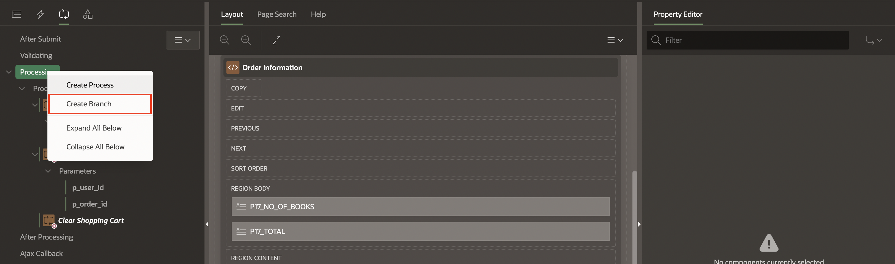

# Create and Manage a Shopping Cart

## Introduction

In this lab, you learn to create and manage a shopping cart within an Oracle APEX application. The lab includes adding navigation bar entry, creating a shopping cart page, implementing various interactive components, and integrating backend processes to handle cart operations and checkout procedures. This exercise will demonstrate the comprehensive capabilities of APEX for building dynamic web applications with a strong emphasis on database interaction and user interface design.

Estimated Time: 15 minutes

### Objectives

In this lab, you will:

- Create a Navigation Bar Entry
- Build a Shopping Cart Page
- Create Application processes
- Create Application Computations

## Task 1: Build a Shopping Cart Page

In this task, you develop a new page in the application to display the shopping cart with book details, quantities, and prices. Additionally, you implement SQL queries to fetch cart data and display it in a user-friendly format.

1. Navigate to **Application ID**.

    

2. Click **Create Page**.

    

3. Select **Blank Page**.

    

4. In Create Blank Page dialog, enter the following:

    - Under Identification:

        - Name: **Shopping Cart**

        - Page Number: **17**

    - Under Navigation:

        - Use Breadcrumb: **Toggle Off**

        - Use Navigation: **Toggle Off**

        Click **Create Page**.

    

5. In the left pane, right-click **Body** and select **Create Region**.

    

6. In the Property Editor, enter the following:

    - Under Identification:

        - Name: **Shopping Cart**

        - Type: **Content Row**

    - Under Source:

        - Type: **SQL Query**

        - SQL Query: Copy and Paste the below code into the code editor:

        ```
        <copy>
        SELECT
        b.book_id,
        b.title,
        b.buy_links,
        b.price,
        b.description,
        b.discount,
        b.category,
        b.author,
        b.book_image,
        a.n002 as quantity,
        b.price*((100 - b.discount)/100) as new_price,
        ROUND(b.price*a.n002,2) as total_price,
        ROUND(b.price*((100 - b.discount)/100)*a.n002, 2) as new_total_price
        FROM  apex_collections a, obs_books b
        WHERE collection_name = 'BOOKS'
        AND b.book_id = a.n001
        </copy>
        ```

    

7. In the right pane, select **Attributes** and enter the following:

    - Under Settings

          - Title: **&TITLE.**

          - Description: Copy and Paste the below code:
          ```
          <copy>
          &DESCRIPTION.
          </br></br>
          <b>Quantity:</b> &QUANTITY. </br>
          <b>Price:</b> <strike> ₹&TOTAL_PRICE.</strike> ₹&NEW_TOTAL_PRICE.
          <span style="color: green;">&DISCOUNT.% Off</span>
          </copy>
          ```

         - Display Avatar: **Toggle On**

    - Under Avatar:

        - Type: **Image**

        - Image >

            - Source: **URL**

            - URL: **&BOOK_IMAGE.**

        - Shape: **No shape**

        - Size: **Extra Extra Large**

    - Messages > When No Data Found: **Your shopping cart is empty!**

    

    

8. In Page Rendering, under **Shopping Cart** region, right-click **Actions** and select **Create Action**.

    

9. In the Property Editor, enter the following:

    - Under Identification:

         - Position: **Primary Actions**

         - Template: **Button**

         - Label: **-**

    - Under Link:

        - Type: **Redirect to URL**

        - Targe: **#action$decrease-cart?id=&BOOK_ID.&quantity=&QUANTITY.**

        Click **OK**.

    

10. In the Property Editor, enter the following:

    - Under Identification:

         - Position: **Primary Actions**

         - Template: **Button**

         - Label: **Remove**

    - Under Link:

        - Type: **Redirect to URL**

        - Targe: **#action$remove-cart?id=&BOOK_ID.**

        Click **OK**.

    - Under Appearance:

        - Display Type: **Icon**

        - Icon: **fa-trash**

    

11. In the Property Editor, enter the following:

    - Under Identification:

         - Position: **Primary Actions**

         - Template: **Button**

         - Label: **+**

    - Under Link:

        - Type: **Redirect to URL**

        - Targe: **#action$increase-cart?id=&BOOK_ID.&quantity=&QUANTITY.**

        Click **OK**.

    

12. Right-click **Shopping Cart** region and select **Create Page Item**.

    

13. Create the following page items:

    | Name            |  Type   | Value Protected |
    | --------------- |  ------ | --------------- |
    | P17\_BOOK\_ID | Hidden | Toggle Off |
    | P17\_QUANTITY | Hidden | Toggle Off |


    

14. Select **Page 17: Shopping Cart** and enter the following:

    -  Under **Execute when Page Loads**: Copy and Paste the below code:

     ```
    <copy>
    apex.actions.add([{
    name: "remove-cart",
    action: (event, element, args) => {
        apex.page.submit( {
        request: "REMOVE_FROM_CART",
        set: {
        "P17_BOOK_ID": args.id
        },
        showWait: true,
    } );
        }
    }]);

    apex.actions.add([
    {
        name: "increase-cart",
        action: (event, element, args) => {
        apex.page.submit({
            request: "INCREASE_CART",
            set: {
            "P17_BOOK_ID": args.id,
            "P17_QUANTITY": args.quantity
            },
            showWait: true
        });
        }
    }
    ]);

    apex.actions.add([
    {
        name: "decrease-cart",
        action: (event, element, args) => {
        apex.page.submit({
            request: "DECREASE_CART",
            set: {
            "P17_BOOK_ID": args.id,
            "P17_QUANTITY": args.quantity
            },
            showWait: true
        });
        }
    }
    ]);
    </copy>
    ```

    

    Update OBS\_MANAGE\_ORDERS Package

15. Click **SQL Workshop** and navigate to **Object Browser**.

16. In the object tree, expand **Packages** and select **OBS\_MANAGE\_ORDERS** package.

17. Under **Specification**, add the below two procedures after  **remove\_book** procedure with the below code:

     ```
     <copy>
    PROCEDURE increase_book_in_cart (
    p_book IN NUMBER,
    p_quantity in number);

    PROCEDURE decrease_book_in_cart (
    p_book IN NUMBER,
    p_quantity in number);
     </copy>
      ```

   Click **Save and Compile**.

18. Under **Body**, Copy and paste below code after **remove\_book** procedure:

    ```
    <copy>
    PROCEDURE increase_book_in_cart ( p_book IN NUMBER,p_quantity in number)
        IS
    BEGIN
        remove_book(p_book);
        add_book(p_book,p_quantity+1);
    END increase_book_in_cart;

    PROCEDURE decrease_book_in_cart ( p_book IN NUMBER,p_quantity in number)
        IS
    BEGIN
        IF  p_quantity = 1
        Then
        remove_book(p_book);
        Else
            remove_book(p_book);
        add_book(p_book,p_quantity-1);
        end if;
    END decrease_book_in_cart;
    </copy>
    ```

   Click **Save and Compile**.

    Again, Navigate back to Page 17:

19. Right-click **Body** and Select **Create Region**.

    

20. For Name: **Order Information**

    

21. Right-click **Order Information** and select **Create Page Item**.

    

16. Create the following three page items:

    | Name            |  Type   | Label |
    | --------------- |  ------ | --------------- |
    | P17\_ORDER\_ID | Hidden |  |
    | P17\_NO\_OF\_BOOKS |Display Only | Number of Books |
    | P17\_TOTAL | Display Only | Grand Total|

    

    

17. Click **Save**.

## Task 2: Implement Page Interactions

In this task, you create buttons for removing items from the cart and proceeding to checkout. Next, you add computations to dynamically calculate the total number of books and the grand total price. Lastly, you set up processes to handle cart operations, such as removing items and clearing the cart.

1. Right-click **P17\_NO\_OF\_BOOKS** and select **Create Computation**.

    

2. In the Property Editor, enter the following:

    - Under Computation:

        - Type: **SQL Query (return single value)**

        - SQL Query: Copy and Paste the below code:

          ```
          <copy>
          select sum(a.n002)
          from apex_collections a, obs_books b
          where collection_name = 'BOOKS' and b.book_id(+) = a.n001
          </copy>
          ```

        - Settings > Send On Page Submit: **Toggle off**

    

3. Right-click **P17\_TOTAL** and select **Create Computation**.

4. In the Property Editor, enter/select the following:

    - Under Computation:

        - Type: **SQL Query (return single value)**

        - SQL Query: Copy and Paste the below code:

          ```
          <copy>
        SELECT ROUND(SUM(b.price * ((100 - b.discount) / 100) * a.n002), 0)
        FROM apex_collections a, obs_books b
        WHERE collection_name = 'BOOKS' AND b.book_id(+) = a.n001;
          </copy>
          ```

    

5. Right-click **Order Information** and select **Create Button**.

    

6. In the Property Editor, enter/select the following:

    - Under Identification:

        - Button Name: **Clear**

        - Label: **Clear Shopping Cart**

    - Layout > Slot: **Change**

    - Under Appearance:

        - Button Template: **Text with Icon**

        - Template Options: Click **Template Options** 

            - Size: **Small**

            - Type: **Danger**

            - Style: **Remove UI Decoration**

            Click **OK**

        - Icon: **fa-cart-empty**

    

7. Right-click **Order Information** and select **Create Button**.

8. In the Property Editor, enter/select the following:

    - Under Identification:

        - Button Name: **Proceed**

        - Label: **Proceed to Purchase**

    - Layout > Slot: **Create**

    - Under Appearance:

        - Hot: **Toggle On**

        - Template Options: Click **Template Options** 

            - Size: **Small**

            - Type: **Success**

            Click **OK**

    - Under Server-side Condition:

        - Type: **Item is NOT NULL**

        - Item: **SHOPPING\_CART\_ITEMS**

      

      

9. Navigate to **Processing** tab, right-click **Processing** and select **Create Process**.

      

10. In the Property Editor, enter the following:

     - Under Identification: 

         - Name: **Remove from Cart**

         - Type: **Invoke API**  

     - Under Settings: 

         - Package: **OBS\_MANAGE\_ORDERS**

         - Procedure/Function: **REMOVE\_BOOK**

     - Under Server-side Condition:

         - Type: **Request=Value**

         - Value: **REMOVE\_FROM\_CART**

         

11. Under **Remove from Cart** process, expand **Parameters** and select **p\_book**.

     - p\_book > Item: **P17\_BOOK\_ID**

    

12. Right-click **Processing** and select **Create Process**.

13. In the Property Editor, enter the following:

     - Under Identification: 

         - Name: **Increase Cart by 1**

         - Type: **Invoke API**  

     - Under Settings: 

         - Package: **OBS\_MANAGE\_ORDERS**

         - Procedure/Function: **INCREASE\_BOOK\_IN\_CART**

     - Under Server-side Condition:

         - Type: **Request=Value**

         - Value: **INCREASE\_CART**

    

14. Under **Increase Cart by 1** process, expand **Parameters** and enter the following.

     - p\_book > Item: **P17\_BOOK\_ID**

     - p\_quantity > Item: **P17\_QUANTITY**

    

15. Right-click **Processing** and select **Create Process**.

16. In the Property Editor, enter the following:

     - Under Identification: 

         - Name: **Decrease Cart by 1**

         - Type: **Invoke API**  

     - Under Settings: 

         - Package: **OBS\_MANAGE\_ORDERS**

         - Procedure/Function: **DECREASE\_BOOK\_IN\_CART**

     - Under Server-side Condition:

         - Type: **Request=Value**

         - Value: **DECREASE\_CART**

    

17. Under **Increase Cart by 1** process, expand **Parameters** and enter the following.

     - p\_book > Item: **P17\_BOOK\_ID**

     - p\_quantity > Item: **P17\_QUANTITY**

    

18. Right-click **Processing** and select **Create Process**.

    

19. In the Property Editor, enter the following:

     - Under Identification: 

         - Name: **Checkout**

         - Type: **Invoke API**  

     - Under Settings: 

         - Package Name: **OBS\_MANAGE\_ORDERS**

         - Procedure/Function Name: **CREATE\_ORDER**

     - Success Message > Success Message: **Order successfully created: &P17\_ORDER\_ID.**

     - Server-side Condition > When Button Pressed: **Proceed**

    

20. Under **Checkout** process, expand **Parameters** and update the following:

      | Parameter       |  Type   | Item |
      | --------------- |  ------ | --------------- |
      | p\_user\_id | Item | USER\_ID |
      | p\_order\_id | Item | P17\_ORDER\_ID |

    

21. Click **Save**.

## Task 3: Integrate Backend Processes

In this task, you create page processes to invoke PL/SQL procedures to manage cart actions and handle order creation and use server-side conditions and parameters to ensure smooth and secure cart management.

1. Right-click **Processing** and select **Create Process**.

    

2. In the Property Editor, enter the following:

     - Under Identification: 

         - Name: **Clear Shopping Cart**

         - Type: **Invoke API**  

     - Under Settings: 

         - Package: **OBS\_MANAGE\_ORDERS**

         - Procedure/Function: **CLEAR\_CART**

     - Server-side Condition > When Button Pressed: **Clear**

    

3. Right-click **After Processing** and select **Create Branch**.

    

4. In the Property Editor, enter the following:

     - Identification > Name: **Go To Books**

     - Behavior > Target: Click **No Defined Link**
          - Page: 10

          - Set Items > Name: **P17\_ORDER\_ID** and Value: **&P17\_ORDER\_ID.**

          - Clear Cache: **10**

          Click **OK**.

     - Server-side Condition > When Button Pressed: **Clear**

    

5. Right-click **After Processing** and select **Create Branch**.

    

6. In the Property Editor, enter the following:

     - Identification > Name: **Go To Orders**

     - Behavior > Target: Click **No Defined Link**
          - Page: 16

          - Set Items > Name: **P16\_ORDER\_ID** and Value: **&P17\_ORDER\_ID.**

          - Clear Cache: **16**

          Click **OK**.

     - Server-side Condition > When Button Pressed: **Proceed**

    

7. Click **Save and Run**.

## Task 4: Build Order Information Page

1. Navigate to the application homepage by clicking the **Application ID**.

    

2. Click **Create Page**.

    

3. Select **Blank Page**.

    

4. In Create Blank Page dialog, enter/select the following:

    - Under Identification:

        - Name: **Order Information**

        - Page Number: **16**

    - Under Navigation:

        - Use Breadcrumb: **Toggle Off**

        - Use Navigation: **Toggle Off**

        Click **Create Page**.

    

5. In the left pane, right-click **Body** and select **Create Region**.

    

6. In the Property Editor, enter/select the following:

    - Under Identification:

        - Name: **Thank You for purchasing!**

    - Under Appearance:

        - Template: **Content Block**

        - Template Options: Click **Use Template Defaults**

            - Select Show Region Icon

        Click **OK**

7. In the left pane, right-click **Thank You for purchasing!** and select **Create Page Item**.

8. In the Property Editor, enter/select the following:

    - Under Identification:

        - Name: **P16\_ORDER\_ID**

        - Type: **Hidden**

9. In the left pane, right-click **Thank You for purchasing!** and select **Create Sub Region**.

10. In the Property Editor, enter/select the following:

    - Under Identification > Name: **Order Id: &P16\_ORDER\_ID.**

11. In the left pane, right-click **Order Id: &P16\_ORDER\_ID.** and select **Create Sub Region**.

12. In the Property Editor, enter/select the following:

    - Under Identification:

        - Name: **Order Details**

        - Type: **Classic Report**

    - Under Source:

        - Type: **SQL Query**

        - SQL Query: Copy and Paste the below query:

        ```
        <copy>
        SELECT 'Transaction Successful' as transaction_status,
            o.order_id,
            o.user_id,
            o.payment_id,
            SUM(i.price* ((100-i.discount)/100) * i.quantity) AS total,
            sum(i.quantity) AS quantity,
            TO_CHAR(i.added_date, 'DD MON YYYY') as added_date,
            TO_CHAR(i.added_time, 'HH12:MI:SS AM') || ' IST'  AS added_time

        FROM   obs_orders o
        LEFT JOIN obs_order_items i
        ON o.order_id = i.order_id
        WHERE  o.order_id = :P16_ORDER_ID

        GROUP BY o.order_id, o.user_id,o.payment_id, i.added_date,i.added_time;
        </copy>
         ```

13. Under **Order Details**, expand **Columns**.

14. Select **ORDER\_ID**, **USER\_ID** and **payment\_ID**, Under Identification > Type: **Hidden**.

15. Select **payment\_ID**, Under Settings > Value Protected: **Toggle OFF**.

16. Select **TOTAL**, Under Heading > Heading: **Total Amount**

17. Select **ADDED\_DATE**, Under Heading > Heading: **Purchased Date**

18. Select **ADDED\_TIME**, Under Heading > Heading: **Purchased Time**

19. Select **Order Details**, Navigate to **Attributes**, enter/select the following:

    - Under Appearance > Template: **Value Attribute Pairs - Column**

    - Under Pagination > Type: **No Pagination (Show All Rows)**.

20. In the left pane, right-click **Order Id: &P16\_ORDER\_ID.** and select **Create Sub Region**.

21. In the Property Editor, enter/select the following:

    - Under Identification:

        - Name: **Items**

        - Type: **Cards**

    - Under Source:

        - Type: **SQL Query**

        - SQL Query: Copy and Paste the below query:

        ```
        <copy>
        SELECT  b.title,
                o.book_id,
                o.price,
                (o.price) Subtotal,
                b.book_image,
                b.buy_links,
                o.quantity,
            o.price*((100-b.discount)/100) *o.quantity as total_price
        FROM   obs_order_items o,
            obs_books b
        WHERE  b.book_id = o.book_id
        AND    o.order_id = :P16_ORDER_ID
        </copy>
         ```

22. Navigate to **Attributes**, enter/select the following:

    - Under Appearance > Layout: **Float**

    - Under Card > Primary key column 1: **BOOK_ID**.

    - Under Title > Column: **Title**

    - Under Secondary Body:

        - Advanced Formatting: **Toggle On**

        - HTML Expression: Copy and Paste the below HTML Code:

        ```
        <copy>
        <b>Purchased Price: </b>&TOTAL_PRICE. Rs <br>
        <b>Quantity : </b> &QUANTITY.
        </copy>
         ```

    - Under Media:

        - Advanced Formatting:: **Toggle On**

        - HTML Expression: Copy and Paste the below HTML Code:

        ```
        <copy>
        <a href="&BUY_LINKS." target="_blank">
        
        </copy>
         ```

        - Position: **First**

23. Click **Save and Run**.

## Task 5: Add My Books to Navigation Bar List

In this task, you add an entry to the navigation bar that displays the shopping cart icon and item count dynamically.

1. Navigate to **Shared Components**.

    

2. Under **Navigation and Search**, select **Navigation Bar List**.

   

3. Click **Navigation Bar**.

   

4. Click **Create Entry**.

   

5. Enter the following:

    - Under Entry:

        - Sequence: **8**

        - Image/Class: **fa-book**

        - List Entry Label: **My Books**

    - Under Target:

        - Page: **20**

    Click **Create List Entry**.

## Task 6: Build My Books Page

1. Navigate to the application homepage by clicking the **Application ID**.

2. Click **Create Page**.

3. Select **Blank Page**.

4. In Create Blank Page dialog, enter/select the following:

    - Under Identification:

        - Name: **My Books**

        - Page Number: **20**

    - Under Navigation:

        - Use Breadcrumb: **Toggle Off**

        - Use Navigation: **Toggle Off**

        Click **Create Page**.

5. In the left pane, right-click **Body** and select **Create Region**.

6. In the Property Editor, enter/select the following:

    - Under Identification:

        - Name: **My Books**

        - Type: **Cards**

    - Under Source:

        - Type: **SQL Query**

        - SQL Query: Copy and Paste the below query:

        ```
        <copy>
        select  distinct
            oi.book_id as book_id,
            bi.book_image as book_image,
            bi.buy_links as buy_links,
            bi.title as title,
            Round(oi.price,2) as price,
            bi.description as description,
            bi.discount,
            sum(oi.quantity) OVER (PARTITION BY oi.book_id) AS quantity,
            Round((oi.price * SUM(oi.quantity) OVER (PARTITION BY oi.book_id)),2) AS total_price,
            Round((oi.price *((100- oi.discount)/100) * SUM(oi.quantity) OVER (PARTITION BY oi.book_id)),2) AS new_total_price
        from obs_order_items oi, obs_books bi, obs_orders o
        where o.order_id = oi.order_id and o.user_id = :USER_ID
            and oi.book_id(+) = bi.book_id;
        </copy>
         ```

        - Order By Item: Click **No Order by item** and enter the following and click OK:

        | Clause |  Key | Display |
        | --- |  --- | --- |
        | "TITLE"asc  | TITLE| Title |
        | "TOTAL_PRICE"asc | TOTAL\_PRICE | Price|
        | "QUANTITY"asc| QUANTITY | Quantity |

7. Navigate to **Attributes**, enter/select the following:

    - Under Appearance > Layout: **Float**

    - Under Card > Primary key column 1: **BOOK\_ID**.

    - Under Title > Column: **Title**

    - Under Secondary Body:

        - Advanced Formatting: **Toggle On**

        - HTML Expression: Copy and Paste the below HTML Code:

        ```
        <copy>
        <b>Purchased total : </b> <strike>&TOTAL_PRICE. Rs </strike> &NEW_TOTAL_PRICE. Rs
        <br>
        <b>Quantity is: </b>&QUANTITY.
        </copy>
         ```

    - Under Media:

        - Advanced Formatting: **Toggle On**

        - HTML Expression: Copy and Paste the below HTML Code:

        ```
        <copy>
        <a href="&BUY_LINKS." target="_blank">
        
        </copy>
         ```

8. Click **Save and Run**.

## Task 7: Run an Application

1. Navigate to **Search Books** and Select any book of your choice to buy.

    

2. Click **Add to Cart**.

    

3. On the Navigation bar list, select **Shopping Cart**.

    

4. Now, you see the shopping cart page.

    

## Summary

In this lab, you successfully integrated a shopping cart feature into an Oracle APEX application. You created a navigation bar entry for the shopping cart, developed a detailed shopping cart page, and implemented interactive elements for managing cart items. Additionally, you set up backend processes to handle cart operations and order creation, demonstrating how to leverage APEX's capabilities for building dynamic, database-driven web applications. This hands-on experience enhanced your skills in PL/SQL, SQL queries, and APEX page design and process integration.

You are now ready to move on to the next lab!

## Acknowledgements

- **Author**: Pankaj Goyal, Member Technical Staff; Ankita Beri, Product Manager
- **Last Updated By/Date**: Pankaj Goyal, Member Technical Staff, Aug 2024