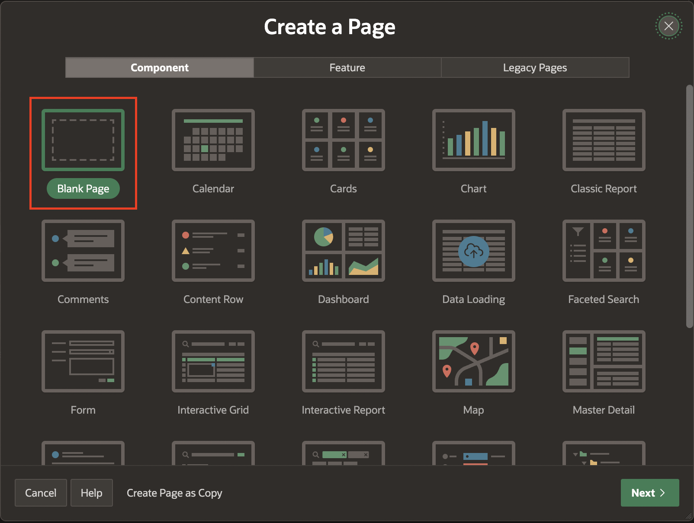

# Create and Manage a Shopping Cart

## Introduction
In this lab, you learn to create and manage a shopping cart within an Oracle APEX application. The lab includes adding navigation bar entry, creating a shopping cart page, implementing various interactive components, and integrating backend processes to handle cart operations and checkout procedures. This exercise will demonstrate the comprehensive capabilities of APEX for building dynamic web applications with a strong emphasis on database interaction and user interface design.

Estimated Time: 15 minutes

### Objectives
In this lab, you will:

- Create a Navigation Bar Entry
- Build a Shopping Cart Page
- Create Application processes
- Create Application Computations

## Task 1: Create a Navigation Bar Entry
In this task, you add an entry to the navigation bar that displays the shopping cart icon and item count dynamically.

1. Navigate to **Shared Components**.

    

2. Under **Navigation and Search**, select **Navigation Bar List**.

   

3. Click **Navigation Bar**.

   

4. Click **Create Entry**.

   

5. Enter the following:

    - Under Entry:

        - Sequence: **4**

        - Image/Class: **&SHOPPING_CART_ICON.**

        - List Entry Label: **Shopping Cart**

    - Under Target:

        - Page: **17**

        - Clear Cache: **17**

    - Under List Entry:

        - Badge Value: **&SHOPPING_CART_ITEMS.**

        - List Item CSS Classes: **js-shopping-cart-item**

    Click **Create List Entry**.

    

    

## Task 2: Build a Shopping Cart Page
In this task, you develop a new page in the application to display the shopping cart with book details, quantities, and prices. Additionally, you implement SQL queries to fetch cart data and display it in a user-friendly format.

1. Navigate to **Application ID**.

    

2. Click **Create Page**.

    

3. Select **Blank Page**.

    

4. In Create Blank Page dialog, enter the following:

    - Under Identification:

       - Name: **Shopping Cart**

       - Page Number: **17**

    - Under Navigation:

       - Use Breadcrumb: **Toggle Off**

       - Use Navigation: **Toggle Off**

     Click **Create Page**.

     

5. In the left pane, Right-click **Body** and select **Create Region**.

     

6. In the Property Editor, enter the following:

    - Under Identification:

        - Title: **Shopping Cart**

        - Type: **Content Row**

    - Under Source:

        - Type: **SQL Query**

        - SQL Query: Copy and Paste the below code into the code editor:

        ```
        <copy>
        SELECT
        b.book_id,
        b.title,
        b.buy_links,
        b.price,
        b.description,
        b.discount,
        b.category,
        b.author,
        b.book_image,
        a.n002 as quantity,
        b.price*((100 - b.discount)/100) as new_price,
        ROUND(b.price*a.n002,2) as total_price,
        ROUND(b.price*((100 - b.discount)/100)*a.n002, 2) as new_total_price
        FROM  apex_collections a, obs_books b
        WHERE collection_name = 'BOOKS'
        AND b.book_id = a.n001
        </copy>
        ```

     

  7. In the right pane, select **Attributes** and enter the following:

    - Under Settings

          - Title: **&TITLE.**

          - Description: Copy and Paste the below code:
          ```
          <copy>
          &DESCRIPTION.
          </br></br>
          <b>Quantity:</b> &QUANTITY. </br>
          <b>Price:</b> <strike> ₹&TOTAL_PRICE.</strike> ₹&NEW_TOTAL_PRICE.
          <span style="color: green;">&DISCOUNT.% Off</span>
          </copy>
          ```

         - Display Avatar: **Toggle On**

    - Under Avatar:

        - Type: **Image**

        - Image: **&BOOK_IMAGE.**

        - Shape: **No shape**

        - Size: **Extra Extra Large**

    - Messages > When No Data Found: **Your shopping cart is empty!**

    

    

8. In Page Rendering, under **Shopping Cart** region, Right-click **Actions** and select **Create Actions**.

    

9. In the Property Editor, enter the following:

    - Under Identification:

         - Position: **Primary Actions**

         - Template: **Button**

         - Label: **Remove**

    - Under Link:

        - Type: **Redirect to URL**

        - Targe: **#action$remove-cart?id=&BOOK_ID.**

        Click **OK**.

    

10. Right-click **Shopping Cart** region and select **Create Page Item**.

    

11. Create the following page item:

    | Name            |  Type   | Value Protected |
    | --------------- |  ------ | --------------- |
    | P17\_BOOK\_ID | Hidden | Toggle Off |


    

12. Select **Page 17: Shopping Cart** and enter the following:

    -  Under Execute when Page loads: Copy and Paste the below code:

    ```
    <copy>
    apex.actions.add([{
    name: "remove-cart",
    action: (event, element, args) => {
        apex.page.submit({
            request: "REMOVE_FROM_CART",
            set: {
                "P17_BOOK_ID": args.id
            },
            showWait: true,
        });
      }
    }]);
    </copy>
    ```

    

13. Right-click **Body** and Select **Create Region**.

    

14. For Name: **Order Information**

    

15. Right-click **Order Information** and select **Create Page Item**.

    

16. Create the following two page items:

    | Name            |  Type   | Label |
    | --------------- |  ------ | --------------- |
    | P17\_ORDER\_ID | Hidden |  |
    | P17\_NO\_OF\_BOOKS |Display Only | Number of Books |
    | P17\_TOTAL | Display Only | Grand Total|

    

    

## Task 3: Implement Page Interactions
In this task, you create buttons for removing items from the cart and proceeding to checkout. Next, you add computations to dynamically calculate the total number of books and the grand total price. Lastle, you set up processes to handle cart operations, such as removing items and clearing the cart.

1. Right-click **P17\_NO\_OF\_BOOKS** and select **Create Computation**.

    

2. In the Property Editor, enter the following:

    - Under Computation:

        - Type: **SQL Query ( returning single value)**

        - SQL Query: Copy and Paste the below code:

          ```
          <copy>
          select sum(a.n002)
          from apex_collections a, obs_books b
          where collection_name = 'BOOKS' and b.book_id(+) = a.n001
          </copy>
          ```

        - Settings > Send On Page Submit: **Toggle off**

          

3.  Right-click **P17\_TOTAL** and select **Create Computation**.

4. In the Property Editor, enter/select the following:

    - Under Computation:

        - Type: **SQL Query ( returning single value)**

        - SQL Query: Copy and Paste the below code:

          ```
          <copy>
          select sum(a.n002)
          from apex_collections a, obs_books b
          where collection_name = 'BOOKS' and b.book_id(+) = a.n001
          </copy>
          ```

          

5. Right-click **Order Information** and select **Create Button**.

    

6. In the Property Editor, enter/select the following:

     - Under Identification:

          - Button Name: **Clear**

          - Label: **Clear Shopping Cart**

     - Layout > Position: **Change**

     - Under Appearance:

          - Button Template: **Text with Icon**

          - Template Options: Click **Template Options** 

               - Size: **Small**

               - Type: **Danger**

               - Style: **Remove UI Decoration**

                   Click **OK**

          - Icon: **fa-cart-empty**

    

7. Right-click **Order Information** and select **Create Button**.

8. In the Property Editor, enter/select the following:

     - Under Identification:

          - Button Name: **Proceed**

          - Label: **Proceed to Purchase**

     - Layout > Position: **Create**

     - Under Appearance:

          - Hot: **Toggle On**

          - Template Options: Click **Template Options** 

               - Size: **Small**

               - Type: **Success**

                   Click **OK**

      - Under Sever-side Condition:

           - Type: **Item is NOT NULL**

           - Item: **SHOPPING\_CART\_ITEMS**

        

        

9. Navigate to **Processing** tab, Right-click **Processing** and select **Create Process**.

      

10. In the Property Editor, enter the following:

     - Under Identification: 

         - Name: **Remove from Cart**

         - Type: **Invoke API**  

     - Under Settings: 

         - Package Name: **OBS\_MANAGE\_ORDERS**

         - Procedure/Function Name: **REMOVE\_BOOK**

     - Under Server-side Condition:

         - Type: **Request=Value**

         - Value: **REMOVE\_FROM\_CART**

           

11. Under **Remove from Cart** process, expand **Parameters** and select **p\_book**.

     - p\_book > Item: **P17\_BOOK\_ID**

    

12. Right-click **Processing** and select **Create Process**.

      

13. In the Property Editor, enter the following:

     - Under Identification: 

         - Name: **Checkout**

         - Type: **Invoke API**  

     - Under Settings: 

         - Package Name: **OBS\_MANAGE\_ORDERS**

         - Procedure/Function Name: **CREATE\_ORDER**

     - Success Message > Success Message: **Order successfully created: &P17\_ORDER\_ID.**

     - Server-side Condition > When Button Pressed: **Proceed**

    

14. Under **Checkout** process, expand **Parameters** and update the following:

      | Parameter       |  Type   | Item |
      | --------------- |  ------ | --------------- |
      | p\_user\_id | Item | USER\_ID |
      | p\_order\_id | Item | P17\_ORDER\_ID |

    

## Task 4: Integrate Backend Processes  
In this task, you create page processes to invoke PL/SQL procedures to manage cart actions and handle order creation and use server-side conditions and parameters to ensure smooth and secure cart management.

1. Right-click **Processing** and select **Create Process**.

    

2. In the Property Editor, enter the following:

     - Under Identification: 

         - Name: **Clear Shopping Cart**

         - Type: **Invoke API**  

     - Under Settings: 

         - Package Name: **OBS\_MANAGE\_ORDERS**

         - Procedure/Function Name: **CLEAR\_CART**

     - Server-side Condition > When Button Pressed: **Clear**

     

3. Right-click **Processing** and select **Create Branch**.

     

4. In the Property Editor, enter the following:

     - Identification > Name: **Go To Books**

     - Behavior > Target: Click **No Defined Link**
          - Page: 10

          - Set Items > Name: **P17\_ORDER\_ID** and Value: **&P17\_ORDER\_ID.**

          - Clear Cache: **10**

          Click **OK**.

     - Server-side Condition > When Button Pressed: **Clear**

     

5. Right-click **Processing** and select **Create Branch**.

     

6. In the Property Editor, enter the following:

     - Identification > Name: **Go To Orders**

     - Behavior > Target: Click **No Defined Link**
          - Page: 16

          - Set Items > Name: **P17\_ORDER\_ID** and Value: **&P17\_ORDER\_ID.**

          - Clear Cache: **16**

          Click **OK**.

     - Server-side Condition > When Button Pressed: **Proceed**

     

7. Click **Save and Run**.

## Task 3: Run an Application

1. Navigate to **Search Books** and Select any book of your choice to buy.

    

2. Click **Add to Cart**.

    

3. On the Navigation bar list, select **Shopping Cart**.

    

5. Now, you see the shopping cart page.

    

## Summary
In this lab, you successfully integrated a shopping cart feature into an Oracle APEX application. You created a navigation bar entry for the shopping cart, developed a detailed shopping cart page, and implemented interactive elements for managing cart items. Additionally, you set up backend processes to handle cart operations and order creation, demonstrating how to leverage APEX's capabilities for building dynamic, database-driven web applications. This hands-on experience enhanced your skills in PL/SQL, SQL queries, and APEX page design and process integration.

You are now ready to move on to the next lab!

## Acknowledgements

- **Author**: Ankita Beri, Product Manager
- **Last Updated By/Date**: Ankita Beri, Product Manager, May 2024
