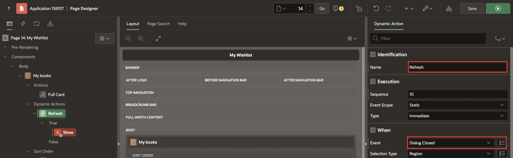
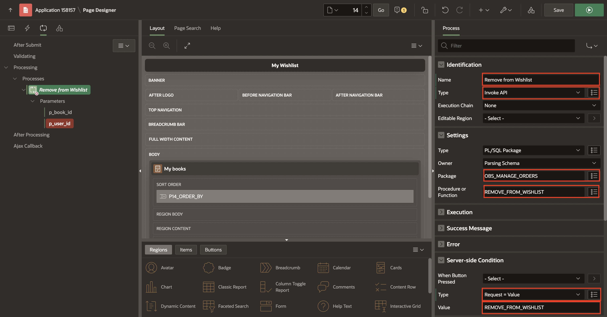
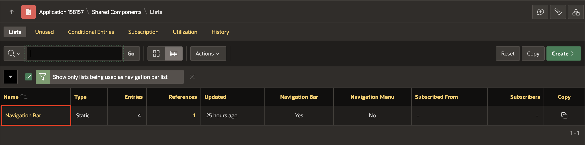

# Create and Manage Wishlist Functionality

## Introduction

This lab provides step-by-step instructions on how to create and manage a wishlist feature in Oracle APEX. You will learn to create a new page for the wishlist, add interactive components, and integrate navigation elements. The process includes creating dynamic regions, defining actions, and setting up processes for adding and removing items from the wishlist. Additionally, you will enhance the navigation bar to include a wishlist link for easy access.

Estimated Time: 15 minutes

### Objectives

In this lab, you will:

- Create a Wishlist Page.
- Add Dynamic Actions to refresh the wishlist content and handle interactions such as adding and removing items.
- Create Buttons to add and remove books from the wishlist, including the necessary backend processes.
- Update Navigation Bar to include a link to the wishlist page.

## Task 1: Create My Wishlist page

1. On Page Designer toolbar, Navigate to (+ v) and Select **Page**.

    

2. Select **Blank Page**.

    

3. In Create Blank Page dialog, enter/select the following:

    - Under Identification:

        - Page Number: **14**

        - Name: **My Wishlist**

    - Under Navigation:

        - Use Breadcrumb: **Toggle Off**

        - Use Navigation: **Toggle Off**

    Click **Create Page**.

   

4. In the left pane, right-click **Body** and Select **Create Region**.

    

5. In the Property Editor, enter/select the following:

    - Under Identification:

        - Title: **My books**

        - Type: **Cards**

    - Under Source:

        - Type: **SQL Query**

        - SQL Query: Copy and Paste the below code into the code editor:

            ```
            <copy>
            SELECT
            oi.book_id,
            bi.author,
            bi.book_image,
            bi.title,
            bi.description,
            bi.discount,
            Round(bi.price,2) as price,
            ROUND(bi.price * ((100 - bi.discount) / 100), 2) as new_price
                FROM obs_wishlist oi, obs_books bi
                WHERE oi.user_id = :USER_ID AND oi.book_id(+) = bi.book_id;
        </copy>
        ```

        - **Order By Item**: Enter/select the following:

            | Clause     |  Key   | Display |
            | ---------- |  ------ | ------ |
            | "TITLE"asc | TITLE |  Title |
            | "PRICE"asc | PRICE | Price |

            Click **OK**.


    

    

6. In the Property Editor, navigate to **Attributes** and enter/ select the following:

    - Appearance > Grid Columns: **5 Columns**

    - Card > Primary Key Column 1: **BOOK_ID**

    - Title > Column: **TITLE**

    - Under Body:

        - Advanced Formatting: **Toggle On**

        - HTML Expression: Copy and Paste the below HTML code:
        ```
       <copy>
       <div>
       <b>Author:</b> &AUTHOR.
       </div>

       <div>
       <b>Price:</b> <strike>₹&PRICE.</strike> ₹&NEW_PRICE.
       </div>

       <div >
       <b>Discount:</b> <span style="color: green;">&DISCOUNT.% Off</span>
       </div>
       </copy>
       ```
    - Under Media:

        - Source: **Image URL**

        - URL: **&BOOK_IMAGE.**

        - Image Description: **&DESCRIPTION.**

    

    

7. Under **My Books** region, right-click **Actions** and click **Create Action**.

    

8. In the Property Editor, enter/select the following:

    - Identification > Type: **Full Card**

    - Link > Target: Click **No Link Defined**

        - Target > Page: **18**

        - Set Items > Name: **P18\_BOOK\_ID** and Value: **&BOOK\_ID.**

        -  Clear/Reset > Clear Cache: **18**

        Click **OK**.

    

9. Right-click **My Books** region and click **Create Page Item**.

    

10. In the Property editor, enter/select the following:

    - Under Identification

        - Name: **P14\_BOOK\_ID**

        - Type: **Hidden**

    - Settings > Value protected: **Toggle Off**

    

11. Right-click **My Books** region and click **Create Dynamic Action**.

    

12. In the Property editor, enter/select the following:

    - Identification > Name: **Refresh**

    - When > Event: **Dialog Closed**

    

13. Select **TRUE** action and enter/select the following:

    - Identification > Action: **Refresh**

    - Under Affected Elements:

        - Selection Type: **Region**

        - Region: **My Books**

    

14. Navigate to **Processing** tab, right-click **Processing** and click **Create Process**.

    

15. In the Property editor, enter/select the following:

     - Under Identification:

        - Name: **Remove from Wishlist**

        - Type: **Invoke API**
          
     - Under Settings : 

        - Package Name: **OBS\_MANAGE\_ORDERS**

        - Procedure/Function Name: **REMOVE\_FROM\_WISHLIST**

     - Under Server-side condition:

        - Type: **Request=Value**

        - Value: **REMOVE\_FROM\_WISHLIST**

      

16. Under **Remove from Wishlist** process, expand parameters and enter/select the following:

     | Parameter     |  Type   | Item |
     | ---------- |  ------ | ------ |
     | p\_book\_id | Item |  P14\_BOOK\_ID |
     | p\_user\_id| Item | USER\_ID |

    

17. Click **Save**.

## Task 2: Add Wishlist Management Buttons on Page 18

1. Navigate to Page **18**.

2. In the left pane, right-click **Buttons Bar** and click **Create Button**.

3. In the Property Editor, enter/select the following:

    - Under Identification:

        - Button Name: **Add\_to\_Wishlist**

        - Label: **Add to Wishlist**

    - Layout > Slot: **Next**

    - Under Appearance:

        - Button Template: **Text with Icon**

        - HOT: **Toggle On**

        - Template Options: Click **Use Template Defaults**

            - Type: Primary

            - Style: Simple

            Click Ok

        - Icon: **fa-heart-o**

    - Under Server-side Condition:

        - Type: **No rows returned**

        - SQL Query: Copy and Paste the below code into the code editor:
    ```
    <copy>
    select * from obs_wishlist where user_id = :user_id AND
    book_id = :P18_BOOK_ID
    </copy>
    ```

    - Under Security > Authorization Scheme: **Must Not Be Public User**

4. Right-click **Buttons Bar** and click **Create Button**.

5. In the Property Editor, enter/select the following:

    - Under Identification:

        - Button Name: **Remove\_from\_Wishlist**

        - Label: **Remove from Wishlist**

    - Under Layout > Slot: **Next**

    - Under Appearance:

        - Button Template: **Text with Icon** 

        - Icon: **fa-heart**

    - Under Behavior > Database Action: **SQL DELETE Action**

    - Under Server-side Condition:

        - Type: **Rows returned**

        - SQL Query: Copy and Paste the below code:
    ```
    <copy>
    select * from obs_wishlist where user_id = :user_id
    AND book_id = :P18_BOOK_ID
    </copy>
    ```

    - Under Security > Authorization Scheme: **Must Not Be Public User**

6. Navigate to **Processing** tab, right-click **Processing** and select **Create Process**.

7. In the Property Editor, enter/select the following:

    - Under Identification:

        - Name: **Add to Wishlist**

        - Type: **Invoke API**

    - Under Settings:

        - Package: **OBS\_MANAGE\_ORDERS**

        - Procedure or Function: **ADD\_TO\_WISHLIST**

    - Under Success Message > Success Message: **Successfully added to Wishlist!**

    - Under Error Message > Error Message: **Error adding to Wishlist!**

    - Under Server-side Condition > When button pressed: **Add\_to\_Wishlist**

8. Under **Add to Wishlist**, expand parameters and enter/select the following:

    - p\_book\_id > Under Value > Type: **Item**,  Item: **P18\_BOOK\_ID**

    - p\_user\_id > under value > Type: **Item**,  Item: **USER\_ID**

9. Right-click **Processing** and Click **Create Process**.

10. In the Property Editor, enter/select the following:

    - Under Identification:

        - Name: **Remove from Wishlist**

        - Type: **Invoke API**

    - Under Settings:

        - Package: **OBS\_MANAGE\_ORDERS**

        - Procedure or Function: **REMOVE\_FROM\_WISHLIST**

    - Under Server-side condition > When button pressed: **Remove\_from\_Wishlist**

11. Under **Remove From Whislist**, expand parameters and enter/select the following:

    - p\_book\_id > Under Value > Type: **Item**,  Item: **P18\_BOOK\_ID**

    - p\_user\_id > under value > Type: **Item**,  Item: **USER\_ID**

12. Drag and drop **Close Dialog** after **Remove from Wishlist** Process.

13. Click Save.

## Task 3: Create an entry in Navigation Bar List

1. Navigate to **Shared Component**.

    

2. Under Navigation and Search, click **Navigation Bar List**.

    

3. Click **Navigation Bar**.

    

4. Click **Create Entry**.

    

5. Enter/select the following:

    - Under Entry:

        - Sequence: **2**

        - Image/Class: **fa-heart**

        - List Entry Label: **My Wishlist**

    - Target > Page: **14**

      Click **Create List Entry**.

  

6. Click Save and Run.

## Summary
In this lab, you successfully created a wishlist page. You designed a dynamic region to display books in the wishlist, added buttons for managing the wishlist, and implemented backend processes to handle wishlist modifications. Furthermore, you updated the navigation bar to include a link to the wishlist, ensuring easy access for users. This comprehensive exercise demonstrates how to integrate advanced functionalities into an Oracle APEX application, enhancing its usability and interactivity.

You are now ready to move on to the next lab!

## Acknowledgements

- **Author**: Pankaj Goyal, Member Technical Staff; Ankita Beri, Product Manager
- **Last Updated By/Date**: Pankaj Goyal, Member Technical Staff, Aug 2024
