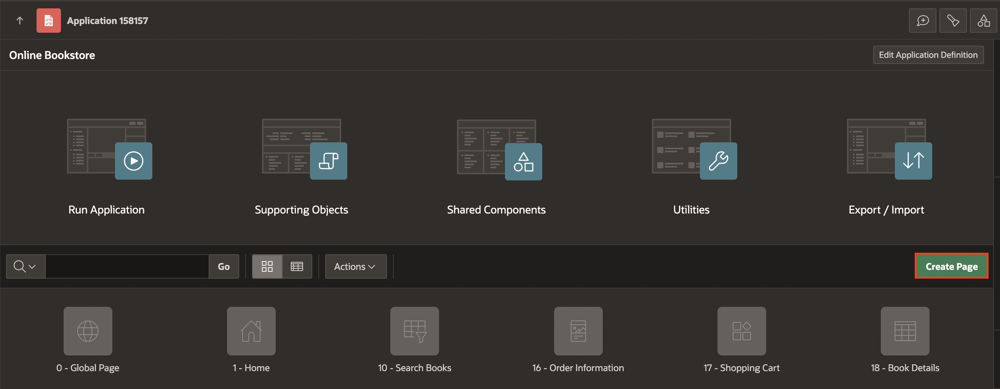
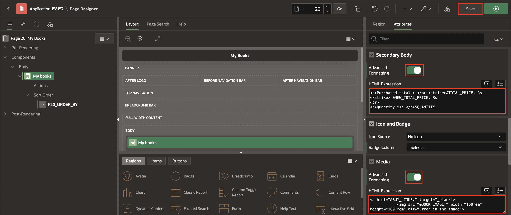

# Create Book Order Information Page

## Introduction

In this lab, you will learn how to create and manage an "Order Information" page and a "My Books" page within Oracle APEX. These pages will display relevant order details and a list of purchased books, respectively. By the end of this lab, you will have a functional interface that allows users to view their order information and their purchased books seamlessly.

Estimated Time: 15 minutes

### Objectives

In this lab, you will:

- Create an Order Information Page.

## Task 1: Create an Order Information Page

In this task, you will set up a new page for displaying order information. Furthermore, you will add regions and sub-regions to structure the order details. Lastly, you configure SQL queries to fetch and display order data.

1. On Page Designer toolbar, Navigate to (+ v) and Select **Page**.

    

2. Select **Blank Page**.

    

3. In Create Blank Page dialog, enter/select the following:

    - Under Identification:

        - Page Number: **16**

        - Name: **Order Information**

    - Under Navigation:

        - Use Breadcrumb: **Toggle Off**

        - Use Navigation: **Toggle Off**

    Click **Create Page**.

  

4. In the left pane, Right-click **Body** and Select **Create Region**.

    

5. In the Property Editor, enter/select the following:

    - Identification > Title: **Thank You for purchasing!**

    - Under Appearance:

        - Template: **Content Block**

        - Template Options > Click **Template Options**: Check **Show Region Icon**.

        Click **OK**.

  

6. Right-click **Thank You for purchasing!** and select **Create Page Item**.

    

7. In the Property Editor, enter/select the following:

    - Under Identification:

         - Name: **P16\_ORDER\_ID**

         - Type: **Hidden**

    

8. Right-click **Thank You for purchasing!** and select **Create Sub Region**.

    

9. In the Propert Editor, enter the following:
    - Identification > Title: **Order Id: &P16\_ORDER\_ID.**

    

10. Right-click **Order: &P16_ORDER.** and select **Create Sub Region**.

    

11. In the Property editor, enter/select the following:

    - Under Identification:

        - Title: **Order Details**

        - Type: **Classic Report**

    - Under Source:

        - Type: **QL Query**

        - SQL Query: Copy and Paste the below code into the code editor:

       ```
      <copy>
      SELECT 'Transaction Successful' as transaction_status,
      o.order_id,
      o.user_id,
      o.payment_id,
      SUM(i.price* ((100-i.discount)/100) * i.quantity) AS total,
      sum(i.quantity) AS quantity,
      TO_CHAR(i.added_date, 'DD MON YYYY') as added_date,
      TO_CHAR(i.added_time, 'HH12:MI:SS AM') || ' IST'  AS added_time
      FROM   obs_orders o
      LEFT JOIN obs_order_items i
      ON o.order_id = i.order_id
      WHERE  o.order_id = :P16_ORDER_ID
      GROUP BY o.order_id, o.user_id,o.payment_id, i.added_date,i.added_time;
      </copy>
      ```

    

12. Under **Order Details** region, expand columns and update the following:

     | Column Name       |  Type   |
     | ---------- |  ------ |
     | USER\_ID | Hidden |
     | ORDER\_ID |Hidden |
     | PAYMENT\_ID | Hidden|

    

     | Column Name       |  Heading   |
     | ---------- |  ------ |
     | TOTAL | Total Amount |
     | ADDED_DATE | Purchased Date |
     | ADDED_TIME | Purchased Time|

    

13. In the Property Editor, navigate to **Attributes** and enter/select the following:

    - Appearance > Template: **Value Attribute Pair - Column**

    - Pagination > Type: **No Pagination (show All rows)** 

    

14. In the left pane, Right-click **Order Id: &P16\_ORDER\_ID.** region and select **Create Sub Region**.

    

15. In the Property Editor , enter/select the following:

    - Under Identification:

        - Title: **Items**

        - Type: **Cards**

    - Under Source:

        - Type: **SQL Query**

        - SQL Query: Copy and Paste the below code into the code editor:

        ```
       <copy>
       SELECT b.title,
            o.book_id,
            o.price,
            (o.price) Subtotal,
            b.book_image,
            b.buy_links,
            o.quantity,
            o.price*((100-b.discount)/100) *o.quantity as   total_price
     FROM obs_order_items o, obs_books b
     WHERE b.book_id = o.book_id
     AND  o.order_id = :P16_ORDER_ID
     </copy>
     ```
    

16. In the Property Editor, navigate to **Attributes** and enter/select the following:

    - Appearance > Layout: **Float**
     
    - Card > Primary key column 1: **BOOK_ID**

    - Title > Column: **TITLE**

    - Under Secondary Body:
        - Advanced Formatting: **Toggle On**
        - HTML Expression: Copy and Paste the below HTML code:
        ```
       <copy>
      <b>Purchased Price: </b>&TOTAL_PRICE. Rs <br>
      <b>Quantity : </b> &QUANTITY.
      </copy>
      ```

    - Under Media:
        - Advanced Formatting: **Toggle On**
        HTML Expression: Copy and Paste the below HTML code:
        ```
        <copy>
       <a href="&BUY_LINKS." target="_blank">
       
       </copy>
       ```
        - Position: **First**

    

    

17. Click **Save**.

## Task 2: Add Navigation Bar Entry
In this task, you create a navigation bar entry labeled "My Books" to facilitate easy access to the books page.

1. Navigate to **Shared Components**.

    

2. Under **Navigation and Search**, Click **Navigation Bar List**.

    

3. Click **Navigation Bar**.

    

4. Click **Create Entry**.

    

5. Enter/select the following:

    - Under Entry:

       - Sequence: **3**

       - Image/Class: **fa-book**

       - List Entry Label: **My Books**

    - Target > Page: **20**

    Click **Create List Entry**.

    

## Task 3: Create My Books Page
In this task, you set up a new page for displaying a list of books purchased by the user. Also, you add a region to the page and configure it to display book details using SQL queries.

1. On Page Designer toolbar, Navigate to (+ v) and Select **Page**.

    

2. Select **Blank Page**.

    

3. In Create Blank Page dialog, enter/select the following:

    - Under Identification:

        - Page Number: **20**

        - Name: **My Books**

    - Under Navigation:

        - Use Breadcrumb: **Toggle Off**

        - Use Navigation: **Toggle Off**

    Click **Create Page**.

   

4. In the left pane, Right-click **Body** and Select **Create Region**.

    

5. In the Property Editor, enter/select the following:

    - Under Identification:

        - Title: **My books**

        - Type: **Cards**

    - Under Source:

        - Type: **QL Query**

        - SQL Query: Copy and Paste the below code into the code editor:

        ```
        <copy>
        select  distinct
         oi.book_id as book_id,
         bi.book_image as book_image,
         bi.buy_links as buy_links,
         bi.title as title,
         Round(oi.price,2) as price,
         bi.description as description,
         bi.discount,
         sum(oi.quantity) OVER (PARTITION BY oi.book_id) AS quantity,
         Round((oi.price * SUM(oi.quantity) OVER (PARTITION BY oi.book_id)),2) AS total_price,
         Round((oi.price *((100- oi.discount)/100) * SUM(oi.quantity) OVER (PARTITION BY oi.book_id)),2) AS new_total_price
       from obs_order_items oi, obs_books bi, obs_orders o
       where o.order_id = oi.order_id and o.user_id = :USER_ID
       and oi.book_id(+) = bi.book_id;
       </copy>
       ```

    

       - **Order By Item**: Enter/select the following:

       | Clause     |  Key   | Display |
       | ---------- |  ------ | ------ |
       | "TITLE"asc | TITLE |  Title |
       | "TOTAL_PRICE"asc |TOTAL_PRICE | Price |
       | "QUANTITY"asc  | QUANTITY | Quantity |

       Click **OK**.

    

6. In the Property Editor, navigate to **Attributes** and enter/ select the following:

    - Appearance > Layout: **Float**

    - Card > Primary Key Column 1: **BOOK_ID**

    - Title > Column: **TITLE**

    - Under Secondary Body:

        - Advanced Formatting: **Toggle On**

        - HTML Expression: Copy and Paste the below HTML code:
        ```
       <copy>
       <b>Purchased total : </b> <strike>&TOTAL_PRICE. Rs </strike> &NEW_TOTAL_PRICE. Rs
       <br>
       <b>Quantity is: </b>&QUANTITY.
       </copy>
       ```
    - Under Media:

        - Advanced Formatting: **Toggle On**

        - HTML Expression: Copy and Paste the below HTML code:
           ```
           <copy>
           <a href="&BUY_LINKS." target="_blank">
           
          </copy>
          ```

     

     

7. **Save and Run** the Application.

    

## Summary
In this lab, you successfully learned the process of creating a structured and user-friendly Order Information page and My Books page in Oracle APEX. By following these steps, you will learn how to use Oracle APEX's Page Designer, create regions and sub-regions, write SQL queries to fetch data, and configure navigation bar entries to improve the user experience.

You are now ready to move on to the next lab!

## Acknowledgements

- **Author**: Ankita Beri, Product Manager
- **Last Updated By/Date**: Ankita Beri, Product Manager, May 2024
