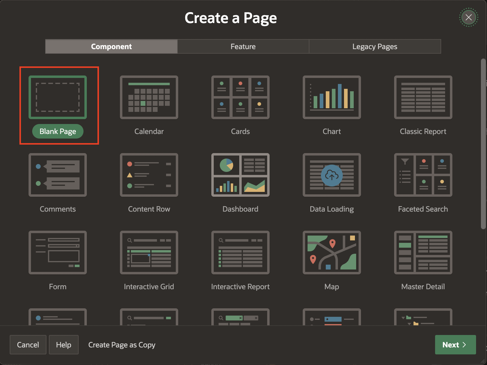

# Create Book Order Information Page

## Introduction
In this lab, you will create a package with procedures and functions that collectively manage the process of adding, removing, and processing orders and wishlist items within the database application. Additionally, you will learn to create application items, processes, and computations. Moreover, you will create processes to invoke these procedures and functions.

Estimated Time: 5 minutes

### Objectives
In this lab, you will:

- Create an Order Information Page.

## Task 1: Create an Order Information Page

1. On Page Designer toolbar, Navigate to (+ v) and Select **Page**.

    

2. Select **Blank Page**.

    

3. In Create Blank Page dialog, enter/select the following:

    - Under Identification:

        - Page Number: **16**

        - Name: **Order Information**

    - Under Navigation:

        - Use Breadcrumb: **Toggle Off**

        - Use Navigation: **Toggle Off**

    Click **Create Page**.

  

4. In the left pane, Right-click **Body** and Select **Create Region**.

    

5. In the Property Editor, enter/select the following:

    - Identification > Title: **Thank You for purchasing!**

    - Under Appearance:

        - Template: **Content Block**

        - Template Options > Click **Template Options**: Check **Show Region Icon**.

        Click **OK**.

  

6. Right-click **Thank You for purchasing!** and select **Create Page Item**.

    

7. In the Property Editor, enter/select the following:

    - Under Identification:

         - Name: **P16_ORDER_ID**

         - Type: **Hidden**

             

8. Right-click **Thank You for purchasing!** and select **Create Sub-Region**.

    

9. In the Propert Editor, enter the following:
    - Identification > Title: **Order Id: &P16_ORDER_ID.**

    

10. Right-click **Order: &P16_ORDER.** and select **Create Sub Region**.

    

11. In the Property editor, enter/select the following:

    - Under Identification:

        - Title: **Order Details**

        - Type: **Classic Report**

    - Under Source:

        - Type: **QL Query**

        - SQL Query: Copy and Paste the below code into the code editor:

       ```
      <copy>
      SELECT 'Transaction Successful' as transaction_status,
      o.order_id,
      o.user_id,
      o.payment_id,
      SUM(i.price* ((100-i.discount)/100) * i.quantity) AS total,
      sum(i.quantity) AS quantity,
      TO_CHAR(i.added_date, 'DD MON YYYY') as added_date,
      TO_CHAR(i.added_time, 'HH12:MI:SS AM') || ' IST'  AS added_time
      FROM   obs_orders o
      LEFT JOIN obs_order_items i
      ON o.order_id = i.order_id
      WHERE  o.order_id = :P16_ORDER_ID
      GROUP BY o.order_id, o.user_id,o.payment_id, i.added_date,i.added_time;
      </copy>
      ```

    

12. Under **Order Details** region, expand columns and update the following:

     | Column Name       |  Type   |
     | ---------- |  ------ |
     | USER\_ID | Hidden |  
     | ORDER\_ID |Hidden |
     | PAYMENT\_ID | Hidden|

    

     | Column Name       |  Heading   |
     | ---------- |  ------ |
     | TOTAL | Total Amount |  
     | ADDED_DATE | Purchased Date |
     | ADDED_TIME | Purchased Time|

    

13. In the Property Editor, navigate to **Attributes** and enter/select the following:

    - Appearance > Template: **Value Attribute Pair - Column**

    - Pagination > Type: **No Pagination (show All rows)** 

    

14. In the left pane, Right-click **Order Id: &P16_ORDER_ID.** region and select **Create Sub Region**.

    

15. In the Property Editor , enter/select the following:

    - Under Identification:

        - Title: **Items**

        - Type: **Cards**

    - Under Source:

        - Type: **SQL Query**

        - SQL Query: Copy and Paste the below code into the code editor:

        ```
       <copy>
       SELECT b.title,
            o.book_id,
            o.price,
            (o.price) Subtotal,
            b.book_image,
            b.buy_links,
            o.quantity,
            o.price*((100-b.discount)/100) *o.quantity as   total_price
     FROM obs_order_items o, obs_books b
     WHERE b.book_id = o.book_id
     AND  o.order_id = :P16_ORDER_ID
     </copy>
     ```
    

16. In the Property Editor, navigate to **Attributes** and enter/select the following:

    - Appearance > Layout: **Float**
     
    - Card > Primary key column 1: **BOOK_ID**

    - Title > Column: **TITLE**

    - Under Secondary Body:
        - Advanced Formatting: **Toggle On**
        - HTML Expression: Copy and Paste the below HTML code:
        ```
       <copy>
      <b>Purchased Price: </b>&TOTAL_PRICE. Rs <br>
      <b>Quantity : </b> &QUANTITY.
      </copy>
      ```

    - Under Media:
        - Advanced Formatting: **Toggle On**
        HTML Expression: Copy and Paste the below HTML code:
        ```
        <copy>
       <a href="&BUY_LINKS." target="_blank">
       
       </copy>
       ```
        - Position: **First**

    

    

17. Click **Save**.
