# Enhance Book Details Page

## Introduction
In this lab, you will create a package with procedures and functions that collectively manage the process of adding, removing, and processing orders and wishlist items within the database application. Additionally, you will learn to create application items, processes, and computations. Moreover, you will create processes to invoke these procedures and functions.

Estimated Time: 15 minutes

### Objectives
In this lab, you will:

- Create a Package to manage process of adding, removing, and processing orders and wishlist items.
- Create Application Items
- Create Application processes
- Create Application Computations

## Task 1: Create Page Items

1. Click **Application ID**.

    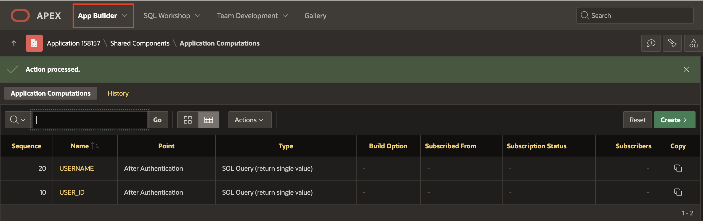

2. On the Workspace home page, Select **18: Book Details** page.

    

3. In the left pane, Right-click **Buttons Bar** and click **Create Page Item**.

    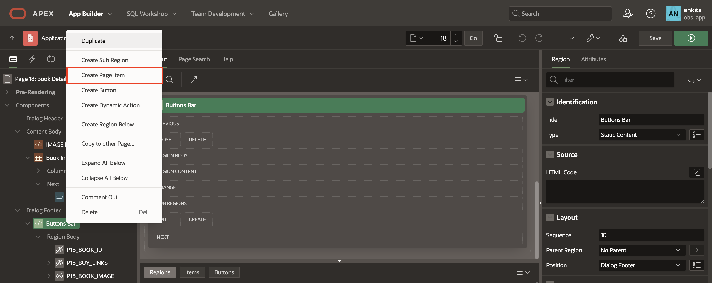

4. Create the following three page items, one after the other:

    | Name            |  Type   |
    | --------------- |  ------ |
    | P18\_SHOPPING\_CART_ITEMS | Hidden |
    | P18\_BOOK\_IN\_CART | Hidden |
    | P18\_QUANTITY | Select List  |

    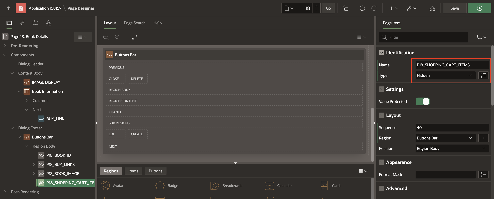

5. In the Property Editor, update the following:

   - Appearance > Template: **Required - Floating**

   - Under List of Values:

      - Type: SQL Query

      - SQL Query: Copy and Paste the below code:

      ```
      <copy>
      WITH list_of_numbers(Num) AS (
        SELECT 1
        FROM dual
        UNION ALL
        SELECT Num+1
        FROM list_of_numbers
        WHERE Num < (SELECT book_quantity FROM obs_books WHERE book_id = :P18_BOOK_ID)
      )

      SELECT Num as d, Num as r
      FROM list_of_numbers;
      </copy>
      ```
      - Display Extra Values: **Toggle Off**

      - Display Null Value: **Toggle Off**

      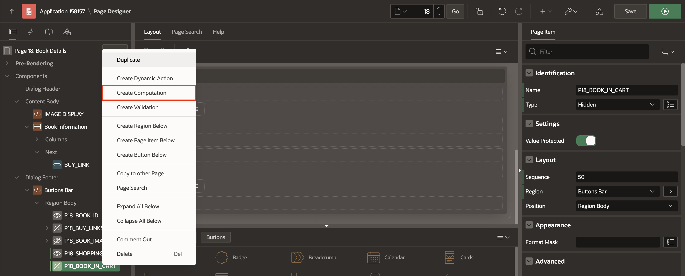


6. Right-click **P18\_BOOK\_IN\_CART** and Click **Create Computation**.

    

7. In the Property editor, update the following:

    - Under Computation:

        - Type: **Function Body**

        - PL/SQL Function Body: Copy and paste the below code:

         ```
         <copy>
         RETURN obs_manage_orders.book_exists(p_book => :P18_BOOK_ID);
         </copy>
         ```

    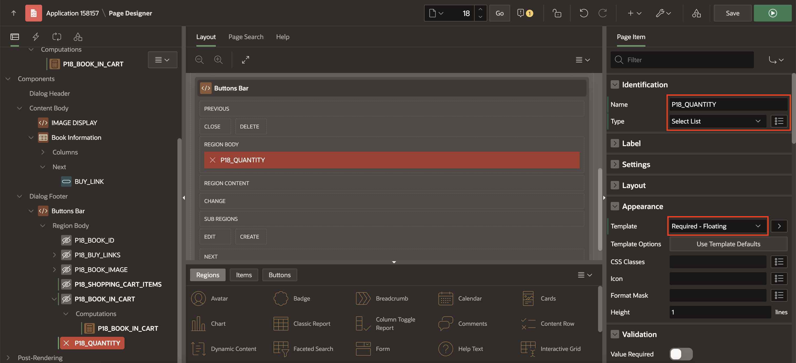

    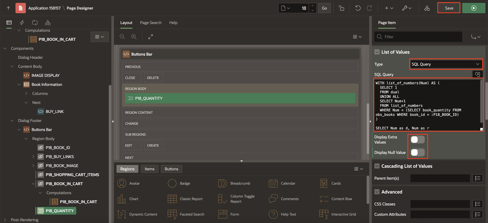


## Task 2: Create Buttons

1. In the left pane, Right-click **Buttons Bar** and Click **Create Button**.

    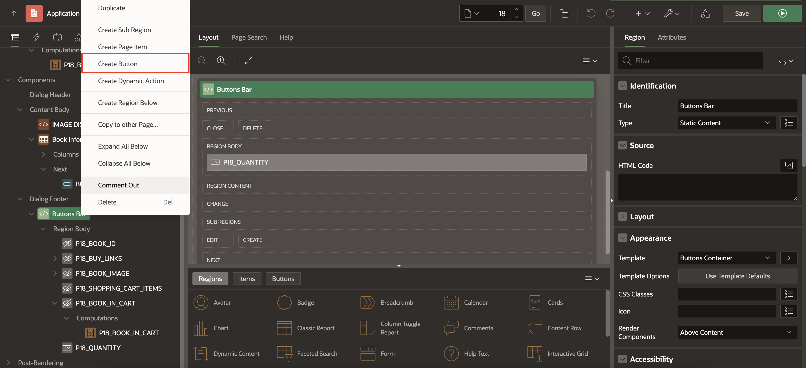

2. In the Property Editor, update the following:

    - Under Identification:

        - Name: **Add_to_Cart**

        - Label: **Add To Cart**

    - Layout > Position: **Next**

    - Appearance > Hot: **Toggle Off**

    - Under Server-Side Condition:

        - Type: **Item is zero**

        - Item: **P18\_BOOK\_IN\_CART**

      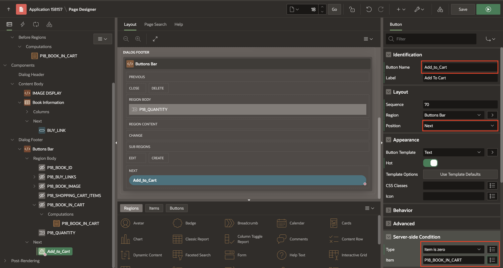

3. Right-click **Buttons Bar** and Click **Create Button**.

4. In the Property Editor, update the following:

    - Under Identification:

        - Name: **Remove_from_Cart**

        - Label: **Remove From Cart**

    - Layout > Position: **Edit**

    - Appearance > Click **Template Options**

        - Type: **Danger**

        - Spacing Right: **Large**

        Click **OK**.

    - Under Server-Side Condition:

        - Type: **Item is NOT zero**

        - Item: **P18\_BOOK\_IN\_CART**

      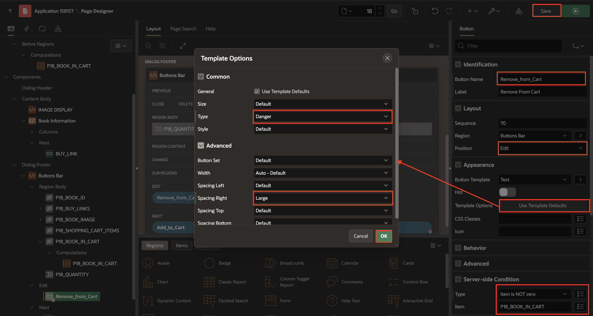

## Task 3: Create Processes

1. Navigate to the **Processing** tab. Right-click **Processing** and Click **Create Process**.

    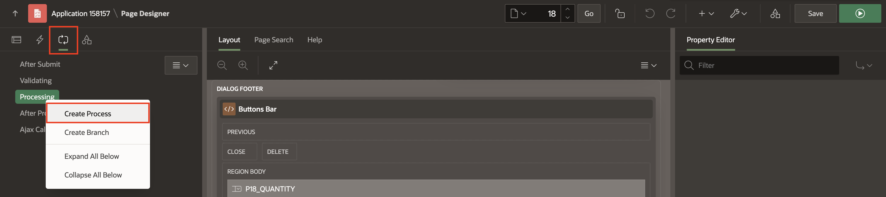

2. In the Property Editor, update the following:

    - Under Identification:

        - Name: **Add product**

        - Type: **Invoke API**

    - Under Settings

        - Package: **OBS_MANAGE_ORDERS**

        - Procedure or Function: **ADD_BOOK**

    - Server-side Condition > When button pressed: **Add_to_cart**

    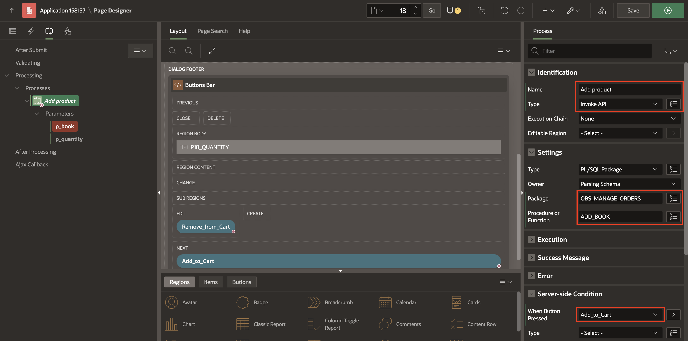

3. Expand the Parameters of **Add Product** and enter the following:

      | Parameter |  Type   | Item |
      | --------- |  ------ | ---- |
      | p\_book | Item | P18\_BOOK\_ID |
      | p\_quantity | Item | P18\_QUANTITY |

      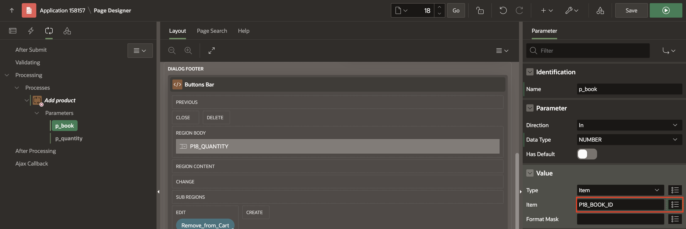

      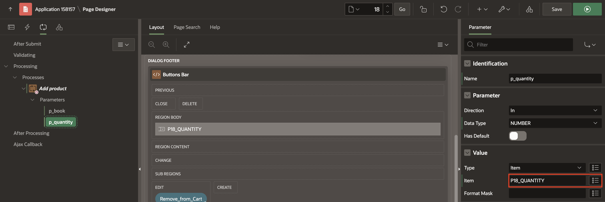

4. Right-click **Processing** and Click **Create Process**.

5. In the Property Editor, update the following:

    - Under Identification:

        - Name: **Delete product**

        - Type: **Invoke API**

    - Under Settings

        - Package: **OBS_MANAGE_ORDERS**

        - Procedure or Function: **REMOVE_BOOK**

    - Server-side Condition > When button pressed: **Remove_from_cart**

    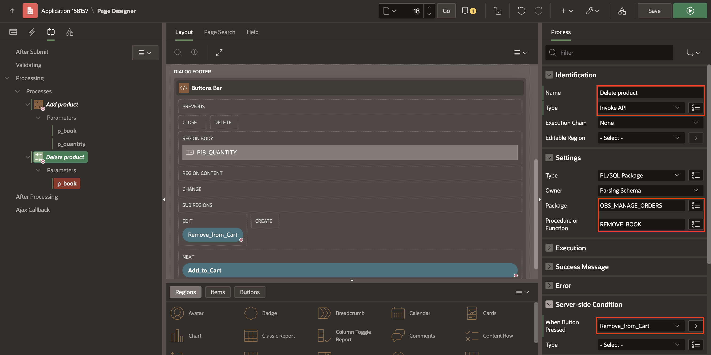

6. Expand the Parameter of **Delete Product** and enter the following:

      | Parameter |  Type   | Item |
      | --------- |  ------ | ---- |
      | p\_book | Item | P18\_BOOK\_ID |

      

7. Right-click **Processing** and Click **Create Process**.

8. In the Property Editor, update the following:

    - Under Identification:

        - Name: **Calculate Shopping Cart Items**

        - Type: **Invoke API**

    - Under Settings

        - Package: **OBS_MANAGE_ORDERS**

        - Procedure or Function: **GET_QUANTITY**

    - Server-side Condition > When button pressed: **Remove_from_cart**

    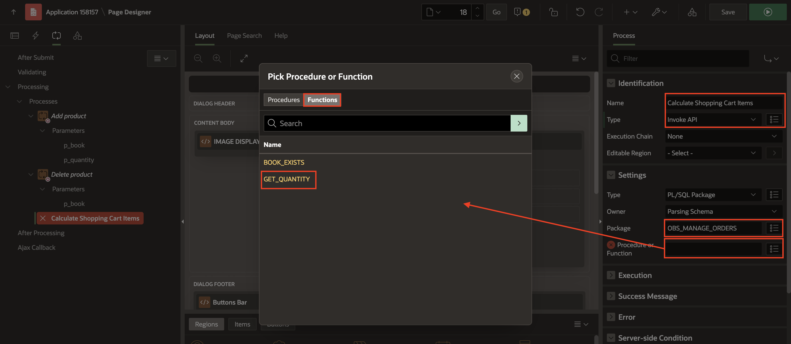

9. Expand the Parameter of **Calculate Shopping Cart Items** and enter the following:

      | Parameter |  Type   | Item |
      | --------- |  ------ | ---- |
      | Function Result | Item | P18\_SHOPPING\_CART\_ITEMS |

      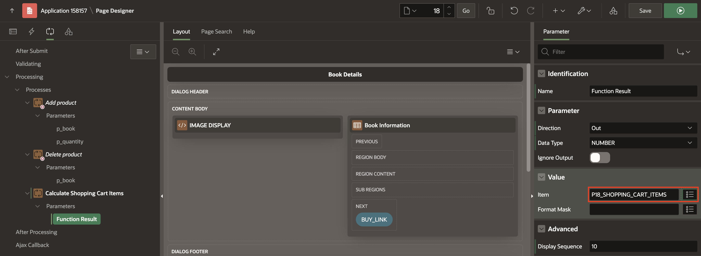

10. Right-click **Processing** and Click **Create Process**.

11. In the Property Editor, update the following:

    - Under Identification:

        - Name: **Close Dialog**

        - Type: **Close Dialog**

    - Under Settings > Item to return: **P18\_SHOPPING\_CART_ITEMS, P18\_BOOK\_ID**

    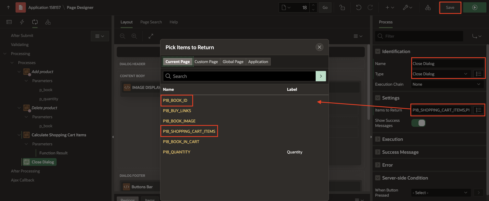

12. Click **Save**.

## Summary

You've learned how to create package, application items, application process and application computations. Ready to move on to the next lab!

## Acknowledgements

- **Author**: Ankita Beri, Product Manager
- **Last Updated By/Date**: Ankita Beri, Product Manager, May 2024
