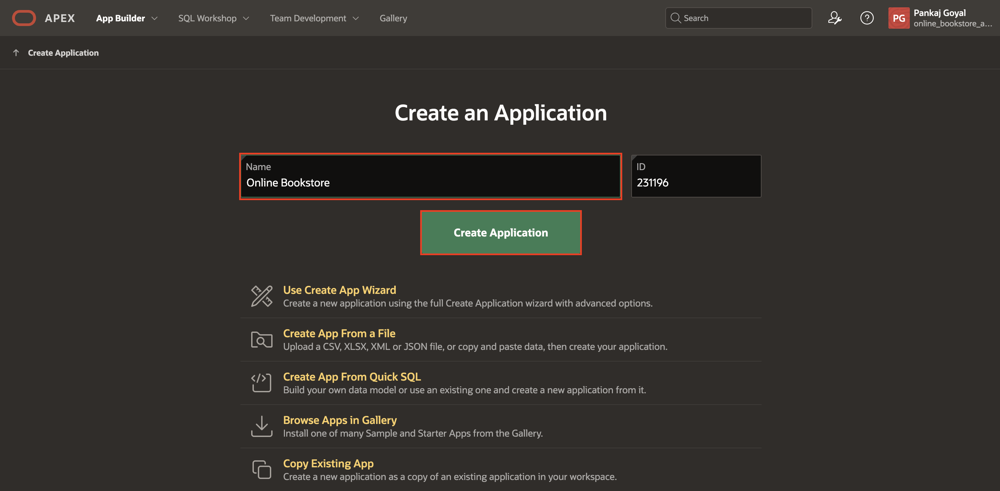
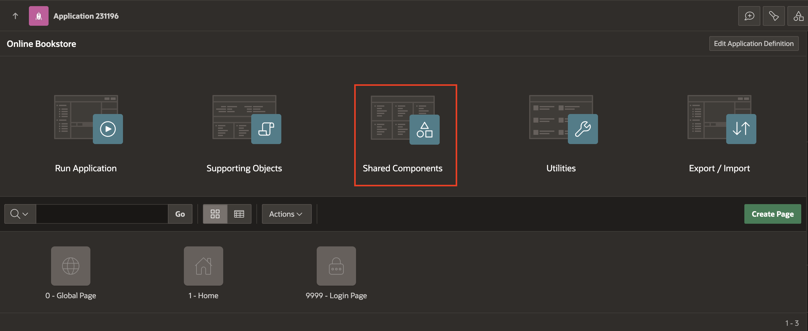
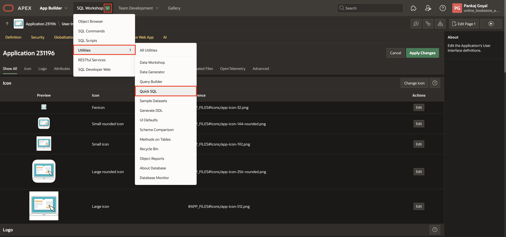
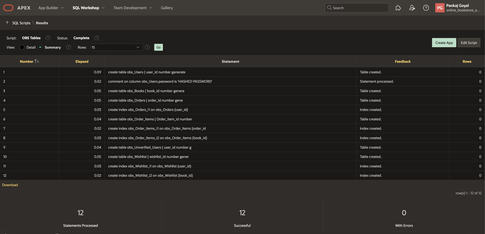
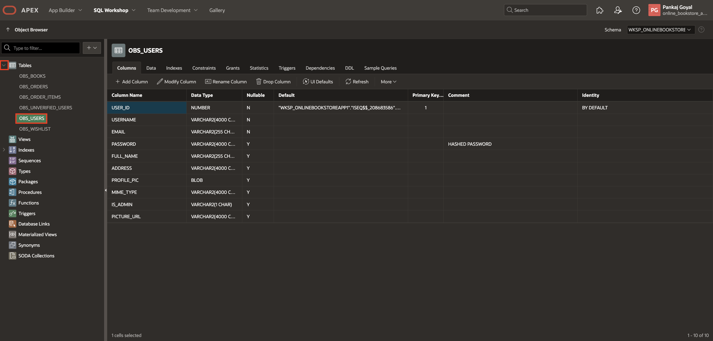

# Create an APEX application

## Introduction

In this lab, you will create a new application named **Online Bookstore**. Next, you rapidly design and prototype data models using a markdown-like shorthand syntax that expands to standards-based Oracle SQL known as Quick SQL in Oracle APEX.

**Quick SQL** is designed to reduce the time and effort required to create SQL tables, triggers, and index structures. This tool is not designed to be a replacement for data modeling. Instead, Quick SQL is simply a quick way to develop a script for simple tables and views.

Estimated Time: 4 minutes

### Objectives

In this lab, you will:

- Create an APEX Application

- Load Quick SQL

## Downloads: Download and Install the Complete Application

If you are stuck or the app is not working as expected, you can download and install the completed app as follows:

1. Click [here](https://c4u04.objectstorage.us-ashburn-1.oci.customer-oci.com/p/EcTjWk2IuZPZeNnD_fYMcgUhdNDIDA6rt9gaFj_WZMiL7VvxPBNMY60837hu5hga/n/c4u04/b/livelabsfiles/o/apex%2Fobs-lab17.zip) to download the completed application zip file.

2. Import the **downloaded zip** file into your workspace. To import the app, go to **App Builder > Import**.

3. Follow the steps in the Install Application wizard to install the app along with the Supporting Objects.

4. Update the hashed password for user01:

    - Go to **SQL Workshop > Object Browser > Tables > OBS\_USERS > Data**.

    - Click the **edit icon** for user01 and update the password to **secretPassword**.

5. Update the Web Credential and Generative AI:

    - To create an OCI API Key, Refer to [Task 1: Generate API Keys using OCI Console](?lab=8-build-an-ai-assistant-chat-widget#Task1:GenerateAPIKeysusingOCIConsole) of [Lab 8: Build an AI-Assistant Chat Widget](?lab=8-build-an-ai-assistant-chat-widget)

    - Edit the apex\_ai\_cred details to match with your OCI API Key,  Refer to [Task 2: Create Web Credentials](?lab=8-build-an-ai-assistant-chat-widget#Task2:CreateWebCredentials) of [Lab 8: Build an AI-Assistant Chat Widget](?lab=8-build-an-ai-assistant-chat-widget)

    - To edit the generative ai, Refer to [Task 3: Configure Generative AI Service](?lab=8-build-an-ai-assistant-chat-widget#Task3:ConfigureGenerativeAIService) of [Lab 8: Build an AI-Assistant Chat Widget](?lab=8-build-an-ai-assistant-chat-widget)

6. Update the Picture URL:

    - Go to **SQL Workshop > RESTful Services > Modules > User Images > profile_pic/:id > GET** and copy Full URL.

    - Go to **App Builder > Online Bookstore > Shared Components > Application Computations > PICTURE\_URL > Computation >**, and replace **<****picture\_url****>** with the copied FULL URL up to ..profile_pic/.

7. Update the Google Auth Credential:

    - To create an Google API Key, Refer to [Task 5: Login with Google](?lab=12-onboarding#Task5:LoginwithGoogle) of [Lab 12: Improve User Onboarding](?lab=12-onboarding), following steps 1 to 10.

    - Edit the Google Authentication details to match with your Google API Key, Refer to [Task 5: Login with Google](?lab=12-onboarding#Task5:LoginwithGoogle) of [Lab 12: Improve User Onboarding](?lab=12-onboarding), following steps 12 to 16.

8. Generate Push Notification Credentials and enable Push Notifications on the device:

    - To generate Push Notification Credentials, go to **App Builder > Online Bookstore > Shared Components > Progressive Web App > Push Notifications**, click **+ Generate Credentials** for Credentials.

    - To enable push notifications, run the application and click on your username in the top-right corner. Then, select **Settings**. By default, push notifications are disabled. Click Off and check the box labeled **Enable push notifications on this device**.

9. Setup Compartment ID to run the Automation for AI Vision Service:

    - Go to **App Builder > Online Bookstore > Shared Components > Automations > Index Book Cover With OCI Vision > Actions**, click the **edit icon** for **Invoke REST Data Source** and replace **#COMPARTMENT\_ID#** with your **COMPARTMENT\_ID** at two places in the query.

10. Update the Razorpay Auth Credential:

    - To create an Razorpay API Key, Refer to [Task 1: Create Web Credential](?lab=15-razorpay-payement-integration#Task1:CreateWebCredential) of [Lab 15: Razorpay Payment Gateway Integration](?lab=15-razorpay-payement-integration), following steps 1 to 4.

    - Edit the Razorpay API details to match with your Razorpay API Key, Refer to [Task 1: Create Web Credential](?lab=15-razorpay-payement-integration#Task1:CreateWebCredential) of [Lab 15: Razorpay Payment Gateway Integration](?lab=15-razorpay-payement-integration), following steps 5 to 9.

11. Update ICON_URL for the application icon in the emails:

    - Go to **App Builder > Online Bookstore > Page 100001 - Email Verification for User SignUp > Processing > Send Verification Email > Send Email Process**, under Settings, select **Placeholder Values** and update **ICON_URL**.

        - In **ICON_URL**, replace **online\_bookstore\_app** with your **workspace\_name**, and update the domain apex.oracle.com if your environment differs.

    - Go to **App Builder > Online Bookstore > Page 100002 - Email Verification for Forgot Password > Processing > Send Verification Email > Send Email Process**, under Settings, select **Placeholder Values** and update **ICON_URL**.

        - In **ICON_URL**, replace **online\_bookstore\_app** with your **workspace\_name**, and update the domain apex.oracle.com if your environment differs.

12. All set. Now, run the application and see it in action!

## Task 1: Create an Application

In this lab, you create a simple application with one click called **Online Bookstore**. This option creates an application that contains only a Global page, Home page, and Login page.

1. On the Workspace home page, click the **App Builder**.

   

2. Click **Create** or **Create a New App**.

    

3. For Name, enter **Online Bookstore** and click **Create application**.

    

4. To edit application icon, click **Shared Components**.

    

5. Under **User Interface**, select **User Interface Attributes**.

    

6. Click **Change Icon**.

    

7. In the Edit Application Icon dialog you can either:
    - **Upload an icon**: Click the plus (+) sign and navigate to the icon, or drag and drop the icon to the Upload your own icon region.

    If you upload a custom icon, it is resized to a number of sizes and will be propagated to the appropriate places at runtime.

    - **Select an icon from the library**: Select the icon color and then the icon.

    In this lab, I uploaded an sample icon from my device. After uploading, it can be adjusted or cropped. Download a sample icon [here](./images/Online_Bookstore_Icon.png).

    After making all changes, click **Save Icon**.

    

    

8. To view the application, click **Run** and enter your workspace credentials to log in.

     

     

     

## Task 2: Load Quick SQL

In this task, you'll use Quick SQL to quickly generate and execute a script for creating database tables. This script defines tables for an Online Bookstore app, including Users, Books, Orders, and more. Once executed, you can review the tables in the Object Browser.

1. Navigate to select **SQL Workshop** and select **Utilities > Quick SQL**.

    

2. Copy and paste the given code in the Quick SQL column and click **Review and Run**.

    ```
    <copy>
    #prefix: obs
    #PK: identity

    Users
      user_id num /pk
      username  /nn /unique
      email  /nn /unique
      password --HASHED PASSWORD
      full_name
      address
      profile_pic blob
      mime_type
      is_admin
      picture_url

    Books
      book_id num /pk
      price num /nn
      title  /nn
      author /nn
      category
      discount num /nn
      publisher
      book_image
      contributor
      description
      book_quantity num /nn
      object_det
      available_yn  /nn /default Y
      text_det

    Orders
      order_id num /pk
      user_id num /fk Users /cascade
      order_no
      order_datetime timestamp
      payment_id vc
      razorpay_id vc

    Order_Items
      Order_item_id num /pk
      order_id num /fk Orders /cascade
      book_id num /fk Books /cascade
      added_time  timestamp
      added_date date
      price num
      seq_no num
      quantity num
      discount num

    Unverified_Users
      user_id num /pk
      email

    Wishlist
      wishlist_id num /pk
      user_id num /fk Users /cascade
      book_id num /fk Books /cascade
    </copy>
    ```

    

3. Enter Script Name - **OBS Tables** and click **Run**.

    

4. Review the summary and click **Run Now**.

   

5. We can see that 12 statements were run successfully.

   

6. Navigate to the **Object Browser** via the **SQL Workshop** dropdown to view all tables.

   

7. Expand **Tables** and select any table to view its columns and other details.

  

## Summary

You now know how to create an application along with editing an icon of the application. Also, you now know how to use a Quick SQL using shorthand syntax. You may now **proceed to the next lab**.

## Acknowledgements

- **Author**: Pankaj Goyal, Member Technical Staff; Ankita Beri, Product Manager
- **Last Updated By/Date**: Pankaj Goyal, Member Technical Staff, March 2025