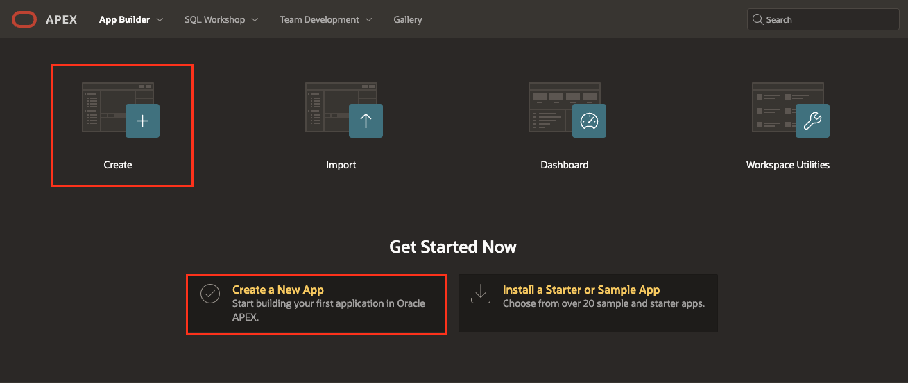
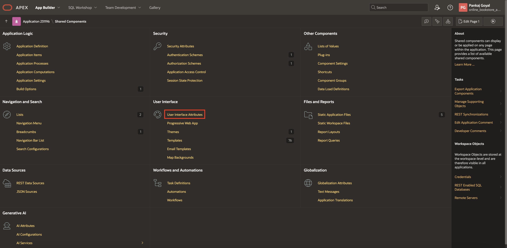
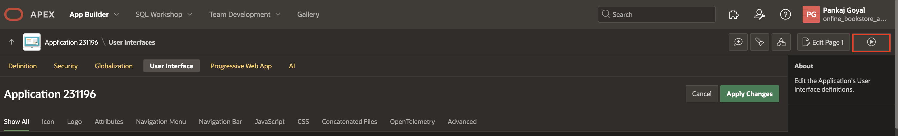
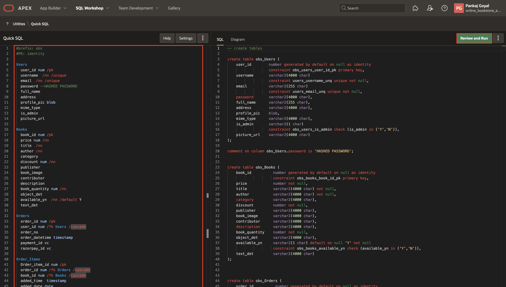
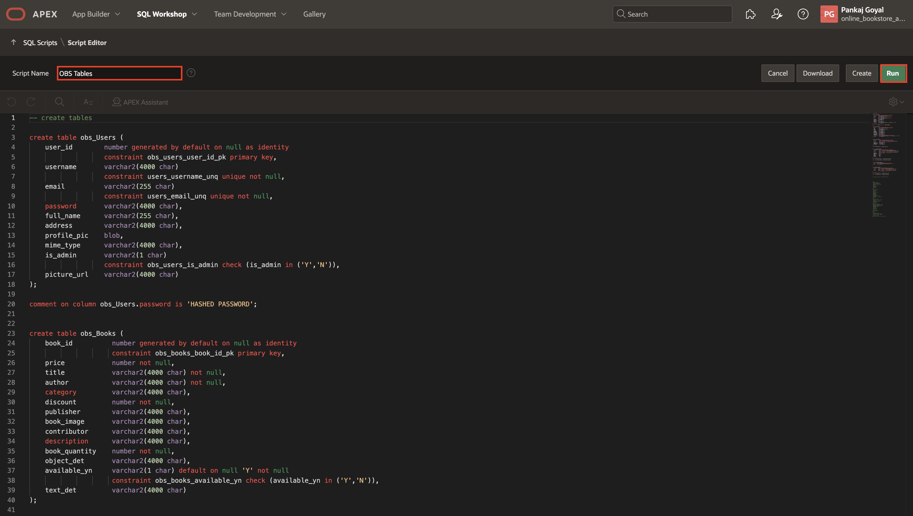
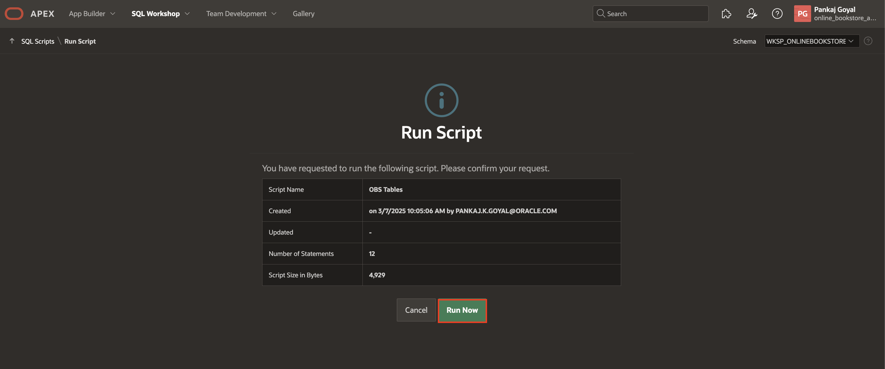

# Create an APEX application

## Introduction

In this lab, you will create a new application named **Online Bookstore**. Then, you will quickly design and prototype data models using a markdown-like shorthand syntax that expands to standards-based Oracle SQL known as Quick SQL in Oracle APEX.

**Quick SQL** is designed to reduce the time and effort required to create SQL tables, triggers, and index structures. This tool is not designed to be a replacement for data modeling. Instead, Quick SQL is simply a quick way to develop a script for simple tables and views.

Estimated Time: 4 minutes

### Objectives

In this lab, you will:

- Create an APEX Application

- Load Quick SQL

### Downloads: Download and Install the Complete Application

If you are stuck or the app is not working as expected, don't worry! Download one of the export files below:

- Click [here](https://c4u04.objectstorage.us-ashburn-1.oci.customer-oci.com/p/EcTjWk2IuZPZeNnD_fYMcgUhdNDIDA6rt9gaFj_WZMiL7VvxPBNMY60837hu5hga/n/c4u04/b/livelabsfiles/o/obs-lab17.zip) to download the complete application export file, which contains everything completed in all the labs except the optional Lab 18. To run the app, follow the steps described in the [Lab Appendix: Download Instructions](?lab=download-instructions) from Task 2 to Task 10.

- Click [here](https://c4u04.objectstorage.us-ashburn-1.oci.customer-oci.com/p/EcTjWk2IuZPZeNnD_fYMcgUhdNDIDA6rt9gaFj_WZMiL7VvxPBNMY60837hu5hga/n/c4u04/b/livelabsfiles/o/obs-lab18.zip) to download the complete application export file, which contains everything completed in all the labs, including the optional Lab 18. This export requires Oracle Database 23ai for Lab 18. To run the app, follow the steps described in the [Lab Appendix: Download Instructions](?lab=download-instructions) from Task 2 to Task 11.

## Task 1: Create an Application

In this lab, you create a simple application called **Online Bookstore**. This application is created with the following pages by default: Global page, Home page, and Login page.

1. On the Workspace home page, click the **App Builder**.

   

2. Click **Create** or **Create a New App**.

    

3. For Name, enter **Online Bookstore** and click **Create application**.

    

4. To edit application icon, click **Shared Components**.

    

5. Under **User Interface**, select **User Interface Attributes**.

    

6. Click **Change Icon**.

    

7. In the Edit Application Icon dialog you can either:
    - **Upload an icon**: Click the plus (+) sign and navigate to the icon, or drag and drop the icon to the Upload your own icon region.

    If you upload a custom icon, it is resized to a number of sizes and will be propagated to the appropriate places at runtime.

    - **Select an icon from the library**: Select the icon color and then the icon.

    In this lab, I uploaded an sample icon from my device. After uploading, it can be adjusted or cropped. Download a sample icon [here](./images/Online_Bookstore_Icon.png).

    After making all changes, click **Save Icon**.

    

    

8. To view the application, click **Run** and enter your workspace credentials to log in.

     

     

     

## Task 2: Load Quick SQL

In this task, you'll use Quick SQL to quickly generate and execute a script for creating database tables. This script defines tables for an Online Bookstore app, including Users, Books, Orders, and more. Once executed, you can review the tables in the Object Browser.

1. Navigate to select **SQL Workshop** and select **Utilities > Quick SQL**.

    

2. Copy and paste the given code in the Quick SQL column and click **Review and Run**.

    ```
    <copy>
    #prefix: obs
    #PK: identity

    Users
      user_id num /pk
      username  /nn /unique
      email  /nn /unique
      password --HASHED PASSWORD
      full_name
      address
      profile_pic blob
      mime_type
      is_admin
      picture_url

    Books
      book_id num /pk
      price num /nn
      title  /nn
      author /nn
      category
      discount num /nn
      publisher
      book_image
      contributor
      description
      book_quantity num /nn
      object_det
      available_yn  /nn /default Y
      text_det

    Orders
      order_id num /pk
      user_id num /fk Users /cascade
      order_no
      order_datetime timestamp
      payment_id vc
      razorpay_id vc

    Order_Items
      Order_item_id num /pk
      order_id num /fk Orders /cascade
      book_id num /fk Books /cascade
      added_time  timestamp
      added_date date
      price num
      seq_no num
      quantity num
      discount num

    Unverified_Users
      user_id num /pk
      email

    Wishlist
      wishlist_id num /pk
      user_id num /fk Users /cascade
      book_id num /fk Books /cascade
    </copy>
    ```

    >*NOTE: This Quick SQL script creates tables for managing users, books, orders, and wishlists in an online bookstore using Oracle APEX.*

    

3. Enter Script Name - **OBS Tables** and click **Run**.

    

4. Review the summary and click **Run Now**.

   

5. We can see that 12 statements were run successfully.

   

6. Navigate to the **Object Browser** via the **SQL Workshop** dropdown to view all tables.

   

7. Expand **Tables** and select any table to view its columns and other details.

  

## Summary

You now know how to create an application along with editing an icon of the application. Also, you now know how to use a Quick SQL using shorthand syntax. You may now **proceed to the next lab**.

## Acknowledgements

- **Author**: Pankaj Goyal, Member Technical Staff; Ankita Beri, Product Manager
- **Last Updated By/Date**: Pankaj Goyal, Member Technical Staff, March 2025