# Improve User Onboarding

## Introduction

In this lab, you will learn to implement email verification and authentication features within an Oracle APEX application. The lab covers email verification for Forgot Password and User Sign-Up, resetting passwords, signing up, and enabling login with Google. You will configure authentication mechanisms, integrate email-based validation, and ensure secure user access. This exercise demonstrates Oracle APEX's capabilities in building robust authentication systems while enhancing user experience and security.

Estimated Time: 35 minutes

### Objectives

In this lab, you will:

- Email Verification for Forgot Password/User SignUp
- Reset Password/Signup
- Login with Google

### Downloads: Missed Previous Labs? Download and Install the Application

If you're stuck or missed out on completing the previous labs, don't worry! Click [here](https://c4u04.objectstorage.us-ashburn-1.oci.customer-oci.com/p/EcTjWk2IuZPZeNnD_fYMcgUhdNDIDA6rt9gaFj_WZMiL7VvxPBNMY60837hu5hga/n/c4u04/b/livelabsfiles/o/obs-lab11.zip) to download the export file, which contains everything completed in the previous labs. To run the app, follow the steps described in the [Lab Appendix: Download Instructions](?lab=download-instructions) from Task 2 to Task 5.

## Task 1: Creating Email Verification for Forgot Password

In this task, you will create a Forgot Password page with email verification functionality. Users will enter their email to receive a reset link, ensuring secure password recovery. You will also update the login page to include a "Forgot Password" button for easy access.

1. On page designer toolbar, navigate to **(+)** and select **Page**.

    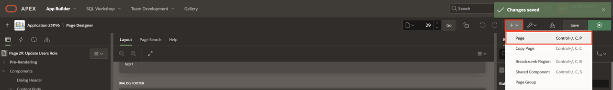

2. Click **Blank Page**.

    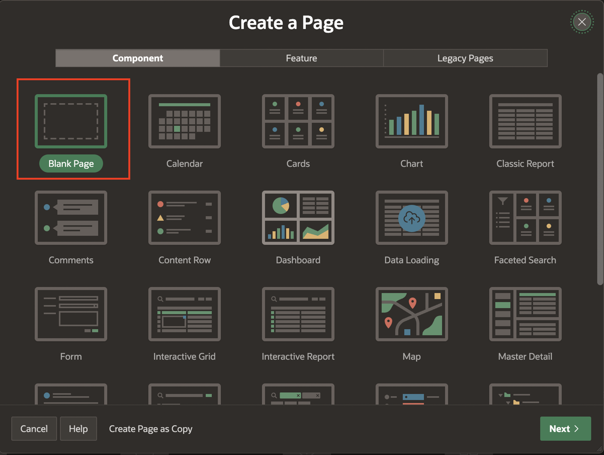

3. Enter/select the following:

    - Under Page Definition:

        - Page Number: **100002**

        - Name: **Email Verification for Forgot Password**

    - Under Navigation:

        - Use Breadcrumb: **Toggle Off**

        - Use Navigation: **Toggle Off**

       Click **Create Page**.

    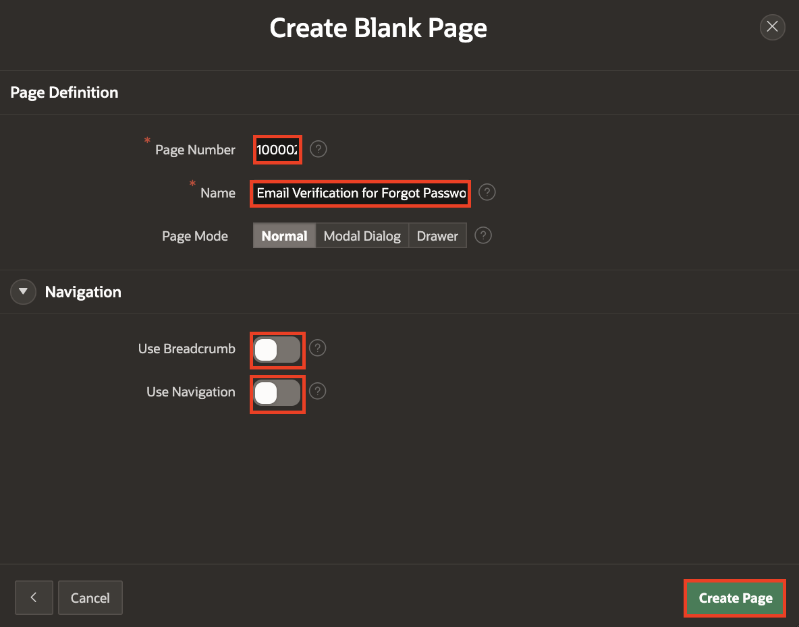

4. In the property editor, update the following:

     - Security > Authentication: **Page is Public**

    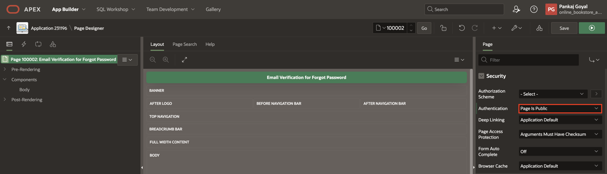

5. Right-click **Body** and select **Create Region**.

    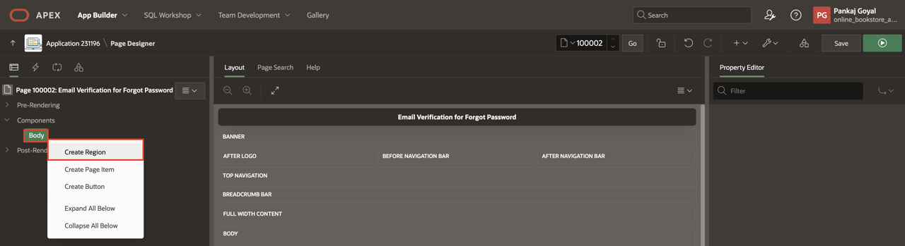

6. In the property editor, enter/select the following:

    - Identification > Name: **Reset Password**

    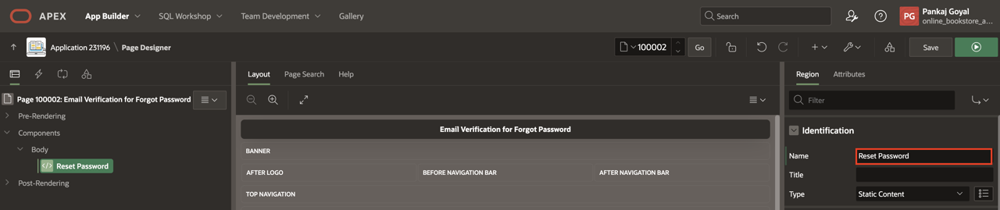

7. Right-click **Reset Password** region and select **Create Page Item**.

    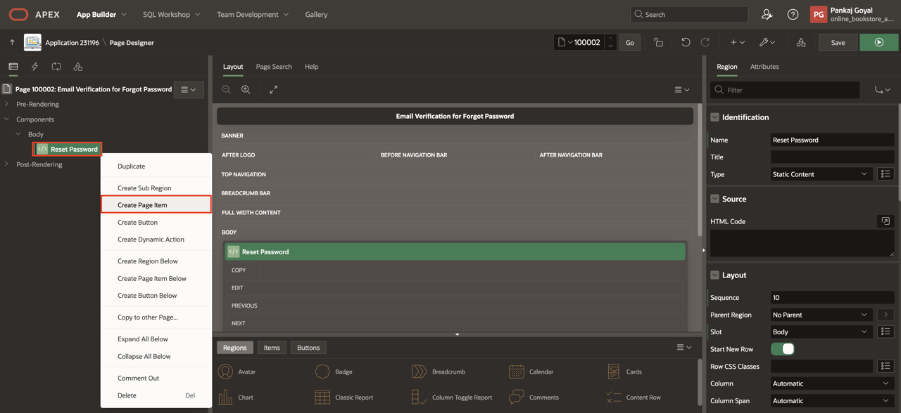

8. In the property editor, enter/select the following:

    - Identification > Name: **EMAIL**

    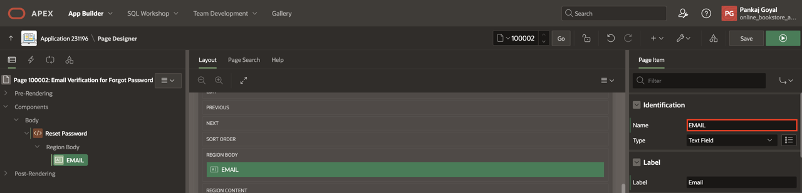

9. Right-click **EMAIL** and select **Create Validation**.

    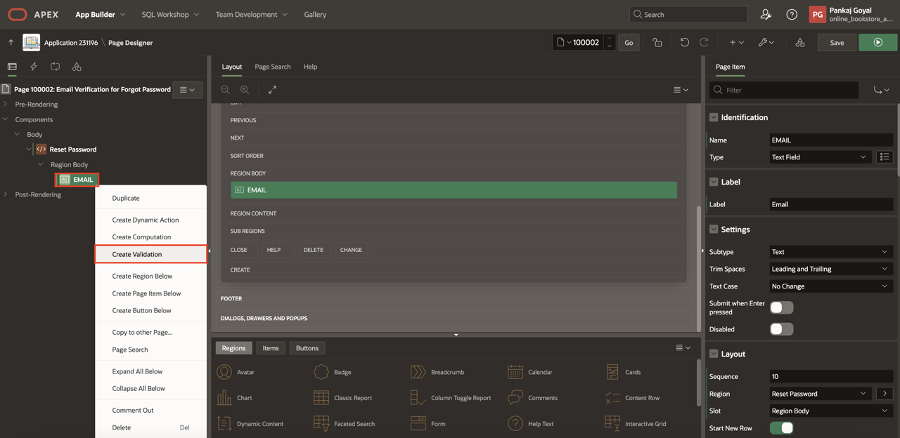

10. In the property editor, enter/select the following:

    - Identification > Name: **Valid Email Address**

    - Under Validation:

        - Type: **Item matches Regular Expression**

        - Item: **EMAIL**

        - Regular Expression : **^[a-zA-Z0-9+_.-]+@[a-zA-Z0-9.-]+(?:\.[a-zA-Z0-9-]+)*$**

    - Under Error:

        - Error Message: **Invalid Email Address!**

        - Associated Item: **-Select-**

    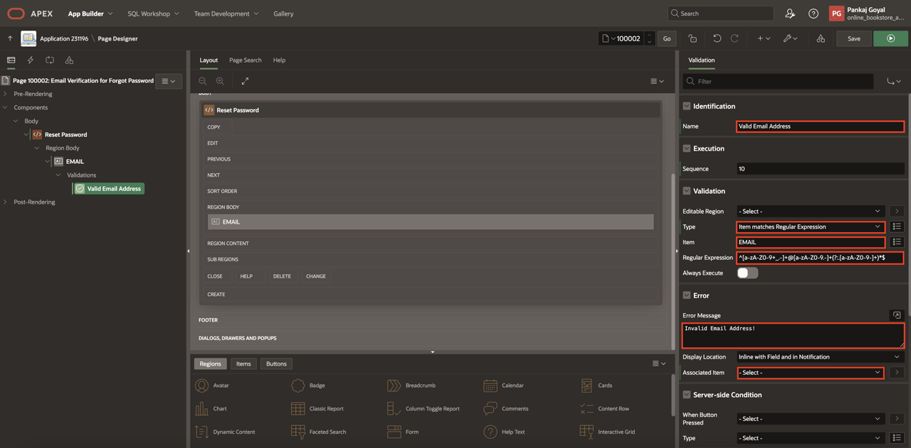

11. Right-click **Validations** and select **Create Validation**.

    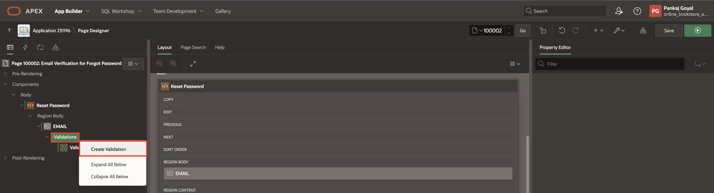

12. In the property editor, enter/select the following:

     - Identification > Name: **Email Validation**

     - Under Validation:

        - Type: **Rows returned**

        - SQL Query: Copy and paste the below query:

            ```
            <copy>
            select u.email from obs_users u  where u.email = lower(:EMAIL);
            </copy>
            ```

     - Error > Error Message: **No Account Found!**

     - Server-side Condition > Type: **Inline Validation Errors NOT displayed**

    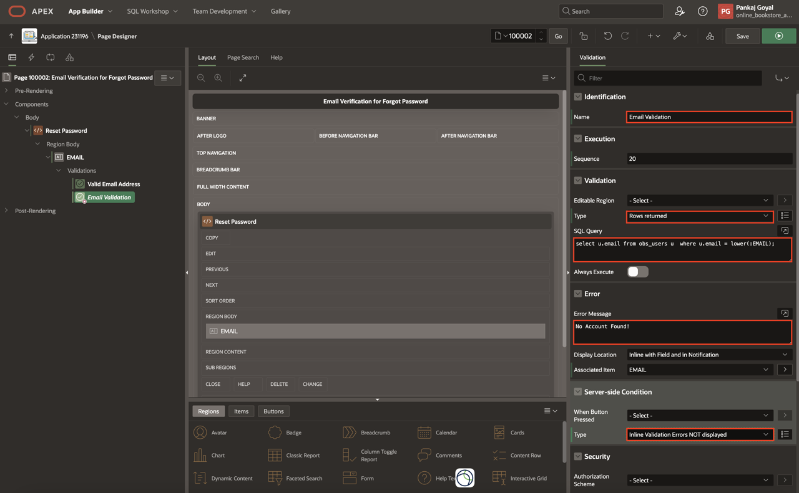

13. Right-click **EMAIL** and select **Create Button Below**.

    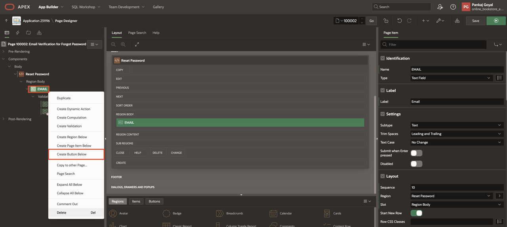

14. In the property editor, enter/select the following:

    - Under Identification:

        - Button Name: **Send**

        - Label: **Send Reset Password Link**

    - Under Appearance > Template Options: Click **Use Template Defaults**

        - Type: **Primary**

        Click **OK**

    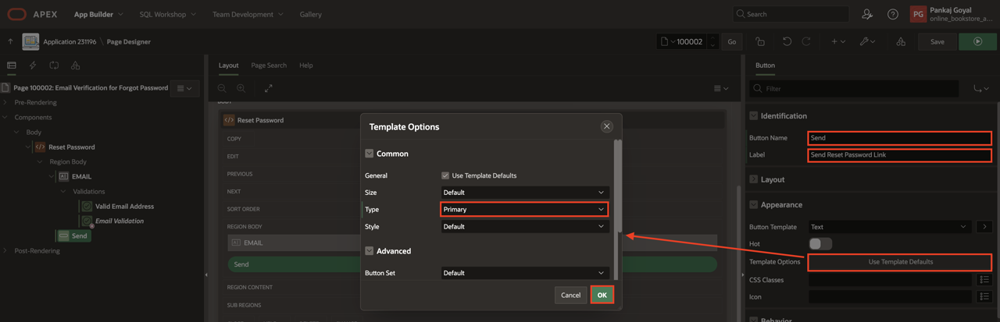

15. Navigate to the **Processing** tab, right-click **Processing** and select **Create Process**.

    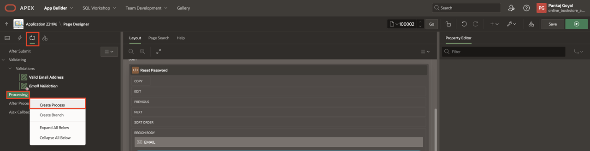

16. In the property editor, enter/select the following:

    - Under Identification:

        - Name: **Send Verification Email**

        - Type: **Invoke API**

    - Under Settings:

        - Package: **APEX_MAIL**

        - Procedure or Function: **SEND**

    - Success Message > Success Message: **Reset Password Link sent to your email address**.

    - Server-side Condition > When Button Pressed: **Send**

    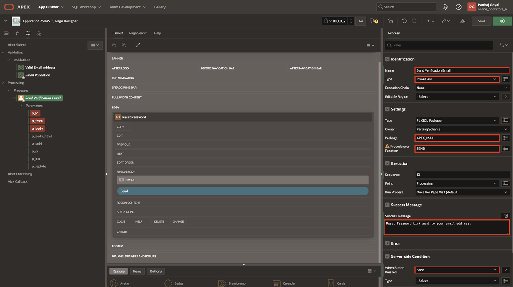

17. Under **Send Verification Email** process, expand **Parameters** and update the following:

    - **p\_to**:

        - Under Value:

             - Type: **Item**

             - Item: **EMAIL**

    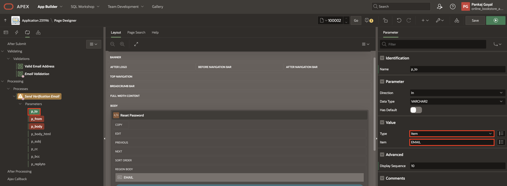

    - **p\_from**:

        - Under Value:

            - Type: **Static Value**

            - Static Value: **noreply.obs@oracle.com**

    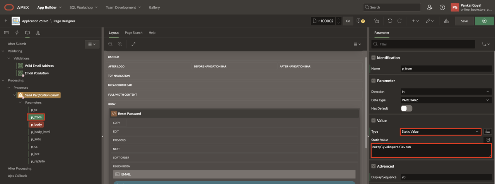

    - **p\_body**:

        - Under Value:

            - Type: **Static Value**

            - Static Value: **To view the content of this message, please use an HTML-enabled mail client.**

    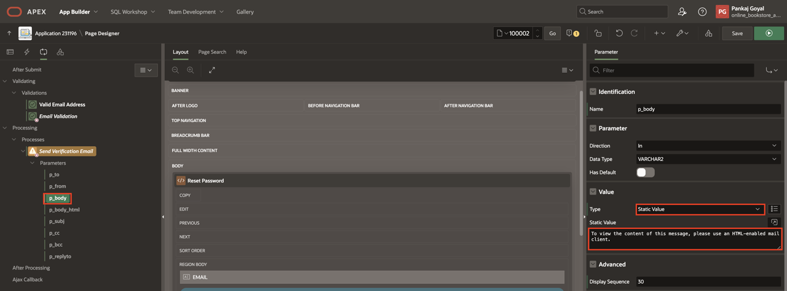

    - **p\_body\_html**:

        - Under Value:

            - Type: **Function Body**

            - PL/SQL Function Body: Copy and Paste the below code:

                ```
                <copy>
                DECLARE
                    v_url  VARCHAR2(1000);
                    v_html VARCHAR2(4000);
                BEGIN
                    v_url := apex_util.host_url || APEX_PAGE.GET_URL(
                                p_page   => 100003,
                                p_items  => 'P100003_EMAIL',
                                p_values => :EMAIL);

                    v_html := apex_string.format(q'[
                        <html>
                            <body>
                                <p>Please open the link to Reset Password for your account</p>
                                <p><a href="%s">
                                    <b>Reset Password</b>
                                </a></p>
                                <p>Sincerely,<br />
                                The Online Bookstore Team<br />
                                </p>
                            </body>
                        </html>
                    ]', v_url);

                    RETURN v_html;
                END;
                </copy>
                ```

    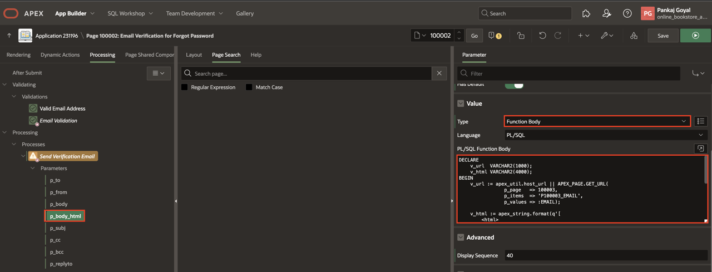

    - **p\_subj**:

        - Under Value:

            - Type: **Static Value**

            - Static Value: **Reset Password**

    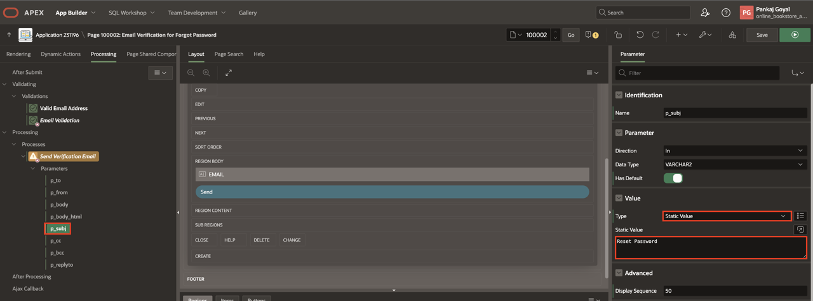

18. Right-click **After Processing** and select **Create Branch**.

    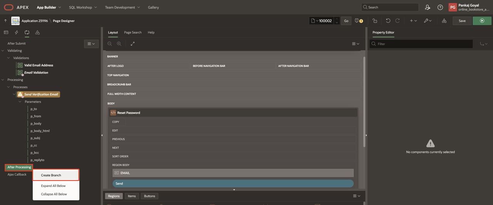

19. In the property editor, enter/select the following:

    - Identification > Name: **Go To Login Page**

    - Under Behavior:
        - Target: Click **No Link Defined**

            - Page: **9999**

            Click **OK**.

    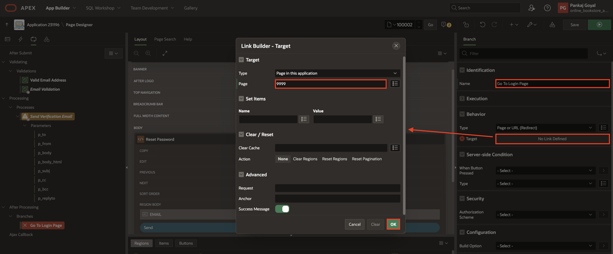

20. Click **Save**.

    Update the Login Page

21. Navigate to Page - 9999.

    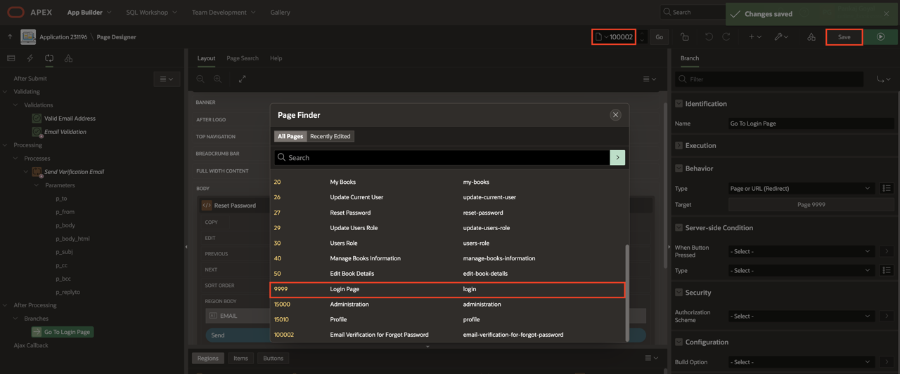

22. Under **Online Bookstore** region, right-click **Next** and select **Create Button**.

    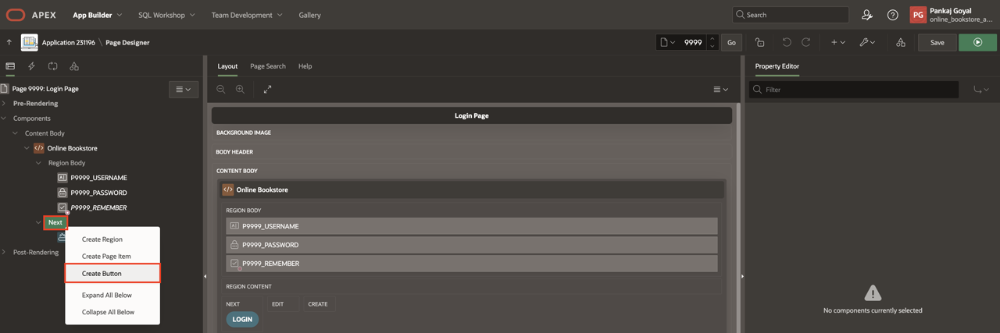

23. In the Property editor, enter/select the following:

    - Under Identification:

        - Button Name: **Forgot_Password**

        - Label: **Forgot Password**

    - Under Appearance > Template options: Click **Use Template Defaults**
        - Size: **Small**

        - Type: **Danger**

        - Width: **Stretch**

        - Spacing Top: **Small**

          Click **OK**.

    - Under Behavior:

        - Action: **Redirect to page in this application**

        - Target: Click **No Link Defined**

            - Page: **100002**

            - Clear Cache: **100002**

            Click **OK**.

    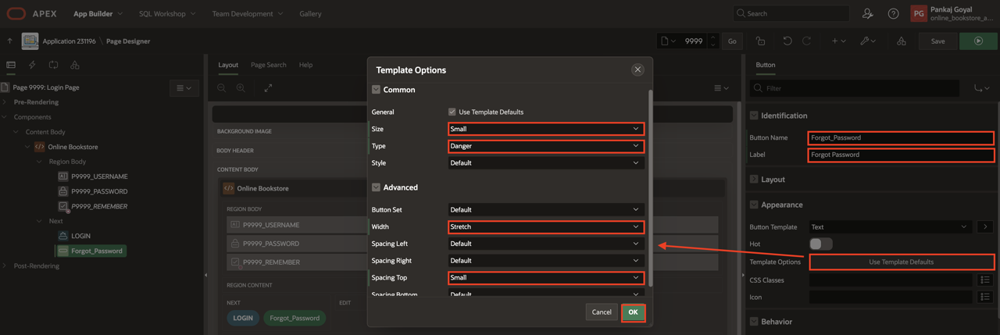

    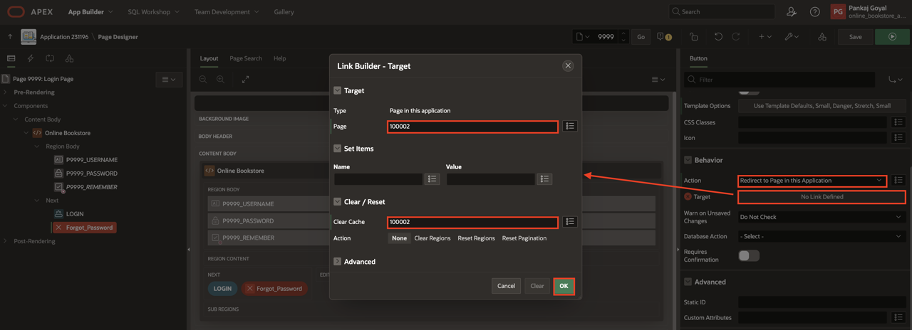

24. Click **LOGIN** button and update the following:

    - Under Appearance > Template options: Click **Use Template Defaults**

        - Type: **Success**

          Click **OK**.

    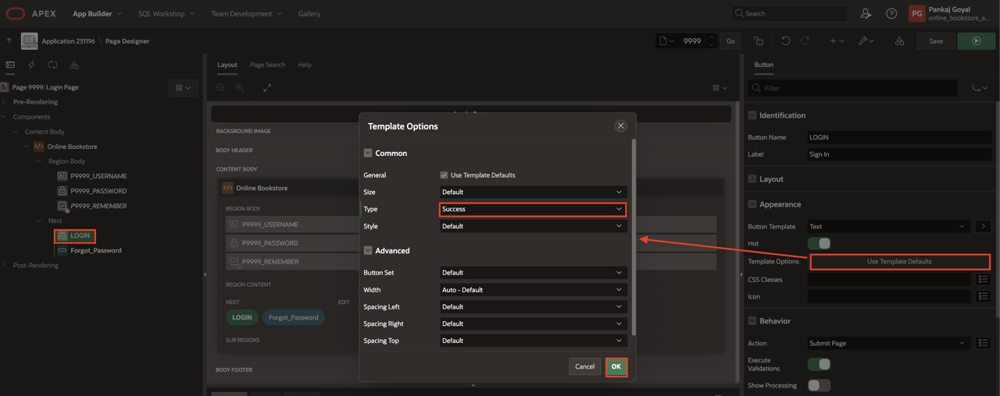

25. Click **Save**. 

## Task 2: Creating  Reset Password

In this task, you will create a Reset Password page that allows users to securely update their password. The process includes validation checks, password confirmation, and redirection to the login page upon successful update.

>*Note: The previous reset password page created in Lab 10 Task 4 is a modal dialog page, where you reset the password from your application screen. This reset password page is to reset your password from the forgot password email link.*

1. On page designer toolbar, navigate to **(+)** and select **Page**.

    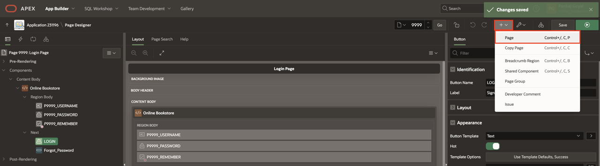

2. Click **Blank Page**.

    

3. Enter/select the following:

    - Under Page Definition:

        - Page Number: **100003**

        - Name: **Reset Password**

    - Under Navigation:

        - Use Breadcrumb: **Toggle Off**

        - Use Navigation: **Toggle Off**

       Click **Create Page**.

    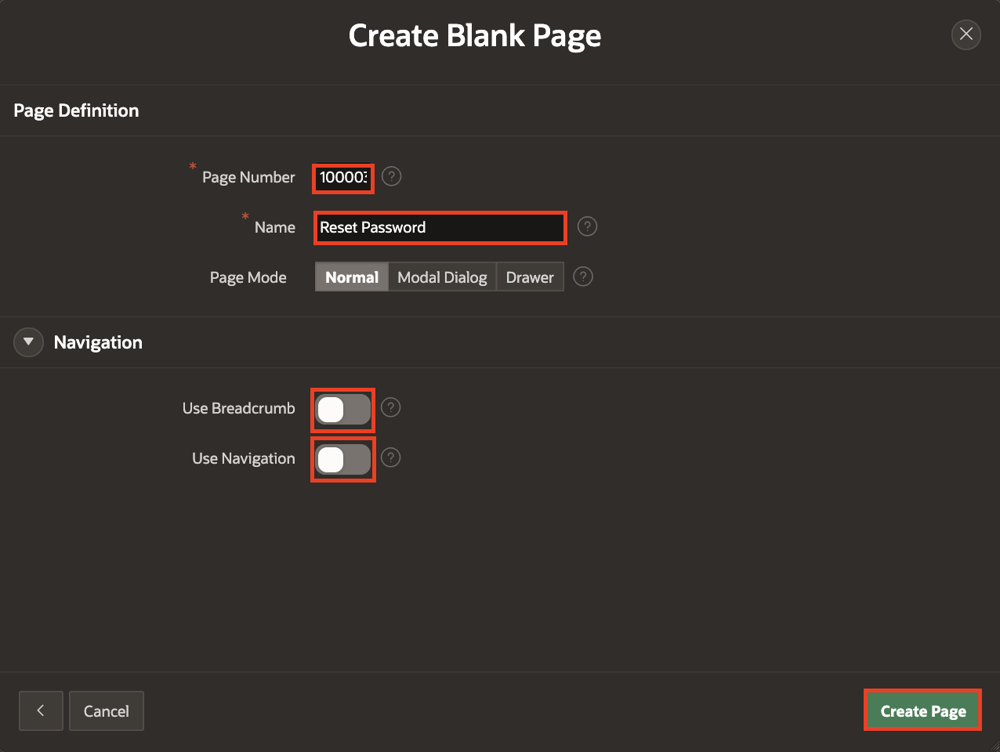

4. In the Property editor, update the following:

    - Security > Authentication: **Page is Public**

    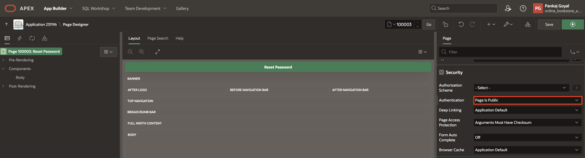

5. In the left pane, right-click **Body** and select **Create Region**.

   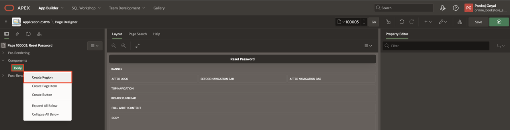

6. In the Property editor, enter/select the following:

    - Under Identification:

        - Name: **Update Current User**

        - Type: **Form**

    - Source > Table Name: **OBS_USERS**

    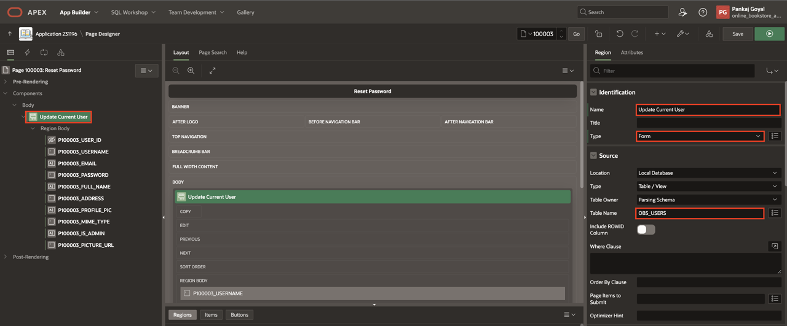

7. Under **Update Current User** region, select all page items except **P100003\_EMAIL** and **P100003\_PASSWORD**, right-click and select **Delete**.

   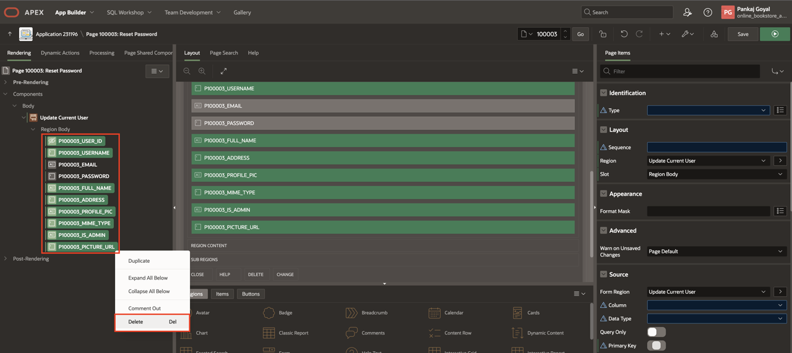

8. Select **P100003\_EMAIL** and update the following:

    - Identification > Type: **Display Only**

    - Source > Primary Key: **Toggle On**

    - Security > Session State Protection: **Unrestricted**

    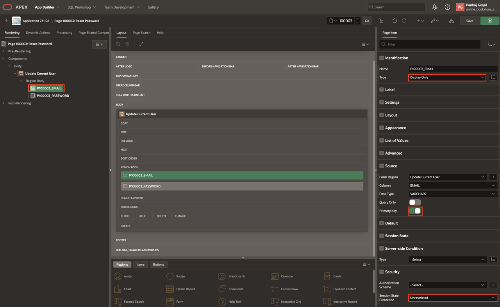

9. Select **P100003\_PASSWORD** and update the following:

    - Identification > Type: **Password**

    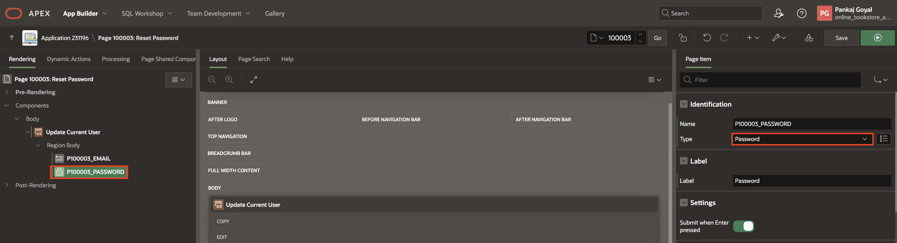

10. Right-click **P100003\_PASSWORD** and select **Create Validation**.

    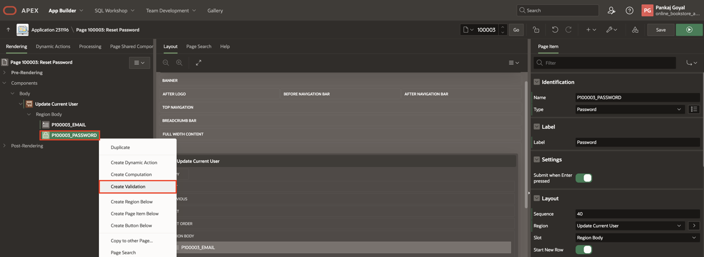

11. In the Property editor, enter/select the following:

    - Identification > Name: **Not Null Validation**

    - Under Validation:

        - Type: **Expression**

        - PL/SQL Function Body: Copy and paste the below expression:

         ```
        <copy>
        :P100003_Password is not NULL
       </copy>
        ```

        - Error > Error Message: **Password field should have some value.**

    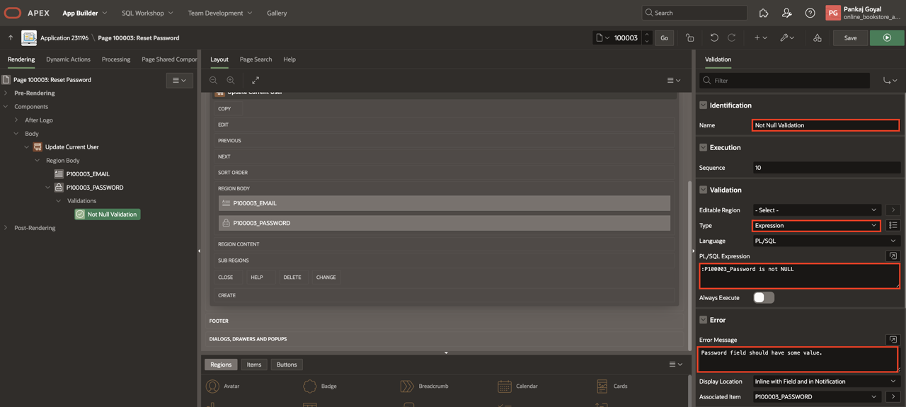

12. Right-click **Update Current User** and select **Create Page Item**.

    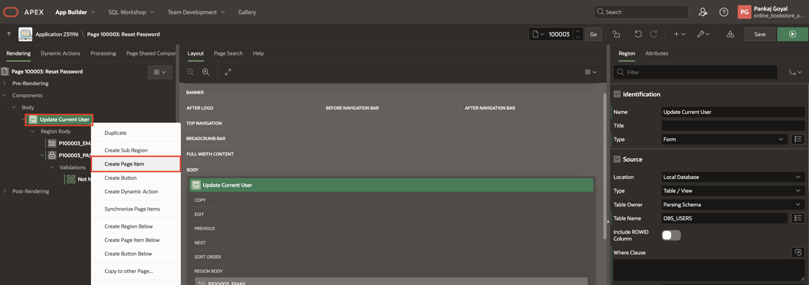

13. In the Property editor, enter/select the following:

    - Under Identification:

        - Name: **P100003\_CONFIRM\_PASSWORD**

        - Type: **Password**

    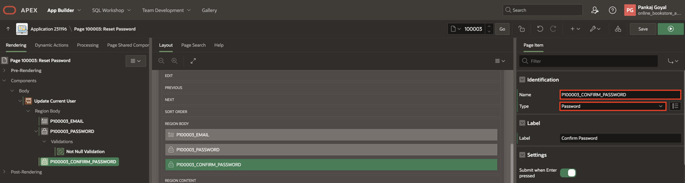

14. Right-click **P100003\_CONFIRM\_PASSWORD** and select **Create Validation**.

    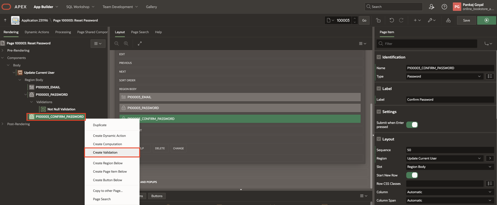

15. In the Property editor, enter/select the following:

    - Identification > Name: **Not Null Validation CF**

    - Under Validation:

        - Type: **Expression**

        - PL/SQL Function Body: Copy and paste the below expression:

            ```
            <copy>
            :P100003_CONFIRM_PASSWORD is not NULL
            </copy>
        ```

    - Error > Error Message: **Password field should have some value.**

    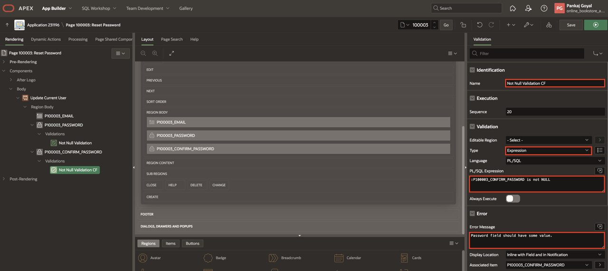

16. Again, right-click **P100003\_CONFIRM\_PASSWORD** and select **Create Validation**.

     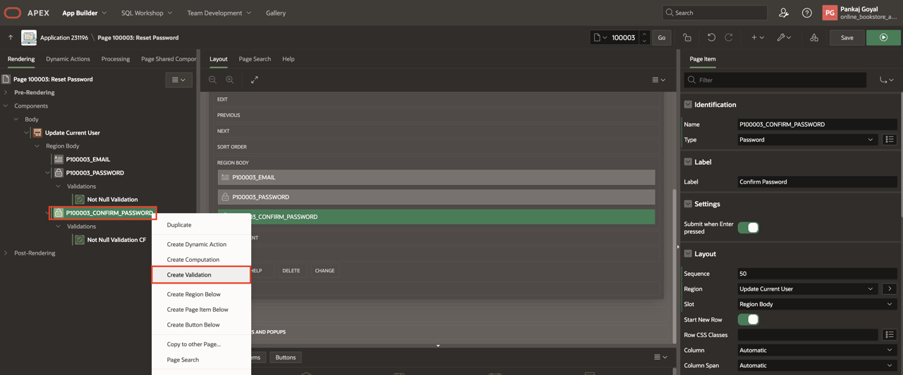

17. In the Property editor, enter/select the following:

    - Identification > Name: **Compare Passwords**

    - Under Validation:

        - Type: **Expression**

        - PL/SQL Function Body: Copy and paste the below expression:

            ```
            <copy>
            :P100003_Password = :P100003_CONFIRM_PASSWORD
            </copy>
           ```

    - Error > Error Message: **Confirm Password is not same as Password entered above.**

    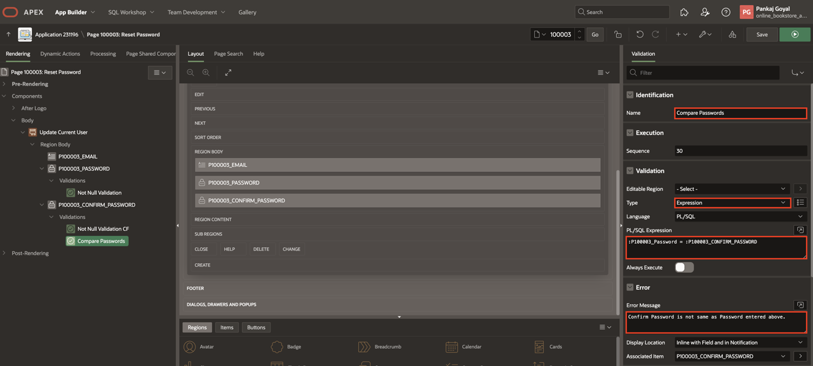

18. Right-click **Update Current User** region and select **Create Sub Region**.

    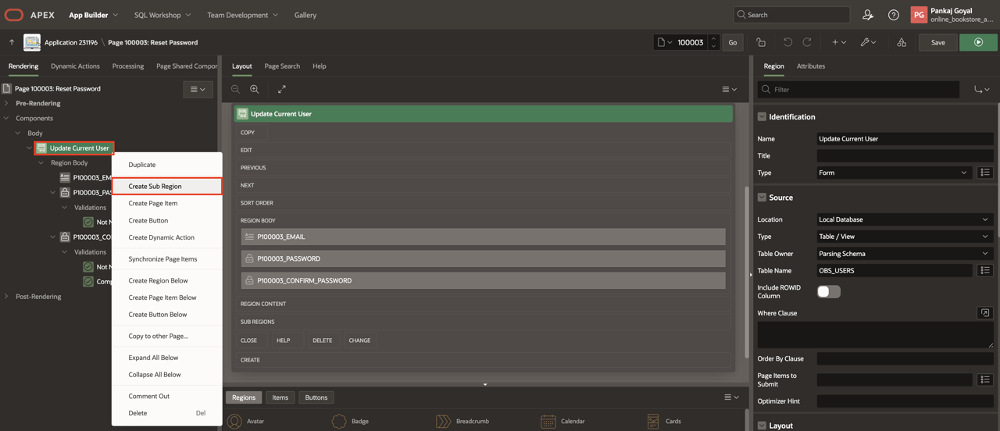

19. In the Property editor, enter/select the following:

    - Identification > Name: **Buttons**

    - Layout > Slot: **Region Body**

    - Under Appearance:

        - Template: **Buttons Container**

        - Template Options: Click **Use Template Defaults**

            - Style: **Remove UI Decoration**

            Click **OK**.

    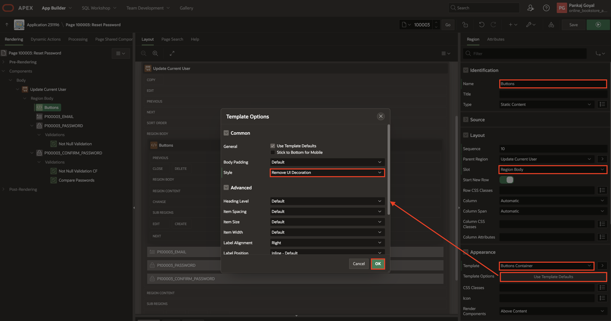

20. Right-click **Buttons** and select **Create Button**.

    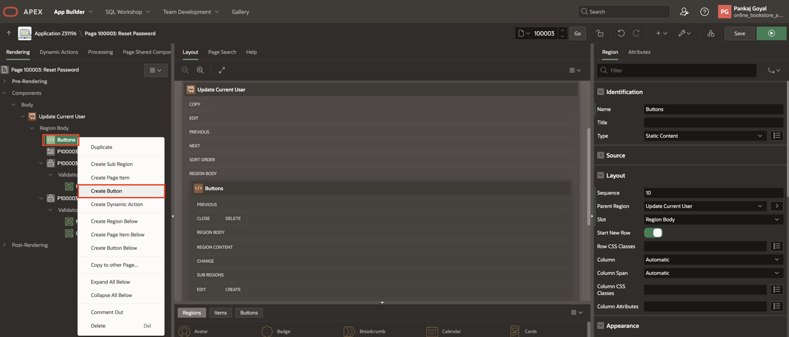

21. In the Property editor, enter/select the following:

    - Identification > Button Name: **CANCEL**

    - Layout > Slot: **Close**

    - Under Behavior:

        - Action: **Redirect to page in this Application**

        - Target: Click **No Link Defined**

            - Page: **15010**

            - Clear Cache: **100003**

            Click **OK**.

    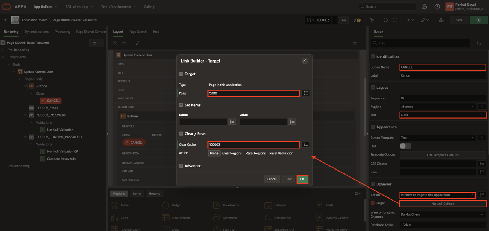

22. Right-click **CANCEL** and select **Create Dynamic Action**.

    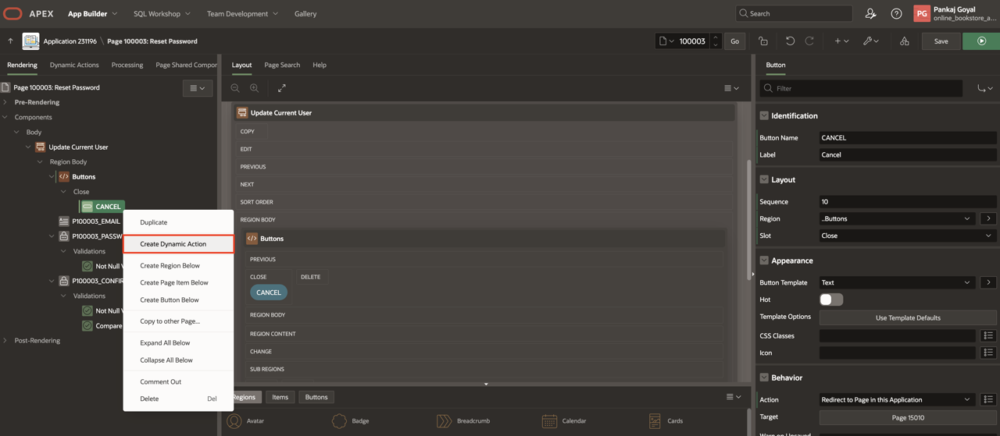

23. In the Property editor, enter/select the following:

    - Identification > Name: **Cancel Dialog**

    - When > Event: **Click**

    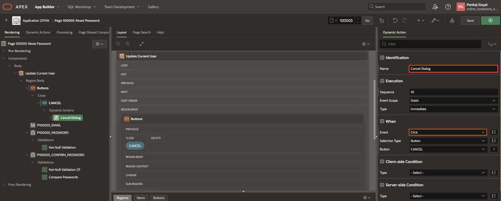

24. Right-click **Buttons** and select **Create Button**.

    

25. In the Property editor, enter/select the following:

    - Under Identification:

        - Button Name: **SAVE**

        - Label: **Apply Changes**

    - Layout > Slot: **Next**

    - Appearance > Hot: **Toggle On**

    - Behavior > Database Action: **SQL UPDATE action**

    

26. Select  **Buttons** and in the Property editor, update the following:

    - Layout > Sequence: **70**

    

27. Navigate to **Processing** tab, right-click **Processing** and select **Create Process**.

    

28. In the Property editor, enter/select the following:

    - Under Identification:

        - Name: **Process from Update current user**

        - Type: **Form - Automatic Row Processing (DML)**

        - Form Region: **Update Current User**

    - Success Message > Success Message: **Updated Profile details successfully!**

    

29. Right-click **After Processing** and select **Create Branch**.

    

30. In the property editor, enter/select the following:

    - Identification > Name: **Go to My Profile**

    - Under Behavior > Target: Click **No Link Defined**

         - Page: **12**

         - Clear Cache: **10**

         Click **OK**

    

31. Click **Save**.

32. On page designer toolbar, navigate to **(+)** and select **Page**.

    

33. Click **Blank Page**.

    

34. Enter/select the following:

    - Under Page Definition:

        - Page Number: **12**

        - Name: **LOGIN_HOME**

    - Under Navigation:

        - Use Breadcrumb: **Toggle Off**

        - Use Navigation: **Toggle Off**

       Click **Create Page**.

    

35. Right-click **Before Header** under **Pre-rendering** and select **Create Branch**

    

36. In the property editor, enter/select the following:

    - Identification > Name: **Go To Home Page**

    - Under Behavior > Target: Click **No Link Defined**

         - Page: **10**

         Click **OK**

    

37. Click **Save**.

## Task 3: Creating Email Verification for User SignUp

In this task, you will create an Email Verification process for user sign-up. The process involves validating user email, sending a verification email with a sign-up link, and updating the login page with a SignUp button for new users.

1. On page designer toolbar, navigate to **(+)** and select **Page**.

    

2. Choose **Form Page**.

    

3. Enter/select the following:

    - Under Page Definition:

        - Page Number: **100001**

        - Name: **Email Verification for User SignUp**

    - Under Data Source:

        - Table/View Name: **OBS\_UNVERIFIED\_USERS**

    - Under Navigation:

        - Use Breadcrumb: **Toggle Off**

        - Use Navigation: **Toggle Off**

    Click **Next**.

    

    - Under Branch Pages:

        - Branch Here on Submit: **9999**

        - Cancel and Go To Page: **9999**

    Click **Create Page**.

    

4. In the property editor, update the following:

     - Security > Authentication: **Page is Public**

    

5. Under **Email Verification for User SignUp** region, select **DELETE** and **SAVE** buttons, right-click and select **Delete**.

    

6. Right-click **P100001\_EMAIL** and select **Create Validation**.

    

7. In the property editor, enter/select the following:

    - Identification > Name: **If Email Already Present**

    - Under Validation:

        - Type: **No Rows returned**

        - SQL Query: Copy and paste the below query:

            ```
            <copy>
            select email from obs_users where email = lower(:P100001_EMAIL);
            </copy>
            ```

    - Error > Error Message: **Account already existed for this email ID.**

    - Server-side Condition > Type: **Inline Validation Errors NOT displayed**

    

8. Under **Email Verification for User SignUp** region, select **CREATE** button and update the following:

    - Identification > Label: **Send SignUp Email**

    

9. Navigate to **Processing** tab, select **Process form Email Verification for User SignUp** under **Processing** and update the following:

    - Success Message > Success Message: **SignUp Link sent to your email address.**

    

10. Right-click **Processing** and select **Create Process**.

    

11. In the property editor, enter/select the following:

    - Under Identification:

        - Name: **Send Verification Email**

        - Type: **Invoke API**

    - Under Settings:

        - Package: **APEX_MAIL**

        - Procedure or Function: **SEND**

    - Server-side Condition > When Button Pressed: **CREATE**

    

12. Under **Send Verification Email** process, expand **Parameters** and update the following:

    - **p\_to**:

        - Under Value:

             - Type: **Item**

             - Item: **P100001\_EMAIL**

    

    - **p\_from**:

        - Under Value:

            - Type: **Static Value**

            - Static Value: **noreply.obs@oracle.com**

    

    - **p\_body**:

        - Under Value:

            - Type: **Static Value**

            - Static Value: **To view the content of this message, please use an HTML-enabled mail client.**

    

    - **p\_body\_html**:

        - Under Value:

            - Type: **Function Body**

            - PL/SQL Function Body: Copy and Paste the below code:

                ```
                <copy>
                DECLARE
                    l_url  VARCHAR2(1000);
                    l_html VARCHAR2(4000);
                BEGIN
                    l_url := apex_util.host_url || APEX_PAGE.GET_URL(
                                p_page   => 100000,
                                p_items  => 'P100000_EMAIL',
                                p_values => :P100001_EMAIL);

                    l_html := apex_string.format(q'[
                        <html>
                            <body>
                                <p>Please open the link to create your account</p>
                                <p><a href="%s">
                                    <b>Setup your account</b>
                                </a></p>
                                <p>Sincerely,<br />
                                The Online Bookstore Team<br />
                                </p>
                            </body>
                        </html>
                    ]', l_url);

                    RETURN l_html;
                END;
                </copy>
                ```

    

    - **p\_subj**:

        - Under Value:

            - Type: **Static Value**

            - Static Value: **Set up your online bookstore account**.

    

13. Click **Save**.

14. Update the Login Page, navigate to Page - **9999**.

    

15. Under **Online Bookstore** region, right-click **Next** and select **Create Button**.

    

16. In the Property editor, enter/select the following:

    - Under Identification:

        - Button Name: **SignUp**

        - Label: **New here? SignUp**

    - Under Appearance > Template Options: Click **Use Template Defaults**

        - Size: **Small**

        - Style: **Display as Link**

        Click **OK**.

    

    - Under Behavior:

        - Action: **Redirect to Page in this application**

        - Target: Click **No Link Defined**

            - Page: **100001**

            Click **OK**.

    

17. Click **Save**.

## Task 4: Creating  SignUp

In this task, you will set up the SignUp functionality, allowing users to register and verify their accounts. You'll configure form fields, validation, and automated login after successful registration.

1. On page designer toolbar,navigate to **(+)** and select **Page**.

    

2. Choose **Form Page**.

    

3. Enter/select the following:

    - Under Page Definition:

        - Page Number: **100000**

        - Name: **SignUp**

    - Under Data Source:

        - Table/View Name: **OBS\_USERS**

    - Under Navigation::

        - Use Breadcrumb: **Toggle Off**

        - Use Navigation: **Toggle Off**

    Click **Next**.

    

    - Under Branch Pages:

        - Branch Here on Submit: **10**

        - Cancel and Go To Page: **10**

    Click **Create Page**.

    

4. In the Property editor, update the following:

    - Security > Authentication: **Page is Public**

    

5. Under **SignUp** region, select page items **P100000\_MIME\_TYPE** and **P100000\_PICTURE\_URL**, right-click and select **Delete**.

    

6. Select **P100000\_USERNAME**, **P100000\_FULL\_NAME** and update the following:

    - Identification > Type: **Text Field**

    

7. Select **P100000\_EMAIL** and under Identification update Type: **Display Only**

    

8. Select **P100000\_PASSWORD** and in the property editor, update the following:

    - Identification > Type: **Password**

    - Appearance > Template: **Required - Floating**

    - Validation > Value Required: **Toggle On**

    

9. Select **P100000\_PROFILE\_PIC** and in the Property editor, enter/select the following:

    - Identification > Type: **Image Upload**

    - Storage > MIME Type Column: **MIME_TYPE**

    

10. Select **P100000\_IS\_ADMIN** and in the Property editor update the following:

    - Identification > Type: **Hidden**

    

11. Under **SignUp** region, select **DELETE** and **SAVE** buttons, right-click and select **Delete**.

    

12. Select **CREATE** button and under Identification update Label: **SignUp**.

    

13. Navigate to **Processing** tab, right-click **Processing** and select **Create Process**.

    

14. In the property editor, enter/select the following:

    - Identification > Name: **Remove From Unverified Users Table**

    - Sources > PL/SQL Code: Copy and paste the below code:

        ```
        <copy>
        delete from obs_unverified_users where email= lower(:P100000_EMAIL);
        </copy>
         ```

    

15. Right-click **Processing** and select **Create Process**.

    

16. In the property editor, enter/select the following:

    - Under Identification:

        - Name: **Set Username Cookie**

        - Type: **Invoke API**

    - Under Settings:

        - Package: **APEX\_AUTHENTICATION**

        - Procedure or Function: **SEND\_LOGIN\_USERNAME\_COOKIE**

    - Server-side Condition > When Button Pressed: **CREATE**

    

17. Under **Set Username Cookie** process, expand **Parameters** and update the following:

    - Select **p\_username**:

        - Under Value:

            - Type: **Expression**

            - PL/SQL Expression: **lower(:P100000_EMAIL)**

    

    - Select **p\_cookie\_name**, right-click and select **Delete**

    

18. Right-click **Processing** and select **Create Process**.

    

19. In the property editor, enter/select the following:

    - Under Identification:

        - Name: **Login**

        - Type: **Invoke API**

    - Under Settings:

        - Package: **APEX_AUTHENTICATION**

        - Procedure or Function: **LOGIN**

    

20. Under **Login** process, expand **Parameters** and update the following:

    - Select **p\_username**:

        - Under Value:

            - Type: **Item**

            - Item: **P100000_EMAIL**

    

21. Right-click **Processing** and select **Create Process**.

    

22. In the property editor, enter/select the following:

    - Under Identification:

        - Name: **Clear Page(s) Cache**

        - Type: **Clear Session State**

    - Server-side Condition > When Button pressed: **CREATE**

    

23. Click **Save**.

## Task 5: Login with Google

 In this task, you will set up free Social Sign-in Google Authentication to enable users to log in with their Google accounts. You'll configure OAuth settings, create an authentication scheme, and integrate it into the login process.

1. Log in to Google's developer [console](https://console.developers.google.com).

     *Note: If you are logging in to the Google developer console for the first time, you must check and click on AGREE AND CONTINUE*

2. Click **CREATE PROJECT**, or navigate to an already created project and then click **New project**.

    

    

3. In the New Project Screen, for Project Name: Enter **OBS Application** and click **CREATE**.

    

4. Click the OAuth consent screen (from the left side menu) and click **GET STARTED**

    

5. Under Project Configuration, enter the following:

    - Under **App information**:

        - App name: **Online Bookstore**

        - User support email: Enter your **Email Address**

        Click **Next**

    

     - Under **Audience** > Select **External** and click **NEXT**

    

    - Under **Contact Information** >  Email address: Enter your **Email Address** and click **NEXT**

    

    - Under **Finish** >  Tick the checkbox and click **CONTINUE**

    

6. Click **CREATE**.

    

7. Click **CREATE OAUTH CLIENT**.

    

8. Enter the following:

     - For Application type: Select **Web Application**

     - For Name: Enter **Online Bookstore Authentication**

   Under Authorized redirect URIs, click **+Add URl**

     - For URls 1: Enter https://apex.oracle.com/pls/apex/apex_authentication.callback

     Click **CREATE**.

    

9. Click **Online Bookstore Authentication**.

    

10. You will get the **Client ID** and **Client secret**. Save these IDs. We will use them later.

    

11. Login into your Oracle APEX workspace.

12. On the Workspace home page, click **App Builder**.

    

13. Click **Workspace Utilities**.

    

14. Click **Web Credentials**.

    

15. Click **Create**.

    

16. In the **Web Credentials** enter the following and click **Create**.

    - Under **Attributes**:

        - Name: **Google Authentication**
        - Static Id: **Google_Authentication**
        - Authentication Type: Select **OAuth2 Client Credentials**.
        - Client ID or Username: Enter the **Client ID** you copied in **Step 10**.
        - Client Secret or Password: Enter the **Client secret** you copied in **Step 10**.
        - Verify Client Secret or Password: Enter the **Client secret** you copied in **Step 10**.

    

17. Navigate to **App Builder** and select **Online Bookstore Application**.

    

    

18. Click **Shared Components**.

    

19. Under **Security**, click **Authentication Schemes**.

    

20. In the **Authentication Schemes** page, click **Create**.

    

21. Under **Create Authentication Scheme** Page, leave the settings to default and click **Next**.

    

22. In the **Authentication Scheme**, Enter the following:

    - Under **Name**:

        - Name: **GOOGLE**.

        - Scheme Type: **Social Sign-In**.

    - Under **Settings**:

        - Credential Store: **Google Authentication**

        - Authentication Provider: Select **Google**

        - Scope: **profile,email**

        - Username: **email**

        - Additional User Attributes: **profile,picture,email,username**

    Click **Create Authentication Scheme**

    

23. Notice that a new **Authentication Scheme** you created is displayed. Click **GOOGLE**.

    

24. In the Property editor, enter/select the following:

    - Under Login Processing:

        - Post-Authentication Procedure Name: **OBS\_AUTH.google\_post\_authenticate**

        - Switch in Session: **Enabled**

    Click **Apply Changes**

    

25. Navigate to the **SQL Workshop** > **Object Browser** > **Package** > **OBS\_AUTH**

     

26. Add the following code to the spec and body of the package above the **'end "OBS_AUTH";'** and click **Save and Compile**.

    - Specification: Copy and paste the code below:

        ```
        <copy>
        procedure google_post_authenticate;
        </copy>
        ```

    - Body: Copy and paste the code below:

        ```
        <copy>
        procedure google_post_authenticate is
            l_email varchar2(1000);
            l_user_id number;
            l_username varchar2(1000);
        begin
            -- Extract the user's email from the Google authentication response JSON
            l_email := apex_json.get_varchar2('email');

            begin
                -- Check if the user already exists in the obs_users table
                select user_id, username
                into l_user_id, l_username
                from obs_users
                where email = l_email;

                -- If the user exists, update their full name and profile picture
                update obs_users
                set full_name = apex_json.get_varchar2('name'),
                    picture_url = apex_json.get_varchar2('picture')
                where user_id = l_user_id;

                -- Set the authenticated user in Oracle APEX
                apex_custom_auth.set_user(p_user => l_username);

            exception
                -- If no record is found, insert the user as a new entry
                when no_data_found then
                    insert into obs_users(email, username, full_name, picture_url)
                    values (
                        apex_json.get_varchar2('email'),  -- Use email as both email and username
                        apex_json.get_varchar2('email'),
                        apex_json.get_varchar2('name'),   -- Store full name
                        apex_json.get_varchar2('picture') -- Store profile picture URL
                    );
            end;
        end google_post_authenticate;
        </copy>
        ```

    
    

27. Navigate to Application home page and select **9999 - Login Page**.

    

28. In the Rendering Tab, select page item **P9999_USERNAME**

    - Appearance > Value Placeholder: **Email Address or Username**

    

29. Under **Online Bookstore** region, right-click **Next** and select **Create Button**.

    

30. In the Property editor, enter/select the following:

    - Under Identification:

        - Button Name: **Google**

        - Label: **Login/Signup with Google Account**

    - Under Appearance > Template Options: Click **Use Template Defaults**

        - Size: **Large**

        Click **OK**.

    

    - Under Behavior:

        - Action: **Redirect to Page in this application**

        - Target: Click **No Link Defined**

            - Target > Page: **12**

            - Advanced > Request: **APEX_AUTHENTICATION=GOOGLE**

            Click **OK**.

    

31. Navigate to **Processing** tab, right-click **Processing** and select **Create Process**.

    

32. In the property editor, enter/select the following:

    - Under Identification:

        - Name: **Login with Google**

        - Type: **Invoke API**

    - Under Settings:

        - Package: **APEX\_AUTHENTICATION**

        - Procedure or Function: **SEND\_LOGIN\_USERNAME\_COOKIE**

    - Execution > Sequence: **25**

    - Server-side Condition > When Button Pressed: **Google**

    

33. Select Login Process and update the following:

    - Server-side Condition > When Button Pressed: **LOGIN**

    

34. Click **Save**.

## Task 6: Run the Application

In this task, you will run the lab and test various functionalities, including Sign Up, Forgot Password, and Login/Signup with Google Account.

1. Run the application and click **New here? SignUp** to create a new account.

    

2. Enter your email address and click **Send SignUp Email**.

    

    

3. Click **Setup your account**.

    

4. Enter your details and click **SignUp**.

    

5. You will be automatically logged in with the newly created user.

    

6. To reset your password, navigate to the login page and click **Forgot Password**.

    

7. Enter your email address and click **Send Reset Password Link**.

    

    

8. Click **Reset Password**.

    

9. Enter **Password** and **Confirm Password** and click **Apply Changes**.

    

10. Password has been changed for user02. Enter your email address or username and new password to log in.

    

11. To log in or sign up with a Google account, navigate to the login page and click **Login/Signup with Google Account**.

    

12. Select your Google account and click **Continue**.

    

    

13. You will be automatically logged in with the selected email address.

    

## Summary

In this lab, you learned how to implement essential user authentication features to enhance the functionality and security of applications. Specifically, you explored how to send emails for communication or account verification, set up password reset functionality to allow users to recover their accounts, and integrate user signup and login processes using Google authentication. These skills are crucial for creating seamless and secure user experiences, ensuring users can easily access their accounts while maintaining robust security measures.

You are now ready to move on to the next lab!

## Acknowledgements

- **Author**: Pankaj Goyal, Member Technical Staff
- **Last Updated By/Date**: Pankaj Goyal, Member Technical Staff, March 2025