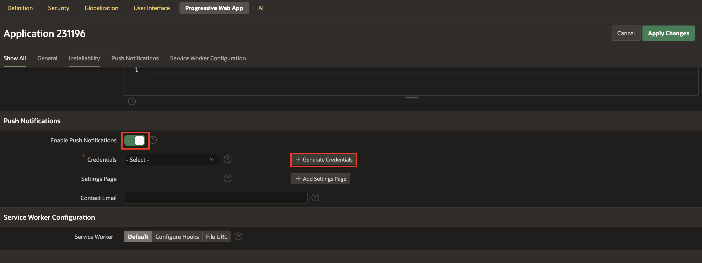
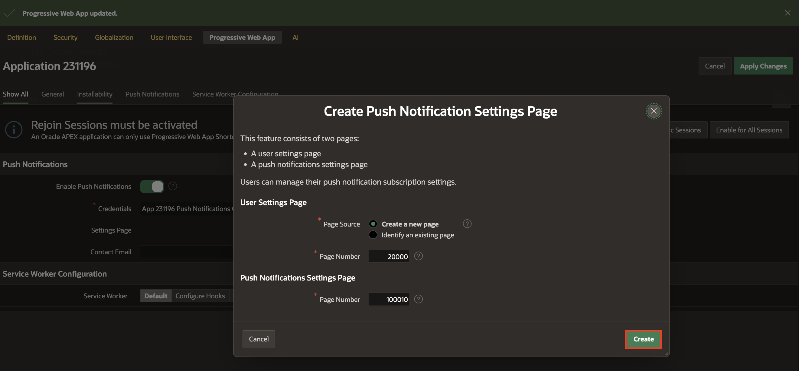
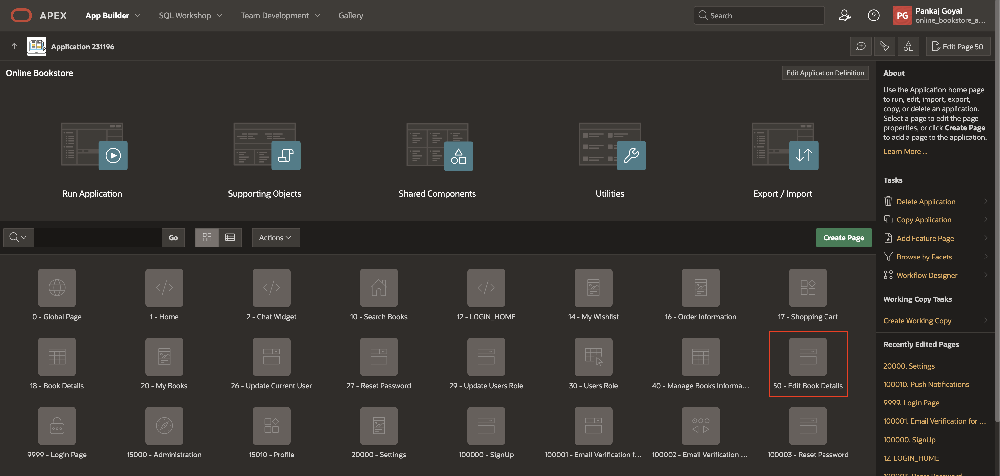
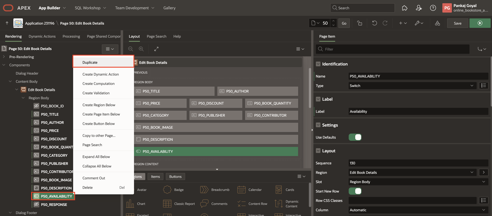
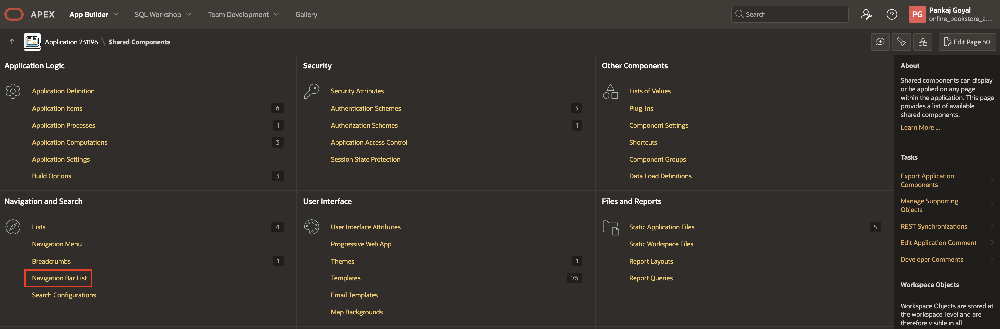
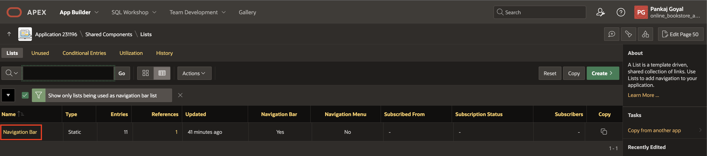
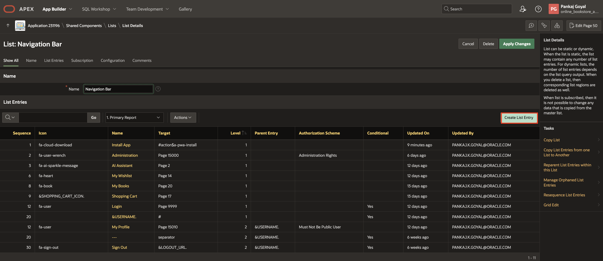
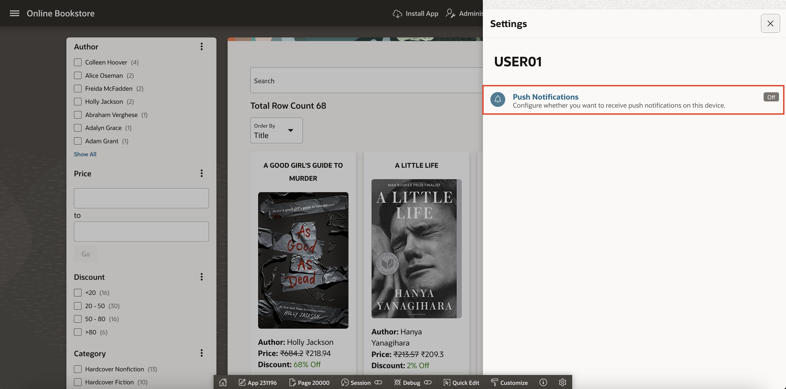
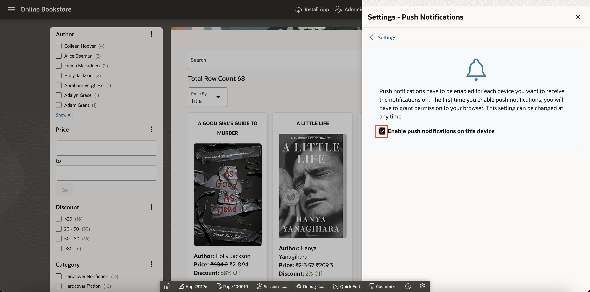

# Configure Push Notification

## Introduction

In this lab, you learn to enable push notifications.

Estimated Time: 5 minutes

### Objectives

In this lab, you will:

- Configure Push Notifications using apex\_pwa.send\_push\_notification api
- Enable End-Users to receive Push Notifications

### Downloads: Missed Previous Labs? Download and Install the Application

If you're stuck or missed out on completing the previous labs, don't worry! Click [here](https://c4u04.objectstorage.us-ashburn-1.oci.customer-oci.com/p/EcTjWk2IuZPZeNnD_fYMcgUhdNDIDA6rt9gaFj_WZMiL7VvxPBNMY60837hu5hga/n/c4u04/b/livelabsfiles/o/obs-lab12.zip) to download the export file, which contains everything completed in the previous labs. To run the app, follow the steps described in the [Lab Appendix: Download Instructions](?lab=download-instructions) from Task 2 to Task 6.

## Task 1: Implement Push Notifications

In this task, you will enable Push Notifications for the application and configure them to notify users when a book becomes available. You'll set up Progressive Web App (PWA) settings and implement a process to send notifications.

1. Navigate to **App Builder** and select **Online Bookstore application**.

    

2. Click **Shared Components**.

    

3. Select **Progressive Web App** under **User Interface**.

    

4. Enter/Select the following:

    - Under General:

        - Enable Progressive Web App: **Toggle On**

        - Installable: **Toggle On**

    

    - Under Push Notifications:

        - Enable Push Notifications: **Toggle On**

        - Credentials: Click **+ Generate Credentials** and click **Generate Credentials** in the confirm dialog window.

        - Settings Page: Click **+ Settings Page** and click **Create** in the **Create Push Notifications Settings Page** dialog window

    
    
    
    

    Click **Apply Changes**

    

5. Navigate to the application homepage by clicking the **Application ID**.

    

6. Select Page **50 - Edit Book Details**

    

7. Select **P50\_AVAILABILITY\_YN** under **Edit Book Details** region and update the following:

    - Under Identification:

        - Name: **P50\_AVAILABILITY**

        - Label: **Availability**

    

8. Right-click on **P50\_AVAILABILITY** under **Edit Book Details** region and select **Duplicate**.

    

9. In the Property editor, enter/select the following:

    - Under Identification:

        - Name: **P50\_AVAILABILITY\_OLD**

        - Type: **Hidden**

    - Source > Form Region: **- Select -**

    - Under Default:

         - Type: **Item**

         - Item: **P50_AVAILABILITY**

    

10. Navigate to **Processing** tab, right-click **Processing** and select **Create Process**.

    

11. In the Property editor, enter/select the following:

    - Identification > Name: **Push Notification**

    - Source > PL/SQL Code: Copy and paste the below code:

        ```
        <copy>
        for eachuser in (
            SELECT
                ou.username,
                ob.title,
                ob.author
            FROM
                obs_wishlist ow
            JOIN
                obs_users ou ON ow.user_id = ou.user_id
            JOIN
                obs_books ob ON ow.book_id = ob.book_id
            WHERE
                ob.book_id = :P50_BOOK_ID
        ) loop

        if :P50_AVAILABILITY= 'Y' and :P50_AVAILABILITY_OLD= 'N' then
            apex_pwa.send_push_notification (
                    p_application_id => :app_id,
                    p_user_name      => UPPER(eachuser.username),
                    p_title          => 'Book is available now',
                    p_body           => eachuser.title || ' by ' ||  eachuser.author || ' is now in stock.',
                    p_target_url     =>  apex_util.host_url || apex_page.get_url(p_page => 1,
                    p_plain_url       =>    true )
                    );
        end if;
        end loop;
        apex_pwa.push_queue;
        </copy>
         ```

    - Execution > Sequence: **20**

    

12. Click **Save**.

Progressive Web App is updated.

## Task 2: Configure Navigation Bar Entries for Settings Page of Push Notification

In this task, you will configure the Navigation Bar to include a Settings option for managing push notifications. This ensures users can easily access notification preferences from the app's navigation menu.

1. Navigate to **Shared Components**.

    

2. Under **Navigation and Search**, click **Navigation Bar List**

    

3. Click **Navigation Bar**.

    

4. Click **Create List Entry**.

    

5. Enter/select the following:

    - Under Entry:

        - Parent List Entry: **&USERNAME.**

        - Sequence: **1**

        - Image/Class: **fa-gear**

        - List Entry Label: **Settings**

    - Target > Page: **20000**

    Click **Create List Entry**.

    

## Task 3: Run the Application

In this task, you will run the application, enable push notifications, and test the feature by updating a book's availability. If the book is on your wishlist, you will receive a push notification when it becomes available.

1. Run the application and enter the credentials below:

      - Username: **user01**

      - Password: **secretPassword**

    

2. In the Online Bookstore App, click on your username at the top-right corner and select **Settings**.

    

3. Push Notifications is disabled by default. Click **Off** and enable the checkbox for **Enable push notifications on this device**.

    

    

4. To receive the push notification, change the availability status from "No" to "Yes" as an admin under Manage Book Information in the Administration section. If the book is in your wishlist, you will receive a push notification.

    

    

## Summary

You now know how to configure push notifications in Oracle APEX. This allows you to send real-time alerts and updates to users, enhancing communication and engagement.

You are now ready to move on to the next lab!

## Acknowledgements

- **Author**: Pankaj Goyal, Member Technical Staff
- **Last Updated By/Date**: Pankaj Goyal, Member Technical Staff, March 2025