# Integrate AI Vision to Enhance Book Search

## Introduction

In this lab, you will learn to create REST Data Sources, automations, and triggers. These components enable seamless API integration, automate tasks, and trigger actions based on events, enhancing application efficiency and responsiveness. Additionally, the combination will automatically engage the Oracle AI Vision service to analyze the content of the book cover image, generating a textual description of its contents. This enhances the customer's ability to find the book they are looking for through improved search functionality.

Estimated Time: 10 minutes

### Objectives

In this lab, you:

- Create REST Data Source
- Create Automation
- Create Trigger

### Downloads: Missed Previous Labs? Download and Install the Application

If you're stuck or missed out on completing the previous labs, don't worry! Click [here](https://c4u04.objectstorage.us-ashburn-1.oci.customer-oci.com/p/EcTjWk2IuZPZeNnD_fYMcgUhdNDIDA6rt9gaFj_WZMiL7VvxPBNMY60837hu5hga/n/c4u04/b/livelabsfiles/o/obs-lab13.zip) to download the export file, which contains everything completed in the previous labs. To run the app, follow the steps described in the [Lab Appendix: Download Instructions](?lab=download-instructions) from Task 2 to Task 7.

## Task 1: Integrating with Object Detection and Text Detection

In this task, you will create a REST Data Source using the OCI Vision REST API as the endpoint to enable object and text detection in your application.

1. Navigate to the application home page and click **Shared Components**.

   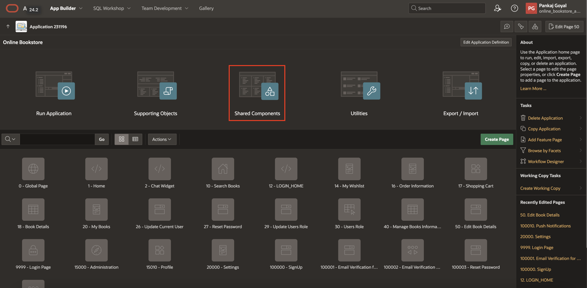

2. Under Data Sources, click **REST Data Sources**.

   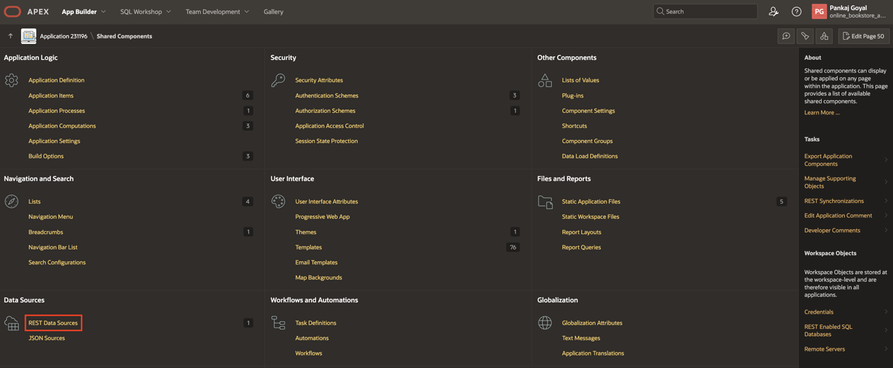

3. Click **Create**.

   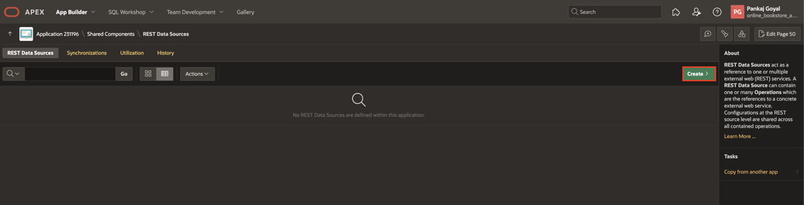

4. Select **From scratch** and click **Next**.

   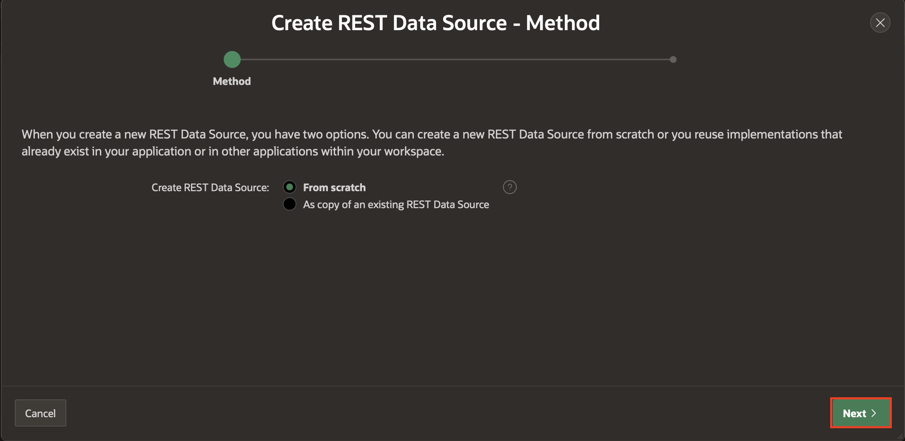

5. Under Create REST Data Source, enter the following attributes and click **Next**.

    - **REST Data Source Type**: Oracle Cloud Infrastructure (OCI)

    - **Name**: OCI Vision

    - **URL Endpoint**: https://vision.aiservice.us-ashburn-1.oci.oraclecloud.com/20220125/actions/analyzeImage

    **Note**: URL Endpoint may differ based on your OCI tenancy. Refer to the following link for more details- https://docs.oracle.com/en-us/iaas/api/#/en/vision/20220125

   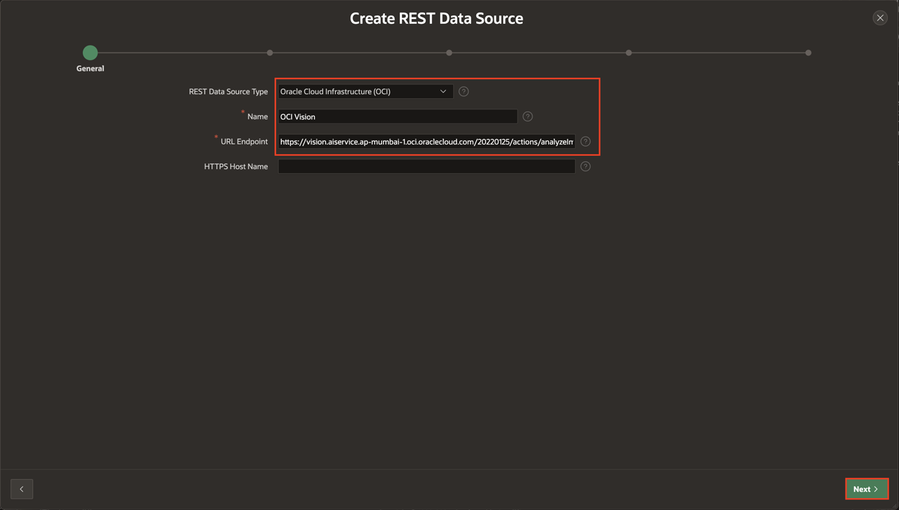

6. Under Create REST Data Source - Remote Server, click **Next**.

   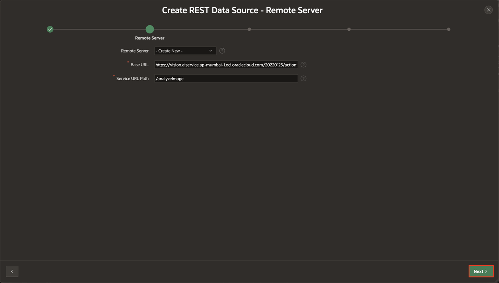

7. Under Authentication,

    - **Authentication Required**: Toggle the button to **ON**

    - **Credentials**: apex\_ai\_cred

8. Click **Create REST Source Manually**.

   The REST data source is created successfully. The next step is to configure the POST operation parameters for this REST Data Source.

   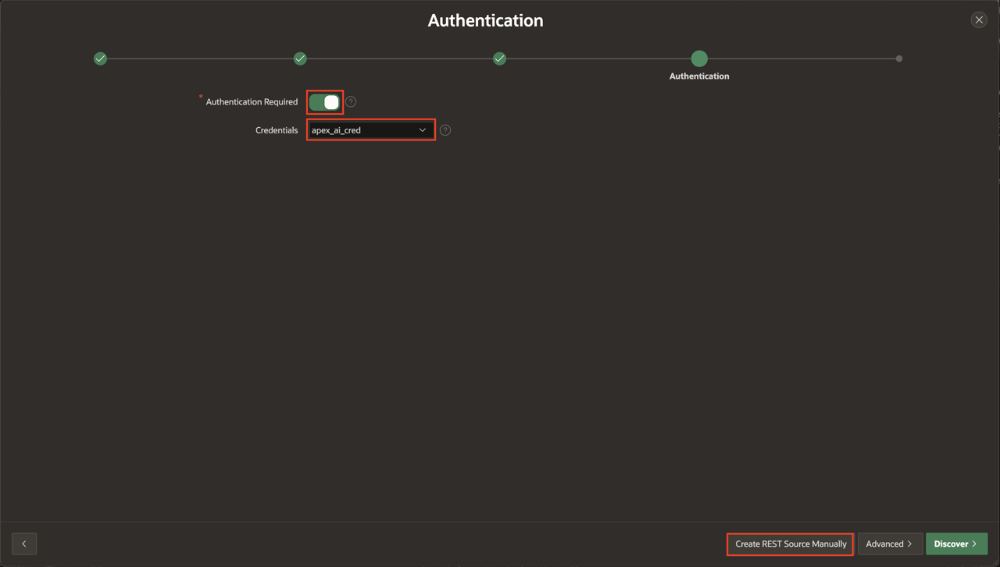

9. On the REST Data Sources page, click **OCI Vision**.

   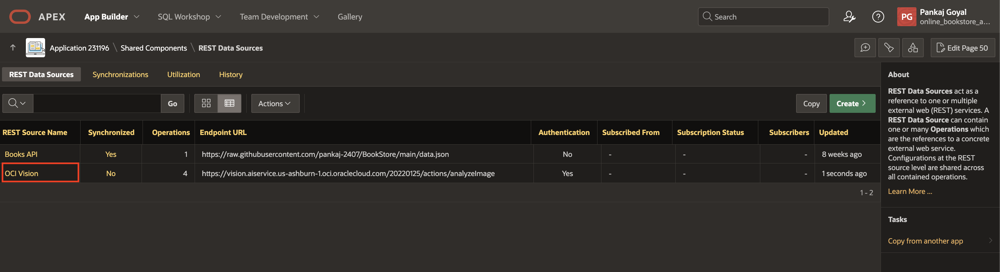

10. Select the Operations tab, click **Edit icon** for the POST operation and enter the following:
    - **Database Operation**: **-Not Mapped-**

    - **Request Body Template**: Copy and paste the JSON given below.

     ```
    <copy>
    {
        "compartmentId": "#COMPARTMENT_ID#",
        "image": {
        "source": "INLINE",
        "data": "#FILE_DATA#"
    },
    "features": [
    {
            "featureType": "#FEATURE_TYPE#",
            "maxResults": 5
        }
        ]
    }
    </copy>
    ```

    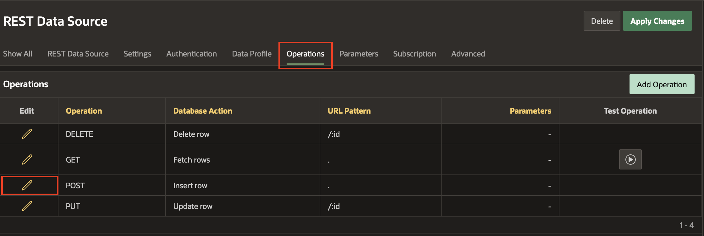

    *NOTE: These are the default operations provided by the OCI AI Vision service, for this HOL we will be using only the POST operation.*

    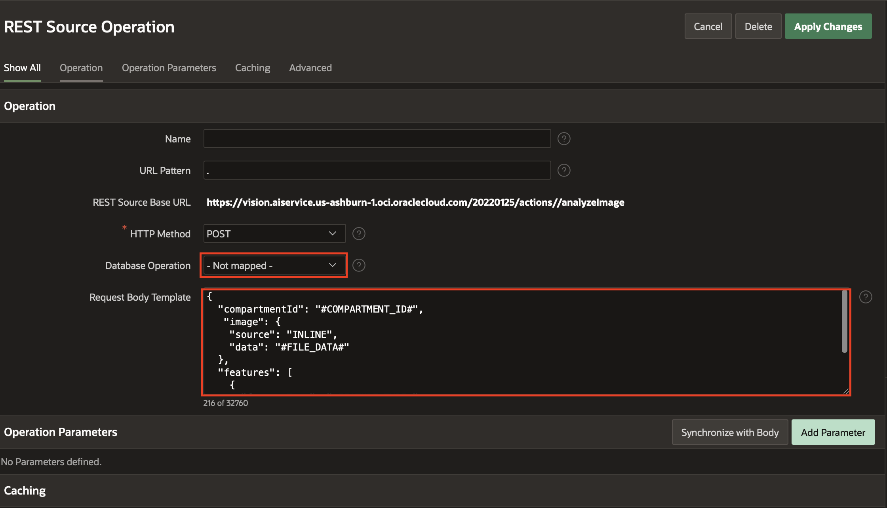

11. Under Operation Parameters, click **Synchronize with Body** and click **OK**.

    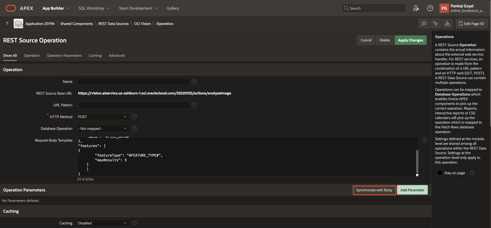

    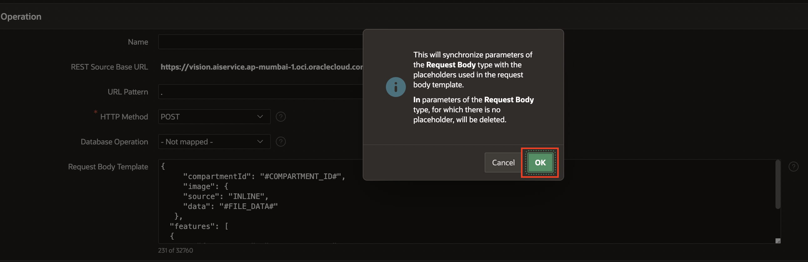

12. Under Operation Parameters, click **Add Parameter**.

    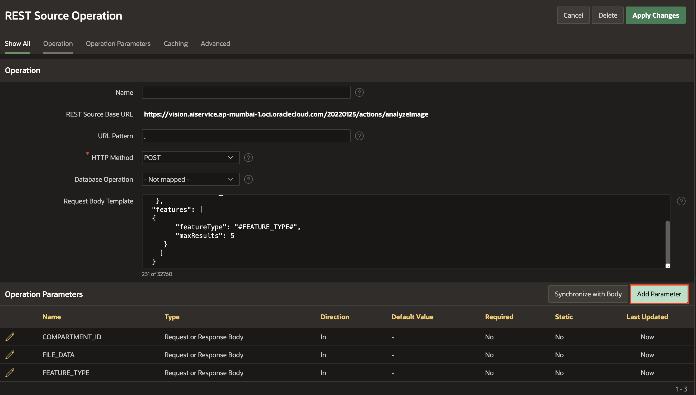

13. In the **Edit REST Data Source Parameter** dialog, add the following two parameters one after the other:

    |   | Type | Name | Direction | Default Value | Static |
    |---|-------|------|----------| --------------| ------ |
    | 1 | Request or Response Body| RESPONSE | Out |
    | 2 | HTTP Header| Content-Type | In | application/json | ON
    {: title="List of POST Operation Parameters"}

    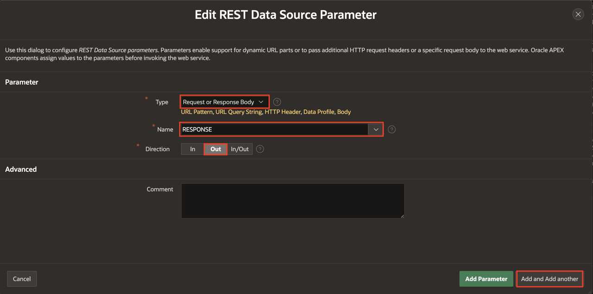

    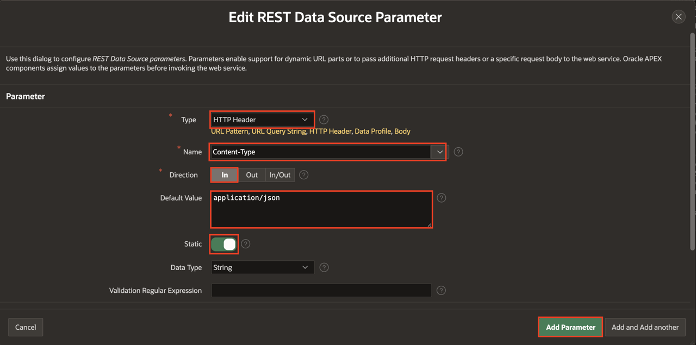

14. Click **Apply Changes**.

    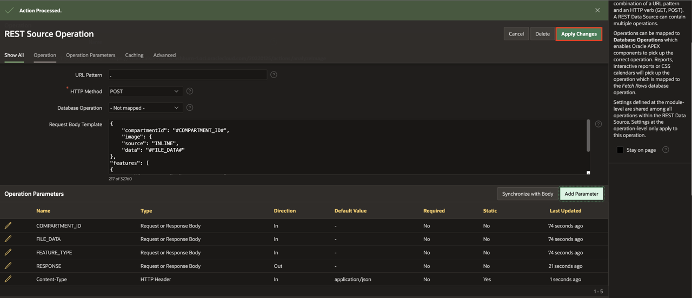

## Task 2: Create Automation

In this task, we will create an automation in Oracle APEX that updates the object\_det and text\_det columns of the obs\_books table. This automation will be triggered whenever book details are updated. To ensure efficiency, we will add a WHERE clause so that the automation executes only when the book_image column is modified. If no rows meet this condition, the automation will exit immediately without performing any unnecessary operations.

1. Navigate to **Shared Components** and under **Workflows and Automations**, select **Automations**.

    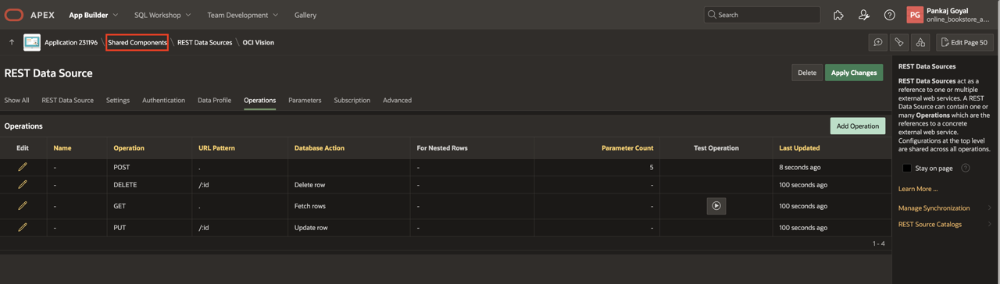

    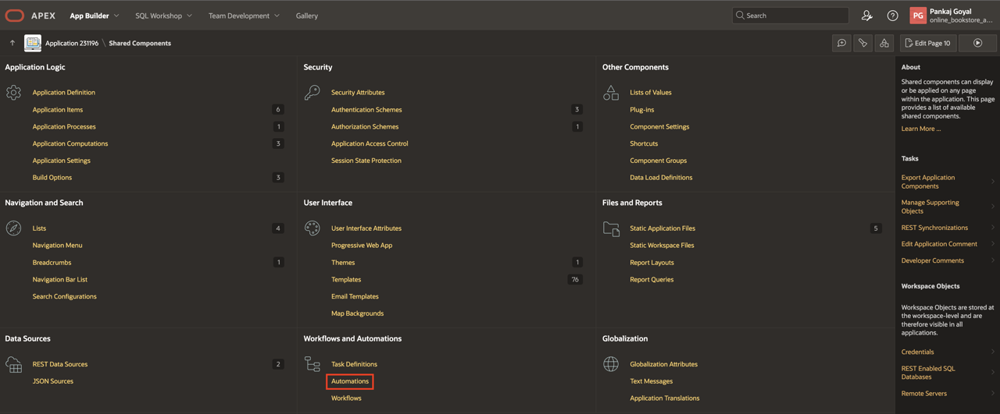

2. Click **Create**.

    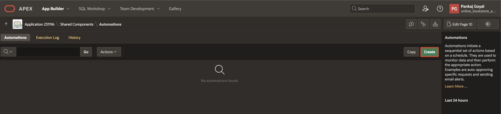

3. In the Create Automation wizard, enter/select the following and click **Next**:

    - Name: **Index Book Cover With OCI Vision**

    - Type: **On demand**

    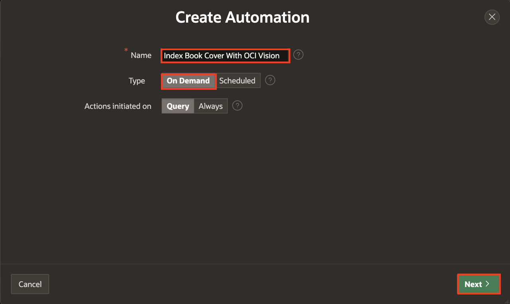

4. In the **Create Automation Page**, select **OBS\_BOOKS(table)** in the **Table/View Name** and click **Create**

    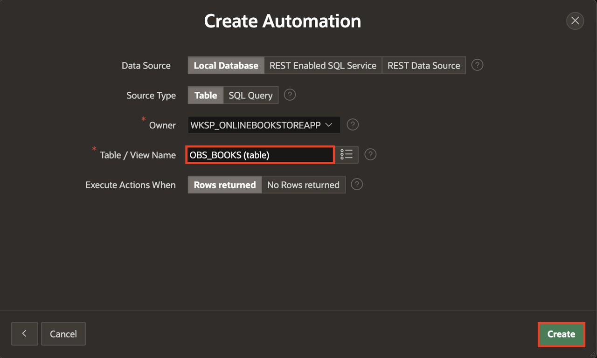

5. Enter/Select the following:

    - Source > Where Clause: **(OBJECT\_DET IS NULL OR TEXT\_DET IS NULL) AND BOOK\_IMAGE IS NOT NULL**

    - Under Action Execution:

        - Commit: **Each Row**

        - Action Error Handling: **Terminate Automation**

    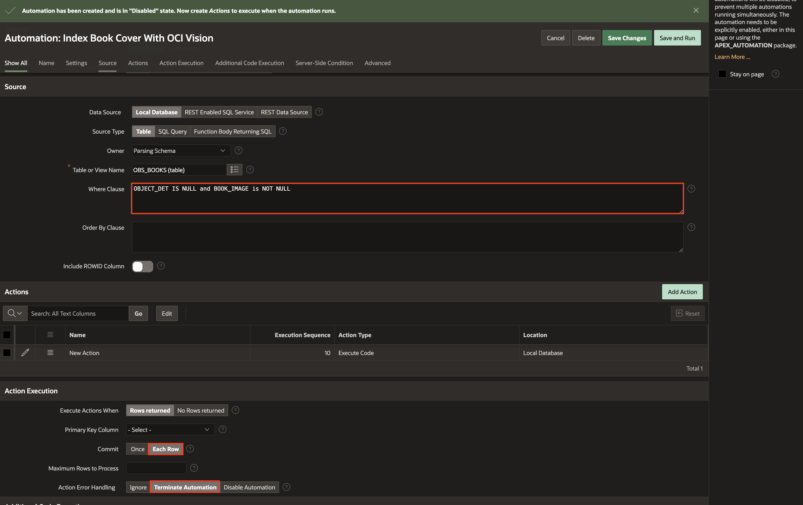

    - Under Action > Click **edit icon** and update the following

        - Name: **Invoke REST Data Source**

        - Code: Copy and Paste the JSON given below and replace **#COMPARTMENT\_ID#** with your **COMPARTMENT\_ID** at two places in the below query

            ```
            <copy>
            DECLARE
                l_params apex_exec.t_parameters;
                l_file_data clob;
                l_response clob;
                l_response_text clob;
            BEGIN
                    -- Retrieve binary image data (BLOB) from the book cover image URL
                    -- using an HTTP GET request, then convert it to a Base64-encoded CLOB
                    l_file_data:=   replace(replace(apex_web_service.blob2clobbase64(apex_web_service.make_rest_request_b(
                            p_url => :book_image,
                            p_http_method => 'GET')), chr(10),''),chr(13),'');

                apex_exec.add_parameter( l_params, 'COMPARTMENT_ID', '#COMPARTMENT_ID#');
                apex_exec.add_parameter( l_params, 'FEATURE_TYPE', 'IMAGE_CLASSIFICATION' );
                apex_exec.add_parameter( l_params, 'FILE_DATA',l_file_data  );

                apex_exec.execute_rest_source(
                    p_static_id        => 'oci_vision',
                    p_operation        => 'POST',
                    p_parameters       => l_params );

                l_response := apex_exec.get_parameter_clob(l_params,'RESPONSE');

                    apex_exec.add_parameter( l_params, 'COMPARTMENT_ID', '#COMPARTMENT_ID#');
                    apex_exec.add_parameter( l_params, 'FEATURE_TYPE', 'TEXT_DETECTION' );
                    apex_exec.add_parameter( l_params, 'FILE_DATA',l_file_data  );

                apex_exec.execute_rest_source(
                    p_static_id        => 'oci_vision',
                    p_operation        => 'POST',
                    p_parameters       => l_params );

                l_response_text := apex_exec.get_parameter_clob(l_params,'RESPONSE');

                apex_automation.log_warn( 'length of response: '||dbms_lob.getlength (l_response_text) );

                UPDATE OBS_BOOKS
                SET
                object_det = (
                    SELECT
                        LISTAGG(obj_name, ',') WITHIN GROUP(
                        ORDER BY
                            obj_name
                        )
                    FROM
                        JSON_TABLE ( l_response, '$.labels[*]'
                            COLUMNS
                                obj_name VARCHAR2 ( 100 ) PATH '$.name[*]'
                        )
                )
                ,
                text_det = (
                    SELECT
                        LISTAGG(obj_name, ',') WITHIN GROUP(
                        ORDER BY
                            obj_name
                        )
                    FROM
                        JSON_TABLE ( l_response_text, '$.imageText.words[*]'
                            COLUMNS
                                obj_name VARCHAR2 ( 100 ) PATH '$.text[*]'
                        )
                )
                WHERE
                BOOK_ID = :BOOK_ID;

            END;
        </copy>
        ```

    Click **Apply Changes**

    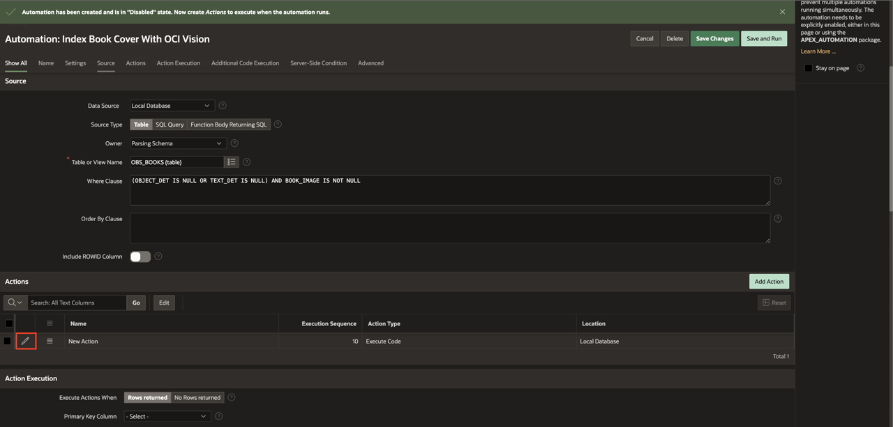

    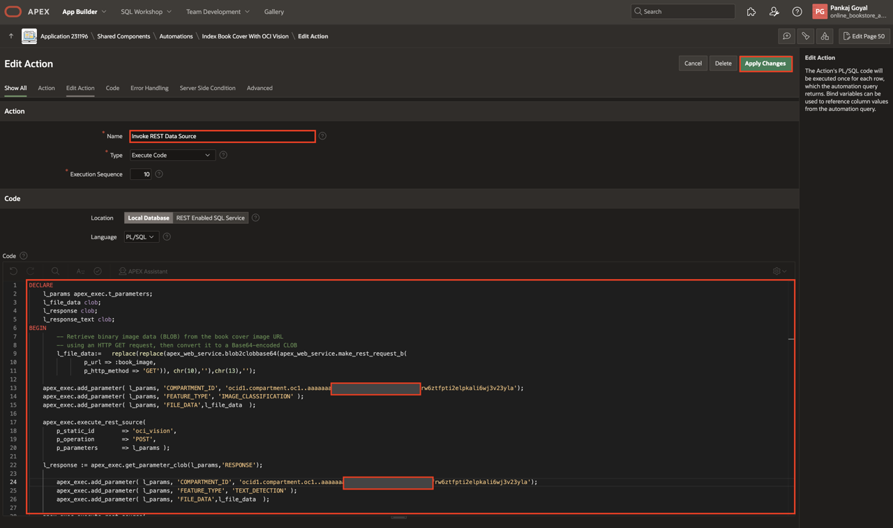

6. Click **Save and Run**

    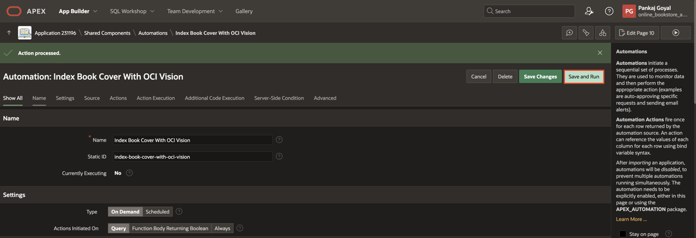

7. Navigate to the application homepage by clicking the **Application ID**.

    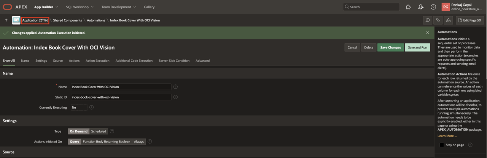

8. Select Page **10 - Search Books**

    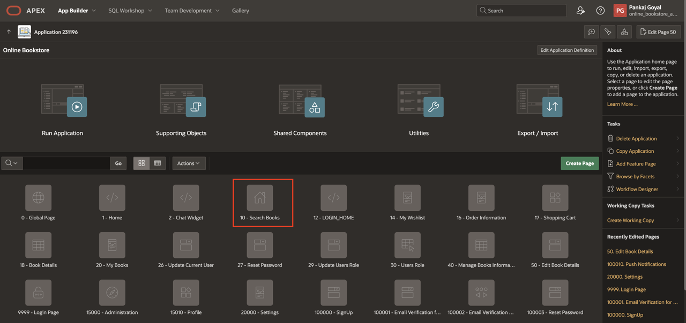

9. In the rendering tab, select **P10\_SEARCH** under **Facets**.

10. Under Source update Database Column(s): **TITLE,AUTHOR,PUBLISHER,CONTRIBUTOR,CATEGORY,OBJECT\_DET,TEXT\_DET** and click **Save**

    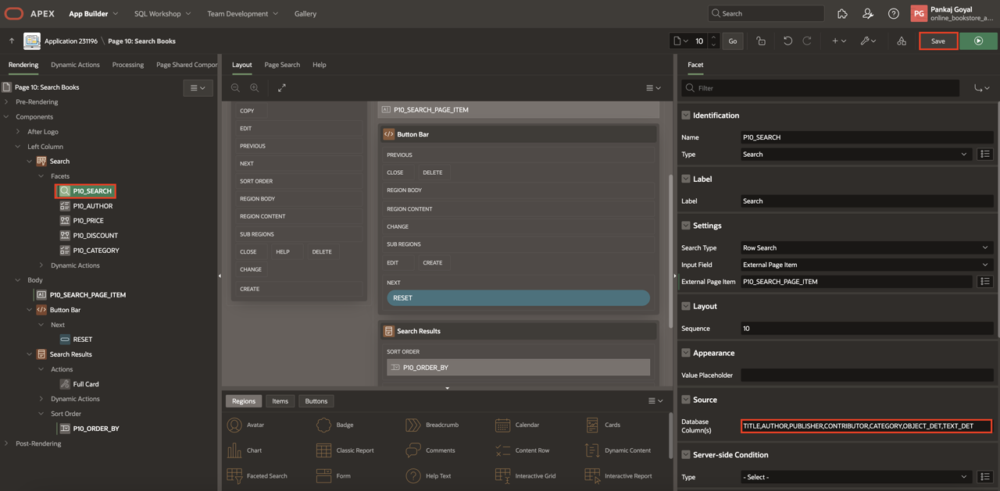

11. Click the page selector and select page **50 - Edit Book Details**.

    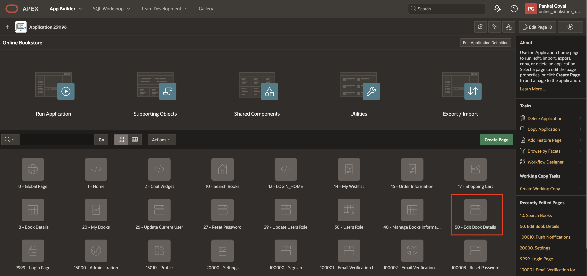

12. Navigate to **Processing** tab, right-click **Processing** and click **Create Process**.

    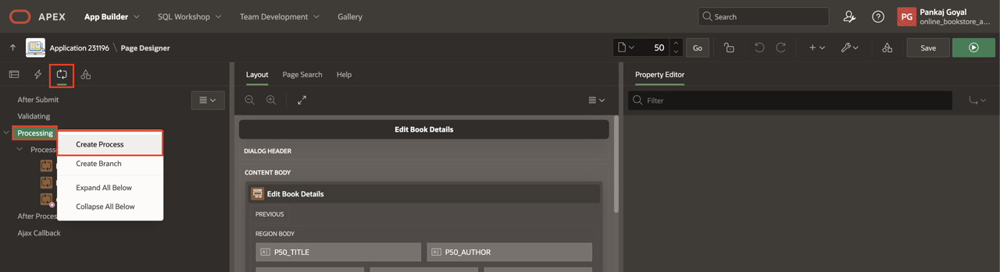

13. In the Property editor, enter/select the following:

    - Identification > Name: **Call OCI Vision Automation**

    - Source > PL/SQL Code: Copy and Paste the below code:

        ```
        <copy>
        apex_automation.execute(
            p_static_id       => 'index-book-cover-with-oci-vision' );
        </copy>
         ```
    - Execution > Sequence: **30**

    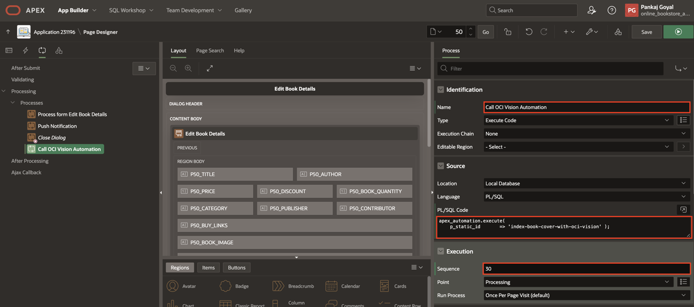

14. Click **Save**.

## Task 3: Create a trigger

In this task, you will create a trigger that resets object and text detection fields whenever a book image is updated. This ensures that changes to book images trigger reprocessing.

1. Navigate to **Object Browser** via **SQL Workshop**

    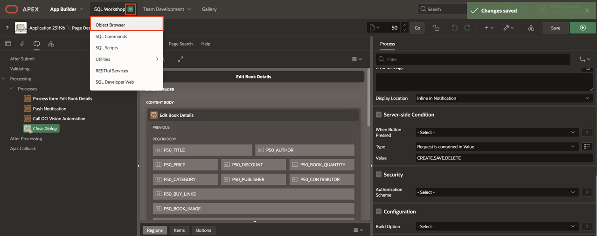

2. In the object tree, right-click **Triggers** and select **Create Trigger**

    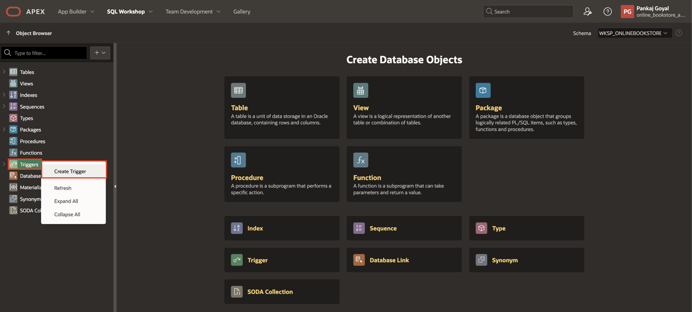

3. Enter/Select the following and click **Create Trigger**

    - Table: **OBS\_BOOKS**

    - Firing Point: **Before**

     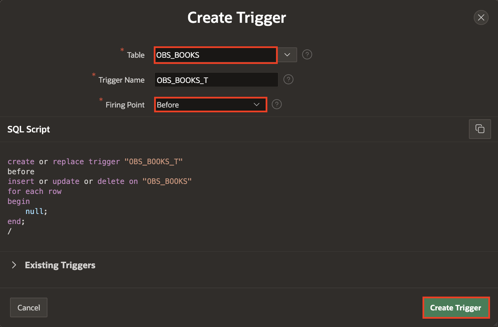

4. Replace the existing code with the below code:

    ```
    <copy>
    CREATE OR REPLACE TRIGGER OBS_BOOKS_T
    BEFORE UPDATE ON OBS_BOOKS
    FOR EACH ROW
    BEGIN
    -- Reset object_det and text_det if book_image changes
    IF :NEW.book_image != :OLD.book_image THEN
        :NEW.object_det := NULL;
        :NEW.text_det := NULL;
    END IF;
    END;
    /
    </copy>
        ```

5. Click **Save and Compile**

     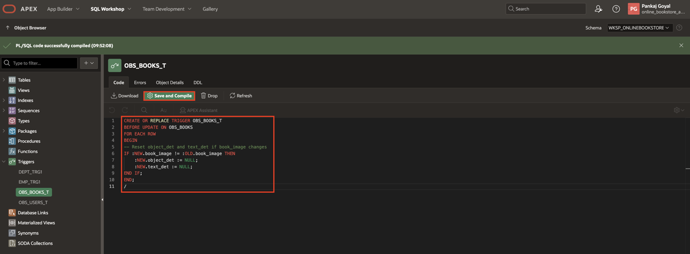

## Task 4: Run the Application

In this task, you will run the application and test the enhanced search functionality, which now includes text and object detection from book covers. This allows users to find books based on cover content.

1. Run the application and enter the credentials below:

      - Username: **user01**

      - Password: **secretPassword**

    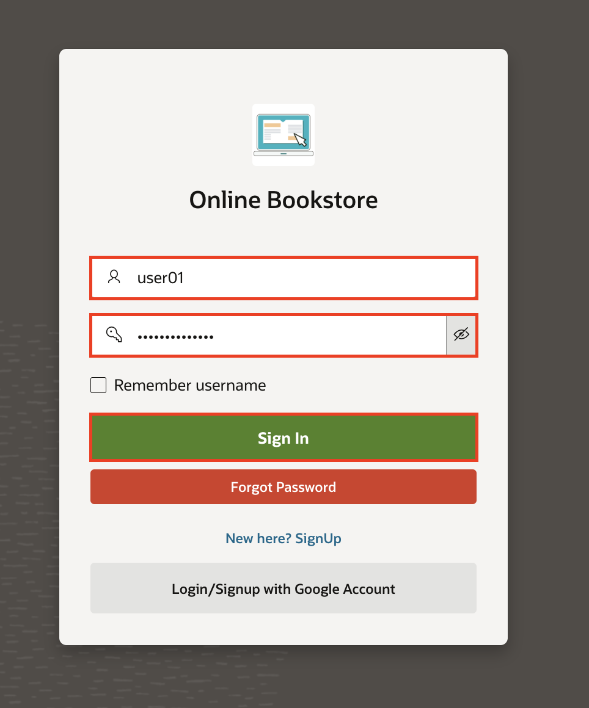

2. Now, our search bar on the homepage will also work for text on book covers. For example, search for **Murder**.

    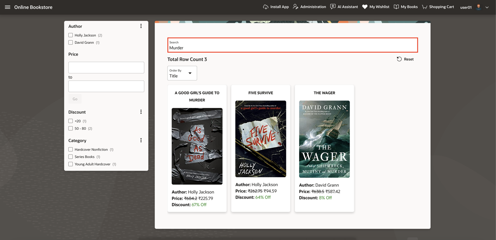

3. Now, our search bar on the homepage will also work for objects on book covers. For example, search for **Animal**.

    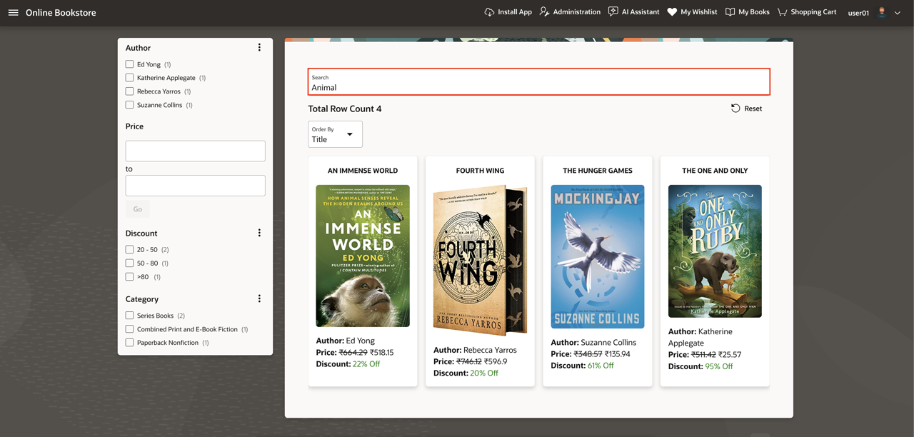

## Summary

You now know how to configure REST Data Sources, set up automations, and define triggers in Oracle APEX. These skills enable you to integrate external data, automate tasks, and respond to events efficiently.

You are now ready to move on to the next lab!

## Acknowledgements

- **Author**: Pankaj Goyal, Member Technical Staff
- **Last Updated By/Date**: Pankaj Goyal, Member Technical Staff, March 2025