# Integrate Razorpay Payment Gateway

## Introduction

In this lab, you will create a Razorpay key in test mode (free of cost). You will set up Web Credentials, create a REST Data Source, and integrate a Payment Gateway. These steps will enable secure communication with APIs and external systems, enhancing the functionality of your applications.

Estimated Time: 20 minutes

### Objectives

In this lab, you will:

- Create Web Credential
- Create REST Data Source
- Integrate Payment Gateway

### Downloads: Missed Previous Labs? Download and Install the Application

If you're stuck or missed out on completing the previous labs, don't worry! Click [here](https://c4u04.objectstorage.us-ashburn-1.oci.customer-oci.com/p/EcTjWk2IuZPZeNnD_fYMcgUhdNDIDA6rt9gaFj_WZMiL7VvxPBNMY60837hu5hga/n/c4u04/b/livelabsfiles/o/obs-lab14.zip) to download the export file, which contains everything completed in the previous labs. To run the app, follow the steps described in the [Lab Appendix: Download Instructions](?lab=download-instructions) from Task 2 to Task 8.

## Task 1: Create Web Credential

In this task, you will generate an API key in Test Mode on the Razorpay dashboard and use it to create a web credential in your workspace for secure authentication and seamless integration of the demo payment gateway.

1. Login/Signup to your Razorpay Dashboard [console](https://dashboard.razorpay.com/signin?screen=sign_in).

2. Select the **Test** mode from (Test or Live) to generate the API key.

    *Note: Test Mode is a simulation mode that allows you to test your integration flow without processing real payments. Once your integration is complete, switch to Live Mode, generate live mode API keys, and replace the test mode keys to start accepting customer payments.*

3. Navigate to **Account & Settings** → API Keys (under Website and app settings) → Generate Key to generate key for the selected mode.

4. The **Key Id** and **Key Secret** appear on a pop-up page. Save these IDs. We will use them later.

5. Login into your Oracle APEX workspace and on the workspace home page, click **App Builder**.

    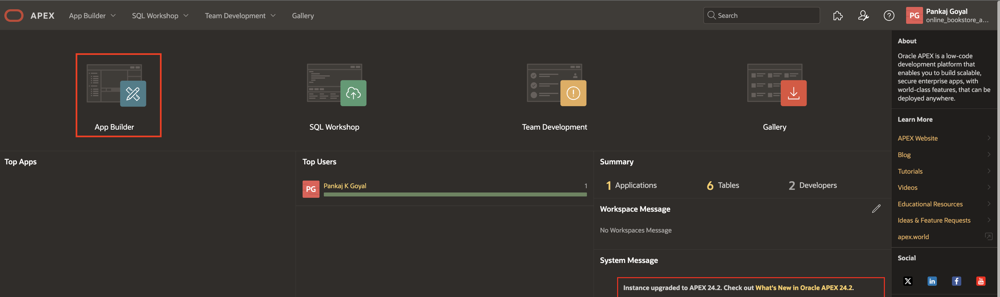

6. Click **Workspace Utilities**.

    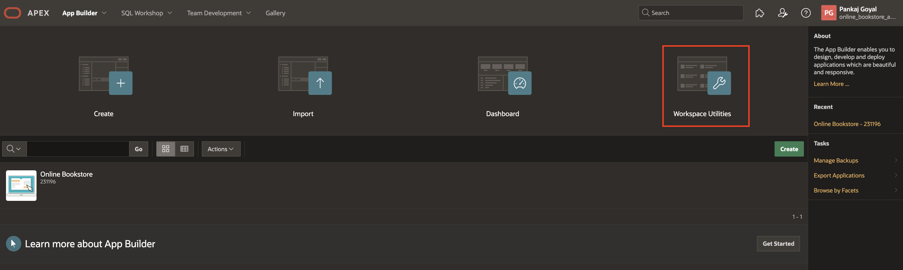

7. Select **Web Credentials**.

    

8. Click **Create**.

    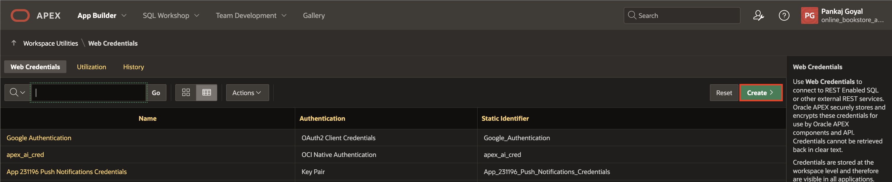

9. In the **Web Credentials** enter the following and click **Create**.

    - Under **Attributes**:

        - Name: Enter **Razorpay API**
        - Authentication Type: Select **Basic Authentication**.
        - Client ID or Username: Enter the **Key Id** you copied in **Step 4**.
        - Client Secret or Password: Enter the **Key Secret** you copied in **Step 4**.
        - Verify Client Secret or Password: Enter the **Key Secret** you copied in **Step 4**.

    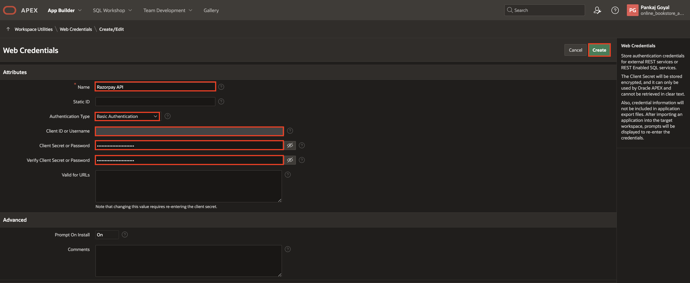

## Task 2: Create REST Data Source

In this task, you will create a REST Data Source to integrate with the Razorpay API, enabling seamless communication for order creation within the application.

1. Navigate to the application home page and click **Shared Components**.

    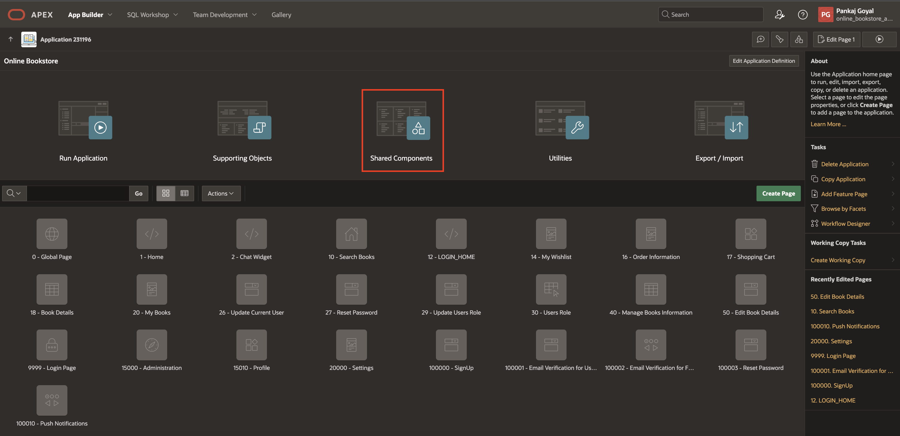

2. Under Data Sources, click **REST Data Sources**.

    

3. Click **Create**.

    

4. Select **From scratch** and click **Next**.

    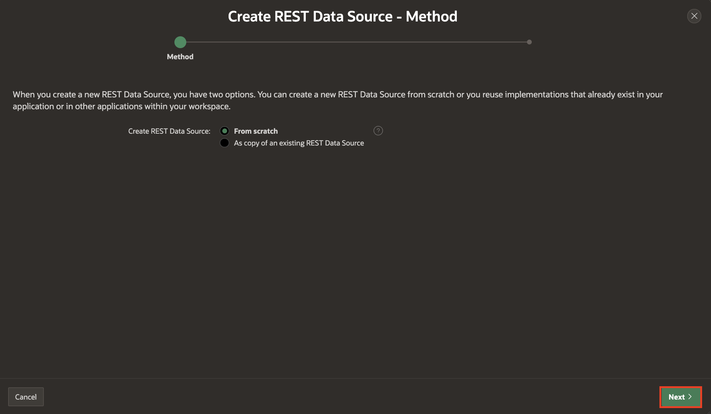

5. Under Create REST Data Source, enter the following attributes and click **Next**.

    - Name: **Razorpay API**

    - URL Endpoint: **https://api.razorpay.com/v1/orders**

    

6. Under Create REST Data Source - Remote Server, click **Next**.

    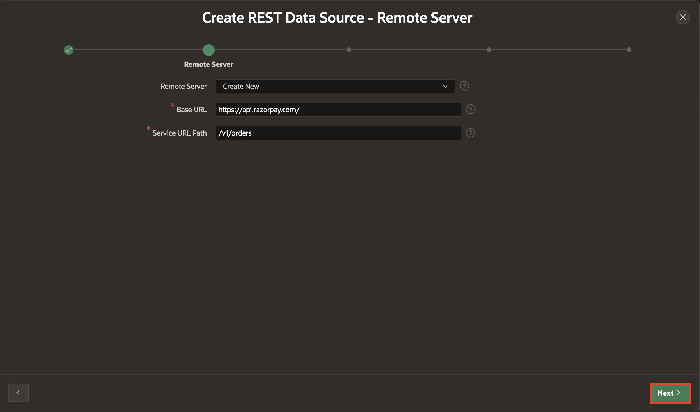

7. Under Create REST Data Source - Settings, click **Next**.

    

8. Under Authentication, select the following below and click **Create REST Source Manually**.

    - Authentication Required: **Toggle On**

    - Credentials: **Razorpay API**

    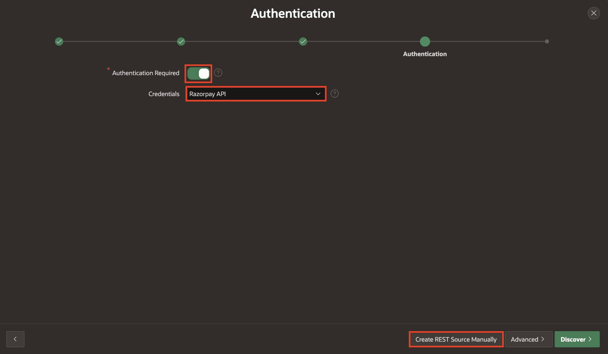

   The REST Data Source is created successfully. The next step is to configure the POST operation parameters for this REST Data Source.

9. On the REST Data Sources page, click **Razorpay API**.

    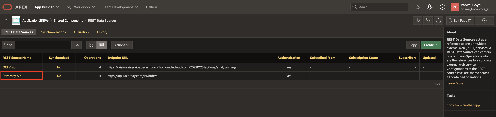

10. Select the Operations tab, click **Edit icon** for the POST operation and enter the following:

    - **Database Operation**: -Not Mapped-

    - **Request Body Template**: Copy and paste the JSON given below.

     ```
    <copy>
    {
    "amount": #AMOUNT#,
    "currency": "INR"
    }
    </copy>
    ```

    

    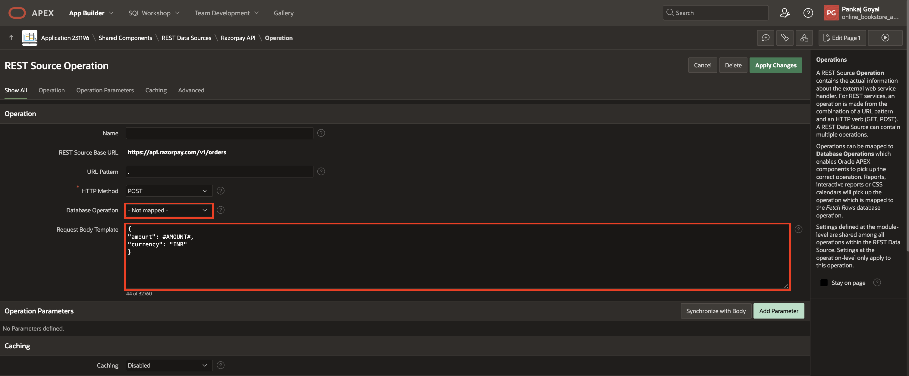

11. Under Operation Parameters, click **Synchronize with body** and click **OK**.

    

12. Under Operation Parameters, click **Add Parameter**.

13. In the **Edit REST Data Source Parameter** dialog, add the following two parameters one after the other:

   |   | Type | Name | Direction | Default Value | Static |
   |---|-------|------|----------| --------------| ------ |
   | 1 | Request or Response Body| RESPONSE | Out |
   | 2 | HTTP Header| Content-Type | In | application/json | ON
   {: title="List of POST Operation Parameters"}

    

    

14. Click **Apply Changes**.

    

## Task 3: Update OBS MANAGE ORDERS Package

In this task, you will update the OBS\_MANAGE\_ORDERS package to include Razorpay payment details while creating orders, ensuring proper order tracking and payment integration.

1. Expand **SQL Workshop** and navigate to **Object Browser**.

     

2. In the object tree, expand **Packages** and select **OBS\_MANAGE\_ORDERS** package.

3. Under **Specification**, replace procedure **create\_order** with the below code:

     ```
     <copy>
    PROCEDURE create_order (
        p_user_id  IN VARCHAR2,
        P_PAYMENT_ID in varchar2,
        p_razorpay_id IN VARCHAR2,
        p_order_id  OUT obs_orders.order_id%TYPE
    );
     </copy>
      ```

   Click **Save and Compile**.

     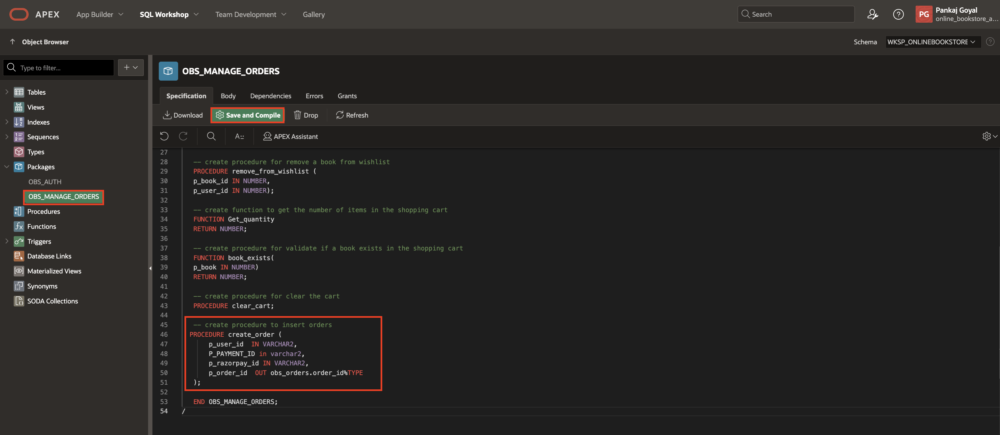

4. Under **Body**, replace procedure **create\_order** with the below code:

    ```
    <copy>
    PROCEDURE create_order (
        p_user_id  IN VARCHAR2,
        P_PAYMENT_ID in varchar2,
        p_razorpay_id IN VARCHAR2,
        p_order_id  OUT obs_orders.order_id%TYPE
    )
    IS
    BEGIN
        INSERT INTO obs_orders
            (order_datetime,
            user_id,
            PAYMENT_ID,
            razorpay_id)
    VALUES   (SYSDATE,
                p_user_id,
                P_PAYMENT_ID,
                p_razorpay_id)
    returning order_id INTO p_order_id;
    IF apex_collection.collection_exists (p_collection_name => 'BOOKS')
    THEN
        INSERT INTO obs_order_items
            (order_id,
            seq_no,
            book_id,
            price,
            quantity,
            discount,
            added_date,
            added_time)
        SELECT p_order_id,
        seq_id,
        b.book_id,
        b.price,
        n002,
        b.discount,
        Sysdate,
        SYSTIMESTAMP
        FROM  apex_collections a,
        obs_books b
        WHERE collection_name = 'BOOKS'
        AND b.book_id = a.n001;
    END IF;
    apex_collection.delete_collection(p_collection_name => 'BOOKS');
    END create_order;
    </copy>
    ```

   Click **Save and Compile**.

     

## Task 4: Integrate Payment Gateway in Shopping Cart Page

This task integrates the Razorpay payment gateway into the Shopping Cart page, enabling seamless order processing and payment handling within the application.

1. Navigate to **App Builder** and select **Online Bookstore Application**.

    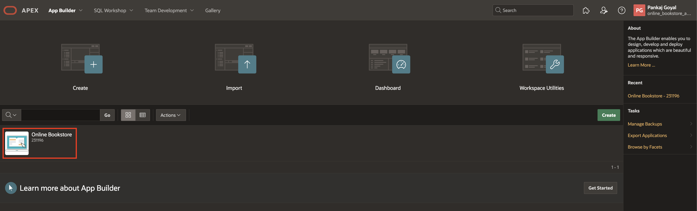

2. Click Page **17 - Shopping Cart**

    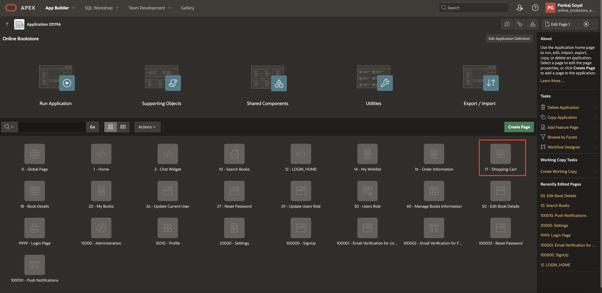

3. Right-click **Order Information** and create the following three page items, one after the other:

      | Name            |  Type   |  Value Protected |
      | --------------- |  ------ |  --------------- |
      | P17\_RAZORPAY\_ORDER\_ID | Hidden |
      | P17\_PAYMENT\_ID | Hidden | Toggle OFF |
      | P17\_RESPONSE | Hidden |
      {: title="List of Page Items"}

    
    
    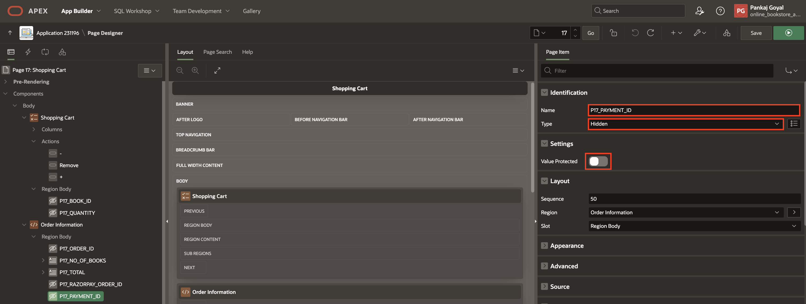
    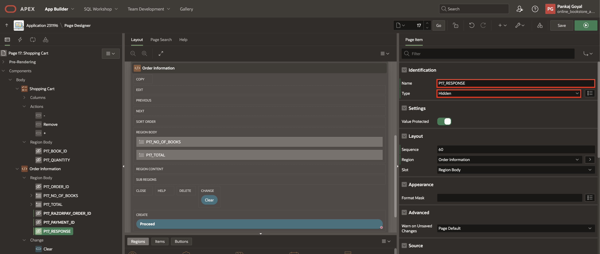

4. Right-click on **Proceed** button and select **Create Dynamic Action**

    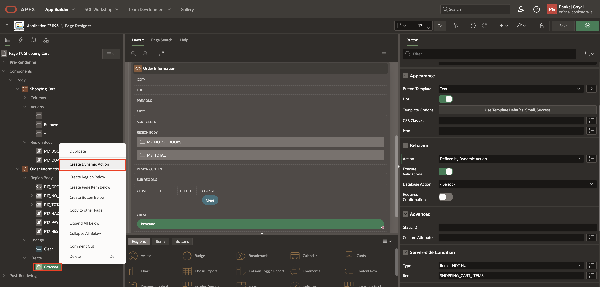

5. In the property editor, under Identification update Name: **run_pay**

    

6. Select **True** action and in the property editor, enter/select the following:

    - Identification > Action: **Submit Page**

    - Settings > Request/Button Name: **CREATE\_RAZOR\_PAY\_ORDER**

    

7. Navigate to the **Dynamic Actions** tab and right-click on **Page Load** and select **Create Dynamic Action**

    

8. In the property editor, under Identification update Name: **Invoke Razorpay**

    

9. Select **True** action and enter/select the following:

    - Identification > Action: **Execute Javascript Code**

    - Settings > Code: Copy and paste the below code

        ```
        <copy>
        // Options for the Razorpay checkout
        var razorpayId = "&P17_RAZORPAY_ORDER_ID.";
            var amount = apex.item('P17_TOTAL').getValue();
            var options = {
                "amount": amount*100, // Amount in paise (e.g., 50000 paise = Rs 500)
                "name": "Payment Page", // Name of the payment receiver
                "description": "Transaction", // Description of the payment
                "order_id": razorpayId, // Your custom order ID

                // Handler function to be executed after successful payment
                "handler": function(response) {
                    console.log(response)
                    // Set values in Apex items for the response data
                    apex.item("P17_PAYMENT_ID").setValue(response.razorpay_payment_id);
                    apex.item("P17_RAZORPAY_ORDER_ID").setValue(response.razorpay_order_id);
                    apex.page.submit({
                        request : "Proceed",
                        showWait :true
                    }
                        );
                },
                // Pre-filled customer information
                "prefill": {
                    "name": "",
                    "email": "test@example.com",
                    "contact": "9999999999"
                },
                // Additional notes for the payment
                "notes": {
                    "address": "Razorpay Corporate Office"
                },
                // Custom theme color for the Razorpay checkout window
                "theme": {
                    "color": "#3399cc"
                }
            };

            // Create a new Razorpay instance and open the checkout window
            var rzp1 = new Razorpay(options);
            rzp1.on('payment.failed', function(response) {
                // Handle the case where payment fails
                // For example, you can show an error message to the user
            });

            rzp1.open();
        </copy>
        ```

    - Under Client-side Condition:

        - Type: **Item is not null**

        - Item: **P17\_RAZORPAY\_ORDER\_ID**

    

10. Right-click **True** and select **Create TRUE Action**

    

11. In the property editor, enter/select the following:

    - Identification > Action: **Execute Server-side Code**

    - Settings > PL/SQL Code: Copy and paste the below code

        ```
        <copy>
        :P17_RAZORPAY_ORDER_ID := null;
        </copy>
        ```
    

12. Navigate to **Processing** tab, right-click **Processing** and select **Create Process**.

    

13. In the property editor, enter/select the following:

    - Under Identification:

        - Name: **Create Razorpay Order**

        - Type: **Invoke API**

    - Under Settings:

        - Type: **REST Source**

        - REST Source: **Razorpay API**

        - Operation: **POST**

    - Execution > Sequence: **1**

    - Under Server-side Condition:

        - Type: **Request = Value**

        - Value: **CREATE\_RAZOR\_PAY\_ORDER**

    

14. Under **Create Razorpay Order** process, expand **Parameters** and update the following:

    - **Amount**:

        - Under Value:

             - Type: **Function Body**

             - PL/SQL Function Body: Copy and Paste the below code

                ```
                <copy>
                return to_char(TO_NUMBER(:P17_TOTAL) * 100);
                </copy>
                ```

    

    - **RESPONSE**

        - Parameter > Ignore Output: **Toggle Off**

        - Value > Item: **P17\_RESPONSE**

    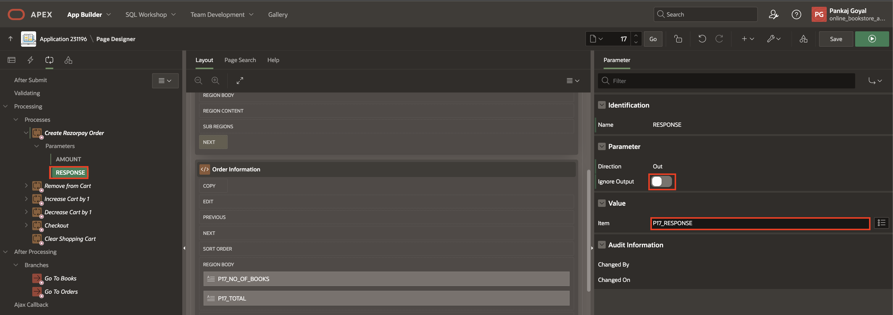

15. Right-click **Processing** and select **Create Process**.

    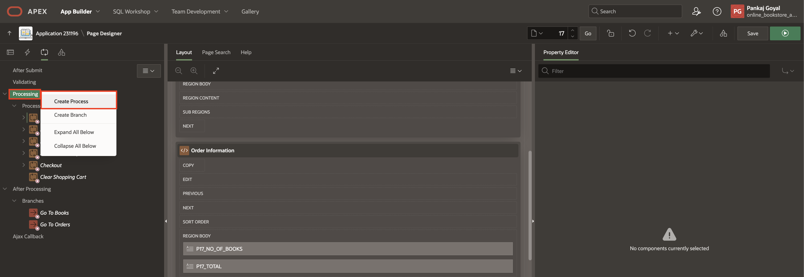

16. In the property editor, enter/select the following:

    - Identification > Name: **Parse  Razorpay\_order\_id**

    - Source > PL/SQL Code: Copy and paste the below code

        ```
        <copy>
        apex_json.parse(:P17_RESPONSE);
        :P17_RAZORPAY_ORDER_ID:= apex_json.get_varchar2(p_path => 'id');
        </copy>
        ```

    - Execution > Sequence: **2**

    - Under Server-side Condition:

        - Type: **Request = Value**

        - Value: **CREATE\_RAZOR\_PAY\_ORDER**

    

17. Right-click **Checkout** process, click **Synchronize Parameters**.

    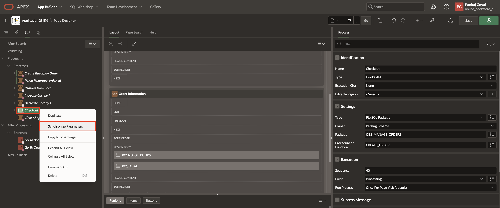

18. Under **Checkout** process, expand **Parameters** and update the following:

    - **p\_user\_id**:

        - Under Value:

            - Type: **Item**

            - Item: **USER\_ID**

    - **p\_order\_id**:

        - Under Value > Item: **P17\_ORDER\_ID**

    - **p\_payment\_id**:

        - Under Value:

            - Type: **Item**

            - Item: **P17\_PAYMENT\_ID**

    - **p\_razorpay\_id**:

        - Under Value:

            - Type: **Item**

            - Item: **P17\_RAZORPAY\_ORDER\_ID**

    

19. Navigate back to the Rendering tab and select **Page 17:Shopping Cart**

20. In the property editor, enter/select the following:

    - JavaScript > File URLs: Copy and paste the below code

        ```
        <copy>
        https://checkout.razorpay.com/v1/checkout.js
        </copy>
        ```

    

21. Click **Save**.

## Task 5: Run the Application

In this task, you will run the application, log in, add items to the shopping cart, and complete a simulated payment using Razorpay's integration. This step ensures the end-to-end functionality of the payment gateway, from order creation to transaction confirmation.

1. Run the application and enter the credentials below:

      - Username: **user01**

      - Password: **secretPassword**

    

2. Click on the books, select the quantity, and click **Add to Cart**,

    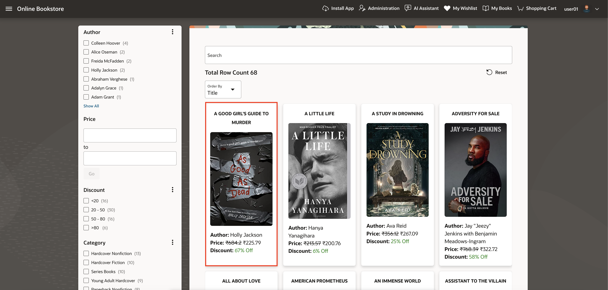

    

    

    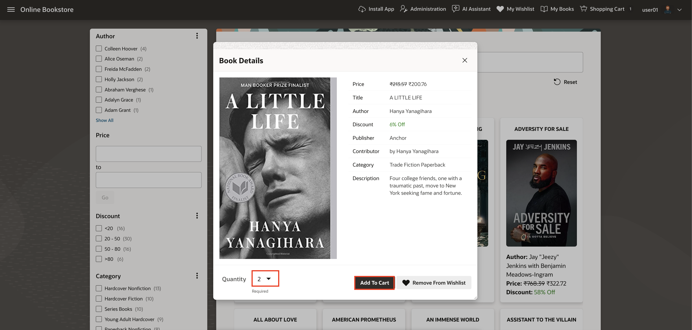

3. On the Navigation Bar, click **Shopping Cart**.

    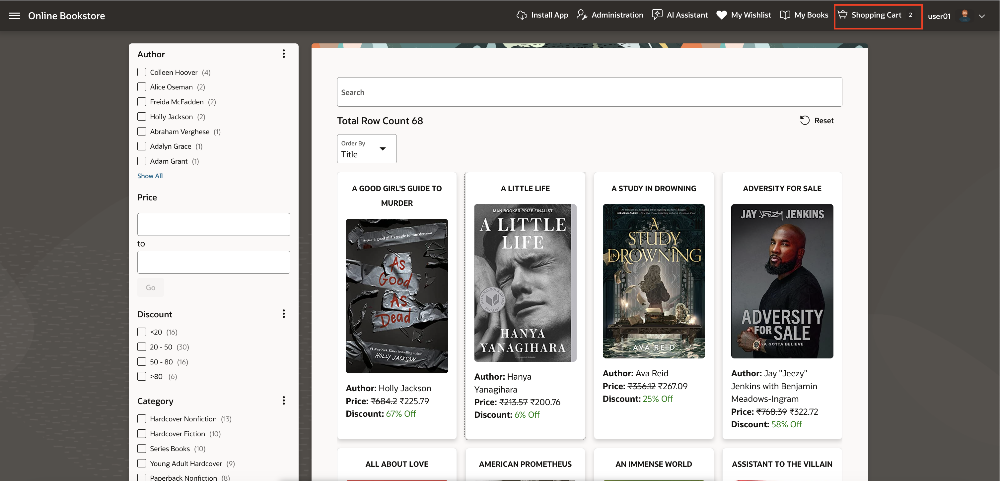

4. Click **Proceed to Purchase**.

    

    

5. To complete the order, select a payment method and enter/select the dummy details.

    

    

    

6. After completing the order, you will be automatically redirected to the Transaction Details page.

    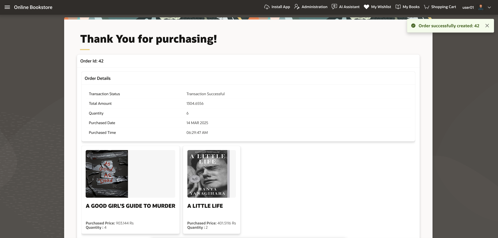

## Summary

You now know how to configure Web Credentials, create REST Data Sources, and integrate a Payment Gateway in Oracle APEX. These skills enable secure API communication and enhance application functionality.

You are now ready to move on to the next lab!

## Acknowledgements

- **Author**: Pankaj Goyal, Member Technical Staff
- **Last Updated By/Date**: Pankaj Goyal, Member Technical Staff, March 2025