# UI Enhancements

## Introduction

In this lab, you will learn to customize and enhance your Oracle APEX application. You will add a footer to improve branding, manage the navigation menu for a better user experience, and implement a global search bar for easier access to information. Additionally, you will configure email templates for sending emails, set a default profile picture for users, and create a "My Orders" page to enhance functionality. These steps will help you build a more user-friendly and efficient application.

Estimated Time: 30 minutes

### Objectives

In this lab, you will:

- Add Footer Text to the App.

- Manage Navigation Menu.

- Integrate Global Search Bar

- Use Email Templates to send Emails.

- Default Profile Picture

- Create My Orders Page

## Downloads: Missed Previous Labs? Download and Install the Application

If you're stuck or missed out on completing the previous labs, don't worry! You can download and install the application as follows:

1. Click [here]() to download the completed application zip file.

2. Import the **online-bookstore-app.zip** file into your workspace. To import the app, go to **App Builder > Import**.

3. Follow the steps in the Install Application wizard to install the app along with the Supporting Objects.

4. All set. Now, run the application and see it in action!.

## Task 1 Add Built with APEX To Footer

In this task, you will update the application's footer to display "Built with APEX" This helps showcase the platform used for development.

1. Navigate to the application homepage and click **Edit Application Definition**.

    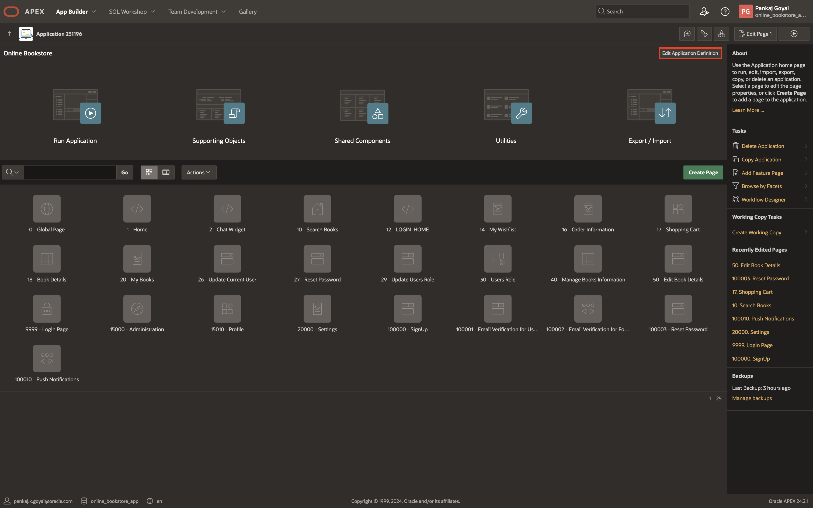

2. Click **User Interface**.

    

3. Click **Attributes** and update Add "Built with APEX" to Footer to **Toggle On** and click **Apply Changes**.

    

4. Run the application.

    

## Task 2: Remove Hamburger Icon (Navigation Menu)

In this task, you will update the user interface settings to remove the hamburger icon and hide the navigation menu for a cleaner layout.

1. Navigate to the application homepage and click **Edit Application Definition**.

    

2. Click **User Interface**.

    

3. Click **Navigation Menu** and update Display Navigation to **Toggle On** and click **Apply Changes**.

    

4. Run the application.

    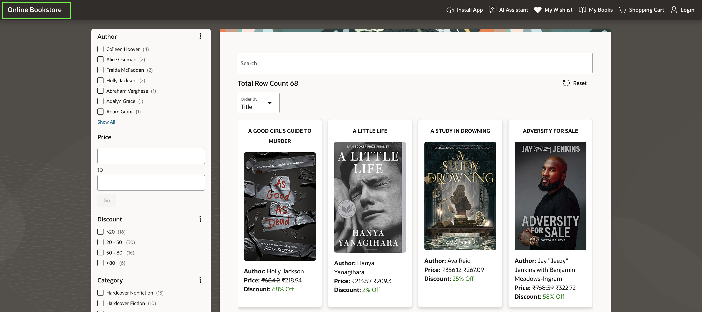

## Task 3: Integrate Global Search

In this task, you will integrate a global search feature that remains accessible across all pages. This will enhance the user experience by allowing seamless navigation and quick access to search functionality.

1. Navigate to the application homepage and click **Shared Components**.

    

2. Click **Application Processes**.

    

3. Click **Create**.

    

4. Enter/select the following:

    - Under Identification:

        - Name: **Redirect to Home on Search**

        - Point: **On Submit: After Page Submission - After Computations and Validations**

       Click **Next**.

    

5. Enter the following:

    - Source > Code: Copy and paste the below code.

        ```
        <copy>
        apex_util.redirect_url(apex_page.get_url(p_page => 10));
        </copy>
        ```

    Click **Next**.

    

6. Enter the following:

    - Condition Type > **Request = Expression 1**

    - Expression > **SEARCH_RELOAD**

    Click **Create Process**.

    

7. Navigate to Application home page by clicking **Application ID**.

    

8. Select page **10 - Search Books**.

    

9. Under **Navigation**, update Warn on Unsaved Changes to **Toggle Off**

    

10. Right-click **P10\_SEARCH\_PAGE\_ITEM** and select **Copy to other Page...**.

    

11. Enter New Page: **0** and click **Next**.

    

12. Enter the following:

    - Item Name > **P0\_SEARCH\_PAGE\_ITEM**

    - Label > **Search Books**

    Click **Copy**.

    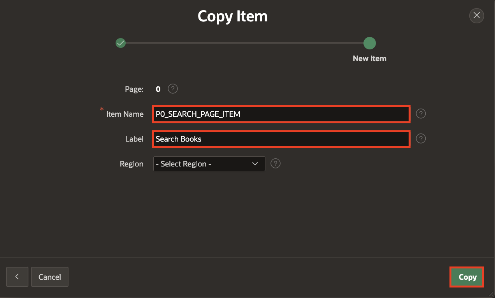

13. Right-click **P10\_SEARCH\_PAGE\_ITEM** and select **Delete**.

    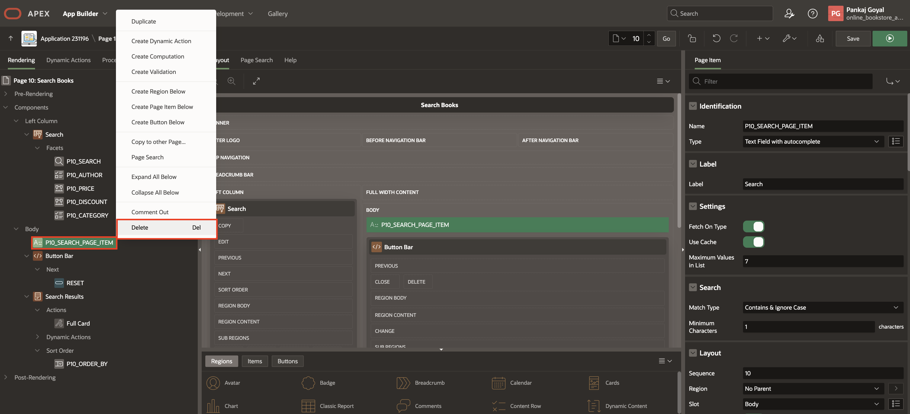

14. Select **P10\_SEARCH**, under **Settings** for External Page Item: enter **P0\_SEARCH\_PAGE\_ITEM**.

    

15. Navigate to **Dynamic Actions** tab, right-click **Events** and select **Create Dynamic Action**.

    

16. Enter/select the following:

    - Identification > Name: **Null Facets Value**

    - Under When:

        - Event: **After Refresh**

        - Selection Type: **Region**

        - Region: **Search**

    

17. Select **True Action** and enter/select the following:

    - Identification > Action: **Executive Server-side Code**

    - Settings > PL/SQL Code: Copy and paste the following code:

        ```
        <copy>
        :P10_SEARCH := null;
        :P10_AUTHOR := null;
        :P10_PRICE := null;
        :P10_DISCOUNT := null;
        :P10_CATEGORY := null;
        :P0_SEARCH_PAGE_ITEM := null;
        </copy>
         ```

    

18. Click **Save**.

19. Navigate to Global Page **Page 0**.

    

20. Select **P0\_SEARCH\_PAGE\_ITEM** and enter/select the following:

    - Layout > Slot: **After Logo**.

    - Under Appearance:

        - Icon: **fa-search**

        - Width: **50**

    - Advanced > Custom Attributes: **style="height:45px;  margin-top: 6px;"**

    

21. Navigate to **Dynamic Actions** tab, right-click **Change** and select **Create Dynamic Action**.

    

22. Enter/select the following:

    - Identification > Name: **SEARCH DA**

    - Under When:

        - Selection Type: **Item(s)**

        - Region: **P0\_SEARCH\_PAGE\_ITEM**

    - Under Server-side Condition:

        - Type: **Current Page!=Page**

        - Page: **10**

    

23. Select **True Action** and enter/select the following:

    - Identification > Action: **Executive Server-side Code**

    - Under Settings:

        - PL/SQL Code: Copy and paste the following code:

            ```
            <copy>
            :P10_SEARCH := :P0_SEARCH_PAGE_ITEM;
            </copy>
            ```

        - Items to Submit: **P0\_SEARCH\_PAGE\_ITEM**

    

24. Right-click **True** and select **Create TRUE Action**.

    

25. Enter/select the following:

    - Identification > Action: **Submit Page**

    - Settings > Request / Button Name: **SEARCH\_RELOAD**

26. Click **Save**

    

27. Navigate to **Shared Components**.

    

28. Under **Navigation and Search**, select **Navigation Bar List**.

    

29. Click **Navigation Bar**.

    

30. Click **Create List Entry**.

    

31. Enter/select the following and click **Create List Entry**.

    - Under Entry:

        - Sequence: **4**

        - Image/Class: **fa-home**

        - List Entry Label: **Home**

    - Target > Page: **10**

    - Under Conditions:

        - Condition Type: **Current Page Is NOT in Expression 1 (comma delimited list of pages)**

        - Expression 1: **10**

    

    

32. Run the application and observe the global search, which will remain visible even after you navigate to any other page.

    

33. Navigate to any other page, e.g., the **My Books** page, and then return to the home page by clicking **Home** entry in the navigation bar or **Online Bookstore**.

    
    

## Task 4: Use Email Templates For Sending Emails

In this task, you will create and configure email templates to standardize the emails sent for user signup and forgot password verification. You will set up placeholders, define the email structure, and implement processes for sending these verification emails.

1. Navigate to the application homepage and click **Shared Components**.

    

2. Click **Email Templates** under **User Interface**.

    

3. Click **Create Email Template**.

    

4. Enter/select the following below

    - Under Identification

        - Template Name: **EmailTemplate**

        - Static Identifier: **EMAILTEMPLATE**

        - Email Subject: **#SUBJECT#**

    - Under HTML Format

        - Header: Copy and paste the below code

            ```
            <copy>
            <table align="center"> <tr> <td>  </td>
            <td align="center"><h1> #TITLE#</h1> </td> </tr></table>
            </copy>
            ```

         - Body: Copy and paste the below code

            ```
            <copy>
            <p>#TARGET_HEADING#</p>
            <a class="footer-button" href="#APP_LINK#">#TARGET#</a>
            <p  style="margin: 0; margin-top: 10px;">Sincerely,</p>
            <p  style="margin: 0;">The Online Bookstore Team</p>
            </copy>
            ```

     - Under Advanced

        - HTML Format: Copy and paste the below code

            ```
            <copy>
            <!DOCTYPE HTML>
            <html>
            <head>
            <meta http-equiv="Content-Type" content="text/html; charset=utf-8">
            <meta name="viewport" content="width=device-width">
            <style>
                body { background-color: #fdfdfd; color: #3e3e3e; margin: 0; padding: 0; min-width: 100%; -webkit-text-size-adjust: none; -ms-text-size-adjust: none; text-size-adjust: none; font-family: -apple-system, BlinkMacSystemFont, "Segoe UI", "Helvetica Neue", Roboto, Helvetica, Arial, sans-serif; line-height: 1.5; -webkit-font-smoothing: antialiased; -moz-osx-font-smoothing: grayscale; }
                table { border: 0; border-spacing: 0; border-collapse: collapse; mso-table-lspace: 0pt; mso-table-rspace: 0pt; }
                table td { padding: 0; vertical-align: top; border-collapse: collapse; }
                table, th, td { line-height: inherit; }
                img { vertical-align: middle; text-decoration: none; outline: none; border: 0; -ms-interpolation-mode: bicubic; }
                table.container { margin-right: auto; margin-left: auto; width: 600px; }
                p { margin: 0 0 20px 0; }
                a, .main a { color: #056abf; }
                @media only screen and (max-width: 612px) {
                .mobile-hide { display: none !important; }
                .stack { display: block !important; width: auto !important; }
                table.container { width: 100% !important; }
                table td { text-align: left !important; }
                }
                .footer-button {
                    display: block;
                    padding: 10px 0;
                    background-color: #000; /* Updated button background color to black */
                    color: #fff !important; /* Updated text color to white */
                    text-decoration: none;
                    border-radius: 4px;
                    text-align: center;
                    width: 100%;
                }
                .footer-button:hover {
                    background-color: #333; /* Darker background color on hover */
                }

            </style>
            </head>
            <body yahoo="fix" style="background-color: #efefef; line-height: 1.5;">
            <table class="body" border="0" width="100%">
            <tr>
                <td align="center" valign="top" style="background-color: #efefef;">
                <center>
                    <table class="container" width="600">
                    <tr>
                        <td style="padding: 12px 6px;">

                        <!-- Header -->
                        <table width="100%" style="background-color: #f8f8f8; border-radius: 4px 4px 0 0">
                            <tr>
                            <td style="text-align: left; padding: 20px 12px; border-bottom: 1px solid #eaeaea;">
                                #HEADER#
                            </td>
                            </tr>
                        </table>
                        <!-- // Header -->

                        <!-- Main Body -->
                        <table width="100%" style="background-color: #ffffff; border-radius: 0 0 4px 4px;">
                            <tr>
                            <td class="main" style="text-align: left; padding: 12px; font-size: 14px;">
                            #BODY#
                            </td>
                            </tr>
                        </table>
                        <!-- // Main Body -->

                        <!-- Footer -->
                        <table width="100%">
                            <tr>
                            <td>
                                #FOOTER#
                            </td>
                            </tr>
                        </table>
                        <!-- // Footer -->

                        </td>
                    </tr>
                    </table>
                </center>
                </td>
            </tr>
            </table>
            </body>
            </html>
            </copy>
            ```

    Click **Create Email template**.

    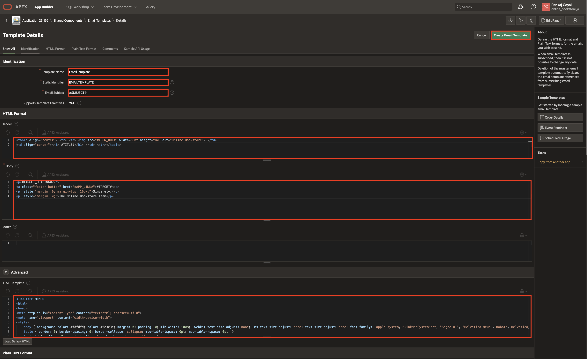

5. Click **Shared Components**

    

6. Click **Static Application Files** under **Files and Reports**.

    

7. Click **Create File**.

    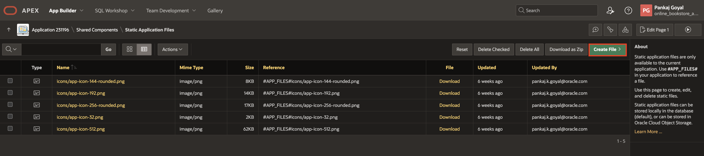

8. Upload the Application Icon with name **Online\_Bookstore\_Icon.png** and click **Create**. Download a sample Application Icon [here](./images/Online_Bookstore_Icon.png).

    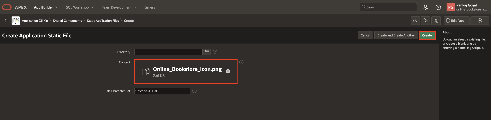

9. Navigate to application home page by clicking **application id**.

    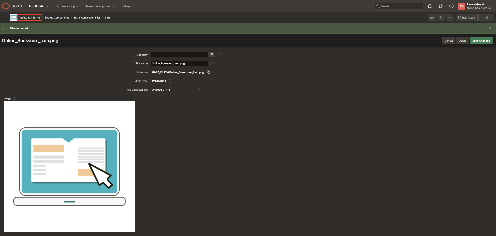

10. Select Page **100001 - Email Verification for User SignUp**.

    

11. Right-click **Body** and select **Create Page Item**.

    

12. Enter/select the following below

    - Under Identification:

        - Name: **P100001_URL**

        - Type: **Hidden**

    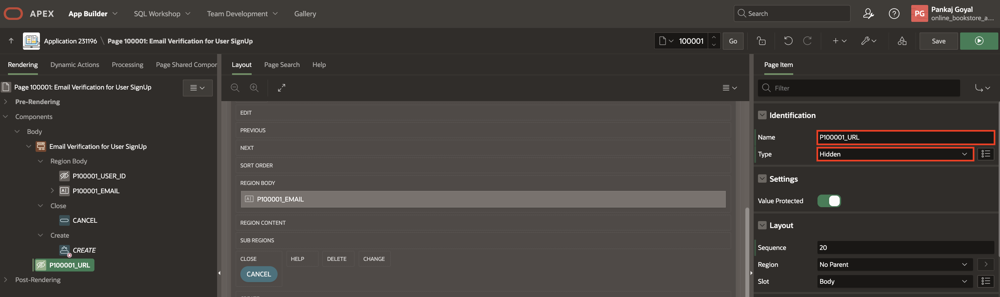

13. Navigate to the processing tab and select **Process form Email Verification for User SignUp** process and under **Success Message** replace **Success Message** with a blank space.

    

14. Select **Send Verification Email** process and under Identification update Type to **Execution Chain**.

    

15. Right-click **Send Verification Email** and select **Add Child Process**.

    

16. Enter/select the following below

    - Identification > Name: **Prepare URL for Email**

    - Source > PL/SQL Code: Copy and paste the below code:

        ```
        <copy>
        :P100001_URL := apex_util.host_url || APEX_PAGE.GET_URL (
        p_page  => 100000,
        p_items => 'P100000_EMAIL',
        p_values => :P100001_EMAIL);
        </copy>
        ```

    

17. Right-click **Send Verification Email** and select **Add Child Process**.

    

18. Enter/select the following below

    - Under Identification:

        - Name: **Send Email Process**

        - Type: **Send E-Mail**

    - Under Settings:

        - From: **noreply.obs@oracle.com**

        - To: **&P100001_EMAIL.**

        - Email Template: **EmailTemplate**

        - Placeholder Values: Click **6 placeholders, 6 unassigned.** and enter the following:

            | Placeholder     |  Item or Value   |
            | --------------- |  ------ |
            | SUBJECT | Welcome to Online Bookstore! |
            | TARGET_HEADING | Please click the link below to create your account: |
            | APP_LINK | &P100001_URL.  |
            | TARGET | Setup your account  |
            | ICON_URL | https://apex.oracle.com/pls/apex/r/online_bookstore_app/online-bookstore/files/static/v7/Online_Bookstore_Icon.png  |
            | TITLE | Online Bookstore  |

            NOTE: In **ICON_URL**, replace **online\_bookstore\_app** with your **workspace\_name**, and replace online-bookstore with your **app\_name**

     - Success Message > Success Message: **SignUp Link sent to your email address.**

    

19. Right-click **Send Verification Email** and select **Add Child Process**.

    

20. Enter/select the following below and click **Save**.

    - Identification > Name: **Push email queue**

    - Source > PL/SQL Code: Copy and paste the below code:

        ```
        <copy>
        apex_mail.push_queue;
        </copy>
        ```

    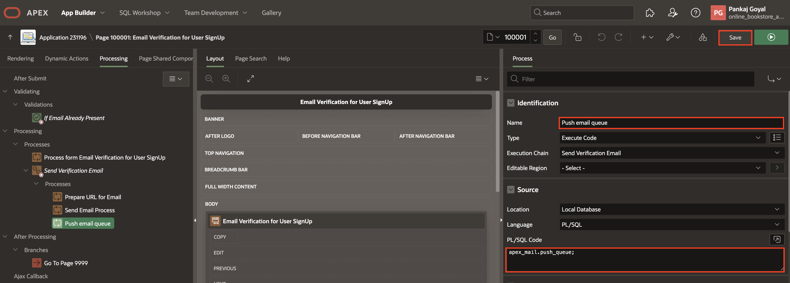

21. Navigate to Page **100002 - Email Verification for Forgot Password**

    

22. Right-click on **Body** and select **Create Page Item**.

    

23. Enter/select the following below

    - Under Identification:

        - Name: **P100002_URL**

        - Type: **Hidden**

    

24. Navigate to the processing tab and select **Send Verification Email** process and update the type to **Execution Chain** and remove **Success Message** under Success Message.

    

25. Right-click **Send Verification Email** and select **Add Child Process**.

    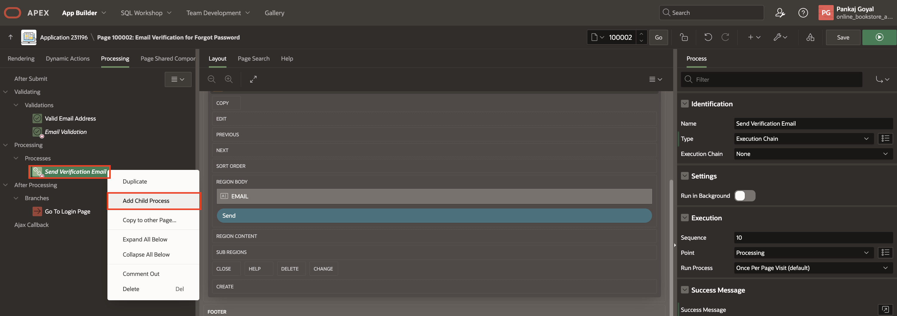

26. Enter/select the following below

    - Identification > Name: **Prepare URL for Email**

    - Source > PL/SQL Code: Copy and Paste the below code:
        ```
        <copy>
        :P100002_URL := apex_util.host_url || APEX_PAGE.GET_URL (
        p_page  => 100003,
        p_items => 'P100003_EMAIL',
        p_values => :EMAIL);
        </copy>
        ```

    

27. Right-click **Send Verification Email** and select **Add Child Process**.

    

28. Enter/select the following below

    - Under Identification:

        - Name: **Send Email Process**

        - Type: **Send E-Mail**

    - Under Settings:

        - From: **noreply.obs@oracle.com**

        - To: **&EMAIL.**

        - Email Template: **EmailTemplate**

        - Placeholder Values: Click **6 placeholders, 6 unassigned.** and enter the following:

            | Placeholder     |  Item or Value   |
            | --------------- |  ------ |
            | SUBJECT | Online Bookstore - Reset Password! |
            | TARGET_HEADING | Please open the link to Reset Password for your account: |
            | APP_LINK | &P100002_URL.  |
            | TARGET | Reset Password  |
            | ICON_URL | https://apex.oracle.com/pls/apex/r/online_bookstore_app/online-bookstore/files/static/v7/Online_Bookstore_Icon.png  |
            | TITLE | Online Bookstore  |

            NOTE: In **ICON_URL**, replace **online\_bookstore\_app** with your **workspace\_name**, and replace online-bookstore with your **app\_name**

     - Success Message > Success Message: **Reset Password Link sent to your email address.**

    

29. Right-click **Send Verification Email** and select **Add Child Process**.

    

30. Enter/select the following below and click **Save**.

    - Identification > Name: **Push email queue**

    - Source > PL/SQL Code: Copy and Paste the below code:

        ```
        <copy>
        apex_mail.push_queue;
        </copy>
        ```

    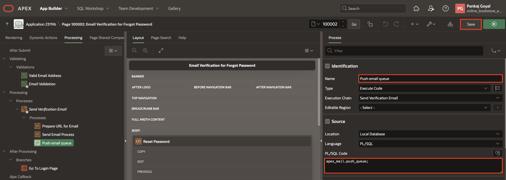

31. Run the application and explore the Signup and Forgot Password functionalities.

    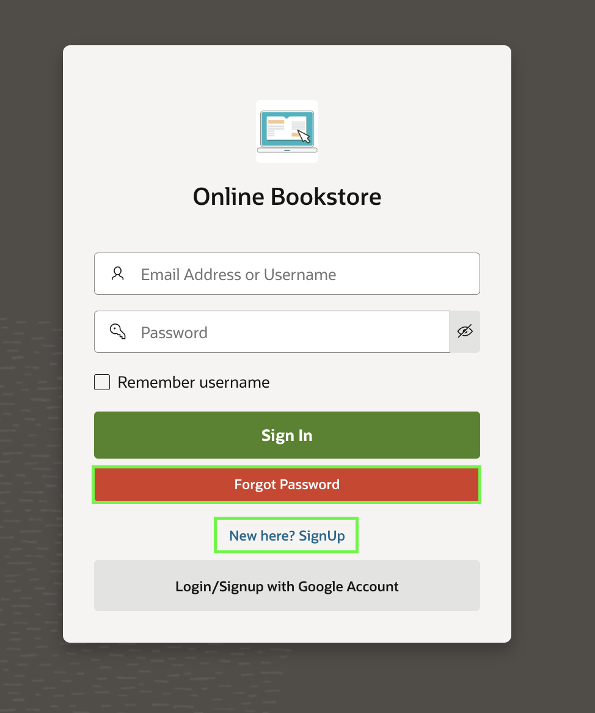

32. Observe the formats and UI of the emails and compare them with Lab 12 > Task 6 > Steps 3 and 8.

    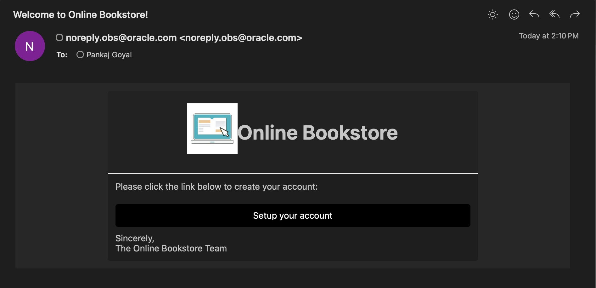

    

## Task 5: Default Profile Picture

In this task, you will configure a default profile picture for users who haven't uploaded one. You will upload a default image as a static file and modify the RESTful service query to ensure that users without a profile picture are assigned the default image automatically.

1. Navigate to the application homepage and click **Shared Components**

    

2. Click **Static Application Files** under **Files and Reports**.

    

3. Click **Create File**.

    

4. Upload a default profile picture with name **persona-male01-apex.png** and click **Create**. Download a sample default profile picture [here](./images/persona-male01-apex.png).

    

5. Navigate to **SQL Workshop** and select **RESTful Services**.

    

6. Expand **Modules** > **User Images** > **profile\_pic/:id** and select **GET**.

7. Under **Source**, replace the query with the following query.

    ```
    <copy>
    select mime_type, profile_pic from obs_users where user_id = :id and profile_pic is not null and mime_type is not null
    union all 
    select mime_type,FILE_CONTENT as profile_pic  from apex_application_static_files where file_name =  'persona-male01-apex.png' and 
    not exists (select 1 from obs_users where user_id = :id and profile_pic is not null and mime_type is not null)
    </copy>
    ```

8. Click **Apply Changes**.

    

9. Run the application and sign up or log in with a new user. Navigate to the **My Profile** page and observe that a default profile picture and icon appear even without uploading.

    

## Task 6: My Orders Page

In this task, you will create the My Orders page to display users' past orders, including order details, payment information, and total amount. You will configure the page, write an SQL query to fetch order data, and enable navigation to order details.

1. Navigate to the application homepage and click **Create Page**.

    

2. Click **Blank Page**.

    

3. Enter/select the following:

    - Under Page Definition:

        - Page Number: **19**

        - Name: **My Orders**

    - Under Navigation:

        - Use Breadcrumb: **Toggle Off**

        - Use Navigation: **Toggle Off**

       Click **Create Page**.

    

4. Right-click **Body** and select **Create Region**.

    

5. In the Property Editor, enter/select the following:

    - Under Identification:

        - Name: **My Orders**

        - Type: **Content Row**

    - Under Source:

        - Type: **SQL Query**

        - SQL Query: Copy and paste the below code into the code editor:

            ```
            <copy>
            SELECT 'Transaction Successful' as transaction_status,
                o.order_id,
                o.user_id,
                o.payment_id,
                to_char(Round( SUM(i.price * ((100 - i.discount) / 100) * i.quantity),0),'999G999G999G999G999G999G990') AS total,
                SUM(i.quantity) AS quantity,
                TO_CHAR(i.added_date, 'DD MON YYYY') as purchased_date,
                TO_CHAR(i.added_time, 'HH12:MI:SS AM') AS purchased_time,
                i.added_time added_time
            FROM   obs_orders o
            LEFT JOIN obs_order_items i
                ON o.order_id = i.order_id
            WHERE o.user_id = :user_id
            GROUP BY o.order_id, o.user_id, o.payment_id, i.added_date, i.added_time;
            </copy>
            ```

    - Order By:

        - Type: Item

        - Item: Click **No Order By Item** and enter the following and click **OK**:

            | Clause |  Key | Display |
            | --- |  --- | --- |
            | "ADDED_TIME" DESC  | ADDED_TIME| Date |
            | "TOTAL" DESC | TOTAL | Amount |

    

6. In the right pane, select **Attributes** and enter the following:

    - Under Settings

        - Overline: **&PURCHASED_DATE. <****br>**

        - Title: **Order Id: &ORDER_ID. <****br>**

        - Description: Copy and paste the code below:
        ```
        <copy>
        Payment Id: &PAYMENT_ID. <br>
        Total Amount: &TOTAL. <br>
        Purchased Time: &PURCHASED_TIME. <br>
        </copy>
        ```

    

7. In Page Rendering, under **My Orders** region, right-click **Actions** and select **Create Action**.

    

8. In the Property Editor, enter the following:

    - Identification > Position: **Full Row Link**

    - Under Link:

        - Type: **Redirect to Page in this application**

        - Click **Target**

            - Page: **16**

            - Name: **P16\_ORDER\_ID** and Value: **&ORDER\_ID.**

            Click **OK**

    

9. Click **Save**.

10. Navigate to **Shared Components**.

    

11. Under **Navigation and Search**, select **Navigation Bar List**.

    

12. Click **Navigation Bar**.

    

13. Click **Create List Entry**.

    

14. Enter/select the following and click **Create List Entry**.

    - Under Entry:

        - Parent List Entry: **&USERNAME.**

        - Sequence: **27**

        - Image/Class: **fa-cart-check**

        - List Entry Label: **My Orders**

    - Under Target:

        - Page: **19**

        - Clear Cache: **19**

    

15. Run the lab and navigate to the **My Orders** page.

    

16. Sort all orders by **Date**.

    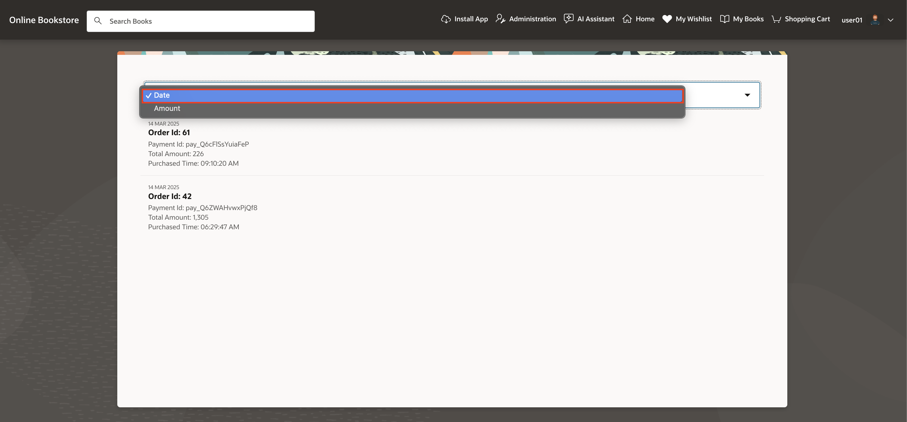

17. Sort all orders by **Amount**.

    

18. Click on any order to automatically navigate to its details page.

    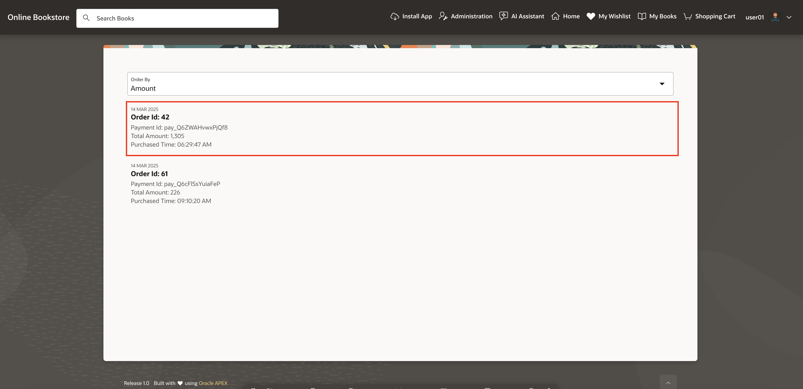

    

## Task 7: Enhance Home Page

In this task, you will enhance the Home Page by updating the total book count label, repositioning the sorting option, and applying custom styling. These changes will improve the page layout and user experience.

1. Navigate to the application homepage and select page **10- Search Books**.

    

2. Select **SEARCH**, navigate to Attributes and under Settings update **Total Row Count Label** to **Total Books:**

    

3. Drag **P10\_ORDER\_BY** and drop above **RESET** under **Button Bar**.

    

4. Enter/select the following below:

    - Under Appearance:

        - Template: **Hidden**

        - Icon: **fa-sort-amount-desc**

    - Advanced > CSS Classes: **no-item-ui**

    

5. Click **Save and Run**.

    

6. Click **Customize** from the developer toolbar and select **Theme Roller**.

    

7. Add below class in the **Custom CSS** and click **Save**.

    ```
    <copy>
    .no-item-ui {
        --a-field-input-border-width: 0px;
        --a-field-input-background-color: transparent;
    }
    </copy>
    ```

    

8. Observe Total Books and book sorting options.

    

## Summary

You now know how to add a footer to your app, manage the navigation menu, implement a global search bar, configure email templates for sending emails, set a default profile picture, and create a "My Orders" page in Oracle APEX. These skills enhance user experience, improve branding, streamline navigation, and optimize communication within your application.

## Acknowledgements

- **Author**: Pankaj Goyal, Member Technical Staff
- **Last Updated By/Date**: Pankaj Goyal, Member Technical Staff, Feb 2025