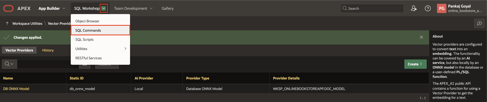
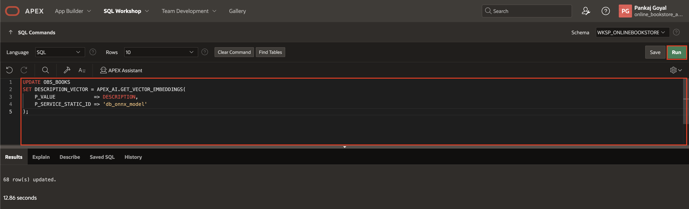
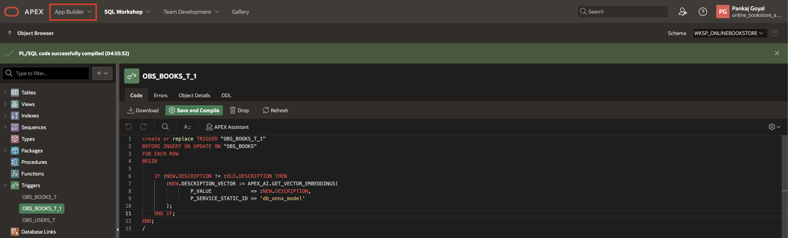
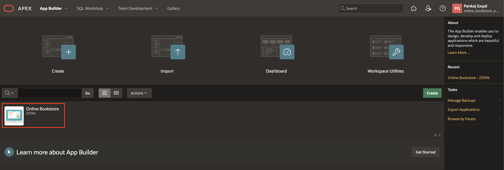
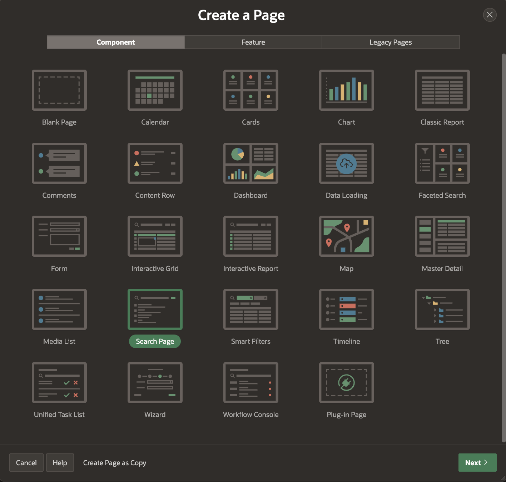

# Implement Vector Search using Search Configurations

## Introduction

In this lab, you will learn how to load ONNX models into Oracle Database and create a Vector Provider to generate vector embeddings. By leveraging Oracle Vector Search, you will configure a semantic similarity search, allowing users to find relevant results regardless of how they phrase their queries. Finally, you will build a search page that utilizes these configurations to enhance search accuracy and user experience.

>*Note: This lab requires Oracle Database 23ai.*

Estimated Time: 10 minutes

### Objectives

- Load ONNX Models
- Create a Vector Provider
- Generate Vector Embeddings
- Create Search Configuration based on Oracle Vector Search
- Create an Oracle Vector Search Page

### Downloads: Missed Previous Labs? Download and Install the Application

If you're stuck or missed out on completing the previous labs, don't worry! Click [here](https://c4u04.objectstorage.us-ashburn-1.oci.customer-oci.com/p/EcTjWk2IuZPZeNnD_fYMcgUhdNDIDA6rt9gaFj_WZMiL7VvxPBNMY60837hu5hga/n/c4u04/b/livelabsfiles/o/obs-lab17.zip) to download the export file, which contains everything completed in the previous labs. To run the app, follow the steps described in the [Lab Appendix: Download Instructions](?lab=download-instructions) from Task 2 to Task 10.

## Task 1: Load the ONNX Model

Before uploading the ONNX model to your database schema, you must grant the schema the privilege to create mining models while logged in as SYS/ADMIN.

Login as SYS/Admin User and execute the below command.

>**Command**: GRANT create mining model TO **YourSchemaName**;


1. From your APEX workspace homepage, click the Down Arrow next to **SQL Workshop** and select **SQL Commands**.

    

2. In the SQL Commands Page, copy and paste the below code and click **Run**.

    ```
    <copy>
        DECLARE
        L_PAR_URL       VARCHAR2(1000);
        L_RESPONSE_BLOB BLOB;
        BEGIN
            L_PAR_URL := 'https://adwc4pm.objectstorage.us-ashburn-1.oci.customer-oci.com/p/eLddQappgBJ7jNi6Guz9m9LOtYe2u8LWY19GfgU8flFK4N9YgP4kTlrE9Px3pE12/n/adwc4pm/b/OML-Resources/o/all_MiniLM_L12_v2.onnx'
            ;
            L_RESPONSE_BLOB := APEX_WEB_SERVICE.MAKE_REST_REQUEST_B(
                P_URL         => L_PAR_URL,
                P_HTTP_METHOD => 'GET'
            );
            DBMS_VECTOR.LOAD_ONNX_MODEL(
                MODEL_NAME => 'DOC_MODEL',
                MODEL_DATA => L_RESPONSE_BLOB,
                METADATA   =>
                        JSON(
                            ' {
                        "function" : "embedding",
                        "embeddingOutput" : "embedding" ,
                        "input":{"input": ["DATA"]}
                    }'
                        )
            );

        END;
    </copy>
    ```

    

## Task 2: Create a Vector Provider

In this task, you will create a Vector Provider that will be used later to set up a Search Configuration.

1. From your SQL Commands page, click the Down Arrow next to **App Builder** and select **Workspace Utilities**. Then click **All Workspace Utilities**.

    

2. In the Workspace Utilities page, select **Vector Providers**.

    

3. In the Vector Providers page, click **Create**.

    

4. In the Vector Provider Configuration page, enter the following:

    - Under Identification:

        - Provider Type : **Database ONNX Model**

        - Name: **DB ONNX Model**

        - Static ID: **db\_onnx\_model**

    - Under Local Embedding:

        - For ONNX Model Owner: **Select your Parsing Schema**

        - ONNX Model Name: **DOC_MODEL**

    Click **Create**.

    

5. Your Vector Provider is now created.

    

## Task 3: Create Vectors on Book Description

In this task, you will enhance the **OBS\_BOOKS** table by adding a new column, **DESCRIPTION\_VECTOR**, to store description vector embeddings. Starting with APEX 24.2, the new PL/SQL API **APEX\_AI.GET\_VECTOR\_EMBEDDINGS** streamlines this process. You will utilize the **APEX\_AI.GET\_VECTOR\_EMBEDDINGS** API to insert vector embeddings.

1. From your Vector Provider page, click the Down Arrow next to **SQL Workshop** and select **SQL Commands**.

    

2. Create a new column in the **OBS\_BOOKS** table to store description vector embeddings. Copy and paste the SQL code below, then click **Run**.

     ```
    <copy>
    ALTER TABLE OBS_BOOKS ADD DESCRIPTION_VECTOR VECTOR;
    </copy>
     ```

    

3. Copy and paste the SQL code below, then click **Run**

    ```
    <copy>
    UPDATE OBS_BOOKS
    SET DESCRIPTION_VECTOR = APEX_AI.GET_VECTOR_EMBEDDINGS(
        P_VALUE             => DESCRIPTION,
        P_SERVICE_STATIC_ID => 'db_onnx_model'
    );
    </copy>
     ```

    

4. Navigate to **Object Browser** via **SQL Workshop**

    

5. In the object tree, right-click **Triggers** and select **Create Trigger**

    

6. Enter/Select the following and click **Create Trigger**

    - Table: **OBS_BOOKS**

    - Firing Point: **Before**

    

7. Replace the existing code with the below code:

    ```
    <copy>
    CREATE OR REPLACE TRIGGER "OBS_BOOKS_T_1"
    BEFORE INSERT OR UPDATE ON "OBS_BOOKS"
    FOR EACH ROW
    BEGIN

        IF :NEW.DESCRIPTION != :OLD.DESCRIPTION THEN
            :NEW.DESCRIPTION_VECTOR := APEX_AI.GET_VECTOR_EMBEDDINGS(
                    P_VALUE             => :NEW.DESCRIPTION,
                    P_SERVICE_STATIC_ID => 'db_onnx_model'
            );
        END IF;
    END;
    /
    </copy>
     ```

8. Click **Save and Compile**

    

## Task 4: Create a Search Configuration

In this task, you will set up a Search Configuration based on Oracle Vector Search.

1. From the Navigation bar in your workspace, click **App Builder**.

    

2. In the **App Builder** page, select your Application and then click **Shared Components**.

    

    

3. From Shared Components, under **Navigation and Search**, click **Search Configurations**.

    

4. In the Search Configurations page, click **Create**.

    

5. In the Create Search Configuration Detail Wizard, enter the following and click **Next**.

    - Name : **Online Bookstore Search - Vector**

    - Search Type: **Oracle Vector Search**

    

6. In the Create Search Configuration **Source** Wizard, enter the following and click **Next**.

    - Vector Provider : **DB ONNX Model**

    - Source Type: **Table**

    - Table/View Owner: **Select your Parsing Schema**

    - Table/View Name: **OBS\_BOOKS**

    

7. In the Create Search Configuration **Column Mapping** Wizard, enter the following and click **Create Search Configuration**.

    - Primary Key Column: **BOOK_ID (Number)**

    - Vector Column: **DESCRIPTION_VECTOR (Vector)**

    - Title Column: **TITLE (Varchar2)**

    - Description Column: **DESCRIPTION (Varchar2)**

    

## Task 5: Create an Oracle Vector Search Page

In this task, you'll create a Vector Search Page to enable advanced search functionality for books. You'll configure the search page, update navigation settings, and test the feature to retrieve relevant book results.

1. Navigate to the application home page and click  **Create Page**.

    

2. Select **Search Page**.

    

3. Under Create Search Page wizard, enter the following:

    - Under Page Definition:

        - Page Number: **5**

        - Name: **Books Vector Search**

    - Search Configurations > Online Bookstore Search - Vector: **Toggle On**

    - Under Navigation:

        - Use Breadcrumb: **Toggle Off**

        - Use Navigation: **Toggle Off**

    Click **Create Page**.

    

4. Navigate to **Shared Components**.

    

5. Under **Navigation and Search**, select **Navigation Bar List**.

    

6. Click **Navigation Bar**.

    

7. Click **Create List Entry**.

    

8. Enter/select the following and click **Create List Entry**.

    - Under Entry:

        - Sequence: **2**

        - Image/Class: **fa-search-plus**

        - List Entry Label: **Advanced Search**

    - Under Target:

        - Page: **5**

        - Clear Cache: **5**

    

     - Under Conditions:

        - Condition Type: **Current Page Is NOT in Expression 1 (comma delimited list of pages)**

        - Expression 1: **5**

    

9. Run the application and click **Advanced Search** entry in the navigation bar.

    

10. Search for any keyword, press Enter, and observe the results of books related to that keyword.

    

## Summary

In this lab, you loaded ONNX models into Oracle Database, created a Vector Provider, and generated vector embeddings. You then configured Oracle Vector Search for enhanced search capabilities and built a search page to leverage these embeddings for efficient and accurate search results.

## Acknowledgements

- **Author**: Pankaj Goyal, Member Technical Staff
- **Last Updated By/Date**: Pankaj Goyal, Member Technical Staff, March 2025
