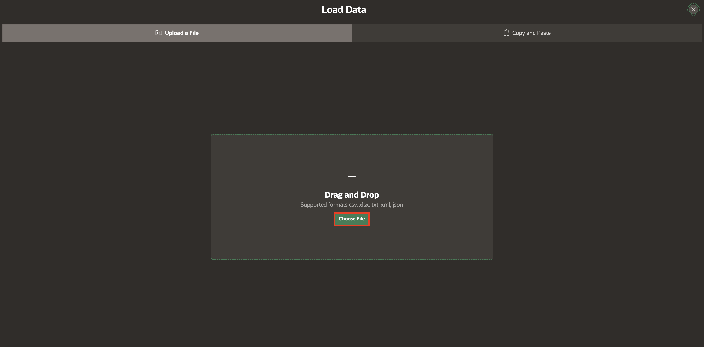
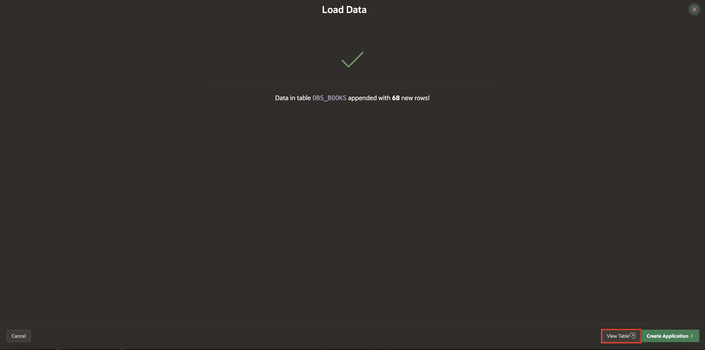
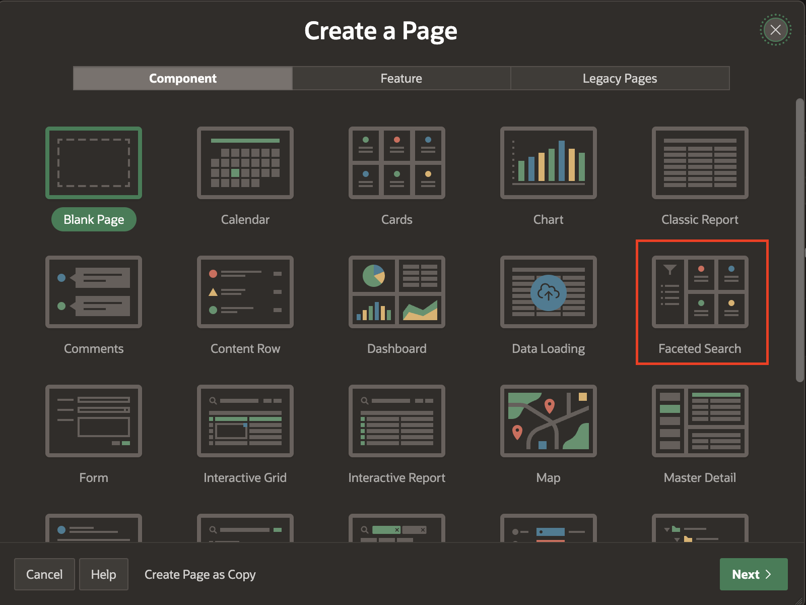

# Load Data Using Data Workshop

## Introduction

In this lab, you will use Data Workshop to load and manage data efficiently in your application. Then, you will create a Faceted Search Page to serve as the primary landing page in the Online Bookstore Application.

Data Workshop in Oracle APEX allows you to easily import, map, and validate data, ensuring seamless integration into your application.

A faceted search page displays and filters data using an intuitive experience users recognize from e-commerce sites (a left Search region and a Report region). The report region displays search results as cards or a classic report.

Estimated Time: 5 minutes

### Objectives

In this lab, you will:

- Load Data using Data Workshop
- Create a Faceted Search Page

### Downloads: Missed Previous Labs? Download and Install the Application

If you're stuck or missed out on completing the previous labs, don't worry! Click [here](https://c4u04.objectstorage.us-ashburn-1.oci.customer-oci.com/p/EcTjWk2IuZPZeNnD_fYMcgUhdNDIDA6rt9gaFj_WZMiL7VvxPBNMY60837hu5hga/n/c4u04/b/livelabsfiles/o/obs-lab1.zip) to download the export file, which contains everything completed in the previous labs. To run the app, follow the steps described in the [Lab Appendix: Download Instructions](?lab=download-instructions) Task 2.

## Task 1: Load Data using Data Workshop

In this task, you will load data into an existing table using Data Workshop. You will select the data file, map the columns, and verify the data after loading it.

1. Navigate to select **SQL Workshop** and select **Utilities** > **Data Workshop**.

    

2. Select **Load Data**

    

3. Click the **Choose File** option or drag and drop the [obs\_books.csv](files/obs_books.csv) file on to the dialog window.

    

    

4. Under **Where do you want to load this data?**, enter/select the following:

    - Load To: **Existing Table**

    - Table: **OBS\_BOOKS**

    

5. To confirm the correct column mapping, click **Configure**.

    

6. Click **Column Mapping**

    

7. Check and update the column mapping if any mapping is missing or incorrect, then click **Save Changes**.

    

8. Click **Load Data**.

    

9. To check the data, click **View Table**, then select **Data**.

    

    

## Task 2: Create a Faceted Search Page

In this task, you will create a Faceted Search page that displays a list of books along with their details, such as titles, authors, and more.

1. Go to **Online Bookstore** application. Click **Create Page**.

   

2. Select **Faceted Search**.

   

3. In the Create Faceted Search Page dialog, enter/select the following:

    - Under Page Definition:

        - Page Number: **10**

        - Name: **Search Books**

    - Data Source > Table/View Name: **OBS_BOOKS**

    - Navigation > Use Breadcrumb: Toggle **Off**

    Click **Next**.

   

4. For Display as, select **Cards** and click **Refresh** to refresh the column statistics to provide better recommendations.

    Select the facets to include in the report **(PRICE, AUTHOR, CATEGORY and DISCOUNT)**, and uncheck others before clicking **Next**.

    

5. We will proceed with the default Card Layout **Grid** and default **Card Attributes**. Click **Create Page**.

    

6. Navigate to **Shared Component**. Under **User Interface**, click **User Interface Attributes**.

    

    

7. Under **Attributes** tab, select **Home URL**: **10 Search Books**.

    

8. Click **Apply Changes**.

    

9. Click **Run**.

    

10. Enter your workspace credentials for sign-in.
    
    

## Summary

You now know how to Load data using Data Workshop. Also, you know how to Create a Faceted Search Page. You may now **proceed to the next lab**.

## Acknowledgements

- **Author**: Pankaj Goyal, Member Technical Staff; Ankita Beri, Product Manager
- **Last Updated By/Date**: Pankaj Goyal, Member Technical Staff, March 2025
