# Enhance the Home Page

## Introduction

During this lab, you'll refine the faceted search page and its card section. Additionally, you'll create a search bar at the top of the books section within the faceted search page for book searches. You'll also gain expertise in enabling sorting functionality on the search page. Finally, you'll create a Book Details Page to display detailed information about the selected book.

Estimated Time: 15 minutes

### Objectives

In this lab, you will:

- Improve Faceted Search
- Create Search Bar
- Enhance the Cards region
- Activate Sorting options
- Include a link for purchasing Books

### Downloads: Missed Previous Labs? Download and Install the Application

If you're stuck or missed out on completing the previous labs, don't worry! Click [here](https://c4u04.objectstorage.us-ashburn-1.oci.customer-oci.com/p/EcTjWk2IuZPZeNnD_fYMcgUhdNDIDA6rt9gaFj_WZMiL7VvxPBNMY60837hu5hga/n/c4u04/b/livelabsfiles/o/obs-lab2.zip) to download the export file, which contains everything completed in the previous labs. To run the app, follow the steps described in the [Lab Appendix: Download Instructions](?lab=download-instructions) Task 2.

## Task 1: Improve Faceted Search

In this task, we will reorder the facets and edit their properties and ranges accordingly.

1. Go to the Application Home Page and click **Page 10 - Search Books**.

    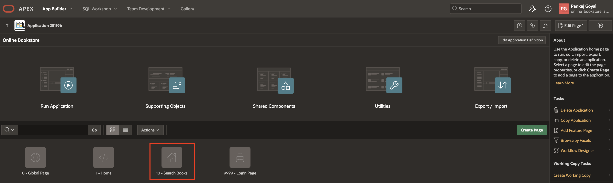

2. Under **Search** region, select **P10\_AUTHOR** facet and update the following:

    - Layout > Sequence: **10**

    

3. Now, select **P10\_PRICE** facet and update the following:

    - Settings > Select Multiple: **Toggle Off**

    - Layout > Sequence: **20**

    - List of Value > Type :**- Select -**

    

4. Select **P10\_DISCOUNT** facet, enter/select the following:

    - Layout > Sequence: **30**

    - List of Values> Type: **Static Values**

        - Click on Static Values: Enter the following

            | Display Value |  Return Value  |
            | --- |  --- |
            | <20  | \|20 |
            | 20 - 50 | 20\|50 |
            | 50 - 80 | 50\|80 |
            | >80 | 80\| |
            {: title="List of Static Values"}

       - Actions Menu > Chart: **Toggle Off**

    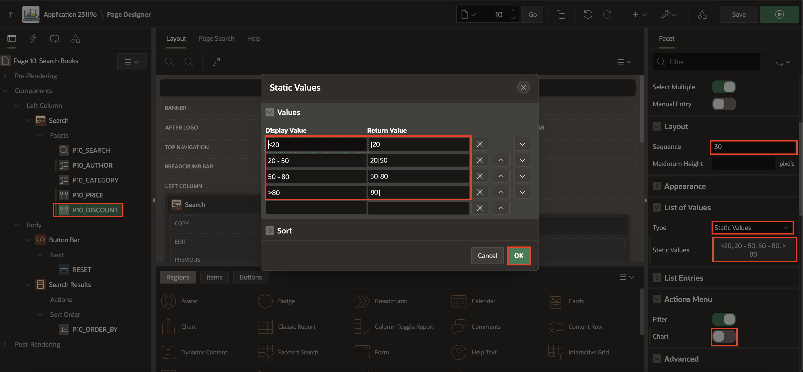

    *Note: The pipe symbol (|) is used as a delimiter in range facet return values, helping define upper and lower boundaries for filtering data.*

5. Select **P10\_CATEGORY** facet, enter/select the following:

    - Layout > Sequence: **40**

    - Actions Menu > Chart: **Toggle Off**

    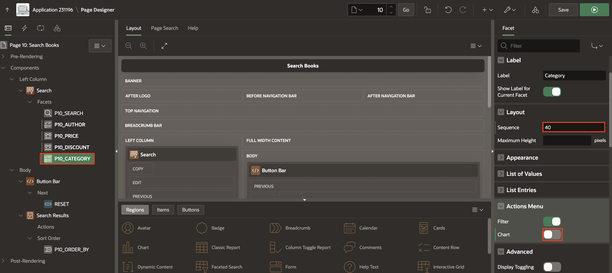

6. Click **Save and Run**.

   

## Task 2: Create Search Bar

In this task, we will move the search facet to a homepage search item above the books region.

1. Go back to the page designer, and in the left pane, right-click **Body** and select **Create Page Item**.

     

2. In the Property Editor, enter/select the following:

    - Under Identification:

        - Name: **P10\_SEARCH\_PAGE\_ITEM**

        - Type: **Text field with Autocomplete**

    - Label > Label: **Search**

    - Under List of Values:

        - Type: **SQL Query**

        - SQL Query: Copy and paste the below code:

            ```
            <copy>
            SELECT title FROM obs_books
            Union
            SELECT author FROM obs_books
            Union
            SELECT category FROM obs_books
            Union
            SELECT contributor FROM obs_books
            Union
            SELECT publisher FROM obs_books
            </copy>
            ```

    

3. Select **P10\_SEARCH** facet, enter/select the following:

    - Under Settings:

        - Input Field: **External Page Item**

        - External Page Item: **P10\_SEARCH\_PAGE\_ITEM**

    - Source > Database Columns: **TITLE,AUTHOR,PUBLISHER,CONTRIBUTOR,CATEGORY**

    

4. Drag and drop **P10\_SEARCH\_PAGE\_ITEM** page item just above the **Button Bar** region.

    

5. Click **Save and Run**.

    

## Task 3: Enhance the Cards Region

In this task, we will enhance the cards region on the homepage by displaying the book cover and key details about each book.

1. Go back to the page designer, and select **Search Results** region and enter/select the following:

    - Under Source:

        - Type: **SQL Query**

        - SQL Query: Copy and paste the below code

            ```
        <copy>
            SELECT
            BOOK_ID,
            ROUND(PRICE, 2) AS PRICE,
            TITLE,
            AUTHOR,
            PUBLISHER,
            DISCOUNT,
            CATEGORY,
            BOOK_IMAGE,
            DESCRIPTION,
            ROUND(PRICE * ((100 - DISCOUNT) / 100), 2) AS NEW_PRICE,
            CONTRIBUTOR,
            OBJECT_DET,
            TEXT_DET
        FROM
            OBS_BOOKS;
            </copy>
            ```

    

    - Under Appearance > Select **Template Options** and enter/select the following:

        - Style: **Style C**

        click **OK**

    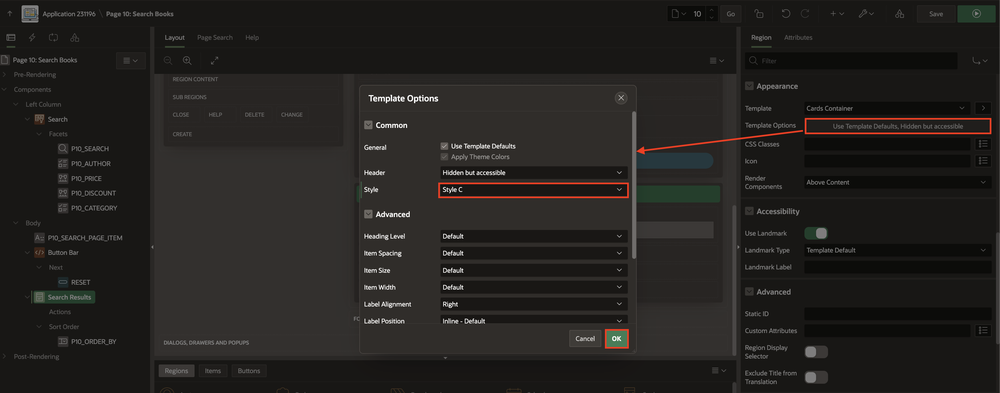

2. In the Property Editor, under **Attributes** (for the Search Results region) and enter/select the following:

    - Appearance > Grid Columns: **4 Columns**

    - Card > Primary Key Column 1: **BOOK_ID**

    - Under Title:

        - Column: **TITLE**

        - CSS Classes: **book-title**

    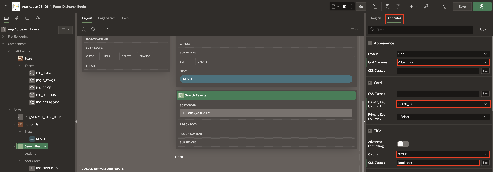

    - Under Body:

        - Advanced Formatting: **Toggle On**

        - HTML Expression: copy and paste the below HTML code:

            ```
            <copy>
            <div>
                <b>Author:</b> &AUTHOR.
            </div>
            <div>
                <b>Price:</b> <strike>&amp;#8377;&PRICE.</strike> &amp;#8377;&NEW_PRICE.
            </div>
            <div>
                <b>Discount:</b> <span style="color: green;">&DISCOUNT.% Off</span>
            </div>

            </copy>
            ```

    - Under Media:

        - Source: **Image URL**

        - URL: **&BOOK_IMAGE.**

        - Image Description: **&DESCRIPTION.**

    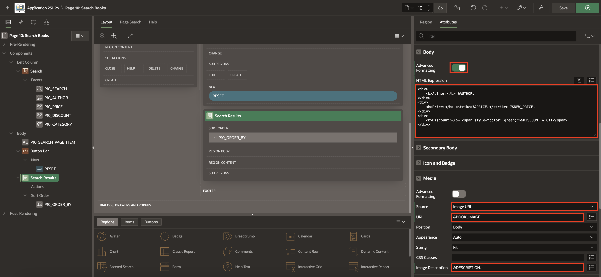

3. Select **P10\_PRICE** facet and under Source update Database Column to **NEW\_PRICE**.

    

4. Select **Page 10: Search Books** root node and enter the following into the property editor:

    - CSS > Inline: Copy and Paste the below CSS Code:

        ```
        <copy>
        .book-title {
            font-size: 14px;
            margin: auto;
            text-align: center;
            font-weight: bold;
        }
            </copy>
            ```

    

5. Click **Save** and **Run**.

    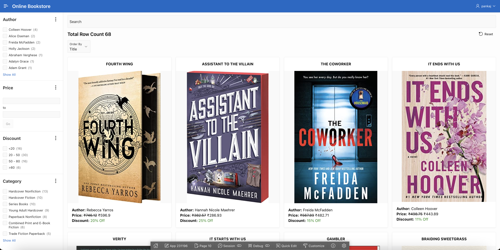

## Task 4: Activate Sorting Options

In this task, we will activate sorting options for books by title, discount, and final price after discount.

1. Go back to the page designer, and select **Search Results** region and in the Property Editor, enter/select the following:

    - Order By:

        - Type: **Item**

        - Click **P10\_ORDER\_BY,2 Order Bys** and enter the following and click **OK**:

            | Clause |  Key | Display |
            | --- |  --- | --- |
            | "TITLE"asc  | TITLE| Title |
            | "NEW\_PRICE"asc | NEW\_PRICE | Price|
            | "DISCOUNT"desc| DISCOUNT | Discount |
            {: title="List of Items"}

    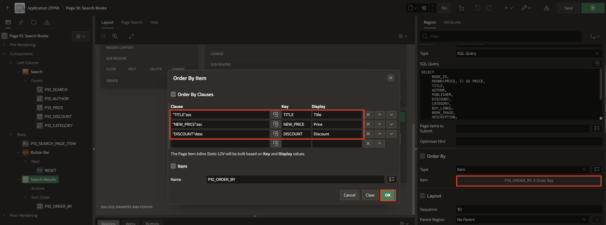

2. Select **P10\_ORDER\_BY** page item and  in the Property Editor, enter/select the following:

    - Under Default:

        - Type: **Static**

        - Static Value: **TITLE**

    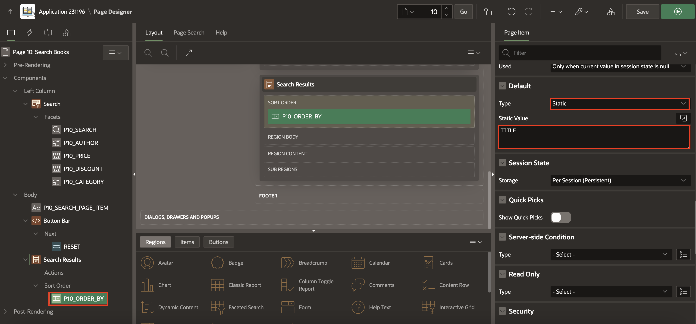

3. Click **Save and Run**.

    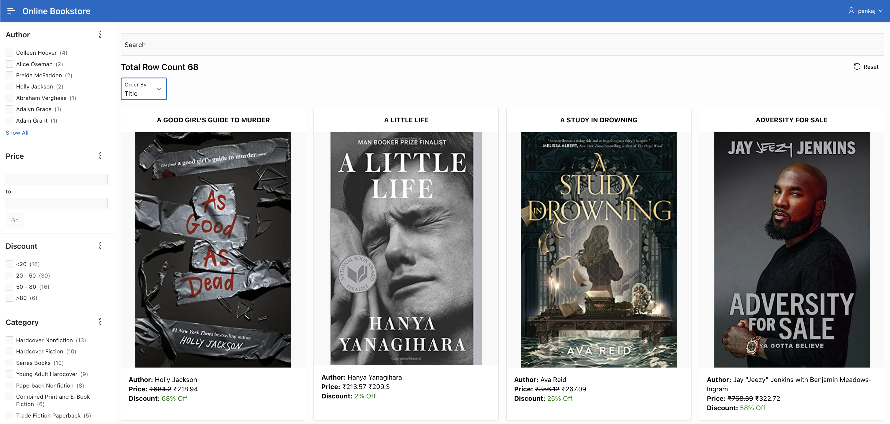

## Task 5: Create a Book Details Page

In this task, we will create a book details page that opens when a book on the homepage is clicked and displays additional book information.

1. Go back to the page designer, and select **Application ID**.

    

2. Click **Create Page**.

    

3. Select **Blank Page**.

    

4. On **Create Blank Page** dialog, enter/select the following details:

     - Under Page Definition:

        - Page Number: **18**

        - Name: **Book Details**

        - Page Mode: **Modal Dialog**

    Click **Create Page**

    

5. In the left Pane, select **Page 18: Book Details** and update the following:

    - Security > Authentication: **Page is Public**

    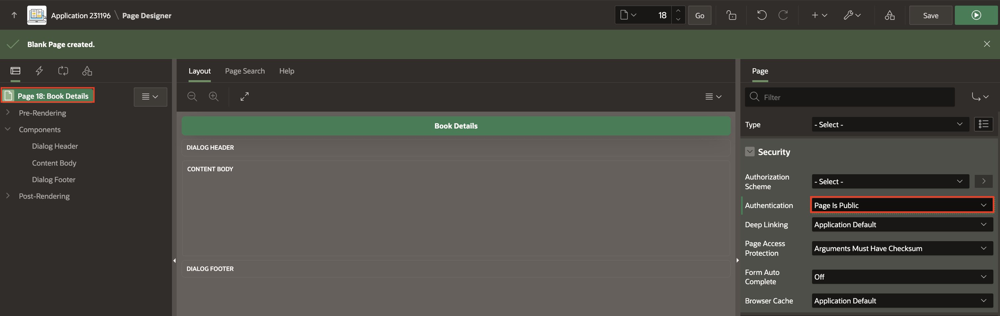

6. In the left pane, right-click **Dialog Footer** and select **Create Region**.

     

7. In the Property Editor, enter/select the following:

    - Identification > Name: **Buttons Bar**

    - Appearance > Template: **Buttons Container**

    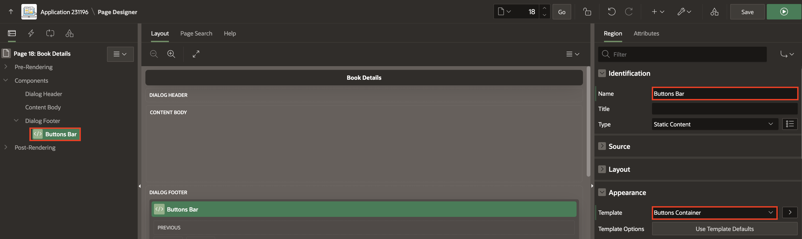

8. Right-click **Buttons Bar** and select **Create Page Item**.

    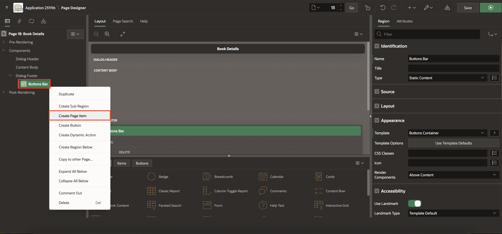

9. In the Property Editor, enter/select the following:

    - Under Identification:

        - Name: **P18\_BOOK\_ID**

        - Type: **Hidden**

    

10. Right-click **P18\_BOOK\_ID** and select **Duplicate**.

    

11. In the Property Editor, update Name to **P18\_BOOK\_IMAGE**.

    

12. Right-click **P18\_BOOK\_IMAGE** and select **Create Computation**.

    

13. In the Property Editor, enter/select the following:

    - Execution > Point: **Before Header**

    - Under Computation:

        - Type: **SQL Query (return single value)**

        - SQL Query: Copy and paste below code into the code editor

            ```
       <copy>
        select book_image from obs_books where book_id= :P18_BOOK_ID
        </copy>
         ```

    

14. In the left pane, right-click **Content Body** and select **Create Region**.

      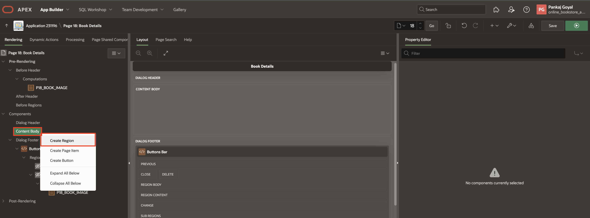

15. In the Property Editor, enter/select the following:

    - Identification > Name: **IMAGE\_DISPLAY**

    - Appearance > Template: **Image**

    - Image > File URL: **&P18\_BOOK\_IMAGE.**

    

16. Right-click **Content Body** and select **Create Region**.

    

17. In the Property Editor, enter/select the following:

     - Under Identification:

         - Name: **Book Information**

         - Type: **Classic Report**

    - Under Source:

        - Type: **SQL Query**

        - SQL Query: Copy and paste below code into the code Editor

            ```
        <copy>
        SELECT
           BOOK_ID,
           Round(PRICE,2) as price,
           TITLE,
           AUTHOR,
           DISCOUNT,
           PUBLISHER,
           CONTRIBUTOR,
           CATEGORY,
           DESCRIPTION,
           ROUND(Price*((100- Discount)/100),2) as new_price
        FROM OBS_BOOKS
        WHERE BOOK_ID=:P18_BOOK_ID
       </copy>
            ```

    

    - Layout > Disable **Start New Row**

    - Appearance > Template: **Blank with Attributes**

    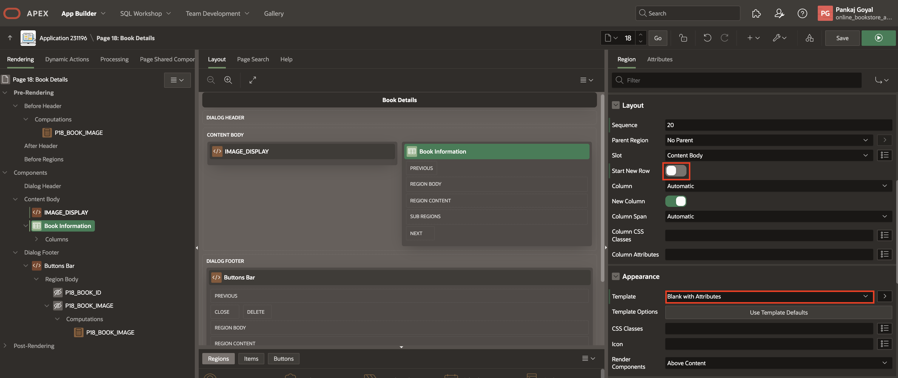

18. In the right pane, click **Attributes**. In the Property Editor, update the following:

    - Appearance > Template: **Value Attribute Pairs-Column**

    - Pagination > Type: **No Pagination (Show All Rows)**

    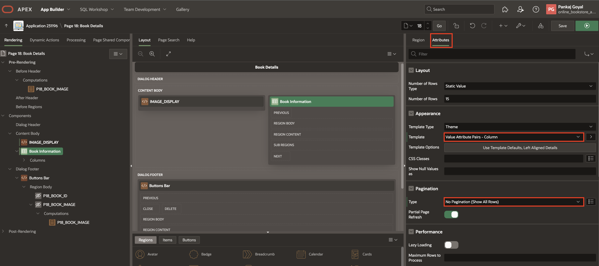

19. Under **Book Information** region, expand columns, select **BOOK\_ID**, **NEW\_PRICE** and change **Type** to **Hidden** under Identification.

       

20. Select **PRICE** and update the following:

     - Column Formatting > HTML Expression:
     ```
     <copy>
     <strike>₹#PRICE#</strike> ₹#NEW_PRICE#
     </copy>
      ```

    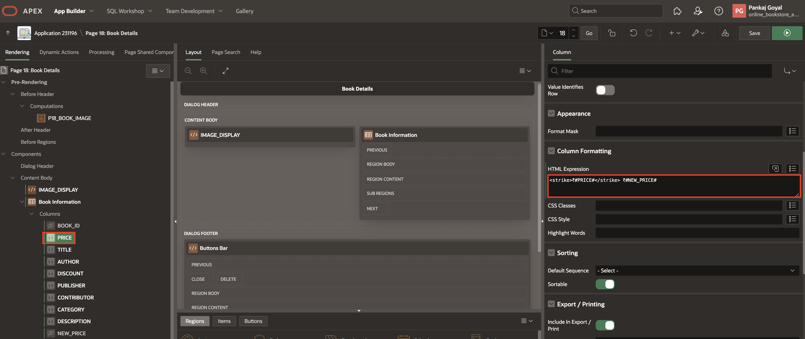

21. Select **DISCOUNT** and update the following:

     - Column Formatting > HTML Expression:
     ```
     <copy>
     <span style="color:green;">#DISCOUNT#% Off</span>
     </copy>
      ```

    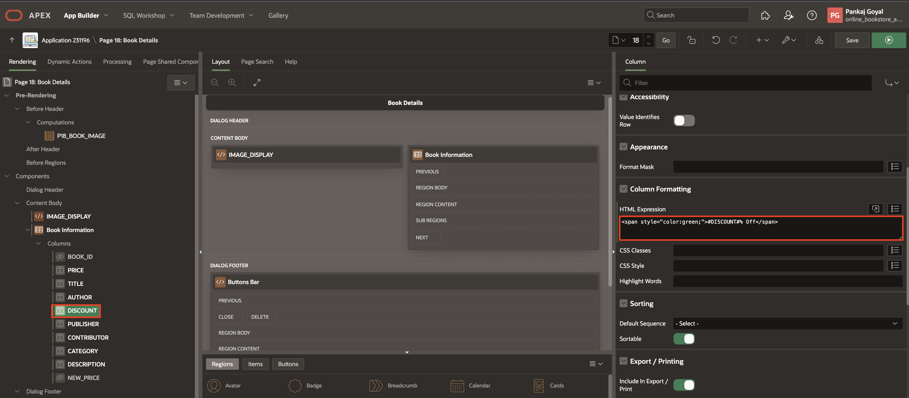

22. Click **Save**.

    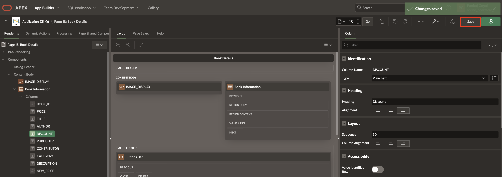

23. In the page designer toolbar, select **Page Selector** and click **10**.

    

24. In the left pane, under **Search Results** region, right-click **Actions** and select **Create Action**.

    

25. In the Property Editor, enter/select the following:

    - Identification > Type: **Full Card**

    - Under Link:

        - Type: **Redirect to a page in this Application**

        - Click **Target**

            - Page: **18**

            - Name: **P18\_BOOK\_ID** and Value: **&BOOK_ID.**

            - Clear Cache: **18**

            Click **OK**

    

26. Click **Save and Run**.

    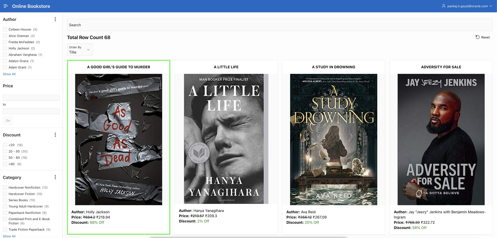

    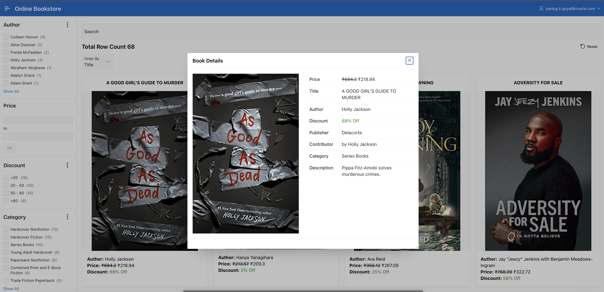

## Summary

You've learned how to enhance the faceted search page, integrate Global Search using a page item, improve the Cards region, activate sorting options, and include a link for purchasing books. Ready to move on to the next lab!

## Acknowledgements

- **Author**: Pankaj Goyal, Member Technical Staff; Ankita Beri, Product Manager
- **Last Updated By/Date**: Pankaj Goyal, Member Technical Staff, March 2025