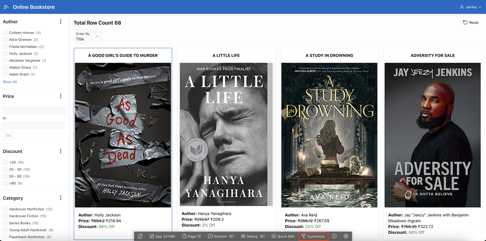
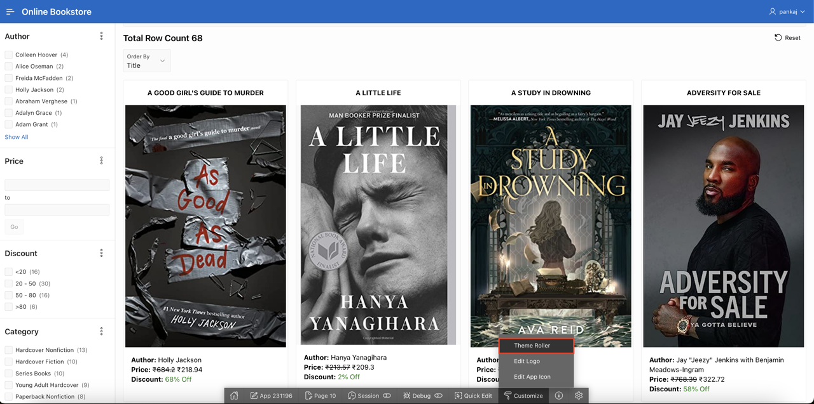
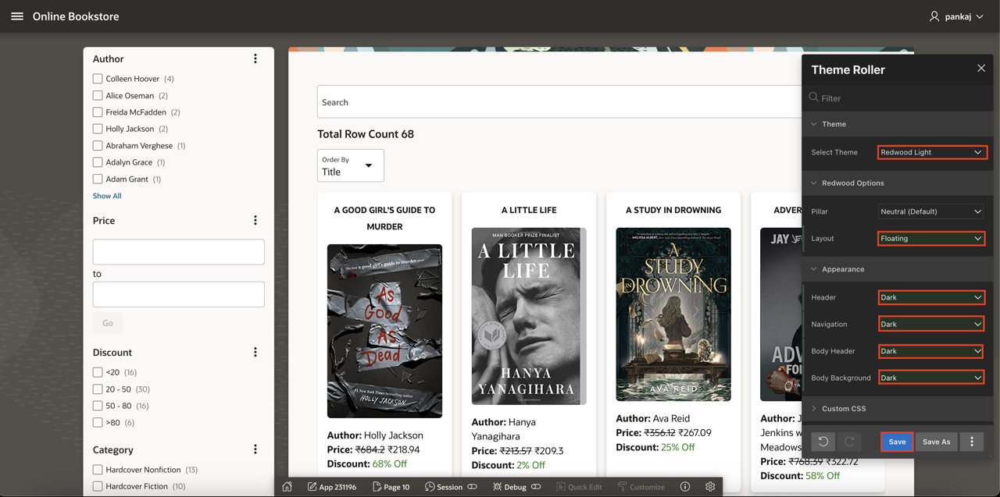
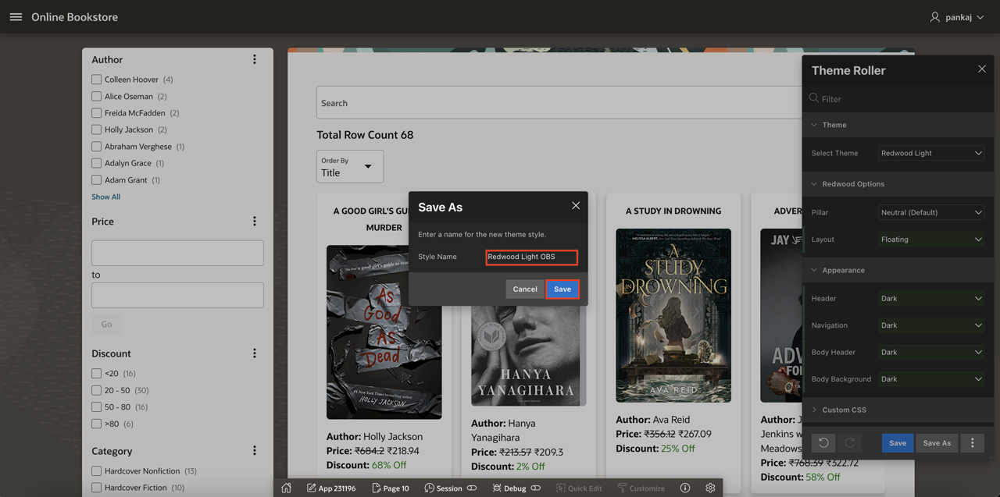
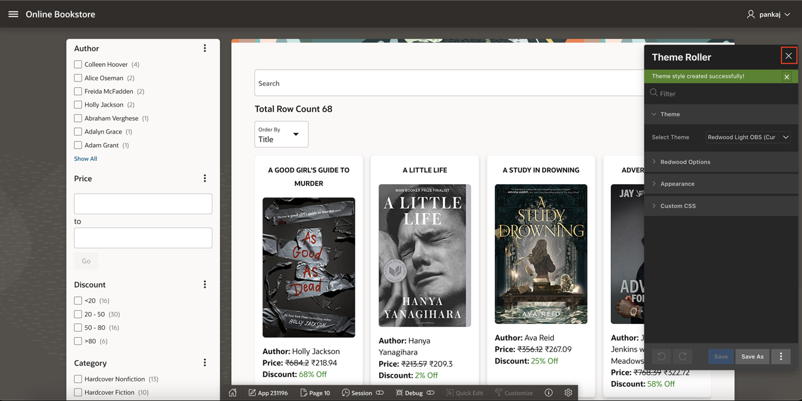
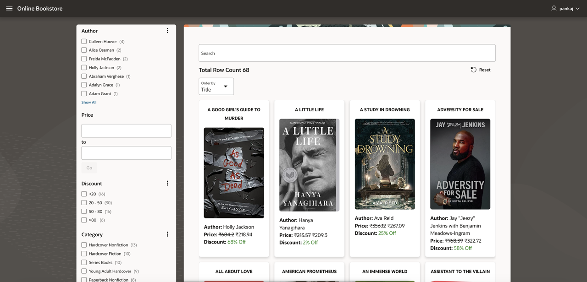

# Customize Application Theme

## Introduction

During this lab, you will learn how to customize theme of Online Bookstore Application using theme roller. Theme Roller is a live CSS editor that enables you to quickly change the theme style, colors, rounded corners and other application attributes.

Estimated Time: 1 minute

### Objectives

In this lab, you will:

- Update Theme of the Application using Theme Roller

### Downloads: Missed Previous Labs? Download and Install the Application

If you're stuck or missed out on completing the previous labs, don't worry! Click [here](https://c4u04.objectstorage.us-ashburn-1.oci.customer-oci.com/p/EcTjWk2IuZPZeNnD_fYMcgUhdNDIDA6rt9gaFj_WZMiL7VvxPBNMY60837hu5hga/n/c4u04/b/livelabsfiles/o/obs-lab3.zip) to download the export file, which contains everything completed in the previous labs. To run the app, follow the steps described in the [Lab Appendix: Download Instructions](?lab=download-instructions) Task 2.

## Task 1: Update Theme of the Application

In this task, you'll update the application's theme using Theme Roller. You'll customize the layout, appearance, and color scheme to enhance the look and feel of the application.

1. In the runtime view, click **Customize** from the developer toolbar.

   

2. Click **Theme Roller**.

   

3. Update the following:

    - Theme > Select Theme: **Redwood Light**

    - Redwood Options > Layout: **Floating**

    - Appearance > Update all the options to **Dark**

    Click **Save**.

   

4. Style Name: **Redwood Light OBS** and click **Save**.

   

5. Click on the **X** of the **Theme Roller** and observe the theme.

   

   

## Summary

You've learned how to update the theme of the application using theme roller. Ready to move on to the next lab!

## Acknowledgements

- **Author**: Pankaj Goyal, Member Technical Staff; Ankita Beri, Product Manager
- **Last Updated By/Date**: Pankaj Goyal, Member Technical Staff, March 2025
