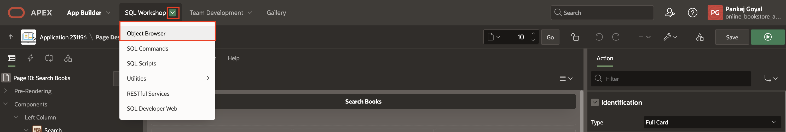
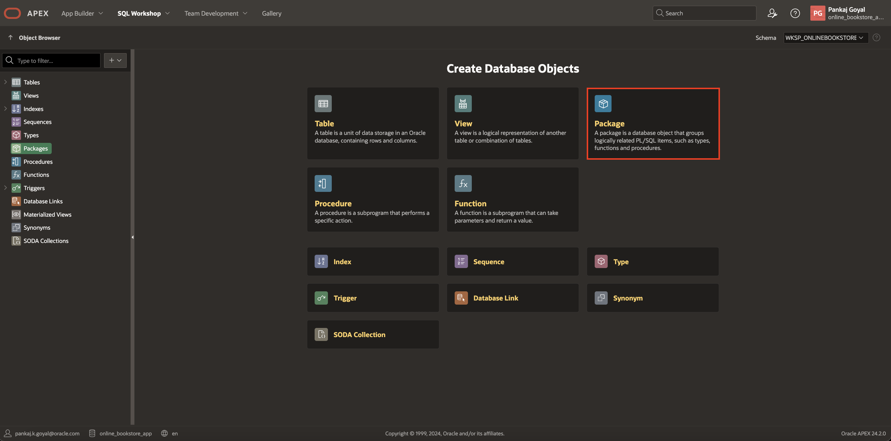
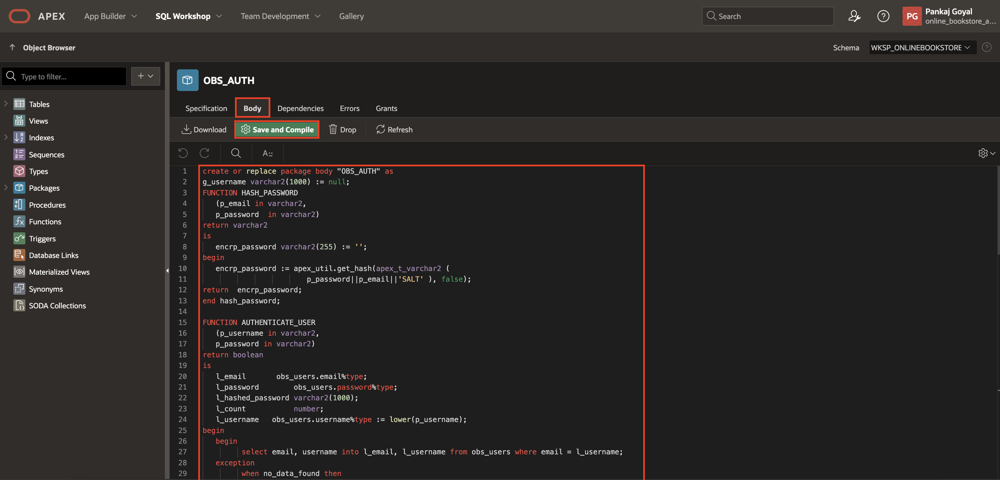
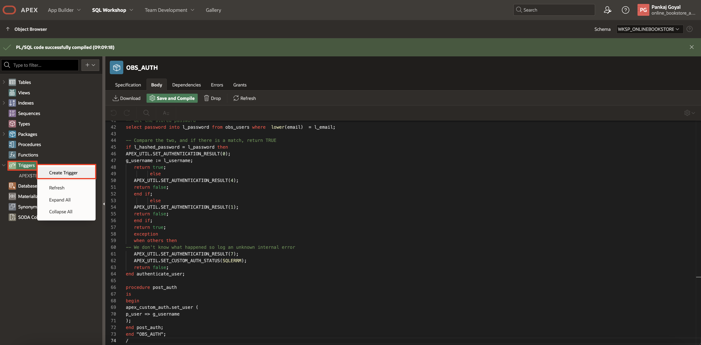
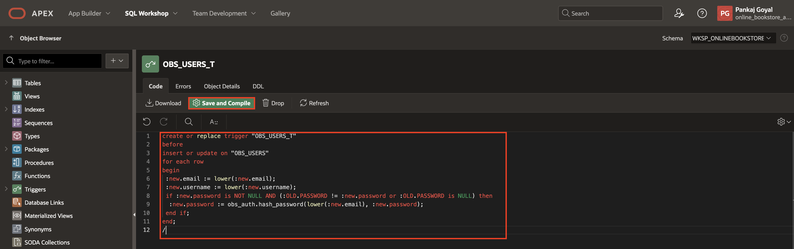
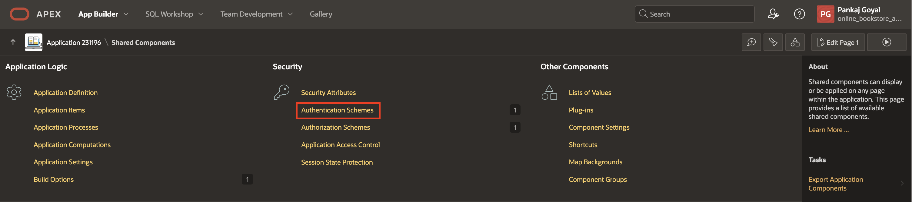
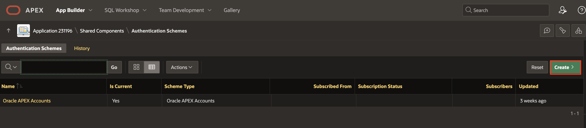
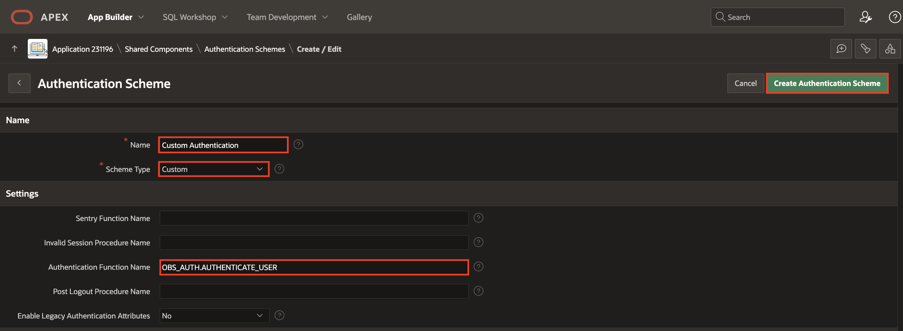
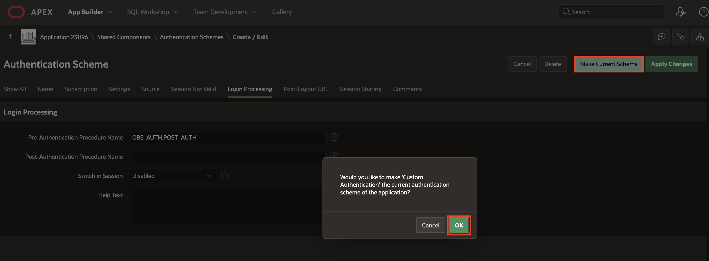
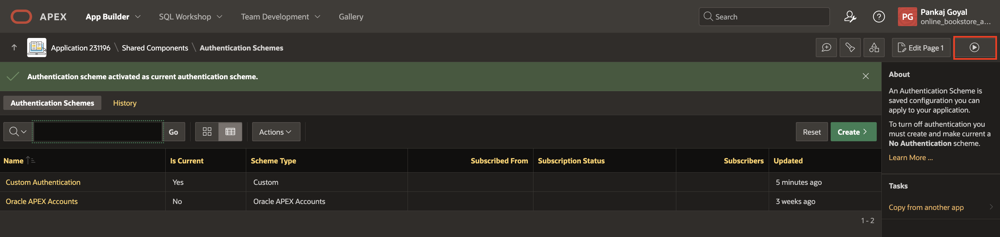

# Create Custom Authentication

## Introduction

In this lab, you will learn how to create database objects (package, trigger) using Object Browser and additionally, you'll learn how to create a Custom Authentication scheme from scratch to have complete control over your authentication interface.

Estimated Time: 5 minutes

### Objectives

In this lab, you will:

- Create a Package
- Create a Trigger
- Create Custom Authentication

### Downloads: Missed Previous Labs? Download and Install the Application

If you're stuck or missed out on completing the previous labs, don't worry! Click [here](https://c4u04.objectstorage.us-ashburn-1.oci.customer-oci.com/p/EcTjWk2IuZPZeNnD_fYMcgUhdNDIDA6rt9gaFj_WZMiL7VvxPBNMY60837hu5hga/n/c4u04/b/livelabsfiles/o/obs-lab4.zip) to download the export file, which contains everything completed in the previous labs. To run the app, follow the steps described in the [Lab Appendix: Download Instructions](?lab=download-instructions) Task 2.

## Task 1: Create a Package

In this package named **OBS\_AUTH**, you are going to implement the following functionalities:

- **FUNCTION HASH\_PASSWORD**: This function calculates a hashed password using the provided email, password, and a salt. It utilizes the apex\_util.get\_hash function to generate the hash.

- **FUNCTION AUTHENTICATE\_USER**: This function authenticates a user by verifying their provided username and password against stored credentials in the database. It retrieves the email associated with the provided username, checks if the user exists, hashes the provided password, and compares it with the stored hashed password. If the passwords match, it sets the authentication result to success and sets the authenticated username in a global variable.

- **PROCEDURE POST\_AUTH**: This procedure is invoked after successful authentication. It sets the authenticated user using the username stored in the global variable.

The code also includes error handling to manage exceptions and set appropriate authentication results.

1. Under **SQL Workshop**, click **Object Browser**.

   

2. Select **Package**.

   

3. In Create Package dialog, for Name: enter **OBS\_AUTH** and click **Create Package**.

   

4. Under Specification, copy and paste below code:

      ```
   <copy>
   create or replace package "OBS_AUTH" as
   FUNCTION AUTHENTICATE_USER
     (p_username in varchar2,
      p_password in varchar2)
   return boolean ;

   FUNCTION HASH_PASSWORD
      (p_email in varchar2,
      p_password  in varchar2)
   return varchar2;

   procedure post_auth;
    end "OBS_AUTH";
    /
    </copy>
     ```

   Click **Save and Compile**.

   

5. Under **Body**, copy and paste below code:

      ```
   <copy>
   create or replace package body "OBS_AUTH" as
   g_username varchar2(1000) := null;
   FUNCTION HASH_PASSWORD
      (p_email in varchar2,
      p_password  in varchar2)
   return varchar2
   is
      encrp_password varchar2(255) := '';
   begin
      encrp_password := apex_util.get_hash(apex_t_varchar2 (
                           p_password||p_email||'SALT' ), false);
   return  encrp_password;
   end hash_password;

   FUNCTION AUTHENTICATE_USER
      (p_username in varchar2,
      p_password in varchar2)
   return boolean
   is
      l_email       obs_users.email%type;
      l_password        obs_users.password%type;
      l_hashed_password varchar2(1000);
      l_count           number;
      l_username   obs_users.username%type := lower(p_username);
   begin
      begin
            select email, username into l_email, l_username from obs_users where email = l_username;
      exception
            when no_data_found then
               select email into l_email from obs_users where username = l_username;
      end;

   -- First, check to see if the user exists
   select count(*) into l_count from obs_users where email = lower(l_email);

   if l_count > 0 then

   -- Hash the password provided
   l_hashed_password := hash_password(lower(l_email), p_password);

   -- Get the stored password
   select password into l_password from obs_users where email  = lower(l_email);

   -- Compare the two, and if there is a match, return TRUE
   if l_hashed_password = l_password then
   APEX_UTIL.SET_AUTHENTICATION_RESULT(0);
   g_username := l_username;
      return true;
            else
      APEX_UTIL.SET_AUTHENTICATION_RESULT(4);
      return false;
      end if;
            else
      APEX_UTIL.SET_AUTHENTICATION_RESULT(1);
      return false;
      end if;
      return true;
      exception
      when others then
   -- We don't know what happened so log an unknown internal error
      APEX_UTIL.SET_AUTHENTICATION_RESULT(7);
      APEX_UTIL.SET_CUSTOM_AUTH_STATUS(SQLERRM);
      return false;
   end authenticate_user;

   procedure post_auth
   is
   begin
   apex_custom_auth.set_user (
   p_user => g_username
   );
   end post_auth;
   end "OBS_AUTH";
   /
   </copy>
   ```

   Click **Save and Compile**.

   

## Task 2: Create a Trigger

This trigger ensures that before inserting or updating a record in the **OBS\_USERS** table, certain operations are performed to maintain data integrity and security, such as ensuring consistent case sensitivity for email and username and hashing passwords for storage.

1. Right-click **Triggers** and select **Create Trigger**.

   

2. In Create Trigger dialog, for Table: select **OBS\_USERS** and click **Create Trigger**.

   

3. In the code editor, copy and paste the below code.

     ```
     <copy>
     create or replace trigger "OBS_USERS_T"
     before
     insert or update on "OBS_USERS"
     for each row
     begin
      :new.email := lower(:new.email);
      :new.username := lower(:new.username);
      if :new.password is NOT NULL AND (:OLD.PASSWORD != :new.password or :OLD.PASSWORD is NULL) then
       :new.password := obs_auth.hash_password(lower(:new.email), :new.password);
      end if;
     end;
     /
     </copy>
     ```

   Click **Save and Compile**.

   

4. Expand Tables and click **OBS\_USERS**. Under **Data**, click **Insert Row** and enter/select the following:

      - USER_ID: **0**
      - USERNAME: **user01**
      - EMAIL: **user01@xyz.com**
      - PASSWORD: **secretPassword**
      - IS\_ADMIN: **Y**

  Click **Create**.

  

## Task 3: Create Custom Authentication scheme

Authentication establishes the identity of each user who accesses your application. Many authentication processes require that a user provide some type of credentials such as a user name and password. These credentials are then evaluated and they either pass or fail. If the credentials pass, the user has access to the application. Otherwise, access is denied.

In this task, you will learn to create custom authentication.

1. Navigate to **App Builder**.

   

2. Select **Online Bookstore** application.

   

3. Click **Shared Components**.

   

4. Under Security, click **Authentication Schemes**.

   

5. Click **Create** and then click **Next**.

   

   

6. Enter/select the following:

    - Under Name:

        - Name: **Custom Authentication**

        - Schema Type: **Custom**

    - Settings > Authentication Function Name: **OBS\_AUTH.AUTHENTICATE\_USER**

     Click **Create Authentication Scheme**.

    

7. Click **Custom Authentication** and update the following:

    - Login Processing > Pre-Authentication Procedure Name : **OBS\_AUTH.POST\_AUTH**

     Click **Apply Changes**.

   

   

8. Again, click **Custom Authentication**.

   

9. Click **Make Current Scheme** and click **OK**.

   

10. Run the application and enter the credentials below:

      - Username: **user01**

      - Password: **secretPassword**

   

   

11. Click the **View Password icon** to verify the password, then click **Sign In**.

   

## Summary

You've gained knowledge on creating database objects such as packages and triggers. Additionally, you learned to develop a custom authentication scheme and implement it as the current authentication scheme. Ready to move on to the next lab!

## Acknowledgements

- **Author**: Pankaj Goyal, Member Technical Staff; Ankita Beri, Product Manager
- **Last Updated By/Date**: Pankaj Goyal, Member Technical Staff, March 2025
