# Set Up Add to Cart Functionality

## Introduction

This lab provides detailed instructions on enhancing the Book Details page in an application to manage shopping cart functionalities. It involves creating a package to handle orders, setting up application items and processes, and configuring page elements to allow users to add and remove books from their cart, update cart quantities, and dynamically reflect these changes on the user interface. The steps include creating necessary backend procedures and functions, setting up computations and processes, and updating the user interface components accordingly.

Estimated Time: 15 minutes

### Objectives

In this lab, you will:

- Create a Package to manage process of adding, removing, and processing orders and wishlist items.
- Create Application Items
- Create Application Processes
- Create Application Computations
- Set Up Book Details Page

### Downloads: Missed Previous Labs? Download and Install the Application

If you're stuck or missed out on completing the previous labs, don't worry! Click [here](https://c4u04.objectstorage.us-ashburn-1.oci.customer-oci.com/p/EcTjWk2IuZPZeNnD_fYMcgUhdNDIDA6rt9gaFj_WZMiL7VvxPBNMY60837hu5hga/n/c4u04/b/livelabsfiles/o/obs-lab5.zip) to download the export file, which contains everything completed in the previous labs. To run the app, follow the steps described in the [Lab Appendix: Download Instructions](?lab=download-instructions) from Task 2 to Task 3.

## Task 1: Create a Package to Manage Orders

In this task, you create a package named **OBS\_MANAGE\_ORDERS**, contains procedures and functions to manage orders and wishlist items within a database application. Let's break down its components:

- **Procedure add\_book**: Adds a book to a collection named "BOOKS" along with its quantity.

- **Procedure remove\_book**: Removes a book from the "BOOKS" collection based on its ID.

- **Procedure add\_to\_wishlist**: Inserts a book into the wishlist table for a specified user.

- **Procedure remove\_from\_wishlist**: Removes a book from the wishlist of a specified user.

- **Function get\_quantity**: Retrieves the total number of items in the "BOOKS" collection.

- **Function book\_exists**: Checks if a book exists in the "BOOKS" collection and returns its quantity.

- **Procedure clear\_cart**: Clears all items from the "BOOKS" collection.

- **Procedure create\_order**: Creates a new order by inserting data into the orders table and order items table based on the items in the "BOOKS" collection. It also deletes the "BOOKS" collection after order creation.

To Create a Package:

1. Under SQL Workshop, click **Object Browser**.

   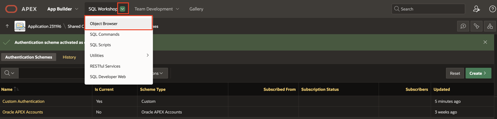

2. Right-click Packages and select **Create Package**.

   

3. In the Create Package dialog, for Name: enter **OBS\_MANAGE\_ORDERS** and click **Create Package**.

   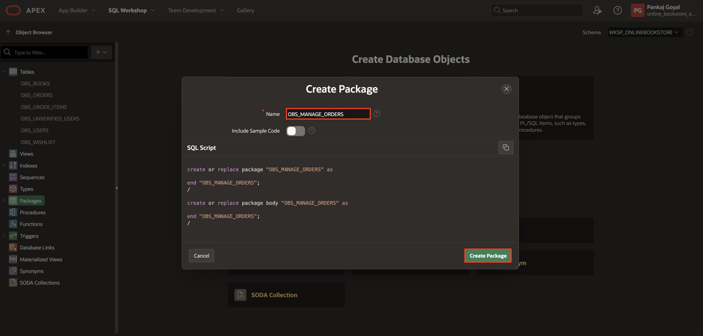

4. Under **Specification**, copy and paste below code:

     ```
     <copy>
    create or replace PACKAGE OBS_MANAGE_ORDERS
        AS

        -- create procedure for add a book temporarily
        PROCEDURE add_book (
        p_book IN NUMBER,
        p_quantity IN NUMBER);

        -- create procedure for remove a book temporarily
        PROCEDURE remove_book (
        p_book IN NUMBER);

        -- create procedure for add a book in wishlist
        PROCEDURE add_to_wishlist (
        p_book_id IN NUMBER,
        p_user_id IN NUMBER);

        -- create procedure for remove a book from wishlist
        PROCEDURE remove_from_wishlist (
        p_book_id IN NUMBER,
        p_user_id IN NUMBER);

        -- create function to get the number of items in the shopping cart
        FUNCTION Get_quantity
        RETURN NUMBER;

        -- create procedure for validate if a book exists in the shopping cart
        FUNCTION book_exists(
        p_book IN NUMBER)
        RETURN NUMBER;

        -- create procedure for clear the cart
        PROCEDURE clear_cart;

        -- create procedure to insert orders
        PROCEDURE create_order (
        p_user_id  IN VARCHAR2,
        p_order_id  OUT obs_orders.order_id%TYPE);

END OBS_MANAGE_ORDERS;
/
     </copy>
      ```

   Click **Save and Compile**.

   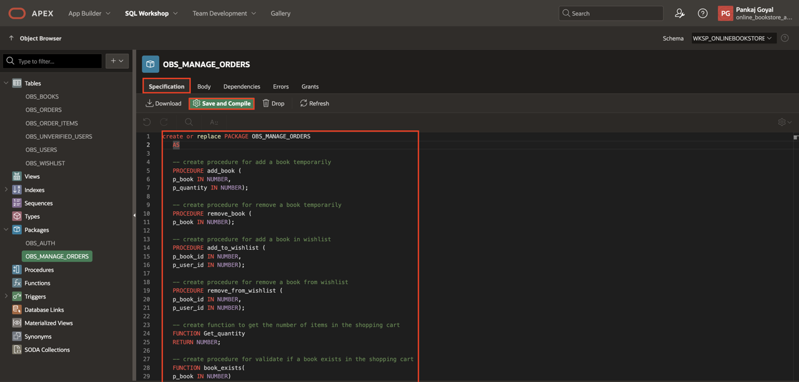

5. Under **Body**, copy and paste below code:

    ```
    <copy>
    CREATE OR REPLACE PACKAGE BODY OBS_MANAGE_ORDERS
    AS
    PROCEDURE add_book (p_book IN NUMBER, p_quantity IN NUMBER)
    IS
    BEGIN
        IF NOT apex_collection.collection_exists(p_collection_name => 'BOOKS')
        THEN
            apex_collection.create_collection(p_collection_name => 'BOOKS');
        END IF;

        apex_collection.add_member(
            p_collection_name => 'BOOKS',
            p_n001           => p_book,
            p_n002           => p_quantity
        );
    END add_book;

    PROCEDURE remove_book (p_book IN NUMBER)
    IS
        l_id NUMBER;
    BEGIN
        IF apex_collection.collection_exists(p_collection_name => 'BOOKS') AND book_exists(p_book) > 0
        THEN
            SELECT seq_id
            INTO   l_id
            FROM   apex_collections a
            WHERE  collection_name = 'BOOKS'
            AND    a.n001 = p_book;

            apex_collection.delete_member(p_collection_name => 'BOOKS', p_seq => l_id);
        END IF;
    END remove_book;

    PROCEDURE add_to_wishlist (p_book_id IN NUMBER, p_user_id IN NUMBER)
    IS
    BEGIN
        INSERT INTO obs_wishlist (book_id, user_id)
        VALUES (p_book_id, p_user_id);
    END add_to_wishlist;

    PROCEDURE remove_from_wishlist (p_book_id IN NUMBER, p_user_id IN NUMBER)
    IS
    BEGIN
        DELETE FROM obs_wishlist
        WHERE user_id = p_user_id
        AND book_id = p_book_id;
    END remove_from_wishlist;

    FUNCTION get_quantity
    RETURN NUMBER
    IS
        l_items NUMBER := 0;
    BEGIN
        IF apex_collection.collection_exists(p_collection_name => 'BOOKS')
        THEN
            SELECT COUNT(n001)
            INTO   l_items
            FROM   apex_collections a
            WHERE  collection_name = 'BOOKS';
        END IF;

        RETURN l_items;
    END get_quantity;

    FUNCTION book_exists(p_book IN NUMBER)
    RETURN NUMBER
    IS
        l_quantity NUMBER;
    BEGIN
        IF apex_collection.collection_exists(p_collection_name => 'BOOKS')
        THEN
            SELECT a.n002
            INTO   l_quantity
            FROM   apex_collections a
            WHERE  collection_name = 'BOOKS'
            AND    a.n001 = p_book;

            RETURN l_quantity;
        ELSE
            RETURN 0;
        END IF;
    EXCEPTION
        WHEN OTHERS THEN
            RETURN 0;
    END book_exists;

    PROCEDURE clear_cart
    IS
    BEGIN
        IF apex_collection.collection_exists(p_collection_name => 'BOOKS')
        THEN
            apex_collection.truncate_collection(p_collection_name => 'BOOKS');
        END IF;
    END clear_cart;

    PROCEDURE create_order (p_user_id IN VARCHAR2, p_order_id OUT obs_orders.order_id%TYPE)
    IS
    BEGIN
        INSERT INTO obs_orders (order_datetime, user_id)
        VALUES (SYSDATE, p_user_id)
        RETURNING order_id INTO p_order_id;

        IF apex_collection.collection_exists(p_collection_name => 'BOOKS')
        THEN
            INSERT INTO obs_order_items (
                order_id, seq_no, book_id, price, quantity, discount, added_date, added_time
            )
            SELECT p_order_id,
                    seq_id,
                    b.book_id,
                    b.price,
                    n002,
                    b.discount,
                    SYSDATE,
                    SYSTIMESTAMP
            FROM   apex_collections a, obs_books b
            WHERE  collection_name = 'BOOKS'
            AND    b.book_id = a.n001;
        END IF;

        apex_collection.delete_collection(p_collection_name => 'BOOKS');
    END create_order;

    END OBS_MANAGE_ORDERS;
    /
    </copy>
    ```

   Click **Save and Compile**.

   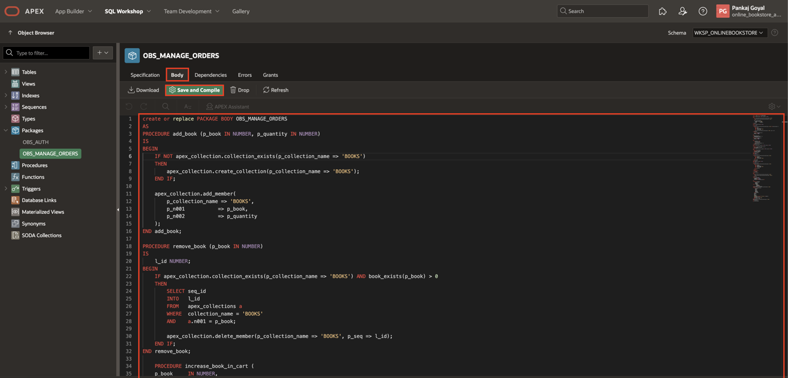

## Task 2: Create Application Items

In this task, you define application items to store session state information such as cart total, shopping cart items, and user details.

To create Application Items:

1. Navigate to Workspace home page by clicking **App Builder**.

   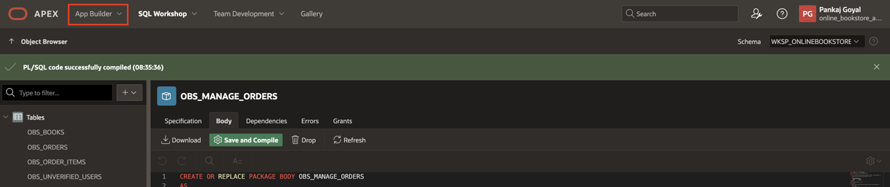

2. Click **Online Bookstore** application.

   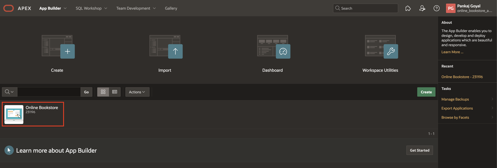

3. On the Application home page, click **Shared Components**.

    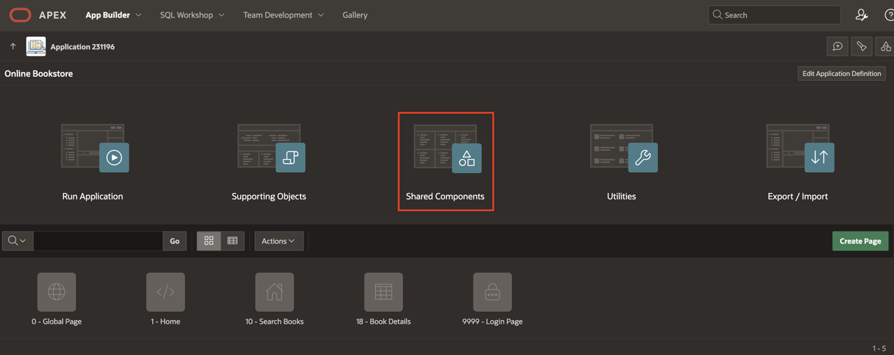

4. Under Application Logic, click **Application Items**.

    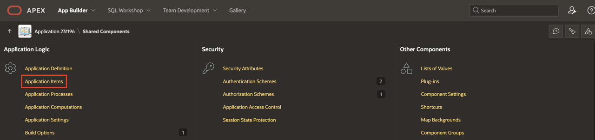

5. To create an application item, click **Create**.

    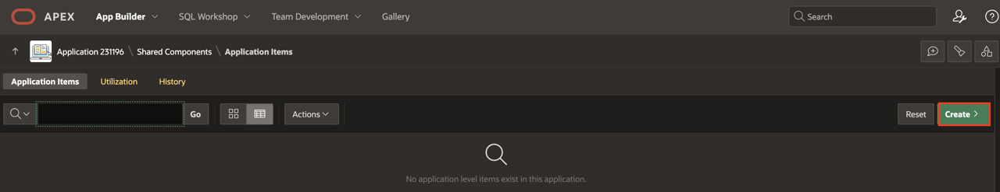

6. Add the following five application items one after the other:

   | Name |
   | --- |
   | CART\_TOTAL |
   | SHOPPING\_CART\_ITEMS |
   | SHOPPING\_CART\_ICON |
   | USER\_ID |
   | USERNAME |

   Click **Create Application item**.

   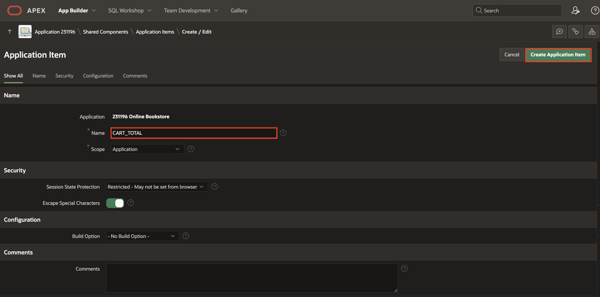

## Task 3: Create Application Processes

In this task, you implement application processes to run PL/SQL code at specific points to update the shopping cart item count dynamically.

To create Application Processes:

1. Click **Shared Components**.

   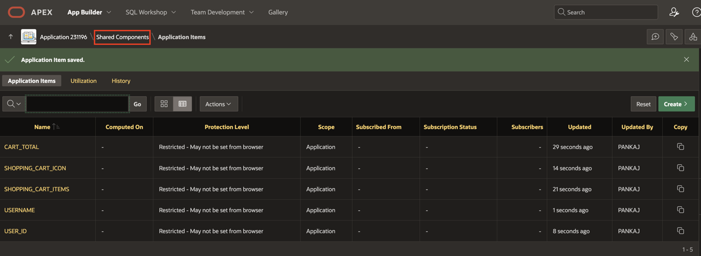

2. Under **Application Logic**, click **Application Processes**.

   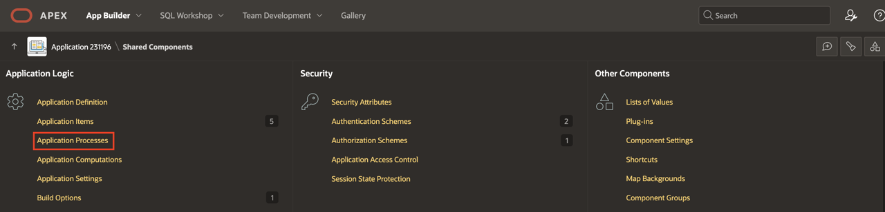

3. Click **Create**.

   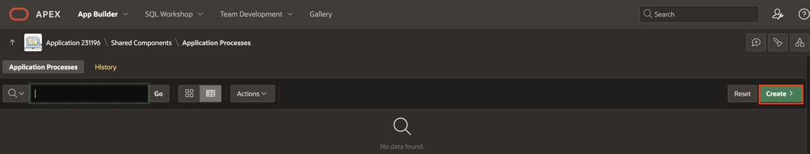

4. Enter/select the following:

    - Under Identification:

        - Name: **Initialize Shopping Cart Info**

        - Point: **On Load: Before Header (page template header)**

       Click **Next**.

    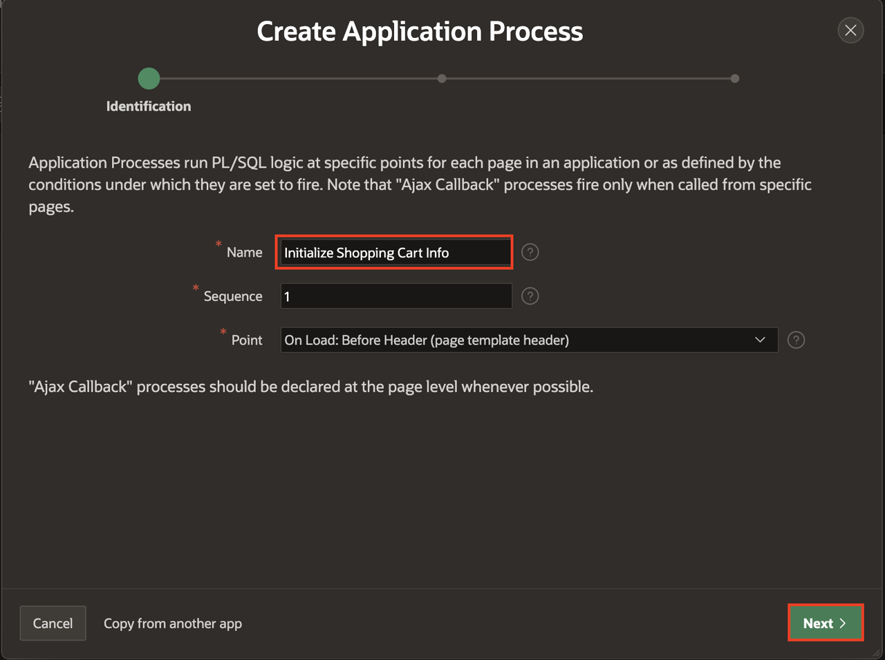

5. Enter the following:

    - Source > Code: Copy and paste the below code.

        ```
    <copy>
     -- Initialize shopping cart navigation bar to show  appropriate icon and count
    DECLARE
        l_cnt NUMBER := obs_manage_orders.get_quantity;
    BEGIN
        IF l_cnt > 0 THEN
            :SHOPPING_CART_ITEMS := l_cnt;
            :SHOPPING_CART_ICON := 'fa-cart-full';
        ELSE
            :SHOPPING_CART_ITEMS := '';
            :SHOPPING_CART_ICON := 'fa-cart-empty';
        END IF;
    END;
    </copy>
    ```

    Click **Next**.

    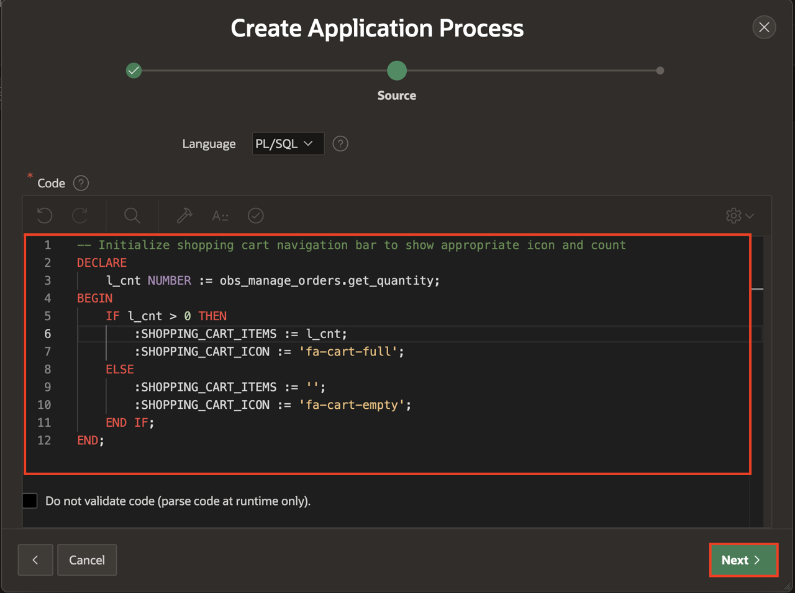

6. Click **Create Process**.

    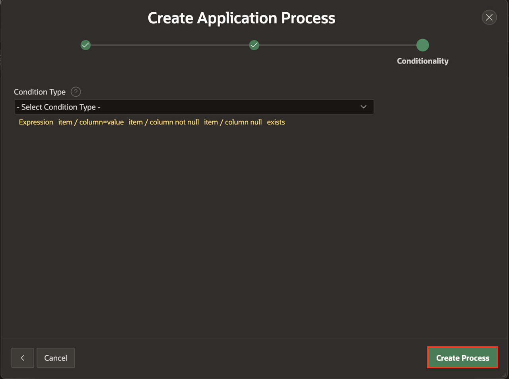

## Task 4: Create Application Computations

In this task, you set up computations to determine user-related information upon authentication.

To create Application Computations:

1. Click **Shared Components**.

    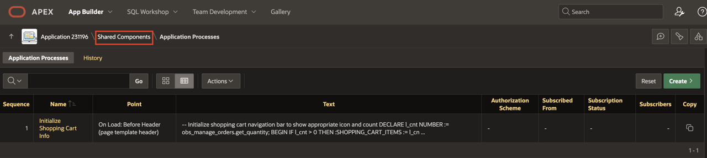

2. Under Application Logic, click **Application Computations**.

   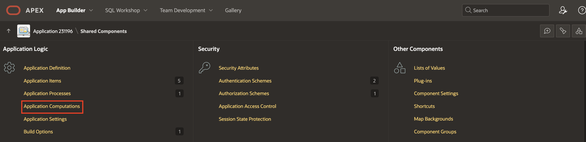

3. Click **Create**.

   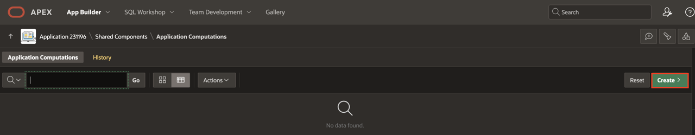

4. Enter/select the following:

    - Item > Computation Item: **USER_ID**

    - Frequency > Computation Point: **After Authentication**

    - Under Computation:

        - Computation Type: **SQL Query (return single value)**

        - Computation: Copy and paste below code:

            ```
            <copy>
            SELECT U.USER_ID
            FROM OBS_USERS U
            WHERE U.USERNAME = LOWER(:APP_USER) OR U.EMAIL = LOWER(:APP_USER);
            </copy>
            ```

    Click **Create Computation**.

    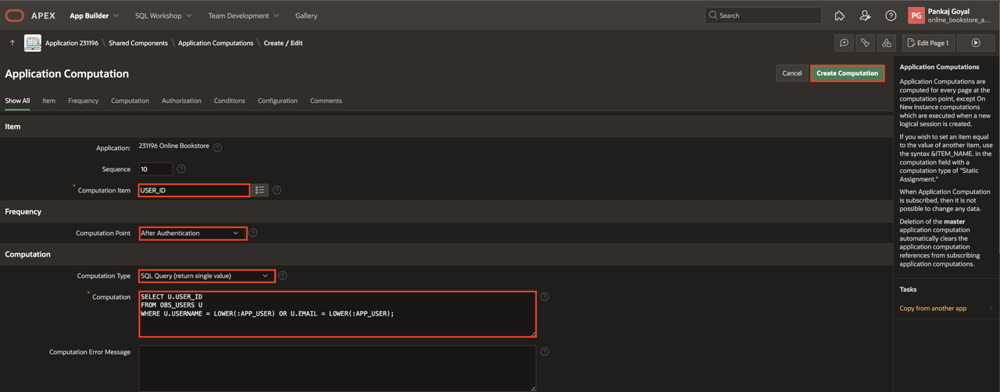

5. Click **Create**.

    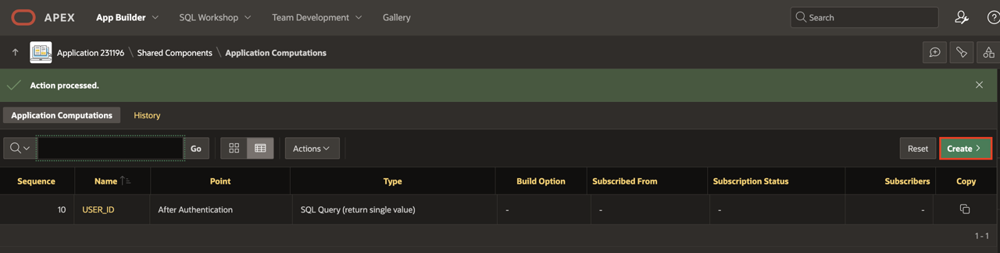

6. Enter/select the following:

    - Under Item:

        - Sequence: **20**

        - Computation Item: **USERNAME**

    - Frequency > Computation Point: **After Authentication**

    - Under Computation:

        - Computation Type: **SQL Query (return single value)**

        - Computation: Copy and paste below code:

            ```
            <copy>
            SELECT U.USERNAME
            FROM OBS_USERS U
            WHERE U.USER_ID=:USER_ID
            </copy>
            ```

    Click **Create Computation**.

  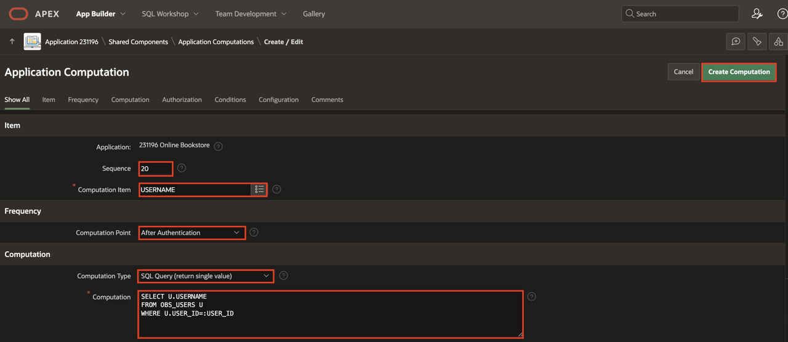

## Task 5: Set Up Book Details Page

In this task, you enhance the Book Details page by enabling the addition and removal of books to/from a shopping cart, updating the cart's item count, and ensuring the interface reflects the current state (whether a book is in the cart or not). This involves creating hidden page items, setting up computations and SQL queries, configuring buttons with server-side conditions, and defining processes to interact with the backend API for managing cart operations.

1. Click **Application ID**.

    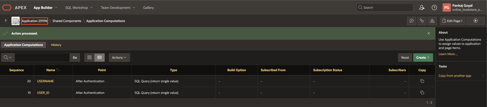

2. On the Application home page, click **18 - Book Details** page.

    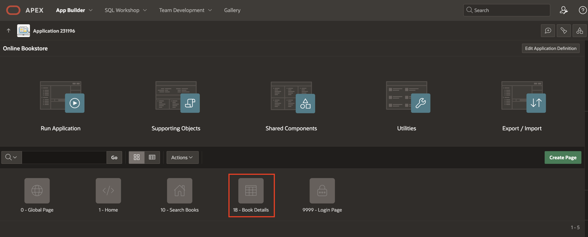

3. In the left pane, right-click **Buttons Bar** and select **Create Page Item**.

    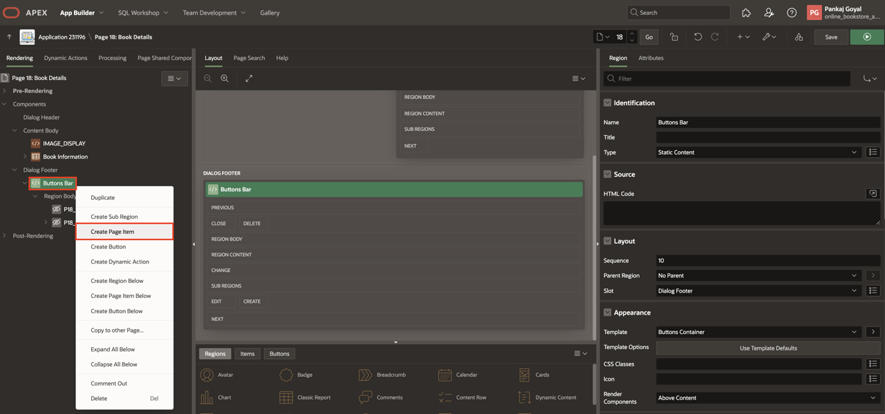

4. Create the following three page items, one after the other:

      | Name            |  Type   |
      | --------------- |  ------ |
      | P18\_SHOPPING\_CART_ITEMS | Hidden |
      | P18\_BOOK\_IN\_CART | Hidden |
      | P18\_QUANTITY | Select List  |
      {: title="List of Page Items"}

    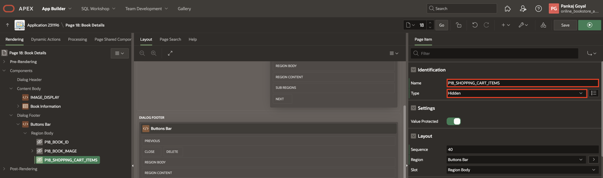

    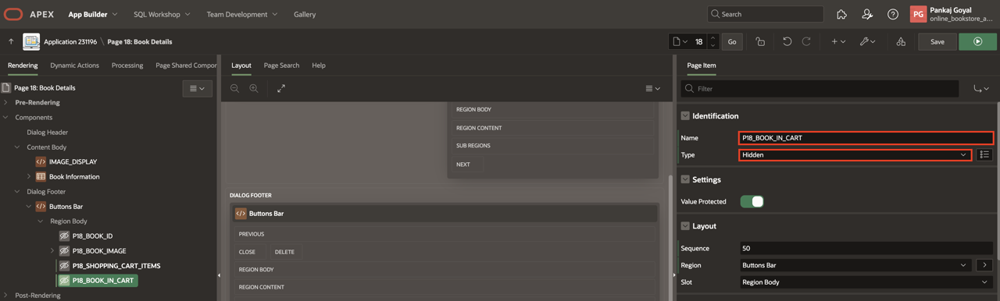

    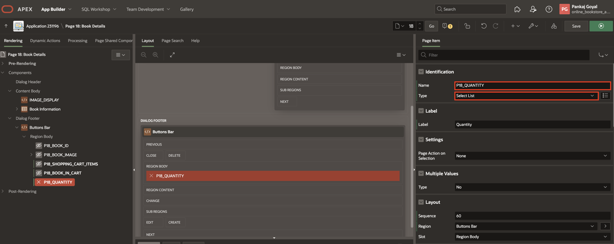

5. Select P18\_QUANTITY and update the following:

    - Appearance > Template: **Required**

    - Under List of Values:

        - Type: **SQL Query**

        - SQL Query: Copy and Paste the below code:

            ```
            <copy>
            WITH list_of_numbers(Num) AS (
              SELECT 1
              FROM dual
              UNION ALL
              SELECT Num+1
              FROM list_of_numbers
              WHERE Num < LEAST(10, (SELECT book_quantity FROM obs_books WHERE book_id = :P18_BOOK_ID))
            )

            SELECT Num as d, Num as r
            FROM list_of_numbers;
            </copy>
            ```

         - Display Extra Values: **Toggle Off**

         - Display Null Values: **Toggle Off**

    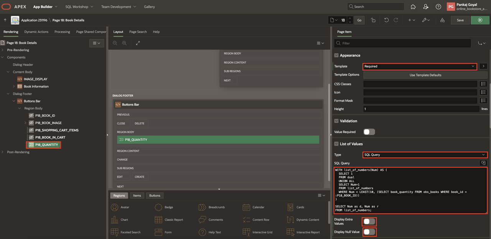

6. Right-click **P18\_BOOK\_IN\_CART** and select **Create Computation**.

    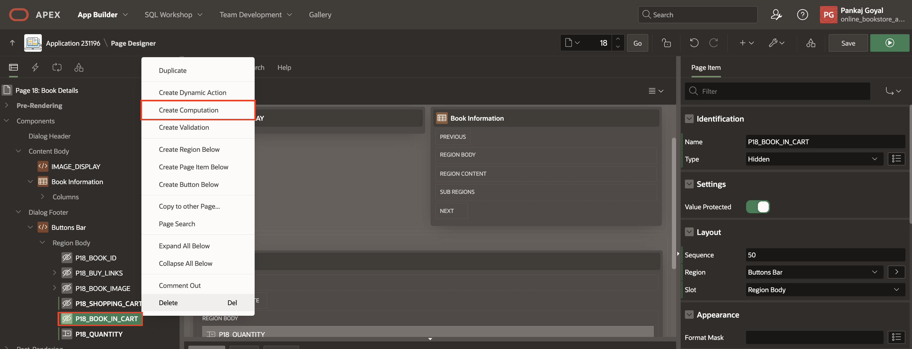

7. In the Property editor, enter/select the following:

    - Under Computation:

        - Type: **Expression**

        - PL/SQL Function Body: Copy and paste the below expression:

            ```
            <copy>
            obs_manage_orders.book_exists(p_book => :P18_BOOK_ID)
            </copy>
            ```

    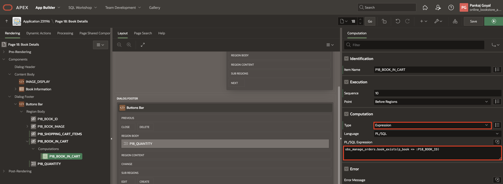

8. In the left pane, right-click **Buttons Bar** and select **Create Button**.

    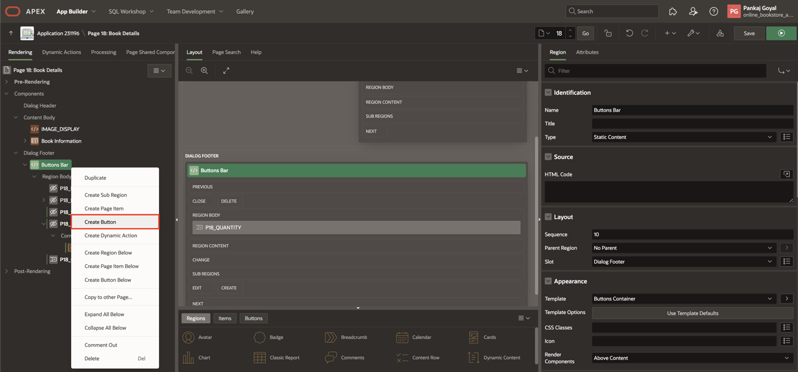

9. In the Property Editor, enter/select the following:

    - Under Identification:

        - Button Name: **Add\_to\_Cart**

        - Label: **Add To Cart**

    - Layout > Slot: **Next**

    - Appearance > Hot: **Toggle On**

    - Under Server-Side Condition:

        - Type: **Item is zero**

        - Item: **P18\_BOOK\_IN\_CART**

    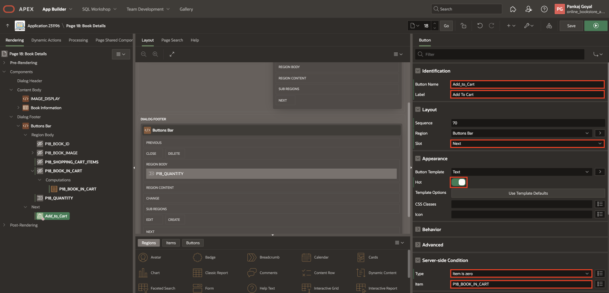

10. Right-click **Buttons Bar** and select **Create Button**.

    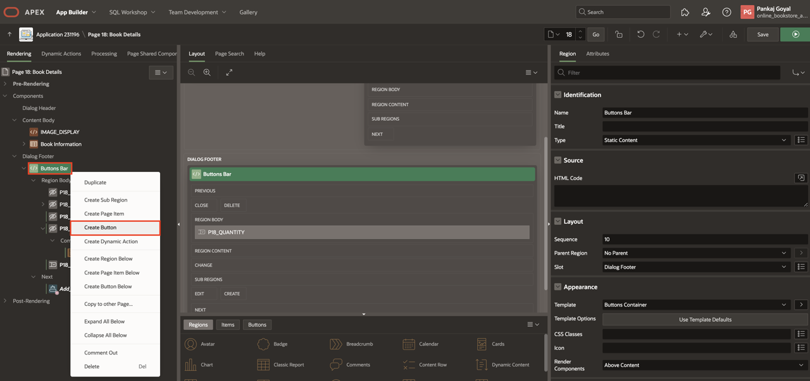

11. In the Property Editor, enter/select the following:

    - Under Identification:

        - Button Name: **Remove\_from\_Cart**

        - Label: **Remove From Cart**

    - Layout > Slot: **Edit**

    - Under Appearance > **Template Options** > Click **Use Template Defaults**

        - Type: **Danger**

        - Spacing Right: **Large**

        Click **OK**.

    - Under Server-Side Condition:

        - Type: **Item is NOT zero**

        - Item: **P18\_BOOK\_IN\_CART**

    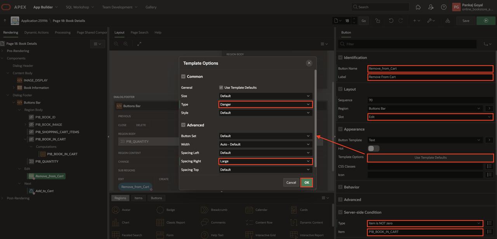

12. Navigate to the **Processing** tab. Right-click **Processing** and select **Create Process**.

    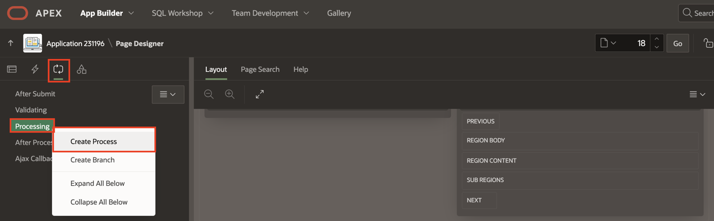

13. In the Property Editor, update the following:

    - Under Identification:

        - Name: **Add product**

        - Type: **Invoke API**

    - Under Settings:

        - Package: **OBS\_MANAGE\_ORDERS**

        - Procedure or Function: **ADD\_BOOK**

    - Server-side Condition > When button pressed: **Add\_to\_Cart**

    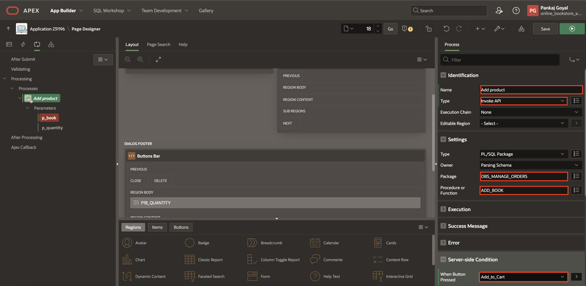

14. Expand the Parameters of **Add Product** and enter the following:

      | Parameter |  Type   | Item |
      | --------- |  ------ | ---- |
      | p\_book | Item | P18\_BOOK\_ID |
      | p\_quantity | Item | P18\_QUANTITY |
      {: title="List of Parameters"}

    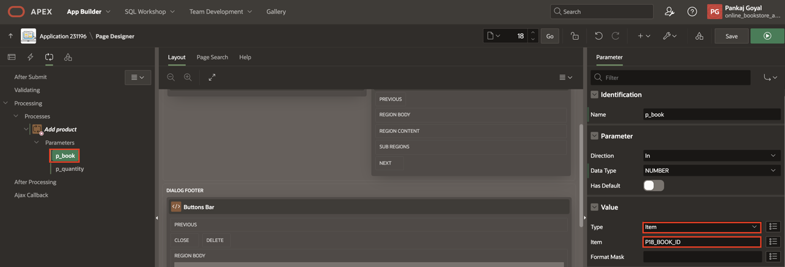

    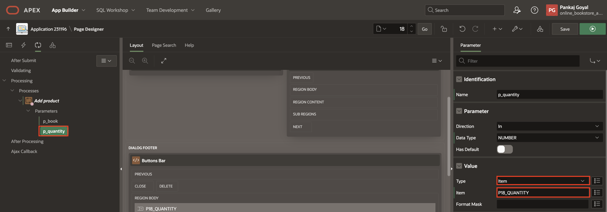

15. Right-click **Processing** and select **Create Process**.

    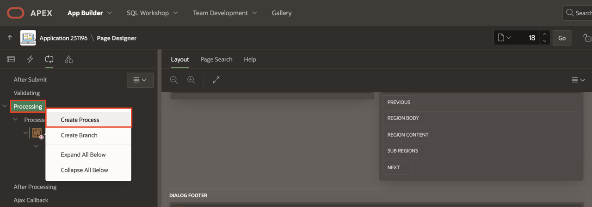

16. In the Property Editor, enter/select the following:

    - Under Identification:

        - Name: **Delete product**

        - Type: **Invoke API**

    - Under Settings

        - Package: **OBS\_MANAGE\_ORDERS**

        - Procedure or Function: **REMOVE\_BOOK**

    - Server-side Condition > When button pressed: **Remove\_from\_Cart**

    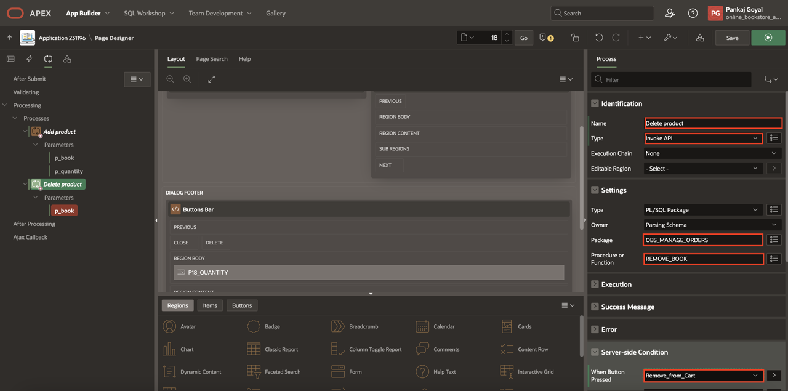

17. Expand the Parameters of **Delete product** and enter the following:

      | Parameter |  Type   | Item |
      | --------- |  ------ | ---- |
      | p\_book | Item | P18\_BOOK\_ID |
      {: title="List of Parameter"}

    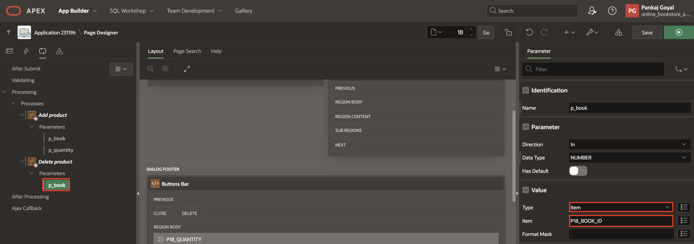

18. Right-click **Processing** and select **Create Process**.

    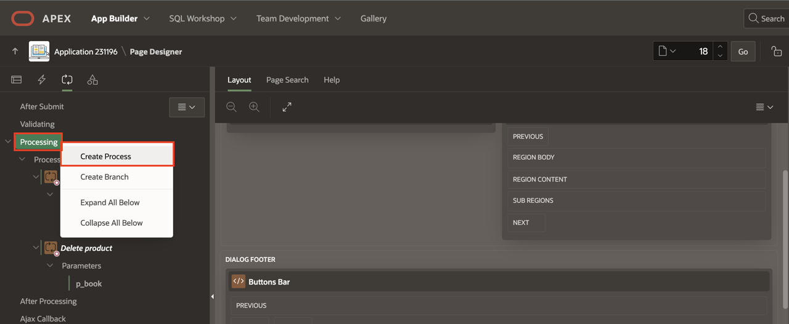

19. In the Property Editor, enter/select the following:

    - Under Identification:

        - Name: **Calculate Shopping Cart Items**

        - Type: **Invoke API**

    - Under Settings:

        - Package: **OBS\_MANAGE\_ORDERS**

        - Procedure or Function: **GET\_QUANTITY**

    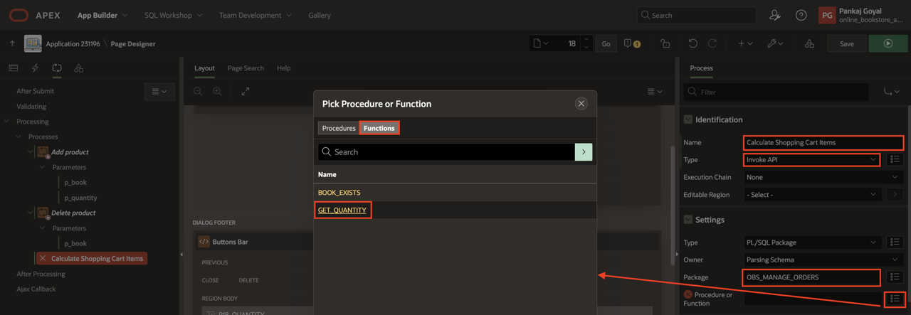

20. Expand the Parameter of **Calculate Shopping Cart Items** and enter the following:

     | Parameter |  Type   | Item |
     | --------- |  ------ | ---- |
     | Function Result | Item | P18\_SHOPPING\_CART\_ITEMS |
     {: title="List of Parameter"}

    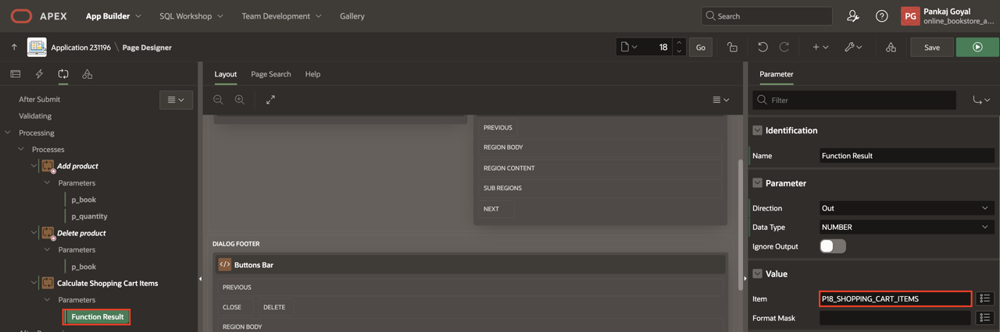

21. Right-click **Processing** and select **Create Process**.

    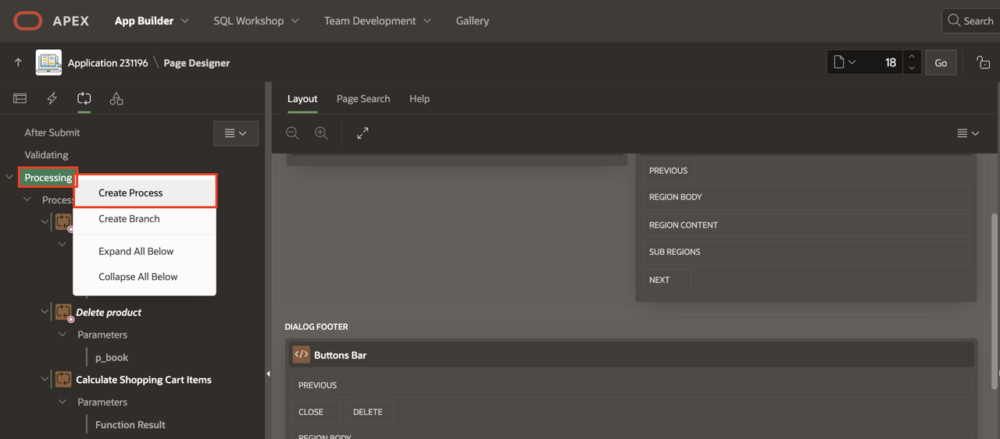

22. In the Property Editor, enter/select the following:

    - Under Identification:

        - Name: **Close Dialog**

        - Type: **Close Dialog**

    - Settings > Items to Return: **P18\_SHOPPING\_CART_ITEMS, P18\_BOOK\_ID**

    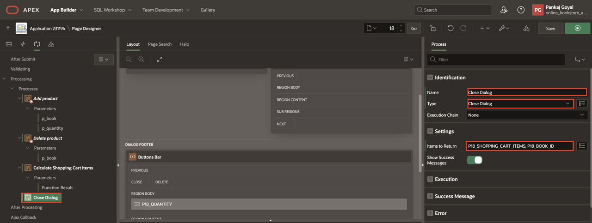

23. Click **Save**.

    

## Task 6: Add Shopping Cart to Navigation Bar List

In this task, you create a navigation bar entry that displays a shopping cart icon, links to page 17, and shows a badge with the number of items in the shopping cart.

1. Navigate to **Shared Components**.

    

2. Under **Navigation and Search**, click **Navigation Bar List**.

    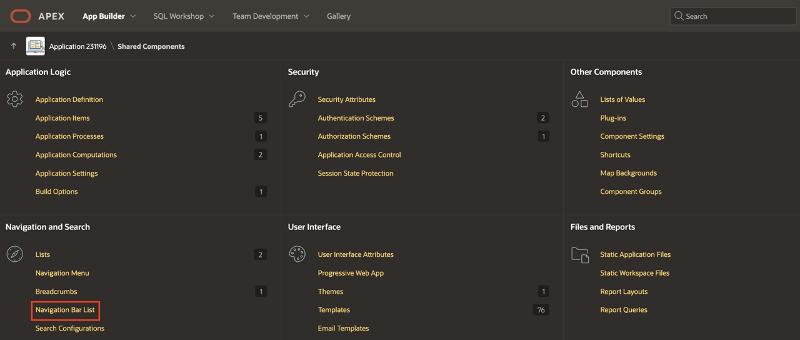

3. Click **Navigation Bar**

    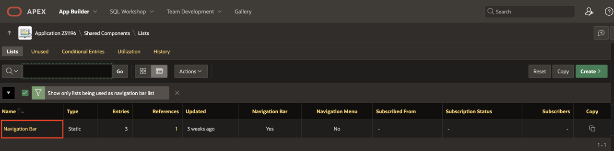

4. Click **Create List Entry**.

    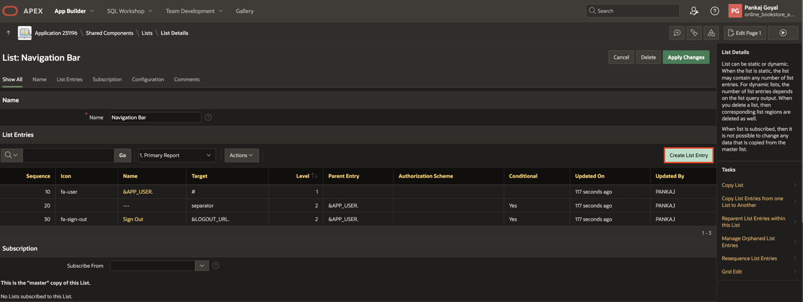

5. Enter/select the following:

    - Under Entry:

        - Sequence: **9**

        - Image/Class: **&SHOPPING\_CART\_ICON.**

        - List Entry Label: **Shopping Cart**

    - Under Target:

        - Page: **17**

        - Clear Cache: **17**

    - Under User Defined Attributes:

        - Badge Value: **&SHOPPING\_CART\_ITEMS.**

        - List Item CSS Classes: **js-shopping-cart-item**

     Click **Create List Entry**.

  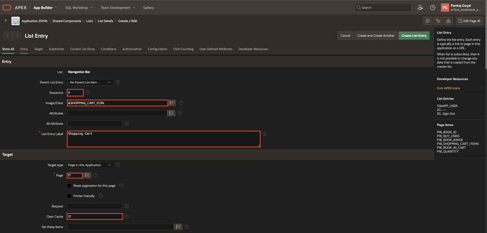

  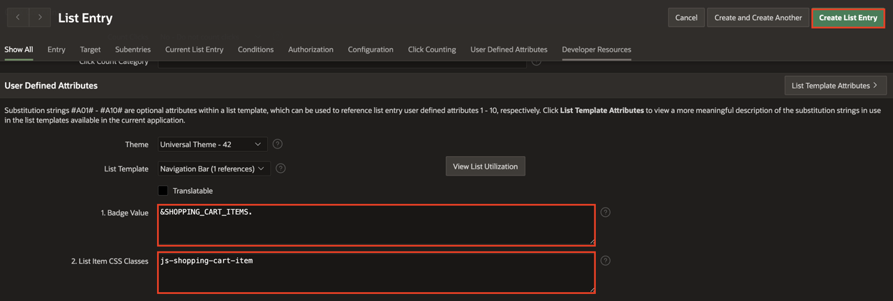

## Task 7: Create a Dynamic Action to Update Shopping Cart Header

 In this task, you create a dynamic action that updates the shopping cart icon and badge based on the number of items in the cart. When the dialog is closed, if there are items in the cart, the cart icon will display the number of items. If the cart is empty, the icon will show as empty and the badge will be cleared.

1. Click **Application ID**.

    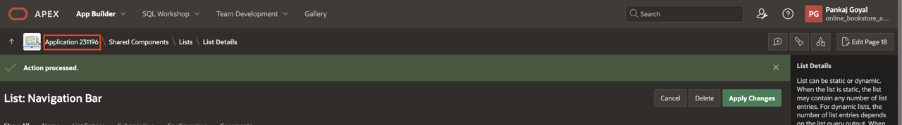

2. Click **Page 10 - Search Books**.

    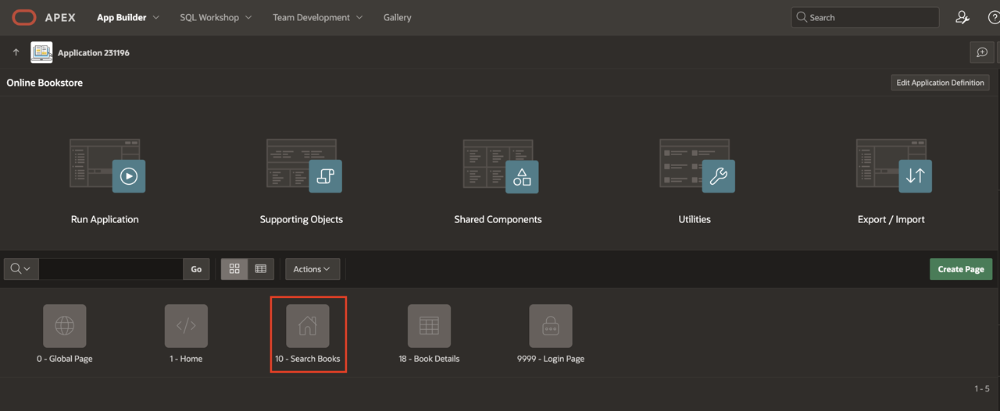

3. In the left pane, right-click **Search Results** region and select **Create Dynamic Action**.

    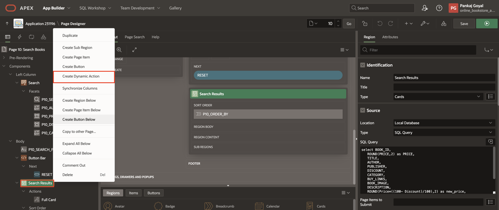

4. In the Property Editor, enter/select the following:

    - Identification > Name: **Update Shopping Cart Header**

    - When > Event: **Dialog Closed**

    - Under Client-side Condition:

        - Type: **JavaScript expression**

        - JavaScript expression: Copy and paste the below code:

            ```
            <copy>
            parseInt(this.data.P18_SHOPPING_CART_ITEMS) > 0
            </copy>
            ```

    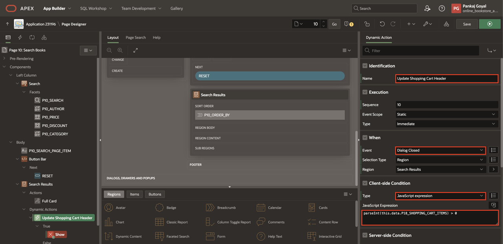

5. Click **TRUE** action, In the Property Editor, enter/select the following:

    - Indentification > Action: Execute JavaScript Code.

    - Setting > Code: Copy and paste the below code:

        ```
        <copy>
        // Update Badge Text
        apex.jQuery(".js-shopping-cart-item .t-Button-badge").text(this.data.P18_SHOPPING_CART_ITEMS);
        // Update Icon
        apex.jQuery(".js-shopping-cart-item .t-Icon").removeClass('fa-cart-empty').addClass('fa-cart-full');
        </copy>
        ```

        or

        ```
        <copy>
        // Update Badge Text
        $(".js-shopping-cart-item .t-Button-badge").text(this.data.P18_SHOPPING_CART_ITEMS);
        // Update Icon
        $(".js-shopping-cart-item .t-Icon").removeClass('fa-cart-empty').addClass('fa-cart-full');
        </copy>
        ```

    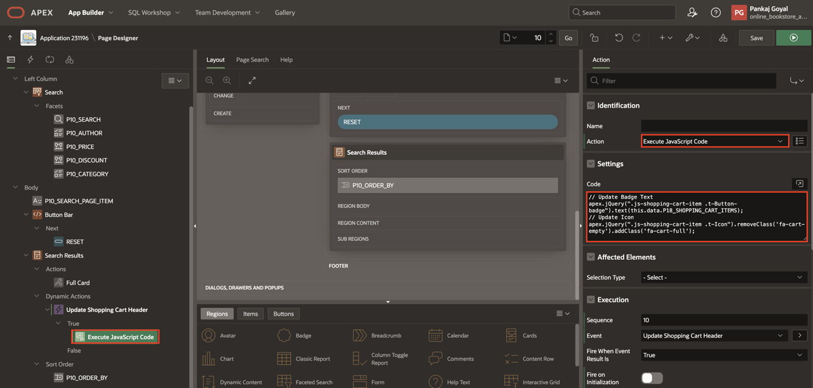

6. Right-click on **False** action and select **Create FALSE Action**.

    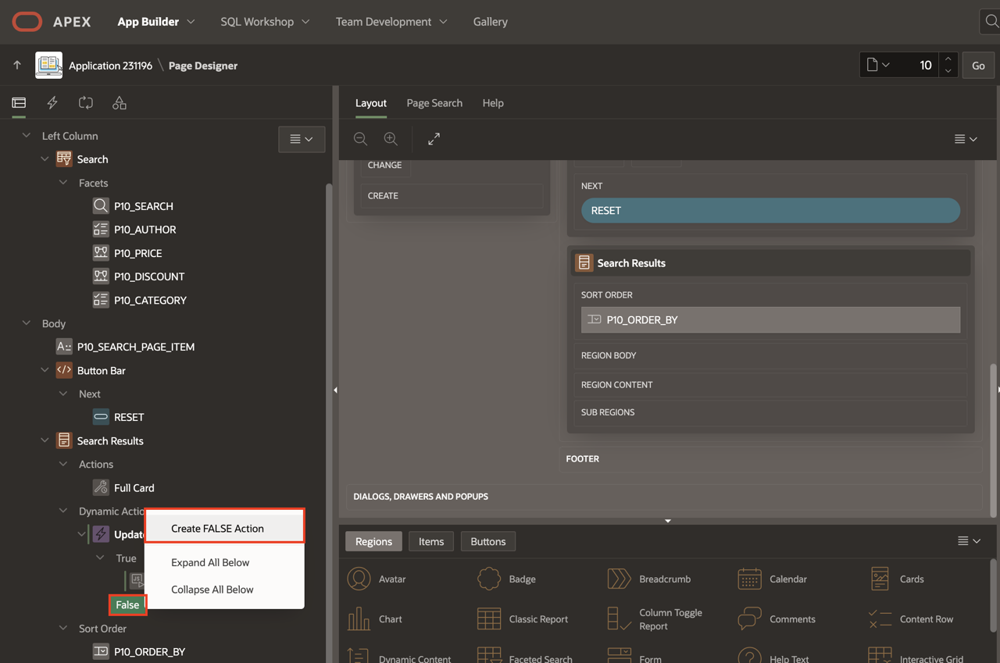

7. In the Property Editor, enter/select the following:

    - Action: Execute JavaScript Code.

    - Setting > Code: Copy and paste the below code:

        ```
        <copy>
        // Update Badge Text
        apex.jQuery(".js-shopping-cart-item .t-Button-badge").text('');
        // Update Icon
        apex.jQuery(".js-shopping-cart-item .t-Icon").removeClass('fa-cart-full').addClass('fa-cart-empty');
        </copy>
        ```

        or

        ```
        <copy>
        // Update Badge Text
        $(".js-shopping-cart-item .t-Button-badge").text('');
        // Update Icon
        $(".js-shopping-cart-item .t-Icon").removeClass('fa-cart-full').addClass('fa-cart-empty');
        </copy>
        ```

    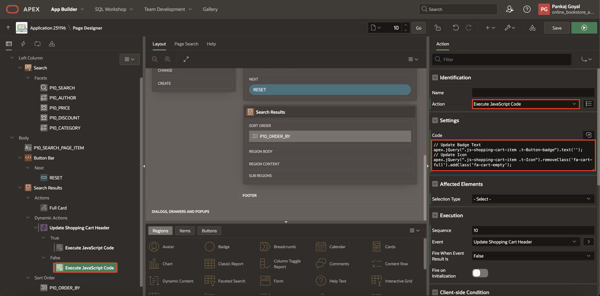

8. Click **Save**.

    

## Task 8: Run the Application

In this task, you will add a book to the cart, observe the cart item count, and remove a book from the cart to verify the update.

1. Run the application and enter the credentials below:

      - Username: **user01**

      - Password: **secretPassword**

    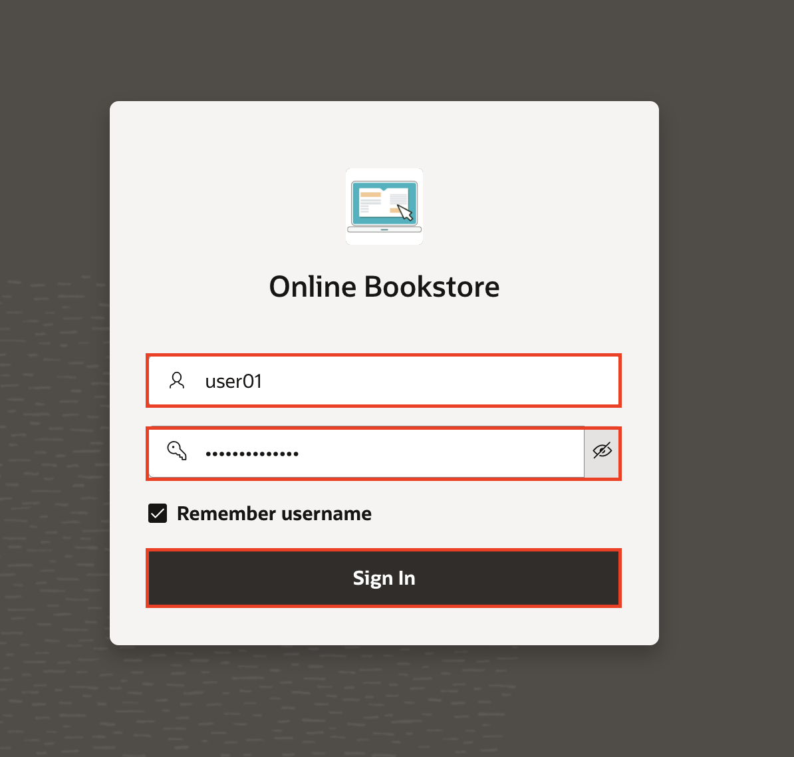

2. Click on any book, select the **Quantity**, and click **Add To Cart**.

    

    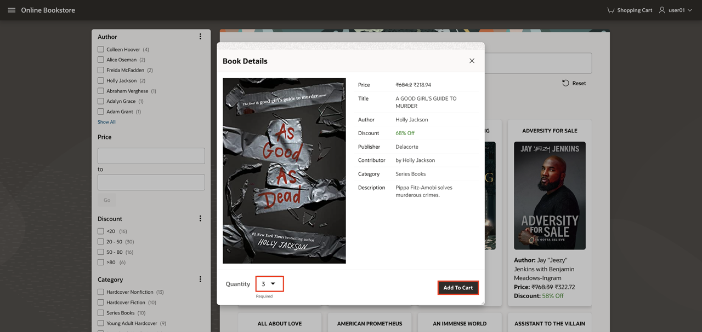

3. Observe the total number of items on the shopping cart entry in the navigation bar

    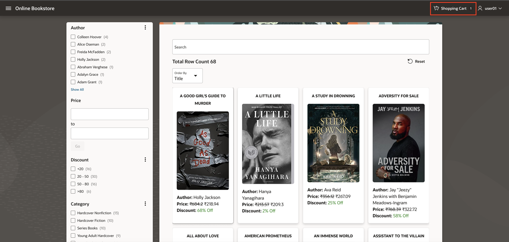

4. To remove a book from the cart, click on the book and then click **Remove From Cart**.

    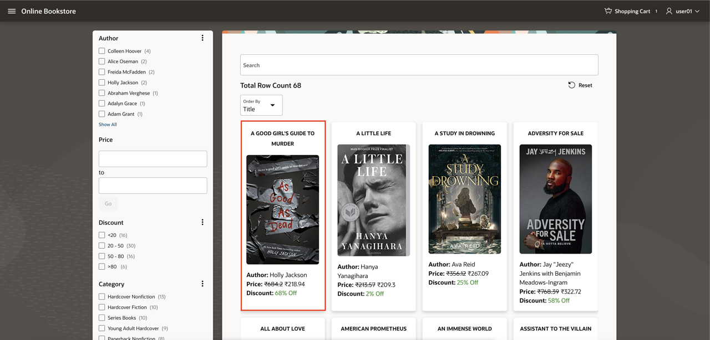

    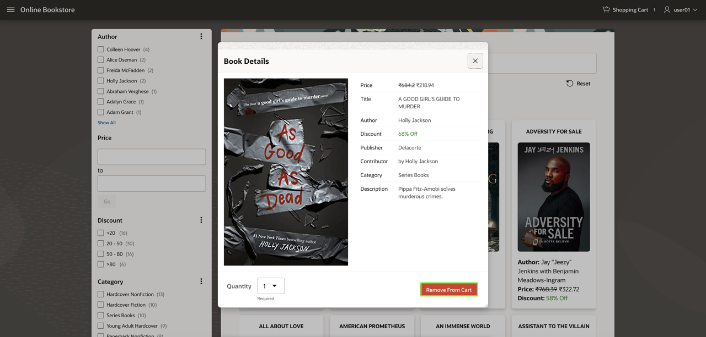

## Summary

In this lab, you have learned to enhance the Book Details page by creating a package to manage shopping cart functionalities, defining application items to store session state information, implementing application processes to run PL/SQL code at specific points, and setting up computations to determine user-related information. These steps enable the addition and removal of books to/from a shopping cart, updating the cart's item count, and ensuring the interface dynamically reflects the current state of the cart. You are now ready to move on to the next lab!

## Acknowledgements

- **Author**: Pankaj Goyal, Member Technical Staff; Ankita Beri, Product Manager
- **Last Updated By/Date**: Pankaj Goyal, Member Technical Staff, March 2025
