# Create and Manage a Shopping Cart

## Introduction

In this lab, you will learn to create and manage a shopping cart within an Oracle APEX application. The lab includes adding navigation bar entry, creating a shopping cart page, implementing various interactive components, and integrating backend processes to handle cart operations and checkout procedures. This exercise will demonstrate the comprehensive capabilities of APEX for building dynamic web applications with a strong emphasis on database interaction and user interface design.

Estimated Time: 30 minutes

### Objectives

In this lab, you will:

- Build a Shopping Cart Page
- Build Order Information Page
- Create a Navigation Bar Entry
- Build My Books Page
- Create Application Processes
- Create Application Computations

### Downloads: Missed Previous Labs? Download and Install the Application

If you're stuck or missed out on completing the previous labs, don't worry! Click [here](https://c4u04.objectstorage.us-ashburn-1.oci.customer-oci.com/p/EcTjWk2IuZPZeNnD_fYMcgUhdNDIDA6rt9gaFj_WZMiL7VvxPBNMY60837hu5hga/n/c4u04/b/livelabsfiles/o/obs-lab6.zip) to download the export file, which contains everything completed in the previous labs. To run the app, follow the steps described in the [Lab Appendix: Download Instructions](?lab=download-instructions) from Task 2 to Task 3.

## Task 1: Build a Shopping Cart Page

In this task, you develop a new page in the application to display the shopping cart with book details, quantities, and prices. Additionally, you implement SQL queries to fetch cart data and display it in a user-friendly format.

1. Navigate to **Application ID**.

    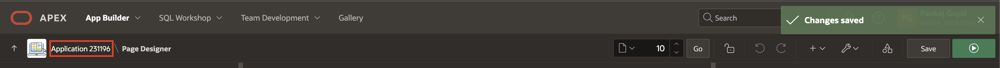

2. Click **Create Page**.

    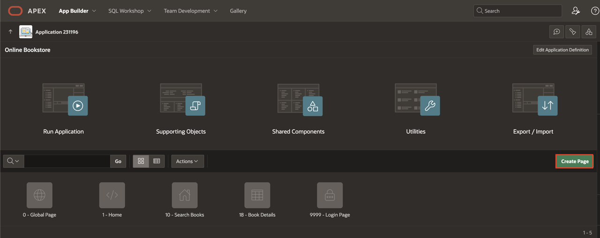

3. Select **Blank Page**.

    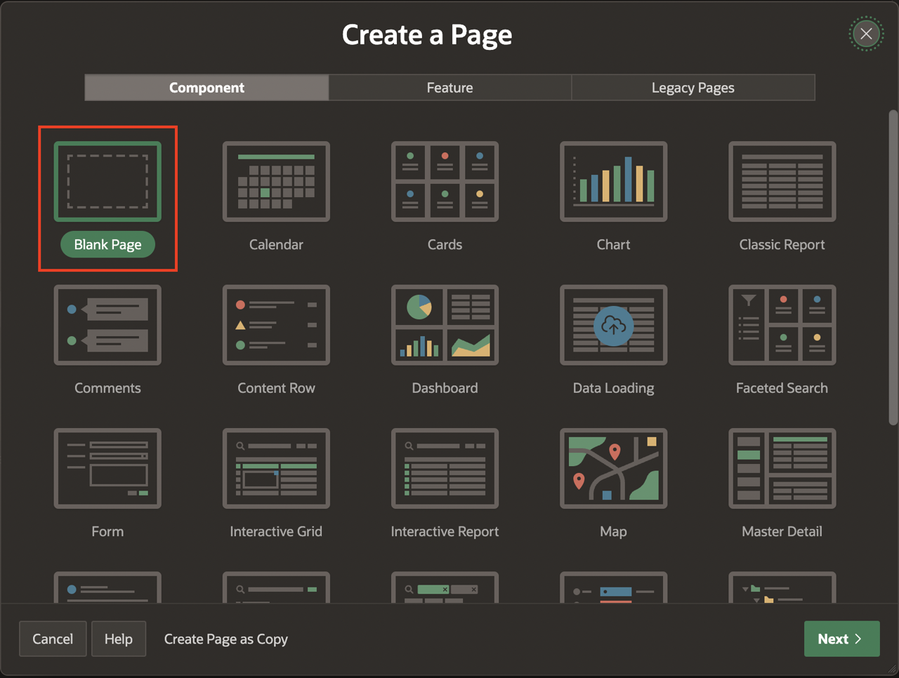

4. In Create Blank Page dialog, enter the following:

    - Under Identification:

        - Page Number: **17**

        - Name: **Shopping Cart**

    - Under Navigation:

        - Use Breadcrumb: **Toggle Off**

        - Use Navigation: **Toggle Off**

        Click **Create Page**.

    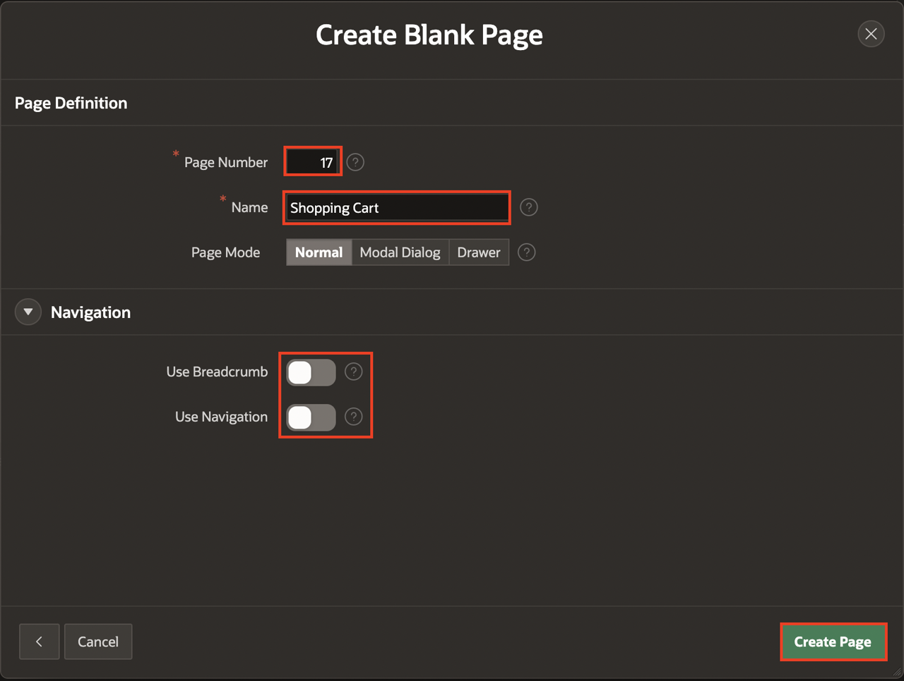

5. In the left pane, right-click **Body** and select **Create Region**.

    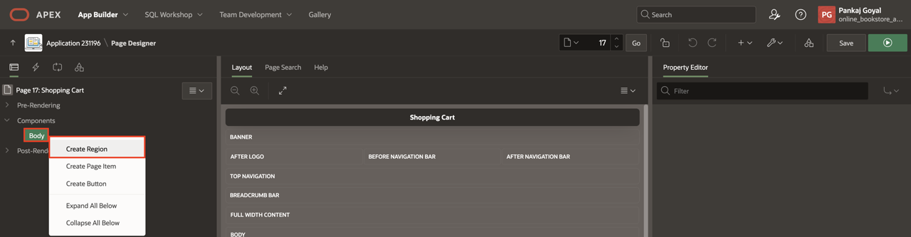

6. In the Property Editor, enter/select the following:

    - Under Identification:

        - Name: **Shopping Cart**

        - Type: **Content Row**

    - Under Source:

        - Type: **SQL Query**

        - SQL Query: Copy and paste the below code into the code editor:

            ```
            <copy>
            SELECT
                b.book_id,
                b.title,
                b.price,
                b.description,
                b.discount,
                b.category,
                b.author,
                b.book_image,
                a.n002 AS quantity,
                b.price * ((100 - b.discount) / 100) AS new_price,
                ROUND(b.price * a.n002, 2) AS total_price,
                ROUND(b.price * ((100 - b.discount) / 100) * a.n002, 2) AS new_total_price
            FROM
                apex_collections a,
                obs_books b
            WHERE
                collection_name = 'BOOKS'
                AND b.book_id = a.n001;
            </copy>
            ```

    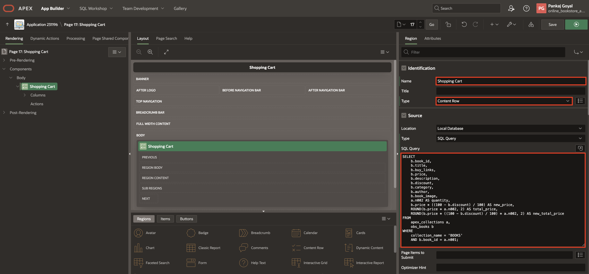

7. In the right pane, select **Attributes** and enter the following:

    - Under Settings

        - Title: **&TITLE.**

        - Description: Copy and paste the code below:

            ```
            <copy>
            &DESCRIPTION.
            </br></br>
            <b>Quantity:</b> &QUANTITY. </br>
            <b>Price:</b> <strike> ₹&TOTAL_PRICE.</strike> ₹&NEW_TOTAL_PRICE.
            <span style="color: green;">&DISCOUNT.% Off</span>
            </copy>
            ```

         - Display Avatar: **Toggle On**

    - Under Avatar:

        - Type: **Image**

        - Image:

            - Source: **URL**

            - URL: **&BOOK_IMAGE.**

            Click **OK**

        - Shape: **No shape**

        - Size: **Extra Extra Large**

    - Messages > When No Data Found: **Your shopping cart is empty!**

    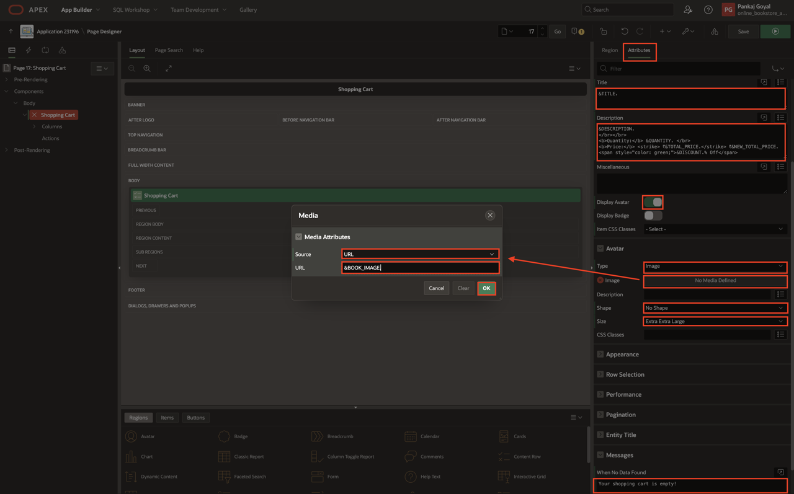

8. In Page Rendering, under **Shopping Cart** region, right-click **Actions** and select **Create Action**.

    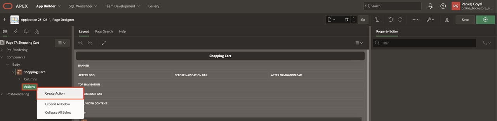

9. In the Property Editor, enter the following:

    - Under Identification:

         - Position: **Primary Actions**

         - Template: **Button**

         - Label: **-**

    - Under Link:

        - Type: **Redirect to URL**

        - Target > URL: **#action$decrease-cart?id=&BOOK_ID.&quantity=&QUANTITY.**

        Click **OK**.

    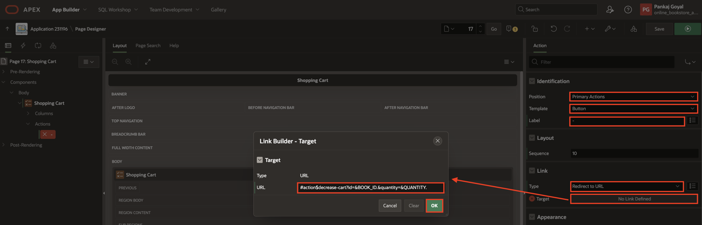

10. Right-click **Actions** and select **Create Action**.

    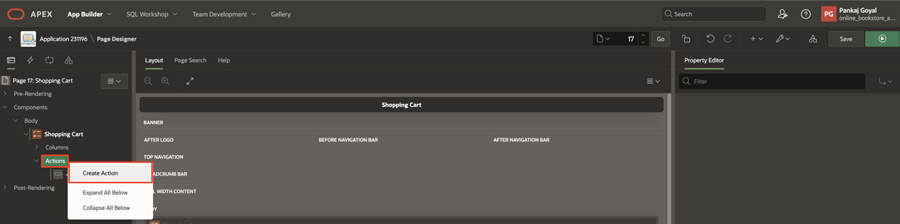

11. In the Property Editor, enter the following:

    - Under Identification:

         - Position: **Primary Actions**

         - Template: **Button**

         - Label: **Remove**

    - Under Link:

        - Type: **Redirect to URL**

        - Target > URL: **#action$remove-cart?id=&BOOK_ID.**

        Click **OK**.

    - Under Appearance:

        - Display Type: **Icon**

        - Icon: **fa-trash**

    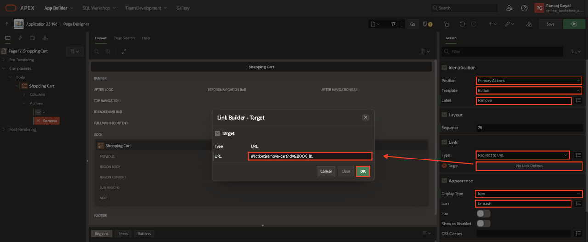

12. Right-click **Actions** and select **Create Action**.

    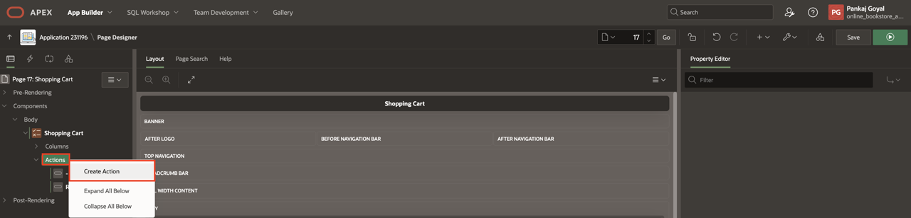

13. In the Property Editor, enter the following:

    - Under Identification:

         - Position: **Primary Actions**

         - Template: **Button**

         - Label: **+**

    - Under Link:

        - Type: **Redirect to URL**

        - Target > URL: **#action$increase-cart?id=&BOOK_ID.&quantity=&QUANTITY.**

        Click **OK**.

    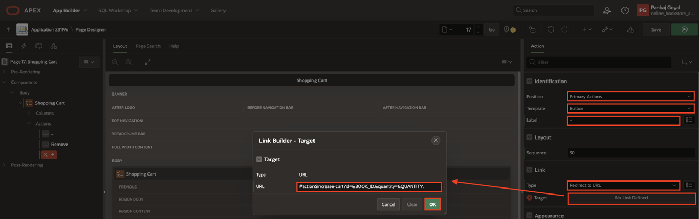

14. Right-click **Shopping Cart** region and select **Create Page Item**.

    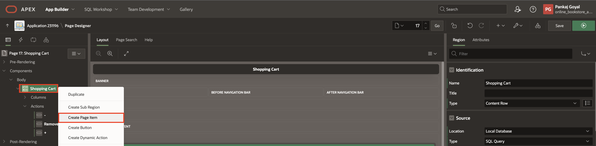

15. Create the following page items:

    | Name            |  Type   | Value Protected |
    | --------------- |  ------ | --------------- |
    | P17\_BOOK\_ID | Hidden | Toggle Off |
    | P17\_QUANTITY | Hidden | Toggle Off |
    {: title="List of Page Items"}


    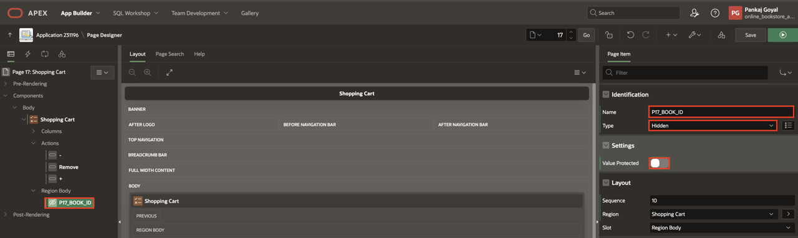

    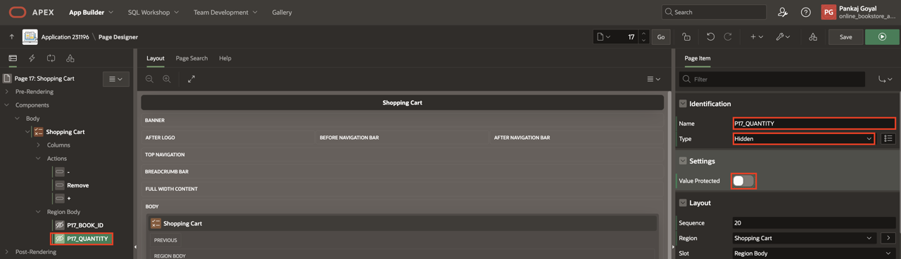

16. Click **Page 17: Shopping Cart** and under JavaScript, **Execute when Page Loads**: Copy and paste the below code:

     ```
    <copy>
    apex.actions.add([{
    name: "remove-cart",
    action: (event, element, args) => {
        apex.page.submit( {
        request: "REMOVE_FROM_CART",
        set: {
        "P17_BOOK_ID": args.id
        },
        showWait: true,
    } );
        }
    }]);

    apex.actions.add([
    {
        name: "increase-cart",
        action: (event, element, args) => {
        apex.page.submit({
            request: "INCREASE_CART",
            set: {
            "P17_BOOK_ID": args.id,
            "P17_QUANTITY": args.quantity
            },
            showWait: true
        });
        }
    }
    ]);

    apex.actions.add([
    {
        name: "decrease-cart",
        action: (event, element, args) => {
        apex.page.submit({
            request: "DECREASE_CART",
            set: {
            "P17_BOOK_ID": args.id,
            "P17_QUANTITY": args.quantity
            },
            showWait: true
        });
        }
    }
    ]);
    </copy>
    ```

    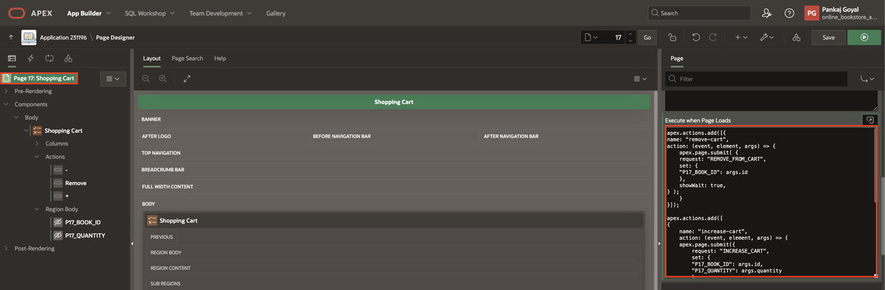

17. Click **Save**

    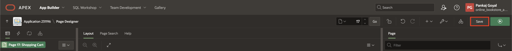

18. Update **OBS\_MANAGE\_ORDERS** Package. Click **SQL Workshop** and navigate to **Object Browser**.

    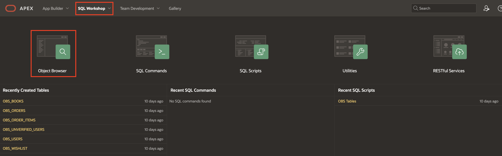

19. In the object tree, expand **Packages** and click **OBS\_MANAGE\_ORDERS** package.

20. Under **Specification**, add the below two procedures after  **remove\_book** procedure with the below code:

    ```
    <copy>
    PROCEDURE increase_book_in_cart (
        p_book     IN NUMBER,
        p_quantity IN NUMBER
    );

    PROCEDURE decrease_book_in_cart (
        p_book     IN NUMBER,
        p_quantity IN NUMBER
    );
    </copy>
    ```

    Click **Save and Compile**.

    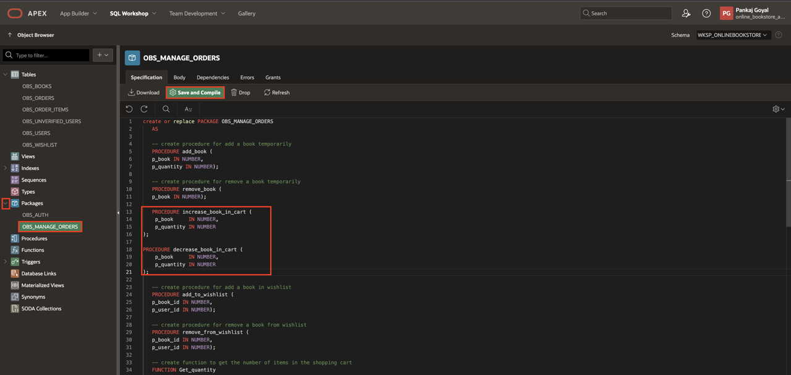

21. Under **Body**, copy and paste below code after **remove\_book** procedure:

    ```
    <copy>
    PROCEDURE increase_book_in_cart (
        p_book     IN NUMBER,
        p_quantity IN NUMBER
    )
    IS
    BEGIN
        remove_book(p_book);
        add_book(p_book, p_quantity + 1);
    END increase_book_in_cart;

    PROCEDURE decrease_book_in_cart (
        p_book     IN NUMBER,
        p_quantity IN NUMBER
    )
    IS
    BEGIN
        IF p_quantity = 1 THEN
            remove_book(p_book);
        ELSE
            remove_book(p_book);
            add_book(p_book, p_quantity - 1);
        END IF;
    END decrease_book_in_cart;
    </copy>
    ```

   Click **Save and Compile**.

    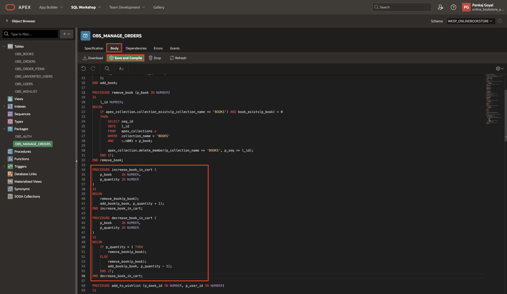

22. Again, navigate back to **Page 17**, right-click **Body** and select **Create Region**.

    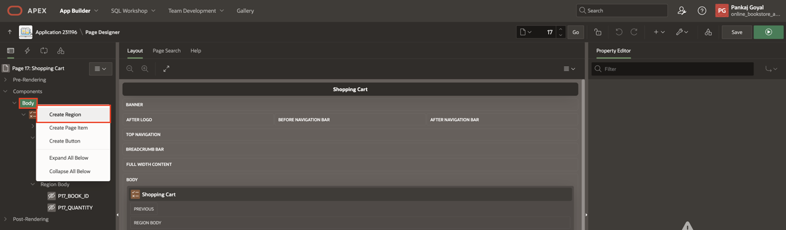

23. For Name: **Order Information**

    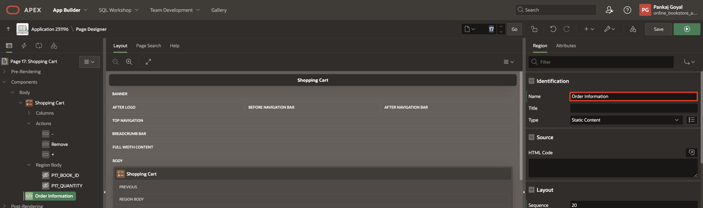

24. Right-click **Order Information** and select **Create Page Item**.

    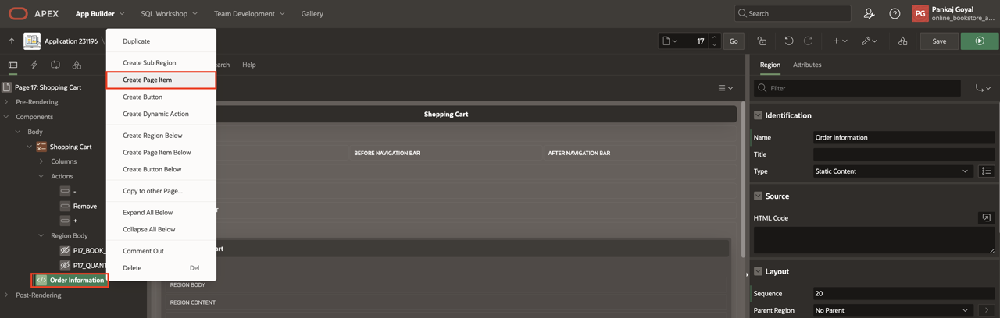

25. Create the following three page items:

    | Name            |  Type   | Label |
    | --------------- |  ------ | --------------- |
    | P17\_ORDER\_ID | Hidden |  |
    | P17\_NO\_OF\_BOOKS |Display Only | Number of Books |
    | P17\_TOTAL | Display Only | Grand Total|
    {: title="List of Page Items"}

    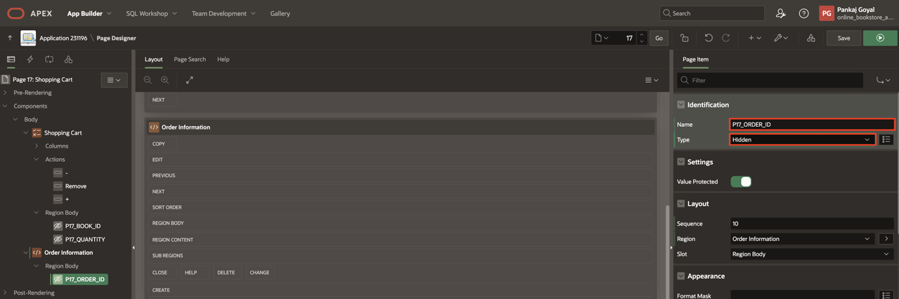

    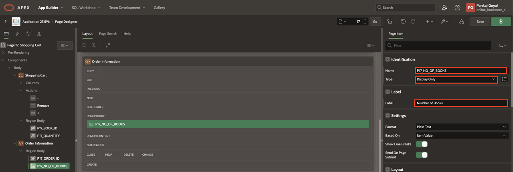

    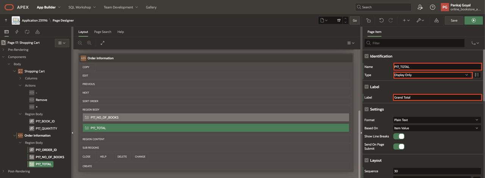

26. Click **Save**.

    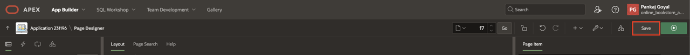

## Task 2: Implement Page Interactions

In this task, you create buttons for removing items from the cart and proceeding to checkout. Next, you add computations to dynamically calculate the total number of books and the grand total price. Lastly, you set up processes to handle cart operations, such as removing items and clearing the cart.

1. Right-click **P17\_NO\_OF\_BOOKS** and select **Create Computation**.

    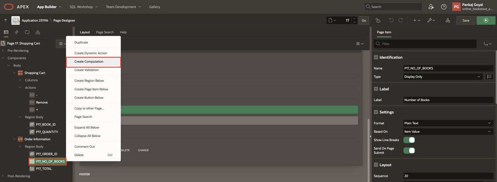

2. In the Property Editor, enter the following:

    - Under Computation:

        - Type: **SQL Query (return single value)**

        - SQL Query: Copy and paste the below code:

          ```
          <copy>
        WITH cart AS (
            SELECT
                n001 AS book_id,
                n002 AS quantity
            FROM apex_collections
            WHERE collection_name = 'BOOKS'
)
SELECT
    SUM(c.quantity) AS total_quantity
FROM cart c
JOIN obs_books b
    ON b.book_id = c.book_id;
          </copy>
          ```

    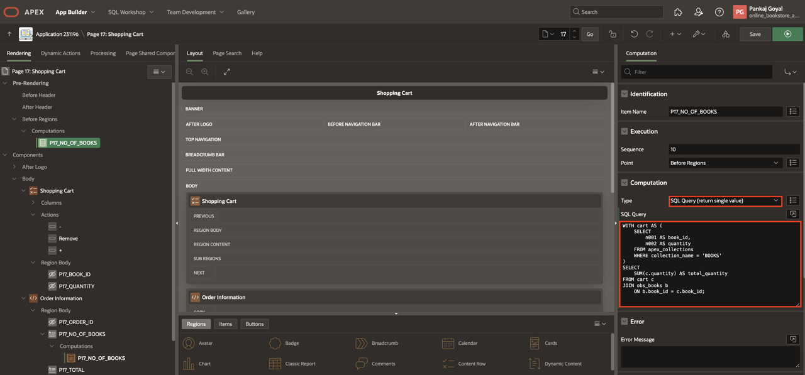

3. Right-click **P17\_TOTAL** and select **Create Computation**.

    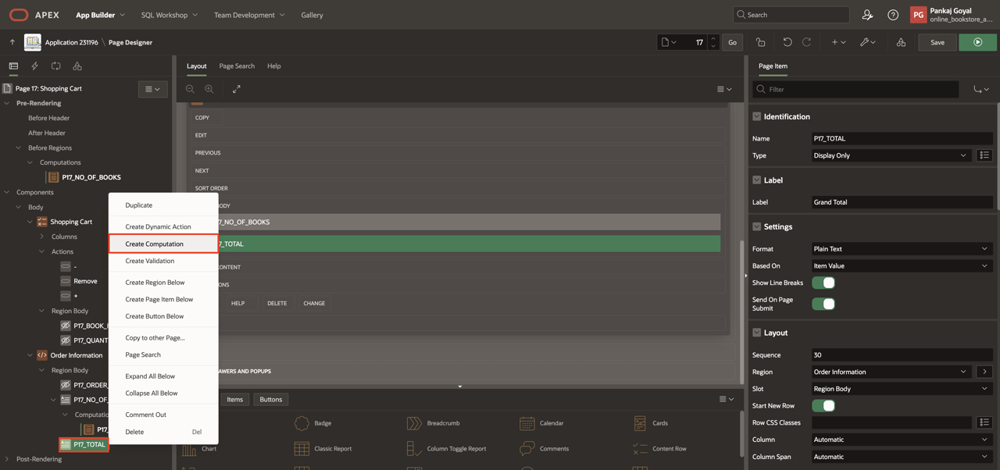

4. In the Property Editor, enter/select the following:

    - Under Computation:

        - Type: **SQL Query (return single value)**

        - SQL Query: Copy and paste the below code:

            ```
            <copy>
            WITH cart AS (
                SELECT
                    n001 AS book_id,
                    n002 AS quantity
                FROM apex_collections
                WHERE collection_name = 'BOOKS'
)
SELECT
    ROUND(SUM(b.price * ((100 - b.discount) / 100) * c.quantity), 0) AS total_cost
FROM cart c
JOIN obs_books b
    ON b.book_id = c.book_id;
            </copy>
            ```

    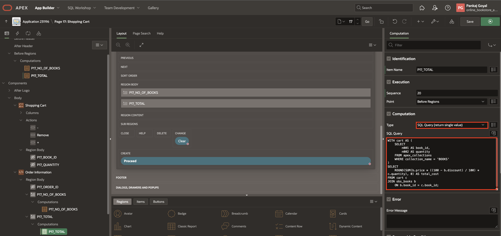

5. Right-click **Order Information** and select **Create Button**.

    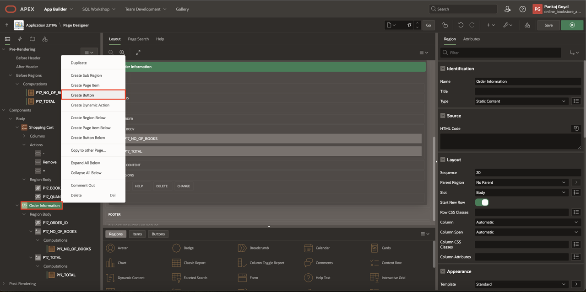

6. In the Property Editor, enter/select the following:

    - Under Identification:

        - Button Name: **Clear**

        - Label: **Clear Shopping Cart**

    - Layout > Slot: **Change**

    - Under Appearance:

        - Button Template: **Text with Icon**

        - Template Options: Click **Use Template Defaults, Left** 

            - Size: **Small**

            - Type: **Danger**

            Click **OK**

        - Icon: **fa-cart-empty**

    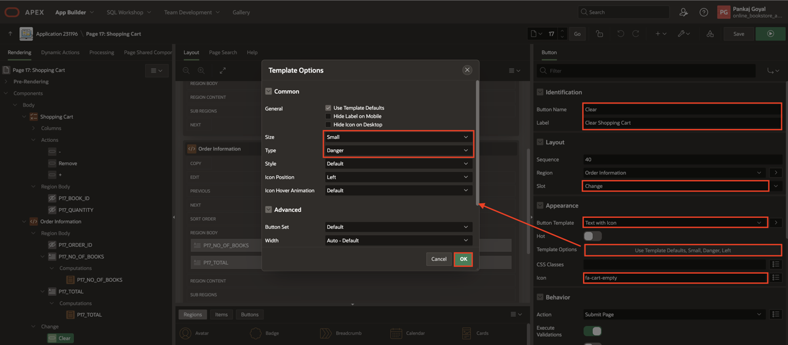

7. Right-click **Order Information** and select **Create Button**.

    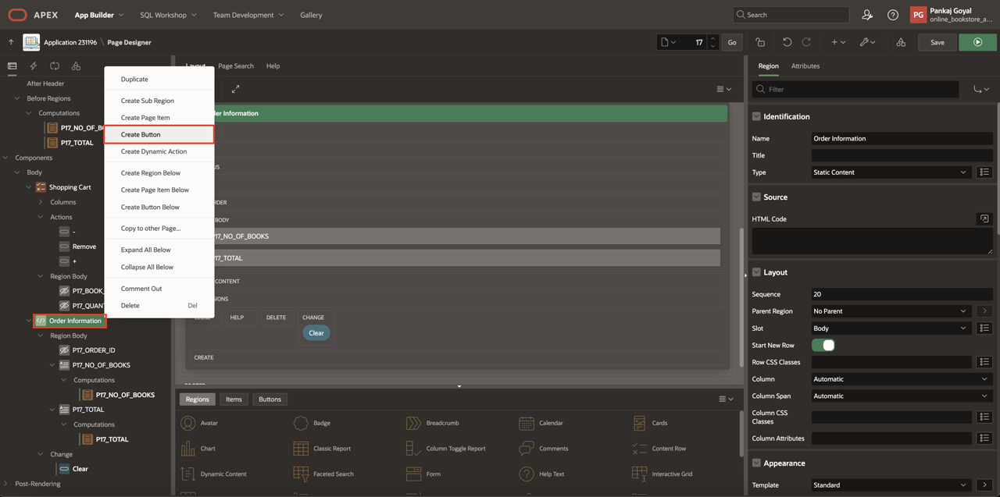

8. In the Property Editor, enter/select the following:

    - Under Identification:

        - Button Name: **Proceed**

        - Label: **Proceed to Purchase**

    - Layout > Slot: **Create**

    - Under Appearance:

        - Hot: **Toggle On**

        - Template Options: Click **Use Template Defaults** 

            - Size: **Small**

            - Type: **Success**

            Click **OK**

    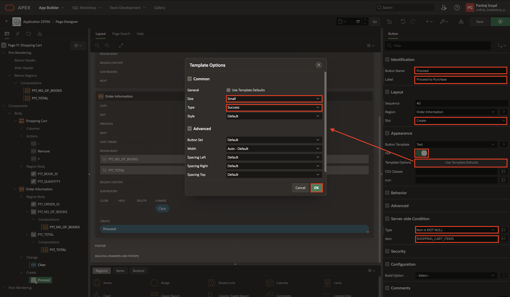

9. Select **Order Information** and in the Property Editor, enter/select the following:

    - Under Server-side Condition:

        - Type: **Item is NOT NULL**

        - Item: **SHOPPING\_CART\_ITEMS**

    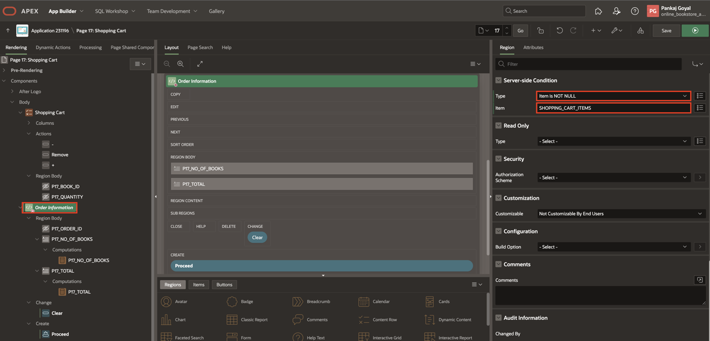

## Task 3: Integrate Backend Processes

In this task, you create page processes to invoke PL/SQL procedures to manage cart actions and handle order creation and use server-side conditions and parameters to ensure smooth and secure cart management.

1. Navigate to **Processing** tab, right-click **Processing** and select **Create Process**.

    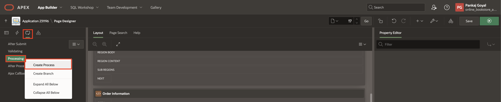

2. In the Property Editor, enter the following:

     - Under Identification: 

         - Name: **Remove from Cart**

         - Type: **Invoke API**  

     - Under Settings: 

         - Package: **OBS\_MANAGE\_ORDERS**

         - Procedure or Function: **REMOVE\_BOOK**

     - Under Server-side Condition:

         - Type: **Request=Value**

         - Value: **REMOVE\_FROM\_CART**

    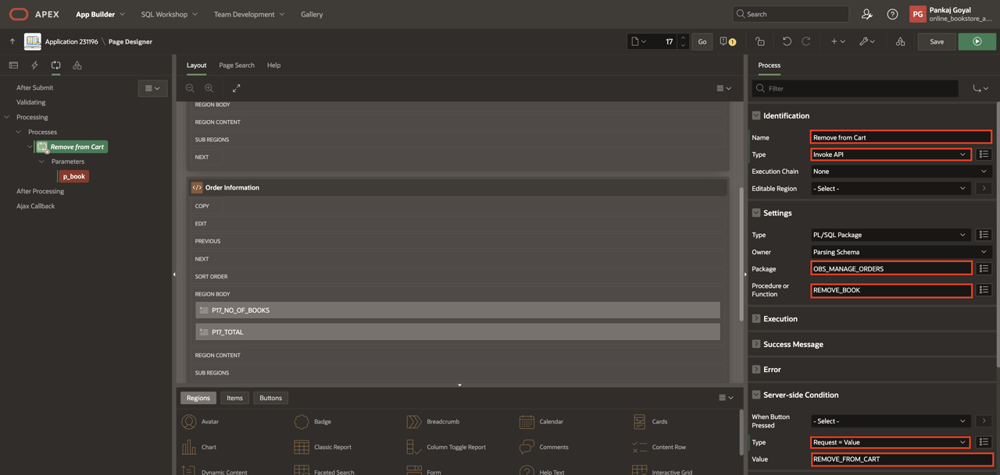

3. Under **Remove from Cart** process, expand **Parameters** and select **p\_book**.

     - p_book > Item: **P17\_BOOK\_ID**

    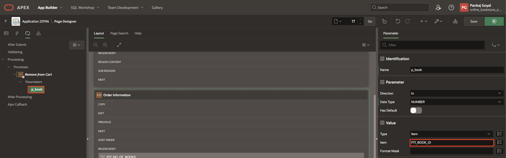

4. Right-click **Processing** and select **Create Process**.

    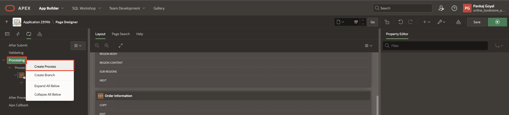

5. In the Property Editor, enter the following:

     - Under Identification:

         - Name: **Increase Cart by 1**

         - Type: **Invoke API**  

     - Under Settings:

         - Package: **OBS\_MANAGE\_ORDERS**

         - Procedure or Function: **INCREASE\_BOOK\_IN\_CART**

     - Under Server-side Condition:

         - Type: **Request=Value**

         - Value: **INCREASE\_CART**

    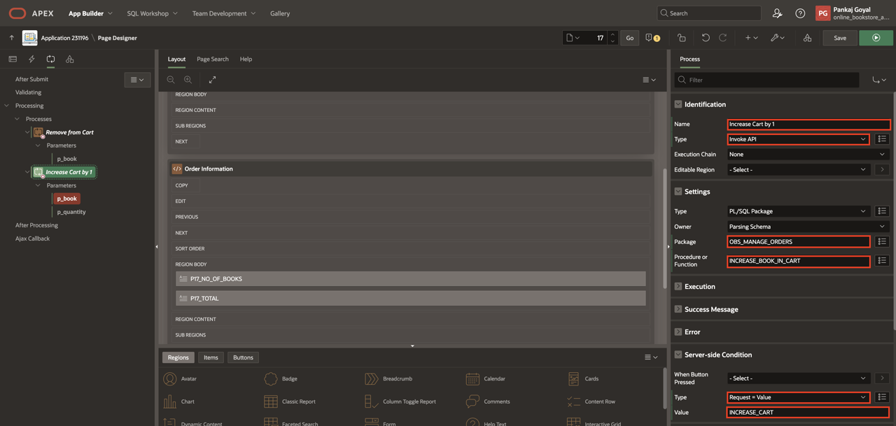

6. Under **Increase Cart by 1** process, expand **Parameters** and enter the following.

     - p\_book > Item: **P17\_BOOK\_ID**

     - p\_quantity > Item: **P17\_QUANTITY**

    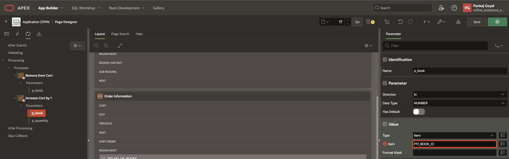
    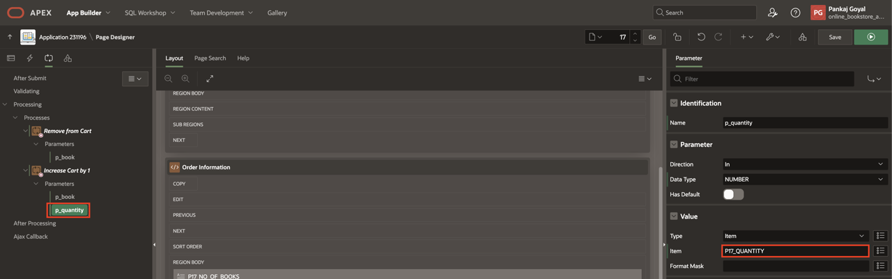

7. Right-click **Processing** and select **Create Process**.

    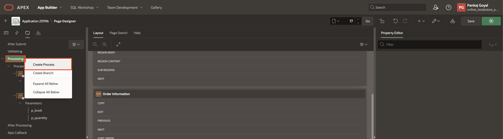

8. In the Property Editor, enter the following:

     - Under Identification:

         - Name: **Decrease Cart by 1**

         - Type: **Invoke API**  

     - Under Settings:

         - Package: **OBS\_MANAGE\_ORDERS**

         - Procedure or Function: **DECREASE\_BOOK\_IN\_CART**

     - Under Server-side Condition:

         - Type: **Request=Value**

         - Value: **DECREASE\_CART**

    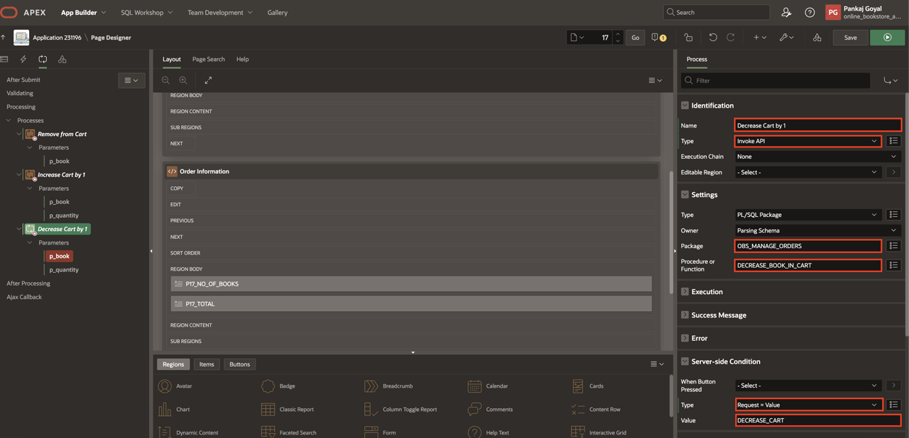

9. Under **Decrease Cart by 1** process, expand **Parameters** and enter the following.

     - p\_book > Item: **P17\_BOOK\_ID**

     - p\_quantity > Item: **P17\_QUANTITY**

    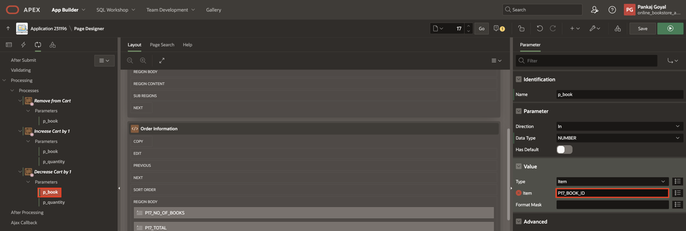
    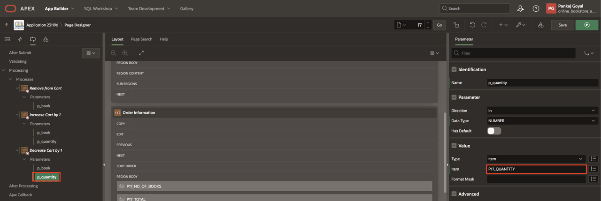

10. Right-click **Processing** and select **Create Process**.

    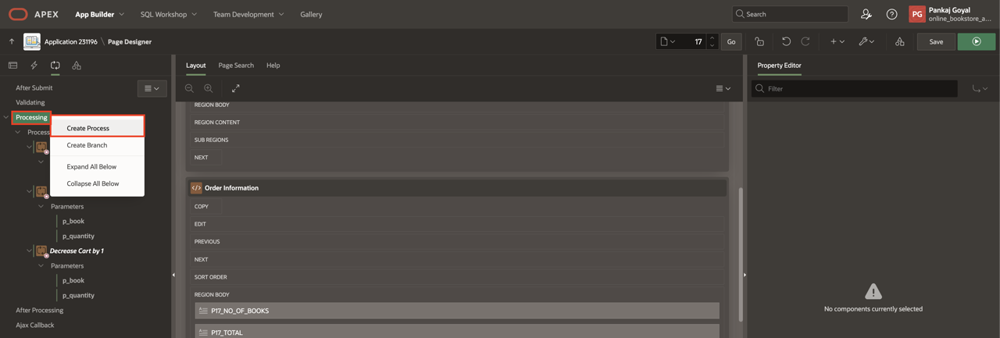

11. In the Property Editor, enter the following:

     - Under Identification:

         - Name: **Checkout**

         - Type: **Invoke API**  

     - Under Settings:

         - Package: **OBS\_MANAGE\_ORDERS**

         - Procedure or Function: **CREATE\_ORDER**

     - Success Message > Success Message: **Order successfully created: &P17\_ORDER\_ID.**

     - Server-side Condition > When Button Pressed: **Proceed**

    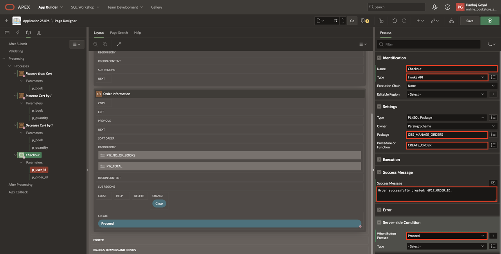

12. Under **Checkout** process, expand **Parameters** and update the following:

      | Parameter       |  Type   | Item |
      | --------------- |  ------ | --------------- |
      | p\_user\_id | Item | USER\_ID |
      | p\_order\_id | Item | P17\_ORDER\_ID |
      {: title="List of Parameters"}

    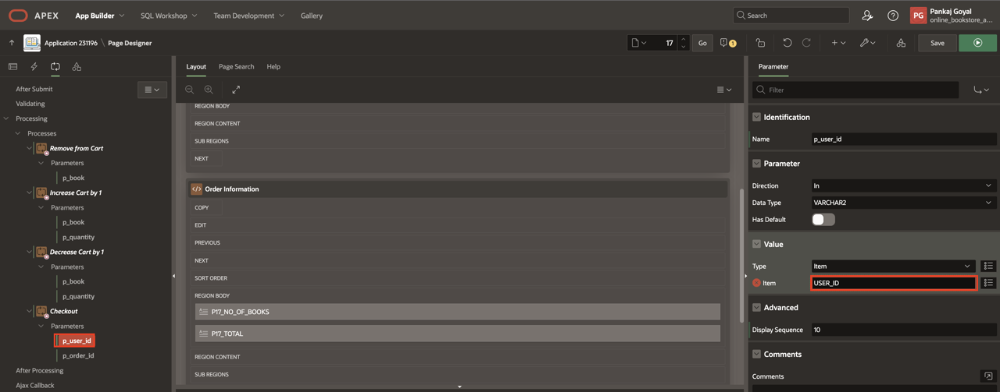
    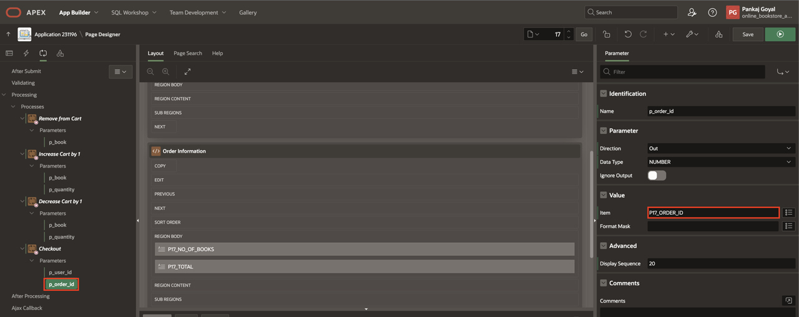

13. Right-click **Processing** and select **Create Process**.

    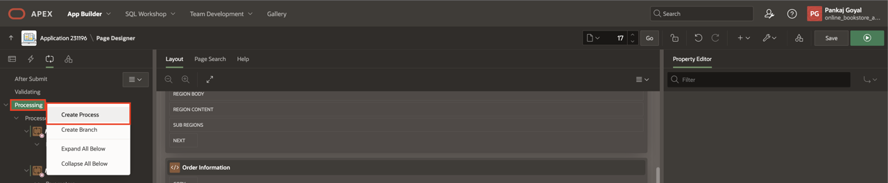

14. In the Property Editor, enter the following:

     - Under Identification:

         - Name: **Clear Shopping Cart**

         - Type: **Invoke API**  

     - Under Settings:

         - Package: **OBS\_MANAGE\_ORDERS**

         - Procedure or Function: **CLEAR\_CART**

     - Server-side Condition > When Button Pressed: **Clear**

    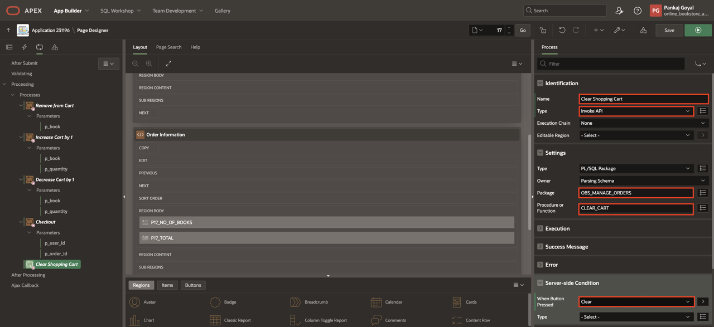

15. Right-click **After Processing** and select **Create Branch**.

    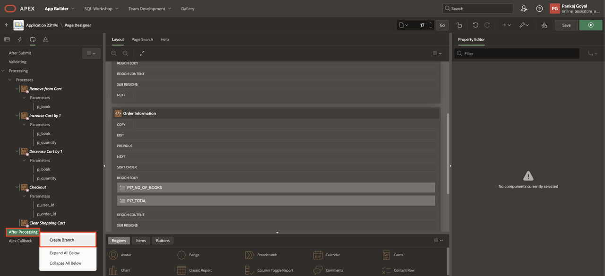

16. In the Property Editor, enter the following:

     - Identification > Name: **Go To Books**

     - Under Behavior > Target: Click **No Link Defined**

          - Page: **10**

          - Clear Cache: **10**

        Click **OK**.

     - Server-side Condition > When Button Pressed: **Clear**

    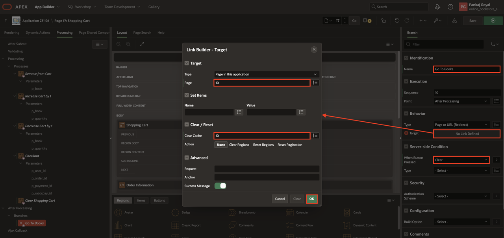

17. Right-click **After Processing** and select **Create Branch**.

    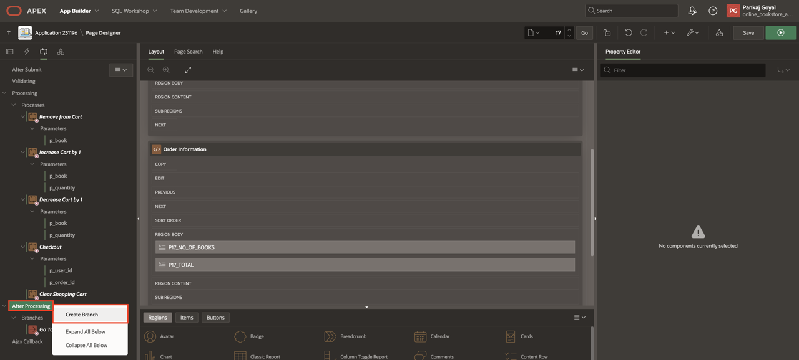

18. In the Property Editor, enter the following:

     - Identification > Name: **Go To Orders**

     - Behavior > Target: Click **No Link Defined**

          - Target > Page: **16**

          - Set Items:

            | Name             | Value        |
            | ---------------- | ------------ |
            | P16\_ORDER\_ID | &P17\_ORDER\_ID. |
            {: title="List of Items"}

          - Clear / Reset > Clear Cache:: **16**

          Click **OK**.

     - Server-side Condition > When Button Pressed: **Proceed**

    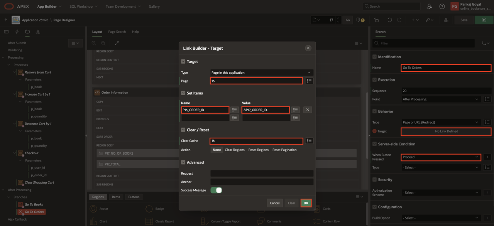

19. Click **Save and Run**.

    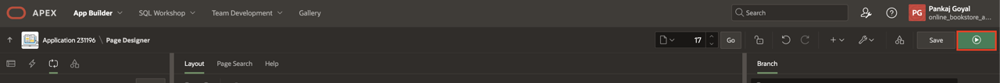

## Task 4: Build Order Information Page

In this task, you'll build an Order Information page to display order details and purchased items. You'll create different sections using regions, reports, and cards to present transaction status, order summary, and item details dynamically.

1. Navigate to Application Home Page by clicking **Application ID**.

    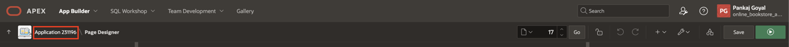

2. Click **Create Page**.

    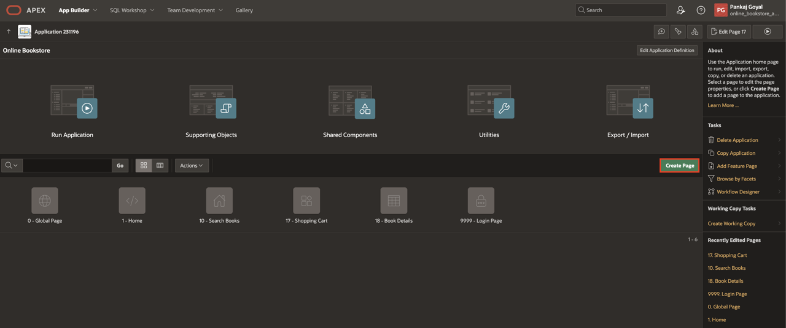

3. Select **Blank Page**.

    

4. In Create Blank Page dialog, enter/select the following:

    - Under Identification:

        - Page Number: **16**

        - Name: **Order Information**

    - Under Navigation:

        - Use Breadcrumb: **Toggle Off**

        - Use Navigation: **Toggle Off**

        Click **Create Page**.

    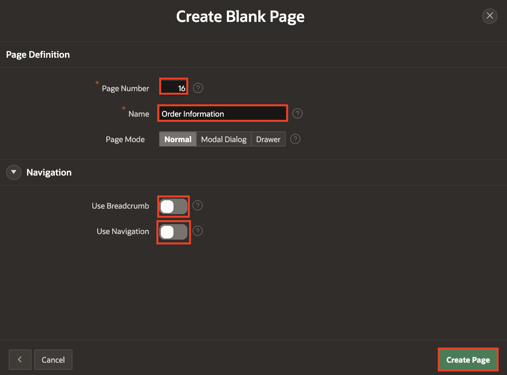

5. In the left pane, right-click **Body** and select **Create Region**.

    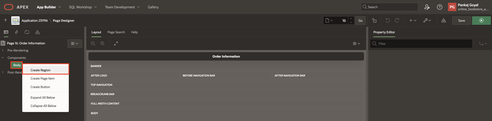

6. In the Property Editor, enter/select the following:

    - Under Identification:

        - Name: **Thank You for purchasing!**

    - Under Appearance:

        - Template: **Content Block**

        - Template Options: Click **Use Template Defaults, Large**

            - Select **Show Region Icon**

        Click **OK**

    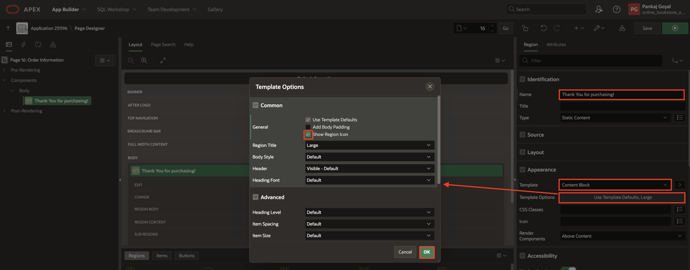

7. In the left pane, right-click **Thank You for purchasing!** and select **Create Page Item**.

    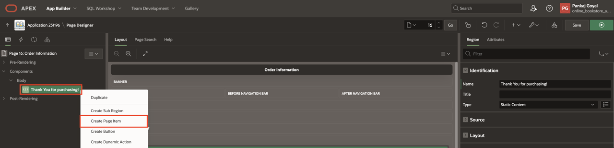

8. In the Property Editor, enter/select the following:

    - Under Identification:

        - Name: **P16\_ORDER\_ID**

        - Type: **Hidden**

     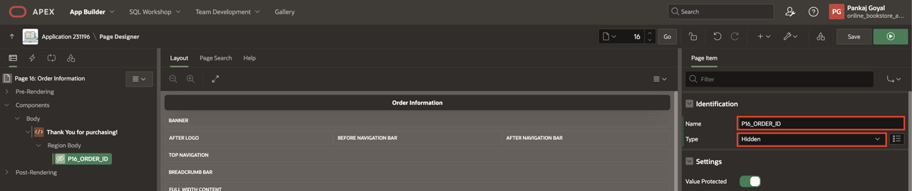

9. In the left pane, right-click **Thank You for purchasing!** and select **Create Sub Region**.

     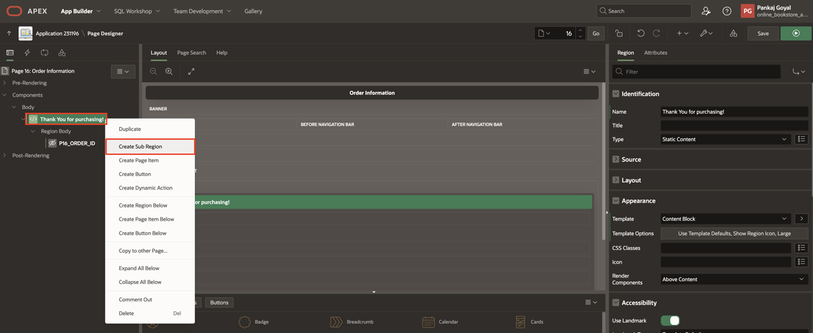

10. In the Property Editor, enter/select the following:

    - Under Identification > Name: **Order Id: &P16\_ORDER\_ID.**

    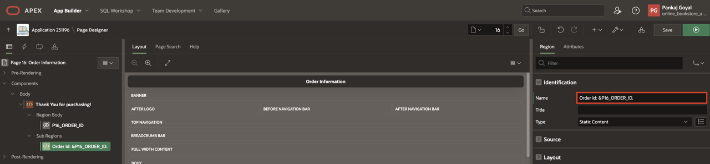

11. In the left pane, right-click **Order Id: &P16\_ORDER\_ID.** and select **Create Sub Region**.

    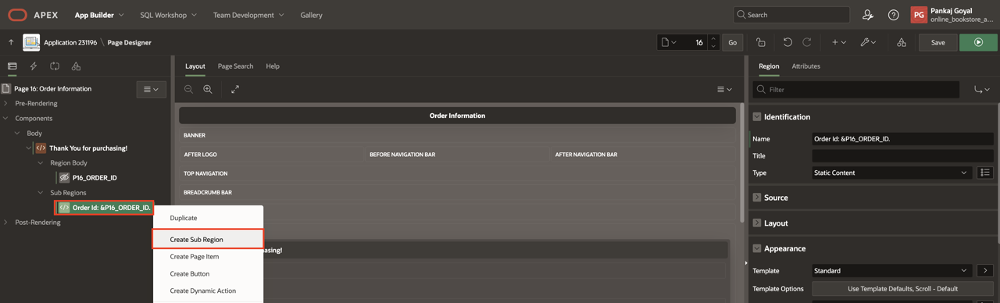

12. In the Property Editor, enter/select the following:

    - Under Identification:

        - Name: **Order Details**

        - Type: **Classic Report**

    - Under Source:

        - Type: **SQL Query**

        - SQL Query: Copy and paste the below query:

            ```
            <copy>
            SELECT 'Transaction Successful' as transaction_status,
                o.order_id,
                o.user_id,
                o.payment_id,
                SUM(i.price* ((100-i.discount)/100) * i.quantity) AS total,
                sum(i.quantity) AS quantity,
                TO_CHAR(i.added_date, 'DD MON YYYY') as added_date,
                TO_CHAR(i.added_time, 'HH12:MI:SS AM') AS added_time

            FROM   obs_orders o
            LEFT JOIN obs_order_items i
            ON o.order_id = i.order_id
            WHERE  o.order_id = :P16_ORDER_ID

            GROUP BY o.order_id, o.user_id,o.payment_id, i.added_date,i.added_time;
            </copy>
            ```

    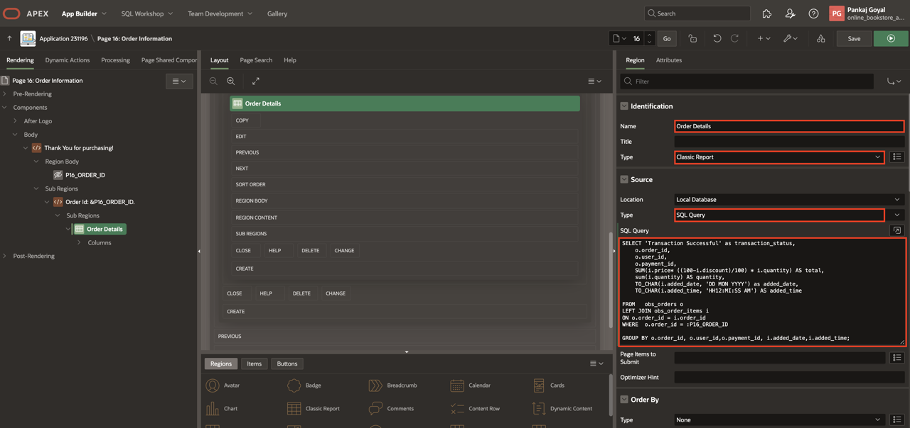

13. Under **Order Details**, expand **Columns**.

    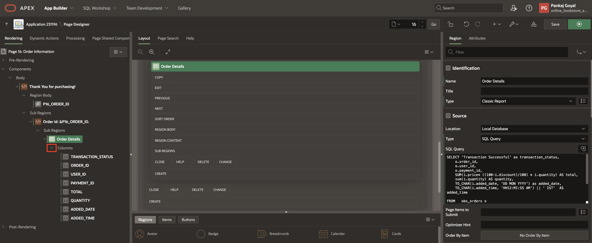

14. Select **ORDER\_ID**, **USER\_ID** and **PAYMENT\_ID**, under Identification > Type: **Hidden**.

    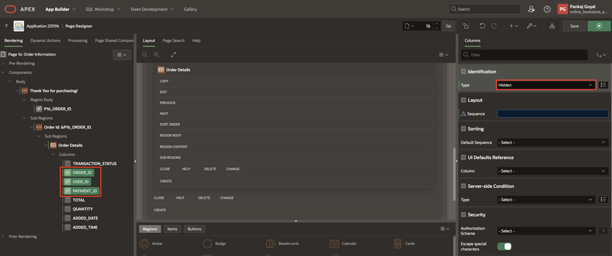

15. Select **TOTAL**, under Heading > Heading: **Total Amount**

    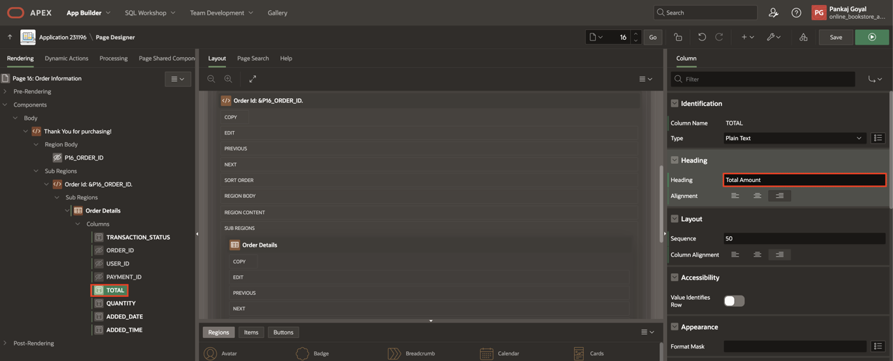

16. Select **ADDED\_DATE**, under Heading > Heading: **Purchased Date**

    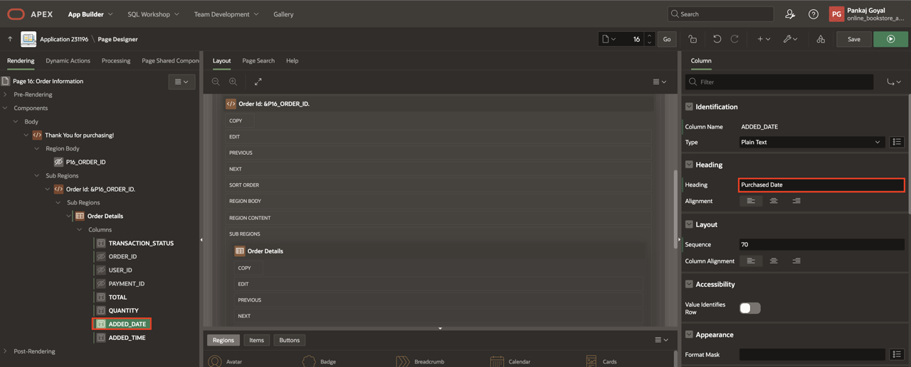

17. Select **ADDED\_TIME**, under Heading > Heading: **Purchased Time**

    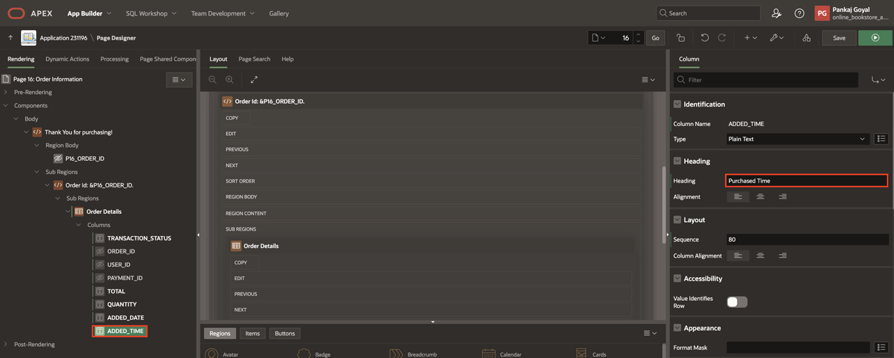

18. Select **Order Details**, navigate to **Attributes**, enter/select the following:

    - Under Appearance > Template: **Value Attribute Pairs - Column**

    - Under Pagination > Type: **No Pagination (Show All Rows)**.

    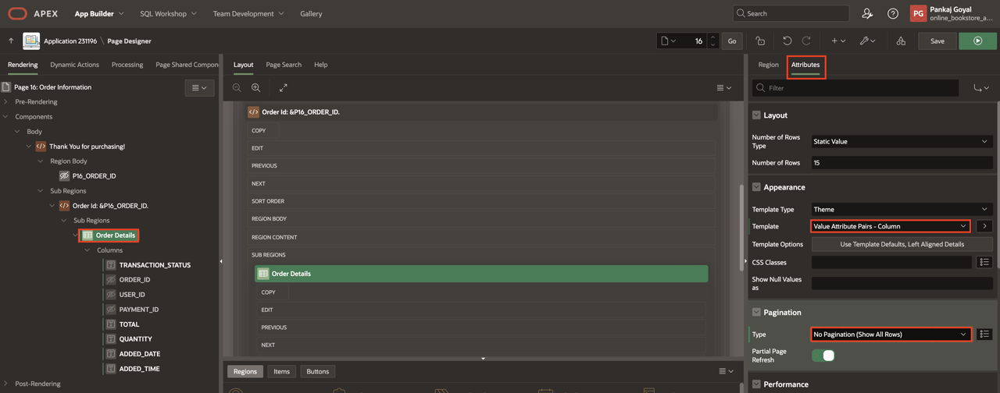

19. In the left pane, right-click **Order Id: &P16\_ORDER\_ID.** and select **Create Sub Region**.

    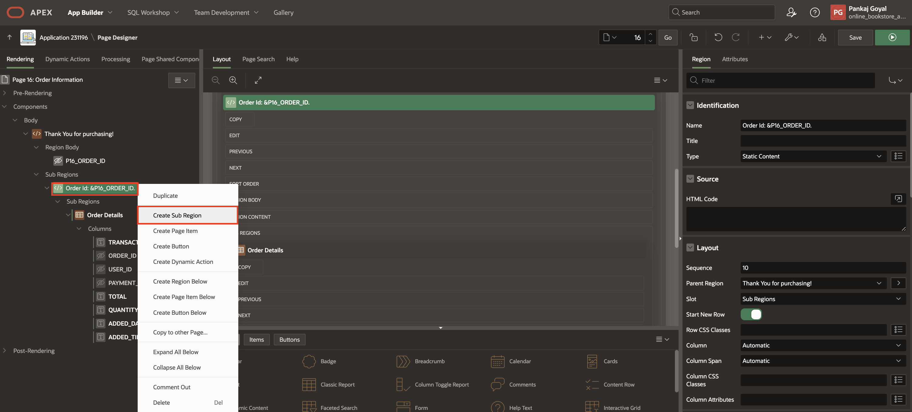

20. In the Property Editor, enter/select the following:

    - Under Identification:

        - Name: **Items**

        - Type: **Cards**

    - Under Source:

        - Type: **SQL Query**

        - SQL Query: Copy and paste the below query:

            ```
            <copy>
            SELECT  b.title,
                    o.book_id,
                    o.price,
                    (o.price) Subtotal,
                    b.book_image,
                    o.quantity,
                    o.price*((100-b.discount)/100) *o.quantity as total_price
            FROM   obs_order_items o,
                obs_books b
            WHERE  b.book_id = o.book_id
            AND    o.order_id = :P16_ORDER_ID
            </copy>
            ```

    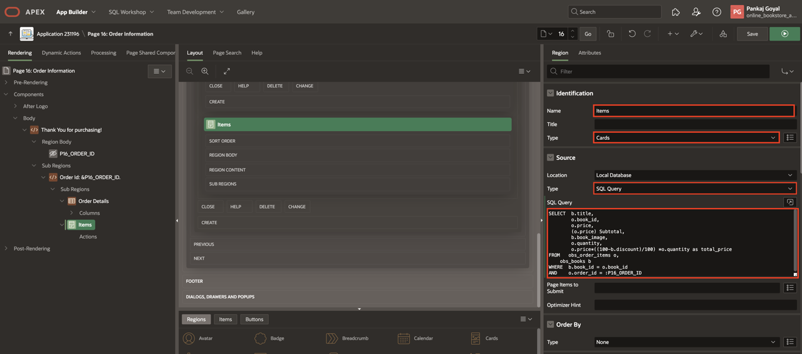

21. Navigate to **Attributes**, enter/select the following:

    - Appearance > Layout: **Float**

    - Card > Primary key column 1: **BOOK_ID**

    - Title > Column: **TITLE**

    - Under Secondary Body:

        - Advanced Formatting: **Toggle On**

        - HTML Expression: Copy and paste the below HTML Code:

            ```
            <copy>
            <b>Purchased Price: </b>&TOTAL_PRICE. Rs <br>
            <b>Quantity : </b> &QUANTITY.
            </copy>
            ```

    - Under Media:

        - Advanced Formatting: **Toggle On**

        - HTML Expression: Copy and paste the below HTML Code:

            ```
            <copy>
            
            </copy>
            ```

        - Position: **First**

    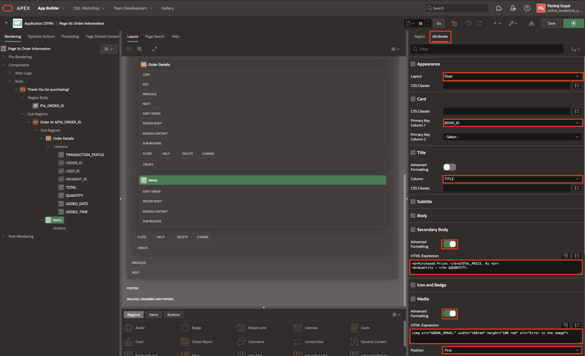

22. Click **Save**.

## Task 5: Add My Books to Navigation Bar List

In this task, you will add a navigation bar entry that links to the My Books page.

1. Navigate to **Shared Components**.

    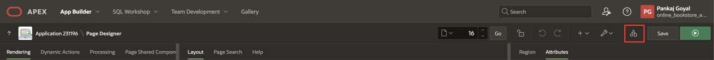

2. Under **Navigation and Search**, select **Navigation Bar List**.

   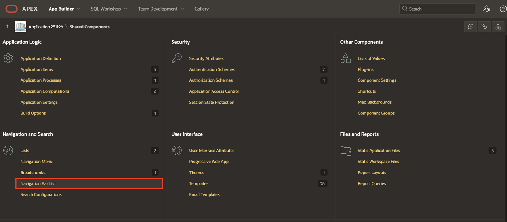

3. Click **Navigation Bar**.

   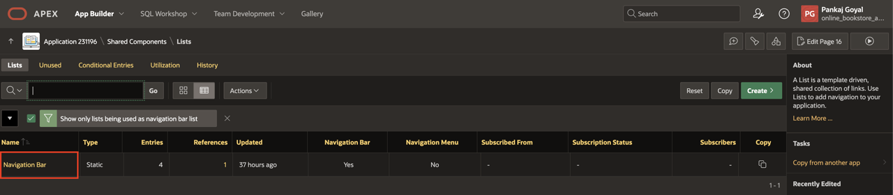

4. Click **Create List Entry**.

   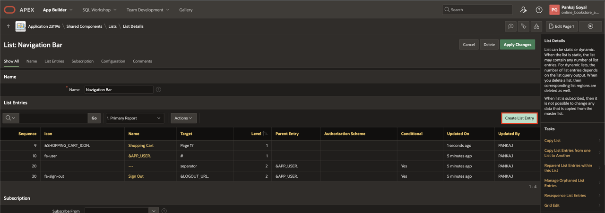

5. Enter the following:

    - Under Entry:

        - Sequence: **8**

        - Image/Class: **fa-book**

        - List Entry Label: **My Books**

    - Target > Page: **20**

    Click **Create List Entry**.

    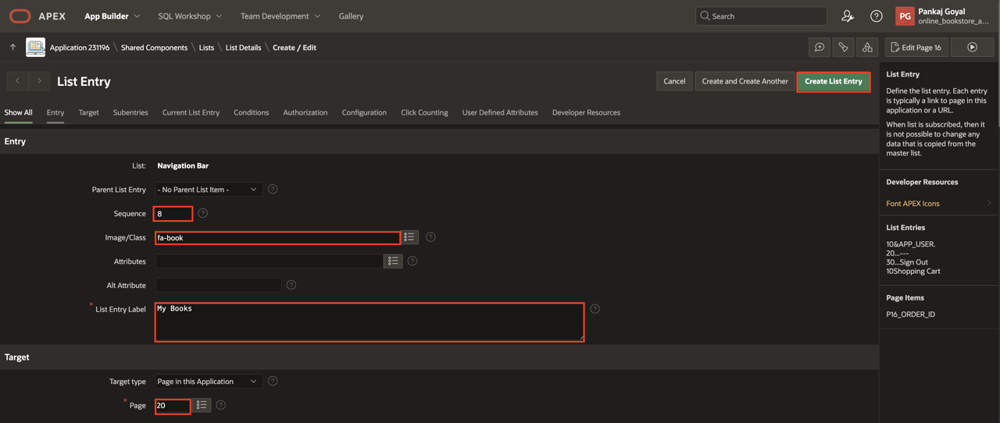

## Task 6: Build My Books Page

In this task, you'll create a My Books page to display books purchased by the user. The page will use a Cards region to showcase book details, including title, price, quantity, and discount.

1. Click **Application ID**.

    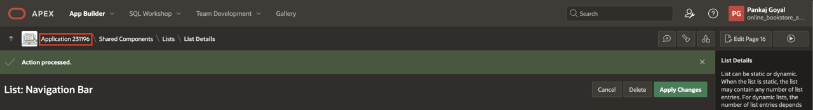

2. Click **Create Page**.

     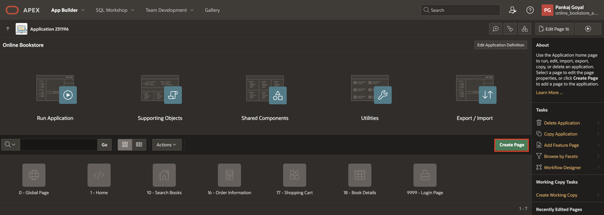

3. Select **Blank Page**.

     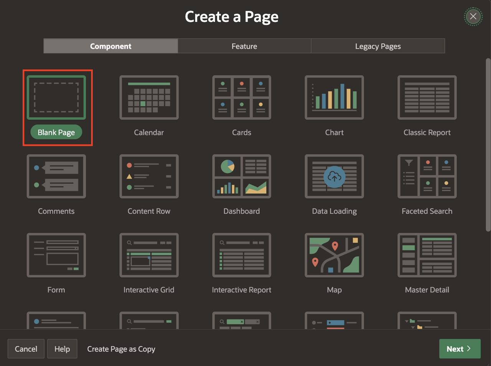

4. In Create Blank Page dialog, enter/select the following:

    - Under Identification:

        - Page Number: **20**

        - Name: **My Books**

    - Under Navigation:

        - Use Breadcrumb: **Toggle Off**

        - Use Navigation: **Toggle Off**

        Click **Create Page**.

     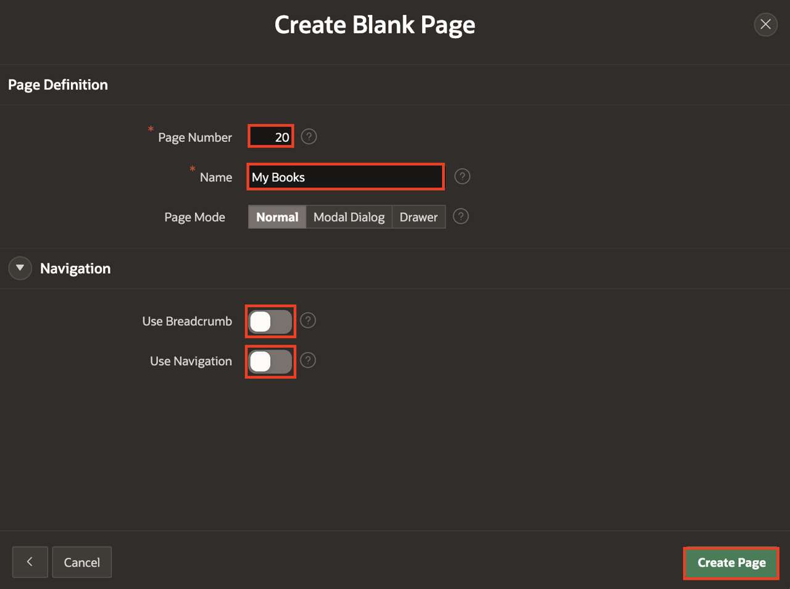

5. In the left pane, right-click **Body** and select **Create Region**.

    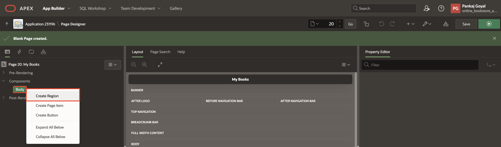

6. In the Property Editor, enter/select the following:

    - Under Identification:

        - Name: **My Books**

        - Type: **Cards**

    - Under Source:

        - Type: **SQL Query**

        - SQL Query: Copy and paste the below query:

            ```
            <copy>
                select  distinct
                    oi.book_id as book_id,
                    bi.book_image as book_image,
                    bi.title as title,
                    Round(oi.price,2) as price,
                    bi.description as description,
                    bi.discount,
                    sum(oi.quantity) OVER (PARTITION BY oi.book_id) AS quantity,
                    Round((oi.price * SUM(oi.quantity) OVER (PARTITION BY oi.book_id)),2) AS total_price,
                    Round((oi.price *((100- oi.discount)/100) * SUM(oi.quantity) OVER (PARTITION BY oi.book_id)),2) AS new_total_price
                from obs_order_items oi, obs_books bi, obs_orders o
                where o.order_id = oi.order_id and o.user_id = :USER_ID
                    and oi.book_id(+) = bi.book_id;
            </copy>
            ```

    - Order By:

        - Type: Item

        - Item: Click **No Order By Item** and enter the following and click **OK**:

            | Clause |  Key | Display |
            | --- |  --- | --- |
            | "TITLE"asc  | TITLE| Title |
            | "TOTAL_PRICE"asc | TOTAL\_PRICE | Price|
            | "QUANTITY"asc| QUANTITY | Quantity |
            {: title="List of Items"}

    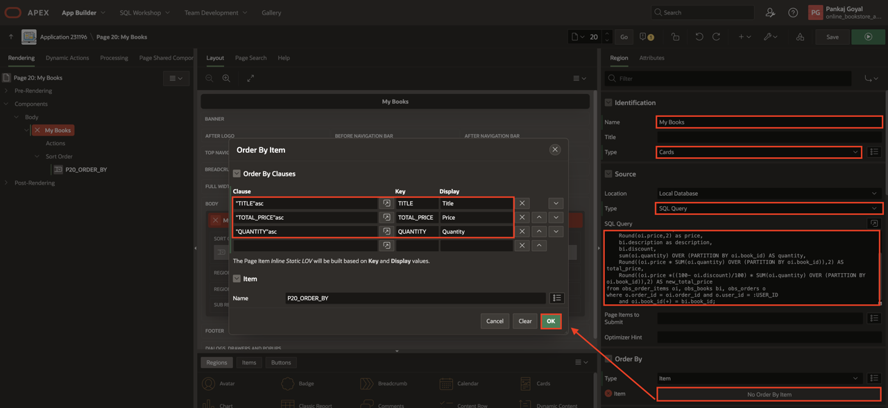

7. Navigate to **Attributes**, enter/select the following:

    - Appearance > Layout: **Float**

    - Card > Primary key column 1: **BOOK\_ID**.

    - Title > Column: **TITLE**

    - Under Secondary Body:

        - Advanced Formatting: **Toggle On**

        - HTML Expression: Copy and paste the below HTML Code:

            ```
            <copy>
            <b>Quantity: </b>&QUANTITY.
            <br>
            <b>Purchased Total: </b> <strike>&#8377;&TOTAL_PRICE.</strike> &#8377;&NEW_TOTAL_PRICE.
            <br>
            <b>Discount: </b><span style="color: green;">&DISCOUNT.% Off</span>
            </copy>
            ```

    - Under Media:

        - Source: **Image URL**

        - URL: **&BOOK_IMAGE.**

    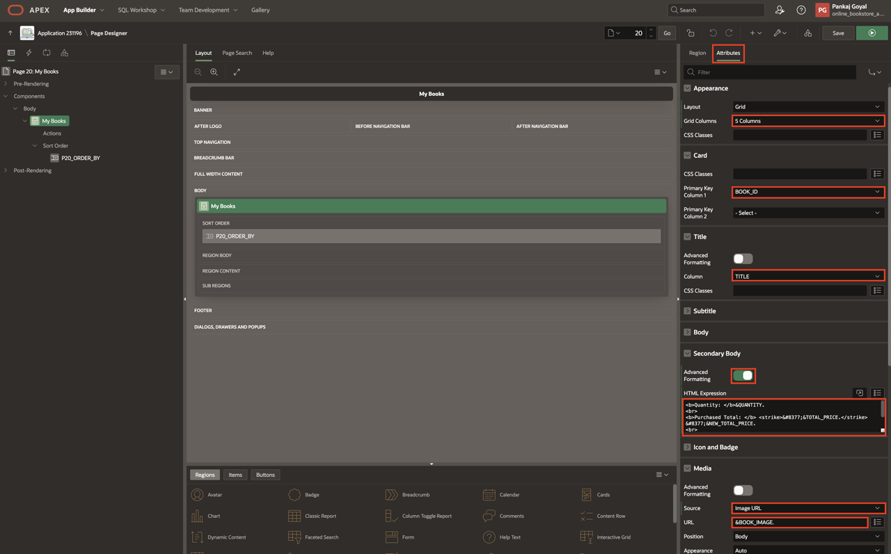

8. Click **Save and Run**.

## Task 7: Run the Application

In this task, you will navigate to the Search Books page, select a book to purchase, add it to your cart, and complete the checkout process. Finally, you will verify your purchased books in My Books.

1. Run the application and enter the credentials below:

      - Username: **user01**

      - Password: **secretPassword**

    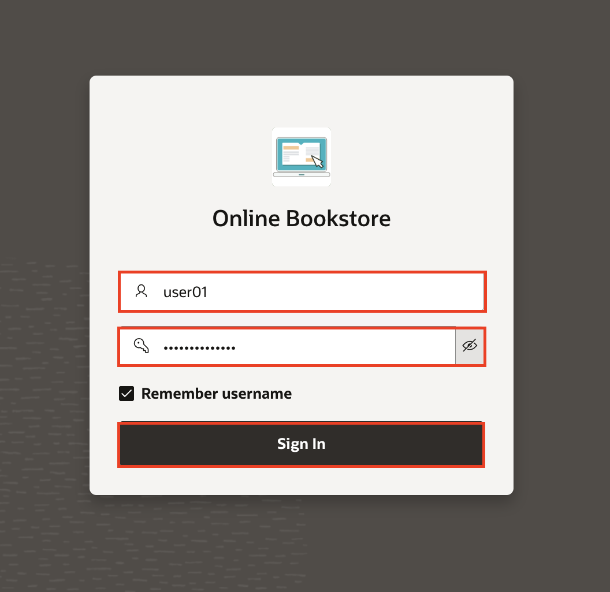

2. Select any book of your choice to buy.

    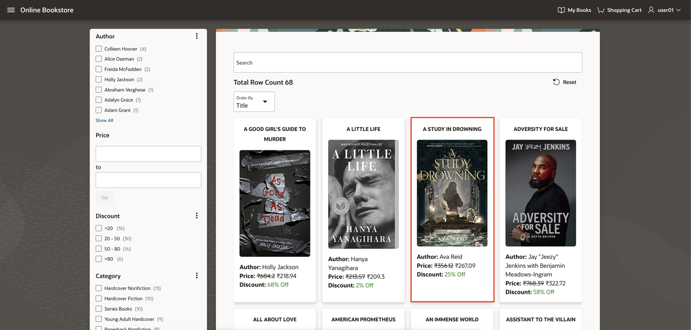

3. Select **Quantity** and click **Add to Cart**.

    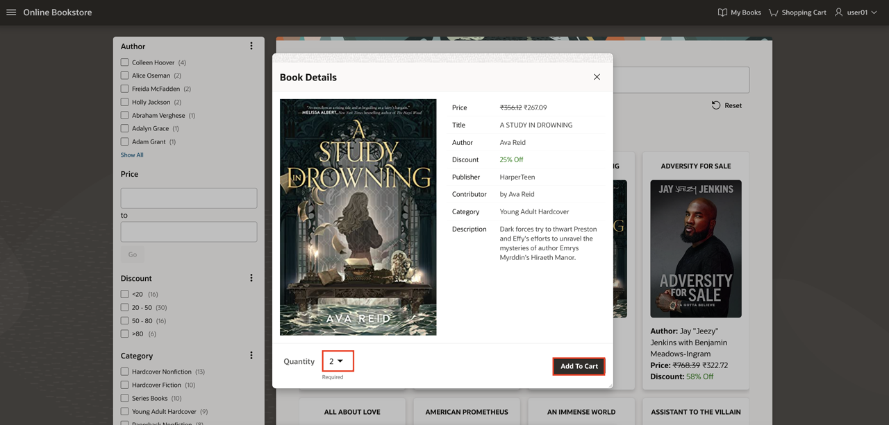

4. On the Navigation Bar, select **Shopping Cart**.

    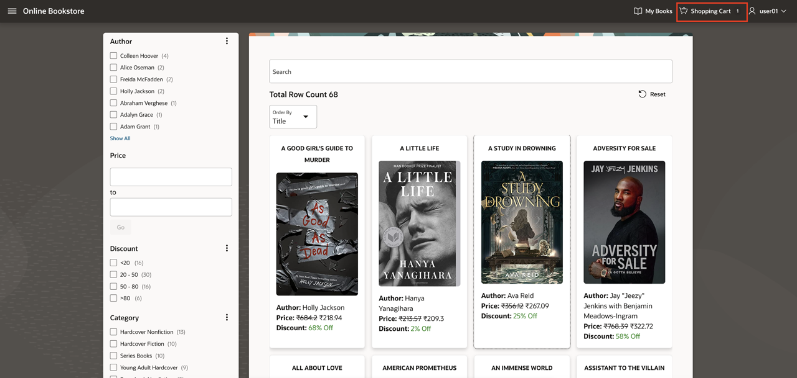

5. Now, you see the shopping cart page, click **Proceed to Purchase** button.

    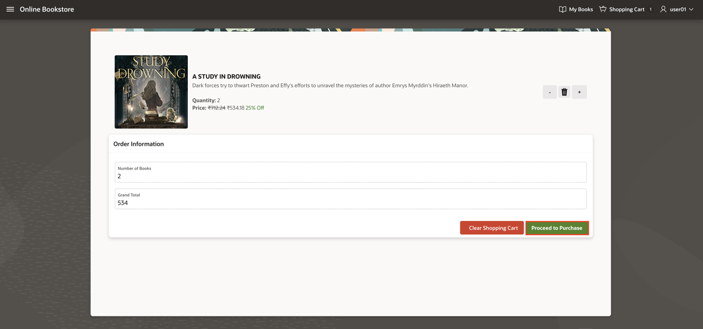

6. Now, you see the order details page, On the Navigation Bar, select **My Books** to check all the purchased books.

    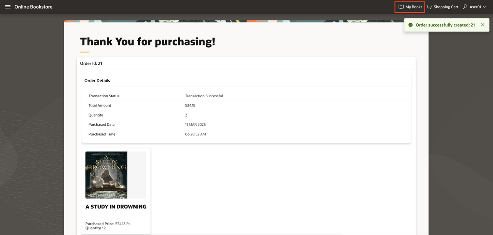

    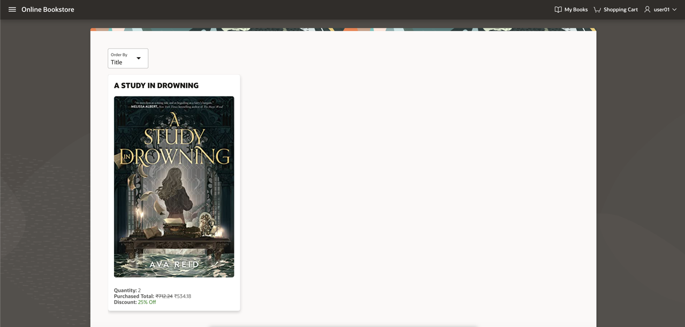

## Summary

In this lab, you successfully integrated a shopping cart feature into an Oracle APEX application. You created a navigation bar entry for the shopping cart, developed a detailed shopping cart page, and implemented interactive elements for managing cart items. Additionally, you set up backend processes to handle cart operations and order creation, demonstrating how to leverage APEX's capabilities for building dynamic, database-driven web applications. This hands-on experience enhanced your skills in PL/SQL, SQL queries, and APEX page design and process integration.

You are now ready to move on to the next lab!

## Acknowledgements

- **Author**: Pankaj Goyal, Member Technical Staff; Ankita Beri, Product Manager
- **Last Updated By/Date**: Pankaj Goyal, Member Technical Staff, March 2025