# Create and Manage Wishlist Functionality

## Introduction

This lab provides step-by-step instructions on how to create and manage a wishlist feature in Oracle APEX. You will learn to create a new page for the wishlist, add interactive components, and integrate navigation elements. The process includes creating dynamic regions, defining actions, and setting up processes for adding and removing items from the wishlist. Additionally, you will enhance the navigation bar to include a wishlist link for easy access.

Estimated Time: 15 minutes

### Objectives

In this lab, you will:

- Create a Wishlist Page.
- Add Dynamic Actions to refresh the wishlist content and handle interactions such as adding and removing items.
- Create Buttons to add and remove books from the wishlist, including the necessary backend processes.
- Update Navigation Bar to include a link to the wishlist page.

### Downloads: Missed Previous Labs? Download and Install the Application

If you're stuck or missed out on completing the previous labs, don't worry! Click [here](https://c4u04.objectstorage.us-ashburn-1.oci.customer-oci.com/p/EcTjWk2IuZPZeNnD_fYMcgUhdNDIDA6rt9gaFj_WZMiL7VvxPBNMY60837hu5hga/n/c4u04/b/livelabsfiles/o/obs-lab8.zip) to download the export file, which contains everything completed in the previous labs. To run the app, follow the steps described in the [Lab Appendix: Download Instructions](?lab=download-instructions) from Task 2 to Task 4.

## Task 1: Create My Wishlist page

In this task, you'll create a My Wishlist page that displays a list of books saved by the user. You'll use AI Assistant to generate an SQL query and configure the layout.

1. Navigate to your application homepage by clicking **Application ID**.

    

2. Click **Create Page** and select **Blank Page**.

    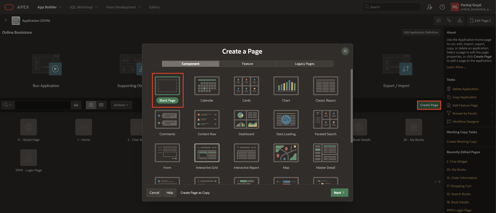

3. In Create Blank Page dialog, enter/select the following:

    - Under Identification:

        - Page Number: **14**

        - Name: **My Wishlist**

    - Under Navigation:

        - Use Breadcrumb: **Toggle Off**

        - Use Navigation: **Toggle Off**

    Click **Create Page**.

   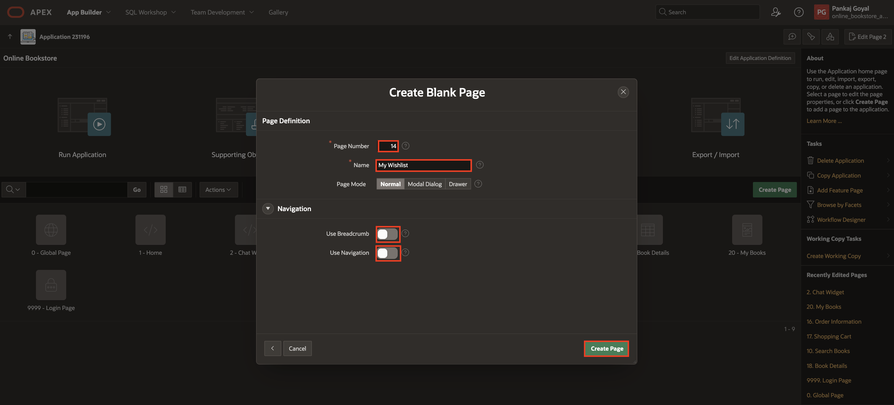

4. In the left pane, right-click **Body** and select **Create Region**.

    

5. In the Property Editor, enter/select the following:

    - Under Identification:

        - Title: **My books**

        - Type: **Cards**

    - Under Source:

        - Type: **SQL Query**

        - SQL Query: For the SQL Query, we will make use of the APEX Assistant to generate the query. Follow the next steps to generate the SQL query. Click the **Code Editor** icon.

    

6. In the Code Editor, click **APEX Assistant** to open a drawer where you can chat with the AI Assistant. If a dialog box appears to accept the Terms and Conditions, click **Accept**.

    

    Enter the following prompt in the chat box and click **Send**:

    ```
    <copy>
    Help me write a query that returns the below mentioned columns from obs_wishlist and obs_books tables.

    book_id,
    author,
    book_image.
    title ,
    description,
    discount,
    price

    Additionally, compute the new_price after applying the discount, ensuring that both price and new_price are rounded to two decimal places while filtering the user's ID.
    </copy>
    ```

    

7. The AI Assistant suggests a SQL Query. You can provide further prompts to refine the query. Once you are happy with the query, click **Insert**.

    

8. The SQL query is inserted into the Code Editor. Make sure *your user\_id* is **:USER\_ID**. Click **Validate**. The SQL query should look like the following:

    ```
    <copy>
    select
        wl.book_id,
        b.author,
        b.book_image,
        b.title,
        b.description,
        b.discount,
        round(b.price, 2)       as price,
        round(b.price * (1 - b.discount / 100), 2) as new_price
    from obs_wishlist wl
    join obs_books    b
        on wl.book_id = b.book_id
    where wl.user_id = :USER_ID;
    </copy>
    ```

    

9. If the validation is successful, click **OK**.

    

10. Under **Order By**, enter/select the following:

    - Type: **Item**
    - Item: Click **No Order By Item** and enter the following:

        | Clause     |  Key   | Display |
        | ---------- |  ------ | ------ |
        | "TITLE"asc | TITLE |  Title |
        | "NEW_PRICE"asc | NEW_PRICE | Price |
        {: title="List of Items"}

        Click **OK**.

    

11. In the Property Editor, navigate to **Attributes** and enter/ select the following:

    - Appearance > Grid Columns: **5 Columns**

    - Card > Primary Key Column 1: **BOOK_ID**

    - Title > Column: **TITLE**

    

    - Under Body:

        - Advanced Formatting: **Toggle On**

        - HTML Expression: Copy and paste the below HTML code:
        ```
       <copy>
       <div>
        <b>Author:</b> &AUTHOR.
       </div>

       <div>
        <b>Price:</b> <strike>₹&PRICE.</strike> ₹&NEW_PRICE.
       </div>

       <div >
        <b>Discount:</b> <span style="color: green;">&DISCOUNT.% Off</span>
       </div>
       </copy>
       ```
    - Under Media:

        - Source: **Image URL**

        - URL: **&BOOK_IMAGE.**

        - Image Description: **&DESCRIPTION.**

    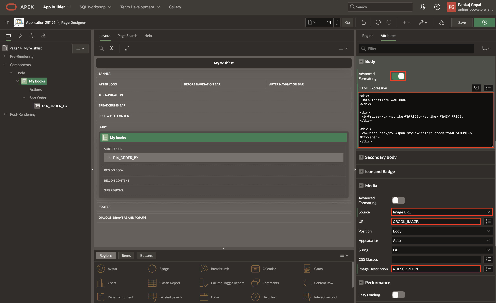

12. Under **My Books** region, right-click **Actions** and select **Create Action**.

    

13. In the Property Editor, enter/select the following:

    - Identification > Type: **Full Card**

    - Link > Target: Click **No Link Defined**

        - Target > Page: **18**

        - Set Items:

            | Name             | Value        |
            | ---------------- | ------------ |
            | P18\_BOOK\_ID | &BOOK\_ID. |
            {: title="List of Items"}

        -  Clear/Reset > Clear Cache: **18**

        Click **OK**.

    

14. Right-click **My Books** region and select **Create Page Item**.

    

15. In the Property editor, enter/select the following:

    - Under Identification

        - Name: **P14\_BOOK\_ID**

        - Type: **Hidden**

    - Settings > Value protected: **Toggle Off**

    

16. Right-click **My Books** region and select **Create Dynamic Action**.

    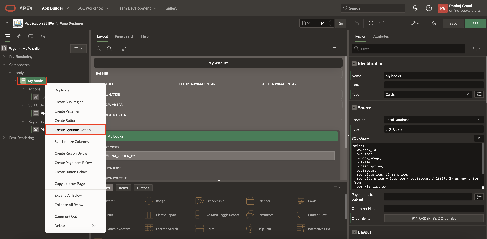

17. In the Property editor, enter/select the following:

    - Identification > Name: **Refresh**

    - When > Event: **Dialog Closed**

    

18. Select **TRUE** action and enter/select the following:

    - Identification > Action: **Refresh**

    - Under Affected Elements:

        - Selection Type: **Region**

        - Region: **My books**

    

19. Click **Save**.

<!-- 19. Navigate to **Processing** tab, right-click **Processing** and select **Create Process**.

    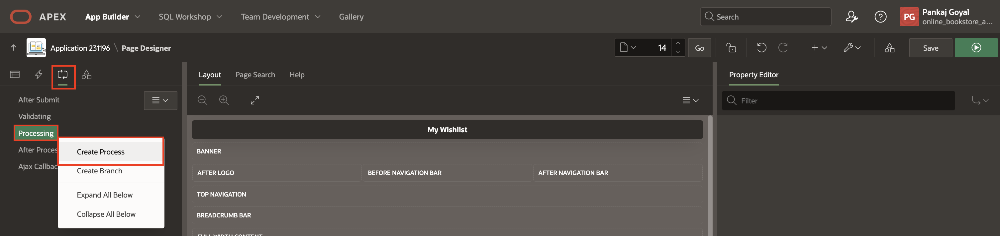

20. In the Property editor, enter/select the following:

     - Under Identification:

        - Name: **Remove from Wishlist**

        - Type: **Invoke API**
          
     - Under Settings: 

        - Package Name: **OBS\_MANAGE\_ORDERS**

        - Procedure/Function Name: **REMOVE\_FROM\_WISHLIST**

     - Under Server-side condition:

        - Type: **Request=Value**

        - Value: **REMOVE\_FROM\_WISHLIST**

      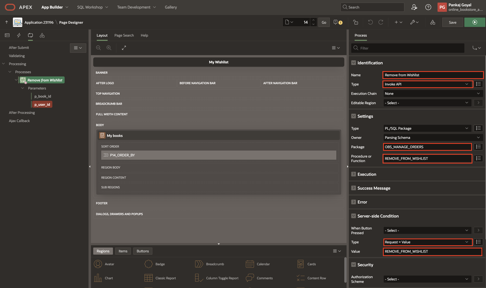

21. Under **Remove from Wishlist** process, expand parameters and enter/select the following:

     | Parameter     |  Type   | Item |
     | ---------- |  ------ | ------ |
     | p\_book\_id | Item |  P14\_BOOK\_ID |
     | p\_user\_id| Item | USER\_ID |

    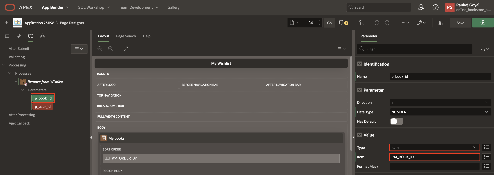
     -->

## Task 2: Add Wishlist Management Buttons on Book Details Page

In this task, you'll add Add to Wishlist and Remove from Wishlist buttons on the book details page. These buttons will allow users to manage their wishlist by invoking database actions based on their selection.

1. Navigate to Page **18**.

    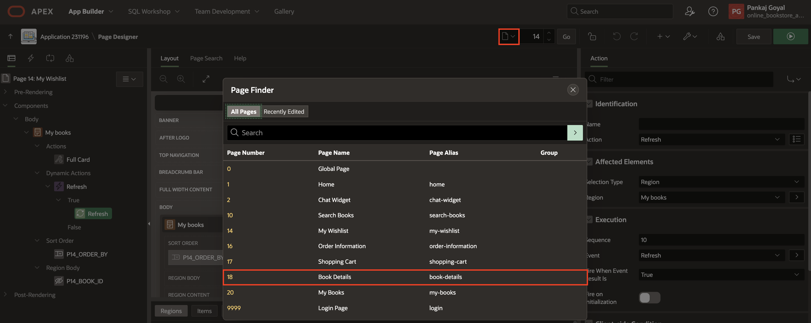

2. In the left pane, right-click **Buttons Bar** and select **Create Button**.

    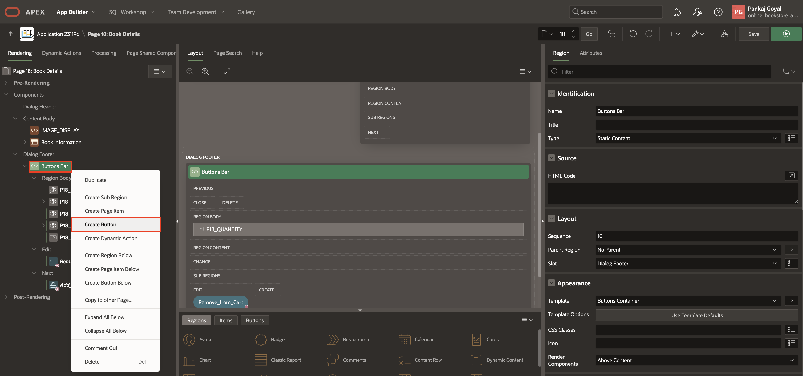

3. In the Property Editor, enter/select the following:

    - Under Identification:

        - Button Name: **Add\_to\_Wishlist**

        - Label: **Add To Wishlist**

    - Layout > Slot: **Next**

    - Under Appearance:

        - Button Template: **Text with Icon**

        - Hot: **Toggle On**

        - Template Options: Click **Use Template Defaults**

            - Type: **Primary**

            - Style: **Simple**

            Click **Ok**

        - Icon: **fa-heart-o**

    - Under Server-side Condition:

        - Type: **No rows returned**

        - SQL Query: Copy and paste the below code into the code editor:
    ```
    <copy>
    select * from obs_wishlist where user_id = :user_id AND
    book_id = :P18_BOOK_ID
    </copy>
    ```

    - Under Security > Authorization Scheme: **Must Not Be Public User**

    

4. Right-click **Buttons Bar** and select **Create Button**.

    

5. In the Property Editor, enter/select the following:

    - Under Identification:

        - Button Name: **Remove\_from\_Wishlist**

        - Label: **Remove From Wishlist**

    - Layout > Slot: **Next**

    - Under Appearance:

        - Button Template: **Text with Icon**

        - Icon: **fa-heart**

    - Behavior > Database Action: **SQL DELETE Action**

    

    - Under Server-side Condition:

        - Type: **Rows returned**

        - SQL Query: Copy and paste the below code:
    ```
    <copy>
    select * from obs_wishlist where user_id = :user_id
    AND book_id = :P18_BOOK_ID
    </copy>
    ```

    - Under Security > Authorization Scheme: **Must Not Be Public User**

    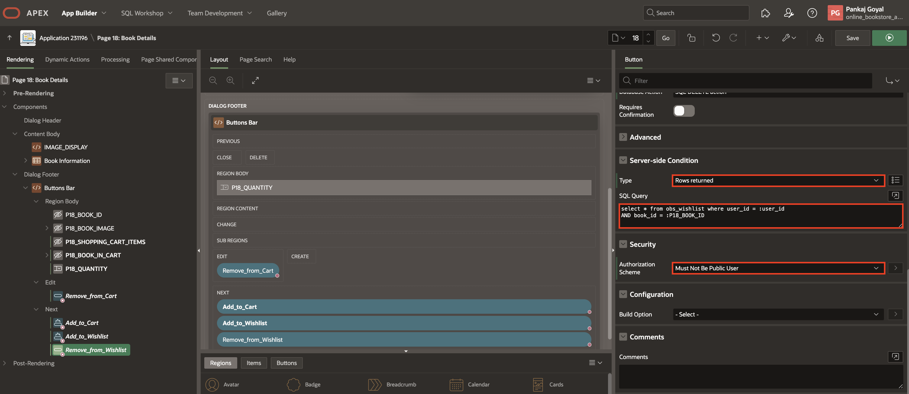

6. Navigate to **Processing** tab, right-click **Processes** and select **Create Process**.

    

7. In the Property Editor, enter/select the following:

    - Under Identification:

        - Name: **Add to Wishlist**

        - Type: **Invoke API**

    - Under Settings:

        - Package: **OBS\_MANAGE\_ORDERS**

        - Procedure or Function: **ADD\_TO\_WISHLIST**

    - Success Message > Success Message: **Successfully added to Wishlist!**

    - Error Message > Error Message: **Error adding to Wishlist!**

    - Server-side Condition > When button pressed: **Add\_to\_Wishlist**

    

8. Under **Add to Wishlist**, expand parameters and enter/select the following:

    - p\_book\_id > Value > Type: **Item**,  Item: **P18\_BOOK\_ID**

    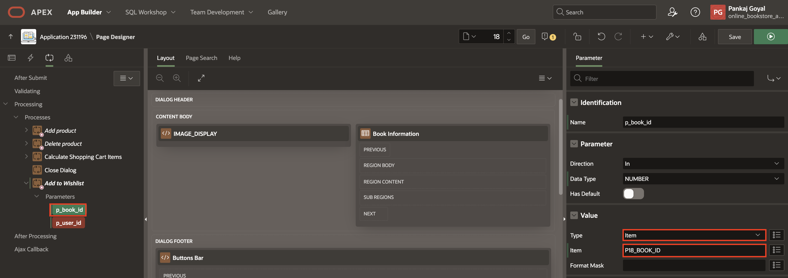

    - p\_user\_id > Value > Type: **Item**,  Item > Application: **USER\_ID**

    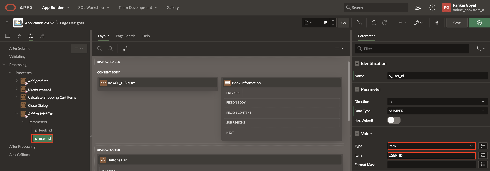

9. Right-click **Processes** and select **Create Process**.

    

10. In the Property Editor, enter/select the following:

    - Under Identification:

        - Name: **Remove from Wishlist**

        - Type: **Invoke API**

    - Under Settings:

        - Package: **OBS\_MANAGE\_ORDERS**

        - Procedure or Function: **REMOVE\_FROM\_WISHLIST**

    - Server-side condition > When button pressed: **Remove\_from\_Wishlist**

    

11. Under **Remove from Wishlist**, expand parameters and enter/select the following:

    - p\_book\_id > Value > Type: **Item**,  Item: **P18\_BOOK\_ID**

    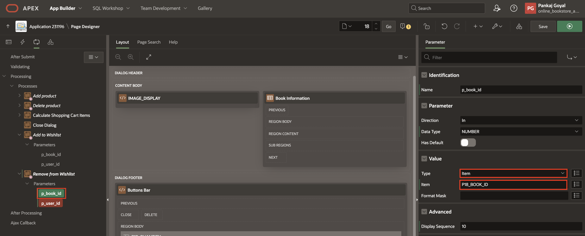

    - p\_user\_id > Value > Type: **Item**,  Item > Application: **USER\_ID**

    

12. Select **Close Dialog** process and update **Sequence**: **100** under **Execution**.

    

13. Click **Save**.

## Task 3: Create an entry in Navigation Bar List

In this task, you'll add a My Wishlist entry to the navigation bar, allowing users to quickly access their saved books. This ensures easy navigation and enhances the user experience.

1. Navigate to **Shared Component**.

    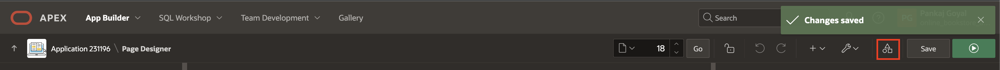

2. Under Navigation and Search, click **Navigation Bar List**.

    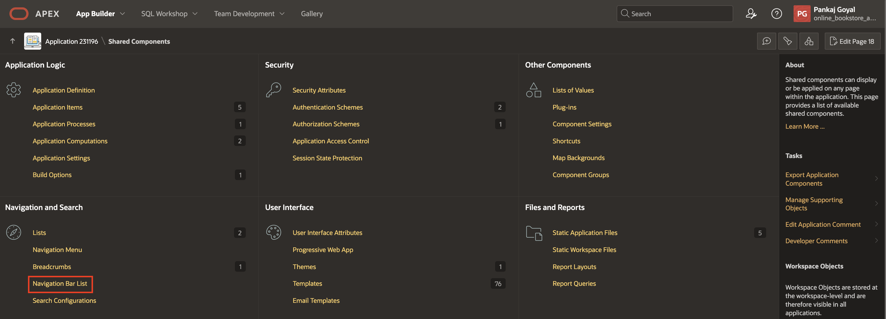

3. Click **Navigation Bar**.

    

4. Click **Create List Entry**.

    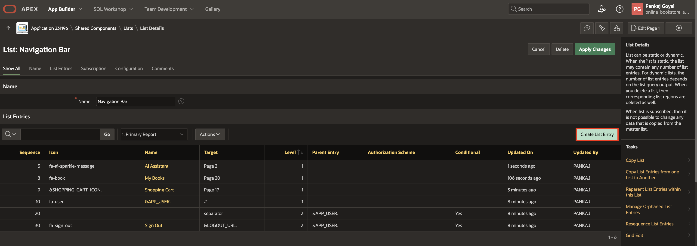

5. Enter/select the following:

    - Under Entry:

        - Sequence: **6**

        - Image/Class: **fa-heart**

        - List Entry Label: **My Wishlist**

    - Target > Page: **14**

      Click **Create List Entry**.

    

## Task 4: Run the Application

In this task, you will add books to your wishlist, view them under My Wishlist, and remove books when needed.

1. Run the application and enter the credentials below:

      - Username: **user01**

      - Password: **secretPassword**

    

2. Click on any book and click **Add To Wishlist**.

    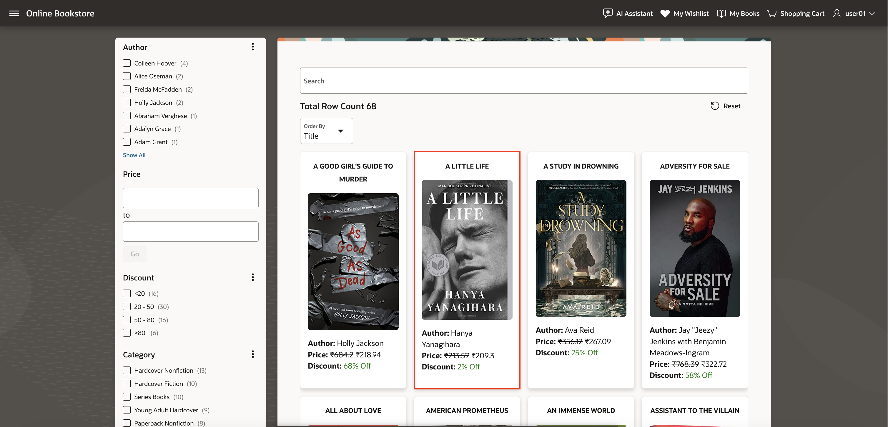

    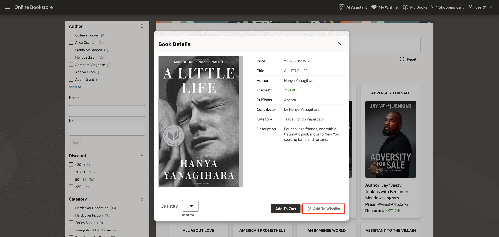

3. Observe the My Wishlist page by clicking on **My Wishlist** entry in the navigation bar.

    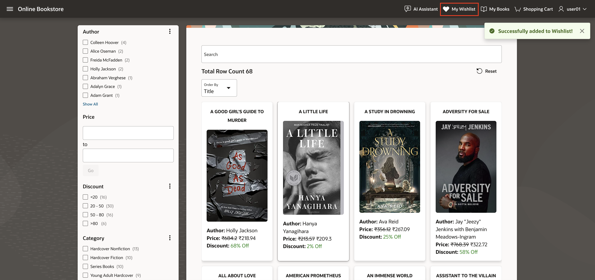

    

4. To remove a book from the wishlist, click on the book and then click **Remove From Wishlist**.

    

    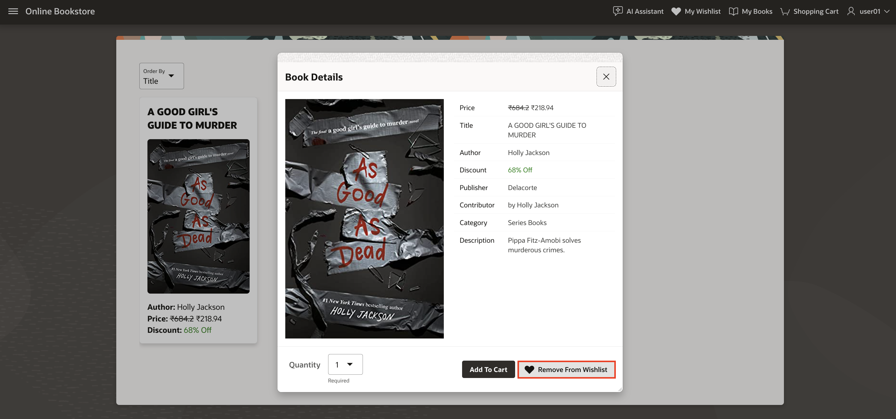

    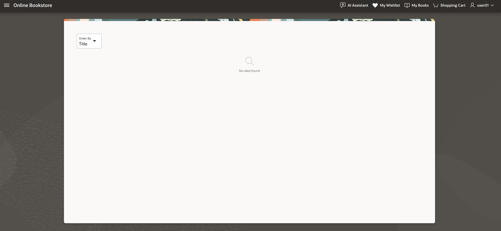

5. Alternatively, navigate back to the home page by clicking **Online Bookstore** and click on the book and then click **Remove From Wishlist**.

    

    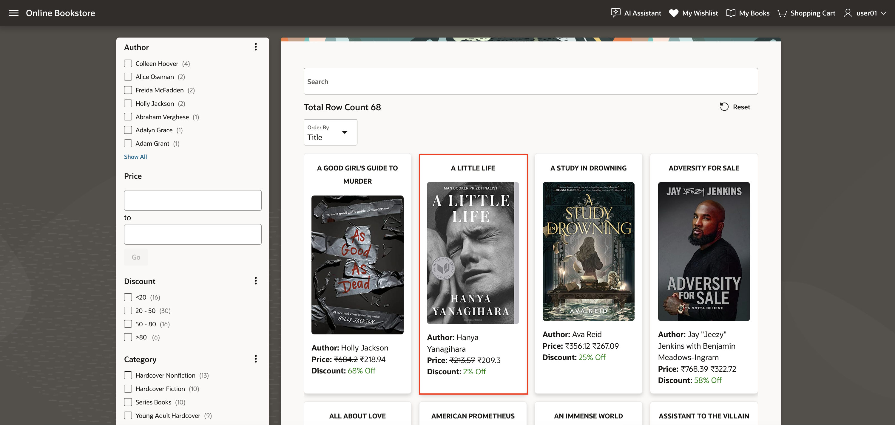

    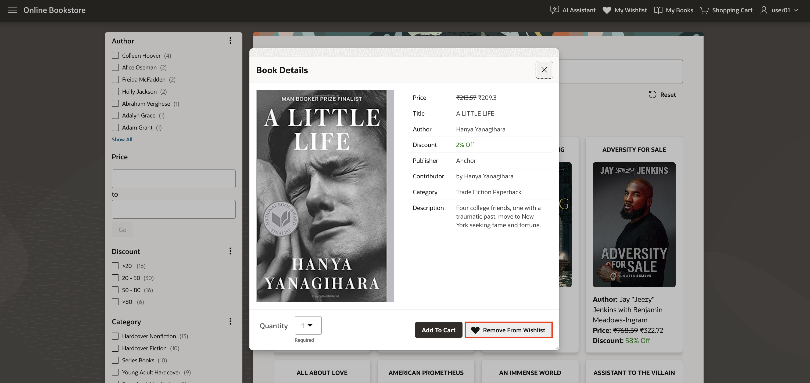

## Summary

In this lab, you successfully created a wishlist page. You designed a dynamic region to display books in the wishlist, added buttons for managing the wishlist, and implemented backend processes to handle wishlist modifications. Furthermore, you updated the navigation bar to include a link to the wishlist, ensuring easy access for users. This comprehensive exercise demonstrates how to integrate advanced functionalities into an Oracle APEX application, enhancing its usability and interactivity.

You are now ready to move on to the next lab!

## Acknowledgements

- **Author**: Pankaj Goyal, Member Technical Staff; Ankita Beri, Product Manager
- **Last Updated By/Date**: Pankaj Goyal, Member Technical Staff, March 2025
