# Download Instructions

## Introduction

In this lab, you will learn how to download and import an export file of the app. This process is essential to run the app successfully and complete the tasks that depend on the exported file. By the end of this lab, you will have a fully functional app environment for further exploration and development.

## Task 1: Download the App Export

You can download a lab export ZIP file from any lab. The export file is available after the introduction in all labs. Each export file contains everything completed up to the start of that specific lab.

The export files in the Lab Introduction and Lab 1 include two app exports:

- The first export contains everything completed in all labs except the optional Lab 18.

- The second export includes Lab 18 as well. (This requires Oracle Database 23ai for Lab 18.)

Alternatively, you can download the export file from the table below, located in any lab row. For example, an export file in Lab Row x means the app export includes everything completed up to the end of that specific lab.

| Lab |  Module | Export File | To run the app, follow the steps described in the tasks below: |
| --- | --- | --- | --- |
| 1 | [Create the application](?lab=create-app) | [Download](https://c4u04.objectstorage.us-ashburn-1.oci.customer-oci.com/p/EcTjWk2IuZPZeNnD_fYMcgUhdNDIDA6rt9gaFj_WZMiL7VvxPBNMY60837hu5hga/n/c4u04/b/livelabsfiles/o/obs-lab1.zip) | Task 2 Only |
| 2 | [Load Data Using Data Workshop](?lab=2-load-data-using-data-workshop) | [Download](https://c4u04.objectstorage.us-ashburn-1.oci.customer-oci.com/p/EcTjWk2IuZPZeNnD_fYMcgUhdNDIDA6rt9gaFj_WZMiL7VvxPBNMY60837hu5hga/n/c4u04/b/livelabsfiles/o/obs-lab2.zip) | Task 2 Only |
| 3 | [Enhance the Home Page](?lab=enhance-home-page) | [Download](https://c4u04.objectstorage.us-ashburn-1.oci.customer-oci.com/p/EcTjWk2IuZPZeNnD_fYMcgUhdNDIDA6rt9gaFj_WZMiL7VvxPBNMY60837hu5hga/n/c4u04/b/livelabsfiles/o/obs-lab3.zip) | Task 2 Only |
| 4 | [Customize Application Theme](?lab=application-theme) | [Download](https://c4u04.objectstorage.us-ashburn-1.oci.customer-oci.com/p/EcTjWk2IuZPZeNnD_fYMcgUhdNDIDA6rt9gaFj_WZMiL7VvxPBNMY60837hu5hga/n/c4u04/b/livelabsfiles/o/obs-lab4.zip) | Task 2 Only |
| 5 | [Custom Authentication](?lab=authentication) | [Download](https://c4u04.objectstorage.us-ashburn-1.oci.customer-oci.com/p/EcTjWk2IuZPZeNnD_fYMcgUhdNDIDA6rt9gaFj_WZMiL7VvxPBNMY60837hu5hga/n/c4u04/b/livelabsfiles/o/obs-lab5.zip) | from Task 2 to Task 3 |
| 6 | [Set Up Add to Cart Functionality](?lab=add-to-cart) | [Download](https://c4u04.objectstorage.us-ashburn-1.oci.customer-oci.com/p/EcTjWk2IuZPZeNnD_fYMcgUhdNDIDA6rt9gaFj_WZMiL7VvxPBNMY60837hu5hga/n/c4u04/b/livelabsfiles/o/obs-lab6.zip) | from Task 2 to Task 3 |
| 7 | [Create and Manage a Shopping Cart](?lab=7-create-shop-cart) | [Download](https://c4u04.objectstorage.us-ashburn-1.oci.customer-oci.com/p/EcTjWk2IuZPZeNnD_fYMcgUhdNDIDA6rt9gaFj_WZMiL7VvxPBNMY60837hu5hga/n/c4u04/b/livelabsfiles/o/obs-lab7.zip) | from Task 2 to Task 3 |
| 8 | [Build an AI-Assistant Chat Widget](?lab=8-build-an-ai-assistant-chat-widget) | [Download](https://c4u04.objectstorage.us-ashburn-1.oci.customer-oci.com/p/EcTjWk2IuZPZeNnD_fYMcgUhdNDIDA6rt9gaFj_WZMiL7VvxPBNMY60837hu5hga/n/c4u04/b/livelabsfiles/o/obs-lab8.zip) | from Task 2 to Task 4 |
| 9 | [Create and Manage Wishlist Functionality](?lab=9-wishlist) | [Download](https://c4u04.objectstorage.us-ashburn-1.oci.customer-oci.com/p/EcTjWk2IuZPZeNnD_fYMcgUhdNDIDA6rt9gaFj_WZMiL7VvxPBNMY60837hu5hga/n/c4u04/b/livelabsfiles/o/obs-lab9.zip) | from Task 2 to Task 4 |
| 10 | [Create and Manage User Profile Pages](?lab=10-add-user) | [Download](https://c4u04.objectstorage.us-ashburn-1.oci.customer-oci.com/p/EcTjWk2IuZPZeNnD_fYMcgUhdNDIDA6rt9gaFj_WZMiL7VvxPBNMY60837hu5hga/n/c4u04/b/livelabsfiles/o/obs-lab10.zip) | from Task 2 to Task 5 |
| 11 | [Create and Manage Administration](?lab=11-admin-page) | [Download](https://c4u04.objectstorage.us-ashburn-1.oci.customer-oci.com/p/EcTjWk2IuZPZeNnD_fYMcgUhdNDIDA6rt9gaFj_WZMiL7VvxPBNMY60837hu5hga/n/c4u04/b/livelabsfiles/o/obs-lab11.zip) | from Task 2 to Task 5 |
| 12 | [Improve User Onboarding](?lab=12-onboarding) | [Download](https://c4u04.objectstorage.us-ashburn-1.oci.customer-oci.com/p/EcTjWk2IuZPZeNnD_fYMcgUhdNDIDA6rt9gaFj_WZMiL7VvxPBNMY60837hu5hga/n/c4u04/b/livelabsfiles/o/obs-lab12.zip) | from Task 2 to Task 6 |
| 13 | [Push Notification](?lab=13-push-notification) | [Download](https://c4u04.objectstorage.us-ashburn-1.oci.customer-oci.com/p/EcTjWk2IuZPZeNnD_fYMcgUhdNDIDA6rt9gaFj_WZMiL7VvxPBNMY60837hu5hga/n/c4u04/b/livelabsfiles/o/obs-lab13.zip) | from Task 2 to Task 7 |
| 14 | [AI Vision](?lab=14-ai-vision) | [Download](https://c4u04.objectstorage.us-ashburn-1.oci.customer-oci.com/p/EcTjWk2IuZPZeNnD_fYMcgUhdNDIDA6rt9gaFj_WZMiL7VvxPBNMY60837hu5hga/n/c4u04/b/livelabsfiles/o/obs-lab14.zip) | from Task 2 to Task 8 |
| 15 | [Razorpay Payment Integration](?lab=15-razorpay-payement-integration) | [Download](https://c4u04.objectstorage.us-ashburn-1.oci.customer-oci.com/p/EcTjWk2IuZPZeNnD_fYMcgUhdNDIDA6rt9gaFj_WZMiL7VvxPBNMY60837hu5hga/n/c4u04/b/livelabsfiles/o/obs-lab15.zip) | from Task 2 to Task 9 |
| 16 | [UI Enhancements](?lab=16-additional-ui-enhancements) | [Download](https://c4u04.objectstorage.us-ashburn-1.oci.customer-oci.com/p/EcTjWk2IuZPZeNnD_fYMcgUhdNDIDA6rt9gaFj_WZMiL7VvxPBNMY60837hu5hga/n/c4u04/b/livelabsfiles/o/obs-lab16.zip) | from Task 2 to Task 10 |
| 17 | [Enhance AI-Assistant Chat Widget](?lab=17-enhance-ai-assistant) | [Download](https://c4u04.objectstorage.us-ashburn-1.oci.customer-oci.com/p/EcTjWk2IuZPZeNnD_fYMcgUhdNDIDA6rt9gaFj_WZMiL7VvxPBNMY60837hu5hga/n/c4u04/b/livelabsfiles/o/obs-lab17.zip) | from Task 2 to Task 10 |
| 18 | [Create Search Configurations with Oracle Vector Search](?lab=18-vector-search-configurations) | [Download](https://c4u04.objectstorage.us-ashburn-1.oci.customer-oci.com/p/EcTjWk2IuZPZeNnD_fYMcgUhdNDIDA6rt9gaFj_WZMiL7VvxPBNMY60837hu5hga/n/c4u04/b/livelabsfiles/o/obs-lab18.zip) | from Task 2 to Task 11 |

## Task 2: Import the App into an APEX Workspace

1. Click **App Builder** and then click **Import**.

    

2. Drag and drop your downloaded zip file, then click **Next**.

    

3. Click **Install Application**.

    

4. Click **Next**.

    

    *Note: This screen will appear only if the imported app contains workspace utilities created in the previous labs.*

5. Click **Install Supporting Objects**.

    

## Task 3: Update the Hashed Password for user01

1. Expand **SQL Workshop**, click **Object Browser**.

    

2. Expand **Tables**, select **OBS\_USERS**, then click **Data**.

    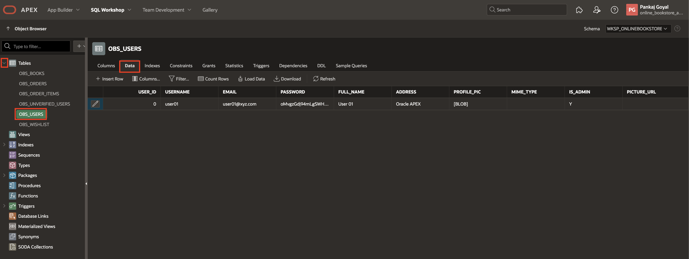

3. Click **Edit Icon** for user01, update the password to **secretPassword**, and click **Save**.

    

## Task 4: Update Web Credential and Configure Generative AI

Note: If you already have an OCI key pair, you may skip Step 1.

To Generate the API Keys using OCI Console:

1. To create an OCI API Key, refer to [Task 1: Generate API Keys using OCI Console](?lab=8-build-an-ai-assistant-chat-widget#Task1:GenerateAPIKeysusingOCIConsole) of [Lab 8: Build an AI-Assistant Chat Widget](?lab=8-build-an-ai-assistant-chat-widget)

To Configure Web Credentials in Oracle APEX:

2. Expand **App Builder**, then select **All Workspace Utilities** and click **Workspace Utilities**.

    

3. Click **Web Credentials**.

    

4. Click **apex\_ai\_cred**.

    

5. Enter the following details using the configuration file you copied and click **Apply Changes**.

    - **OCI User ID**: Enter the OCID of the Oracle Cloud user Account. You can find the OCID in the Configuration File Preview generated during the API Key creation.
    Your OCI User ID looks similar to **ocid1.user.oc1..aaaaaaaa\*\*\*\*\*\*wj3v23yla**

    - **OCI Private Key**: Open the private key (.pem file) downloaded in the previous task. Copy and paste the API Key.

    - **OCI Tenancy ID**: Enter the OCID for Tenancy. Your Tenancy ID looks similar to **ocid1.tenancy.oc1..aaaaaaaaf7ush\*\*\*\*cxx3qka**

    - **OCI Public Key Fingerprint**: Enter the Fingerprint ID. Your Fingerprint ID looks similar to **a8:8e:c2:8b:fe:\*\*\*\*:ff:4d:40**

    

To Enable Generative AI in Oracle APEX:

6. Click **Workspace Utilities**.

    

7. Click **Generative AI**.

    

8. Click **OCI Gen AI**.

    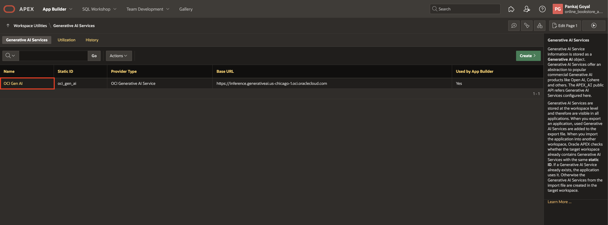

9. In the **Compartment ID** field, enter your **Compartment ID** and click **Apply Changes**. (Refer to the [Documentation](https://docs.oracle.com/en-us/iaas/Content/GSG/Tasks/contactingsupport_topic-Locating_Oracle_Cloud_Infrastructure_IDs.htm#:~:text=Finding%20the%20OCID%20of%20a,displayed%20next%20to%20each%20compartment.) to fetch your Compartment ID.)

    

## Task 5: Update the Picture URL

1. Navigate to **SQL Workshop** and select **RESTful Services**.

    

2. Expand **Modules**, then **User Images**, then **profile_pic/:id**, select **GET**, and copy and save the **Full URL**. You will use this information in the following steps.

    

3. Click **App Builder**.

    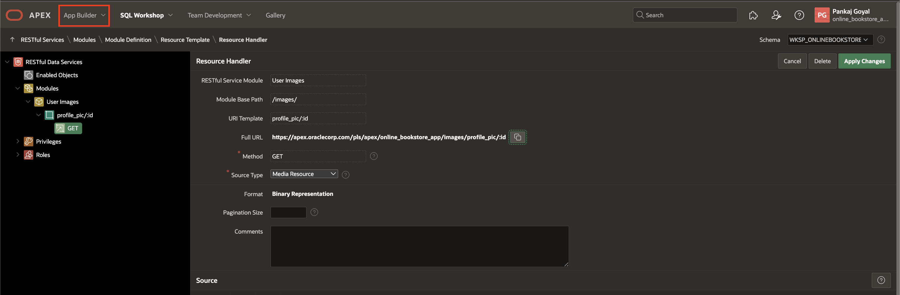

4. Click **Online Bookstore**.

    

5. Click **Shared Components**.

    

6. Click **Application Computations**.

    

7. Click **PICTURE\_URL**.

    

8. In the else statement of the code, replace **'<****picture\_url****>'** with the URL you copied in step 2, up to **'..profile_pic/'**, and click **Apply Changes**.

    

## Task 6: Update the Google Auth Credential

1. To create an Google API Key, Refer to [Task 5: Login with Google](?lab=12-onboarding#Task5:LoginwithGoogle) of [Lab 12: Improve User Onboarding](?lab=12-onboarding), following steps 1 to 10.

2. Expand **App Builder**, then select **All Workspace Utilities** and click **Workspace Utilities**.

    

3. Click **Web Credentials**.

    

4. Click **Google Authentication**.

    

5. Enter the following and click **Apply Changes**.

    - Under **Attributes**:

        - Client ID or Username: Enter the **Client ID** you copied above.
        - Client Secret or Password: Enter the **Client secret** you copied above.
        - Verify Client Secret or Password: Enter the **Client secret** you copied above.

    

## Task 7: Generate Push Notification Credentials and Enable Push Notifications on the Device

1. Click **App Builder**.

    

2. Click **Online Bookstore**.

    

3. Click **Shared Components**.

    

4. Click **Progressive Web App**.

    

5. Click **Push Notifications**.

    

6. Click **+ Generate Credentials** and click **Generate Credentials** in the confirm dialog window.

    

    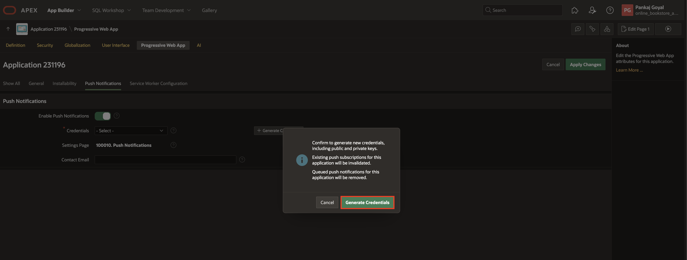

7. Click **Application ID**.

    

8. Click **Run Application**.

    

9. Click **Login** and enter the credentials of user01. (Username: user01, Password: secretPassword) and click **Sign In**

    

    

10. In the Online Bookstore App, click on your username at the top-right corner and select **Settings**.

    

11. Push Notifications is disabled by default. Click **Off** and enable the checkbox for **Enable push notifications on this device**.

    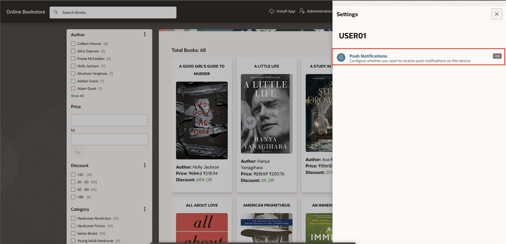

    

## Task 8: Setup Compartment ID to Run the Automation for AI Vision Service

1. Click **App Builder** and select **Online Bookstore**.

    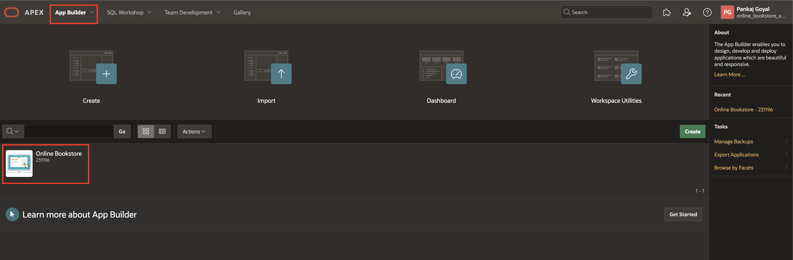

2. Click **Shared Components**.

    

3. Click **Automations**.

    

4. Click **Index Book Cover With OCI Vision**.

    

5. Under **Action** > Click **edit icon**.

    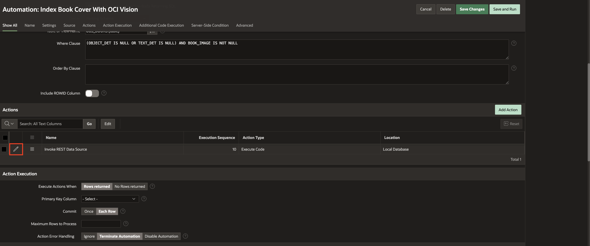

6. Replace **#COMPARTMENT\_ID#** with your **COMPARTMENT\_ID** at two places in the following query and click **Apply Changes**.

    

## Task 9: Update the Razorpay Auth Credential

1. To create an Razorpay API Key, Refer to [Task 1: Create Web Credential](?lab=15-razorpay-payement-integration#Task1:CreateWebCredential) of [Lab 15: Razorpay Payment Gateway Integration](?lab=15-razorpay-payement-integration), following steps 1 to 4.

2. Expand **App Builder**, then select **All Workspace Utilities** and click **Workspace Utilities**.

    

3. Click **Web Credentials**.

    

4. Click **Razorpay API**.

    

5. Enter the following and click **Apply Changes**.

    - Under **Attributes**:

        - Client ID or Username: Enter the **Key Id** you copied above.
        - Client Secret or Password: Enter the **Key Secret** you copied above.
        - Verify Client Secret or Password: Enter the **Key Secret** you copied above.

    

## Task 10: Update ICON_URL for the Application Icon in the Emails

1. Click **App Builder**.

    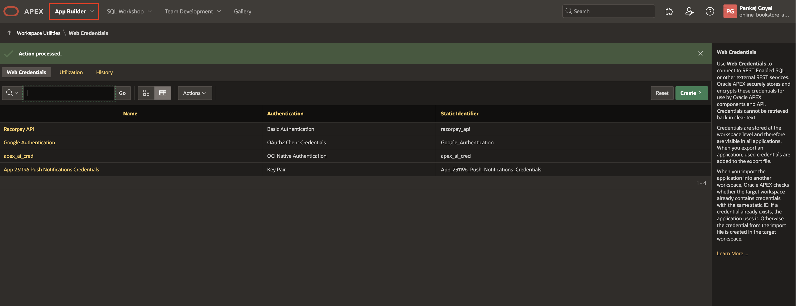

2. Click **Online Bookstore**.

    

3. Select Page **100001 - Email Verification for User SignUp**.

    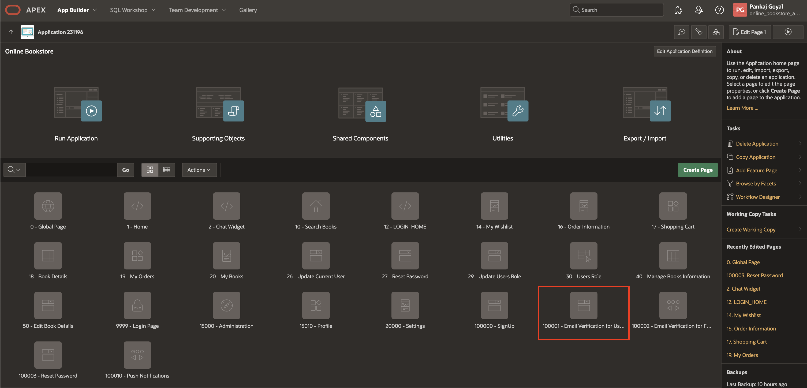

4. Navigate to **Processing**, expand **Send Verification Email** and select **Send Email Process**. Under Settings, click **Placeholder Values**, update **ICON_URL**, click OK and then click **Save**.

    - In **ICON\_URL**, replace **online\_bookstore\_app** with your **workspace\_name**, and update the domain apex.oracle.com if your environment differs.

    

5. Click **Page Finder** and select **Page 100002 - Email Verification for Forgot Password**.

    

6. Repeat step 4.

    

## Task 11: Configure Vector Search using Search Configurations

1. To load the ONXX Model, Refer to [Task 1: Load the ONNX Model](?lab=18-vector-search-configurations#Task1:LoadtheONNXModel) of [Lab 18: Vector Search using Search Configurations](?lab=18-vector-search-configurations).

2. Expand **App Builder**, then select **All Workspace Utilities** and click **Workspace Utilities**.

    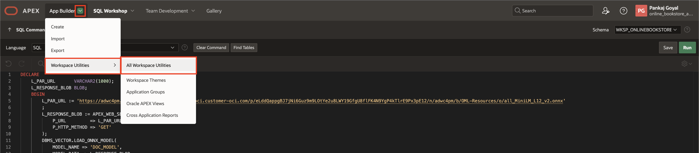

3. Click **Vector Providers**

    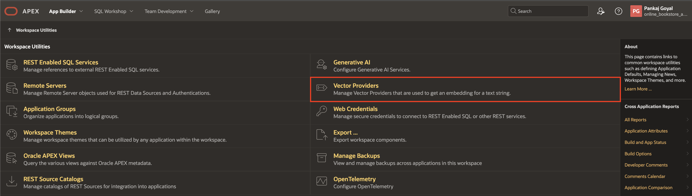

4. Click **DB ONXX Model**

    

5. Enter/select the following and click **Apply Changes**.

    - Under Local Embedding:

        - For ONNX Model Owner: **Select your Parsing Schema**

        - ONNX Model Name: **DOC_MODEL**

    

6. Expand **SQL Workshop** and select **SQL Commands**.

    

7. Copy and paste the SQL code below, then click **Run**

    ```
    <copy>
    UPDATE OBS_BOOKS
    SET DESCRIPTION_VECTOR = APEX_AI.GET_VECTOR_EMBEDDINGS(
        P_VALUE             => DESCRIPTION,
        P_SERVICE_STATIC_ID => 'db_onnx_model'
    );
    </copy>
     ```

    

## Summary

In this lab, you will follow the download instructions to import an export file of the app. This will allow you to successfully run the app and complete the lab that relies on the exported file.

## Acknowledgements

- **Author**: Pankaj Goyal, Member Technical Staff
- **Last Updated By/Date**: Pankaj Goyal, Member Technical Staff, March 2025
<!-- | 19 | [Downloads](?lab=downloads#Task1:DownloadtheApp) | 1 minutes | -->