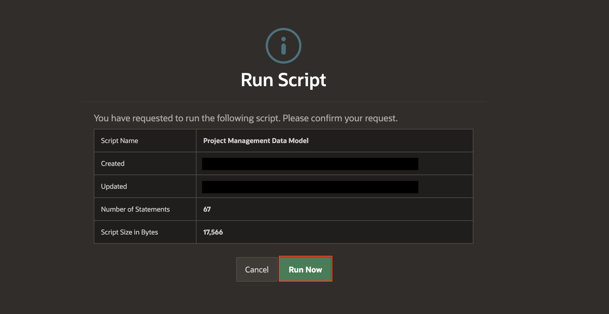

# Create Generative AI Service and Create a Data Model using AI

## Introduction

In this lab, you learn how to configure Generative AI Services to create a data model, build an application, generate SQL queries, Generate AI-powered text, and develop a chatbot. Ensure you have a secure key for accessing OCI Generative AI, OpenAI or Cohere services. You will then use Generative AI to create a data model that includes project statuses, milestones, tasks, to-dos, links, and comments—tools for efficient project management.

In this lab, you will explore how to use Generative AI Services to build a complete application. You will configure the Generative AI services to create a data model, generate SQL queries, produce AI-powered text, and develop a chatbot. Before starting, ensure you have a secure key to access OCI Generative AI, or OpenAI, or Cohere services.

Using Generative AI, you will design a data model tailored for project management, incorporating key elements such as project statuses, milestones, tasks, task to-dos, task links, and comments. These components will provide the foundation for building an efficient and interactive project management application.

Estimated Time: 15 minutes

### Objectives

In this lab, you will:

- Create/Configure Generative AI Services into your APEX Workspace
- Create a Data Model using AI in Oracle APEX Workspace

### What You will Need

- Signup and Get access for one of the supported Generative AI Services like OCI Generative AI, OpenAI or Cohere.
- An Oracle Cloud paid account, or free trial.
- An APEX Workspace

## Task 1: Creating a Generative AI Service Object - Open AI

1. Log into your workspace.

2. From your APEX workspace home page, as shown below, click **App Builder**

    

3. On the **App Builder** page, select **Workspace Utilities**.

    

4. Under Workspace Utilities, click **Generative AI**.

    

5. On the **Generative AI Services** page, click **Create**.

    

6. If AI Provider is Open AI, under **Create/Edit** Generative AI Service Page, enter the following details.
    - Under Identification
        - AI Provider: **Open AI**
        - Name: **Open AI**
    - Settings > Used by App Builder: **Toggle On**
    - Credentials > API Key: Type 'Bearer **Enter the API Key you procured from OpenAI**'
    - Advanced > AI Model: **gpt-4o**

>**Note:** When entering your API key, ensure you prepend it with **Bearer ' '**  (including a space after **Bearer**)*

7. To validate the information you enter prior to completing the setup, click **Test Connection**.

    

8. Once the Connection is Successful, click **Create**.

    

    

## Task 2: Create Project Management Data Model using AI

To create a data model with AI, you need to have a configured Generative AI Service and ensure the **Used by App Builder** is enabled. If no AI Service is available, the Create Data Model Using AI option will not be visible.

1. Login to your Application. On the Workspace home page, click **SQL Workshop**.

    

2. Click **Utilities**.

    

3. Click **Create Data Model Using AI**.

    

    

    >**Note:** You can also access Create Data Model Using AI directly from the Tasks list on the SQL Workshop home page.

4. When using Generative AI features within the APEX development environment, you will be asked to provide consent. In the **APEX Assistant** Wizard, if you see a Dialog regarding **consent**. Click on **Accept**.

    

5. Use the **APEX Assistant** Wizard to create a Data Model using AI. To create a Project Management Data Model, enter the prompt mentioned below. Make sure that you choose **Oracle SQL** for **SQL Format**.

    >Prompt:
    >Create a data model with the prefix PM to manage projects, milestones, tasks, task to-dos, task links, and comments, including multiple rows of data for each table

    

6. To complete the **SQL script**, click **Create SQL Script**.

    

7. For Script Name: **Project Management Data Model**. Replace the script with below code:

    

     >**Note:** We are replacing the code to ensure the lab can be completed as intended. The replacement is only for consistency with the lab steps and expected results.

    ```
    <copy>

    CREATE TABLE "PM_STATUS"
    ("ID" NUMBER GENERATED BY DEFAULT ON NULL AS IDENTITY MINVALUE 1 MAXVALUE 9999999999999999999999999999 INCREMENT BY 1 START WITH 4 NOCACHE  NOORDER  NOCYCLE  NOKEEP  NOSCALE  NOT NULL ENABLE,
        "CODE" VARCHAR2(15) NOT NULL ENABLE,
        "DESCRIPTION" VARCHAR2(255) NOT NULL ENABLE,
        "DISPLAY_ORDER" NUMBER NOT NULL ENABLE,
        "CREATED" TIMESTAMP (6) WITH TIME ZONE NOT NULL ENABLE,
        "CREATED_BY" VARCHAR2(255) NOT NULL ENABLE,
        "UPDATED" TIMESTAMP (6) WITH TIME ZONE NOT NULL ENABLE,
        "UPDATED_BY" VARCHAR2(255) NOT NULL ENABLE,
        CONSTRAINT "PM_USERS_PK" PRIMARY KEY ("ID")
    USING INDEX  ENABLE,
        CONSTRAINT "PM_STATUS_UK" UNIQUE ("CODE")
    USING INDEX  ENABLE
    ) ;

    CREATE TABLE "PM_PROJECTS"
    ("ID" NUMBER GENERATED BY DEFAULT ON NULL AS IDENTITY MINVALUE 1 MAXVALUE 9999999999999999999999999999 INCREMENT BY 1 START WITH 1 CACHE 20 NOORDER  NOCYCLE  NOKEEP  NOSCALE  NOT NULL ENABLE,
        "STATUS_ID" NUMBER,
        "NAME" VARCHAR2(255) NOT NULL ENABLE,
        "DESCRIPTION" VARCHAR2(4000),
        "PROJECT_LEAD" VARCHAR2(255),
        "BUDGET" NUMBER,
        "COMPLETED_DATE" DATE,
        "CREATED" TIMESTAMP (6) WITH TIME ZONE NOT NULL ENABLE,
        "CREATED_BY" VARCHAR2(255) NOT NULL ENABLE,
        "UPDATED" TIMESTAMP (6) WITH TIME ZONE NOT NULL ENABLE,
        "UPDATED_BY" VARCHAR2(255) NOT NULL ENABLE,
        CONSTRAINT "PM_PROJECTS_PK" PRIMARY KEY ("ID")
    USING INDEX  ENABLE,
        CONSTRAINT "PM_PROJECTS_UK" UNIQUE ("NAME")
    USING INDEX  ENABLE
    ) ;

    CREATE TABLE "PM_COMMENTS"
    ("ID" NUMBER GENERATED BY DEFAULT ON NULL AS IDENTITY MINVALUE 1 MAXVALUE 9999999999999999999999999999 INCREMENT BY 1 START WITH 1 CACHE 20 NOORDER  NOCYCLE  NOKEEP  NOSCALE  NOT NULL ENABLE,
        "PROJECT_ID" NUMBER NOT NULL ENABLE,
        "COMMENT_TEXT" VARCHAR2(4000) NOT NULL ENABLE,
        "CREATED" TIMESTAMP (6) WITH TIME ZONE NOT NULL ENABLE,
        "CREATED_BY" VARCHAR2(255) NOT NULL ENABLE,
        "UPDATED" TIMESTAMP (6) WITH TIME ZONE NOT NULL ENABLE,
        "UPDATED_BY" VARCHAR2(255) NOT NULL ENABLE,
        CONSTRAINT "PM_COMMENTS_PK" PRIMARY KEY ("ID")
    USING INDEX  ENABLE
    ) ;

    CREATE TABLE "PM_MILESTONES"
    ("ID" NUMBER GENERATED BY DEFAULT ON NULL AS IDENTITY MINVALUE 1 MAXVALUE 9999999999999999999999999999 INCREMENT BY 1 START WITH 1 CACHE 20 NOORDER  NOCYCLE  NOKEEP  NOSCALE  NOT NULL ENABLE,
        "PROJECT_ID" NUMBER NOT NULL ENABLE,
        "NAME" VARCHAR2(255) NOT NULL ENABLE,
        "DESCRIPTION" VARCHAR2(4000),
        "DUE_DATE" DATE NOT NULL ENABLE,
        "CREATED" TIMESTAMP (6) WITH TIME ZONE NOT NULL ENABLE,
        "CREATED_BY" VARCHAR2(255) NOT NULL ENABLE,
        "UPDATED" TIMESTAMP (6) WITH TIME ZONE NOT NULL ENABLE,
        "UPDATED_BY" VARCHAR2(255) NOT NULL ENABLE,
        CONSTRAINT "PM_MILESTONES_PK" PRIMARY KEY ("ID")
    USING INDEX  ENABLE
    ) ;

    CREATE TABLE "PM_TASKS"
    ("ID" NUMBER GENERATED BY DEFAULT ON NULL AS IDENTITY MINVALUE 1 MAXVALUE 9999999999999999999999999999 INCREMENT BY 1 START WITH 1 CACHE 20 NOORDER  NOCYCLE  NOKEEP  NOSCALE  NOT NULL ENABLE,
        "PROJECT_ID" NUMBER NOT NULL ENABLE,
        "MILESTONE_ID" NUMBER,
        "NAME" VARCHAR2(255) NOT NULL ENABLE,
        "DESCRIPTION" VARCHAR2(4000),
        "ASSIGNEE" VARCHAR2(255),
        "START_DATE" DATE NOT NULL ENABLE,
        "END_DATE" DATE NOT NULL ENABLE,
        "COST" NUMBER,
        "IS_COMPLETE_YN" VARCHAR2(1),
        "CREATED" TIMESTAMP (6) WITH TIME ZONE NOT NULL ENABLE,
        "CREATED_BY" VARCHAR2(255) NOT NULL ENABLE,
        "UPDATED" TIMESTAMP (6) WITH TIME ZONE NOT NULL ENABLE,
        "UPDATED_BY" VARCHAR2(255) NOT NULL ENABLE,
        CONSTRAINT "PM_TASKS_PK" PRIMARY KEY ("ID")
    USING INDEX  ENABLE,
        CONSTRAINT "PM_TASKS_UK" UNIQUE ("PROJECT_ID", "NAME")
    USING INDEX  ENABLE
    ) ;

    CREATE TABLE "PM_TASK_LINKS"
    ("ID" NUMBER GENERATED BY DEFAULT ON NULL AS IDENTITY MINVALUE 1 MAXVALUE 9999999999999999999999999999 INCREMENT BY 1 START WITH 1 CACHE 20 NOORDER  NOCYCLE  NOKEEP  NOSCALE  NOT NULL ENABLE,
        "PROJECT_ID" NUMBER NOT NULL ENABLE,
        "TASK_ID" NUMBER NOT NULL ENABLE,
        "LINK_TYPE" VARCHAR2(20) NOT NULL ENABLE,
        "URL" VARCHAR2(255),
        "APPLICATION_ID" NUMBER,
        "APPLICATION_PAGE" NUMBER,
        "DESCRIPTION" VARCHAR2(4000),
        "CREATED" TIMESTAMP (6) WITH TIME ZONE NOT NULL ENABLE,
        "CREATED_BY" VARCHAR2(255) NOT NULL ENABLE,
        "UPDATED" TIMESTAMP (6) WITH TIME ZONE NOT NULL ENABLE,
        "UPDATED_BY" VARCHAR2(255) NOT NULL ENABLE,
        CONSTRAINT "PM_TSK_LINK_LTY_CH" CHECK ( link_type in ('URL','Application')) ENABLE,
        CONSTRAINT "PM_TASK_LINKS_PK" PRIMARY KEY ("ID")
    USING INDEX  ENABLE
    ) ;

    CREATE TABLE "PM_TASK_TODOS"
    ("ID" NUMBER GENERATED BY DEFAULT ON NULL AS IDENTITY MINVALUE 1 MAXVALUE 9999999999999999999999999999 INCREMENT BY 1 START WITH 1 CACHE 20 NOORDER  NOCYCLE  NOKEEP  NOSCALE  NOT NULL ENABLE,
        "PROJECT_ID" NUMBER NOT NULL ENABLE,
        "TASK_ID" NUMBER NOT NULL ENABLE,
        "NAME" VARCHAR2(255) NOT NULL ENABLE,
        "DESCRIPTION" VARCHAR2(4000),
        "ASSIGNEE" VARCHAR2(255),
        "IS_COMPLETE_YN" VARCHAR2(1),
        "CREATED" TIMESTAMP (6) WITH TIME ZONE NOT NULL ENABLE,
        "CREATED_BY" VARCHAR2(255) NOT NULL ENABLE,
        "UPDATED" TIMESTAMP (6) WITH TIME ZONE NOT NULL ENABLE,
        "UPDATED_BY" VARCHAR2(255) NOT NULL ENABLE,
        CONSTRAINT "PM_TASK_TODOS_PK" PRIMARY KEY ("ID")
    USING INDEX  ENABLE
    ) ;

    ALTER TABLE "PM_COMMENTS" ADD CONSTRAINT "PM_COMMENT_PROJ_FK" FOREIGN KEY ("PROJECT_ID")
        REFERENCES "PM_PROJECTS" ("ID") ON DELETE CASCADE ENABLE;

    CREATE INDEX "PM_COMMENT_PRJ_IDX" ON "PM_COMMENTS" ("PROJECT_ID");


    ALTER TABLE "PM_MILESTONES" ADD CONSTRAINT "PM_MSTONE_PROJ_FK" FOREIGN KEY ("PROJECT_ID")
        REFERENCES "PM_PROJECTS" ("ID") ON DELETE CASCADE ENABLE;

    CREATE INDEX "PM_MSTONE_PROJ_IDX" ON "PM_MILESTONES" ("PROJECT_ID");


    ALTER TABLE "PM_PROJECTS" ADD CONSTRAINT "PM_PROJECT_STATUS_FK" FOREIGN KEY ("STATUS_ID")
        REFERENCES "PM_STATUS" ("ID") ON DELETE SET NULL ENABLE;

    CREATE INDEX "PM_STATUS_IDX" ON "PM_PROJECTS" ("STATUS_ID");


    ALTER TABLE "PM_TASKS" ADD CONSTRAINT "PM_TASK_MSTONE_FK" FOREIGN KEY ("MILESTONE_ID")
        REFERENCES "PM_MILESTONES" ("ID") ON DELETE SET NULL ENABLE;
    ALTER TABLE "PM_TASKS" ADD CONSTRAINT "PM_TASK_PROJ_FK" FOREIGN KEY ("PROJECT_ID")
        REFERENCES "PM_PROJECTS" ("ID") ON DELETE CASCADE ENABLE;

    CREATE INDEX "PM_TASK_MSTONE_IDX" ON "PM_TASKS" ("MILESTONE_ID");

    CREATE INDEX "PM_TASK_PROJ_IDX" ON "PM_TASKS" ("PROJECT_ID");


    ALTER TABLE "PM_TASK_LINKS" ADD CONSTRAINT "PM_TSK_LINK_PRJ_FK" FOREIGN KEY ("PROJECT_ID")
        REFERENCES "PM_PROJECTS" ("ID") ON DELETE CASCADE ENABLE;
    ALTER TABLE "PM_TASK_LINKS" ADD CONSTRAINT "PM_TSK_LINK_TSK_FK" FOREIGN KEY ("TASK_ID")
        REFERENCES "PM_TASKS" ("ID") ON DELETE CASCADE ENABLE;

    CREATE INDEX "PM_TSK_LINK_PR_IDX" ON "PM_TASK_LINKS" ("PROJECT_ID");

    CREATE INDEX "PM_TSK_LINK_TK_IDX" ON "PM_TASK_LINKS" ("TASK_ID");


    ALTER TABLE "PM_TASK_TODOS" ADD CONSTRAINT "PM_PROJ_TASK_TODO_PROJ_FK" FOREIGN KEY ("PROJECT_ID")
        REFERENCES "PM_PROJECTS" ("ID") ON DELETE CASCADE ENABLE;
    ALTER TABLE "PM_TASK_TODOS" ADD CONSTRAINT "PM_TSK_TODO_TSK_FK" FOREIGN KEY ("TASK_ID")
        REFERENCES "PM_TASKS" ("ID") ON DELETE CASCADE ENABLE;

    CREATE INDEX "PM_TSK_TODO_PR_IDX" ON "PM_TASK_TODOS" ("PROJECT_ID");

    CREATE INDEX "PM_TSK_TODO_TK_IDX" ON "PM_TASK_TODOS" ("TASK_ID");


    CREATE OR REPLACE EDITIONABLE TRIGGER "PM_COMMENTS_BIU"
        before insert or update on pm_comments
        for each row
    begin
        if inserting then
            :new.created    := current_timestamp;
            :new.created_by := nvl(wwv_flow.g_user,user);
        end if;
        :new.updated    := current_timestamp;
        :new.updated_by := nvl(wwv_flow.g_user,user);
    end;
    /
    ALTER TRIGGER "PM_COMMENTS_BIU" ENABLE;
    CREATE OR REPLACE EDITIONABLE TRIGGER "PM_MILESTONES_BIU"
        before insert or update on pm_milestones
        for each row
    begin
        if inserting then
            :new.created    := current_timestamp;
            :new.created_by := nvl(wwv_flow.g_user,user);
        end if;
        :new.updated    := current_timestamp;
        :new.updated_by := nvl(wwv_flow.g_user,user);
    end;
    /
    ALTER TRIGGER "PM_MILESTONES_BIU" ENABLE;

    CREATE OR REPLACE EDITIONABLE TRIGGER "PM_PROJECTS_BIU"
        before insert or update on pm_projects
        for each row
    begin
        if inserting then
            :new.created    := current_timestamp;
            :new.created_by := nvl(wwv_flow.g_user,user);
        end if;
        :new.updated    := current_timestamp;
        :new.updated_by := nvl(wwv_flow.g_user,user);
    end;
    /
    ALTER TRIGGER "PM_PROJECTS_BIU" ENABLE;

    CREATE OR REPLACE EDITIONABLE TRIGGER "PM_STATUS_BIU"
    before insert or update on pm_status
        for each row
    begin
        if inserting then
            :new.created    := current_timestamp;
            :new.created_by := nvl(wwv_flow.g_user,user);
        end if;
        :new.code       := upper(:new.code);
        :new.updated    := current_timestamp;
        :new.updated_by := nvl(wwv_flow.g_user,user);
    end;
    /
    ALTER TRIGGER "PM_STATUS_BIU" ENABLE;


    CREATE OR REPLACE EDITIONABLE TRIGGER "PM_TASKS_BIU"
        before insert or update on pm_tasks
        for each row
    begin
        if inserting then
            :new.created    := current_timestamp;
            :new.created_by := nvl(wwv_flow.g_user,user);
        end if;
        :new.updated    := current_timestamp;
        :new.updated_by := nvl(wwv_flow.g_user,user);
    end;
    /
    ALTER TRIGGER "PM_TASKS_BIU" ENABLE;

    CREATE OR REPLACE EDITIONABLE TRIGGER "PM_TASK_LINKS_BIU"
        before insert or update on pm_task_links
        for each row
    begin
        if inserting then
            :new.created    := current_timestamp;
            :new.created_by := nvl(wwv_flow.g_user,user);
        end if;
        :new.updated    := current_timestamp;
        :new.updated_by := nvl(wwv_flow.g_user,user);
    end;
    /
    ALTER TRIGGER "PM_TASK_LINKS_BIU" ENABLE;


    CREATE OR REPLACE EDITIONABLE TRIGGER "PM_TASK_TODOS_BIU"
        before insert or update on pm_task_todos
        for each row
    begin
        if inserting then
            :new.created    := current_timestamp;
            :new.created_by := nvl(wwv_flow.g_user,user);
        end if;
        :new.updated    := current_timestamp;
        :new.updated_by := nvl(wwv_flow.g_user,user);
    end;
    /
    ALTER TRIGGER "PM_TASK_TODOS_BIU" ENABLE;


    create or replace TRIGGER "PM_COMMENTS_BIU"
        before insert or update on pm_comments
        for each row
    begin
        if inserting then
            :new.created    := current_timestamp;
            :new.created_by := nvl(wwv_flow.g_user,user);
        end if;
        :new.updated    := current_timestamp;
        :new.updated_by := nvl(wwv_flow.g_user,user);
    end;
    /
    create or replace TRIGGER "PM_MILESTONES_BIU"
        before insert or update on pm_milestones
        for each row
    begin
        if inserting then
            :new.created    := current_timestamp;
            :new.created_by := nvl(wwv_flow.g_user,user);
        end if;
        :new.updated    := current_timestamp;
        :new.updated_by := nvl(wwv_flow.g_user,user);
    end;
    /
    create or replace TRIGGER "PM_PROJECTS_BIU"
        before insert or update on pm_projects
        for each row
    begin
        if inserting then
            :new.created    := current_timestamp;
            :new.created_by := nvl(wwv_flow.g_user,user);
        end if;
        :new.updated    := current_timestamp;
        :new.updated_by := nvl(wwv_flow.g_user,user);
    end;
    /
    create or replace TRIGGER "PM_STATUS_BIU"
    before insert or update on pm_status
        for each row
    begin
        if inserting then
            :new.created    := current_timestamp;
            :new.created_by := nvl(wwv_flow.g_user,user);
        end if;
        :new.code       := upper(:new.code);
        :new.updated    := current_timestamp;
        :new.updated_by := nvl(wwv_flow.g_user,user);
    end;
    /
    create or replace TRIGGER "PM_TASKS_BIU"
        before insert or update on pm_tasks
        for each row
    begin
        if inserting then
            :new.created    := current_timestamp;
            :new.created_by := nvl(wwv_flow.g_user,user);
        end if;
        :new.updated    := current_timestamp;
        :new.updated_by := nvl(wwv_flow.g_user,user);
    end;
    /
    create or replace TRIGGER "PM_TASK_LINKS_BIU"
        before insert or update on pm_task_links
        for each row
    begin
        if inserting then
            :new.created    := current_timestamp;
            :new.created_by := nvl(wwv_flow.g_user,user);
        end if;
        :new.updated    := current_timestamp;
        :new.updated_by := nvl(wwv_flow.g_user,user);
    end;
    /
    create or replace TRIGGER "PM_TASK_TODOS_BIU"
        before insert or update on pm_task_todos
        for each row
    begin
        if inserting then
            :new.created    := current_timestamp;
            :new.created_by := nvl(wwv_flow.g_user,user);
        end if;
        :new.updated    := current_timestamp;
        :new.updated_by := nvl(wwv_flow.g_user,user);
    end;
    /

    INSERT INTO PM_STATUS (CODE, DESCRIPTION, DISPLAY_ORDER)
    VALUES ('NEW', 'Newly created project', 1);

    INSERT INTO PM_STATUS (CODE, DESCRIPTION, DISPLAY_ORDER)
    VALUES ('INPRG', 'Project in progress', 2);

    INSERT INTO PM_STATUS (CODE, DESCRIPTION, DISPLAY_ORDER)
    VALUES ('CMPLT', 'Project completed', 3);


    INSERT INTO PM_PROJECTS (STATUS_ID, NAME, DESCRIPTION, PROJECT_LEAD, BUDGET)
    VALUES (1, 'Website Redesign', 'Revamp the corporate website', 'Alice', 50000);

    INSERT INTO PM_PROJECTS (STATUS_ID, NAME, DESCRIPTION, PROJECT_LEAD, BUDGET)
    VALUES (2, 'Mobile App Development', 'Build a mobile app for customers', 'Bob', 120000);

    INSERT INTO PM_PROJECTS (STATUS_ID, NAME, DESCRIPTION, PROJECT_LEAD, BUDGET)
    VALUES (2, 'Data Migration', 'Migrate legacy system data to cloud', 'Charlie', 80000);


    INSERT INTO PM_COMMENTS (PROJECT_ID, COMMENT_TEXT)
    VALUES (1, 'Kick-off meeting scheduled.');

    INSERT INTO PM_COMMENTS (PROJECT_ID, COMMENT_TEXT)
    VALUES (2, 'Wireframes shared with client.');

    INSERT INTO PM_COMMENTS (PROJECT_ID, COMMENT_TEXT)
    VALUES (3, 'Data cleansing started.');


    INSERT INTO PM_MILESTONES (PROJECT_ID, NAME, DESCRIPTION, DUE_DATE)
    VALUES (1, 'Design Phase', 'Complete design prototypes', DATE '2025-10-15');

    INSERT INTO PM_MILESTONES (PROJECT_ID, NAME, DESCRIPTION, DUE_DATE)
    VALUES (2, 'MVP Release', 'Deliver first app version', DATE '2025-11-10');

    INSERT INTO PM_MILESTONES (PROJECT_ID, NAME, DESCRIPTION, DUE_DATE)
    VALUES (3, 'Migration Complete', 'All data migrated to cloud', DATE '2025-12-01');


    INSERT INTO PM_TASKS (PROJECT_ID, MILESTONE_ID, NAME, DESCRIPTION, ASSIGNEE, START_DATE, END_DATE, COST, IS_COMPLETE_YN)
    VALUES (1, 1, 'UI Mockups', 'Prepare homepage and dashboard mockups', 'David', DATE '2025-10-01', DATE '2025-10-10', 5000, 'N');

    INSERT INTO PM_TASKS (PROJECT_ID, MILESTONE_ID, NAME, DESCRIPTION, ASSIGNEE, START_DATE, END_DATE, COST, IS_COMPLETE_YN)
    VALUES (2, 2, 'API Development', 'Develop backend APIs', 'Emma', DATE '2025-10-05', DATE '2025-11-05', 20000, 'N');

    INSERT INTO PM_TASKS (PROJECT_ID, MILESTONE_ID, NAME, DESCRIPTION, ASSIGNEE, START_DATE, END_DATE, COST, IS_COMPLETE_YN)
    VALUES (3, 3, 'ETL Scripts', 'Develop ETL jobs for migration', 'Frank', DATE '2025-09-25', DATE '2025-11-25', 15000, 'N');


    INSERT INTO PM_TASK_LINKS (PROJECT_ID, TASK_ID, LINK_TYPE, URL, DESCRIPTION)
    VALUES (1, 1, 'URL', 'http://intranet/docs/ui', 'Design references');

    INSERT INTO PM_TASK_LINKS (PROJECT_ID, TASK_ID, LINK_TYPE, URL, DESCRIPTION)
    VALUES (2, 2, 'Application', NULL, 'API Test Application');

    INSERT INTO PM_TASK_LINKS (PROJECT_ID, TASK_ID, LINK_TYPE, URL, DESCRIPTION)
    VALUES (3, 3, 'URL', 'http://intranet/docs/migration', 'ETL documentation');


    INSERT INTO PM_TASK_TODOS (PROJECT_ID, TASK_ID, NAME, DESCRIPTION, ASSIGNEE, IS_COMPLETE_YN)
    VALUES (1, 1, 'Gather branding assets', 'Collect logos and images', 'Grace', 'N');

    INSERT INTO PM_TASK_TODOS (PROJECT_ID, TASK_ID, NAME, DESCRIPTION, ASSIGNEE, IS_COMPLETE_YN)
    VALUES (2, 2, 'Setup dev server', 'Provision development environment', 'Hank', 'Y');

    INSERT INTO PM_TASK_TODOS (PROJECT_ID, TASK_ID, NAME, DESCRIPTION, ASSIGNEE, IS_COMPLETE_YN)
    VALUES (3, 3, 'Validate data mapping', 'Check mapping with source systems', 'Ivy', 'N');

    <copy>
    ```

8. Review the summary and then click **Run Now**.

    

9. We can see that all the statements were run successfully.

    

    >**Note:** You do NOT want to click Create Application, as you will use Generative AI to create an application later.

## Task 3: Review Database Objects

1. Navigate to **SQL Workshop** > **Object Browser**.

    

2. Click on tables to view different tables and then you will see various tabs, such as Data, Constraints, and so forth, to review the table details.

    

## **Summary**

You now know how to configure Generative AI Services using Workspace Utilities and Create a Data Model using AI. You may now **proceed to the next lab**.

## Acknowledgments

- **Author** - Roopesh Thokala, Senior Product Manager
- **Last Updated By/Date** - Roopesh Thokala, Senior Product Manager, January 2025
