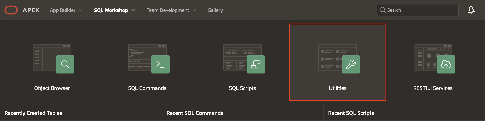
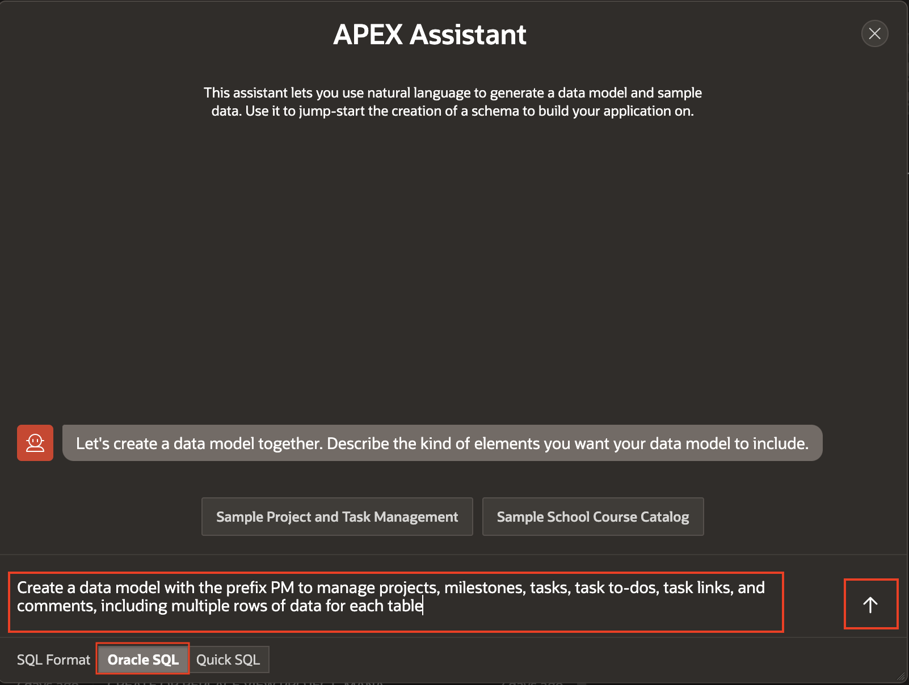
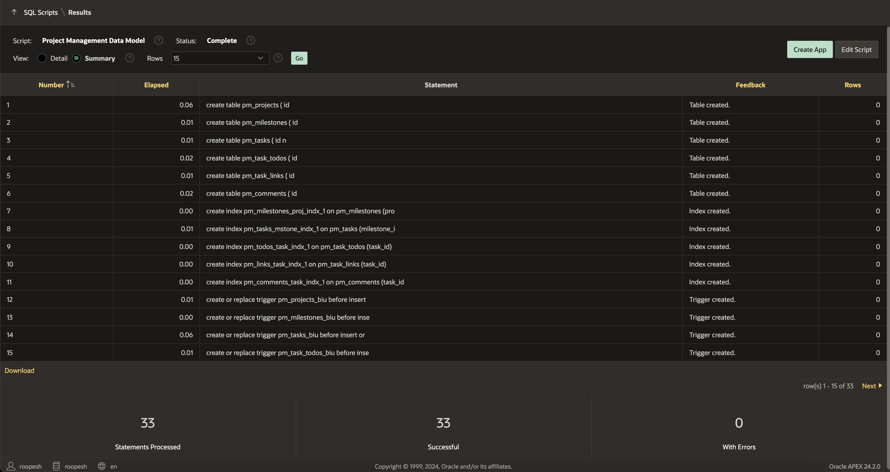

# Create Generative AI Service and Create a Data Model using AI

## Introduction

In this lab, you learn how to configure Generative AI Services to create a data model, build an application, generate SQL queries, Generate AI-powered text, and develop a chatbot. Ensure you have a secure key for accessing OCI Generative AI, OpenAI or Cohere services. You will then use Generative AI to create a data model that includes project statuses, milestones, tasks, to-dos, links, and comments—tools for efficient project management.

In this lab, you will explore how to use Generative AI Services to build a complete application. You will configure the Generative AI services to create a data model, generate SQL queries, produce AI-powered text, and develop a chatbot. Before starting, ensure you have a secure key to access OCI Generative AI, or OpenAI, or Cohere services.

Using Generative AI, you will design a data model tailored for project management, incorporating key elements such as project statuses, milestones, tasks, task to-dos, task links, and comments. These components will provide the foundation for building an efficient and interactive project management application.

Estimated Time: 15 minutes

### Objectives
In this lab, you will:
- Create/Configure Generative AI Services into your APEX Workspace
- Create a Data Model using AI in Oracle APEX Workspace

### What You will Need
- Signup and Get access for one of the supported Generative AI Services like OCI Generative AI, OpenAI or Cohere.
- An Oracle Cloud paid account, or free trial.
- An APEX Workspace

## Task 1: Creating a Generative AI Service Object - Open AI

1. Log into your workspace.

2. From your APEX workspace home page, as shown below, click **App Builder**

    

3. On the **App Builder** page, select **Workspace Utilities**.

    

4. Under Workspace Utilities, click **Generative AI**.

    

5. On the **Generative AI Services** page, click **Create**.

    

6. If AI Provider is Open AI, under **Create/Edit** Generative AI Service Page, enter the following details.
    - Under Identification
        - AI Provider: **Open AI**
        - Name: **Open AI**
    - Settings > Used by App Builder: **Toggle On**
    - Credentials > API Key: Type 'Bearer **Enter the API Key you procured from OpenAI**'
    - Advanced > AI Model: **gpt-4o**
  
>**Note:** When entering your API key, ensure you prepend it with **Bearer ' '**  (including a space after **Bearer**)*

7. To validate the information you enter prior to completing the setup, click **Test Connection**.

    

8. Once the Connection is Successful, click **Create**.

    

    

## Task 2: Create Project Management Data Model using AI

To create a data model with AI, you need to have a configured Generative AI Service and ensure the **Used by App Builder** is enabled. If no AI Service is available, the Create Data Model Using AI option will not be visible.

1. Login to your Application. On the Workspace home page, click **SQL Workshop**.

    

2. Click **Utilities**.

    

3. Click **Create Data Model Using AI**.

    

    

>**Note:** You can also access Create Data Model Using AI directly from the Tasks list on the SQL Workshop home page.

4. When using Generative AI features within the APEX development environment, you will be asked to provide consent. In the **APEX Assistant** Wizard, if you see a Dialog regarding **consent**. Click on **Accept**.

    

5. Use the **APEX Assistant** Wizard to create a Data Model using AI. To create a Project Management Data Model, enter the prompt mentioned below. Make sure that you choose **Oracle SQL** for **SQL Format**.

    >Prompt:
    >Create a data model with the prefix PM to manage projects, milestones, tasks, task to-dos, task links, and comments, including multiple rows of data for each table

    

6. To complete the **SQL script**, click **Create SQL Script**.

    

7. In the Script Editor page, to save, edit, and run the script, enter the following Script name and click **Run**.
      - For Script Name: **Project Management Data Model**

    

8. Review the summary and then click **Run Now**.

    

9. We can see that all the statements were run successfully.

    

>**Note:** You do NOT want to click Create Application, as you will use Generative AI to create an application later.

## Task 3: Review Database Objects

1. Navigate to **SQL Workshop** > **Object Browser**.

    

2. Click on tables to view different tables and then you will see various tabs, such as Data, Constraints, and so forth, to review the table details.

    

## **Summary**

You now know how to configure Generative AI Services using Workspace Utilities and Create a Data Model using AI. You may now **proceed to the next lab**.

## Acknowledgments

- **Author** - Roopesh Thokala, Senior Product Manager
- **Last Updated By/Date** - Roopesh Thokala, Senior Product Manager, January 2025
