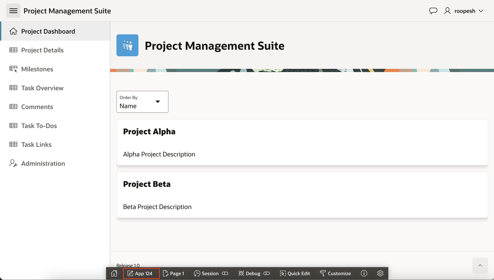
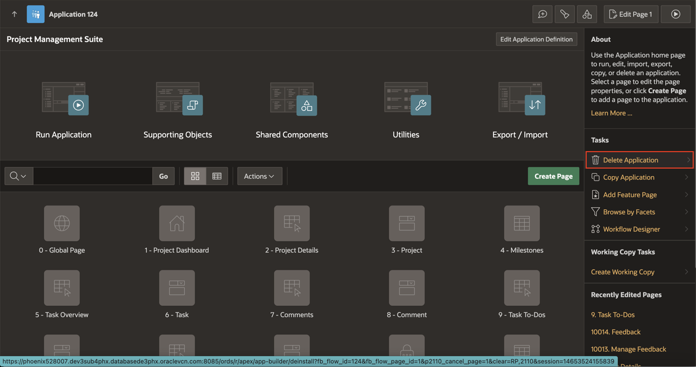
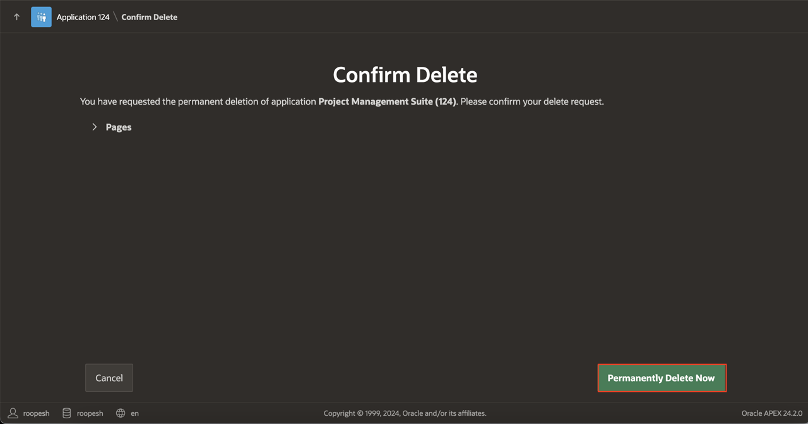
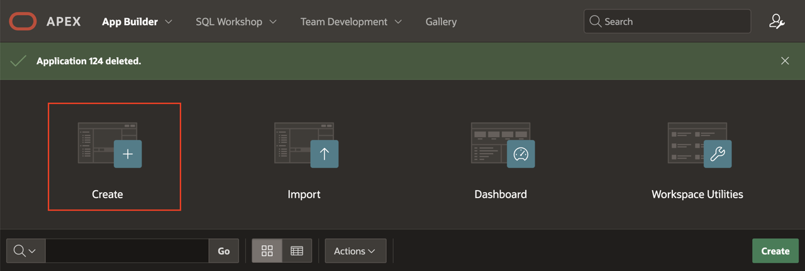
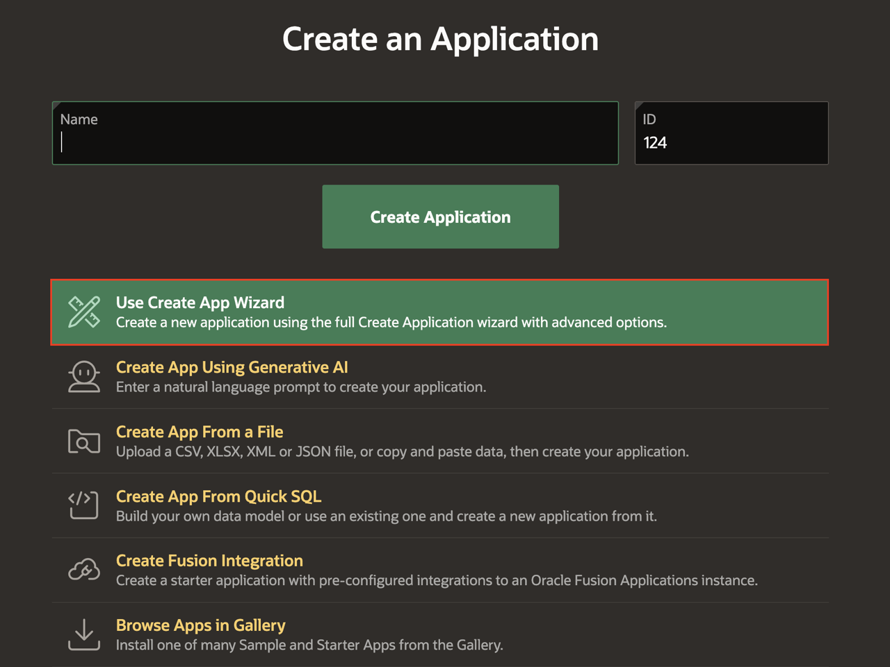
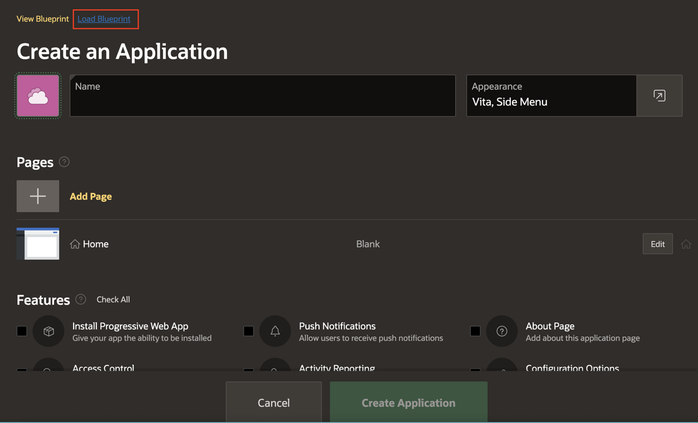
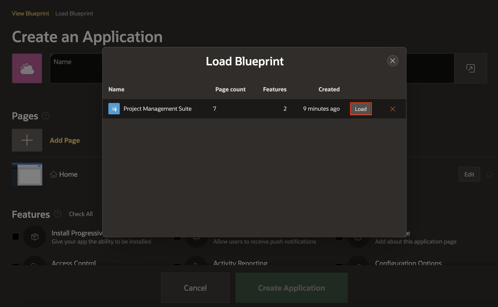
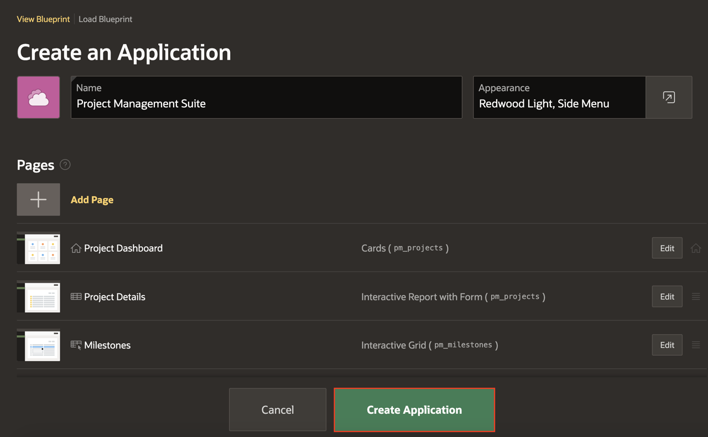
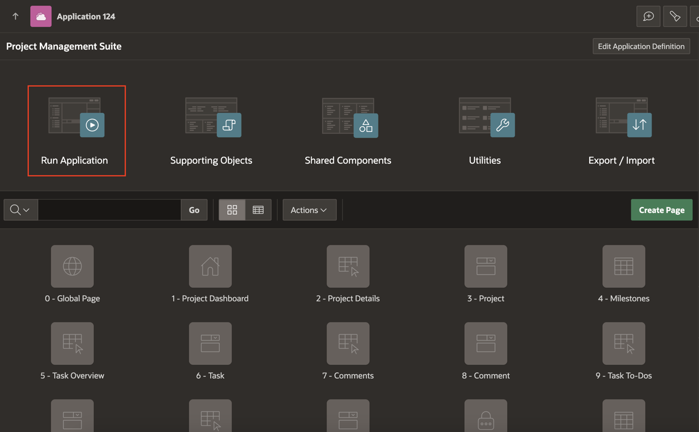
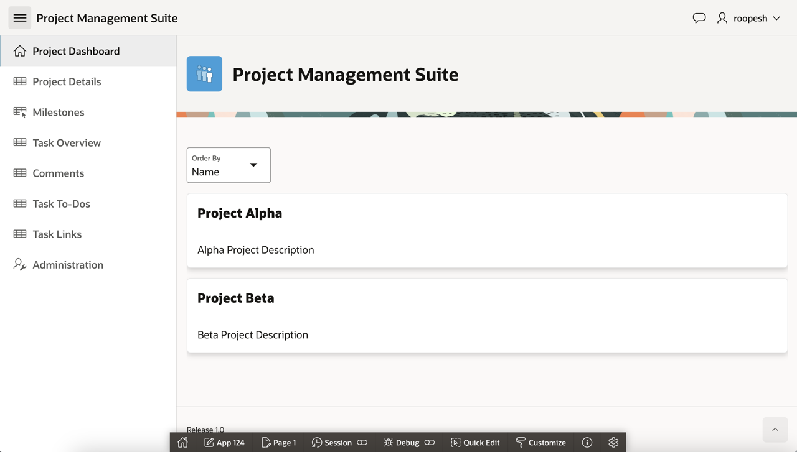

# Regenerate the Application

## Introduction

In this lab you will regenerate the application to create a better starting point for development.

Given that no additional development has been performed in the application, you just generated, it is quickest and easiest to delete the current application, and then regenerate a new application.

> **Note:** _If development had been performed in the application then you would lose any changes when you regenerate. To avoid this, you could use the Create Page Wizard to create a new Interactive Grid page, delete the existing report and form, and then modify the navigation lists to point to the new page_

Estimated Time: 5 minutes

### Objectives
- Regenerate the application using Blueprints

### What Do You Need?

- An Oracle Cloud paid account or free trial. To sign up for a trial account with $300 in credits for 30 days, click [here](http://oracle.com/cloud/free).
- An APEX application

## Task 1: Delete the Existing Application

It is important to remove the application you just generated to avoid the confusion of having two applications with the same name.

1. Navigate to any Page in the application.

    Given you ran this app from the APEX App Builder, a Developer Toolbar is displayed at the bottom of the screen.     
    > **Note:** _End users who log directly into the app will not see this toolbar_

    In the Developer Toolbar click **Application xxxxx**.

    

    Alternatively, you can also navigate back to the APEX App Builder tab in your browser manually by selecting the appropriate browser tab or window.

2. From the development environment, on the application home page, under Tasks in the right-hand panel, click **Delete Application**.

    

3. On the Confirm Delete page, click **Permanently Delete Now**

    

## Task 2: Load Blueprint
The Create Application Wizard allows developers to load previously generated application definitions, called _Blueprints_. Utilizing this capability, you can load the previous Projects application blueprint, modify the page for milestones and then regenerate the app.

1. From the App Builder home page, open the **App Builder** menu and then click **Create**.

    

2. On the Create an Application page, click **Use Create App Wizard**.

    

3. In the Create App Wizard, click **Load Blueprint**

    

4. For **Project Management Suite**, click **Load**

    

5. On the Create an Application Page, click **Create Application**.

    

## Task 4: Run the New Application

1. In Page Designer, click **Run Application**

    

2. Play around with the application and explore the different pages.

    

## **Summary**
You now know how to utilize the blueprint to load a previous application definition into the Create Application wizard.

## **Acknowledgments**
- **Author** - Salim Hlayel, Principle Product Manager; Roopesh Thokala, Senior Product Manager
- **Last Updated By/Date** - Roopesh Thokala, Senior Product Manager, January 2025
