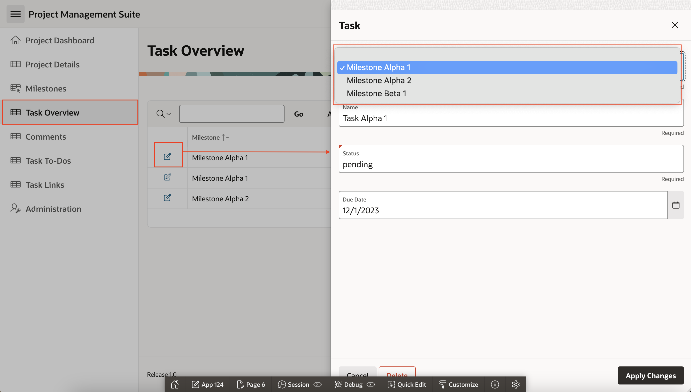
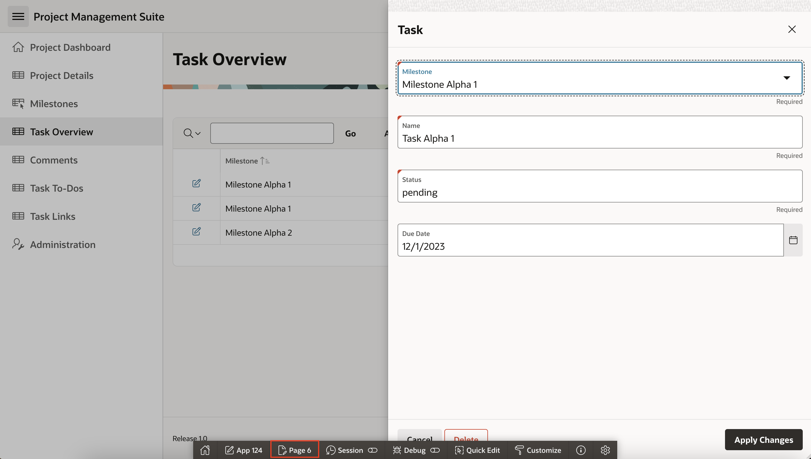
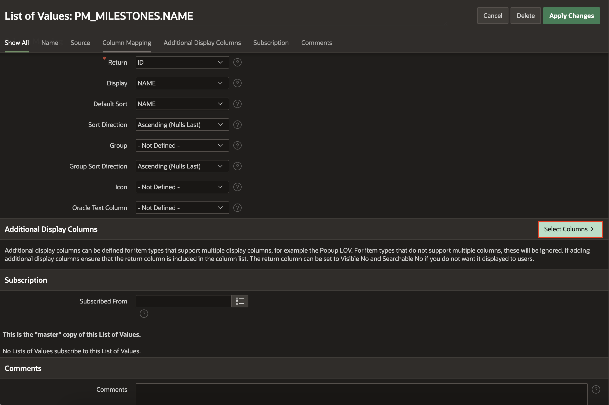
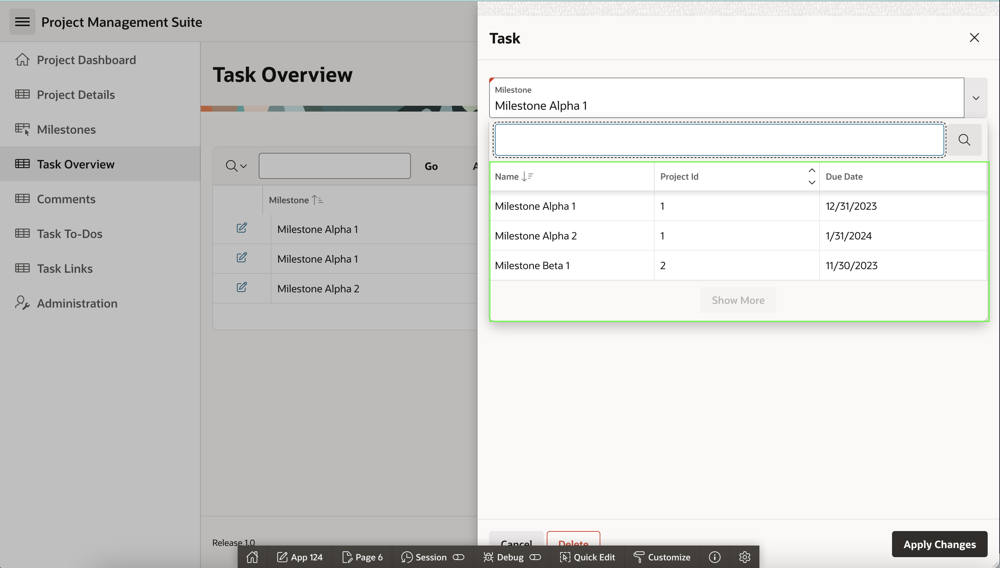
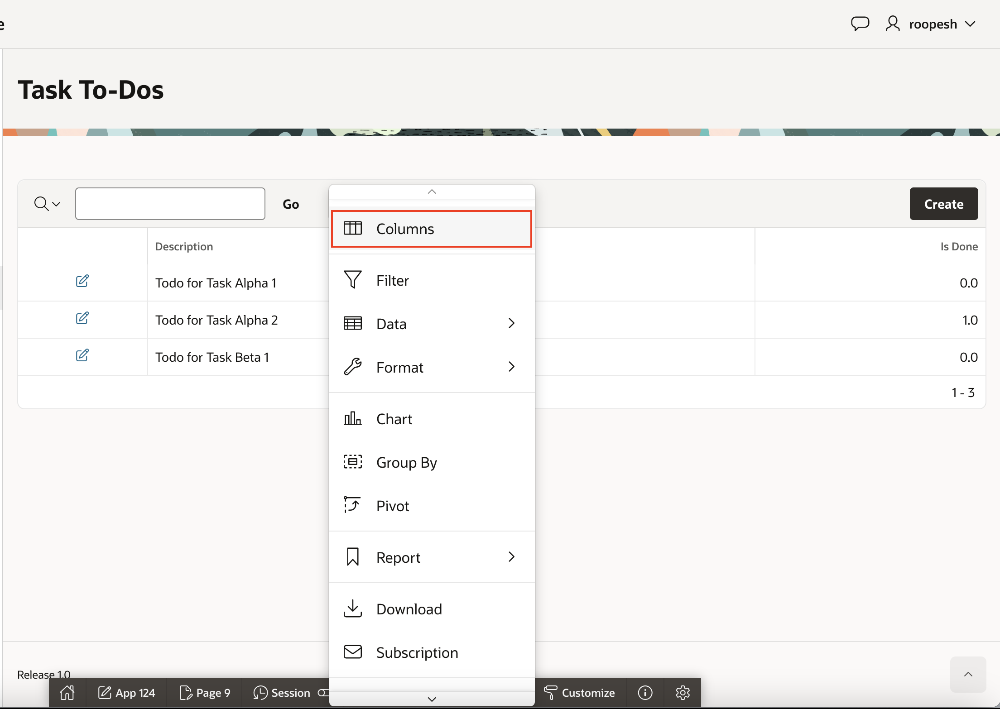
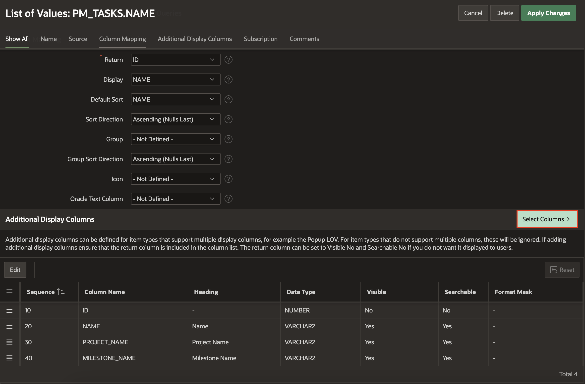
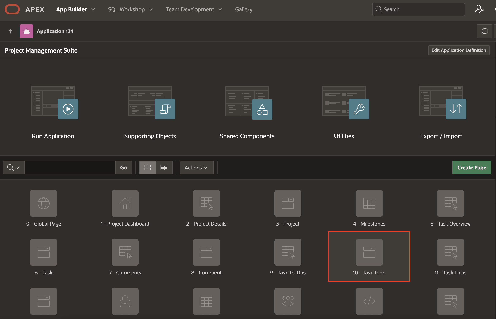
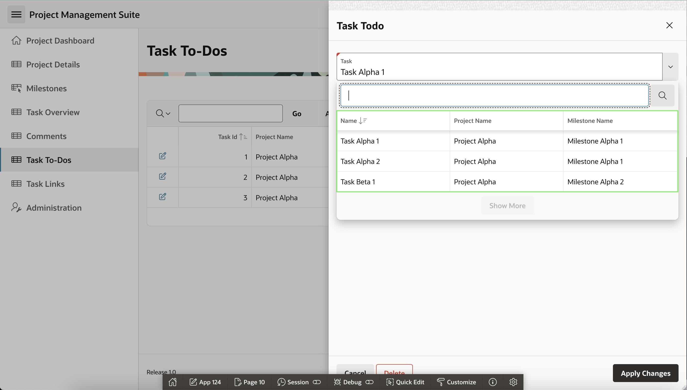

# Improve Tasks

## Introduction

In this lab, you will enhance the functionality of the Project Task and Project Task To-Dos form pages by implementing improved lists of values. Additionally, you will learn how to leverage **APEX Assistant** to efficiently generate SQL queries.

Estimated Time: 20 minutes

### Objectives
- Update the Task Form page
- Improve the Milestones and Task List of Values
- Use APEX Assistant in the code Editor
- Update the Application To Dos section

### What You will Need

- An Oracle Cloud paid account, a LiveLabs account or free trial.
- An APEX application

## Task 1: Improving the Milestones List of Values.
In the Runtime environment, navigate to Task Overview with Form page and then click the edit icon on any record to bring up the Task form page. Click the select list for Milestones to see how the Milestone records are displayed.

It would be beneficial to see additional details related to the milestone.

1. From the runtime application, navigate to the Task form page in Page Designer. Given you ran this app from the APEX App Builder, a Developer Toolbar is displayed at the bottom of the screen.
   > **Note:** _End users who log directly into the app will not see this toolbar_

2. In the Developer Toolbar, click  **Page X**.

    

    Alternatively, you can also navigate back to the APEX App Builder tab in your browser manually by selecting the appropriate browser tab or window.
    Once in the App Builder click **6 - Task**(Make sure that you select the Task Form page).

    

    You should now be in Page Designer with **Page 6: Task** loaded.

3. You need to review the current List of Values used for Milestones. Within Page Designer:
    - In the Rendering tree (left pane): Click **P6\_MILESTONE\_ID**.
    - In the Property Editor (right pane),
        - For Filter: **list**.
        - For **List of Values**: Click **Right Arrow**
  
    

    > **Note:** _Entering a filter makes it much easier to find specific attributes, rather than scrolling down through a long list_  
    > **Note:** The List of Values > Type is a **Shared Component** so you will need to edit the appropriate shared component

4. The left pane will change to the **Shared Components** tab, with the appropriate List of Values highlighted. In the Property Editor (right pane), click **Edit Component**.

    

5. Now to add some additional display columns. In the List of Values: PM_MILESTONES.NAME page, click **Select Columns**.

    

6. In the Select Additional Display Columns dialog, double-click the following columns and then click **Update**
    -   PROJECT_ID
    -   DUE_DATE

    

7. Click **Apply Changes**.

    

    > **Note:** _You will be returned to Page Designer with Page 6 selected_  

8. In order for the extra display values to be visible, you need to update the page item to be a Popup LOV, instead of a Select List.

9. Within Page Designer, in Layout (middle pane), click **P6\_MILESTONE\_ID**. In the Property Editor (right pane), for Identification > **Popup LOV**. Then, click **Save**.

    

    > **Note:** If you click _Run and Save_ instead of **Save** the page will be saved but a warning will be displayed as this page is a modal page and cannot be run directly from Page Designer

10. Time to review the improved Milestone item. Navigate to the runtime environment tab or browser. Navigate to **Task Overview** page and refresh the page.     

11. Click the edit icon for a Task and then click the down arrow on **Milestone** to review the new Popup LOV.

    

    > **Note:** _You can adjust the size of the columns and even sort the columns displayed in the Popup LOV_  

## Task 2: Adding Columns to the Report.

In the Runtime environment navigate to **Task To Dos** page and notice that the report includes the Task but not the associated Milestone. To retrieve these values in the report you need to utilize an SQL which ties in the Projects and Milestones tables. This can be done using inner selects or by joining multiple tables together. For simplicity you are going to implement inner select statements. And, you will generate this SQL query using APEX Assistant.

1. From the runtime application, navigate to the To Dos report page, and then navigate to Page Designer. In the Developer Toolbar click **Edit Page nn**.

    

    You should now be in Page Designer with **Page 9: Task-ToDos** loaded.

2. You need to update the query defined for To Dos. Within Page Designer, in the Rendering tree (left pane), click **Task Todos**. In the Property Editor (right pane),  
    - For Source: **SQL Query**.

    

> **Note:** _The SQL Query will be populated. The SQL statement selects all of the columns from the HOL\_TO\_DOS table_

1. In the property editor, under Source, click the **Code Editor** icon next to SQL Query.     

    

2. In the **Code Editor - SQL Query** wizard, click **APEX Assistant**.

    

3. To retrieve the Project name and Milestone Name from the respective tables, copy and paste the below prompt in your AI Assistant and click **Enter**.

    >Prompt:  
    >Write a query to fetch details from task todos, including project and milestone names, using subqueries to join projects, tasks, and milestones

    

5. Notice that APEX Assistant generated an SQL, if you wish to utilize it, select **Insert**.

    

6. In the Code Editor toolbar, click **Validate**. If the SQL is validated successfully, then click **OK**.

    

7. Run the application to ensure the new Project and Milestone columns display correctly. In the Page Designer toolbar, click **Save and Run**.

    

8. In the runtime environment, in the Tasks Todos report menu, click **Actions**. In the dropdown, select **Columns**.

    

9. In the Select Columns dialog, select **Project Name**, **Milestone Name**, and **Task ID** from the Left side or **Do Not Display** side and move them to **Display in Report**.   

    

10. In the Select Columns dialog, under **Display in Report**, rearrange the columns and move **Task ID**, **Project Name**, and **Milestone Name** to the top. Click **Apply**.

    

11. You need to save the revised report layout so others will see the new and improved column placement. In the runtime environment, in the To Dos report menu, click **Actions**. Then, in the dropdown, select **Report**, and then click **Save Report**.

    

12.  In the Save Report dialog, for Save (Only displayed for developers), select **As Default Report Settings**.

    

13. In the Save Default Report dialog, click **Apply**.     

    
    > **Note:** _You want to save the report as Primary so that it displayed as you see it now to end users when they navigate to the page_

## Task 3: Updating the Tasks LOV.
If you review the To Dos form page, by clicking an edit icon on the report, you will see that Project and Milestone are not on the form page either. To simplify data entry, you will change the Tasks select list to a Popup LOV and include the Project and Milestone.

This same LOV is used on the Links form page so we can reuse it there as well.

1. Within Page Designer, with Page 9 selected, in the Page Designer toolbar, click **Shared Components**.

    

    Alternatively, from the application home page, click **Shared Components**.

2. From Shared Components, under Other Components, click **List of Values**.

    

3. From the List of Values page, click **PM\_TASKS.NAME**.

    

4. Under Source, set the Source type as **SQL Query**. In the **SQL Query** wizard, click **APEX Assistant**.

    

5. To retrieve the Project name and Milestone Name from the respective tables, copy and paste the below prompt in your AI Assistant and click **Enter**.

    >Prompt:  
    >Write a query to fetch task IDs and names, along with associated project and milestone names, using subqueries to join the projects and milestones tables

    

6. Notice that APEX Assistant generated an SQL, if you wish to utilize it, select **Insert**. 

    

7. In the Code Editor toolbar, click **Validate**. If the query doesn't throw any errors, click **Apply Changes**.

    

8. Navigate to **PM\_TASKS.NAME** page from the List of Values page and then in the List of Values: PM\_TASKS.NAME page, enter the following:

    - Under Column Mapping,
        - Return: **ID**
        - Display: **NAME**
        - Default Sort: **NAME**

    

9. To display the extra columns, click **Select Columns**.

    

10. On the Select Additional Display Columns, performing the following actions and then click **Update**.
    - Move **PROJECT_NAME (Varchar2)** to the right pane             
    - Move **MILESTONE_NAME (Varchar2)** to the right pane   
    
    

    
> **Note:** The ID column must be included in the list, however, it will be marked as Visible = No so will not be displayed

11. In the List of Values toolbar, click **Apply Changes**.

    

12. On the Task Todo form page you will need to update the item type for Task. From Shared Components, within the breadcrumbs, click **Application xxxxx**.

    

13. From the application home page, in the list of pages, click **XX - Task Todo**.

    

14. Within Page Designer, in the Rendering tree (left pane), click **P10\_TASK_ID**. Then, in the Property Editor (right pane), 
    - Under Identification 
      - For Type: **Popup LOV**.
    - Click **Save**

       

15. Time to review the completed form page. Navigate to the runtime environment tab or browser.

    - Navigate to **Task Todo** and refresh the page.   

    - Click the edit icon for a To Do.

    - For Task, click the down arrow to display the Task Popup LOV.     

    - Enter in a search term and hit [Enter].

        

## **Summary**

You now know how to improve the Project Task and Project Task ToDos pages by utilizing improved list of values that displays additional columns. You also learned how to utilize **APEX Assistant** to generate SQL.

## **Acknowledgments**

- **Author** - Roopesh Thokala, Senior Product Manager
- **Contributors** - 
- **Last Updated By/Date** - Roopesh Thokala, Senior Product Manager, January 2025
