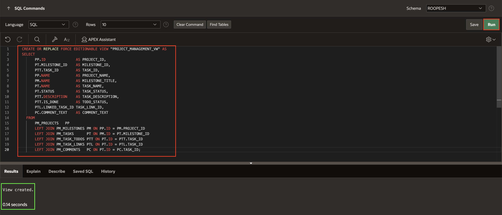
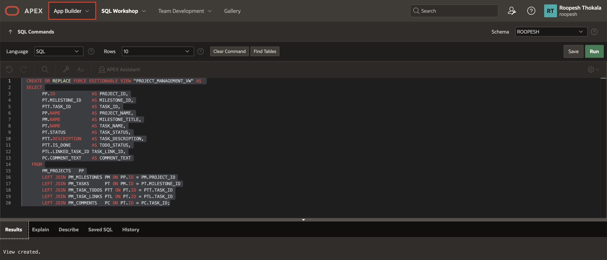
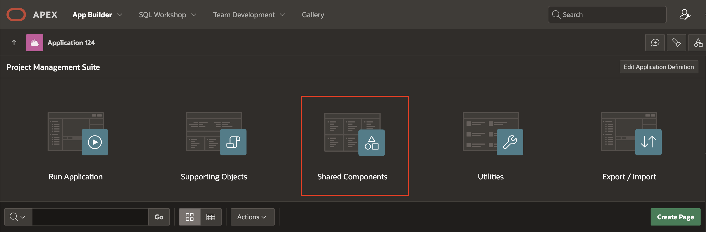
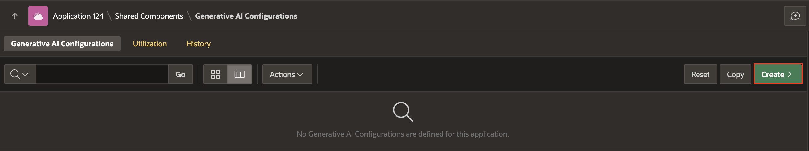
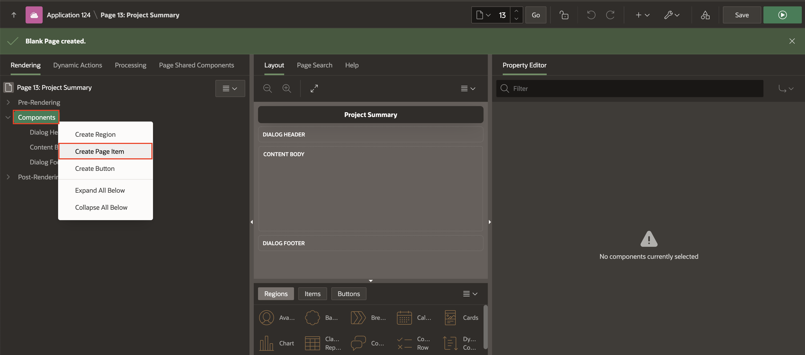
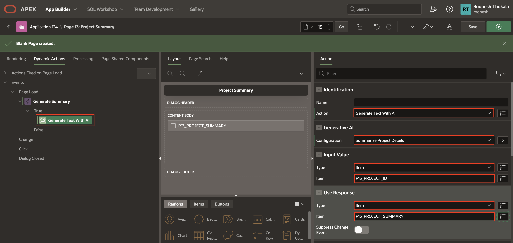
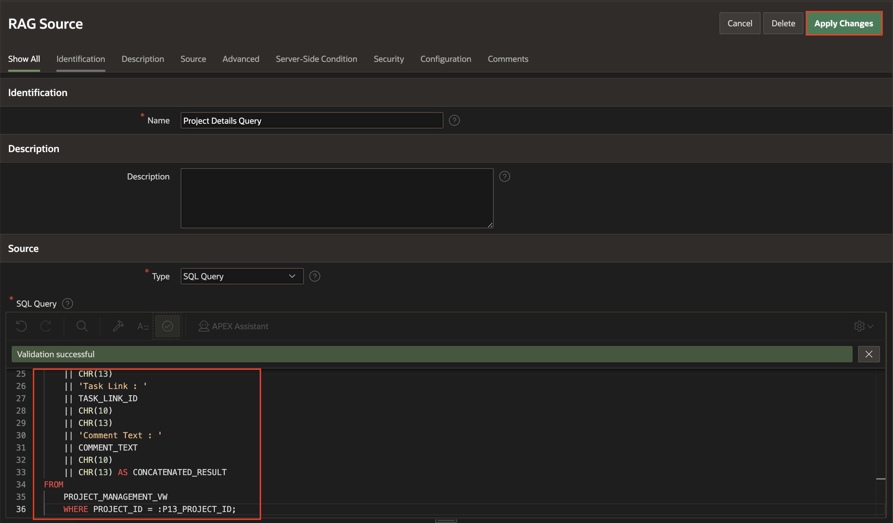
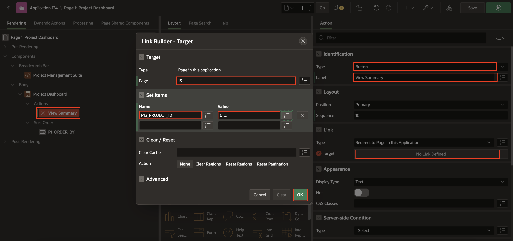
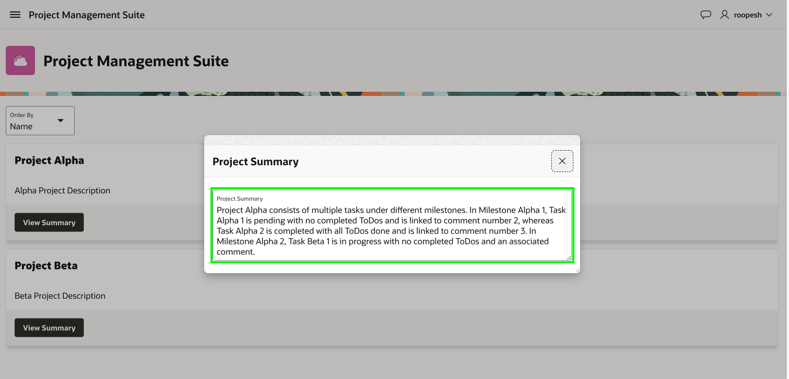

# Create an AI Chat Assistant

## Introduction

In this lab, you will learn to create a view and configure AI attributes to establish a strong foundation for AI-powered applications. You will then set up generative AI configurations and integrate RAG (Retrieval-Augmented Generation) sources to expand the AI's knowledge base. Finally, you will explore how to use AI to generate text for various projects, adding dynamic capabilities to your application.

Estimated Time: 15 minutes

### Objectives
- Create a view
- Configure AI Attributes
- Create AI Configurations and include RAG Sources
- Improve the Project Dashboard page and link it to the AI Chat Page.

## Task 1: Create a View in Database and configure AI Attributes

In this lab, you will create a Database View for your APEX application, containing all the necessary project-related information. This view will be used when adding RAG Sources to AI Configurations. Next, you will go to the AI Attributes page and set the Generative AI Service name to the one configured in **Lab 1**.

1. From your APEX workspace homepage, click the Down Arrow next to **SQL Workshop** and select **SQL Commands**.

    

2. In the SQL Commands Page, copy and paste the below code and click **Run**.

    ```
    <copy>
      CREATE OR REPLACE FORCE EDITIONABLE VIEW "PROJECT_MANAGEMENT_VW" AS 
        SELECT
                PP.ID              AS PROJECT_ID,
                PT.MILESTONE_ID    AS MILESTONE_ID,
                PTT.TASK_ID        AS TASK_ID,
                PP.NAME            AS PROJECT_NAME,
                PM.NAME            AS MILESTONE_TITLE,
                PT.NAME            AS TASK_NAME,
                PT.STATUS          AS TASK_STATUS,
                PTT.DESCRIPTION    AS TASK_DESCRIPTION,
                PTT.IS_DONE        AS TODO_STATUS,
                PTL.LINKED_TASK_ID TASK_LINK_ID,
                PC.COMMENT_TEXT    AS COMMENT_TEXT
            FROM
                PM_PROJECTS   PP
                LEFT JOIN PM_MILESTONES PM ON PP.ID = PM.PROJECT_ID
                LEFT JOIN PM_TASKS      PT ON PM.ID = PT.MILESTONE_ID
                LEFT JOIN PM_TASK_TODOS PTT ON PT.ID = PTT.TASK_ID
                LEFT JOIN PM_TASK_LINKS PTL ON PT.ID = PTL.TASK_ID
                LEFT JOIN PM_COMMENTS   PC ON PT.ID = PC.TASK_ID;
    </copy>
    ```
    

    >**Note: The table structure and column names in your generated data model may vary. Adjust the code accordingly to match your specific table structure.

3. Click **App Builder**.

    

4. In the **App Builder** page, select your Application and then click **Shared Components**.

    

    

5. From Shared Components, under **Generative AI**, click **AI Attributes**.

    

6. Now, in the AI Attributes page:
   - Under Generative AI
     - For Source:  **Open AI**
   - Click **Apply Changes**
  
    

## Task 2: Create AI Configuration and RAG Sources

In this task, you will set up an AI configuration and then add a RAG source to it.

1. Within AI Attributes Page, click **Shared Components**.

    

2. From Shared Components, under **Generative AI**, click **AI Configurations**.

    

3. In the Generative AI Configurations page, click **Create**.

    

4. In the Generative AI Configuration page, enter the following:

    - Under Identification,
        - Name : **Summarize Project Details**
    - Under Generative AI
        - For System Prompt: **Analyze the provided information and generate a concise summary in a single paragraph.**
    - Click **Create**.

    

5. In the newly created Generative AI Configuration, click **RAG Sources** tab. Then, click **Create RAG Source**.

    

6. In the RAG Source Page, enter the following:
    - Under Identification, for Name: **Project Details Query**.
    - Under Source,
            - For Type: **SQL Query**
            - For SQL Query: Copy and paste the below SQL Query
                ```
                <copy>
                SELECT
                    'Project Name : '
                    || PROJECT_NAME
                    || CHR(10)
                    || CHR(13)
                    || 'Milestone Title : '
                    || MILESTONE_TITLE
                    || CHR(10)
                    || CHR(13)
                    || 'Task Name : '
                    || TASK_NAME
                    || CHR(10)
                    || CHR(13)
                    || 'Task Status : '
                    || TASK_STATUS
                    || CHR(10)
                    || CHR(13)
                    || 'ToDo Title : '
                    || TASK_DESCRIPTION
                    || CHR(10)
                    || CHR(13)
                    || 'ToDo Completed : '
                    || TODO_STATUS
                    || CHR(10)
                    || CHR(13)
                    || 'Task Link : '
                    || TASK_LINK_ID
                    || CHR(10)
                    || CHR(13)
                    || 'Comment Text : '
                    || COMMENT_TEXT
                    || CHR(10)
                    || CHR(13) AS CONCATENATED_RESULT
                FROM
                    PROJECT_MANAGEMENT_VW
                </copy>
                ```
    - Click **Create**
    
      

7. Click **Apply Changes**.

    

>**Note**: The SQL query may vary depending on the data model created in the first step. Ensure your query is error-free and retrieves all necessary details from the Project Management View. Also, we will change this SQL Query and append a Where class in the next steps.

## Task 3: Create a  new Page and add Generate Text with AI dynamic action

1. From your AI Configurations Page, click **App xxx**.

    

2. Click **Create Page**.

    

3.  Select **Blank Page**.

    

4. Enter the following and click **Next**.
    - Under Page Definition
        - Name: **Project Summary**
        - Page Mode: **Modal Dialog**
    - Click **Create Page**.
  
      

    > **Note:** _Note the newly created page number. You will be using this page number in the upcoming steps. In this case my Page Number is 13_  

5. Navigate to the newly created page and add two hidden items to store the project ID and project summary.

6. In the Rendering tree (left pane), right-click on components and click **Create Page Item**.

    

7. In the property editor, set the name and type as follows:

    | Name |  Type  |
    | --- |  --- |
    | P13\_PROJECT\_ID | Hidden |

        

8. Similarly, create another item to capture Project Summary with the details mentioned below.

    | Name |  Type  |
    | --- |  --- |
    | P13\_PROJECT\_SUMMARY | Textarea |

        

9. In the left pane, navigate to **Dynamic Actions** tab. Then, right-click **Page Load** and click **Create Dynamic Action**.

        

10. In the Property Editor, enter the following:

    - Under Identification, for Name: **Generate Summary**

      

11. Under **True** Action, click **Show**.

12. In the Property Editor, enter the following:

    - Under Identification:
        - Action: **Generate Text with AI**

    - Under Generative AI:
        - Configuration: **Summarize Project Details**

    - Under Input Value:
        - Type: **Item**
        - Item: **P13\_PROJECT\_ID**
  
    - Under Use Response:
        - Type: **Item**
        - Item: **P13\_PROJECT\_SUMMARY**
    - Click **Save**.

    

## Task 4: Update the SQL query for RAG Source in AI Configurations.

In this task, you will modify the AI Configuration created earlier in the lab by adding a Where clause to the existing query in the RAG Sources.

1. Within Page Designer, with Page 13 selected, in the Page Designer toolbar, click **Shared Components**.

    

    Alternatively, from the application home page, click **Shared Components**.

2. From Shared Components, under **Generative AI**, click **AI Configurations**.

    

3. Select the Previously created AI Configuration. Click **Summarize Project Details**.

    

4. In the Generative AI Configurations page, Under Rag Sources tab, click **Project Details Query**.

    

5. You will not add a where clause to the existing SQL Query. Under Source, for SQL Query, append the below where clause. Then, click **Apply Changes**.

    ```
    <copy>
        WHERE PROJECT_ID = :P13\_PROJECT\_ID;
    </copy>
    ```

    **Full Query**:
    ```
    <copy>
        SELECT
            'Project Name : '
            || PROJECT_NAME
            || CHR(10)
            || CHR(13)
            || 'Milestone Title : '
            || MILESTONE_TITLE
            || CHR(10)
            || CHR(13)
            || 'Task Name : '
            || TASK_NAME
            || CHR(10)
            || CHR(13)
            || 'Task Status : '
            || TASK_STATUS
            || CHR(10)
            || CHR(13)
            || 'ToDo Title : '
            || TASK_DESCRIPTION
            || CHR(10)
            || CHR(13)
            || 'ToDo Completed : '
            || TODO_STATUS
            || CHR(10)
            || CHR(13)
            || 'Task Link : '
            || TASK_LINK_ID
            || CHR(10)
            || CHR(13)
            || 'Comment Text : '
            || COMMENT_TEXT
            || CHR(10)
            || CHR(13) AS CONCATENATED_RESULT
        FROM
            PROJECT_MANAGEMENT_VW
        WHERE PROJECT_ID = :P13_PROJECT_ID;
    </copy>
    ```
    

    >**Note**: The page item P13_PROJECT_ID may vary depending on the page number created in Task 3 of this lab. Ensure that the page number in the item aligns with the page number you used.

## Task 5: Configure the Project Dashboard page

1. In the Page Designer toolbar, select **Application xxx**.

    

2. From the application home page, in the list of pages, click **1 - Project Dashboard**.

    

3. On the Rendering tree(left pane), Under Project Dashboard region, right-click on Actions and click **Create Action**.

    

4. In the Property Editor, enter the following and click **Ok**:

    - Under Identification:
        - Type: **Button**
        - Label: **View Summary**

    - Under Link > Target: Click **No Link Defined** and configure the following:
        - Target > Page: **13**
        - Under Set Items:
            - Page: P13\_PROJECT\_ID
            - Value: &ID.
        - Under Appearance:
            - Hot: **Toggle On**

    

## Task 6: Run the New Application

1. In Page Designer, click **Run Application**

    

2. In the runtime environment, click **View Summary** on any Card.

    

3. In the pop up, note that you can see the summary of the Project.

    


## **Summary**

You know now how to create a view, configure AI attributes, and set up generative AI configurations to build a foundation for AI-powered applications. You also integrated RAG sources to enhance the AI's knowledge and explored text generation features to add dynamic capabilities to your projects.

## **Learn More** - *Useful Links*

- APEX on Autonomous:   [https://apex.oracle.com/autonomous](https://apex.oracle.com/autonomous)
- APEX Collateral:   [https://apex.oracle.com](https://apex.oracle.com)
- Tutorials:   [https://apex.oracle.com/en/learn/tutorials](https://apex.oracle.com/en/learn/tutorials)
- Community:  [https://apex.oracle.com/community](https://apex.oracle.com/community)
- External Site + Slack:   [http://apex.world](http://apex.world)

## **Acknowledgments**

- **Author** - Roopesh Thokala, Senior Product Manager
- **Last Updated By/Date** - Roopesh Thokala, Senior Product Manager, January 2025
