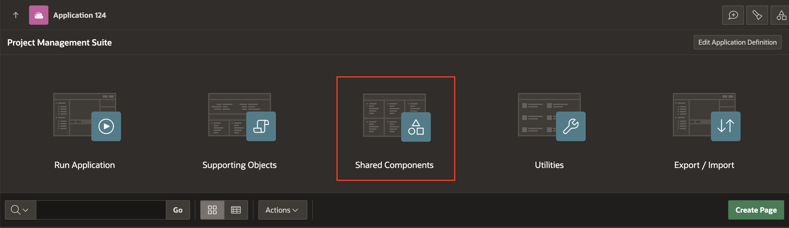
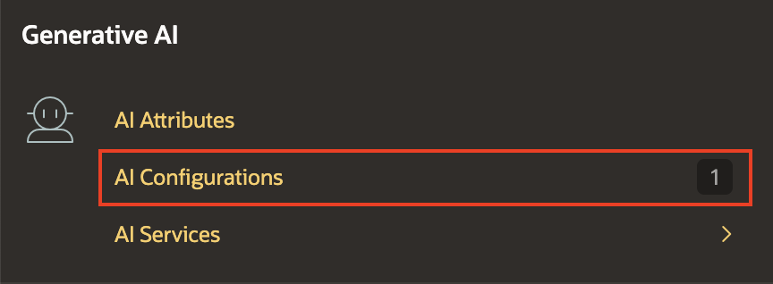
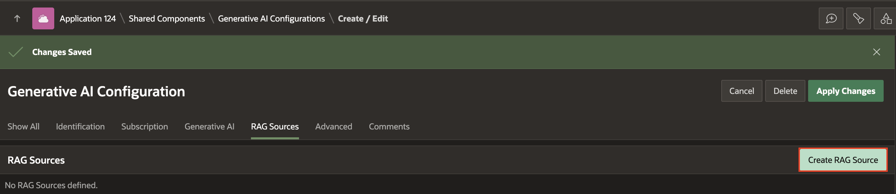
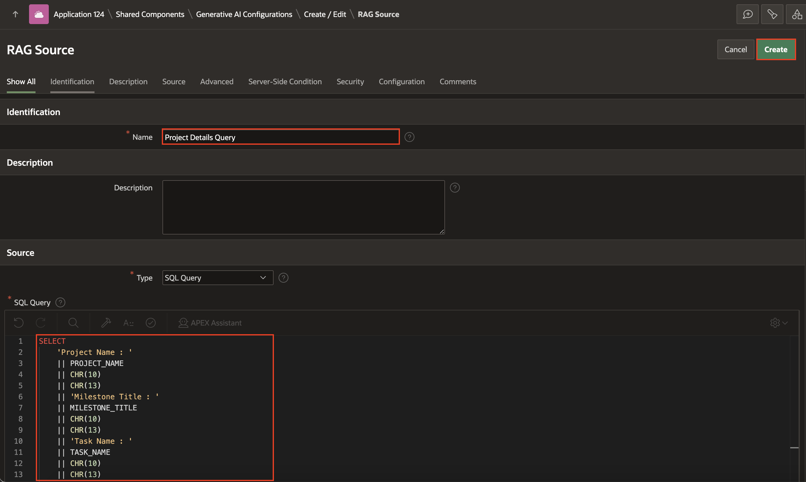
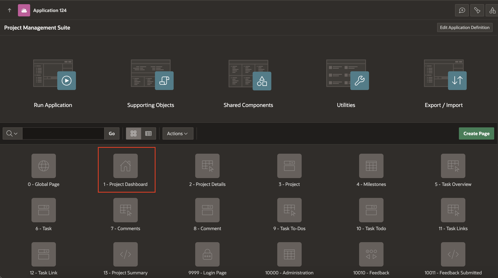
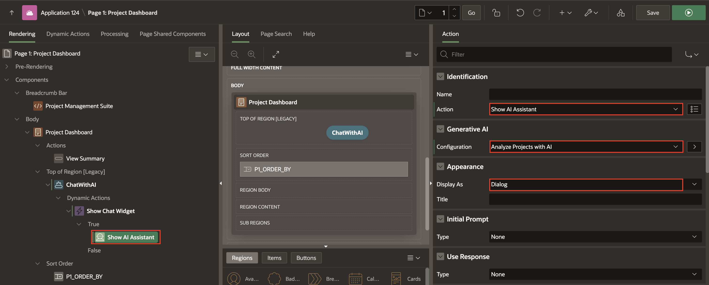
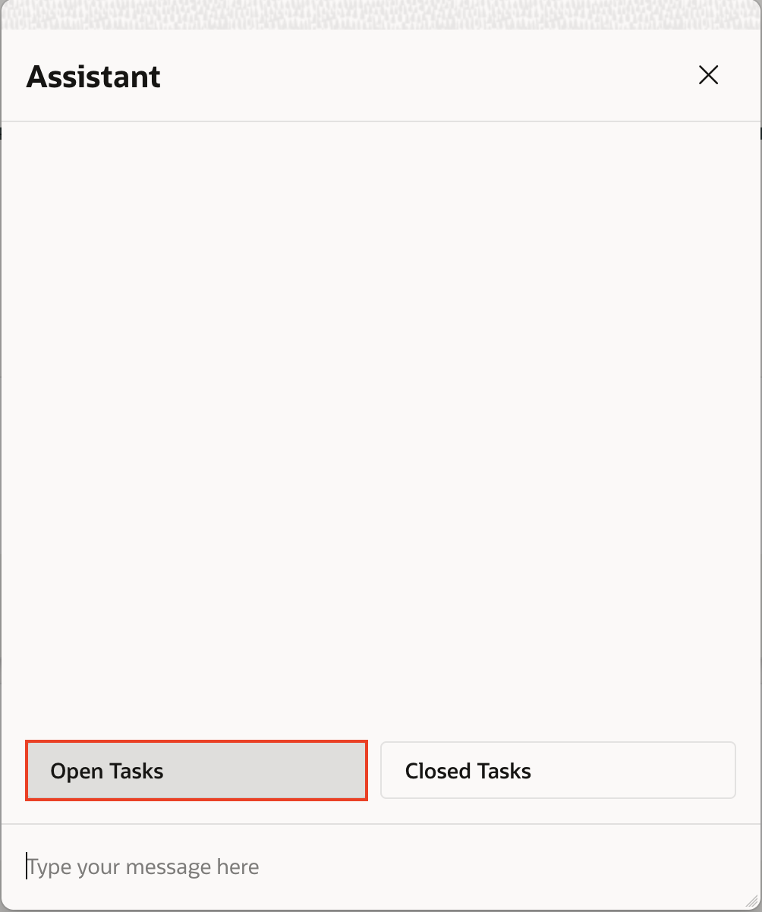

# Create an AI Chat Assistant

## Introduction

In this lab, you will use the Show AI Assistant dynamic action to build a chatbot that offers an interactive experience for users. The chatbot will allow users to inquire about project details, providing a seamless way to access information.

Estimated Time: 15 minutes

### Objectives
- Create a view
- Create AI Configurations
- Add RAG Sources
- Improve the Project Dashboard page and link it to the AI Chat Page.


## Task 1: Create AI Configuration and RAG Sources

In this task, you will set up an AI configuration and then add a RAG source to it.

1. Navigate to  **Shared Components** page.

    

2. From Shared Components, under **Generative AI**, click **AI Configurations**.

    

3. In the Generative AI Configurations page, click **Create**.

    

4. In the Generative AI Configuration page, enter the following:

    - Under Identification,
        - Name : **Analyze Projects with AI**
    - Under Generative AI
        - For System Prompt: **If the question cannot be answered using the provided information, respond with "Information Not Found."**
    - Click **Create**.

    

5. In the newly created Generative AI Configuration, click **RAG Sources** tab. Then, click **Create RAG Source**.

    

6. In the RAG Source Page, enter the following:
    - Under Identification, for Name: **Project Details Query**.
    - Under Source,
        - For Type: **SQL Query**
        - For SQL Query: Copy and paste the below SQL Query
            ```
            <copy>
                SELECT
                    'Project Name : '
                    || PROJECT_NAME
                    || CHR(10)
                    || CHR(13)
                    || 'Milestone Title : '
                    || MILESTONE_TITLE
                    || CHR(10)
                    || CHR(13)
                    || 'Task Name : '
                    || TASK_NAME
                    || CHR(10)
                    || CHR(13)
                    || 'Task Status : '
                    || TASK_STATUS
                    || CHR(10)
                    || CHR(13)
                    || 'ToDo Title : '
                    || TASK_DESCRIPTION
                    || CHR(10)
                    || CHR(13)
                    || 'ToDo Completed : '
                    || TODO_STATUS
                    || CHR(10)
                    || CHR(13)
                    || 'Task Link : '
                    || TASK_LINK_ID
                    || CHR(10)
                    || CHR(13)
                    || 'Comment Text : '
                    || COMMENT_TEXT
                    || CHR(10)
                    || CHR(13) AS CONCATENATED_RESULT
                FROM
                    PROJECT_MANAGEMENT_VW
            </copy>
            ```
    - Click **Create**

    

7. Click **Apply Changes**.

    

>**Note**: The SQL query may vary depending on the data model created in the first step. Ensure your query is error-free and retrieves all necessary details from the Project Management View. Also, we will change this SQL Query and append a Where class in the next steps.

## Task 2: Create a  new Page and add Generate Text with AI dynamic action

1. From your AI Configurations Page, click **App xxx**.

    

2. From the application home page, in the list of pages, click **1 - Project Dashboard**.

    

3. On the Rendering tree(left pane), right-click on Project Dashboard and click **Create Button**.

    

4. In the Property Editor, enter the following:

    - Under Identification:
        - Button Name: **ChatwithAI**
        - Label: **Chat with AI**

    - Under Layout:
        - Slot: **Top of Region**
        - Horizontal Alignment: Select Right

    

5. Right click on the newly created button and then click **Create Dynamic Action**.

    

6.  In the Property Editor, enter the following:

    - Under Identification, for Name: **Show Chat Widget**

      

7.  Under **True** Action, click **Show**.

8.  In the Property Editor, enter the following:

    - Under Identification:
        - Action: **Show AI Assistant**

    - Under Generative AI:
        - Configuration: **Analyze Projects with AI**

    - Under Appearance:
        - Display As: **Dialog**

    - Under Quick Actions:
        - Message 1: **Open Tasks**
        - Message 2: **Closed Tasks**
  
    - Click **Save and Run**.

    

    

## Task 3: Run the New Application

1. In Page Designer, click **Run Application**

2. In the runtime environment, click **Chat with AI** button.

    

3. Play around with the Chat Assistant and ask any question related to the selected project.

    
    

## **Summary**

In this lab, you created an interactive chatbot using the Show AI Assistant feature. This chatbot enables users to easily inquire about project details, enhancing the user experience with quick and accessible information.

## **Learn More** - *Useful Links*

- APEX on Autonomous:   [https://apex.oracle.com/autonomous](https://apex.oracle.com/autonomous)
- APEX Collateral:   [https://apex.oracle.com](https://apex.oracle.com)
- Tutorials:   [https://apex.oracle.com/en/learn/tutorials](https://apex.oracle.com/en/learn/tutorials)
- Community:  [https://apex.oracle.com/community](https://apex.oracle.com/community)
- External Site + Slack:   [http://apex.world](http://apex.world)

## **Acknowledgments**

- **Author** - Roopesh Thokala, Senior Product Manager
- **Last Updated By/Date** - Roopesh Thokala, Senior Product Manager, January 2025
