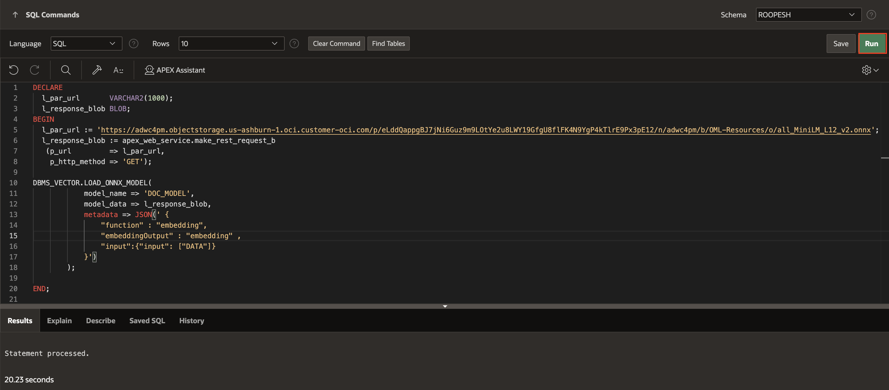
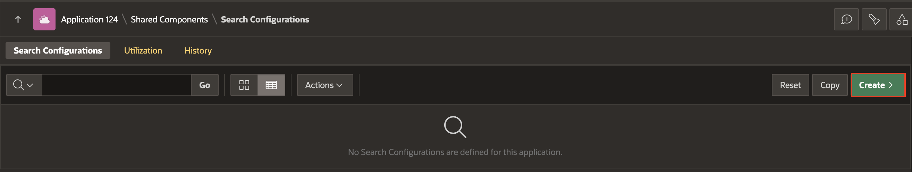
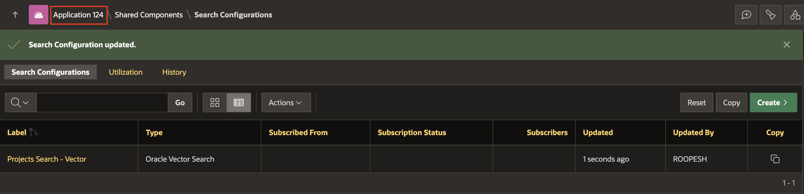

# Create an AI Chat Assistant

## Introduction

In this lab, you will learn how to load ONNX models into Oracle Database and create a Vector Provider to generate vector embeddings. You will then create Search Configuration based on Oracle Vector Search to build an efficient search system. Finally, you will create a search page that utilizes these search configurations for powerful and accurate search functionality.

>**Note**: This lab assumes you are using Oracle Database 23ai.

Estimated Time: 15 minutes

### Objectives
- Load ONNX Models
- Create a Vector Provider
- Generate Vector Embeddings
- Create Search Configuration based on Oracle Vector Search
- Create a Search Page

## Task 1: Load ONNX Model to Oracle Database

In this lab, you will create a Database View for your APEX application, containing all the necessary project-related information. This view will be used when adding RAG Sources to AI Configurations. Next, you will go to the AI Attributes page and set the Generative AI Service name to the one configured in **Lab 1**.

Before uploading the ONNX model to your database schema, you must grant the schema the privilege to create mining models while logged in as SYS/ADMIN.

Login as SYS/Admin User and execute the below command.

>**Command**: GRANT create mining model TO **YourSchemaName**;  


1. From your APEX workspace homepage, click the Down Arrow next to **SQL Workshop** and select **SQL Commands**.

    

2. In the SQL Commands Page, copy and paste the below code and click **Run**.

    ```
    <copy>
        DECLARE
        L_PAR_URL       VARCHAR2(1000);
        L_RESPONSE_BLOB BLOB;
        BEGIN
            L_PAR_URL := 'https://adwc4pm.objectstorage.us-ashburn-1.oci.customer-oci.com/p/eLddQappgBJ7jNi6Guz9m9LOtYe2u8LWY19GfgU8flFK4N9YgP4kTlrE9Px3pE12/n/adwc4pm/b/OML-Resources/o/all_MiniLM_L12_v2.onnx'
            ;
            L_RESPONSE_BLOB := APEX_WEB_SERVICE.MAKE_REST_REQUEST_B(
                P_URL         => L_PAR_URL,
                P_HTTP_METHOD => 'GET'
            );
            DBMS_VECTOR.LOAD_ONNX_MODEL(
                MODEL_NAME => 'DOC_MODEL',
                MODEL_DATA => L_RESPONSE_BLOB,
                METADATA   =>
                        JSON(
                            ' {
                        "function" : "embedding",
                        "embeddingOutput" : "embedding" ,
                        "input":{"input": ["DATA"]}
                    }'
                        )
            );

        END;
    </copy>
    ```
    

## Task 2: Create Vector Provider from Workspace Utilities

In this task, you will create a Vector Provider that will be used later to set up a Search Configuration.

1. From your SQL Commands page, click the Down Arrow next to **App Builder** and select **Workspace Utilities**. Then click **All Workspace Utilities**.

    

2. In the Workspace Utilities page, select **Vector Providers**.

    

3. In the Vector Providers page, click **Create**.

    

4. In the Vector Provider Configuration page, enter the following:

    - Under Identification,
        - Provider Type : **Database ONNX Model**
        - Name: **DB ONNX Model**
        - Static ID: **db\_onnx\_model**
    - Under Local Embedding
        - For ONNX Model Owner: **Select your Parsing Schema**
        - ONNX Model Name: **DOC_MODEL**
    - Click **Create**.

    

5. Your Vector Provider is now created.

    

## Task 3: Create Table and Update View for Vector Embeddings in Project Data

In this task, you will enhance the view created in the previous lab to convert project-related data into vector embeddings. Starting with APEX 24.2, the new PL/SQL API **APEX_AI.GET\_VECTOR\_EMBEDDINGS** streamlines this process. You will utilize the **APEX_AI.GET\_VECTOR\_EMBEDDINGS** API to insert a Vector Embeddings Table in your schema and then modify the view to retrieve these vector embeddings.

1. From your Vector Provider page, click the Down Arrow next to **SQL Workshop** and select **SQL Scripts**.

    

2. Click **Create**.

    

3. Copy and paste the below SQL commands into the Script Editor to create VECTOR\_EMBEDDINGS Table and insert Data into it and then update the Existing View.

    ```
    <copy>
        CREATE TABLE VECTOR_EMBEDDINGS (
        PROJECT_ID       NUMBER,
        MILESTONE_ID     NUMBER,
        TASK_ID          NUMBER,
        VECTOR_EMBEDDING VECTOR
        );

        /

       INSERT INTO VECTOR_EMBEDDINGS (
        PROJECT_ID,
        MILESTONE_ID,
        TASK_ID,
        VECTOR_EMBEDDING
        )
           SELECT
            PP.ID           AS PROJECT_ID,
            PT.MILESTONE_ID AS MILESTONE_ID,
            PTT.TASK_ID     AS TASK_ID,
            APEX_AI.GET_VECTOR_EMBEDDINGS(
                P_VALUE             => PP.NAME
                        || CHR(13)
                        || PM.NAME
                        || CHR(13)
                        || PT.NAME
                        || CHR(13)
                        || PT.STATUS
                        || CHR(13)
                        || PTT.DESCRIPTION
                        || CHR(13)
                        || PTT.IS_DONE
                        || CHR(13)
                        || PTL.LINKED_TASK_ID
                        || CHR(13)
                        || PC.COMMENT_TEXT
                        || CHR(13),
                P_SERVICE_STATIC_ID => 'db_onnx_model'
            )               AS VECTOR_EMBEDDING
        FROM
            PM_PROJECTS   PP
            LEFT JOIN PM_MILESTONES PM ON PP.ID = PM.PROJECT_ID
            LEFT JOIN PM_TASKS      PT ON PM.ID = PT.MILESTONE_ID
            LEFT JOIN PM_TASK_TODOS PTT ON PT.ID = PTT.TASK_ID
            LEFT JOIN PM_TASK_LINKS PTL ON PT.ID = PTL.TASK_ID
            LEFT JOIN PM_COMMENTS   PC ON PT.ID = PC.TASK_ID;

    /

    CREATE OR REPLACE FORCE EDITIONABLE VIEW "PROJECT_MANAGEMENT_VW" (
    "PROJECT_ID",
    "MILESTONE_ID",
    "TASK_ID",
    "PROJECT_NAME",
    "MILESTONE_TITLE",
    "TASK_NAME",
    "TASK_STATUS",
    "TASK_DESCRIPTION",
    "TODO_STATUS",
    "TASK_LINK_ID",
    "COMMENT_TEXT",
    "VECTOR_EMBEDDING"
    ) AS
    SELECT
        PP.ID               AS PROJECT_ID,
        PT.MILESTONE_ID     AS MILESTONE_ID,
        PTT.TASK_ID         AS TASK_ID,
        PP.NAME             AS PROJECT_NAME,
        PM.NAME             AS MILESTONE_TITLE,
        PT.NAME             AS TASK_NAME,
        PT.STATUS           AS TASK_STATUS,
        PTT.DESCRIPTION     AS TASK_DESCRIPTION,
        PTT.IS_DONE         AS TODO_STATUS,
        PTL.LINKED_TASK_ID  AS TASK_LINK_ID,
        PC.COMMENT_TEXT     AS COMMENT_TEXT,
        VE.VECTOR_EMBEDDING AS VECTOR_EMBEDDING
    FROM
        PM_PROJECTS       PP
        LEFT JOIN PM_MILESTONES     PM ON PP.ID = PM.PROJECT_ID
        LEFT JOIN PM_TASKS          PT ON PM.ID = PT.MILESTONE_ID
        LEFT JOIN PM_TASK_TODOS     PTT ON PT.ID = PTT.TASK_ID
        LEFT JOIN PM_TASK_LINKS     PTL ON PT.ID = PTL.TASK_ID
        LEFT JOIN PM_COMMENTS       PC ON PT.ID = PC.TASK_ID
        LEFT JOIN VECTOR_EMBEDDINGS VE ON VE.PROJECT_ID = PP.ID
                                          AND NVL(VE.MILESTONE_ID, 0) = NVL(PT.MILESTONE_ID, 0)
                                          AND NVL(VE.TASK_ID, 0) = NVL(PTT.TASK_ID, 0);
    </copy>
    ```

>**Note**: The table structure and column names in your generated data model may vary. Adjust the code accordingly to match your specific table structure.

4. For Script Name: Enter **Vector Embedding Objects** and click Run.

    

5. Click **Run Now**. The statements are processed.

    

    

## Task 4: Create a Search Configuration

In this task, you will set up a Search Configuration based on Oracle Vector Search.

1. From the Navigation bar in your workspace, click **App Builder**.

    

2. In the **App Builder** page, select your Application and then click **Shared Components**.

    

    

3. From Shared Components, under **Navigation and Search**, click **Search Configurations**.

    

4. In the Search Configurations page, click **Create**.

    

5. In the Create Search Configuration Detail Wizard, enter the following and click **Next**.
    - For Name : **Projects Search - Vector**
    - Search Type: **Oracle Vector Search**

    

6. In the Create Search Configuration **Source** Wizard, enter the following and click **Next**.
    - Vector Provider : **DB ONNX Model**
    - Source Type: **Table**
    - Table/View Owner: **Select your Parsing Schema**
    - Table/View Name: **PROJECT\_MANAGEMENT\_VW**

    

7. In the Create Search Configuration **Column Mapping** Wizard, enter the following and click **Create Search Configuration**.
    - Primary Key Column Column 2 : **MILESTONE_ID(Number)**
    - Vector Column: **VECTOR_EMBEDDING(Vector)**
    - Title Column: **PROJECT_NAME(Varchar2)**
    - Description Column: **TASK_DESCRIPTION(Varchar2)**

    

6. In the newly created Search Configuration, navigate to  **Column Mapping** tab. Under Column Mapping:
   - For Primary Key Column2: **MILESTONE_ID(Number)** 
   - Subtitle Column: **MILESTONE_TITLE(Varchar2)**

   - Click **Apply Changes**

    

## Task 5: Create an Oracle Vector Search Page.

In this task, you will create a Vector Search Page to search across your Projects.

1. From your Search Configurations Page, click **App xxx**.

    

2. Click **Create Page**.

    

3.  Select **Search Page**.

    

4. Under Create Search Page wizard, enter the following and click **Create Page**.

  - Under Page Definition:
    - Name: **Project Search**
  - Under **Search Configurations**:
    - For Projects Search - Vector: Set checkbox to **Yes**
  - Under Navigation:
    - Use Breadcrumb: **Disable**

    

## Task 6: Run the New Vector Search Page

1. In Page Designer of the newly created page, click **Run Application**

    

2. Play around with the Search Page.

    


## **Summary**

In this lab, you loaded ONNX models into Oracle Database, created a Vector Provider, and generated vector embeddings. You then configured Oracle Vector Search for enhanced search capabilities and built a search page to leverage these embeddings for efficient and accurate search results.

## **Learn More** - *Useful Links*

- APEX on Autonomous:   [https://apex.oracle.com/autonomous](https://apex.oracle.com/autonomous)
- APEX Collateral:   [https://apex.oracle.com](https://apex.oracle.com)
- Tutorials:   [https://apex.oracle.com/en/learn/tutorials](https://apex.oracle.com/en/learn/tutorials)
- Community:  [https://apex.oracle.com/community](https://apex.oracle.com/community)
- External Site + Slack:   [http://apex.world](http://apex.world)

## **Acknowledgments**

- **Author** - Roopesh Thokala, Senior Product Manager
- **Last Updated By/Date** - Roopesh Thokala, Senior Product Manager, January 2025
