# Create an AI Chat Assistant

## Introduction

In this lab, you learn how to create an AI Assistant chatbot /chat widget? for your Project Management Suite application. You will be using the new "Open AI Assistant" Dynamic Action to open the AI Assistant chat widget.

Estimated Time: 15 minutes

### Objectives
- Create a page to integrate AI Chat Assistant
- Improve the Project Dashboard page and link it to the AI Chat Page.

## Task 1: Configure AI Service in the Application

In this task, you will configure the Generative AI Service that the Project Management Suite application will use.

1. From your APEX workspace homepage, click **App Builder**.

    

2. In your Application Homepage, click **Edit Application Definition**.

    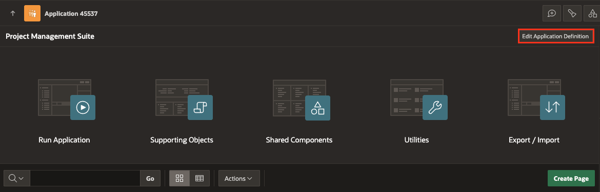

3. In the Application Definition page, Click **AI**.

4. In the **AI** page,
      Under Generative AI > Service: **OpenAI Service**

5. Click **Apply Changes**.

    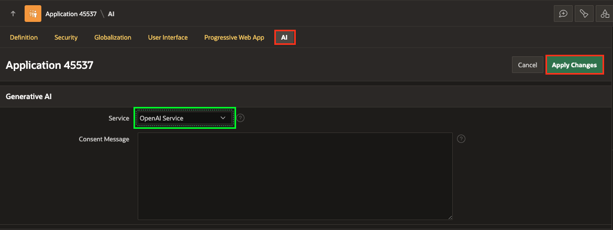

## Task 2: Create an AI Assistant page

1. From your APEX workspace homepage, click **App Builder**.

    

2. Click **Create Page**.

    

3.  Select **Blank Page**.

    

4. Enter the following and click **Next**.

  - Under Page Definition
    - Name: **Inline Assistant**
    - Page Mode: **Modal Dialog**

  Click **Create Page**.
    

    > **Note:** _Note the newly created page number. You will be using this page number in the upcoming steps. In this case my Page Number is 13_


## Task 3: Add Items to the Page

Add three hidden items to store the project ID, project name and project details without the user being able to see it.

1. Navigate to the newly created page.

2. In the Rendering tree (left pane), Right-click on Content Body and click **Create Page Item**.

    

3. In the property editor, set the name and type as follows:

    | Name |  Type  |
    | --- |  --- |
    | P13\_PROJECT\_ID | Hidden |

        

4. Similarly, create two more page items with the details mentioned below.

    | Name |  Type  |
    | --- |  --- |
    | P13\_PROJECT\_NAME | Hidden |
    | P13\_PROJECT\_DETAILS | Hidden |

## Task 4: Add a Region

Add a region to the page to display the Chat Widget.


1. Right click on the **Static Content** region and click **Create Region**.

    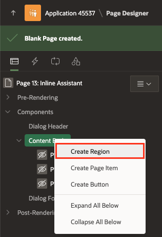

3. In the Property Editor, enter the following:

    - Under **Identification**,
        - For Title - enter **Interact with AI about the Project: &P13\_PROJECT\_NAME.**
        - For Type - select **Static Content**

    - Under **Advanced**,
        - For Static ID, enter **inline-assist**

        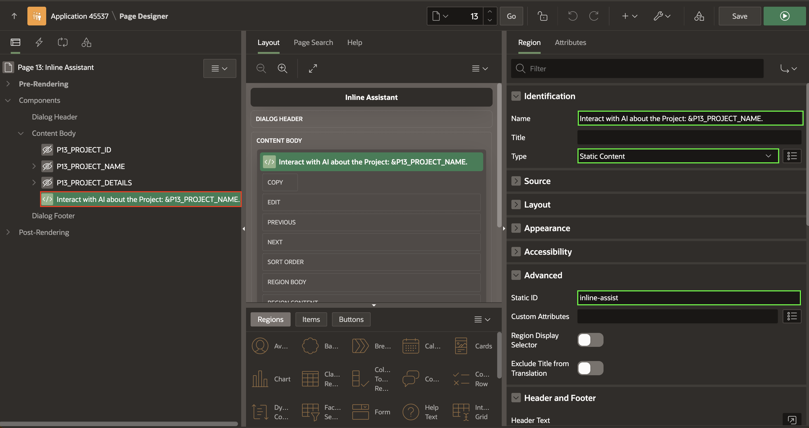


## Task 5: Create a Computation Before header

1. On the Rendering tab (left pane). Under Pre-Rendering, Right-click **Before Header** and click **Create Computation**.

    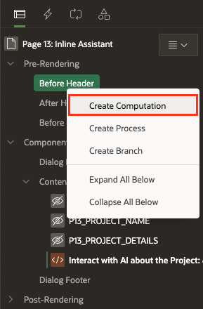

2. In the Property Editor, enter the following:

    - Identification > Item Name: **P13\_PROJECT\_DETAILS**

    - Under Computation
      - Type: **SQL Query(return single value)**
      - For SQL Query - Enter the following SQL:

        ```
        <copy>
        SELECT
            'Project Name : '|| NAME ||chr(10) || chr(13)||
            'Status : '||Status||chr(10) || chr(13)||
            'Project Lead : '||PROJECT_LEAD||chr(10) || chr(13)||
            'Completed Date: '||COMPLETED_DATE||chr(10) || chr(13)||
            'Budget : '|| BUDGET || chr(10) ||chr(13)||
            'COST: '|| COST || chr(10) ||chr(13)||
            'Budget versus Cost: '||BUDGET_V_COST || chr(10) ||chr(13)||
            'Number of Milestones : '||MILESTONES || chr(10) ||chr(13)||
            'Number of Tasks : '|| TASKS || chr(10)||chr(13)
            as prompt_context
        FROM EBA_PROJECTS_V
        WHERE id = :P13_PROJECT_ID;
        </copy>
        ```

    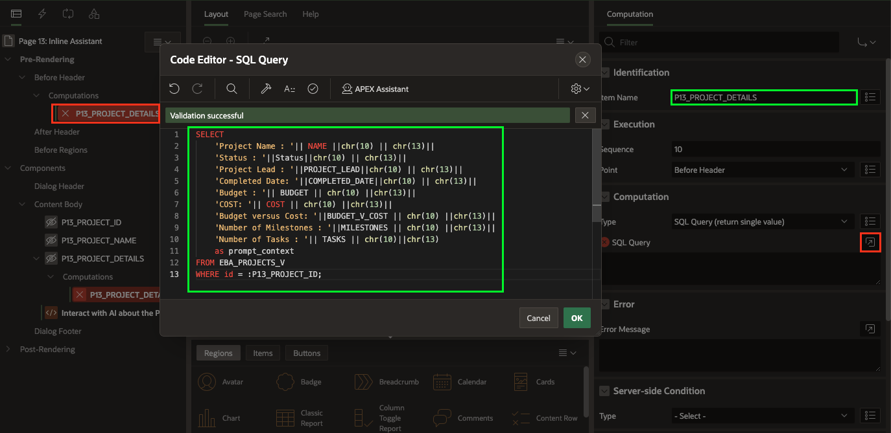

3. Similarly, create another computation under Before Header.

4. Right-click **Before Header** and click **Create Computation**.

    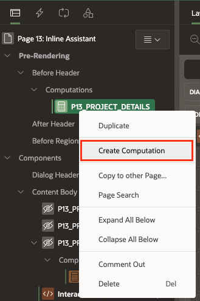

5. In the Property Editor, enter the following:

    - Identification > Item Name: **P13\_PROJECT\_NAME**

    - Under Computation
      - Type: **SQL Query(return single value)**
      - For SQL Query - Enter the following SQL:

        ```
        <copy>
          SELECT
              NAME
          FROM EBA_PROJECTS_V
          WHERE id = :P13_PROJECT_ID;
        </copy>
        ```

    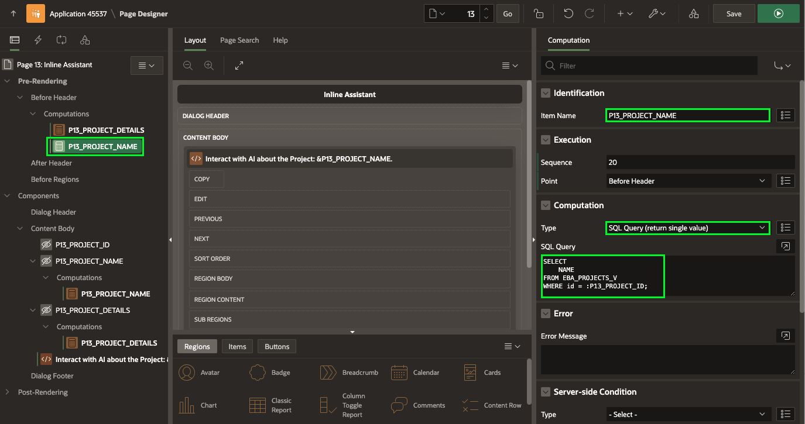

6. Click **Save**.

## Task 6: Add Dynamic Actions
In this task, you will create a dynamic action to:
  - Open an AI assistant
  - Configure the Prompt

1. Navigate to **Dynamic Actions** tab (left pane).

2. Right-click **Page Load** and click **Create Dynamic Action**.

       

3. In the Property Editor, enter the following:

    - Identification > Name: **Open Chat Widget**
    - When > Event - **Page Load**

      

4. Under **True** Action, click **Show**.

5. In the Property Editor, enter the following:

    - Under Identification:
        - Name: **Open Assitant**
        - Action: **Open AI Assistant**

    - Under Generative AI:
        - Service: **Application Default**
        - System Prompt: copy and paste the following:
            > _Use the instructions below to answer all the questions.
            >&P13\_PROJECT\_DETAILS._

        - Welcome Message: copy and paste the following:
            > Hello, welcome to the Chat Widget. Feel free to ask any questions about the selected project.

    - Under Appearance:
        - Display As: **Inline**
        - Container Selector: **#inline-assist**

    

6. Click **Save**.

## Task 7: Configure the Project Dashboard page

1. In the Page Designer toolbar, select Page Selector and Navigate to **Page 1: Project Dashboard**.

    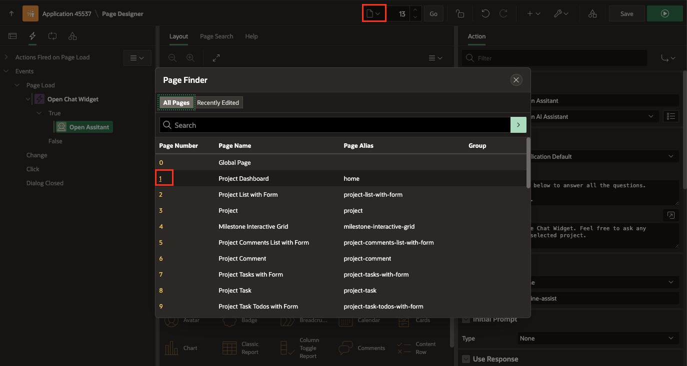

2. On the Rendering tree(left pane), Under Project Dashboard region, Right-click on Actions and click **Create Action**.

    

3. In the Property Editor, enter the following:

    - Under Identification:
        - Type: **Button**
        - Label: **Chat with AI Assistant**

    - Under Link > Target: Click **No Link Defined** and configure the following:
        - Target > Page: **13**
        - Under Set Items:
            - Page: P13\_PROJECT\_ID
            - Value: &ID.
        - Clear / Reset > Clear Cache: **13**

    

## Task 8: Run the New Application

1. In Page Designer, click **Run Application**

    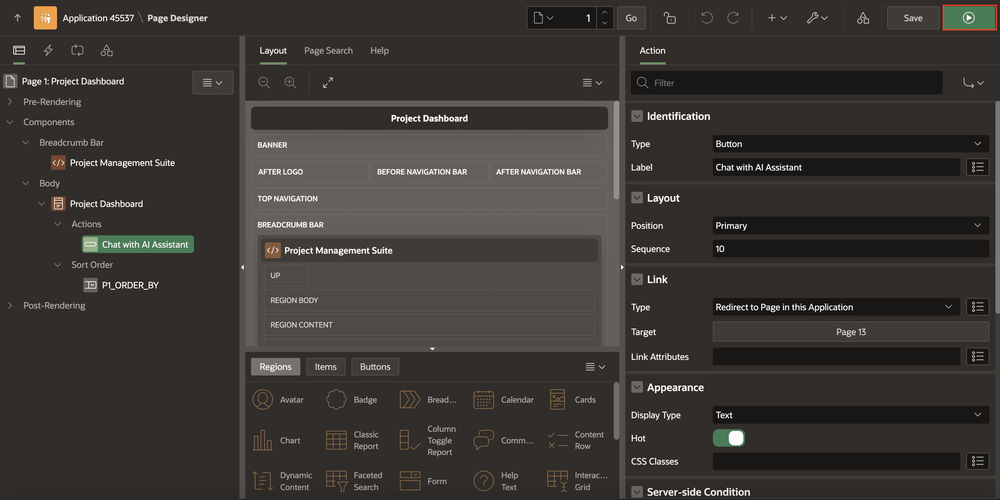

2. In the runtime environment, Click **Chat with AI Assistant** on any Card.

    

3. Play around with the Chat Assistant and ask any question related to the selected project.

    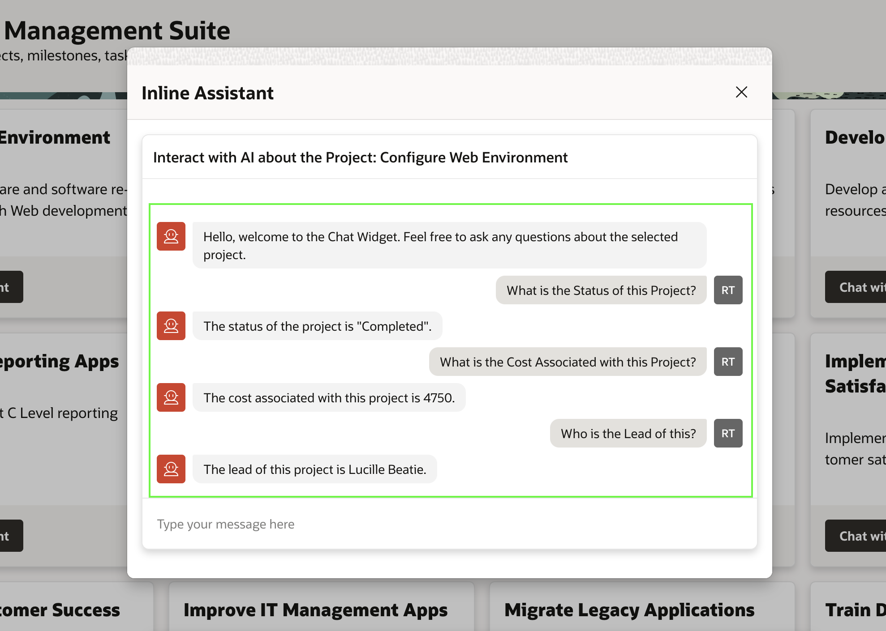


## **Summary**

You now know how to integrate or Open AI Chat assistant in an APEX Application

## **Learn More** - *Useful Links*

- APEX on Autonomous:   [https://apex.oracle.com/autonomous](https://apex.oracle.com/autonomous)
- APEX Collateral:   [https://apex.oracle.com](https://apex.oracle.com)
- Tutorials:   [https://apex.oracle.com/en/learn/tutorials](https://apex.oracle.com/en/learn/tutorials)
- Community:  [https://apex.oracle.com/community](https://apex.oracle.com/community)
- External Site + Slack:   [http://apex.world](http://apex.world)

## **Acknowledgments**

- **Author** - Roopesh Thokala, Senior Product Manager
- **Last Updated By/Date** - Roopesh Thokala, Senior Product Manager, May 2024
