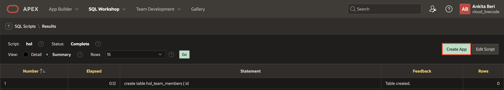
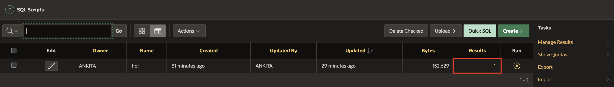
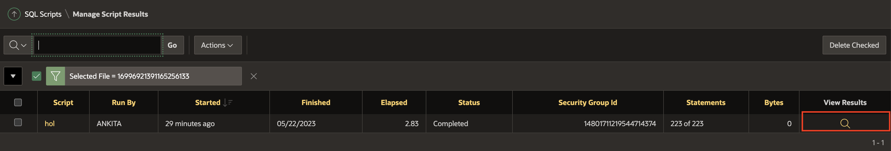
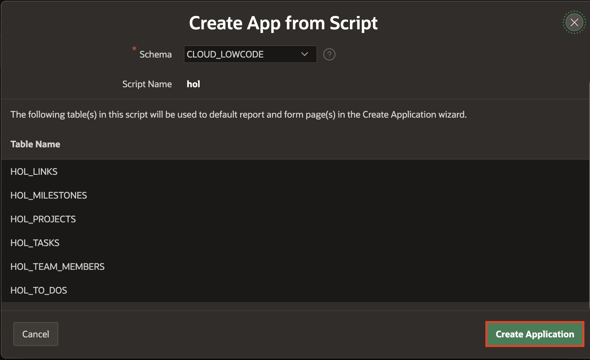
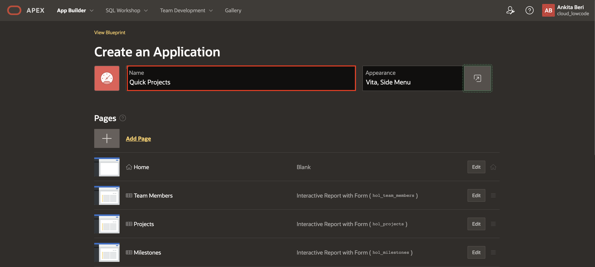
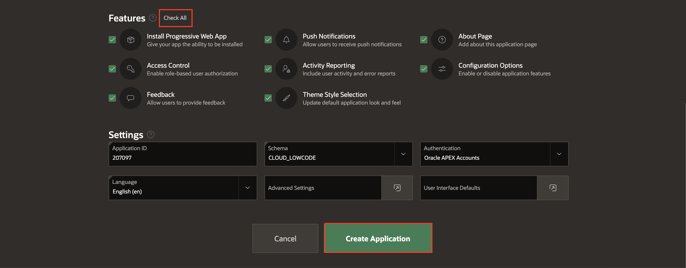
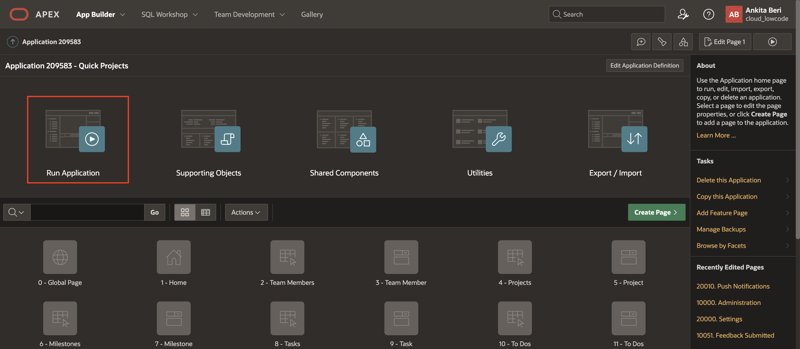
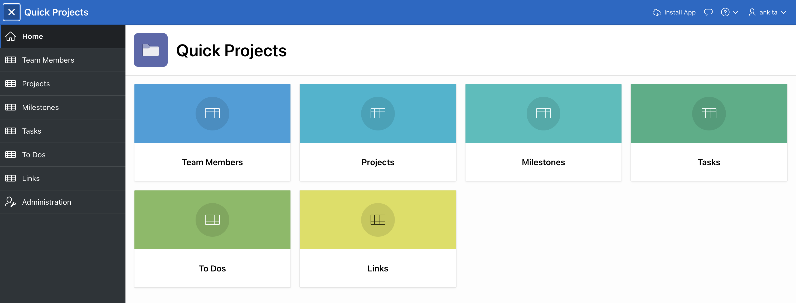
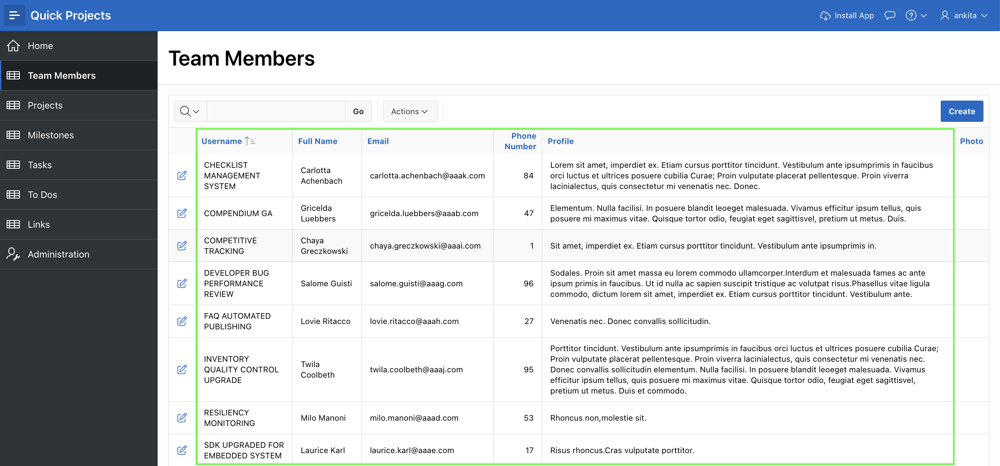

# Use the Create Application Wizard

## Introduction

In this lab you will build an interactive application on the data structures you built in the previous lab.

### Objectives
- Create an interactive application using the tables and data from the previous Lab

### What Do You Need?

- An Oracle Cloud paid account, a LiveLabs account or free trial.
- Data structures with sample data

## Task 1: Run the Create App Wizard

1. From SQL Scripts > Results, click **Create App**

    

    *Note: If you are back on SQL Scripts, and don’t see the “Create App” button perform the following steps:*
    - *Within the Results column, click “1” for the script you just ran.*

    

    - *Under View Results, click the magnifying glass.*

    

    *The results page shown above should now be displayed again.*

2. In the Create App from Script dialog, click **Create Application**

    

3.  On the Create an Application page, for Name enter **Quick Projects**.
    Click **Appearance**.    
    For Theme Style, select **Vita-Slate**.     
    Click **Save Changes**

    

4. For Features, click **Check All**.   
    Click **Create Application**

    

## Task 2: Run the Application

1. Your new application will be displayed in Page Designer.

    Click **Run Application**.

    

2. In the runtime environment, the login page will be displayed.

    Enter your **Username** and **Password** (Username should be Demo).   
    Click **Sign In**.

    The new application will be displayed.

    

3. Play around with the application and explore the different pages.

    Records are displayed in all of the reports which makes page review significantly easier, especially for reports. The fact that the data may not be exactly correct for the columns is not critical, as you can very easily update the data to make it more realistic.

    

## **Summary**
You now know how to utilize the Create Application wizard directly from SQL Scripts to create the first cut of your application.

## **Acknowledgments**

- **Author** - Salim Hlayel, Principle Product Manager
- **Contributors** - Oracle LiveLabs Team (Robbie Ruppel, Functional Lead; Marilyn Isabella Kessinger, QA Intern; Arabella Yao, Product Manager Intern)
- **Last Updated By/Date** - Anoosha Pilli, Product Manager, DB Product Management, June 2020

