# Improve Links

## Introduction

In this lab, you will learn how to modify the URL so that it can be used to display the content listed in a new window.

Estimated Time: 5 minutes

### Objectives
- Improve the Projects List of Values
- Update the Links section of you application

### What Do You Need?

- An Oracle Cloud paid account, a LiveLabs account or free trial.
- An APEX Workspace and application

## Task 1: Adding Columns to the Report.
In a similar fashion to how you modified the To Dos report, you need to update the Links report to include the Project and Milestone columns.

1. From the runtime application, navigate to the Links report page, and then navigate to Page Designer.

    In the Developer Toolbar click **Edit Page11**.
    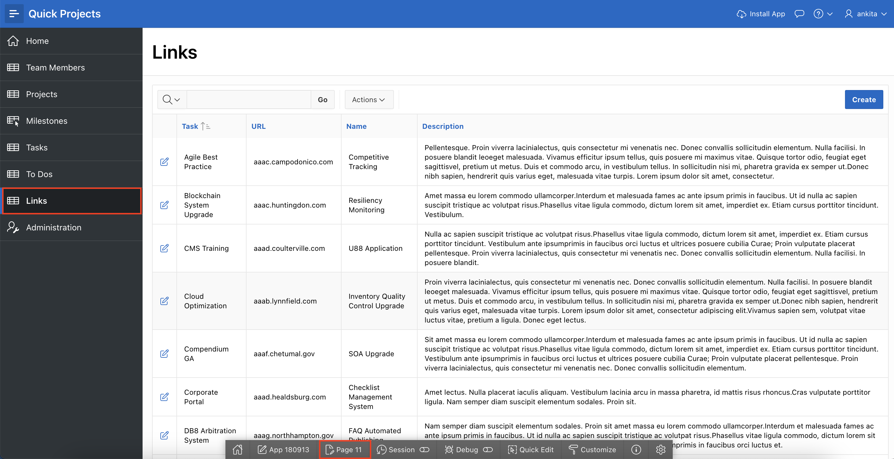

    You should now be in Page Designer with **Page 11: Links** loaded.


2. You need to update the query defined for Links.

    Within Page Designer, in the Rendering tree (left pane), click **Links**.

    In the Property Editor (right pane), for Source > Type, select **SQL Query**.   
    *{Note: The SQL Query will be populated. The SQL statement selects all of the columns from the HOL_LINKS table.}*

    For Source > SQL Query, enter the following:

    ```
    <copy>
    select ID,
       (select p.name
        from hol_projects p, hol_tasks t
        where p.id = t.project_id
        and t.id = l.task_id
       ) project,
       (select m.name
        from hol_milestones m, hol_tasks t
        where m.id = t.milestone_id
        and   t.id = l.task_id
       ) milestone,
       TASK_ID,
       ROW_VERSION,
       URL,
       NAME,
       DESCRIPTION,
       CREATED,
       CREATED_BY,
       UPDATED,
       UPDATED_BY
  from HOL_LINKS l
  </copy>
    ```

    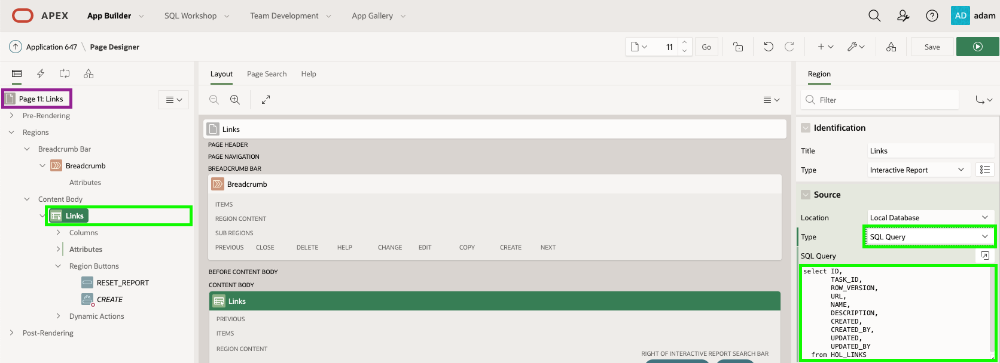

3. The URL column within the report needs to be updated.

    In Page Designer, in the Rendering tree (left pane), under the Links region, expand **Columns**.

    In the list of columns, click **URL**.
    In the Property Editor (right pane), enter the following:
    - Identification > Type - select **Link**
    - Link > Target - click **No Link Defined**, and enter the following -
        - Target > Type - select **URL**
        - Target > URL - enter **#URL#**.   
        *{Note: This will link to the value in the URL column.}*    

        Click **OK**

    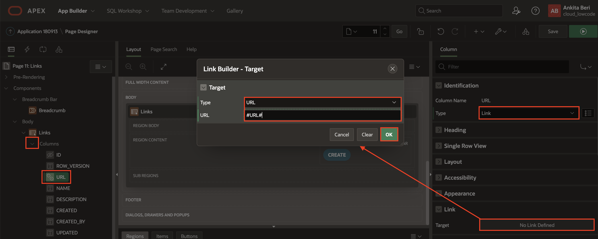

    - Link > Link Attributes - enter **target="_blank"**    
    *{Note: Click on Help (middle pane) to review examples.}*

    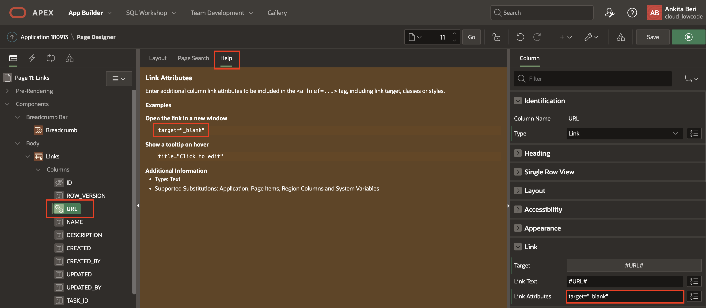

4. Time to review the page.

    In the Page Designer toolbar, click **Save and Run**

    

    *{Note: The URL column is now a link. Clicking on one of the links will bring up a new page, however, the URL is not properly formed as it is missing the hypertext transfer protocol (http or https), and the value is a fictious site address.}*

4. The new columns are placed as the last columns in the report, however, they should be moved to be the first columns.

    In the runtime environment, in the Links report menu, click **Actions**.       
    In the dropdown, select **Columns**.

    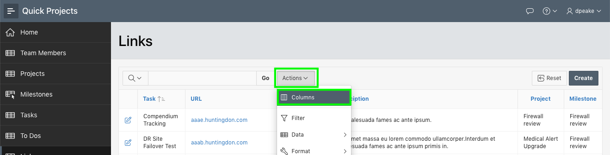

6. In the Select Columns dialog, click **Project**.        
    Hold down the [Shift] key, and click **Milestone**.     
    In the options on the right of the dialog, click **Top**.        
    Click **Apply**.

    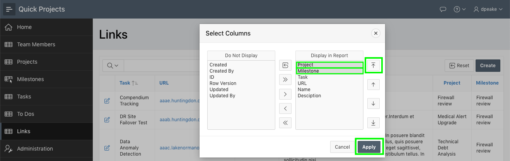

7. You need to save the revised report layout so others will see the new and improved column placement.

    In the runtime environment, in the To Dos report menu, click **Actions**.       
    In the dropdown, select **Report**, and then click **Save Report**.

    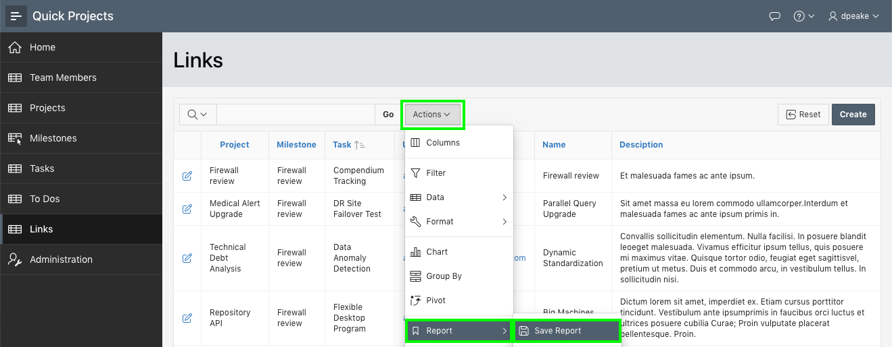

8. In the Save Report dialog, for Save (Only displayed for developers), select **As Default Report Settings**.

    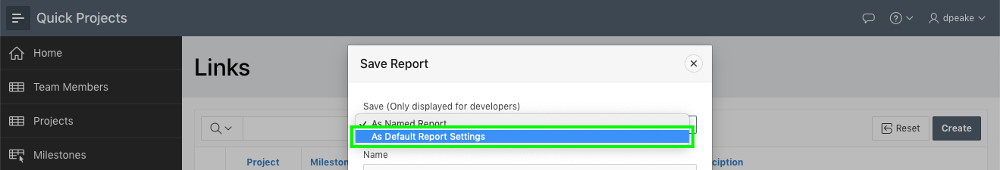

9. In the Save Default Report dialog, click **Apply**.     

    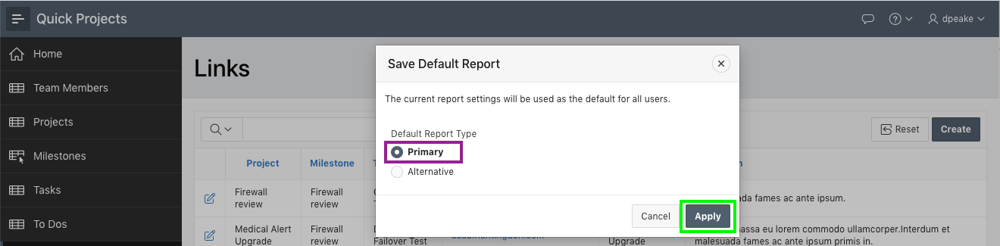

    *{Note: You want to save the report as Primary so that it displayed as you see it now to end users when they navigate to the page.}*

## Task 2: Updating the Form Page.
If you review the Links form page, by clicking an edit icon on the report, you will see that the Task item is not displaying the Project and Milestone. In the previous lab you updated the Tasks LOV to include the extra display columns. Therefore, all you need to do now is update the Task item to be a Popup LOV.

1. From the runtime environment, in the Developer Toolbar, click **Edit Page 12**.
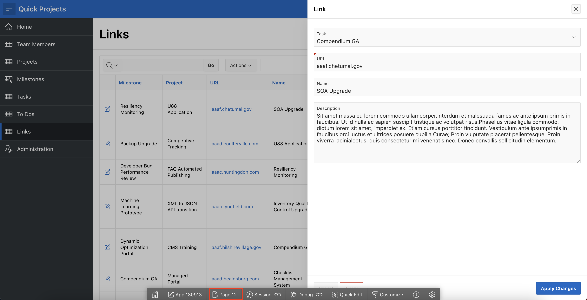

7. Within Page Designer, in the Rendering tree (left pane), click **P12\_TASK_ID**.  
    In the Property Editor (right pane), for Identification > Type, select **Popup LOV**.

    In the Page Designer toolbar, click **Save**.

    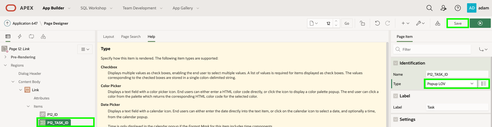   


8. Time to review the completed form page.    

    Navigate to the runtime environment tab or browser.     
    Navigate to **Links** and refresh the page.     
    Click the edit icon for a Link.

    For Task, click the down arrow to display the Task Popup LOV.     
    Enter in a search term and hit [Enter].

    For URL enter [https://apex.oracle.com](https://apex.oracle.com)     
    Click **Apply Changes**.

    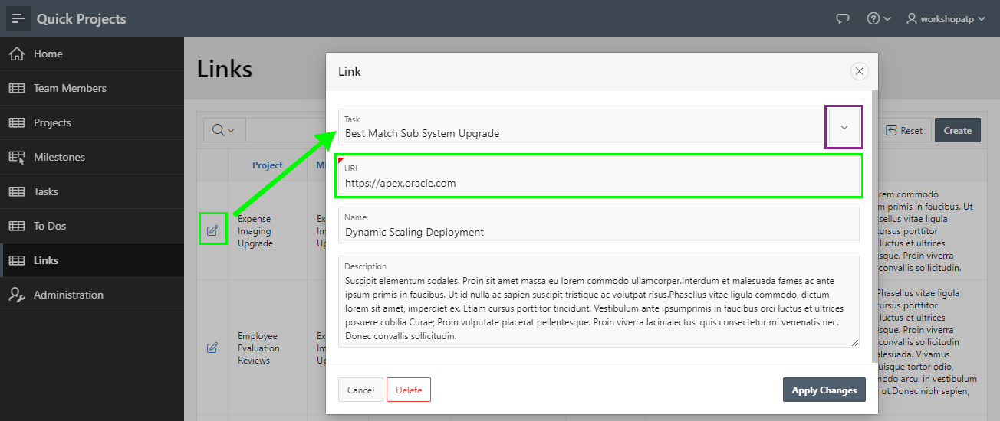    

    On the Links report page, click the URL for the record you just updated.    
    It should bring up the main APEX site in a new browser tab or window.

## **Summary**

You now know how to change a URL value to be a link to a separate browser tab or window.

## **Learn More** - *Useful Links*

- APEX on Autonomous:   [https://apex.oracle.com/autonomous](https://apex.oracle.com/autonomous)
- APEX Collateral:   [https://apex.oracle.com](https://apex.oracle.com)
- Tutorials:   [https://apex.oracle.com/en/learn/tutorials](https://apex.oracle.com/en/learn/tutorials)
- Community:  [https://apex.oracle.com/community](https://apex.oracle.com/community)
- External Site + Slack:   [http://apex.world](http://apex.world)

## **Acknowledgments**

- **Author** - Salim Hlayel, Principle Product Manager
- **Contributors** - Oracle LiveLabs Team (Robbie Ruppel, Functional Lead; Marilyn Isabella Kessinger, QA Intern; Arabella Yao, Product Manager Intern)
- **Last Updated By/Date** - Anoosha Pilli, Product Manager, DB Product Management, June 2020

