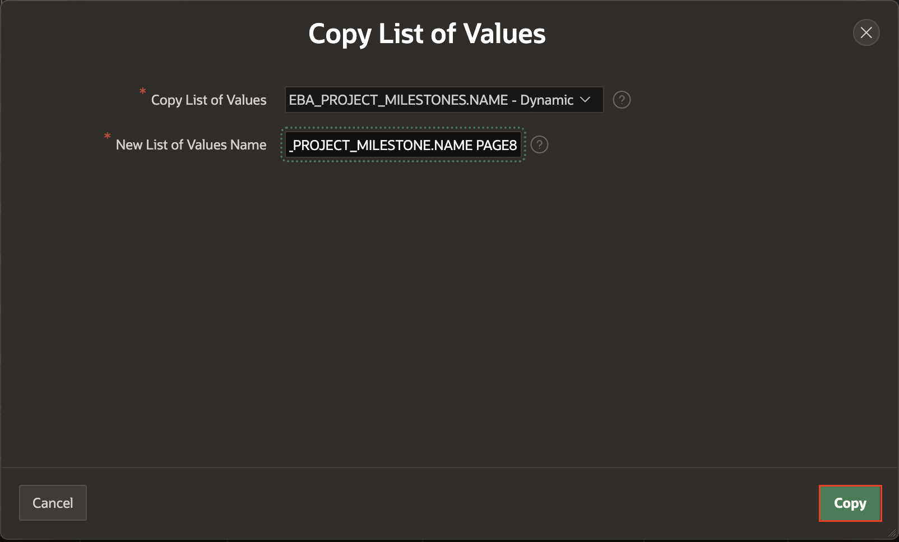

# Improve Tasks

## Introduction

In this lab, you will learn how to improve the Task form page by utilizing improved list of values.

Estimated Time: 15 minutes

### Objectives
- Improve the Projects List of Values
- Update the Task Form page

### What Do You Need?

- An Oracle Cloud paid account, a LiveLabs account or free trial.
- An APEX application

## Task 1: Improving the Projects List of Values.
In the Runtime environment navigate to Tasks and then click the edit icon on any record to bring up the Task form page. Click the select list for Project to see how the project records are displayed.


It would be beneficial to see additional details related to the project.

1. From the runtime application, navigate to the Task form page in Page Designer.

    Given you ran this app from the APEX App Builder, a Developer Toolbar is displayed at the bottom of the screen. *{Note: End users who log directly into the app will not see this toolbar.}*

    In the Developer Toolbar click **Edit Page 8**.

    

    Alternatively, you can also navigate back to the APEX App Builder tab in your browser manually by selecting the appropriate browser tab or window.   
    Once in the App Builder click **8 - Task**.

    

    You should now be in Page Designer with **Page 8: Task** loaded.


2. You need to review the current List of Values used for Projects.

    Within Page Designer, in the Rendering tree (left pane), click **P8\_PROJECT_ID**.

    In the Property Editor (right pane), in the filter enter **list**.      
    *{Note: Entering a filter makes it much easier to find specific attributes, rather than scrolling down through a long list.}*

    In the Property Editor (right pane), click the arrow for **List of Values**.

    

    *{Note: The List of Values > Type is a _Shared Component_ so you will need to edit the appropriate shared component.}*

3. The left pane will change to the Shared Components tab, with the appropriate List of Values highlighted.

    In the Property Editor (right pane), click **Edit Component**.

    

4. Now to add some additional display columns.

    In the List of Values: HOL_PROJECTS.NAME page, click **Select Columns**.

    In the Select Additional Display Columns dialog, double-click the following columns:
    -   STATUS
    -   COMPLETED_DATE
    -   DESCRIPTION

    Click **Update**

    

    Click **Apply Changes**.    
    *{Note: You will be returned to Page Designer with Page 8 selected.}*

5. In order for the extra display values to be visible, you need to update the page item to be a Popup LOV, instead of a Select List.

    Within Page Designer, in Layout (middle pane), click **P8\_PROJECT_ID**

    In the Property Editor (right pane), for Identification > Type, select **Popup LOV**.

    In the Page Designer toolbar, click **Save**.

    

    *{Note: If you click _Run and Save_ instead of _Save_ the page will be saved but a warning will be displayed as this page is a modal page and cannot be run directly from Page Designer.}*

    

6. Time to review the improved Project item!

    Navigate to the runtime environment tab or browser.     
    Navigate to **Tasks** and refresh the page.     
    Click the edit icon for a Task and then click the down arrow on **Project** to review the new Popup LOV.

    

    *{Note: You can adjust the size of the columns and even sort the columns displayed in the Popup LOV.}*

## Task 2: Defining a Cascading List Of Values
If you review the Milestones select list you will notice that all milestones are listed. The listed values should be restricted to only those that are associated with the selected project. In order to do this, you need to define Milestones (**P8\_MILESTONE_ID**) as a _Cascading LOV_. This requires specifying the Parent Item (**P8\_PROJECT_ID**) within the Milestone LOV, and also creating a new list of values statement that utilizes the Parent Item to limit the Milestones returned.

1. Return to the development environment.
2. Within Page Designer, with Page 8 selected, in the Page Designer toolbar, click **Shared Components**.

    

    Alternatively, from the application home page, click **Shared Components**.

    

3. From Shared Components, under Other Components, click **List of Values**.

    

4. From the List of Values page, click **Copy**.

    In the Copy List of Values dialog enter the following:
    - Copy List of Values - select **HOL_MILESTONES.NAME - Dynamic**
    - New List of Values Name - enter **HOL_MILESTONES.NAME PAGE 8**

    Click **Copy**.

    

5. Now the new LOV needs to be customized.

    In the report for List of Values, click **HOL_MILESTONES.NAME PAGE 8**  

    

6. In the List of Values Edit page, for Where Clause enter the following:

    ```
    <copy> project_id = :P8_PROJECT_ID
    </copy>
    ```   

    *{Note: This will restrict the milestones returned based on the current value selected for the project item, _P8\_PROJECT\_ID_.}*

    Click **Apply Changes**.

        

## Task 3: Updating the Task Form Page
1. Now you need to hook up the new LOV to the item on Page 8.  

    From the List of Values page, in the toolbar, click **Edit Page 8**.

    

2. In Page Designer, in the left pane click the **Rendering** icon.
    In the Rendering tree (left pane), click **P8\_MILESTONE_ID**

    In the Property Editor (right pane), enter the following:
    - List of Values - select **HOL_MILESTONES.NAME PAGE 8**
    - Cascading LOV Parent Item(s) - select **P8\_PROJECT_ID**  
    *{Note: It is imperative to indicate the Parent Item otherwise the value for the selected project will not be set and the Milestones LOV would return no values.}

    Click **Save**.

    

3. Time to test the Milestones item.


    Navigate to the runtime environment tab or browser.     
    Navigate to **Tasks** and refresh the page.     
    Click the edit icon for a Task and then click the selector on **Milestone** to review the Cascading LOV.

        

    *{Note: There will regularly be numbers listed instead of a name for the Milestone item. This is due to the fact that when the sample data was created it randomly selected both projects and milestones. The sample data generator does not review each foreign key relationship to determine if the associated table is also a child table of a second foreign key column in the same table.*,

    *To correct this sample data issue, simply select one of the names from the available list, as these represent the milestones associated with the selected project.}*

4. The easiest way to see what happens when there is no project selected is to create a new Task.

    In the runtime environment, return to the Tasks report page by closing the modal page.
    On the Tasks report page, click **Create**.     
    Do _NOT_ select a Project, instead click the selector on **Milestone**.

        

    *{Note: There should be no milestones listed, as there is no project selected.}*

## **Summary**

You now know how to utilize different types of list of values, to display additional columns, and also how to define a Cascading-LOV.

## **Acknowledgments**

- **Author** - Salim Hlayel, Principle Product Manager
- **Contributors** - Oracle LiveLabs Team (Robbie Ruppel, Functional Lead; Marilyn Isabella Kessinger, QA Intern; Arabella Yao, Product Manager Intern)
- **Last Updated By/Date** - Anoosha Pilli, Product Manager, DB Product Management, June 2020

