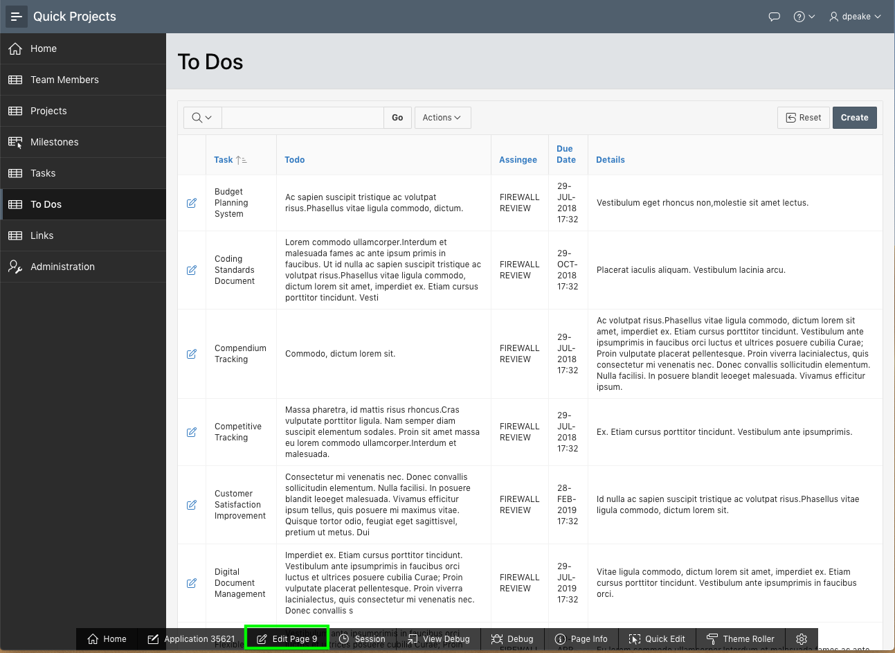
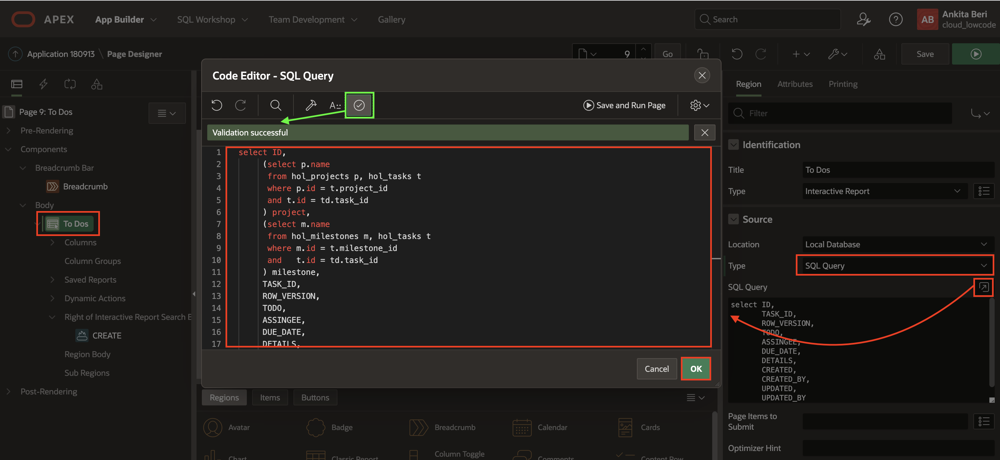
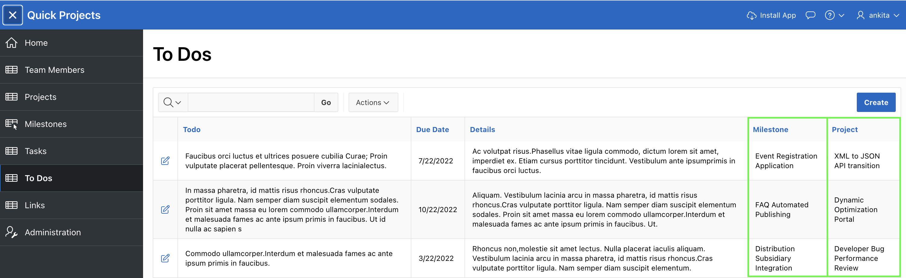
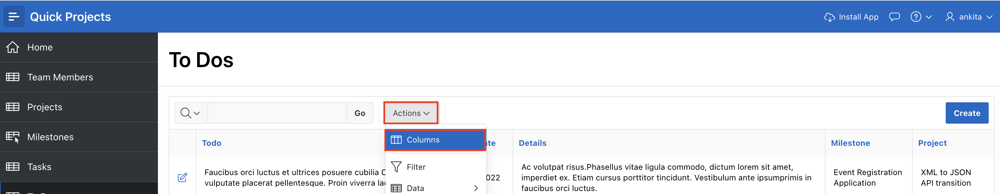
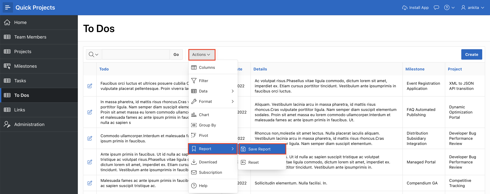
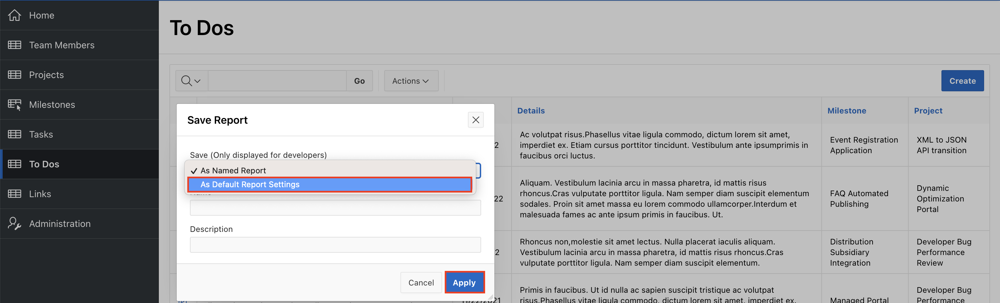
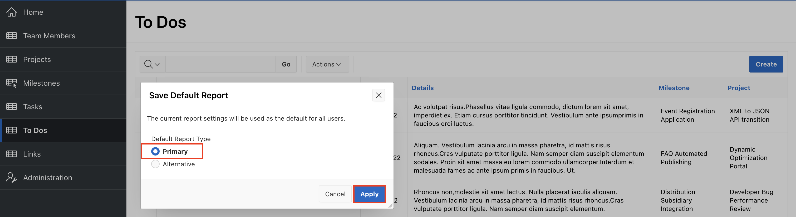
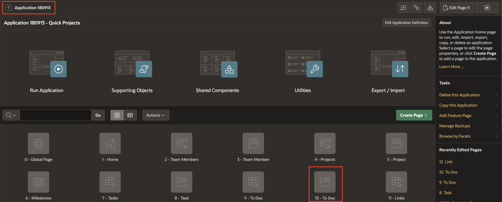

# Improve To Dos

## Introduction

In this lab, you will learn how to add additional columns to a report and improve a list of values.

Estimated Time: 10 minutes

### Objectives
- Improve the Projects List of Values
- Update the applications To Dos section

### What Do You Need?

* An Oracle Cloud paid account, a LiveLabs account or free trial.
* An APEX Workspace and application

## Task 1: Adding Columns to the Report.
In the Runtime environment navigate to To Dos and notice that the report includes the Task but not the associated Project and Milestone. To retrieve these values in the report you need to utilize an SQL which ties in the Projects and Milestones tables. This can be done using inner selects or by joining multiple tables together. For simplicity you are going to implement inner select statements.


1. From the runtime application, navigate to the To Dos report page, and then navigate to Page Designer.

    In the Developer Toolbar click **Edit Page 9**.

    

    You should now be in Page Designer with **Page 9: To Dos** loaded.


2. You need to update the query defined for To Dos.

    Within Page Designer, in the Rendering tree (left pane), click **To Dos**.

    In the Property Editor (right pane), for Source > Type, select **SQL Query**.   
    *{Note: The SQL Query will be populated. The SQL statement selects all of the columns from the HOL\_TO\_DOS table.}*

    For Source > SQL Query, click the **Code Editor** icon.     
    In the Code Editor, enter the following:

    ```
    <copy>select ID,
         (select p.name
          from hol_projects p, hol_tasks t
          where p.id = t.project_id
          and t.id = td.task_id
         ) project,
         (select m.name
          from hol_milestones m, hol_tasks t
          where m.id = t.milestone_id
          and   t.id = td.task_id
         ) milestone,
         TASK_ID,
         ROW_VERSION,
         TODO,
         ASSINGEE,
         DUE_DATE,
         DETAILS,
         CREATED,
         CREATED_BY,
         UPDATED,
         UPDATED_BY
    from HOL_TO_DOS td</copy>
    ```

    In the Code Editor toolbar, click **Validate**.
    Click **OK**.

    

    *{Note: The two inner select statements connect the projects / milestones tables to the tasks table, and the tasks table to the todos table.}*

3. Run the application to ensure the new Project and Milestone columns display correctly.

    In the Page Designer toolbar, click **Save and Run**.

    

4. The new project and milestone columns are placed as the last columns in the report, however, they should be moved to be the first columns.

    In the runtime environment, in the To Dos report menu, click **Actions**.       
    In the dropdown, select **Columns**.

    

5. In the Select Columns dialog, click **Project**.        
    Hold down the [Shift] key, and click **Milestone**.     
    In the options on the right of the dialog, click **Top**.        
    Click **Apply**.

    

6. You need to save the revised report layout so others will see the new and improved column placement.

    In the runtime environment, in the To Dos report menu, click **Actions**.       
    In the dropdown, select **Report**, and then click **Save Report**.

    

7.  In the Save Report dialog, for Save (Only displayed for developers), select **As Default Report Settings**.

    

8. In the Save Default Report dialog, click **Apply**.     

    

    *{Note: You want to save the report as Primary so that it displayed as you see it now to end users when they navigate to the page.}*

## Task 2: Updating the Tasks LOV.
If you review the To Dos form page, by clicking an edit icon on the report, you will see that Project and Milestone are not on the form page either. To simplify data entry, you will change the Tasks select list to a Popup LOV and include the Project and Milestone.

This same LOV is used on the Links form page so we can reuse it there as well.

1. From the runtime environment, in the Developer Toolbar, click **Application xxxxx**.

2. From the application home page, click **Shared Components**.

    

3. From Shared Components, under Other Components, click **List of Values**.

4. From the List of Values page, click **HOL_TASKS.NAME**.

5. In the List of Values page, enter the following:
    - Source > Source Type - click **SQL Query**
    - Source > SQL Query - enter the following -

        ```
        <copy>
        select id
        ,      (select p.name from hol_projects p where p.id = t.project_id) project
        ,      (select m.name from hol_milestones m where m.id = t.milestone_id) milestone
        ,      name
        from hol_tasks t
        </copy>
        ```

    - Column Mapping > Return - select **ID**
    - Column Mapping > Display - select **NAME**
    - Column Mapping > Default Sort - select **NAME**

    

    To display the extra columns, click **Select Columns**

    On the Select Additional Display Columns, performing the following actions:     
    - Move **PROJECT (Varchar2)** to the right pane             
    - Move **MILESTONE (Varchar2)** to the right pane   
    - Move **NAME (Varchar2)** to be below Milestone in the right pane      
    *{Note: The ID column must be included in the list, however, it will be marked as Visible = _No_ so will not be displayed.}*

    Click **Update**.

    

    In the List of Values toolbar, click **Apply Changes**.

5. On the To Do form page you will need to update the item type for Task.

    From Shared Components, within the breadcrumbs, click **Application xxxxx**.  
    From the application home page, in the list of pages, click **10 - To Dos**.

    

7. Within Page Designer, in the Rendering tree (left pane), click **P10\_TASK_ID**.  
    In the Property Editor (right pane), for Identification > Type, select **Popup LOV**.

       

7. In the Page Designer toolbar, click **Save**.

8. Time to review the completed form page.    

    Navigate to the runtime environment tab or browser.     
    Navigate to **To Dos** and refresh the page.     
    Click the edit icon for a To Do.

    For Task, click the down arrow to display the Task Popup LOV.     
    Enter in a search term and hit [Enter].

        

## **Summary**

You now know how to enhance report and list of value queries to display related details. [

## **Acknowledgments**

- **Author** - Salim Hlayel, Principle Product Manager
- **Contributors** - Oracle LiveLabs Team (Robbie Ruppel, Functional Lead; Marilyn Isabella Kessinger, QA Intern; Arabella Yao, Product Manager Intern)
- **Last Updated By/Date** - Salim Hlayel, Principle Product Manager, November 2020

