# Create Generative AI Service and Install a sample dataset

## Introduction

In this lab, you learn to install sample tables and views from Sample Datasets. This particular sample dataset is a collection of project status, projects, project milestones, tasks, To-Dos, task links, project comments used to manage the Projects efficiently. Then, you learn how to configure Generative AI Services that you will use to create the Application, generate SQL queries and build a Chatbot. Make sure you have a secure key to access Open AI or Cohere GenAI Services.

Estimated Time: 15 minutes

### Objectives
In this lab, you will:
- Install a sample dataset into your Oracle APEX Workspace
- Create/Configure Generative AI Services into your APEX Workspace

### What You will Need
- Signup and Get access for one of the supported Generative AI Services like OpenAI or Cohere.
- An Oracle Cloud paid account, or free trial.
- An APEX Workspace and application

## Task 1: Create Generative AI Services

1. Log into your workspace.

2. From your APEX workspace home page, as shown below, click **App Builder**

    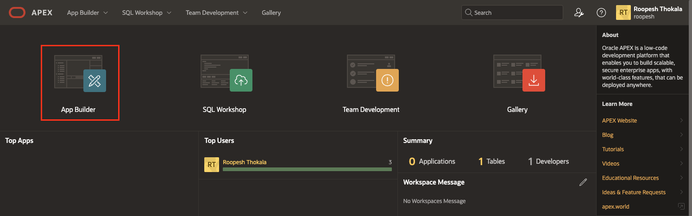

3. On the **App Builder** page, select **Workspace Utilities**.

    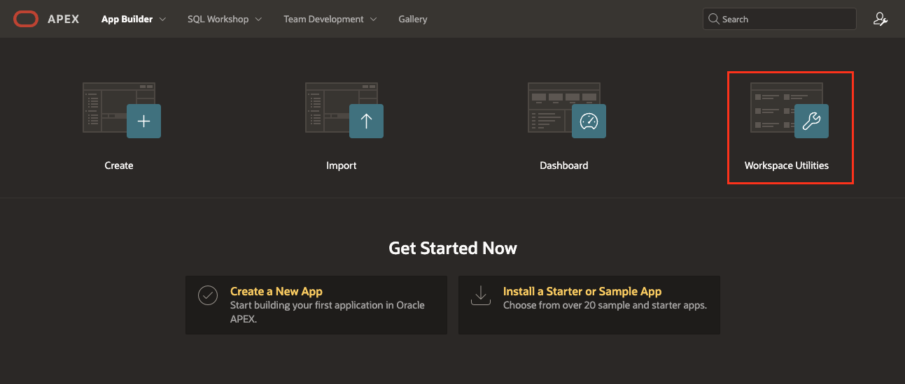

4. Under Workspace Utilities, Click **Generative AI**.

    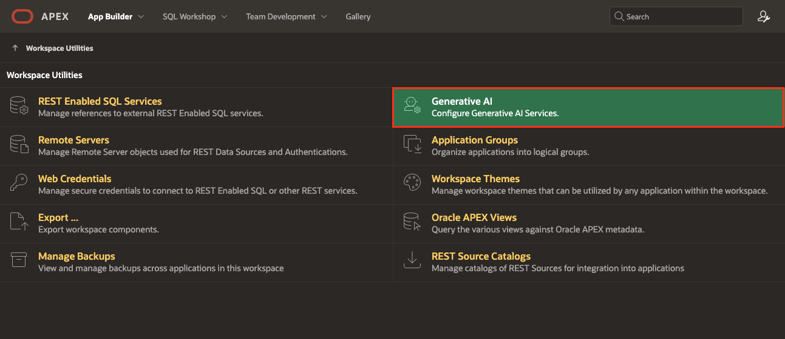

5. On the **Generative AI Services** page, Click **Create**.

    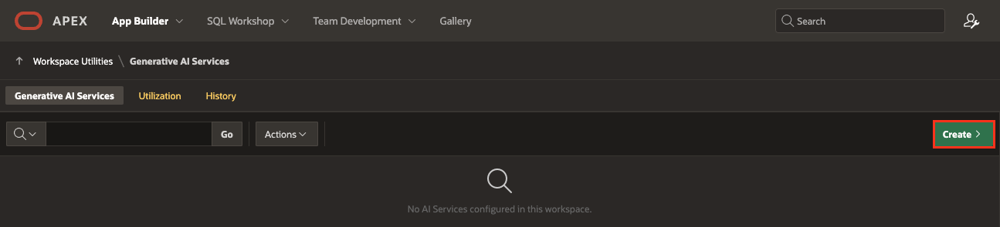

6. Under **Create/Edit** Generative AI Service Page, enter the following Details.
    - Under Indentification
      - AI Providier: **Open AI**
      - Name: **OpenAI Service**
    - Settings > Used by App Builder: **Toggle On**
    - Credentials > API Key: **Enter the API Key you procured from OpenAI**
    - Advanced > AI Model: **gpt-4-turbo**

    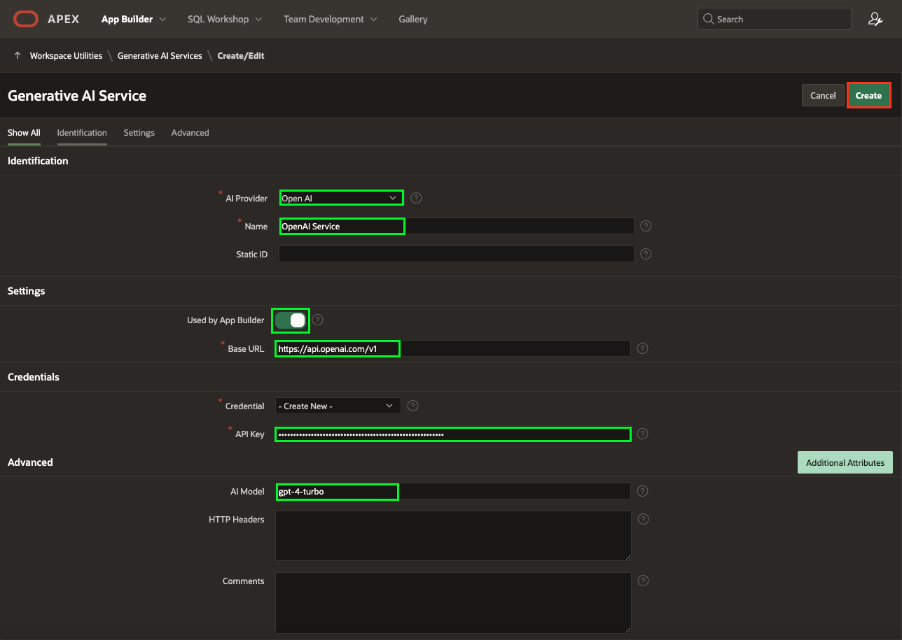

    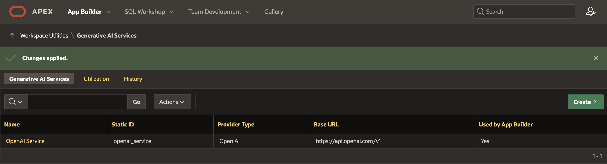

## Task 2: Create Project Data Tables

1. Log into your workspace.
2. From your APEX workspace home page, as shown below, select the down-arrow to the right of  **SQL Workshop**, then click the arrow to the right of  **Utilities**, and choose **Sample Datasets**.

    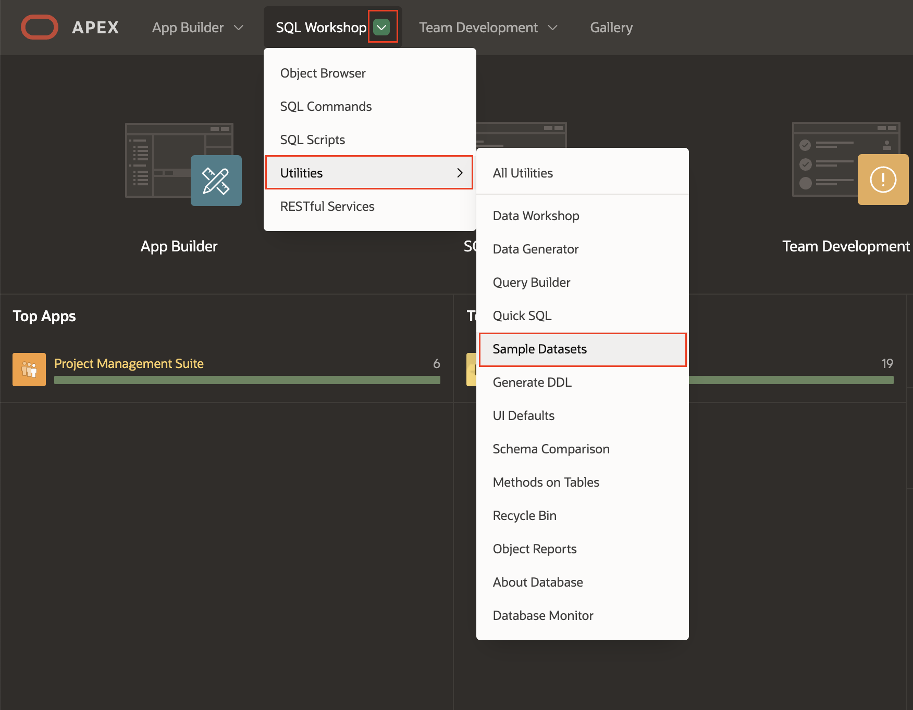

3. On the **Projects Data** row, click **Install**.

    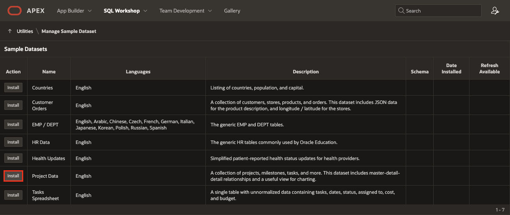

4. Click **Next**.

   *The schema name defaults to your current schema so will be different from the schema name shown below.*
    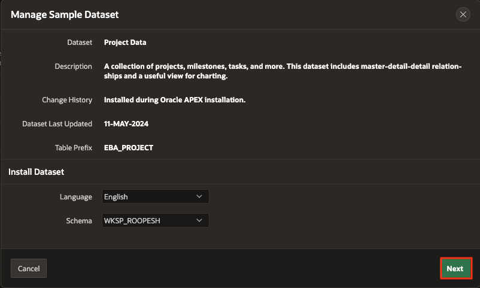

5. Click **Install Dataset**.

    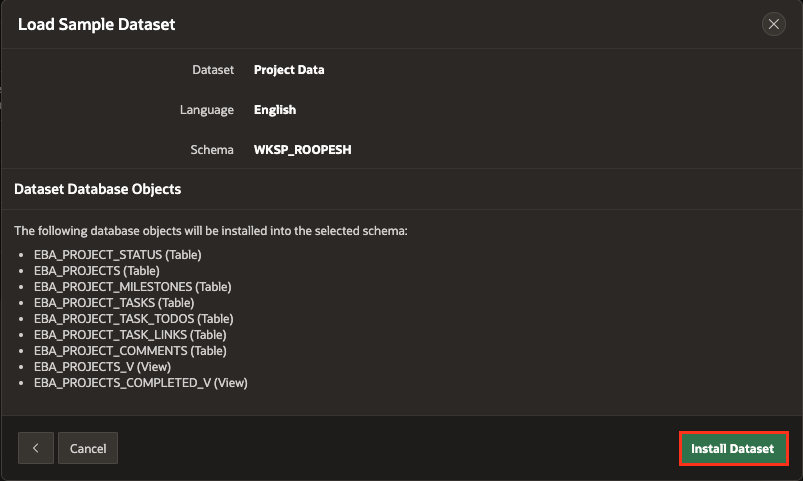

6. Click **Exit**.

    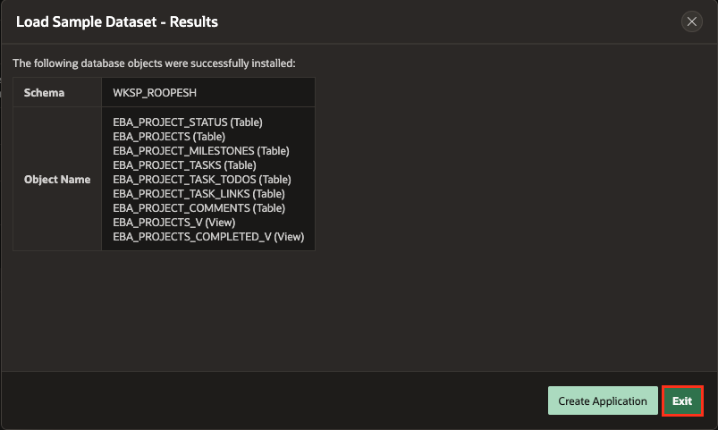

>**Note:** You do NOT want to click Create Application, as you will manually create an application later.

## Task 3: Review Database Objects

1. In the Oracle APEX Home, click **SQL Workshop**.

2. Click **Object Browser**.

    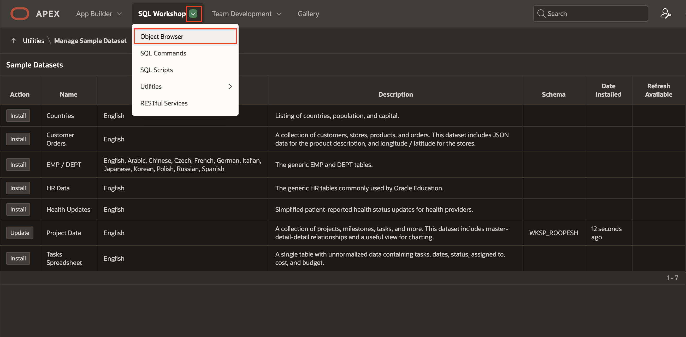

3. Click on tables to view different tables and then you will see various tabs, such as Data, Constraints, and so forth, to review the table details.

    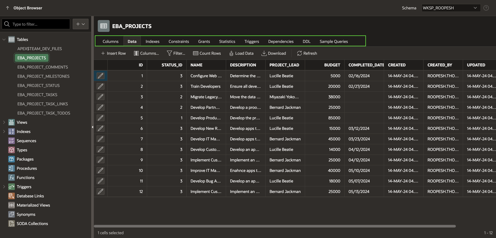

This completes Lab 1. You now know how to install a sample dataset. You may now **proceed to the next lab**.

## Acknowledgments

- **Author** - Roopesh Thokala, Senior Product Manager
- **Last Updated By/Date** - Roopesh Thokala, Senior Product Manager, May 2024
