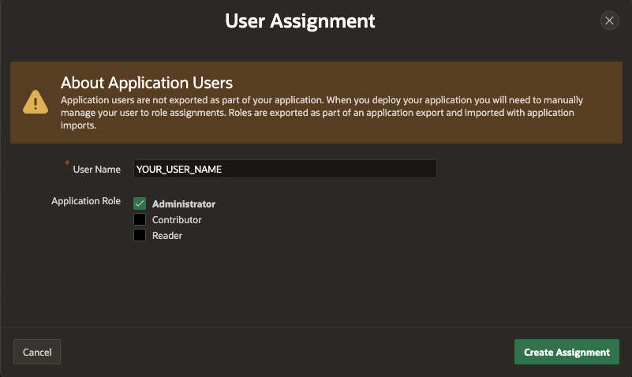

# Smart Project Management App with AI-Assisted Development in Oracle APEX

## Introduction

In this lab, you will build a dynamic application using Oracle APEX AI Assistant. You will start by installing a sample project management dataset, then create an initial application with the help of an AI Assistant, demonstrating how AI can accelerate development. Next, you will customize your application the lowcode way, making quick adjustments using pre-built components. You will also enhance your application by writing SQL queries with APEX Assistant, simplifying complex query construction. Finally, you will implement an AI chat assistant using Dynamic Actions and Chat Widget, creating a responsive chat interface for real-time user engagement. By the end of this lab, you'll have practical knowledge in using AI with APEX to efficiently build and customize powerful applications.

Estimated Time: 55 minutes

### Lab Objectives

* Obtain a free development environment
* Install a Sample dataset
* Create an application on the new data structures using AI Assistant
* Refine the application by generating SQL with AI APEX assistant
* Create an AI Chat Assistant to inquire about the Project.

*Note: This workshop assumes you are using Oracle APEX 24.1. Some of the features might not be available in prior releases and the instructions, flow, and screenshots might differ if you use an older version of Oracle APEX.*

### **Let's Get Started!**

- Click on **Getting Started** from the menu on the right. If you already have an Oracle Cloud account, click on **Lab 1: Configure AI Service and Define New Data Structures**.

*Note: If you have a **Free Trial** account, when your Free Trial expires your account will be converted to an **Always Free** account. You will not be able to conduct Free Tier workshops unless the Always Free environment is available. **[Click here for the Free Tier FAQ page.](https://www.oracle.com/cloud/free/faq.html)**

## Downloads

If you are stuck or the App is not working as expected, you can download and install the completed App as follows:

1. **[Click here](https://c4u04.objectstorage.us-ashburn-1.oci.customer-oci.com/p/EcTjWk2IuZPZeNnD_fYMcgUhdNDIDA6rt9gaFj_WZMiL7VvxPBNMY60837hu5hga/n/c4u04/b/livelabsfiles/o/Smart-Project-App.sql)** to download the completed application.
2. Import the Smart-Project-App.sql file into your workspace. Follow the Install Application wizard steps to install the app along with the Supporting Objects.
3. Once the application is installed, follow the below steps to update the Web Credentials.
    - Click the Down Arrow next to **App Builder**, click ****Workspace Utilities** and then select **All Workspace Utilities**.
        

    - Select **Web Credentials**.
    - Click **Credentials for openai service**.
        

    - In the **Web Credentials** Page,
      - For Credential Name, Enter **Authorization**
      - For Credential Secret, Enter **Bearer YOUR_KEY**
        

4. Now, add the username that you will use to log in to the **Project Management Suite** to the **Access Control List**.
5. Navigate to the **Project Management Suite** application, click **Shared Components**.
6. In the Shared components, Under **Security**, select **Application Access Control**. In the **Application Access Control** Page, perform the following steps:
    - Under User Role Assignments, click **Add User Role Assignment**
    - In the User Assignment Page,
        - For **User Name**, Enter **YOUR\_USER\_NAME**
        - For **Application Role**, Select **Administrator**.
        

## Learn More - *Useful Links*

- APEX on Autonomous:   [https://apex.oracle.com/autonomous](https://apex.oracle.com/autonomous)
- APEX Collateral:   [https://apex.oracle.com](https://apex.oracle.com)
- Tutorials:   [https://apex.oracle.com/en/learn/tutorials](https://apex.oracle.com/en/learn/tutorials)
- Community:  [https://apex.oracle.com/community](https://apex.oracle.com/community)
- External Site + Slack:   [http://apex.world](http://apex.world)

## Acknowledgments

- **Author** - Roopesh Thokala, Senior Product Manager
- **Last Updated By/Date** - Roopesh Thokala, Senior Product Manager, May 2024
